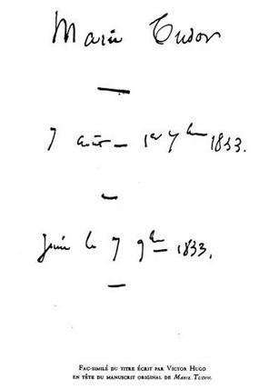

# [[{.calibre10} MARIE TUDOR]{.calibre2}]{.calibre_55} {#filepos27021874 .calibre_}

:::::: calibre_20
::::: calibre_3
::: calibre_16

------------------------------------------------------------------------

::: calibre_16

:::::
::::::

[(1833)]{.calibre_3}

[Victor Hugo]{.calibre_10}

[[THÉÂTRE
]{.bold}]{.calibre_21}

:::::: calibre_22
::::: calibre_21
[ ]{.bold}

::: calibre_16

------------------------------------------------------------------------

::: calibre_16

:::::
::::::

[
Pour toutes demandes ou suggestions]{.calibre_3}

[
!{.calibre3}]{.calibre_10}

[Marie Tudor, fille d'Henry VIII[[[[^\[101\]^]{.calibre_12}]{.underline}]{.calibre_4}](index_split_4205.html#filepos29608966){#filepos27023755}]{.calibre_3}

## [[[]{.calibre2}[]{.calibre2}[]{.calibre2}[]{.calibre2}[]{.calibre2}[]{.calibre2}[]{.calibre2}[]{.calibre2}[]{.calibre2}[]{.calibre2}[]{.calibre2}[]{.calibre2}[]{.calibre2}[]{.calibre2}[]{.calibre2}[]{.calibre2}[]{.calibre2}[]{.calibre2}[]{.calibre2}[]{.calibre2}[]{.calibre2}[]{.calibre2}[]{.calibre2}[Table des matières]{.calibre2}]{.bold1}]{.calibre_24} {#calibre_pb_4687 .calibre_57}

::: calibre_52

[]{.calibre_10}

> [[[[[Préambule]{.calibre9}]{.underline}]{.calibre_4}](index_split_3846.html#filepos27033582)]{.calibre_10}

> [[[[[Personnages]{.calibre9}]{.underline}]{.calibre_4}](index_split_3847.html#filepos27043369)]{.calibre_10}

> [[[[[Première journée]{.calibre9}]{.underline}]{.calibre_4}](index_split_3848.html#filepos27044158)]{.calibre_10}

> [[[[[Scène I]{.calibre16}]{.underline}]{.calibre_4}](index_split_3849.html#filepos27044926)]{.calibre_10}

> [[[[[Scène II]{.calibre16}]{.underline}]{.calibre_4}](index_split_3850.html#filepos27055841)]{.calibre_10}

> [[[[[Scène III]{.calibre16}]{.underline}]{.calibre_4}](index_split_3851.html#filepos27069039)]{.calibre_10}

> [[[[[Scène IV]{.calibre16}]{.underline}]{.calibre_4}](index_split_3852.html#filepos27078404)]{.calibre_10}

> [[[[[Scène V]{.calibre16}]{.underline}]{.calibre_4}](index_split_3853.html#filepos27083306)]{.calibre_10}

> [[[[[Scène VI]{.calibre16}]{.underline}]{.calibre_4}](index_split_3854.html#filepos27086740)]{.calibre_10}

> [[[[[Scène VII]{.calibre16}]{.underline}]{.calibre_4}](index_split_3855.html#filepos27104159)]{.calibre_10}

> [[[[[Scène VIII]{.calibre16}]{.underline}]{.calibre_4}](index_split_3856.html#filepos27113201)]{.calibre_10}

> [[[[[Scène IX]{.calibre16}]{.underline}]{.calibre_4}](index_split_3857.html#filepos27115680)]{.calibre_10}

> [[[[[Deuxième journée]{.calibre9}]{.underline}]{.calibre_4}](index_split_3858.html#filepos27117955)]{.calibre_10}

> [[[[[Scène I]{.calibre16}]{.underline}]{.calibre_4}](index_split_3859.html#filepos27118712)]{.calibre_10}

> [[[[[Scène II]{.calibre16}]{.underline}]{.calibre_4}](index_split_3860.html#filepos27127713)]{.calibre_10}

> [[[[[Scène III]{.calibre16}]{.underline}]{.calibre_4}](index_split_3861.html#filepos27132111)]{.calibre_10}

> [[[[[Scène IV]{.calibre16}]{.underline}]{.calibre_4}](index_split_3862.html#filepos27135980)]{.calibre_10}

> [[[[[Scène V]{.calibre16}]{.underline}]{.calibre_4}](index_split_3863.html#filepos27150596)]{.calibre_10}

> [[[[[Scène VI]{.calibre16}]{.underline}]{.calibre_4}](index_split_3864.html#filepos27155163)]{.calibre_10}

> [[[[[Scène VII]{.calibre16}]{.underline}]{.calibre_4}](index_split_3865.html#filepos27157797)]{.calibre_10}

> [[[[[Scène VIII]{.calibre16}]{.underline}]{.calibre_4}](index_split_3866.html#filepos27172478)]{.calibre_10}

> [[[[[Scène IX]{.calibre16}]{.underline}]{.calibre_4}](index_split_3867.html#filepos27181074)]{.calibre_10}

> [[[[[Troisième journée]{.calibre9}]{.underline}]{.calibre_4}](index_split_3868.html#filepos27183371)]{.calibre_10}

> [[[[[Première partie]{.calibre16}]{.underline}]{.calibre_4}](index_split_3869.html#filepos27184279)]{.calibre_10}

> [[[[[Scène I]{.calibre16}]{.underline}]{.calibre_4}](index_split_3870.html#filepos27185341)]{.calibre_10}

> [[[[[Scène II]{.calibre16}]{.underline}]{.calibre_4}](index_split_3871.html#filepos27192251)]{.calibre_10}

> [[[[[Scène III]{.calibre16}]{.underline}]{.calibre_4}](index_split_3872.html#filepos27194550)]{.calibre_10}

> [[[[[Scène IV]{.calibre16}]{.underline}]{.calibre_4}](index_split_3873.html#filepos27196682)]{.calibre_10}

> [[[[[Scène V]{.calibre16}]{.underline}]{.calibre_4}](index_split_3874.html#filepos27204792)]{.calibre_10}

> [[[[[Scène VI]{.calibre16}]{.underline}]{.calibre_4}](index_split_3875.html#filepos27208983)]{.calibre_10}

> [[[[[Scène VII]{.calibre16}]{.underline}]{.calibre_4}](index_split_3876.html#filepos27211487)]{.calibre_10}

> [[[[[Scène VIII]{.calibre16}]{.underline}]{.calibre_4}](index_split_3877.html#filepos27222279)]{.calibre_10}

> [[[[[Scène IX]{.calibre16}]{.underline}]{.calibre_4}](index_split_3878.html#filepos27227815)]{.calibre_10}

> [[[[[Scène X]{.calibre16}]{.underline}]{.calibre_4}](index_split_3879.html#filepos27239329)]{.calibre_10}

> [[[[[Deuxième partie]{.calibre16}]{.underline}]{.calibre_4}](index_split_3880.html#filepos27242718)]{.calibre_10}

> [[[[[Scène I]{.calibre16}]{.underline}]{.calibre_4}](index_split_3881.html#filepos27245009)]{.calibre_10}

> [[[[[Scène II]{.calibre16}]{.underline}]{.calibre_4}](index_split_3882.html#filepos27254262)]{.calibre_10}

[[
{.calibre3}]{.italic}]{.calibre_10}

## [[[]{.calibre2}[]{.calibre2}[]{.calibre2}[]{.calibre2}[]{.calibre2}[]{.calibre2}[]{.calibre2}[]{.calibre2}[]{.calibre2}[]{.calibre2}[]{.calibre2}[]{.calibre2}[]{.calibre2}[]{.calibre2}[]{.calibre2}[]{.calibre2}[]{.calibre2}[]{.calibre2}[]{.calibre2}[]{.calibre2}[]{.calibre2}[]{.calibre2}[Préambule]{.calibre2}]{.bold1}]{.calibre_24} {#calibre_pb_4690 .calibre_57}

::: calibre_52

[ ]{.calibre4}

[Il y a deux manières de passionner la foule au théâtre : par le grand et par le vrai. Le grand prend les masses, le vrai saisit l'individu.]{.calibre4}

[Le but du poète dramatique, quel que soit d'ailleurs l'ensemble de ses idées sur l'art, doit donc toujours être, avant tout, de chercher le grand, comme Corneille, ou le vrai, comme Molière ; ou, mieux encore, et c'est ici le plus haut sommet où puisse monter le génie, d'atteindre tout à la fois le grand et le vrai, le grand dans le vrai, le vrai dans le grand, comme Shakespeare.]{.calibre4}

[Car, remarquons-le en passant, il a été donné à Shakespeare, et c'est ce qui fait la souveraineté de son génie, de concilier, d'unir, d'amalgamer sans cesse dans son oeuvre ces deux qualités, la vérité et la grandeur, qualités presque opposées, ou tout au moins tellement distinctes, que le défaut de chacune d'elles constitue le contraire de l'autre. L'écueil du vrai, c'est le petit, l'écueil du grand, c'est le faux. Dans tous les ouvrages de Shakespeare, il y a du grand qui est vrai, et du vrai qui est grand. Au centre de toutes ses créations, on retrouve le point d'intersection de la grandeur et de la vérité ; et là où les choses grandes et les choses vraies se croisent, l'art est complet. Shakespeare, comme Michel-Ange, semble avoir été créé pour résoudre ce problème étrange dont le simple énoncé paraît absurde : --- rester toujours dans la nature, tout en en sortant quelquefois. --- Shakespeare exagère les proportions, mais il maintient les rapports. Admirable toute-puissance du poète ! Il fait des choses plus hautes que nous qui vivent comme nous. Hamlet, par exemple, est aussi vrai qu'aucun de nous, et plus grand. Hamlet est colossal, et pourtant réel. C'est que Hamlet, ce n'est pas vous, ce n'est pas moi, c'est nous tous. Hamlet, ce n'est pas un homme, c'est L'homme.]{.calibre4}

[Dégager perpétuellement le grand à travers le vrai, le vrai à travers le grand, tel est donc, selon l'auteur de ce drame, et en maintenant, du reste, toutes les autres idées qu'il a pu développer ailleurs sur ces matières, tel est le but du poète au théâtre. Et ces deux mots, grand et vrai, renferment tout. La vérité contient la moralité, le grand contient le beau.]{.calibre4}

[Ce but, on ne lui supposera pas la présomption de croire qu'il l'a jamais atteint, ou même qu'il pourra jamais l'atteindre ; mais on lui permettra de se rendre à lui-même publiquement ce témoignage, qu'il n'en a jamais cherché d'autre au théâtre jusqu'à ce jour. Le nouveau drame qu'il vient de faire représenter est un effort de plus vers ce but rayonnant. Quelle est, en effet, la pensée qu'il a tenté de réaliser dans [Marie Tudor]{.italic} ? La voici. Une reine qui soit une femme. Grande comme reine. Vraie comme femme.
Il l'a déjà dit ailleurs, le drame comme il le sent, le drame comme il voudrait le voir créer par un homme de génie, le drame selon le dix-neuvième siècle, ce n'est pas la tragi-comédie hautaine, démesurée, espagnole et sublime de Corneille ; ce n'est pas la tragédie abstraite, amoureuse, idéale et divinement élégiaque de Racine ; ce n'est pas la comédie profonde, sagace, pénétrante, mais trop impitoyablement ironique, de Molière ; ce n'est pas la tragédie à intention philosophique de Voltaire ; ce n'est pas la comédie à action révolutionnaire de Beaumarchais ; ce n'est pas plus que tout cela, mais c'est tout cela à la fois ; ou, pour mieux dire, ce n'est rien de tout cela. Ce n'est pas, comme chez ces grands hommes, un seul côté des choses systématiquement et perpétuellement mis en lumière, c'est tout regardé à la fois sous toutes les faces. S'il y avait un homme aujourd'hui qui pût réaliser le drame comme nous le comprenons, ce drame, ce serait le coeur humain, la tête humaine, la passion humaine, la volonté humaine ; ce serait le passé ressuscité au profit du présent ; ce serait l'histoire que nos pères ont faite confrontée avec l'histoire que nous faisons ; ce serait le mélange sur la scène de tout ce qui est mêlé dans la vie ; ce serait une émeute là et une causerie d'amour ici, et dans la causerie d'amour une leçon pour le peuple, et dans l'émeute un cri pour le coeur ; ce serait le rire ; ce serait les larmes ; ce serait le bien, le mal, le haut, le bas, la fatalité, la providence, le génie, le hasard, la société, le monde, la nature, la vie ; et au-dessus de tout cela on sentirait planer quelque chose de grand !]{.calibre4}

[A ce drame, qui serait pour la foule un perpétuel enseignement, tout serait permis, parce qu'il serait dans son essence de n'abuser de rien. Il aurait pour lui une telle notoriété de loyauté, d'élévation, d'utilité et de bonne conscience, qu'on ne l'accuserait jamais de chercher l'effet et le fracas, là où il n'aurait cherché qu'une moralité et une leçon. Il pourrait mener François Ier chez Maguelonne sans être suspect ; il pourrait, sans alarmer les plus sévères, faire jaillir du coeur de Didier la pitié pour Marion ; il pourrait, sans qu'on le taxât d'emphase et d'exagération comme l'auteur de [Marie Tudor]{.italic}, poser largement sur la scène, dans toute sa réalité terrible, ce formidable triangle qui apparaît si souvent dans l'histoire : une reine, un favori, un bourreau.]{.calibre4}

[A [L'homme]{.calibre4} qui créera ce drame il faudra deux qualités : conscience et génie. L'auteur qui parle ici n'a que la première, il le sait. Il n'en continuera pas moins ce qu'il a commencé, en désirant que d'autres fassent mieux que lui. Aujourd'hui, un immense public, de plus en plus intelligent, sympathise avec toutes les tentatives sérieuses de l'art ; aujourd'hui, tout ce qu'il y a d'élevé dans la critique aide et encourage le poète. Que le poète vienne donc ! Quant à l'auteur de ce drame, sûr de l'avenir qui est au progrès, certain qu'à défaut de talent sa persévérance lui sera comptée un jour, il attache un regard serein, confiant et tranquille sur la foule qui, chaque soir, entoure cette oeuvre si incomplète de tant de curiosité, d'anxiété et d'attention. En présence de cette foule, il sent la responsabilité qui pèse sur lui, et il l'accepte avec calme. Jamais, dans ses travaux, il ne perd un seul instant de vue le peuple que le théâtre civilise, l'histoire que le théâtre explique, le coeur humain que le théâtre conseille. Demain il quittera l'oeuvre faite pour l'oeuvre à faire ; il sortira de cette foule pour rentrer dans sa solitude ; solitude profonde, où ne parvient aucune mauvaise influence du monde extérieur, où la jeunesse, son amie, vient quelquefois lui serrer la main, où il est seul avec sa pensée, son indépendance et sa volonté. Plus que jamais, sa solitude lui sera chère ; car ce n'est que dans la solitude qu'on peut travailler pour la foule. Plus que jamais, il tiendra son esprit, son oeuvre et sa pensée éloignés de toute coterie ; car il connaît quelque chose de plus grand que les coteries, ce sont les partis ; quelque chose de plus grand que les partis, c'est le peuple ; quelque chose de plus grand que le peuple, c'est l'humanité.]{.calibre4}

[[[\[watermark:9782368410165\]]{.calibre_31}]{.italic}
]{.calibre4}

[[17 novembre 1833.]{.italic}]{.calibre_26}

::: calibre_27

## [[[]{.calibre2}[]{.calibre2}[]{.calibre2}[]{.calibre2}[]{.calibre2}[]{.calibre2}[]{.calibre2}[]{.calibre2}[]{.calibre2}[]{.calibre2}[]{.calibre2}[]{.calibre2}[]{.calibre2}[]{.calibre2}[]{.calibre2}[]{.calibre2}[]{.calibre2}[]{.calibre2}[]{.calibre2}[]{.calibre2}[]{.calibre2}[]{.calibre2}[Personnages]{.calibre2}]{.bold1}]{.calibre_24} {#calibre_pb_4692 .calibre_57}

::: calibre_52

[
MARIE, Reine
JANE.
GILBERT.
FABIANO FABIANI.
SIMON RENARD.
JOSHUA FARNABY
UN JUIF.
LORD CLINTON.
LORD CHANDOS.
LORD MONTAGU.
MAÎTRE ENEAS DULVERTON.
LORD GARDINER.
UN GEÔLIER.
Seigneurs, Pages, Gardes, le Bourreau.]{.calibre4}

## [[[]{.calibre2}[]{.calibre2}[]{.calibre2}[]{.calibre2}[]{.calibre2}[]{.calibre2}[]{.calibre2}[]{.calibre2}[]{.calibre2}[]{.calibre2}[]{.calibre2}[]{.calibre2}[]{.calibre2}[]{.calibre2}[]{.calibre2}[]{.calibre2}[]{.calibre2}[]{.calibre2}[]{.calibre2}[]{.calibre2}[]{.calibre2}[]{.calibre2}[]{.calibre2}[]{.calibre2}[]{.calibre2}[]{.calibre2}[]{.calibre2}[]{.calibre2}[]{.calibre2}[]{.calibre2}[]{.calibre2}[]{.calibre2}[]{.calibre2}[]{.calibre2}[]{.calibre2}[]{.calibre2}[]{.calibre2}[]{.calibre2}[]{.calibre2}[]{.calibre2}[]{.calibre2}[]{.calibre2}[]{.calibre2}[]{.calibre2}[]{.calibre2}[]{.calibre2}[]{.calibre2}[]{.calibre2}[]{.calibre2}Première journée]{.bold1}]{.calibre_24} {#calibre_pb_4694 .calibre_57}

::: calibre_52

[L'homme du peuple]{.calibre_7}

[[
]{.calibre_7}]{.bold}

### [[[]{.calibre2}[]{.calibre2}[]{.calibre2}[]{.calibre2}[]{.calibre2}[]{.calibre2}[]{.calibre2}[]{.calibre2}[]{.calibre2}[]{.calibre2}[]{.calibre2}[]{.calibre2}[]{.calibre2}[]{.calibre2}[]{.calibre2}[]{.calibre2}[]{.calibre2}[]{.calibre2}[]{.calibre2}[]{.calibre2}[]{.calibre2}[]{.calibre2}[]{.calibre2}[]{.calibre2}[]{.calibre2}[]{.calibre2}[]{.calibre2}[]{.calibre2}[]{.calibre2}[]{.calibre2}[]{.calibre2}[]{.calibre2}[]{.calibre2}[]{.calibre2}[]{.calibre2}[]{.calibre2}[]{.calibre2}[]{.calibre2}[]{.calibre2}[]{.calibre2}[]{.calibre2}[]{.calibre2}[]{.calibre2}[]{.calibre2}[]{.calibre2}[]{.calibre2}[]{.calibre2}[]{.calibre2}[]{.calibre2}[]{.calibre2}[]{.calibre2}[]{.calibre2}[]{.calibre2}[]{.calibre2}[]{.calibre2}[]{.calibre2}[]{.calibre2}Scène I]{.bold1}]{.calibre_39} {#scène-i .calibre_38}

[[
LORD CHANDOS, SIMON RENARD, LORD MONTAGU, LORD CLINTON.[[[[[^\[102\]^]{.bold}]{.calibre_21}]{.underline}]{.calibre_4}](index_split_4205.html#filepos29609977){#filepos27045723}]{.italic}]{.calibre_28}

[ ]{.calibre4}

[[Le bord de la Tamise. Une grève déserte. Un vieux parapet en ruine cache le bord de l'eau. À droite, une maison de pauvre apparence. À l'angle de cette maison, une statuette de la vierge, au pied de laquelle une étoupe brûle dans un treillis de fer. Au fond, au-delà de la Tamise, Londres. On distingue deux hauts édifices, la tour de Londres et Westminster. --- le jour commence à baisser.]{.italic}]{.calibre4}

[[Plusieurs hommes groupés çà et là sur la grève, parmi lesquels Simon Renard ; John Bridges, Baron Chandos ; Robert Clinton, Baron Clinton ; Anthony Brown, Vicomte De Montaigu.]{.italic}]{.calibre4}

[
[Lord Chandos]{.bold}
Vous avez raison, Milord. Il faut que ce damné italien ait ensorcelé la Reine. La Reine ne peut plus se passer de lui. Elle ne vit que par lui, elle n'a de joie qu'en lui, elle n'écoute que lui. Si elle est un jour sans le voir, ses yeux deviennent languissants, comme du temps où elle aimait le Cardinal Plous, vous savez ?
[Simon Renard]{.bold}
Très amoureuse, c'est vrai, et par conséquent très jalouse.
[Lord Chandos]{.bold}
L'italien l'a ensorcelée !
[Lord Montaigu]{.bold}
Au fait, on dit que ceux de sa nation ont des philtres pour cela.
[Lord Clinton]{.bold}
Les espagnols sont habiles aux poisons qui font mourir, les italiens aux poisons qui font aimer.
[
Lord Chandos]{.bold}
Le Fabiani alors est tout à la fois espagnol et italien. La Reine est amoureuse et malade. Il lui a fait boire des deux.
[Lord Montaigu]{.bold}
Ah ça, en réalité, est-il espagnol ou italien ?
[Lord Chandos]{.bold}
Il paraît certain qu'il est né en Italie, dans la Capitanate, et qu'il a été élevé en Espagne. Il se prétend allié à une grande famille espagnole. Lord Clinton sait cela sur le bout du doigt.
[Lord Clinton]{.bold}
Un aventurier. Ni espagnol, ni italien. Encore moins anglais, Dieu merci ! Ces hommes qui ne sont d'aucun pays n'ont point de pitié pour les pays quand ils sont puissants !
[Lord Montaigu]{.bold}
Ne disiez-vous pas la reine malade ? cela ne l'empêche pas de mener une vie joyeuse avec son favori.
[
Lord Clinton]{.bold}
Vie joyeuse ! Vie joyeuse ! Pendant que la Reine rit, le peuple pleure. Et le favori est gorgé. Il mange de l'argent et boit de l'or, cet homme ! La Reine lui a donné les biens de Lord Talbot, du grand Lord Talbot ! La Reine l'a fait comte de Chanbrassil et baron de Dinasmonddy, ce Fabiano Fabiani qui se dit de la famille espagnole de Penalver, et qui en a menti ! Il est pair d'Angleterre comme vous, Montagu, comme vous, Chandos, comme Stanley, comme Norfolk, comme moi, comme le roi ! Il a la jarretière comme l'infant de Portugal, comme le roi de Danemark, comme Thomas Percy, septième comte de Northumberland ! Et quel tyran que ce tyran qui nous gouverne de son lit ! Jamais rien de si dur n'a pesé sur l'Angleterre. J'en ai pourtant vu, moi qui suis vieux ! Il y a soixante-dix potences neuves à Tibur ; les bûchers sont toujours braise et jamais cendre ; la hache du bourreau est aiguisée tous les matins et ébréchée tous les soirs. Chaque jour c'est quelque grand gentilhomme qu'on abat. Avant-hier c'était Blantyre, hier Northcurry, aujourd'hui South-Repo, demain Tyrone. La semaine prochaine ce sera vous, Chandos, et le mois prochain ce sera moi. Milords ! Milords ! C'est une honte et c'est une impiété que toutes ces bonnes têtes anglaises tombent ainsi pour le plaisir d'on ne sait quel misérable aventurier qui n'est même pas de ce pays ! C'est une chose affreuse et insupportable de penser qu'un favori napolitain peut tirer autant de billots qu'il en veut de dessous le lit de cette reine ! Ils mènent tous deux joyeuse vie, dites-vous. Par le ciel ! C'est infâme ! Ah ! Ils mènent joyeuse vie, les amoureux, pendant que le coupe-tête à leur porte fait des veuves et des orphelins ! Oh ! Leur guitare italienne est trop accompagnée du bruit des chaînes ! Madame la Reine ! Vous faites venir des chanteurs de la chapelle d'Avignon, vous avez tous les jours dans votre palais des comédies, des théâtres, des estrades pleines de musiciens. Pardieu, madame, moins de joie chez vous, s'il vous plaît, et moins de deuil chez nous. Moins de baladins ici, et moins de bourreaux là. Moins de tréteaux à Westminster et moins d'échafauds à Tyburn !
[Lord Montaigu]{.bold}
Prenez garde. Nous sommes loyaux sujets, Milord Clinton. Rien sur la Reine, tout sur Fabiani.
[SIMON RENARD]{.bold}, [posant la main sur l'épaule de Lord Clinton.]{.italic}
Patience !
[Lord Clinton]{.bold}
Patience ! Cela vous est facile à dire à vous, Monsieur Simon Renard. Vous êtes bailli d'Amont en Franche-Comté, sujet de l'empereur et son légat à Londres. Vous représentez ici le prince d'Espagne, futur mari de la Reine. Votre personne est sacrée pour le favori. Mais nous, c'est autre chose. --- voyez-vous ? Fabiani, pour vous, c'est le berger ; pour nous, c'est le boucher.
[La nuit est tout-à-fait tombée.]{.italic}
[Simon Renard]{.bold}
Cet homme ne me gêne pas moins que vous. Vous ne craignez que pour votre vie, je crains pour mon crédit, moi. C'est bien plus. Je ne parle pas, j'agis. J'ai moins de colère que vous, Milord, j'ai plus de haine. Je détruirai le favori.
[Lord Montaigu]{.bold}
Oh ! Comment faire ! J'y songe tout le jour.
[Simon Renard]{.bold}
Ce n'est pas le jour que se font et se défont les favoris des reines, c'est la nuit.
[Lord Chandos]{.bold}
Celle-ci est bien noire et bien affreuse !
[Simon Renard]{.bold}
Je la trouve belle pour ce que j'en veux faire.
[Lord Chandos]{.bold}
Qu'en voulez-vous faire ?
[Simon Renard]{.bold}
Vous verrez. --- Milord Chandos, quand une femme règne, le caprice règne. Alors la politique n'est plus chose de calcul, mais de hasard. On ne peut plus compter sur rien. Aujourd'hui n'amène plus logiquement demain. Les affaires ne se jouent plus aux échecs, mais aux cartes.
[Lord Clinton]{.bold}
Tout cela est fort bien, mais venons au fait. Monsieur le bailli, quand nous aurez-vous délivrés du favori ? Cela presse. On décapite demain Tyrone.
[Simon Renard]{.bold}
Si je rencontre cette nuit un homme comme j'en cherche un, Tyrone soupera avec vous demain soir.
[Lord Clinton]{.bold}
Que voulez-vous dire ? Que sera devenu Fabiani ?
[Simon Renard]{.bold}
Avez-vous de bons yeux, Milord ?
[Lord Clinton]{.bold}
Oui, quoique je sois vieux et que la nuit soit noire.
[Simon Renard]{.bold}
Voyez-vous Londres de l'autre côté de l'eau ?
[Lord Clinton]{.bold}
Oui, pourquoi ?
[Simon Renard]{.bold}
Regardez bien. On voit d'ici le haut et le bas de la fortune de tout favori, Westminster et la tour de Londres.
[Lord Clinton]{.bold}
Et bien ?
[Simon Renard]{.bold}
Si Dieu m'est en aide, il y a un homme qui au moment où nous parlons est encore là, --- il montre Westminster. Et qui demain à pareille heure sera ici. Il montre la tour. Que Dieu vous soit en aide !
[Lord Montaigu]{.bold}
Le peuple ne le hait pas moins que nous. Quelle fête dans Londres le jour de sa chute !
[Lord Chandos]{.bold}
Nous nous sommes mis entre vos mains, monsieur le bailli, disposez de nous. Que faut-il faire ?
[Simon Renard]{.bold}, montrant la maison près de l'eau.
Vous voyez bien tous cette maison. C'est la maison de Gilbert, l'ouvrier ciseleur. Ne la perdez pas de vue. Dispersez-vous avec vos gens, mais sans trop vous écarter. Surtout ne faites rien sans moi.
[Lord Chandos]{.bold}
C'est dit. Tous sortent de divers côtés.
[Simon Renard]{.bold}, resté seul.
Un homme comme celui qu'il me faut n'est pas facile à trouver.
[Il sort. --- entrent Jane et Gilbert se tenant sous le bras ; ils vont du côté de la maison. Joshua Fanrnaby les accompagne, enveloppé d'un manteau.]{.italic}]{.calibre4}

[[
]{.calibre_7}]{.bold}

### [[[]{.calibre2}[]{.calibre2}[]{.calibre2}[]{.calibre2}[]{.calibre2}[]{.calibre2}[]{.calibre2}[]{.calibre2}[]{.calibre2}[]{.calibre2}[]{.calibre2}[]{.calibre2}[]{.calibre2}[]{.calibre2}[]{.calibre2}[]{.calibre2}[]{.calibre2}[]{.calibre2}[]{.calibre2}[]{.calibre2}[]{.calibre2}[]{.calibre2}[]{.calibre2}[]{.calibre2}[]{.calibre2}[]{.calibre2}[]{.calibre2}[]{.calibre2}[]{.calibre2}[]{.calibre2}[]{.calibre2}[]{.calibre2}[]{.calibre2}[]{.calibre2}[]{.calibre2}[]{.calibre2}[]{.calibre2}[]{.calibre2}[]{.calibre2}[]{.calibre2}[]{.calibre2}[]{.calibre2}[]{.calibre2}[]{.calibre2}[]{.calibre2}[]{.calibre2}[]{.calibre2}[]{.calibre2}[]{.calibre2}[]{.calibre2}[]{.calibre2}[]{.calibre2}[]{.calibre2}[]{.calibre2}[]{.calibre2}[]{.calibre2}[]{.calibre2}Scène II]{.bold1}]{.calibre_39} {#scène-ii .calibre_38}

[[
JANE, GILBERT, JOSHUA FARNABY]{.italic}]{.calibre_28}

[
[Joshua]{.bold}
Je vous quitte ici, mes bons amis. Il est nuit, et il faut que j'aille reprendre mon service de porte-clefs à la tour de Londres. Ah, c'est que je ne suis pas libre comme vous, moi ! Voyez-vous ? Un guichetier, ce n'est qu'une espèce de prisonnier. Adieu, Jane. Adieu, Gilbert. Mon Dieu, mes amis, que je suis donc heureux de vous voir heureux ! Ah ça, Gilbert, à quand la noce ?
[Gilbert
]{.bold} Dans huit jours, n'est-ce pas, Jane ?
[Joshua]{.bold}
Sur ma foi, c'est après demain le noël. Voici le jour des souhaits et des étrennes, mais je n'ai rien à vous souhaiter. Il est impossible de désirer plus de beauté à la fiancée et plus d'amour au fiancé ! Vous êtes heureux !
[Gilbert]{.bold}
Bon Joshua ! Et toi, est-ce que tu n'es pas heureux ?
[Joshua]{.bold}
Ni heureux, ni malheureux. J'ai renoncé à tout, moi. Vois-tu, Gilbert,[
(Il entrouvre son manteau et laisse voir un trousseau de clefs, qui pend à sa ceinture.)]{.italic}
des clefs de prisons qui vous sonnent sans cesse à la ceinture, cela parle, cela vous entretient de toutes sortes de pensées philosophiques. Quand j'étais jeune, j'étais comme un autre, amoureux tout un jour, ambitieux tout un mois, fou toute l'année. C'était sous le roi Henri VIII que j'étais jeune. Un homme singulier que ce Roi Henri VIII. Un homme qui changeait de femmes, comme une femme change de robes. Il répudia la première, il fit couper la tête à la seconde, il fit ouvrir le ventre à la troisième ; quant à la quatrième, il lui fit grâce, il la chassa ; mais en revanche il fit couper la tête à la cinquième. Ce n'est pas le conte de Barbe-Bleue que je vous fais là, belle Jane, c'est l'histoire d'Henri VIII. Moi, dans ce temps-là, je m'occupais de guerres de religion, je me battais pour l'un et pour l'autre. C'était ce qu'il y avait de mieux alors. La question d'ailleurs était fort épineuse. Il s'agissait d'être pour ou contre le pape. Les gens du roi pendaient ceux qui étaient pour, mais ils brûlaient ceux qui étaient contre. Les indifférents, ceux qui n'étaient ni pour ni contre, on les brûlait ou on les pendait, indifféremment. S'en tirait qui pouvait. Oui, la corde ; non, le fagot ; ni oui ni non, le fagot et la corde. Moi qui vous parle, j'ai senti le roussi bien souvent, et je ne suis pas sûr de n'avoir pas été deux ou trois fois dépendu. C'était un beau temps ; à peu près pareil à celui-ci. Oui, je me battais pour tout cela. Du diable si je sais maintenant pour qui et pour quoi je me battais. Si l'on me reparle de Maître Luther et du Pape Paul III, je hausse les épaules. Vois-tu, Gilbert, quand on a des cheveux gris, il ne faut pas revoir les opinions pour qui l'on faisait la guerre et les femmes à qui l'on faisait l'amour à vingt ans. Femmes et opinions vous paraissent bien laides, bien vieilles, bien chétives, bien édentées, bien ridées, bien sottes. C'est mon histoire. Maintenant je suis retiré des affaires. Je ne suis plus soldat du roi, ni soldat du pape, je suis geôlier à la tour de Londres. Je ne me bats plus pour personne, et je mets tout le monde sous clef. Je suis guichetier et je suis vieux ; j'ai un pied dans une prison et l'autre dans la fosse. C'est moi qui ramasse les morceaux de tous les ministres et de tous les favoris qui se cassent chez la Reine. C'est fort amusant. Et puis j'ai un petit enfant que j'aime, et puis vous deux que j'aime aussi, et si vous êtes heureux, je suis heureux !]{.calibre4}

[
[Gilbert]{.bold}
En ce cas, sois heureux, Joshua ! N'est-ce pas, Jane ?
[Joshua]{.bold}
Moi, je ne puis rien pour ton bonheur, mais Jane peut tout ; tu l'aimes ! Je ne te rendrai même aucun service de ma vie. Tu n'es heureusement pas assez grand seigneur pour avoir jamais besoin du porte-clefs de la tour de Londres. Jane acquittera ma dette en même temps que la sienne. Car, elle et moi, nous te devons tout. Jane n'était qu'une pauvre enfant orpheline abandonnée, tu l'as recueillie et élevée. Moi, je me noyais un beau jour dans la Tamise ; tu m'as tiré de l'eau.
[Gilbert]{.bold}
À quoi bon toujours parler de cela, Joshua ?
[
Joshua]{.bold}
C'est pour dire que notre devoir, à Jane et à moi, est de t'aimer, moi, comme un frère, elle... --- pas comme une soeur !
[Jane]{.bold}
Non, comme une femme. Je vous comprends.
[Joshua]{.bold}.
Elle retombe dans sa rêverie.
[Gilbert]{.bold}, bas à Joshua.
Regarde-la, Joshua ! N'est-ce pas qu'elle est belle et charmante, et qu'elle serait digne d'un roi ? Si tu savais ! Tu ne peux pas te figurer comme je l'aime !
[Joshua]{.bold}
Prends garde, c'est imprudent ; une femme, ça ne s'aime pas tant que ça ; un enfant, à la bonne heure !
[Gilbert]{.bold}
Que veux-tu dire ?
[Joshua]{.bold}
Rien. --- je serai de votre noce dans huit jours. --- j'espère qu'alors les affaires d'état me laisseront un peu de liberté, et que tout sera fini.
[Gilbert]{.bold}
Quoi ? Qu'est-ce qui sera fini ?
[Joshua]{.bold}
Ah ! Tu ne t'occupes pas de ces choses-là, toi, Gilbert. Tu es amoureux. Tu es du peuple. Et qu'est-ce que cela te fait les intrigues d'en haut, à toi qui es heureux en bas ? Mais, puisque tu me questionnes, je te dirai qu'on espère que d'ici à huit jours, d'ici à vingt-quatre heures peut-être, Fabiani sera remplacé près de la Reine par un autre.
[Gilbert]{.bold}
Qu'est-ce que c'est que Fabiani ?
[Joshua]{.bold}
C'est l'amant de la Reine, c'est un favori très-célèbre et très-charmant, un favori qui a plus vite fait couper la tête à un homme qui lui déplaît qu'un bourgmestre flamand n'a mangé une cuillerée de soupe, le meilleur favori que le bourreau de la tour de Londres ait eu depuis dix ans. Car tu sais que le bourreau reçoit, pour chaque tête de grand seigneur, dix écus d'argent, et quelquefois le double, quand la tête est tout-à-fait considérable. --- on souhaite fort la chute de ce Fabiani. --- il est vrai que dans mes fonctions à la tour je n'entends guère gloser sur son compte que des gens d'assez mauvaise humeur, des gens à qui l'on doit couper le cou d'ici à un mois, des mécontents.
[Gilbert]{.bold}
Que les loups se dévorent entre eux ! Que nous importe, à nous, la Reine et le favori de la Reine ? N'est-ce pas, Jane ?
[Joshua]{.bold}
Oh ! Il y a une fière conspiration contre Fabiani ! S'il s'en tire, il sera heureux. Je ne serais pas surpris qu'il y eût quelque coup de fait cette nuit. Je viens de voir rôder par là maître Simon Renard tout rêveur.
[Gilbert]{.bold}
Qu'est-ce que c'est que maître Simon Renard ?
[Joshua]{.bold}
Comment ne sais-tu pas cela ? C'est le bras droit de l'empereur à Londres. La Reine doit épouser le prince d'Espagne, dont Simon Renard est le légat près d'elle. La Reine le hait ce Simon Renard ; mais elle le craint, et ne peut rien contre lui. Il a déjà détruit deux ou trois favoris. C'est son instinct de détruire les favoris. Il nettoie le palais de temps en temps. Un homme subtil et très-malicieux, qui sait tout ce qui se passe, et qui creuse toujours deux ou trois étages d'intrigues souterraines sous tous les événements. Quant à Lord Paget, --- ne m'as-tu pas demandé aussi ce que c'était que Lord Paget ? --- c'est un gentilhomme délié, qui a été dans les affaires sous Henri VIII. Il est membre du conseil étroit. Un tel ascendant que les autres ministres n'osent pas souffler devant lui. Excepté le chancelier cependant, Milord Gardiner, qui le déteste. Un homme violent, ce Gardiner, et très-bien né. Quant à Paget, ce n'est rien du tout. Le fils d'un savetier. Il va être fait baron Paget De Beau désert en Stafford.
[Gilbert]{.bold}
Comme il vous débite couramment toutes ces choses-là, ce Joshua !
[Joshua]{.bold}
Pardieu ! À force d'entendre causer les prisonniers d'état.
[Simon Renard]{.bold} [paraît au fond du théâtre.]{.italic}
--- vois-tu, Gilbert, L'homme qui sait le mieux l'histoire de ce temps-ci, c'est le guichetier de la tour de Londres. Simon Renard, qui a entendu les dernières paroles, du fond du théâtre.
Vous vous trompez, mon maître, c'est le bourreau.
[Joshua]{.bold}, [bas à Jane et à Gilbert.]{.italic}
Reculons-nous un peu.[
Simon Renard s'éloigne lentement. --- quand Simon Renard a disparu.
]{.italic} --- c'est précisément maître Simon Renard.
[Gilbert]{.bold}
Tous ces gens qui rôdent autour de ma maison me déplaisent.
[Joshua]{.bold}
Que diable vient-il faire par ici ? Il faut que je m'en retourne vite ; je crois qu'il me prépare de la besogne. Adieu, Gilbert. Adieu, belle Jane. --- je vous ai pourtant vue pas plus haute que cela !
[Gilbert]{.bold}
Adieu, Joshua. --- mais, dis-moi, qu'est-ce que tu caches donc là, sous ton manteau ?
[Joshua]{.bold}
Ah ! J'ai mon complot aussi, moi.
[Gilbert]{.bold}
Quel complot ?
[Joshua]{.bold}
Oh ! Amoureux qui oublie tout ! Je viens de vous rappeler que c'était après demain le jour des étrennes et des cadeaux. Les seigneurs complotent une surprise à Fabiani, moi, je complote de mon côté. La Reine va se donner peut-être un favori tout neuf. Moi, je vais donner une poupée à mon enfant.[
Il tire une poupée de dessous son manteau.
]{.italic} --- toute neuve aussi. --- nous verrons lequel des deux aura le plus vite brisé son joujou. --- Dieu vous garde, mes amis !
[
Gilbert]{.bold}
Au revoir, Joshua.
[
Joshua s'éloigne. Gilbert prend la main de Jane, et la baise avec passion.
]{.italic}
[Joshua]{.bold}, [au fond du théâtre.]{.italic}
Oh ! Que la providence est grande ! Elle donne à chacun son jouet, la poupée à l'enfant, l'enfant à L'homme, L'homme à la femme, et la femme au diable !
[
Il sort.]{.italic}]{.calibre4}

[[
]{.calibre_7}]{.bold}

### [[[]{.calibre2}[]{.calibre2}[]{.calibre2}[]{.calibre2}[]{.calibre2}[]{.calibre2}[]{.calibre2}[]{.calibre2}[]{.calibre2}[]{.calibre2}[]{.calibre2}[]{.calibre2}[]{.calibre2}[]{.calibre2}[]{.calibre2}[]{.calibre2}[]{.calibre2}[]{.calibre2}[]{.calibre2}[]{.calibre2}[]{.calibre2}[]{.calibre2}[]{.calibre2}[]{.calibre2}[]{.calibre2}[]{.calibre2}[]{.calibre2}[]{.calibre2}[]{.calibre2}[]{.calibre2}[]{.calibre2}[]{.calibre2}[]{.calibre2}[]{.calibre2}[]{.calibre2}[]{.calibre2}[]{.calibre2}[]{.calibre2}[]{.calibre2}[]{.calibre2}[]{.calibre2}[]{.calibre2}[]{.calibre2}[]{.calibre2}[]{.calibre2}[]{.calibre2}[]{.calibre2}[]{.calibre2}[]{.calibre2}[]{.calibre2}[]{.calibre2}[]{.calibre2}[]{.calibre2}[]{.calibre2}[]{.calibre2}[]{.calibre2}[]{.calibre2}Scène III]{.bold1}]{.calibre_39} {#scène-iii .calibre_38}

[[
GILBERT, JANE]{.italic}]{.calibre_28}

[
[Gilbert]{.bold}
Il faut que je vous quitte aussi. Adieu, Jane, dormez bien.
[Jane]{.bold}
Vous ne rentrez pas ce soir avec moi, Gilbert ?
[Gilbert]{.bold}
Je ne puis. Vous savez, je vous l'ai déjà dit, Jane, j'ai un travail à terminer à mon atelier cette nuit. Un manche de poignard à ciseler pour je ne sais quel Lord Chanbrassil, que je n'ai jamais vu, et qui me l'a fait demander pour demain matin.
[Jane]{.bold}
Alors, bonsoir, Gilbert. À demain.
[Gilbert]{.bold}
Non, Jane, encore un instant. Ah ! Mon Dieu ! Que j'ai de peine à me séparer de vous, fût-ce pour quelques heures ! Qu'il est bien vrai que vous êtes ma vie et ma joie ! Il faut pourtant que j'aille travailler, nous sommes si pauvres ! Je ne veux pas entrer, car je resterais, et cependant je ne puis partir, homme faible que je suis ! Tenez, asseyons-nous quelques minutes à la porte, sur ce banc ; il me semble qu'il me sera moins difficile de m'en aller que si j'entrais dans la maison, et surtout dans votre chambre. Donnez-moi votre main.[
Il s'assied et lui prend les deux mains dans les siennes, elle debout.
]{.italic} --- Jane ! M'aimes-tu ?
[Jane]{.bold}
Oh ! Je vous dois tout, Gilbert ! Je le sais, quoique vous me l'ayez caché longtemps. Toute petite, presque au berceau, j'ai été abandonnée par mes parents, vous m'avez prise. Depuis seize ans, votre bras a travaillé pour moi comme celui d'un père, vos yeux ont veillé sur moi comme ceux d'une mère. Qu'est-ce que je serais sans vous, mon Dieu ! Tout ce que j'ai, vous me l'avez donné, tout ce que je suis, vous l'avez fait.
[Gilbert]{.bold}
Jane ! M'aimes-tu ?
[Jane]{.bold}
Quel dévouement que le vôtre, Gilbert ! Vous travaillez nuit et jour pour moi, vous vous brûlez les yeux, vous vous tuez. Tenez, voilà encore que vous passez la nuit aujourd'hui. Et jamais un reproche, jamais une dureté, jamais une colère. Vous si pauvre ! Jusqu'à mes petites coquetteries de femme, vous en avez pitié, vous les satisfaites. Gilbert, je ne songe à vous que les larmes aux yeux. Vous avez quelquefois manqué de pain, je n'ai jamais manqué de rubans.
[Gilbert]{.bold}
Jane ! M'aimes-tu ?
[Jane]{.bold}
Gilbert, je voudrais baiser vos pieds !
[Gilbert]{.bold}
M'aimes-tu ? M'aimes-tu ? Oh ! Tout cela ne me dit pas que tu m'aimes. C'est de ce mot là que j'ai besoin, Jane ! De la reconnaissance, toujours de la reconnaissance ! Oh ! Je la foule aux pieds, la reconnaissance ! Je veux de l'amour, ou rien. --- mourir ! --- Jane, depuis seize ans tu es ma fille, tu vas être ma femme maintenant. Je t'avais adoptée, je veux t'épouser. Dans huit jours ! Tu sais, tu me l'as promis, tu as consenti, tu es ma fiancée. Oh ! Tu m'aimais quand tu m'as promis cela. Ô Jane ! Il y a eu un temps, te rappelles-tu, où tu me disais : je t'aime ! En levant tes beaux yeux au ciel. C'est toujours comme cela que je te veux. Depuis plusieurs mois il me semble que quelque chose est changé en toi, depuis trois semaines surtout que mon travail m'oblige à m'absenter quelquefois les nuits. Ô Jane ! Je veux que tu m'aimes, moi. Je suis habitué à cela. Toi, si gaie auparavant, tu es toujours triste et préoccupée à présent, pas froide, pauvre enfant, tu fais ton possible pour ne pas l'être ; mais je sens bien que les paroles d'amour ne te viennent plus bonnes et naturelles comme autrefois. Qu'as-tu ? Est-ce que tu ne m'aimes plus ? Sans doute je suis un honnête homme, sans doute je suis un bon ouvrier ; sans doute, sans doute, mais je voudrais être un voleur et un assassin et être aimé de toi ! --- Jane ! Si tu savais comme je t'aime !
[Jane]{.bold}
Je le sais, Gilbert, et j'en pleure.
[Gilbert]{.bold}
De joie ! N'est-ce pas ? Dis-moi que c'est de joie. Oh ! J'ai besoin de le croire. Il n'y a que cela au monde, être aimé. Je ne suis qu'un pauvre coeur d'ouvrier, mais il faut que ma Jane m'aime. Que me parles-tu sans cesse de ce que j'ai fait pour toi ? Un seul mot d'amour de toi, Jane, laisse toute la reconnaissance de mon côté. Je me damnerai et je commettrai un crime quand tu voudras. Tu seras ma femme, n'est-ce pas, et tu m'aimes ? Vois-tu, Jane, pour un regard de toi je donnerais mon travail et ma peine ; pour un sourire, ma vie ; pour un baiser, mon âme !
[
Jane]{.bold}
Quel noble coeur vous avez, Gilbert !
[Gilbert]{.bold}
Écoute, Jane ! Ris si tu veux, je suis fou, je suis jaloux ! C'est comme cela. Ne t'offense pas. Depuis quelque temps il me semble que je vois bien des jeunes seigneurs rôder par ici. Sais-tu, Jane, que j'ai trente-quatre ans ? Quel malheur pour un misérable ouvrier gauche et mal vêtu comme moi, qui n'est plus jeune, qui n'est pas beau, d'aimer une belle et charmante enfant de dix-sept ans, qui attire les beaux jeunes gentilshommes dorés et chamarrés comme une lumière attire les papillons ! Oh ! Je souffre, va ! Je ne t'offense jamais dans ma pensée, toi si honnête, toi si pure, toi dont le front n'a encore été touché que par mes lèvres ! Je trouve seulement quelquefois que tu as trop de plaisir à voir passer les cortèges et les cavalcades de la Reine, et tous ces beaux habits de satin et de velours sous lesquels il y a si peu de coeurs et si peu d'âmes ! Pardonne-moi. --- mon Dieu ! Pourquoi donc vient-il par ici tant de jeunes gentilshommes ? Pourquoi ne suis-je pas jeune, beau, noble et riche ? Gilbert, l'ouvrier ciseleur, voilà tout. Eux c'est Lord Chandos, Lord Gérard Fit-Gérard, le Comte D'Arundel, le Duc De Norfolk ! Oh ! Que je les hais ! Je passe ma vie à ciseler pour eux des poignées d'épées dont je voudrais leur mettre la lame dans le ventre.
[Jane]{.bold}
Gilbert !...
[Gilbert]{.bold}
Pardon, Jane. N'est-ce pas, l'amour rend bien méchant ?
[Jane]{.bold}
Non, bien bon. --- vous êtes bon, Gilbert.
[Gilbert]{.bold}
Oh ! Que je t'aime. Tous les jours davantage. Je voudrais mourir pour toi. Aimez-moi ou ne m'aime pas, tu en es bien la maîtresse. Je suis fou. Pardonne-moi tout ce que je t'ai dit. Il est tard, il faut que je te quitte, adieu. Mon Dieu ! Que c'est triste de te quitter ! Rentre chez toi. Est-ce que tu n'as pas ta clef ?
[Jane]{.bold}
Non, depuis quelques jours je ne sais ce qu'elle est devenue.
[Gilbert]{.bold}
Voici la mienne. --- à demain matin. --- Jane, n'oublie pas ceci. Encore aujourd'hui ton père ; dans huit jours ton mari.[
Il la baise au front et sort.
]{.italic}
[Jane]{.bold}, [restée seule]{.italic}.
Mon mari ! Oh non, je ne commettrai pas ce crime. Pauvre Gilbert ! Il m'aime ! Celui-là ! --- et l'autre... ! --- pourvu que je n'aie pas préféré la vanité à l'amour ! Malheureuse fille que je suis, dans la dépendance de qui suis-je maintenant ? Oh ! Je suis bien ingrate et bien coupable ! J'entends marcher, rentrons vite.
[Elle entre dans la maison.]{.italic}]{.calibre4}

[[
]{.calibre_7}]{.bold}

### [[[]{.calibre2}[]{.calibre2}[]{.calibre2}[]{.calibre2}[]{.calibre2}[]{.calibre2}[]{.calibre2}[]{.calibre2}[]{.calibre2}[]{.calibre2}[]{.calibre2}[]{.calibre2}[]{.calibre2}[]{.calibre2}[]{.calibre2}[]{.calibre2}[]{.calibre2}[]{.calibre2}[]{.calibre2}[]{.calibre2}[]{.calibre2}[]{.calibre2}[]{.calibre2}[]{.calibre2}[]{.calibre2}[]{.calibre2}[]{.calibre2}[]{.calibre2}[]{.calibre2}[]{.calibre2}[]{.calibre2}[]{.calibre2}[]{.calibre2}[]{.calibre2}[]{.calibre2}[]{.calibre2}[]{.calibre2}[]{.calibre2}[]{.calibre2}[]{.calibre2}[]{.calibre2}[]{.calibre2}[]{.calibre2}[]{.calibre2}[]{.calibre2}[]{.calibre2}[]{.calibre2}[]{.calibre2}[]{.calibre2}[]{.calibre2}[]{.calibre2}[]{.calibre2}[]{.calibre2}[]{.calibre2}[]{.calibre2}[]{.calibre2}[]{.calibre2}Scène IV]{.bold1}]{.calibre_39} {#scène-iv .calibre_38}

[[
GILBERT, UN HOMME]{.italic}]{.calibre_28}

[[]{.italic}]{.calibre_28}

[[Un homme enveloppé d'un manteau et coiffé d'un bonnet jaune. L'homme tient Gilbert par la main.]{.italic}]{.calibre4}

[
[Gilbert]{.bold}
Oui, je te reconnais, tu es le mendiant juif qui rôde depuis quelques jours autour de cette maison. Mais que me veux-tu ? Pourquoi m'as-tu pris la main et m'as-tu ramené ici ?
[L'homme]{.bold}
C'est que ce que j'ai à vous dire, je ne puis vous le dire qu'ici.
[Gilbert]{.bold}
Eh bien ! Qu'est-ce donc ? Parle, hâte-toi.
[L'homme]{.bold}
Écoutez, jeune homme. --- il y a seize ans, dans la même nuit où Lord Talbot, Comte De Waterford, fut décapité aux flambeaux pour fait de papisme et de rébellion, ses partisans furent taillés en pièces dans Londres même par les soldats du Roi Henri VIII. On s'arquebusa toute la nuit dans les rues. Cette nuit-là, un tout jeune ouvrier, beaucoup plus occupé de sa besogne que de la guerre, travaillait dans son échoppe. La première échoppe à l'entrée du pont de Londres. Une porte basse à droite. Il y a des restes d'ancienne peinture rouge sur le mur. Il pouvait être deux heures du matin. On se battait par-là. Les balles traversaient la Tamise en sifflant. Tout à coup, on frappa à la porte de l'échoppe à travers laquelle la lampe de l'ouvrier jetait quelque lueur. L'artisan ouvrit. Un homme qu'il ne connaissait pas entra. Cet homme portait dans ses bras un enfant au maillot fort effrayé et qui pleurait. L'homme déposa l'enfant sur la table, et dit : voici une créature qui n'a plus ni père ni mère. Puis il sortit lentement, et referma la porte sur lui. Gilbert, l'ouvrier, n'avait lui-même ni père ni mère. L'ouvrier accepta l'enfant, l'orphelin adopta l'orpheline. Il la prit, il la veilla, il la vêtit, il la nourrit, il la garda, il l'éleva, il l'aima. Il se donna tout entier à cette pauvre petite créature que la guerre civile jetait dans son échoppe. Il oublia tout pour elle, sa jeunesse, ses amourettes, son plaisir ; il fit de cet enfant l'objet unique de son travail, de ses affections, de sa vie, et voilà seize ans que cela dure. Gilbert, l'ouvrier, c'était vous ; l'enfant...
[Gilbert]{.bold}
C'était Jane. --- tout est vrai dans ce que tu dis, mais où veux-tu en venir ?
[L'homme]{.bold}
J'ai oublié de dire qu'aux langes de l'enfant il y avait un papier attaché avec une épingle sur lequel on avait écrit ceci : ayez pitié de Jane.
[Gilbert]{.bold}
C'était écrit avec du sang. J'ai conservé ce papier, je le porte toujours sur moi. Mais tu me mets à la torture. Où veux-tu en venir, dis ?
[L'homme]{.bold}
À ceci. --- vous voyez que je connais vos affaires. Gilbert ! Veillez sur votre maison cette nuit.
[Gilbert]{.bold}
Que veux-tu dire ?
[L'homme]{.bold}
Plus un mot. N'allez pas à votre travail. Restez dans les environs de cette maison. Veillez. Je ne suis ni votre ami ni votre ennemi, mais c'est un avis que je vous donne. Maintenant, pour ne pas vous nuire à vous-même, laissez-moi. Allez-vous-en de ce côté, et venez si vous m'entendez appeler main-forte.
[Gilbert]{.bold}
Qu'est-ce que cela signifie ?
[Il sort à pas lents.]{.italic}]{.calibre4}

[[
]{.calibre_7}]{.bold}

### [[[]{.calibre2}[]{.calibre2}[]{.calibre2}[]{.calibre2}[]{.calibre2}[]{.calibre2}[]{.calibre2}[]{.calibre2}[]{.calibre2}[]{.calibre2}[]{.calibre2}[]{.calibre2}[]{.calibre2}[]{.calibre2}[]{.calibre2}[]{.calibre2}[]{.calibre2}[]{.calibre2}[]{.calibre2}[]{.calibre2}[]{.calibre2}[]{.calibre2}[]{.calibre2}[]{.calibre2}[]{.calibre2}[]{.calibre2}[]{.calibre2}[]{.calibre2}[]{.calibre2}[]{.calibre2}[]{.calibre2}[]{.calibre2}[]{.calibre2}[]{.calibre2}[]{.calibre2}[]{.calibre2}[]{.calibre2}[]{.calibre2}[]{.calibre2}[]{.calibre2}[]{.calibre2}[]{.calibre2}[]{.calibre2}[]{.calibre2}[]{.calibre2}[]{.calibre2}[]{.calibre2}[]{.calibre2}[]{.calibre2}[]{.calibre2}[]{.calibre2}[]{.calibre2}[]{.calibre2}[]{.calibre2}[]{.calibre2}[]{.calibre2}[]{.calibre2}Scène V]{.bold1}]{.calibre_39} {#scène-v .calibre_38}

[[[
]{.bold} L'homme, la voix]{.italic}]{.calibre_28}

[[
L'homme]{.bold}, [seul.]{.italic}
La chose est bien arrangée ainsi. J'avais besoin de quelqu'un de jeune et de fort qui pût me prêter secours, s'il est nécessaire. Ce Gilbert est ce qu'il me faut. --- il me semble que j'entends un bruit de rames et de guitare sur l'eau. --- oui.[
Il va au parapet.
On entend une guitare et une voix éloignée qui chante :
]{.italic} Quand tu chantes, bercée]{.calibre4}

[Le soir entre mes bras,
Entends-tu ma pensée]{.calibre4}

[Qui te répond tout bas ?
Ton doux chant me rappelle]{.calibre4}

[Les plus beaux de mes jours... ---]{.calibre4}

[Chantez, ma belle !]{.calibre4}

[Chantez toujours !
[L'homme]{.bold}
C'est mon homme.
[La Voix]{.bold}
[Elle s'approche à chaque couplet.]{.italic}
Quand tu ris, sur ta bouche
L'amour s'épanouit,
Et le soupçon farouche
Soudain s'évanouit !
Ah ! Le rire fidèle
Prouve un coeur sans détours... ---
Riez, ma belle !
Riez toujours !
Quand tu dors, calme et pure,
Dans l'ombre, sous mes yeux,
Ton haleine murmure
Des mots harmonieux.
Ton beau corps se révèle
Sans voile et sans atours... ---
Dormez, ma belle,
Dormez toujours !
Quand tu me dis : je t'aime !
Ô ma beauté ! Je crois...
Je crois que le ciel même
S'ouvre au-dessus de moi !
Ton regard étincelle
Du beau feu des amours... ---
Aimez, ma belle,
Aimez toujours !
Vois-tu ? Toute la vie
Tient dans ces quatre mots,
Tous les biens qu'on envie,
Tous les biens sans les maux !
Tout ce qui peut séduire
Tout ce qui peut charmer... ---
Chanter et rire,
Dormir, aimer !
[L'homme]{.bold}
Il débarque. Bien. Il congédie le batelier. A merveille !
[Revenant sur le devant du théâtre.
]{.italic} --- le voici qui vient.
[Entre Fabiani dans son manteau ; il se dirige vers la porte de la maison.]{.italic}]{.calibre4}

[[
]{.calibre_7}]{.bold}

### [[[]{.calibre2}[]{.calibre2}[]{.calibre2}[]{.calibre2}[]{.calibre2}[]{.calibre2}[]{.calibre2}[]{.calibre2}[]{.calibre2}[]{.calibre2}[]{.calibre2}[]{.calibre2}[]{.calibre2}[]{.calibre2}[]{.calibre2}[]{.calibre2}[]{.calibre2}[]{.calibre2}[]{.calibre2}[]{.calibre2}[]{.calibre2}[]{.calibre2}[]{.calibre2}[]{.calibre2}[]{.calibre2}[]{.calibre2}[]{.calibre2}[]{.calibre2}[]{.calibre2}[]{.calibre2}[]{.calibre2}[]{.calibre2}[]{.calibre2}[]{.calibre2}[]{.calibre2}[]{.calibre2}[]{.calibre2}[]{.calibre2}[]{.calibre2}[]{.calibre2}[]{.calibre2}[]{.calibre2}[]{.calibre2}[]{.calibre2}[]{.calibre2}[]{.calibre2}[]{.calibre2}[]{.calibre2}[]{.calibre2}[]{.calibre2}[]{.calibre2}[]{.calibre2}[]{.calibre2}[]{.calibre2}[]{.calibre2}[]{.calibre2}[]{.calibre2}Scène VI]{.bold1}]{.calibre_39} {#scène-vi .calibre_38}

[[[
]{.calibre4} L'HOMME, FABIANO FABIANI]{.italic}]{.calibre_28}

[
[L'homme]{.bold}, [arrêtant Fabianio]{.italic}
Un mot, s'il vous plaît.
[Fabiani]{.bold}
On me parle, je crois. Quel est ce maraud ? Qui es-tu ?
[L'homme]{.bold}
Ce qu'il vous plaira que je sois.
[Fabiani]{.bold}
Cette lanterne éclaire mal. Mais tu as un bonnet jaune, il me semble, un bonnet de juif ? Est-ce que tu es un juif ?
[L'homme]{.bold}
Oui, un juif. J'ai quelque chose à vous dire.
[Fabiani]{.bold}
Comment t'appelles-tu ?
[L'homme]{.bold}
Je sais votre nom, et vous ne savez pas le mien. J'ai l'avantage sur vous. Permettez-moi de le garder.
[Fabiani]{.bold}
Tu sais mon nom, toi ? Cela n'est pas vrai.
[L'homme]{.bold}
Je sais votre nom. À Naples, on vous appelait Signor Fabiani ; à Madrid, Don Fabiano ; à Londres, on vous appelle Lord Fabiano Fabiani, Comte de Chanbrassil.
[Fabiani]{.bold}
Que le diable t'emporte !
[L'homme]{.bold}
Que Dieu vous garde !
[Fabiani]{.bold}
Je te ferai bâtonner. Je ne veux pas qu'on sache mon nom quand je vais devant moi la nuit.
[L'homme]{.bold}
Surtout quand vous allez où vous allez.
[Fabiani]{.bold}
Que veux-tu dire ?
[L'homme]{.bold}
Si la Reine le savait !
[Fabiani]{.bold}
Je ne vais nulle part.
[L'homme]{.bold}
Si, Milord ! Vous allez chez la belle Jane, la fiancée de Gilbert le ciseleur.
[Fabiani]{.bold}, à part.
Diable ! Voilà un homme dangereux.
[L'homme]{.bold}
Voulez-vous que je vous en dise davantage ? Vous avez séduit cette fille, et depuis un mois elle vous a reçu deux fois chez elle la nuit. C'est aujourd'hui la troisième. La belle vous attend.
[Fabiani]{.bold}
Tais-toi ! Tais-toi ! Veux-tu de l'argent pour te taire ? Combien veux-tu ?
[L'homme]{.bold}
Nous verrons cela tout à l'heure. Maintenant, Milord, voulez-vous que je vous dise pourquoi vous avez séduit cette fille ?
[Fabiani]{.bold}
Pardieu ! Parce que j'en étais amoureux.
[L'homme]{.bold}
Non. Vous n'en étiez pas amoureux.
[Fabiani]{.bold}
Je n'étais pas amoureux de Jane ?
[L'homme]{.bold}
Pas plus que de la Reine. --- amour, non ; calcul, oui.
[Fabiani]{.bold}
Ah çà, drôle, tu n'es pas un homme, tu es ma conscience habillée en juif !
[L'homme]{.bold}
Je vais vous parler comme votre conscience, Milord. Voici toute votre affaire. Vous êtes le favori de la Reine. La Reine vous a donné la jarretière, le comté et la seigneurie. Choses creuses que cela ! La jarretière, c'est un chiffon ; le comté, c'est un mot ; la seigneurie, c'est le droit d'avoir la tête tranchée. Il vous fallait mieux. Il vous fallait, Milord, de bonnes terres, de bons bailliages, de bons châteaux et de bons revenus en bonnes livres sterling. Or, le Roi Henri VIII avait confisqué les biens de Lord Talbot, décapité il y a seize ans. Vous vous êtes fait donner par la Reine Marie les biens de Lord Talbot. Mais pour que la donation fût valable, il fallait que Lord Talbot fût mort sans postérité. S'il existait un héritier ou une héritière de Lord Talbot, comme Lord Talbot est mort pour la Reine Marie et pour sa mère Catherine D'Aragon, comme Lord Talbot était papiste, et comme la Reine Marie est papiste, il n'est pas douteux que la Reine Marie vous reprendrait les biens, tout favori que vous êtes, Milord, et les rendrait, par devoir, par reconnaissance et par religion, à l'héritier ou à l'héritière. Vous étiez assez tranquille de ce côté. Lord Talbot n'avait jamais eu qu'une petite fille qui avait disparu de son berceau à l'époque de l'exécution de son père, et que toute l'Angleterre croyait morte. Mais vos espions ont découvert dernièrement que dans la nuit où Lord Talbot et son parti furent exterminés par Henri VIII, un enfant avait été mystérieusement déposé chez un ouvrier ciseleur du pont de Londres, et qu'il était probable que cet enfant, élevé sous le nom de Jane, était Jane Talbot, la petite fille disparue. Les preuves écrites de sa naissance manquaient, il est vrai, mais tous les jours elles pouvaient se retrouver. L'incident était fâcheux. Se voir peut-être forcé un jour de rendre à une petite fille Shrewsbury, Wexford, qui est une belle ville, et le magnifique comté de Waterford ! C'est dur. Comment faire ? Vous avez cherché un moyen de détruire et d'annuler la jeune fille. Un honnête homme l'eût fait assassiner ou empoisonner. Vous, Milord, vous avez mieux fait, vous l'avez déshonorée.
[Fabiani]{.bold}
Insolent !
[L'homme]{.bold}
C'est votre conscience qui parle, Milord. Un autre eût pris la vie à la jeune fille, vous lui avez pris l'honneur, et par conséquent l'avenir. La Reine Marie est prude, quoiqu'elle ait des amants.
[Fabiani]{.bold}
Cet homme va au fond de tout.
[L'homme]{.bold}
La Reine est d'une mauvaise santé ; la Reine peut mourir, et alors, vous favori, vous tomberiez en ruine sur son tombeau. Les preuves matérielles de l'état de la jeune fille peuvent se retrouver, et alors, si la Reine est morte, toute déshonorée que vous l'avez faite, Jane sera reconnue héritière de Talbot. Eh bien ! Vous avez prévu ce cas-là ; vous êtes un jeune cavalier de belle mine, vous vous êtes fait aimer d'elle, elle s'est donnée à vous, au pis-aller, vous l'épouseriez. Ne vous défendez pas de ce plan, Milord, je le trouve sublime. Si je n'étais moi, je voudrais être vous.
[Fabiani]{.bold}
Merci.
[L'homme]{.bold}
Vous avez conduit la chose avec adresse. Vous avez caché votre nom. Vous êtes à couvert du côté de la Reine. La pauvre fille croit avoir été séduite par un chevalier du pays de Somerset, nommé Amas Pawlet.
[Fabiani]{.bold}
Tout ! Il sait tout ! Allons, maintenant, au fait, que me veux-tu ?
[L'homme]{.bold}
Milord, si quelqu'un avait en son pouvoir les papiers qui constatent la naissance, l'existence et le droit de l'héritière de Talbot, cela vous ferait pauvre comme mon ancêtre Job, et ne vous laisserait plus d'autres châteaux, Don Fabiano, que vos châteaux en Espagne, ce qui vous contrarierait fort.
[Fabiani]{.bold}
Oui ; mais personne n'a ces papiers.
[L'homme]{.bold}
Si.
[Fabiani]{.bold}
Qui ?
[L'homme]{.bold}
Moi.
[Fabiani]{.bold}
Bah ! Toi, misérable ! Ce n'est pas vrai. Juif qui parle, bouche qui ment.
[L'homme]{.bold}
J'ai ces papiers.
[Fabiani]{.bold}
Tu mens. Où les as-tu ?
[L'homme]{.bold}
Dans ma poche.
[Fabiani]{.bold}
Je ne te crois pas. Bien en règle ? Il n'y manque rien ?
[L'homme]{.bold}
Il n'y manque rien.
[Fabiani]{.bold}
Alors, il me les faut !
[L'homme]{.bold}
Doucement.
[Fabiani]{.bold}
Juif, donne-moi ces papiers.
[L'homme]{.bold}
Fort bien. --- juif ! Misérable mendiant qui passes dans la rue, donne-moi la ville de Shrewsbury, donne-moi la ville de Wexford, donne-moi le comté de Waterford. --- la charité, s'il vous plaît !
[Fabiani]{.bold}
Ces papiers sont tout pour moi, et ne sont rien pour toi.
[L'homme]{.bold}
Simon Renard et Lord Chandos me les paieraient bien cher.
[Fabiani]{.bold}
Simon Renard et Lord Chandos sont les deux chiens entre lesquels je te ferai pendre.
[L'homme]{.bold}
Vous n'avez rien autre chose à me proposer ? Adieu.
[Fabiani]{.bold}
Ici, juif ! --- que veux-tu que je te donne pour ces papiers ?
[L'homme]{.bold}
Quelque chose que vous avez sur vous.
[Fabiani]{.bold}
Ma bourse ?
[L'homme]{.bold}
Fi donc ! Voulez-vous la mienne ?
[Fabiani]{.bold}
Quoi, alors ?
[L'homme]{.bold}
Il y a un parchemin qui ne vous quitte jamais. C'est un blanc-seing que vous a donné la Reine, et où elle jure sur sa couronne catholique d'accorder à celui qui le lui présentera la grâce, quelle qu'elle soit, qu'il lui demandera. Donnez-moi ce blanc-seing, vous aurez les titres de Jane Talbot. Papier pour papier.
[Fabiani]{.bold}
Que veux-tu faire de ce blanc-seing ?
[L'homme]{.bold}
Voyons. Jeu sur table, Milord. Je vous ai dit vos affaires, je vais vous dire les miennes. Je suis un des principaux argentiers juifs de la rue Kandersteg, à Bruxelles. Je prête mon argent. C'est mon métier. Je prête dix et l'on me rend quinze. Je prête à tout le monde, je prêterais au diable, je prêterais au pape. Il y a deux mois, un de mes débiteurs est mort sans m'avoir payé. C'était un ancien serviteur exilé de la famille Talbot. Le pauvre homme n'avait laissé que quelques guenilles. Je les fis saisir. Dans ces guenilles je trouvai une boîte et dans cette boîte des papiers. Les papiers de Jane Talbot, Milord, avec toute son histoire contée en détail et appuyée de preuves pour des temps meilleurs. La Reine d'Angleterre venait précisément de vous donner les biens de Jane Talbot. Or, j'avais justement besoin de la Reine d'Angleterre pour un prêt de dix mille marcs d'or. Je compris qu'il y avait une affaire à faire avec vous. Je vins en Angleterre sous ce déguisement, j'épiai vos démarches moi-même, j'épiai Jane Talbot moi-même, je fais tout moi-même. De cette façon j'appris tout, et me voici. Vous aurez les papiers de Jane Talbot si vous me donnez le blanc-seing de la Reine. J'écrirai dessus que la Reine me donne dix mille marcs d'or. On me doit quelque chose ici au bureau de l'excise mais je ne chicanerai pas. Dix mille marcs d'or, rien de plus. Je ne vous demande pas la somme à vous, parce qu'il n'y a qu'une tête couronnée qui puisse la payer. Voilà parler nettement, j'espère. Voyez-vous, Milord, deux hommes aussi adroits que vous et moi n'ont rien à gagner à se tromper l'un l'autre. Si la franchise était bannie de la terre, c'est dans le tête-à-tête de deux fripons qu'elle devrait se retrouver.
[Fabiani]{.bold}
Impossible. Je ne puis te donner ce blanc-seing. Dix mille marcs d'or ! Que dirait la Reine ? Et puis, demain je puis être disgracié ; ce blanc-seing, c'est ma sauvegarde ; ce blanc-seing, c'est ma tête.
[L'homme]{.bold}
Qu'est-ce que cela me fait ?
[Fabiani]{.bold}
Demande-moi autre chose.
[L'homme]{.bold}
Je veux cela.
[Fabiani]{.bold}
Juif, donne-moi les papiers de Jane Talbot.
[L'homme]{.bold}
Milord, donnez-moi le blanc-seing de la Reine.
[Fabiani]{.bold}
Allons, juif maudit ! Il faut te céder.
[
Il tire un papier de sa poche.
]{.italic}
[L'homme]{.bold}
Montrez-moi le blanc-seing de la Reine.
[Fabiani]{.bold}
Montre-moi les papiers de Talbot.
[L'homme]{.bold}
Après.
[Ils s'approchent de la lanterne. Fabiani, placé derrière le juif, de la main gauche lui tient le papier sous les yeux. L'homme l'examine.
]{.italic}
[L'homme]{.bold}, [lisant.
]{.italic} « Nous, Marie, reine... » --- c'est bien. --- vous voyez que je suis comme vous, Milord. J'ai tout calculé. J'ai tout prévu.
[Fabiani]{.bold}
[Il tire son poignard de la main droite et le lui enfonce dans la gorge.
]{.italic} Excepté ceci.
[L'homme]{.bold}
Oh ! Traître !... --- à moi !
[
Il tombe. En tombant, il jette dans l'ombre, derrière lui, sans que Fabiani s'en aperçoive, un paquet cacheté.
]{.italic}
[Fabiani]{.bold}, [se penchant sur le corps.]{.italic}
Je le crois mort, ma foi ! --- vite, ces papiers \![
Il fouille le juif.
]{.italic} --- mais quoi ! Il n'a rien ! Rien sur lui ! Pas un papier, le vieux mécréant ! Il mentait ! Il me trompait ! Il me volait ! Voyez-vous cela, damné juif ! Oh ! Il n'a rien, c'est fini ! Je l'ai tué pour rien ! Ils sont tous ainsi, ces juifs. Le mensonge et le vol, c'est tout le juif ! --- allons, débarrassons-nous du cadavre, je ne puis le laisser devant cette porte.
[Allant au fond du théâtre.]{.italic}
--- voyons si le batelier est encore là, qu'il m'aide à le jeter dans la Tamise.[
Il descend et disparaît derrière le parapet.
]{.italic}
[Gilbert]{.bold}, [entrant par le côté opposé.]{.italic}
Il me semble que j'ai entendu un cri. Il aperçoit le corps étendu à terre sous la lanterne. --- quelqu'un d'assassiné ! --- le mendiant !
[L'homme]{.bold}, [se soulevant à demi.]{.italic}
Ah !... --- vous venez trop tard, Gilbert. Il désigne du doigt l'endroit où il a jeté le paquet. --- prenez ceci, ce sont des papiers qui prouvent que Jane, votre fiancée, est la fille et l'héritière du dernier Lord Talbot. Mon assassin est Lord Chanbrassil, le favori de la Reine. --- ah ! J'étouffe. --- Gilbert ! Venge-moi et venge-toi !... ---
[Il meurt.]{.italic}
[Gilbert]{.bold}
Mort ! --- que je me venge ? Que veut-il dire ? Jane, fille de Lord Talbot ! Lord Chanbrassil ! Le favori de la Reine ! Oh ! Je m'y perds !
[Secouant le cadavre.]{.italic}
--- parle, encore un mot ! --- il est bien mort.]{.calibre4}

[[
]{.calibre_7}]{.bold}

### [[[]{.calibre2}[]{.calibre2}[]{.calibre2}[]{.calibre2}[]{.calibre2}[]{.calibre2}[]{.calibre2}[]{.calibre2}[]{.calibre2}[]{.calibre2}[]{.calibre2}[]{.calibre2}[]{.calibre2}[]{.calibre2}[]{.calibre2}[]{.calibre2}[]{.calibre2}[]{.calibre2}[]{.calibre2}[]{.calibre2}[]{.calibre2}[]{.calibre2}[]{.calibre2}[]{.calibre2}[]{.calibre2}[]{.calibre2}[]{.calibre2}[]{.calibre2}[]{.calibre2}[]{.calibre2}[]{.calibre2}[]{.calibre2}[]{.calibre2}[]{.calibre2}[]{.calibre2}[]{.calibre2}[]{.calibre2}[]{.calibre2}[]{.calibre2}[]{.calibre2}[]{.calibre2}[]{.calibre2}[]{.calibre2}[]{.calibre2}[]{.calibre2}[]{.calibre2}[]{.calibre2}[]{.calibre2}[]{.calibre2}[]{.calibre2}[]{.calibre2}[]{.calibre2}[]{.calibre2}[]{.calibre2}[]{.calibre2}[]{.calibre2}[]{.calibre2}Scène VII]{.bold1}]{.calibre_39} {#scène-vii .calibre_38}

[[
GILBERT, FABIANI]{.italic}]{.calibre_28}

[
[Fabiani]{.bold}, [revenant.]{.italic}
Qui va là ?
[Gilbert]{.bold}
On vient d'assassiner un homme
[Fabiani]{.bold}
Non, un juif.
[Gilbert]{.bold}
Qui a tué cet homme ?
[Fabiani]{.bold}
Pardieu ! Vous ou moi.
[Gilbert]{.bold}
Monsieur !...
[Fabiani]{.bold}
Pas de témoins. Un cadavre à terre. Deux hommes à côté. Lequel est l'assassin ? Rien ne prouve que ce soit l'un plutôt que l'autre, moi plutôt que vous.
[Gilbert]{.bold}
Misérable ! L'assassin, c'est vous.
[Fabiani]{.bold}
Eh bien oui, au fait ! C'est moi. --- après ?
[Gilbert]{.bold}
Je vais appeler les constables.
[Fabiani]{.bold}
Vous allez m'aider à jeter le corps à l'eau.
[Gilbert]{.bold}
Je vous ferai arrêter et punir.
[Fabiani]{.bold}
Vous m'aiderez à jeter le corps à l'eau.
[Gilbert]{.bold}
Vous êtes impudent !
[Fabiani]{.bold}
Croyez-moi, effaçons toute trace de ceci, vous y êtes plus intéressé que moi.
[Gilbert]{.bold}
Voilà qui est fort !
[Fabiani]{.bold}
Un de nous deux a fait le coup. Moi, je suis un grand seigneur, un noble lord. Vous, vous êtes un passant, un manant, un homme du peuple. Un gentilhomme qui tue un juif paie quatre sous d'amende. Un homme du peuple qui en tue un autre est pendu.
[Gilbert]{.bold}
Vous oseriez ?...
[Fabiani]{.bold}
Si vous me dénoncez, je vous dénonce. On me croira plutôt que vous. En tout cas, les chances sont inégales. Quatre sous d'amende pour moi, la potence pour vous.
[Gilbert]{.bold}
Pas de témoins ! Pas de preuves ! Oh ! Ma tête s'égare. Le misérable me tient, il a raison.
[Fabiani]{.bold}
Vous aiderai-je à jeter le cadavre à l'eau ?
[Gilbert]{.bold}
Vous êtes le démon \![
Gilbert prend le corps par la tête, Fabiani par les Pieds ; ils le portent jusqu'au parapet.]{.italic}
Oui. --- ma foi, mon cher, je ne sais plus au juste lequel de nous deux a tué cet homme.
[
Ils descendent derrière le parapet.
]{.italic}
[Fabiani]{.bold}, [reparaissant.]{.italic}
Voilà qui est fait. --- bonne nuit, mon camarade, allez à vos affaires.[
Il se dirige vers la maison et se retourne, voyant que Gilbert le suit.
]{.italic} --- Eh bien ! Que voulez-vous ? Quelque argent pour
Votre peine ? En conscience, je ne vous dois rien ; mais, tenez.[
Il donne sa bourse à Gilbert, dont le premier mouvement est un geste de refus, et qui accepte
Ensuite de l'air d'un homme qui se ravise.
]{.italic} --- maintenant, allez-vous-en. Eh bien ! Qu'attendez-vous encore ?
[Gilbert]{.bold}
Rien.
[Fabiani]{.bold}
Ma foi, restez là si bon vous semble. À vous la belle étoile, à moi la belle fille. Dieu vous garde. Il se dirige vers la porte de la maison et paraît se disposer à l'ouvrir.
[
Gilbert]{.bold}
Où allez-vous ainsi ?
[Fabiani]{.bold}
Pardieu ! Chez moi.
[Gilbert]{.bold}
Comment, chez vous ?
[
Fabiani]{.bold}
Oui.
[Gilbert]{.bold}
Quel est celui de nous deux qui rêve ? Vous me disiez tout à l'heure que l'assassin du juif c'était moi, vous me dites à présent que cette maison-ci est la vôtre.
[Fabiani]{.bold}
Ou celle de ma maîtresse, ce qui revient au même.
[Gilbert]{.bold}
Répétez-moi ce que vous venez de dire.
[Fabiani]{.bold}
Je dis, l'ami, puisque vous voulez le savoir, que cette maison est celle d'une belle fille nommée Jane, qui est ma maîtresse.
[Gilbert]{.bold}
Et moi, je dis, Milord, que tu mens ! Je dis que tu es un faussaire et un assassin, je dis que ta mère a été souffletée en place publique par le bourreau, et que je prendrai ta tête entre mes deux mains, vois-tu, et que je te couperai ta langue avec tes dents !
[Fabiani]{.bold}
Là, là. Quel est ce diable d'homme ?
[Gilbert]{.bold}
Je suis Gilbert le ciseleur. Jane est ma fiancée.
[Fabiani]{.bold}
Et moi, je suis le chevalier Amas Pawlett. Jane est ma maîtresse.
[Gilbert]{.bold}
Tu mens, te dis-je, tu es Lord Chanbrassil, le favori de la Reine. Imbécile qui croit que je ne sais pas cela !
[Fabiani]{.bold}, à part.
Tout le monde me connaît donc cette nuit ! --- encore un homme dangereux, et dont il faudra se défaire !
[Gilbert]{.bold}
Dis-moi sur-le-champ que tu as menti comme un lâche, et que Jane n'est pas ta maîtresse.
[Fabiani]{.bold}
Connais-tu son écriture ?[
Il tire un billet de sa poche.
]{.italic} --- lis ceci.[
À part, pendant que Gilbert déploie convulsivement le papier.
]{.italic} --- il importe qu'il rentre chez lui et qu'il cherche querelle à Jane, cela donnera à mes gens le temps d'arriver.
[Gilbert]{.bold}, [lisant.]{.italic}
« Je serai seule cette nuit, vous pouvez venir. » --- malédiction ! Milord, tu as déshonoré ma fiancée, tu es un infâme ! Rends-moi raison !
[Fabiani]{.bold}, [mettant l'épée à la main.]{.italic}
Je veux bien. Où est ton épée ?
[Gilbert]{.bold}
Ô rage ! Être du peuple ! N'avoir rien sur soi, ni épée, ni poignard ! Va, je t'attendrai la nuit au coin d'une rue, et je t'enfoncerai mes ongles dans le cou, et je t'assassinerai, misérable !
[Fabiani]{.bold}
Là, là, vous êtes violent, mon camarade.
[Gilbert]{.bold}
Oh ! Milord ! Je me vengerai de toi !
[Fabiani]{.bold}
Toi ! Te venger de moi ! Toi si bas, moi si haut ! Tu es fou ! Je t'en défie.
[Gilbert]{.bold}
Tu m'en défies ?
[Fabiani]{.bold}
Oui.
[Gilbert]{.bold}
Tu verras !
[Fabiani]{.bold}, [à part.]{.italic}
Il ne faut pas que le soleil de demain se lève pour cet homme.[
Haut]{.italic}.
--- l'ami, crois-moi, rentre chez toi ! Je suis fâché que tu aies découvert cela ; mais je te laisse la belle. Mon intention d'ailleurs n'était pas de pousser l'amourette plus loin. Rentre chez toi.[
Il jette une clef aux pieds de Gilbert.
]{.italic} --- si tu n'as pas de clef, en voici une. Ou, si tu l'aimes mieux, tu n'as qu'à frapper quatre coups contre ce volet, Jane croira que c'est moi, et elle t'ouvrira. Bonsoir.
[Il sort.]{.italic}]{.calibre4}

[[
]{.calibre_7}]{.bold}

### [[[]{.calibre2}[]{.calibre2}[]{.calibre2}[]{.calibre2}[]{.calibre2}[]{.calibre2}[]{.calibre2}[]{.calibre2}[]{.calibre2}[]{.calibre2}[]{.calibre2}[]{.calibre2}[]{.calibre2}[]{.calibre2}[]{.calibre2}[]{.calibre2}[]{.calibre2}[]{.calibre2}[]{.calibre2}[]{.calibre2}[]{.calibre2}[]{.calibre2}[]{.calibre2}[]{.calibre2}[]{.calibre2}[]{.calibre2}[]{.calibre2}[]{.calibre2}[]{.calibre2}[]{.calibre2}[]{.calibre2}[]{.calibre2}[]{.calibre2}[]{.calibre2}[]{.calibre2}[]{.calibre2}[]{.calibre2}[]{.calibre2}[]{.calibre2}[]{.calibre2}[]{.calibre2}[]{.calibre2}[]{.calibre2}[]{.calibre2}[]{.calibre2}[]{.calibre2}[]{.calibre2}[]{.calibre2}[]{.calibre2}[]{.calibre2}[]{.calibre2}[]{.calibre2}[]{.calibre2}[]{.calibre2}[]{.calibre2}[]{.calibre2}[]{.calibre2}Scène VIII]{.bold1}]{.calibre_39} {#scène-viii .calibre_38}

[[[
]{.bold} GILBERT, SIMON RENARD]{.italic}]{.calibre_28}

[
[Gilbert]{.bold}, [resté seul.]{.italic}
Il est parti ! Il n'est plus là ! Je ne l'ai pas pétri et broyé sous mes pieds, cet homme ! Il a fallu le laisser partir ! Pas une arme sur moi \![
Il aperçoit à terre le poignard avec lequel Lord Chanbrassil a tué le juif ; il le ramasse avec un empressement furieux.]{.italic}
--- ah ! Tu arrives trop tard ! --- tu ne pourras probablement tuer que moi ! Mais c'est égal, que tu sois tombé du ciel ou vomi par l'enfer, je te bénis ! --- oh ! Jane m'a trahi ! Jane s'est donnée à cet infâme ! Jane est l'héritière de Lord Talbot ! Jane est perdue pour moi ! --- oh Dieu ! Voilà en une heure plus de choses terribles sur moi que ma tête n'en peut porter !
[Simon Renard paraît dans les ténèbres au fond du théâtre.]{.italic}
--- oh ! Me venger de cet homme ! Me venger de ce Lord Chanbrassil ! Si je vais au palais de la Reine, les laquais me chasseront à coups de pied comme un chien ! Oh ! Je suis fou, ma tête se brise. Oh ! Cela m'est égal de mourir, mais je voudrais être vengé ! Je donnerais mon sang pour la vengeance ! N'y a-t-il personne au monde qui veuille faire ce marché avec moi ? Qui veut me venger de Lord Chanbrassil et prendre ma vie pour paiement ?...]{.calibre4}

[[
]{.calibre_7}]{.bold}

### [[[]{.calibre2}[]{.calibre2}[]{.calibre2}[]{.calibre2}[]{.calibre2}[]{.calibre2}[]{.calibre2}[]{.calibre2}[]{.calibre2}[]{.calibre2}[]{.calibre2}[]{.calibre2}[]{.calibre2}[]{.calibre2}[]{.calibre2}[]{.calibre2}[]{.calibre2}[]{.calibre2}[]{.calibre2}[]{.calibre2}[]{.calibre2}[]{.calibre2}[]{.calibre2}[]{.calibre2}[]{.calibre2}[]{.calibre2}[]{.calibre2}[]{.calibre2}[]{.calibre2}[]{.calibre2}[]{.calibre2}[]{.calibre2}[]{.calibre2}[]{.calibre2}[]{.calibre2}[]{.calibre2}[]{.calibre2}[]{.calibre2}[]{.calibre2}[]{.calibre2}[]{.calibre2}[]{.calibre2}[]{.calibre2}[]{.calibre2}[]{.calibre2}[]{.calibre2}[]{.calibre2}[]{.calibre2}[]{.calibre2}[]{.calibre2}[]{.calibre2}[]{.calibre2}[]{.calibre2}[]{.calibre2}[]{.calibre2}[]{.calibre2}[]{.calibre2}Scène IX]{.bold1}]{.calibre_39} {#scène-ix .calibre_38}

[[
GILBERT, SIMON RENARD]{.italic}]{.calibre_28}

[
[Simon Renard]{.bold}, [faisant un pas.]{.italic}
Moi.
[Gilbert]{.bold}
Toi ! Qui es-tu ?
[Simon Renard]{.bold}
Je suis L'homme que tu désires.
[Gilbert]{.bold}
Sais-tu qui je suis ?
[Simon Renard]{.bold}
Tu es L'homme qu'il me faut.
[Gilbert]{.bold}
Je n'ai plus qu'une idée, sais-tu cela ? être vengé de Lord Chanbrassil, et mourir.
[Simon Renard]{.bold}
Tu seras vengé de Lord Chanbrassil, et tu mourras.
[Gilbert]{.bold}
Qui que tu sois, merci !
[Simon Renard]{.bold}
Oui, tu auras la vengeance que tu veux ; mais n'oublie pas à quelle condition. Il me faut ta vie.
[Gilbert]{.bold}
Prends-la.
[Simon Renard]{.bold}
C'est convenu ?
[Gilbert]{.bold}
Oui.
[Simon Renard]{.bold}
Suis-moi.
[Gilbert]{.bold}
Où ?
[Simon Renard]{.bold}
Tu le sauras.
[Gilbert]{.bold}
Songe que tu me promets de me venger !
[Simon Renard]{.bold}
Songe que tu me promets de mourir !]{.calibre4}

## [[[]{.calibre2}[]{.calibre2}[]{.calibre2}[]{.calibre2}[]{.calibre2}[]{.calibre2}[]{.calibre2}[]{.calibre2}[]{.calibre2}[]{.calibre2}[]{.calibre2}[]{.calibre2}[]{.calibre2}[]{.calibre2}[]{.calibre2}[]{.calibre2}[]{.calibre2}[]{.calibre2}[]{.calibre2}[]{.calibre2}[]{.calibre2}[]{.calibre2}[]{.calibre2}[]{.calibre2}[]{.calibre2}[]{.calibre2}[]{.calibre2}[]{.calibre2}[]{.calibre2}[]{.calibre2}[]{.calibre2}[]{.calibre2}[]{.calibre2}[]{.calibre2}[]{.calibre2}[]{.calibre2}[]{.calibre2}[]{.calibre2}[]{.calibre2}[]{.calibre2}[]{.calibre2}[]{.calibre2}[]{.calibre2}[]{.calibre2}[]{.calibre2}[]{.calibre2}[]{.calibre2}[]{.calibre2}[]{.calibre2}Deuxième journée]{.bold1}]{.calibre_24} {#calibre_pb_4705 .calibre_57}

::: calibre_52

[La reine]{.calibre_7}

[[
]{.calibre_7}]{.bold}

### [[[]{.calibre2}[]{.calibre2}[]{.calibre2}[]{.calibre2}[]{.calibre2}[]{.calibre2}[]{.calibre2}[]{.calibre2}[]{.calibre2}[]{.calibre2}[]{.calibre2}[]{.calibre2}[]{.calibre2}[]{.calibre2}[]{.calibre2}[]{.calibre2}[]{.calibre2}[]{.calibre2}[]{.calibre2}[]{.calibre2}[]{.calibre2}[]{.calibre2}[]{.calibre2}[]{.calibre2}[]{.calibre2}[]{.calibre2}[]{.calibre2}[]{.calibre2}[]{.calibre2}[]{.calibre2}[]{.calibre2}[]{.calibre2}[]{.calibre2}[]{.calibre2}[]{.calibre2}[]{.calibre2}[]{.calibre2}[]{.calibre2}[]{.calibre2}[]{.calibre2}[]{.calibre2}[]{.calibre2}[]{.calibre2}[]{.calibre2}[]{.calibre2}[]{.calibre2}[]{.calibre2}[]{.calibre2}[]{.calibre2}[]{.calibre2}[]{.calibre2}[]{.calibre2}[]{.calibre2}[]{.calibre2}[]{.calibre2}[]{.calibre2}[]{.calibre2}Scène I]{.bold1}]{.calibre_39} {#scène-i .calibre_38}

[[
FABIANI, LA REINE]{.italic}]{.calibre_28}

[[
Une chambre de l'appartement de]{.italic} [[la Reine]{.calibre4}]{.italic}[. --- un évangile ouvert sur un prie-Dieu. La couronne royale sur un escabeau. --- portes latérales. Une large porte au fond. --- une partie du fond masquée par une grande tapisserie de haute lice.]{.italic}]{.calibre4}

[[[La Reine]{.calibre4}]{.italic}[, splendidement vêtue, couchée sur un lit de repos ; Fabiano]{.italic} [[Fabiani assis]{.calibre4}]{.italic} [sur un pliant à côté ; magnifique costume, la jarretière.]{.italic}]{.calibre4}

[[
]{.italic} [Fabiani]{.bold}, [une guitare à la main, chantant.]{.italic}
Quand tu dors, calme et pure,
Dans l'ombre sous mes yeux,
Ton haleine murmure
Des mots harmonieux.
Ton beau corps se révèle
Sans voile et sans atours... ---
Dormez, ma belle,
Dormez toujours !
Quand tu me dis : je t'aime !
Ô ma beauté, je crois
Je ne crois que le ciel même
S'ouvre au-dessus de moi !
Ton regard étincelle
Du beau feu des amours... ---
Aimez, ma belle,
Aimez toujours !
Vois-tu ? Toute la vie
Tient dans ces quatre mots,
Tous les biens qu'on envie,
Tous les biens sans les maux !
Tout ce qui peut séduire
Tout ce qui peut charmer : ---
Chanter et rire,
Dormir, aimer !
[Il pose la guitare à terre.
]{.italic}
Oh ! Je vous aime plus que je ne peux dire, madame ! Mais ce Simon Renard ! Ce Simon Renard, plus puissant que vous-même ici ! Je le hais.
[La Reine]{.bold}
Vous savez bien que je n'y puis rien, Milord. Il est ici le légat du prince d'Espagne, mon futur mari.
[Fabiani]{.bold}
Votre futur mari !
[La Reine]{.bold}
Allons, Milord, ne parlons plus de cela. Je vous aime, que vous faut-il de plus ? Et puis, voici qu'il est temps de vous en aller.
[Fabiani]{.bold}
Marie, encore un instant !
[La Reine]{.bold}
Mais c'est l'heure où le conseil étroit va s'assembler. Il n'y a eu ici jusqu'à cette heure que la femme, il faut laisser entrer la Reine.
[Fabiani]{.bold}
Je veux, moi, que la femme fasse attendre la Reine à la porte.
[La Reine]{.bold}
Vous voulez, vous ! Vous voulez, vous ! Regardez-moi, Milord. Tu as une jeune et charmante tête, Fabiano !
[Fabiani]{.bold}
C'est vous qui êtes belle, madame ! Vous n'auriez besoin que de votre beauté pour être toute-puissante. Il y a sur votre tête quelque chose qui dit que vous êtes la Reine, mais cela est encore bien mieux écrit sur votre front que sur votre couronne.
[La Reine]{.bold}
Vous me flattez !
[Fabiani]{.bold}
Je t'aime.
[La Reine]{.bold}
Tu m'aimes, n'est-ce pas ? Tu n'aimes que moi ? Redis-le-moi encore comme cela, avec ces yeux-là. Hélas ! Nous autres pauvres femmes, nous ne savons jamais au juste ce qui se passe dans le coeur d'un homme ; nous sommes obligées d'en croire vos yeux, et les plus beaux, Fabiano, sont quelquefois les plus menteurs. Mais dans les tiens, Milord, il y a tant de loyauté, tant de candeur, tant de bonne foi, qu'ils ne peuvent mentir ceux-là, n'est-ce pas ? Oui, ton regard est naïf et sincère, mon beau page. Oh ! Prendre des yeux célestes pour tromper, ce serait infernal. Ou tes yeux sont les yeux d'un ange, ou ils sont ceux d'un démon.
[Fabiani]{.bold}
Ni démon, ni ange. Un homme qui vous aime.
[La Reine]{.bold}
Qui aime la Reine ?
[Fabiani]{.bold}
Qui aime Marie.
[La Reine]{.bold}
Écoute, Fabiano, je t'aime aussi, moi. Tu es jeune, il y a beaucoup de belles femmes qui te regardent fort doucement, je le sais. Enfin, on se lasse d'une reine comme d'une autre. Ne m'interromps pas. Si jamais tu deviens amoureux d'une autre femme, je veux que tu me le dises. Je te pardonnerai peut-être si tu me le dis. Ne m'interromps donc pas. Tu ne sais pas à quel point je t'aime, je ne le sais pas moi-même ! Il y a des moments, cela est vrai, où je t'aimerais mieux mort qu'heureux avec une autre ; mais il y a aussi des moments où je t'aimerais mieux heureux. Mon Dieu ! Je ne sais pas pourquoi on cherche à me faire la réputation d'une méchante femme.
[Fabiani]{.bold}
Je ne puis être heureux qu'avec toi, Marie. Je n'aime que toi.
[La Reine]{.bold}
Bien sûr ? Regarde-moi. Bien sûr ? Oh ! Je suis jalouse par instants ! Je me figure, --- quelle est la femme qui n'a pas de ces idées-là ? --- je me figure quelquefois que tu me trompes. Je voudrais être invisible, et pouvoir te suivre, et toujours savoir ce que tu fais, ce que tu dis, où tu es. Il y a dans les contes des fées une bague qui rend invisible ; je donnerais ma couronne pour cette bague-là. Je m'imagine sans cesse que tu vas voir les belles jeunes femmes qu'il y a dans la ville. Oh ! Il ne faudrait pas me tromper, vois-tu !
[Fabiani]{.bold}
Mais ôtez-vous donc ces idées-là de l'esprit, madame ! Moi vous tromper, madame, ma reine, ma bonne maîtresse ! Mais il faudrait que je fusse le plus ingrat et le plus misérable des hommes pour cela ! Mais je ne vous ai donné aucune raison de croire que je fusse le plus ingrat et le plus misérable des hommes ! Mais je t'aime, Marie ! Mais je t'adore ! Mais je ne pourrais seulement pas regarder une autre femme ! Je t'aime, te dis-je ! Mais est-ce que tu ne vois pas cela dans mes yeux ? Oh ! Mon Dieu ! Il y a un accent de vérité qui devrait persuader, pourtant. Voyons, regarde-moi bien, est-ce que j'ai l'air d'un homme qui te trahit ? Quand un homme trahit une femme, cela se voit tout de suite. Les femmes ordinairement ne se trompent pas à cela. Et quel moment choisis-tu pour me dire des choses pareilles, Marie ? Le moment de ma vie où je t'aime peut-être le plus ! C'est vrai, il me semble que je ne t'ai jamais tant aimée qu'aujourd'hui ! Je ne parle pas ici à la Reine. Pardieu, je me moque bien de la Reine. Qu'est-ce qu'elle peut me faire la Reine ? Elle peut me faire couper la tête, qu'est-ce que cela ? Toi, Marie, tu peux me briser le coeur ! Ce n'est pas votre majesté que j'aime, c'est toi. C'est ta belle main blanche et douce que je baise et que j'adore, et non votre sceptre, madame !
[La Reine]{.bold}
Merci, mon Fabiano. Adieu. --- mon Dieu ! Milord, que vous êtes jeune ! Les beaux cheveux noirs et la charmante tête que voilà ! --- revenez dans une heure.
[Fabiani]{.bold}
Ce que vous appelez une heure, vous, je l'appelle un siècle, moi !
[Il sort.
Sitôt qu'il est sorti, la Reine se lève précipitamment, va à une porte masquée, l'ouvre et introduit Simon Renard.]{.italic}]{.calibre4}

[[
]{.calibre_7}]{.bold}

### [[[]{.calibre2}[]{.calibre2}[]{.calibre2}[]{.calibre2}[]{.calibre2}[]{.calibre2}[]{.calibre2}[]{.calibre2}[]{.calibre2}[]{.calibre2}[]{.calibre2}[]{.calibre2}[]{.calibre2}[]{.calibre2}[]{.calibre2}[]{.calibre2}[]{.calibre2}[]{.calibre2}[]{.calibre2}[]{.calibre2}[]{.calibre2}[]{.calibre2}[]{.calibre2}[]{.calibre2}[]{.calibre2}[]{.calibre2}[]{.calibre2}[]{.calibre2}[]{.calibre2}[]{.calibre2}[]{.calibre2}[]{.calibre2}[]{.calibre2}[]{.calibre2}[]{.calibre2}[]{.calibre2}[]{.calibre2}[]{.calibre2}[]{.calibre2}[]{.calibre2}[]{.calibre2}[]{.calibre2}[]{.calibre2}[]{.calibre2}[]{.calibre2}[]{.calibre2}[]{.calibre2}[]{.calibre2}[]{.calibre2}[]{.calibre2}[]{.calibre2}[]{.calibre2}[]{.calibre2}[]{.calibre2}[]{.calibre2}[]{.calibre2}[]{.calibre2}Scène II]{.bold1}]{.calibre_39} {#scène-ii .calibre_38}

[[
LA REINE, SIMON RENARD]{.italic}]{.calibre_28}

[
[La Reine]{.bold}
Entrez, monsieur le bailli. Eh ! Bien, étiez-vous resté là ? L'avez-vous entendu ?
[Simon Renard]{.bold}
Oui, madame.
[La Reine]{.bold}
Qu'en dites-vous ? Oh ! C'est le plus fourbe et le plus faux des hommes. Qu'en dites-vous ?
[Simon Renard]{.bold}
Je dis, madame, qu'on voit bien que cet homme porte un nom en i.
[La Reine]{.bold}
Et vous êtes sûr qu'il va chez cette femme la nuit ? Vous l'avez vu ?
[Simon Renard]{.bold}
Moi, Chandos, Clinton, Montaigu, dix témoins.
[La Reine]{.bold}
C'est que c'est vraiment infâme !
[Simon Renard]{.bold}
D'ailleurs la chose sera encore mieux prouvée à la Reine tout à l'heure. La jeune fille est ici, comme je l'ai dit à votre majesté. Je l'ai fait saisir dans sa maison cette nuit.
[La Reine]{.bold}
Mais est-ce que ce n'est pas là un crime suffisant pour lui faire trancher la tête à cet homme, monsieur ?
[Simon Renard]{.bold}
Avoir été chez une jolie fille la nuit ? Non, madame. Votre majesté a fait mettre en jugement Trogmorton pour un fait pareil ; Trogmorton a été absous.
[La Reine]{.bold}
J'ai puni les juges de Trogmorton.
[Simon Renard]{.bold}
Tâchez de n'avoir pas à punir les juges de Fabiani.
[La Reine]{.bold}
Oh ! Comment me venger de ce traître ?
[Simon Renard]{.bold}
Votre majesté ne veut la vengeance que d'une certaine manière ?
[La Reine]{.bold}
La seule qui soit digne de moi.
[Simon Renard]{.bold}
Trogmorton a été absous, madame. Il n'y a qu'un moyen, je l'ai dit à votre majesté. L'homme qui est là.
[La Reine]{.bold}
fera-t-il tout ce que je voudrai ?
[Simon Renard]{.bold}
Oui, si vous faites tout ce qu'il voudra.
[La Reine]{.bold}
Donnera-t-il sa vie ?
[Simon Renard]{.bold}
Il fera ses conditions ; mais il donnera sa vie.
[La Reine]{.bold}
Qu'est-ce qu'il veut ? Savez-vous ?
[Simon Renard]{.bold}
Ce que vous voulez vous-même. Se venger.
[La Reine]{.bold}
Dites qu'il entre, et restez par là à portée de la voix. --- monsieur le bailli !
[Simon Renard]{.bold}, [revenant.]{.italic}
Madame ?...
[La Reine]{.bold}
Dites à Milord Chandos qu'il se tienne là dans la chambre voisine avec six hommes de mon ordonnance, tous prêts à entrer. --- et la femme aussi, toute prête à entrer ! --- allez.
[Simon Renard]{.bold} [sort.]{.italic}
[La Reine]{.bold}, [seule.]{.italic}
Oh ! Ce sera terrible !
[Une des portes latérales s'ouvre. Entrent Simon Renard et Gilbert.]{.italic}]{.calibre4}

[[
]{.calibre_7}]{.bold}

### [[[]{.calibre2}[]{.calibre2}[]{.calibre2}[]{.calibre2}[]{.calibre2}[]{.calibre2}[]{.calibre2}[]{.calibre2}[]{.calibre2}[]{.calibre2}[]{.calibre2}[]{.calibre2}[]{.calibre2}[]{.calibre2}[]{.calibre2}[]{.calibre2}[]{.calibre2}[]{.calibre2}[]{.calibre2}[]{.calibre2}[]{.calibre2}[]{.calibre2}[]{.calibre2}[]{.calibre2}[]{.calibre2}[]{.calibre2}[]{.calibre2}[]{.calibre2}[]{.calibre2}[]{.calibre2}[]{.calibre2}[]{.calibre2}[]{.calibre2}[]{.calibre2}[]{.calibre2}[]{.calibre2}[]{.calibre2}[]{.calibre2}[]{.calibre2}[]{.calibre2}[]{.calibre2}[]{.calibre2}[]{.calibre2}[]{.calibre2}[]{.calibre2}[]{.calibre2}[]{.calibre2}[]{.calibre2}[]{.calibre2}[]{.calibre2}[]{.calibre2}[]{.calibre2}[]{.calibre2}[]{.calibre2}[]{.calibre2}[]{.calibre2}[]{.calibre2}Scène III]{.bold1}]{.calibre_39} {#scène-iii .calibre_38}

[[
LA REINE, GILBERT, SIMON RENARD]{.italic}]{.calibre_28}

[
[Gilbert]{.bold}
Devant qui suis-je ?
[Simon Renard]{.bold}
Devant la Reine.
[Gilbert]{.bold}
La reine !
[
La Reine]{.bold}
C'est bien, oui, la Reine. Je suis la Reine. Nous n'avons pas le temps de nous étonner. Vous, monsieur, vous êtes Gilbert, un ouvrier ciseleur. Vous demeurez quelque part par là au bord de l'eau avec une nommée Jane dont vous êtes le fiancé, et qui vous trompe, et qui a pour amant un nommé Fabiano qui me trompe, moi. Vous voulez vous venger, et moi aussi. Pour cela, j'ai besoin de disposer de votre vie à ma fantaisie. J'ai besoin que vous disiez ce que je vous commanderai de dire, quoi que ce soit. J'ai besoin qu'il n'y ait plus pour vous ni faux ni vrai, ni bien ni mal, ni juste ni injuste, rien que ma vengeance et ma volonté. J'ai besoin que vous me laissiez faire et que vous vous laissiez faire. Y consentez-vous ?
[Gilbert]{.bold}
Madame...
[La Reine]{.bold}
La vengeance, tu l'auras. Mais je te préviens qu'il faudra mourir. Voilà tout. Fais tes conditions. Si tu as une vieille mère, et qu'il faille couvrir sa nappe de lingots d'or, parle, je le ferai. Vends-moi ta vie aussi chère que tu voudras.
[Gilbert]{.bold}
Je ne suis plus décidé à mourir, madame.
[La Reine]{.bold}
Comment !
[Gilbert]{.bold}
Tenez, majesté, j'ai réfléchi toute la nuit, rien ne m'est prouvé encore dans cette affaire. J'ai vu un homme qui s'est vanté d'être l'amant de Jane. Qui me dit qu'il n'a pas menti ? J'ai vu une clef. Qui me dit qu'on ne l'a pas volée ? J'ai vu une lettre. Qui me dit qu'on ne l'a pas fait écrire de force. D'ailleurs je ne sais même plus si c'était bien son écriture. Il faisait nuit. J'étais troublé. Je n'y voyais pas. Je ne puis donner ma vie qui est la sienne comme cela. Je ne crois à rien, je ne suis sûr de rien, je n'ai pas vu Jane.
[La Reine]{.bold}
On voit bien que tu aimes ! Tu es comme moi, tu résistes à toutes les preuves. Et si tu la vois, cette Jane, si tu l'entends avouer le crime, feras-tu ce que je veux ?
[Gilbert]{.bold}
Oui. À une condition.
[La Reine]{.bold}
Tu me la diras plus tard.[
À Simon Renard.
]{.italic} --- cette femme ici tout de suite.[
Simon Renard sort. La Reine place Gilbert derrière un rideau qui occupe une partie du fond de l'appartement.
]{.italic} --- mets-toi là.
[Entre Jane, pâle et tremblante.]{.italic}]{.calibre4}

[[
]{.calibre_7}]{.bold}

### [[[]{.calibre2}[]{.calibre2}[]{.calibre2}[]{.calibre2}[]{.calibre2}[]{.calibre2}[]{.calibre2}[]{.calibre2}[]{.calibre2}[]{.calibre2}[]{.calibre2}[]{.calibre2}[]{.calibre2}[]{.calibre2}[]{.calibre2}[]{.calibre2}[]{.calibre2}[]{.calibre2}[]{.calibre2}[]{.calibre2}[]{.calibre2}[]{.calibre2}[]{.calibre2}[]{.calibre2}[]{.calibre2}[]{.calibre2}[]{.calibre2}[]{.calibre2}[]{.calibre2}[]{.calibre2}[]{.calibre2}[]{.calibre2}[]{.calibre2}[]{.calibre2}[]{.calibre2}[]{.calibre2}[]{.calibre2}[]{.calibre2}[]{.calibre2}[]{.calibre2}[]{.calibre2}[]{.calibre2}[]{.calibre2}[]{.calibre2}[]{.calibre2}[]{.calibre2}[]{.calibre2}[]{.calibre2}[]{.calibre2}[]{.calibre2}[]{.calibre2}[]{.calibre2}[]{.calibre2}[]{.calibre2}[]{.calibre2}[]{.calibre2}[]{.calibre2}Scène IV]{.bold1}]{.calibre_39} {#scène-iv .calibre_38}

[[
LA REINE, JANE, GILBERT, derrière le rideau.]{.italic}]{.calibre_28}

[[
]{.italic} [La Reine]{.bold}
Approche, jeune fille, tu sais qui nous sommes ?
[Jane]{.bold}
Oui, madame.
[La Reine]{.bold}
Tu sais quel est L'homme qui t'a séduite ?
[Jane]{.bold}
Oui, madame.
[La Reine]{.bold}
Il t'avait trompée ? Il s'était fait passer pour un gentilhomme nommé Amas Pawlet ?
[Jane]{.bold}
Oui, madame.
[La Reine]{.bold}
Tu sais maintenant que c'est Fabiano Fabiani, Comte de Chanbrassil ?
[Jane]{.bold}
Oui, madame.
[La Reine]{.bold}
Cette nuit, quand on est venu te saisir dans ta maison, tu lui avais donné rendez-vous, tu l'attendais ?
[Jane]{.bold}, joignant les mains.
Mon Dieu, madame !
[La Reine]{.bold}
Réponds.
[Jane]{.bold}, d'une voix faible.
Oui.
[La Reine]{.bold}
Tu sais qu'il n'y a plus rien à espérer ni pour lui, ni pour toi ?
[Jane]{.bold}
Que la mort. C'est une espérance.
[La Reine]{.bold}
Raconte-moi toute l'aventure. Où as-tu rencontré cet homme pour la première fois ?
[Jane]{.bold}
La première fois que je l'ai vu, c'était... --- mais à quoi bon tout cela ? Une malheureuse fille du peuple, pauvre et vaine, folle et coquette, amoureuse de parures et de beaux dehors, qui se laisse éblouir par la belle mise d'un grand seigneur. Voilà tout. Je suis séduite, je suis déshonorée, je suis perdue. Je n'ai rien à ajouter à cela. Mon Dieu ! Vous ne voyez donc pas que chaque mot que je dis me fait mourir, madame.
[La Reine]{.bold}
C'est bien.
[Jane]{.bold}
Oh ! Votre colère est terrible, je le sais, madame. Ma tête ploie d'avance sous le châtiment que vous me préparez...
[La Reine]{.bold}
Moi ! Un châtiment pour toi ! Est-ce que je m'occupe de toi, folle ! Qui es-tu, malheureuse créature, pour que la Reine s'occupe de toi ? Non, mon affaire, c'est Fabiano. Quant à toi, femme, c'est un autre que moi qui se chargera de te punir.
[Jane]{.bold}
Eh bien, madame, quel que soit celui que vous en chargerez, quel que soit le châtiment, je subirai tout sans me plaindre, je vous remercierai même, si vous avez pitié d'une prière que je vais vous faire. Il y a un homme qui m'a prise orpheline au berceau, qui m'a adoptée, qui m'a élevée, qui m'a nourrie, qui m'a aimée et qui m'aime encore ; un homme dont je suis bien indigne, envers qui j'ai été bien criminelle, et dont l'image est pourtant au fond de mon coeur chère, auguste et sacrée comme celle de Dieu ; un homme qui sans doute à l'heure où je vous parle trouve sa maison vide et abandonnée, et dévastée, et n'y comprend rien et s'arrache les cheveux de désespoir. Eh bien, ce que je demande à votre majesté, madame, c'est qu'il n'y comprenne jamais rien, c'est que je disparaisse sans qu'il ne sache jamais ce que je suis devenue, ni ce que j'ai fait, ni ce que vous avez fait de moi. Hélas, mon Dieu ! Je ne sais pas si je me fais bien comprendre ; mais vous devez sentir que j'ai là un ami, un noble et généreux ami, --- pauvre Gilbert ! Oh oui, c'est bien vrai ! --- qui m'estime et qui me croit pure, et que je ne veux pas qu'il me haïsse et qu'il me méprise... --- vous me comprenez, n'est-ce pas, madame ? L'estime de cet homme, c'est pour moi bien plus que la vie, allez ! Et puis, cela lui ferait un si affreux chagrin ! Tant de surprise ! Il n'y croirait pas d'abord. Non, il n'y croirait pas. Mon Dieu ! Pauvre Gilbert ! Oh, madame ! Ayez pitié de lui et de moi. Il ne vous a rien fait, lui. Qu'il ne sache rien de ceci, au nom du ciel ! Au nom du ciel ! Qu'il ne sache pas que je suis coupable, il se tuerait. Qu'il ne sache pas que je suis morte, il mourrait.
[La Reine]{.bold}
L'homme dont vous parlez est là qui vous écoute, qui vous juge et qui va vous punir.
[Gilbert se montre.
]{.italic}
[Jane]{.bold}
Ciel ! Gilbert !
[Gilbert]{.bold}[, à la Reine.]{.italic}
Ma vie est à vous, madame.
[La Reine]{.bold}
Bien. Avez-vous quelques conditions à me faire ?
[Gilbert]{.bold}
Oui, madame.
[La Reine]{.bold}
Lesquelles ? Nous vous donnons notre parole de reine que nous y souscrivons d'avance.
[Gilbert]{.bold}
Voici, madame. --- c'est bien simple. C'est une dette de reconnaissance que j'acquitte envers un seigneur de votre cour qui m'a fait beaucoup travailler dans mon métier de ciseleur.
[La Reine]{.bold}
Parlez.
[Gilbert]{.bold}
Ce seigneur a une liaison secrète avec une femme qu'il ne peut épouser, parce qu'elle tient à une famille proscrite. Cette femme, qui a vécu cachée jusqu'à présent, c'est la fille unique et l'héritière du dernier Lord Talbot, décapité sous le Roi Henri VIII.
[La Reine]{.bold}
Comment ! Es-tu sûr de ce que tu dis là ? Jean Talbot, le bon lord catholique, le loyal défenseur de ma mère d'Aragon, il a laissé une fille, dis-tu ? Sur ma couronne, si cela est vrai, cet enfant est mon enfant ; et ce que Jean Talbot a fait pour la mère de Marie D'Angleterre, Marie D'Angleterre le fera pour la fille de Jean Talbot.
[Gilbert]{.bold}
Alors, ce sera sans doute un bonheur pour votre majesté de rendre à la fille de Lord Talbot les biens de son père ?...
[La Reine]{.bold}
Oui, certes, et de les reprendre à Fabiano ! --- mais a-t-on les preuves que cette héritière existe ?
[Gilbert]{.bold}
On les a.
[La Reine]{.bold}
D'ailleurs, si nous n'avons pas de preuves, nous en ferons. Nous ne sommes pas la Reine pour rien.
[Gilbert]{.bold}
Votre majesté rendra à la fille de Lord Talbot les biens, les titres, le rang, le nom, les armes et la devise de son père. Votre majesté la relèvera de toute proscription et lui garantira la vie sauve. Votre majesté la mariera à ce seigneur qui est le seul homme qu'elle puisse épouser. À ces conditions, madame, vous pourrez disposer de moi, de ma liberté, de ma vie et de ma volonté, selon votre plaisir.
[La Reine]{.bold}
Bien. Je ferai ce que vous venez de dire.
[Gilbert]{.bold}
Votre majesté fera ce que je viens de dire. La Reine d'Angleterre me le jure, à moi, Gilbert, l'ouvrier ciseleur, sur sa couronne que voici et sur l'évangile ouvert que voilà.
[La Reine]{.bold}
Sur la royale couronne que voici et sur le divin
Évangile que voilà, je te le jure !
[Gilbert]{.bold}
Le pacte est conclu, madame. Faites préparer une tombe pour moi, et un lit nuptial pour les époux. Le seigneur dont je parlais, c'est Fabiani, Comte de Chanbrassil. L'héritière de Talbot, la voici.
[Jane]{.bold}
que dit-il ?
[La Reine]{.bold}
Est-ce que j'ai affaire à un insensé ? Qu'est-ce que cela signifie ? Maître ! Faites attention à ceci, que vous êtes hardi de vous railler de la Reine d'Angleterre ; que les chambres royales sont des lieux où il faut prendre garde aux paroles qu'on dit, et qu'il y a des occasions où la bouche fait tomber la tête !
[Gilbert]{.bold}
Ma tête, vous l'avez, madame. Moi, j'ai votre serment !
[La Reine]{.bold}
Vous ne parlez pas sérieusement. Ce Fabiano ! Cette Jane !... --- Allons donc !
[Gilbert]{.bold}
Cette Jane est la fille et l'héritière de Lord Talbot.
[La Reine]{.bold}
Bah ! Vision ! Chimère ! Folie ! Les preuves, les avez-vous ?
[Gilbert]{.bold}
Complète.[
Il tire un paquet de sa poitrine.
]{.italic} --- veuillez lire ces papiers.
[La Reine]{.bold}
Est-ce que j'ai le temps de lire vos papiers, moi ? Est-ce que je vous ai demandé vos papiers ? Qu'est-ce que cela me fait, vos papiers ? Sur mon âme, s'ils prouvent quelque chose, je les jetterai au feu, et il ne restera rien.
[Gilbert]{.bold}
Que votre serment, madame.
[La Reine]{.bold}
Mon serment ! Mon serment !
[Gilbert]{.bold}
Sur la couronne et sur l'évangile, madame ! C'est-à-dire, sur votre tête et sur votre âme, sur votre vie dans ce monde et sur votre vie dans l'autre.
[La Reine]{.bold}
Mais que veux-tu donc ? Je te jure que tu es en démence !
[Gilbert]{.bold}
Ce que je veux ? Jane a perdu son rang, rendez-le lui ! Jane a perdu l'honneur, rendez-le lui ! Proclamez-la fille de Lord Talbot et femme de Lord Chanbrassil, --- et puis, prenez ma vie !
[La Reine]{.bold}
Ta vie ! Mais que veux-tu que j'en fasse de ta vie à présent ? Je n'en voulais que pour me venger de cet homme, de Fabiano ! Tu ne comprends donc rien ? Je ne te comprends pas non plus, moi. Tu parlais de vengeance ! C'est comme cela que tu te venges ? Ces gens du peuple sont stupides ! Et puis, est-ce que je crois à ta ridicule histoire d'une héritière de Talbot ? Les papiers ! Tu me montre les papiers ! Je ne veux pas les regarder. Ah ! Une femme te trahit, et tu fais le généreux ! À ton aise. Je ne suis pas généreuse, moi ! J'ai la rage et la haine dans le coeur. Je me vengerai, et tu m'y aideras. Mais cet homme est fou ! Il est fou ! Il est fou ! Mon Dieu ! Pourquoi en ai-je besoin ? C'est désespérant d'avoir affaire à des gens pareils dans des affaires sérieuses !
[Gilbert]{.bold}
J'ai votre parole de reine catholique. Lord Chanbrassil a séduit Jane, il l'épousera.
[La Reine]{.bold}
Et s'il refuse de l'épouser ?
[Gilbert]{.bold}
Vous l'y forcerez, madame.
[Jane]{.bold}
Oh non ! Ayez pitié de moi, Gilbert !
[Gilbert]{.bold}
Eh bien ! S'il refuse, cet infâme, votre majesté fera de lui et de moi ce qui lui plaira.
[La Reine]{.bold}, avec joie.
Ah ! C'est tout ce que je veux !
[Gilbert]{.bold}
Si ce cas-là arrivait, pourvu que la couronne de comtesse de Waterford soit solennellement replacée par la Reine sur la tête sacrée et inviolable de Jane Talbot que voici, je ferai, moi, tout ce que la Reine m'imposera.
[La Reine]{.bold}
Tout ?
[Gilbert]{.bold}
Tout.
[La Reine]{.bold}
Tu diras ce qu'il faudra dire ? Tu mourras de la mort qu'on voudra ?
[Gilbert]{.bold}
De la mort qu'on voudra.
[Jane]{.bold}
Ô Dieu !
[La Reine]{.bold}
Tu le jures ?
[Gilbert]{.bold}
Je le jure.
[La Reine]{.bold}
La chose peut s'arranger ainsi. Cela suffit. J'ai ta parole, tu as la mienne. C'est dit.[
Elle paraît réfléchir un moment.
À Jane.
]{.italic} --- vous êtes inutile ici, sortez, vous. On vous rappellera.
[Jane]{.bold}
Ô Gilbert ! Qu'avez-vous fait-là ? Ô Gilbert ! Je suis une misérable, et je n'ose lever les yeux sur vous ! Ô Gilbert ! Vous êtes plus qu'un ange, car vous avez tout à la fois les vertus d'un ange et les passions d'un homme !
[Elle sort.]{.italic}]{.calibre4}

[[
]{.calibre_7}]{.bold}

### [[[]{.calibre2}[]{.calibre2}[]{.calibre2}[]{.calibre2}[]{.calibre2}[]{.calibre2}[]{.calibre2}[]{.calibre2}[]{.calibre2}[]{.calibre2}[]{.calibre2}[]{.calibre2}[]{.calibre2}[]{.calibre2}[]{.calibre2}[]{.calibre2}[]{.calibre2}[]{.calibre2}[]{.calibre2}[]{.calibre2}[]{.calibre2}[]{.calibre2}[]{.calibre2}[]{.calibre2}[]{.calibre2}[]{.calibre2}[]{.calibre2}[]{.calibre2}[]{.calibre2}[]{.calibre2}[]{.calibre2}[]{.calibre2}[]{.calibre2}[]{.calibre2}[]{.calibre2}[]{.calibre2}[]{.calibre2}[]{.calibre2}[]{.calibre2}[]{.calibre2}[]{.calibre2}[]{.calibre2}[]{.calibre2}[]{.calibre2}[]{.calibre2}[]{.calibre2}[]{.calibre2}[]{.calibre2}[]{.calibre2}[]{.calibre2}[]{.calibre2}[]{.calibre2}[]{.calibre2}[]{.calibre2}[]{.calibre2}[]{.calibre2}[]{.calibre2}Scène V]{.bold1}]{.calibre_39} {#scène-v .calibre_38}

[[
LA REINE, GILBERT, puis SIMON RENARD, LORD CHANDOS, et les gardes.]{.italic}]{.calibre_28}

[
[La Reine]{.bold}[, à Gilbert.]{.italic}
As-tu une arme sur toi ? Un couteau ? Un poignard ?
Quelque chose ?
[Gilbert]{.bold}, tirant de sa poitrine le poignard de Lord Chanbrassil.
Un poignard ? Oui, madame.
[La Reine]{.bold}
Bien. Tiens-le à ta main.[
Elle lui saisit vivement le bras.]{.italic}
--- monsieur le bailli d'Amont ! Lord Chandos !
Entrent Simon Renard, Lord Chandos et les gardes.
--- assurez-vous de cet homme ! Il a levé le poignard sur moi. Je lui ai pris le bras au moment où il allait me frapper. C'est un assassin.
[Gilbert]{.bold}
Madame !...
[La Reine]{.bold}, [bas à Gilbert.]{.italic}
Oublies-tu déjà nos conventions ? Est-ce ainsi que tu te laisses faire ?
[
Haut.
]{.italic} --- vous êtes tous témoins qu'il avait encore le poignard à la main ? Monsieur le bailli, comment se nomme le bourreau de la tour de Londres ?
[Simon Renard]{.bold}
C'est un irlandais appelé Mac Dermott.
[La Reine]{.bold}
Qu'on me l'amène, j'ai à lui parler.
[Simon Renard]{.bold}
Vous-même ?
[La Reine]{.bold}
Moi-même.
[Simon Renard]{.bold}
La Reine parlera au bourreau !
[La Reine]{.bold}
Oui, la Reine parlera au bourreau, la tête parlera à la main. --- allez donc !
Un garde sort.
[Milord Chandos]{.bold}
Et vous, messieurs, vous me répondez de cet homme. Gardez-le là, dans vos rangs, derrière vous. Il va se passer ici des choses qu'il faut qu'il voie. --- monsieur le lieutenant d'Amont, Lord Chanbrassil est-il au palais ?
[Simon Renard]{.bold}
Il est là, dans la chambre peinte, qui attend que le bon plaisir de la Reine soit de le voir.
[La Reine]{.bold}
Il ne se doute de rien ?
[Simon Renard]{.bold}
De rien.
[La Reine]{.bold}, à Lord Chandos.
Qu'il entre.
[Simon Renard]{.bold}
Toute la cour est là aussi qui attend. N'introduira-t-on personne avant Lord Chanbrassil ?
[La Reine]{.bold}.
Quels sont parmi nos seigneurs ceux qui haïssent Fabiani ?
[Simon Renard]{.bold}.
Tous.
[La Reine]{.bold}.
Ceux qui le haïssent le plus ?
[Simon Renard]{.bold}.
Clinton, Montaigu, Somerset, le comte de Derby, Gérard Fit-Gérard, lord Paget, et Le Lord Chancelier.
[La Reine]{.bold}, à Lord Chandos.
Introduisez ceux-là, tous, excepté Le Lord Chancelier. Allez.
[Chandos sort.
À Simon Renard.
]{.italic} --- le digne évêque chancelier n'aime pas Fabiani
Plus que les autres ; mais c'est un homme à scrupules.[
Apercevant les papiers que Gilbert a déposés sur la table.
]{.italic} --- ah ! Il faut pourtant que je jette un coup d'oeil sur ces papiers.
[Pendant qu'elle les examine, la porte du fond s'ouvre. Entrent avec de profonds saluts les seigneurs désignés par la Reine.]{.italic}]{.calibre4}

[[
]{.calibre_7}]{.bold}

### [[[]{.calibre2}[]{.calibre2}[]{.calibre2}[]{.calibre2}[]{.calibre2}[]{.calibre2}[]{.calibre2}[]{.calibre2}[]{.calibre2}[]{.calibre2}[]{.calibre2}[]{.calibre2}[]{.calibre2}[]{.calibre2}[]{.calibre2}[]{.calibre2}[]{.calibre2}[]{.calibre2}[]{.calibre2}[]{.calibre2}[]{.calibre2}[]{.calibre2}[]{.calibre2}[]{.calibre2}[]{.calibre2}[]{.calibre2}[]{.calibre2}[]{.calibre2}[]{.calibre2}[]{.calibre2}[]{.calibre2}[]{.calibre2}[]{.calibre2}[]{.calibre2}[]{.calibre2}[]{.calibre2}[]{.calibre2}[]{.calibre2}[]{.calibre2}[]{.calibre2}[]{.calibre2}[]{.calibre2}[]{.calibre2}[]{.calibre2}[]{.calibre2}[]{.calibre2}[]{.calibre2}[]{.calibre2}[]{.calibre2}[]{.calibre2}[]{.calibre2}[]{.calibre2}[]{.calibre2}[]{.calibre2}[]{.calibre2}[]{.calibre2}[]{.calibre2}Scène VI]{.bold1}]{.calibre_39} {#scène-vi .calibre_38}

[[
Les mêmes, LORD CLINTON, et les autres seigneurs.]{.italic}]{.calibre_28}

[
[La Reine]{.bold}.
Bonjour, messieurs. Dieu vous ait en sa garde, Milords.[
à Lord Montaigu.
]{.italic} --- Anthony Brown, je n'oublie jamais que vous avez dignement tenu tête à Jean De Montmorency et au sieur de Toulouse dans mes négociations avec l'empereur mon oncle. --- lord Paget, vous recevrez aujourd'hui vos lettres de baron Paget de Beau désert en Stafford. --- eh mais ! C'est notre vieil ami Lord Clinton ! Nous sommes toujours votre bonne amie, Milord. C'est vous qui avez exterminé Thomas Wyat dans la plaine de Saint-James. Souvenons-nous-en tous, messieurs. Ce jour-là la couronne d'Angleterre a été sauvée par un pont qui a permis à mes troupes d'arriver jusqu'aux rebelles, et par un mur qui a empêché les rebelles d'arriver jusqu'à moi. Le pont, c'est le pont de Londres. Le mur, c'est Lord Clinton !
[Lord Clinton]{.bold}, [bas à Simon Renard.]{.italic}
Voilà six mois que la Reine ne m'avait parlé. Comme elle est bonne aujourd'hui !
[Simon Renard]{.bold}, [bas à Lord Clinton.]{.italic}
Patience, Milord. Vous la trouverez meilleure encore tout à l'heure.
[La Reine]{.bold}, [à Lord Chandos.]{.italic}
Milord Chanbrassil peut entrer.[
À Simon Renard.
]{.italic} --- quand il sera ici depuis quelques minutes... elle lui parle bas à l'oreille, et lui désigne la porte par laquelle Jane est sortie.
[Simon Renard]{.bold}.
Il suffit, madame.
[Entre Fabiani.]{.italic}]{.calibre4}

[[
]{.calibre_7}]{.bold}

### [[[]{.calibre2}[]{.calibre2}[]{.calibre2}[]{.calibre2}[]{.calibre2}[]{.calibre2}[]{.calibre2}[]{.calibre2}[]{.calibre2}[]{.calibre2}[]{.calibre2}[]{.calibre2}[]{.calibre2}[]{.calibre2}[]{.calibre2}[]{.calibre2}[]{.calibre2}[]{.calibre2}[]{.calibre2}[]{.calibre2}[]{.calibre2}[]{.calibre2}[]{.calibre2}[]{.calibre2}[]{.calibre2}[]{.calibre2}[]{.calibre2}[]{.calibre2}[]{.calibre2}[]{.calibre2}[]{.calibre2}[]{.calibre2}[]{.calibre2}[]{.calibre2}[]{.calibre2}[]{.calibre2}[]{.calibre2}[]{.calibre2}[]{.calibre2}[]{.calibre2}[]{.calibre2}[]{.calibre2}[]{.calibre2}[]{.calibre2}[]{.calibre2}[]{.calibre2}[]{.calibre2}[]{.calibre2}[]{.calibre2}[]{.calibre2}[]{.calibre2}[]{.calibre2}[]{.calibre2}[]{.calibre2}[]{.calibre2}[]{.calibre2}[]{.calibre2}Scène VII]{.bold1}]{.calibre_39} {#scène-vii .calibre_38}

[[
Les mêmes, FABIANI.]{.italic}]{.calibre_28}

[
[La Reine]{.bold}.
Ah ! Le voici !...
[Elle se remet à parler bas à Simon Renard.
]{.italic}
[Fabiani]{.bold}[, à part, salué par tout le monde et regardant autour de lui.]{.italic}
Qu'est-ce que cela veut dire ? Il n'y a que de mes ennemis ici, ce matin. La Reine parle bas à Simon Renard. Diable ! Elle rit ! Mauvais signe !
[La Reine]{.bold}, [gracieusement à Fabiani.]{.italic}
Dieu vous garde, Milord !
[Fabiani]{.bold}, [saisissant sa main qu'il baise.]{.italic}
Madame...
[À part.
]{.italic} --- elle m'a souri. Le péril n'est pas pour moi.
[La Reine]{.bold}, [toujours gracieuse.]{.italic}
J'ai à vous parler.
[Elle vient avec lui sur le devant du théâtre.
]{.italic}
[Fabiani]{.bold}.
Et moi aussi j'ai à vous parler, madame. J'ai des reproches à vous faire. M'éloigner, m'exiler pendant si longtemps ! Ah ! Il n'en serait pas ainsi, si dans les heures d'absence vous songiez à moi comme je songe à vous.
[La Reine]{.bold}.
Vous êtes injuste ; depuis que vous m'avez quittée je ne m'occupe que de vous.
[Fabiani]{.bold}.
Est-il bien vrai ? Ai-je tant de bonheur ? Répétez-le-moi.
[La Reine]{.bold}, [toujours souriant.]{.italic}
Je vous le jure.
[Fabiani]{.bold}.
Vous m'aimez donc comme je vous aime ?
[La Reine]{.bold}.
Oui, Milord. --- certainement, je n'ai pensé
Qu'à vous. Tellement que j'ai songé à vous ménager une surprise agréable à votre retour.
[Fabiani]{.bold}.
Comment ! Quelle surprise ?
[La Reine]{.bold}.
Une rencontre qui vous fera plaisir.
[Fabiani]{.bold}.
La rencontre de qui ?
[La Reine]{.bold}.
Devinez. --- vous ne devinez pas ?
[Fabiani]{.bold}.
Non, madame.
[La Reine]{.bold}.
Tournez-vous.
[Il se retourne et aperçoit Jane sur le seuil de la petite porte entr'ouverte.
]{.italic}
[Fabiani]{.bold}, [à part.]{.italic}
Jane !
[Jane]{.bold}, [à part.]{.italic}
C'est lui !
[La Reine]{.bold}, [toujours avec un sourire.]{.italic}
Milord, connaissez-vous cette jeune fille ?
[Fabiani]{.bold}.
Non, madame.
[La Reine]{.bold}.
Jeune fille, connaissez-vous Milord ?
[Jane]{.bold}.
La vérité avant la vie. Oui, madame.
[La Reine]{.bold}.
Ainsi, Milord, vous ne connaissez pas cette
Femme ?
[Fabiani]{.bold}.
Madame ! On veut me perdre. Je suis entouré d'ennemis. Cette femme est liguée avec eux sans doute. Je ne la connais pas, madame ! Je ne sais pas qui elle est, madame !
[La Reine]{.bold}, [se levant et lui frappant le visage de son gant.]{.italic}
Ah ! Tu es un lâche ! --- ah ! Tu trahis l'une et tu renies l'autre ! Ah ! Tu ne sais pas qui elle est ! Veux-tu que je te le dise, moi ? Cette femme est Jane Talbot, fille de Jean Talbot, le bon seigneur catholique mort sur l'échafaud pour ma mère. Cette femme est Jane Talbot, ma cousine ; Jane Talbot, comtesse de Shrewsbury, comtesse de Wexford, comtesse de Waterford, pairesse d'Angleterre ! Voilà ce que c'est que cette femme ! --- lord Paget, vous êtes commissaire du sceau privé, vous tiendrez compte de nos paroles. La Reine d'Angleterre reconnaît solennellement la jeune femme ici présente pour Jane, fille et unique héritière du dernier comte de Waterford.
[Montrant les papiers.]{.italic}
--- voici les titres et les preuves que vous ferez sceller du grand sceau. C'est notre plaisir.[
À Fabiani.
]{.italic} --- oui, comtesse de Waterford ! Et cela est prouvé ! Et tu rendras les biens, misérable ! --- ah ! Tu ne connais pas cette femme ! Ah ! Tu ne sais pas qui est cette femme ! Eh bien ! Je te l'apprends, moi ! C'est Jane Talbot ! Et faut-il t'en dire plus encore ?...[
Le regardant en face, à voix basse, entre les dents.
]{.italic} --- lâche ! C'est ta maîtresse !
[Fabiani]{.bold}.
Madame...
[La Reine]{.bold}.
Voilà ce qu'elle est ; maintenant voici ce que tu es, toi. --- tu es un homme sans âme, un homme sans coeur, un homme sans esprit ! Tu es un fourbe et un misérable ! Tu es... --- pardieu, messieurs, vous n'avez pas besoin de vous éloigner. Cela m'est bien égal que vous entendiez ce que je vais dire à cet homme ! Je ne baisse pas la voix, il me semble. --- Fabiano ! Tu es un misérable, un traître envers moi, un lâche envers elle, un valet menteur, le plus vil des hommes, le dernier des hommes ! Cela est pourtant vrai, je t'ai fait comte de Chanbrassil, baron de Dinasmonddy, quoi encore ? Baron de Dartmouth en Devonshire. Eh bien ! C'est que j'étais folle ! Je vous demande pardon de vous avoir fait coudoyer par cet homme-là, Milords. Toi, chevalier ! Toi, gentilhomme ! Toi, seigneur ! Mais compare-toi donc un peu à ceux qui sont cela, misérable ! Mais regarde, en voilà autour de toi, des gentilshommes ! Voilà Bridges, baron Chandos. Voilà Seymour, duc de Somerset. Voilà les Stanley, qui sont comtes de Derby depuis l'an quatorze-cent quatre-vingt-cinq ! Voilà les Clinton, qui sont barons Clinton depuis douze-cent quatre-vingt-dix-huit ! Est-ce que tu t'imagines que tu ressembles à ces gens-là, toi ! Tu te dis allié à la famille espagnole de Penalver, mais ce n'est pas vrai, tu n'es qu'un mauvais italien, rien ! Moins que rien ! Fils d'un chaussetier du village de Larno ! --- oui, messieurs, fils d'un chaussetier ! Je le savais et je ne le disais pas et je le cachais, et je faisais semblant de croire cet homme quand il parlait de sa noblesse. Car voilà comme nous sommes, nous autres femmes. Ô mon Dieu ! Je voudrais qu'il y eût des femmes ici, ce serait une leçon pour toutes. Ce misérable ! Ce misérable ! Il trompe une femme, et renie l'autre ! Infâme ! Certainement, tu es bien infâme ! Comment ! Depuis que je parle il n'est pas encore à genoux ! À genoux, Fabiani ! Milords, mettez cet homme de force à genoux !
[Fabiani]{.bold}.
Votre majesté...
[La Reine]{.bold}.
Ce misérable, que j'ai comblé de bienfaits ! Ce laquais napolitain, que j'ai fait chevalier doré et comte libre d'Angleterre ! Ah ! Je devais m'attendre à ce qui arrive ! On m'avait bien dit que cela finirait ainsi. Mais je suis toujours comme cela, je m'obstine, et je vois ensuite que j'ai eu tort. C'est ma faute. Italien, cela veut dire fourbe ! Napolitain, cela veut dire lâche ! Toutes les fois que mon père s'est servi d'un italien, il s'en est repenti. Ce Fabiani ! Tu vois, lady Jane, à quel homme tu t'es livrée, malheureuse enfant ! --- je te vengerai, va ! --- oh ! Je devais le savoir d'avance, on ne peut tirer autre chose de la poche d'un italien qu'un stylet, et de l'âme d'un italien que la trahison !
[Fabiani]{.bold}.
Madame, je vous jure...
[La Reine]{.bold}.
Il va se parjurer à présent ! Il sera vil jusqu'à la fin ; il nous fera rougir jusqu'au bout devant ces hommes, nous autres faibles femmes qui l'avons aimé ! Il ne relèvera seulement pas la tête !
[Fabiani]{.bold}.
Si, madame ! Je la relèverai. Je suis perdu, je le vois bien. Ma mort est décidée. Vous emploierez tous les moyens, le poignard, le poison...
[La Reine]{.bold}, [lui prenant les mains, et l'attirant vivement sur le devant du théâtre.]{.italic}
--- le poison ! Le poignard ! Que dis-tu là, italien ?
La vengeance traître, la vengeance honteuse, la vengeance par derrière, la vengeance comme dans ton pays ! Non, signor Fabiani, ni poignard, ni poison. Est-ce que j'ai à me cacher, moi, à chercher le coin des rues la nuit, et à me faire petite quand je me venge ? Non pardieu, je veux le grand jour, entends-tu, Milord ? Le plein midi, le beau soleil, la place publique, la hache et le billot, la foule dans la rue, la foule aux fenêtres, la foule sur les toits, cent mille témoins ! Je veux qu'on ait peur, entends-tu, Milord ? Qu'on trouve cela splendide, effroyable et magnifique, et qu'on dise : c'est une femme qui a été outragée, mais c'est une reine qui se venge ! Ce favori si envié, ce beau jeune homme insolent que j'ai couvert de velours et de satin, je veux le voir plié en deux, effaré et tremblant, à genoux sur un drap noir, pieds nus, mains liées, hué par le peuple, manié par le bourreau. Ce cou blanc où j'avais mis un collier d'or, j'y veux mettre une corde. J'ai vu quel effet ce Fabiani faisait sur un trône, je veux voir quel effet il fera sur un échafaud !
[Fabiani]{.bold}.
Madame...
[La Reine]{.bold}.
Plus un mot. Ah ! Plus un mot. Tu es bien véritablement perdu, vois-tu. Tu monteras sur l'échafaud comme Suffolk et Northumberland. C'est une fête comme une autre que je donnerai à ma bonne ville de Londres ! Tu sais comme elle te hait, ma bonne ville ! Pardieu, c'est une belle chose quand on a besoin de se venger d'être Marie, dame et reine d'Angleterre, fille d'Henri VIII, et maîtresse des quatre mers ! Et quand tu seras sur l'échafaud, Fabiani, tu pourras, à ton gré, faire une longue harangue au peuple comme Northumberland, ou une longue prière à Dieu comme Suffolk pour donner à la grâce le temps de venir ; le ciel m'est témoin que tu es un traître et que la grâce ne viendra pas ! Ce misérable fourbe qui me parlait d'amour et me disait tu ce matin ! --- hé mon Dieu, messieurs, cela paraît vous étonner que je parle ainsi devant vous ; mais, je vous le répète, que m'importe ?
[À lord Somerset.
]{.italic} --- Milord duc, vous êtes constable de la tour, demandez son épée à cet homme.
[Fabiani]{.bold}.
La voici ; mais je proteste. En admettant qu'il soit prouvé que j'ai trompé ou séduit une femme...
[La Reine]{.bold}.
Eh ! Que m'importe que tu aies séduit une femme ! Est-ce que je m'occupe de cela ? Ces messieurs sont témoins que cela m'est bien égal !
[Fabiani]{.bold}.
Séduire une femme, ce n'est pas un crime capital, madame. Votre majesté n'a pu faire condamner Trogmorton sur une accusation pareille. Il nous brave maintenant, je crois !
[La Reine]{.bold}.
Le ver devient serpent. Et qui te dit que c'est de cela qu'on t'accuse ?
[Fabiani]{.bold}.
Alors de quoi m'accuse-t-on ? Je ne suis pas anglais, moi, je ne suis pas sujet de votre majesté. Je suis sujet du roi de Naples et vassal du Saint-Père. Je sommerai son légat, l'éminentissime cardinal Plous, de me réclamer. Je me défendrai, madame. Je suis étranger. Je ne puis être mis en cause que si j'ai commis un crime, un vrai crime. --- quel est mon crime ?
[La Reine]{.bold}.
Tu demandes quel est ton crime ?
[Fabiani]{.bold}.
Oui, madame.
[La Reine]{.bold}.
Vous entendez tous la question qui me sont faite, Milords, vous allez entendre la réponse. Faites attention, et prenez garde à vous tous tant que vous êtes, car vous allez voir que je n'ai qu'à frapper du pied pour faire sortir de terre un échafaud. --- Chandos ! Chandos ! Ouvrez cette porte à deux battants ! Toute la cour ! Tout le monde ! Faites entrer tout le monde.
[La porte du fond s'ouvre. Entre toute la cour.]{.italic}]{.calibre4}

[[
]{.calibre_7}]{.bold}

### [[[]{.calibre2}[]{.calibre2}[]{.calibre2}[]{.calibre2}[]{.calibre2}[]{.calibre2}[]{.calibre2}[]{.calibre2}[]{.calibre2}[]{.calibre2}[]{.calibre2}[]{.calibre2}[]{.calibre2}[]{.calibre2}[]{.calibre2}[]{.calibre2}[]{.calibre2}[]{.calibre2}[]{.calibre2}[]{.calibre2}[]{.calibre2}[]{.calibre2}[]{.calibre2}[]{.calibre2}[]{.calibre2}[]{.calibre2}[]{.calibre2}[]{.calibre2}[]{.calibre2}[]{.calibre2}[]{.calibre2}[]{.calibre2}[]{.calibre2}[]{.calibre2}[]{.calibre2}[]{.calibre2}[]{.calibre2}[]{.calibre2}[]{.calibre2}[]{.calibre2}[]{.calibre2}[]{.calibre2}[]{.calibre2}[]{.calibre2}[]{.calibre2}[]{.calibre2}[]{.calibre2}[]{.calibre2}[]{.calibre2}[]{.calibre2}[]{.calibre2}[]{.calibre2}[]{.calibre2}[]{.calibre2}[]{.calibre2}[]{.calibre2}[]{.calibre2}Scène VIII]{.bold1}]{.calibre_39} {#scène-viii .calibre_38}

[[
Les mêmes, LE LORD CHANCELIER, toute la cour.]{.italic}]{.calibre_28}

[
[La Reine]{.bold}.
--- entrez, entrez, Milords. J'ai véritablement beaucoup de plaisir à vous voir tous aujourd'hui. --- bien, bien, les hommes de justice, par ici, plus près, plus près. --- où sont les sergents d'armes de la chambre des lords, Harriot et Llanerillo ? Ah ! Vous voilà, messieurs. Soyez les bienvenus. Tirez vos épées. Bien. Placez-vous à droite et à gauche de cet homme. Il est votre prisonnier.
[Fabiani]{.bold}.
Madame, quel est mon crime ?
[La Reine]{.bold}.
Milord Gardiner, mon savant ami, vous êtes chancelier d'Angleterre, nous vous faisons savoir que vous ayez à vous assembler en diligence, vous et les douze lords commissaires de la chambre étoilée, que nous regrettons de ne pas voir ici. Il se passe des choses étranges dans ce palais. Écoutez, Milords, Madame Elisabeth a déjà suscité plus d'un ennemi à notre couronne. Il y a eu le complot de Pietro Caro qui a fait le mouvement d'Exeter, et qui correspondait secrètement avec Madame Elisabeth, par le moyen d'un chiffre taillé sur une guitare. Il y a eu la trahison de Thomas Wyat, qui a soulevé le comté de Kent. Il y a eu la rébellion du duc de Suffolk, lequel a été saisi dans le creux d'un arbre après la défaite des siens. Il y a aujourd'hui un nouvel attentat. Écoutez tous. Aujourd'hui, ce matin, un homme s'est présenté à mon audience. Après quelques paroles, il a levé un poignard sur moi. J'ai arrêté son bras à temps. Lord Chandos et monsieur le bailli d'Amont ont saisi L'homme. Il a déclaré avoir été poussé à ce crime par lord Chanbrassil.
[Fabiani]{.bold}.
Par moi ? Cela n'est pas. Oh ! Mais voilà une chose affreuse ! Cet homme n'existe pas. On ne retrouvera pas cet homme. Qui est-il ? Où est-il ?
[La Reine]{.bold}.
Il est ici.
[Gilbert]{.bold}, sortant du milieu des soldats derrière lesquels il est resté caché jusqu'alors
C'est moi.
[La Reine]{.bold}.
En conséquence des déclarations de cet homme, nous, Marie, reine, nous accusons devant la chambre aux étoiles cet autre homme, Fabiano Fabiani, comte de Chanbrassil, de haute trahison et d'attentat régicide sur notre personne impériale et sacrée.
[Fabiani]{.bold}.
Régicide, moi ! C'est monstrueux ! Oh ! Ma tête s'égare ! Ma vue se trouble ! Quel est ce piège ? Qui que tu sois, misérable, oses-tu affirmer que ce qu'a dit la Reine est vrai ?
[Gilbert]{.bold}.
Oui.
[Fabiani]{.bold}.
Je t'ai poussé au régicide, moi ?
[Gilbert]{.bold}.
Oui.
[Fabiani]{.bold}.
Oui ! Toujours oui ! Malédiction ! C'est que vous ne pouvez pas savoir à quel point cela est faux, messeigneurs ! Cet homme sort de l'enfer. Malheureux ! Tu veux me perdre ; mais tu ignores que tu te perds en même temps. Le crime dont tu me charges te charge aussi. Tu me feras mourir, mais tu mourras. Avec un seul mot, insensé, tu fais tomber deux têtes, la mienne et la tienne. Sais-tu cela ?
[Gilbert]{.bold}.
Je le sais.
[Fabiani]{.bold}.
Milords, cet homme est payé...
[Gilbert]{.bold}.
Par vous. Voici la bourse pleine d'or que vous m'avez donnée pour le crime. Votre blason et votre chiffre y sont brodés.
[Fabiani]{.bold}.
Juste ciel ! --- mais on ne représente pas le poignard avec lequel cet homme voulait, dit-on, frapper la Reine. Où est le poignard ?
[Lord Chandos]{.bold}.
Le voici.
[Gilbert]{.bold}[, à Fabiani.]{.italic}]{.calibre4}

[C'est le vôtre. --- vous me l'avez donné pour cela. On en retrouvera le fourreau chez vous.
[Le Lord Chancelier]{.bold}.
Comte de Chanbrassil, qu'avez-vous à répondre ? Reconnaissez-vous cet homme ?
[Fabiani]{.bold}.
Non.
[Gilbert]{.bold}.
Au fait, il ne m'a vu que la nuit. --- laissez-moi lui dire deux mots à l'oreille, madame ; cela aidera sa mémoire.
[
Il s'approche de Fabiani. Bas.
]{.italic} --- tu ne reconnais donc personne aujourd'hui, Milord ? Pas plus L'homme outragé que la femme séduite. Ah ! la Reine se venge, mais L'homme du peuple se venge aussi. Tu m'en avais défié, je crois ! Te voilà pris entre les deux vengeances. Milord, qu'en dis-tu ? --- je suis Gilbert, le ciseleur !
[Fabiani]{.bold}.
Oui ! Je vous reconnais. --- je reconnais cet homme, Milords. Du moment où j'ai affaire à cet homme, je n'ai plus rien à dire.
[La Reine]{.bold}.
Il avoue !
[Le Lord Chancelier]{.bold}, [à Gilbert.]{.italic}
D'après la loi normande et le statut vingt-cinq du roi Henri VIII, dans les cas de lèse-majesté au premier chef, l'aveu ne sauve pas le complice. N'oubliez point que c'est un cas où la Reine n'a pas le droit de grâce, et que vous mourrez sur l'échafaud comme celui que vous accusez. Réfléchissez. Confirmez-vous tout ce que vous avez dit ?
[Gilbert]{.bold}.
Je sais que je mourrai, et je le confirme.
[Jane]{.bold}, [à part.]{.italic}
Mon Dieu ! Si c'est un rêve, il est bien horrible !
[Le Lord Chancelier]{.bold}, [à Gilbert.]{.italic}
Consentez-vous à réitérer vos déclarations la main sur l'évangile ?
Il présente l'évangile à Gilbert, qui y pose la main.
[Gilbert]{.bold}.
Je jure, la main sur l'évangile, et avec ma mort prochaine devant les yeux, que cet homme est un assassin ; que ce poignard, qui est le sien, a servi au crime ; que cette bourse, qui est la sienne, m'a été donnée par lui pour le crime. Que Dieu m'assiste ! C'est la vérité !
[Le Lord Chancelier]{.bold}, [à Fabiani.]{.italic}
Milord, qu'avez-vous à dire ?
[Fabiani]{.bold}.
Rien. --- je suis perdu !
[Simon Renard]{.bold}, [bas à la Reine.]{.italic}
Votre majesté a fait mander le bourreau ; il est là.
[La Reine]{.bold}.
Bon, qu'il vienne.
[Les rangs des gentilshommes s'écartent, et l'on voit paraître le bourreau vêtu de rouge et de noir, portant sur l'épaule une longue épée dans son fourreau.]{.italic}]{.calibre4}

[[
]{.calibre_7}]{.bold}

### [[[]{.calibre2}[]{.calibre2}[]{.calibre2}[]{.calibre2}[]{.calibre2}[]{.calibre2}[]{.calibre2}[]{.calibre2}[]{.calibre2}[]{.calibre2}[]{.calibre2}[]{.calibre2}[]{.calibre2}[]{.calibre2}[]{.calibre2}[]{.calibre2}[]{.calibre2}[]{.calibre2}[]{.calibre2}[]{.calibre2}[]{.calibre2}[]{.calibre2}[]{.calibre2}[]{.calibre2}[]{.calibre2}[]{.calibre2}[]{.calibre2}[]{.calibre2}[]{.calibre2}[]{.calibre2}[]{.calibre2}[]{.calibre2}[]{.calibre2}[]{.calibre2}[]{.calibre2}[]{.calibre2}[]{.calibre2}[]{.calibre2}[]{.calibre2}[]{.calibre2}[]{.calibre2}[]{.calibre2}[]{.calibre2}[]{.calibre2}[]{.calibre2}[]{.calibre2}[]{.calibre2}[]{.calibre2}[]{.calibre2}[]{.calibre2}[]{.calibre2}[]{.calibre2}[]{.calibre2}[]{.calibre2}[]{.calibre2}[]{.calibre2}[]{.calibre2}Scène IX]{.bold1}]{.calibre_39} {#scène-ix .calibre_38}

[[
Les mêmes, LE BOURREAU]{.italic}]{.calibre_28}

[
[La Reine]{.bold}.
Milord duc de Somerset, ces deux hommes à la tour ! --- Milord Gardiner, notre chancelier, que leur procès commence dès demain devant les douze pairs de la chambre aux étoiles, et que Dieu soit en aide à la vieille Angleterre ! Nous entendons que ces hommes soient jugés tous deux avant que nous partions pour Wexford, où nous ouvrirons le parlement, et pour Windsor, où nous ferons nos pâques.[
Au bourreau.
]{.italic} --- approche-toi ! Je suis aise de te voir. Tu es un bon serviteur. Tu es vieux. Tu as déjà vu trois règnes. Il est d'usage que les souverains de ce royaume te fassent un don, le plus magnifique possible, à leur avènement. Mon père, Henri VIII, t'a donné l'agrafe en diamants de son manteau. Mon frère, Edouard Vi, t'a donné un hanap d'or ciselé. C'est mon tour maintenant. Je ne t'ai encore rien donné, moi. Il faut que je te fasse un présent. Approche.[
Montrant Fabiani.
]{.italic} --- tu vois bien cette tête, cette jeune et charmante tête, cette tête qui, ce matin encore, était ce que j'avais de plus beau, de plus cher et de plus précieux au monde, eh bien ! Cette tête, tu la vois bien, dis ? --- je te la donne !]{.calibre4}

## [[[]{.calibre2}[]{.calibre2}[]{.calibre2}[]{.calibre2}[]{.calibre2}[]{.calibre2}[]{.calibre2}[]{.calibre2}[]{.calibre2}[]{.calibre2}[]{.calibre2}[]{.calibre2}[]{.calibre2}[]{.calibre2}[]{.calibre2}[]{.calibre2}[]{.calibre2}[]{.calibre2}[]{.calibre2}[]{.calibre2}[]{.calibre2}[]{.calibre2}[]{.calibre2}[]{.calibre2}[]{.calibre2}[]{.calibre2}[]{.calibre2}[]{.calibre2}[]{.calibre2}[]{.calibre2}[]{.calibre2}[]{.calibre2}[]{.calibre2}[]{.calibre2}[]{.calibre2}[]{.calibre2}[]{.calibre2}[]{.calibre2}[]{.calibre2}[]{.calibre2}[]{.calibre2}[]{.calibre2}[]{.calibre2}[]{.calibre2}[]{.calibre2}[]{.calibre2}[]{.calibre2}[]{.calibre2}[]{.calibre2}[]{.calibre2}[]{.calibre2}[]{.calibre2}[]{.calibre2}[]{.calibre2}[]{.calibre2}[]{.calibre2}[]{.calibre2}[]{.calibre2}[]{.calibre2}[]{.calibre2}[]{.calibre2}[]{.calibre2}[]{.calibre2}[]{.calibre2}[]{.calibre2}[]{.calibre2}Troisième journée]{.bold1}]{.calibre_24} {#calibre_pb_4716 .calibre_57}

::: calibre_52

[Lequel des deux ?]{.calibre_7}

[
]{.calibre4}

[ ]{.calibre4}

### [[[]{.calibre2}[]{.calibre2}[]{.calibre2}[]{.calibre2}[]{.calibre2}[]{.calibre2}[]{.calibre2}[]{.calibre2}[]{.calibre2}[]{.calibre2}[]{.calibre2}[]{.calibre2}[]{.calibre2}[]{.calibre2}[]{.calibre2}[]{.calibre2}[]{.calibre2}[]{.calibre2}[Première partie]{.calibre2}]{.bold1}]{.calibre_39} {#première-partie .calibre_38}

[ ]{.calibre4}

[[Salle de l'intérieur de la tour de Londres. Voûte ogive soutenue par de gros piliers. À droite et à gauche, les deux portes basses de deux cachots. A droite, une lucarne qui est censée donner sur la Tamise. À gauche, une lucarne qui est censée donner sur les rues. De chaque côté, une porte masquée dans le mur. Au fond, une galerie avec une sorte de grand balcon fermé par des vitraux et donnant sur les cours extérieures de la tour.]{.italic}]{.calibre4}

[[
]{.calibre_7}]{.bold}

### [[[]{.calibre2}[]{.calibre2}[]{.calibre2}[]{.calibre2}[]{.calibre2}[]{.calibre2}[]{.calibre2}[]{.calibre2}[]{.calibre2}[]{.calibre2}[]{.calibre2}[]{.calibre2}[]{.calibre2}[]{.calibre2}[]{.calibre2}[]{.calibre2}[]{.calibre2}[]{.calibre2}[]{.calibre2}[]{.calibre2}[]{.calibre2}[]{.calibre2}[]{.calibre2}[]{.calibre2}[]{.calibre2}[]{.calibre2}[]{.calibre2}[]{.calibre2}[]{.calibre2}[]{.calibre2}[]{.calibre2}[]{.calibre2}[]{.calibre2}[]{.calibre2}[]{.calibre2}[]{.calibre2}[]{.calibre2}[]{.calibre2}[]{.calibre2}[]{.calibre2}[]{.calibre2}[]{.calibre2}[]{.calibre2}[]{.calibre2}[]{.calibre2}[]{.calibre2}[]{.calibre2}[]{.calibre2}[]{.calibre2}[]{.calibre2}[]{.calibre2}[]{.calibre2}[]{.calibre2}[]{.calibre2}[]{.calibre2}[]{.calibre2}[]{.calibre2}Scène I]{.bold1}]{.calibre_39} {#scène-i .calibre_38}

[[
GILBERT, JOSHUA.]{.italic}]{.calibre_28}

[
[Gilbert]{.bold}.
Eh bien ?
[Joshua]{.bold}.
Hélas !
[Gilbert]{.bold}.
Plus d'espoir ?
[Joshua]{.bold}.
Plus d'espoir !
[Gilbert va à la fenêtre.]{.italic}]{.calibre4}

[[
]{.italic} Oh ! Tu ne verras rien de la fenêtre !
[Gilbert]{.bold}.
Tu t'es informé, n'est-ce pas ?
[Joshua]{.bold}.
Je ne suis que trop sûr !
[Gilbert]{.bold}.
C'est pour Fabiani ?
[Joshua]{.bold}.
C'est pour Fabiani.
[Gilbert]{.bold}.
Que cet homme est heureux ! Malédiction sur moi !
[Joshua]{.bold}.
Pauvre Gilbert ! Ton tour viendra. Aujourd'hui c'est lui, demain ce sera toi.
[Gilbert]{.bold}.
Que veux-tu dire ? Nous ne nous entendons pas. De quoi me parles-tu ?
[Joshua]{.bold}.
De l'échafaud qu'on dresse en ce moment.
[Gilbert]{.bold}.
Et moi, je te parle de Jane !
[Joshua]{.bold}.
De Jane !
[Gilbert]{.bold}.
Oui, de Jane ! De Jane seulement ! Que m'importe le reste ! Tu as donc tout oublié, toi ? Tu ne te souviens donc plus que depuis un mois, collé aux barreaux de mon cachot d'où l'on aperçoit la rue, je la vois rôder sans cesse, pâle et en deuil, au pied de cette tourelle qui renferme deux hommes, Fabiani et moi ? Tu ne te rappelles donc plus mes angoisses, mes doutes, mes incertitudes ? Pour lequel des deux vient-elle ? Je me fais cette question nuit et jour, pauvre misérable ! Je te l'ai faite à toi-même, Joshua, et tu m'avais promis hier au soir de tâcher de la voir et de lui parler. Oh ! Dis ! Sais-tu quelque chose ? Est-ce pour moi qu'elle vient ou pour Fabiani ?
[Joshua]{.bold}.
J'ai su que Fabiani devait décidément être décapité aujourd'hui, et toi, demain, et j'avoue que depuis ce moment-là je suis comme fou, Gilbert. L'échafaud a fait sortir Jane de mon esprit. Ta mort...
[Gilbert]{.bold}.
Ma mort ! Qu'entends-tu par ce mot ? Ma mort, c'est que Jane ne m'aime plus. Du jour où je n'ai plus été aimé, j'ai été mort. Oh ! Vraiment mort, Joshua ! Ce qui survit de moi depuis ce temps, ne vaut pas la peine qu'on prendra demain. Oh ! Vois-tu, tu ne te fais pas d'idée de ce que c'est qu'un homme qui aime ! Si l'on m'avait dit il y a deux mois : --- Jane, votre Jane sans tache, votre Jane si pure, votre amour, votre orgueil, votre lis, votre trésor, Jane se donnera à un autre. En voudrez-vous après ? --- j'aurais dit : non ! Je n'en voudrai pas ! Plutôt mille fois la mort pour elle et pour moi ! Et j'aurais foulé sous mes pieds celui qui m'eût parlé ainsi. --- eh bien si, j'en veux ! --- aujourd'hui, vois-tu bien, Jane n'est plus la Jane sans tache qui avait mon adoration, la Jane dont j'osais à peine effleurer le front de mes lèvres, Jane s'est donnée à un autre, à un misérable, je le sais, eh bien ! C'est égal, je l'aime. J'ai le coeur brisé ; mais je l'aime. Je baiserais le bas de sa robe, et je lui demanderais pardon si elle voulait de moi. Elle serait dans le ruisseau de la rue avec celles qui y sont que je la ramasserais là, et que je la serrerais sur mon coeur, Joshua ! --- Joshua ! Je donnerais, non cent ans de vie, puisque je n'ai plus qu'un jour, mais l'éternité que j'aurai demain, pour la voir me sourire encore une fois, une seule fois avant ma mort, et me dire ce mot adoré qu'elle me disait autrefois : je t'aime ! --- Joshua ! Joshua ! C'est comme cela le coeur d'un homme qui aime. Vous croyez que vous tuerez la femme qui vous trompe ? Non, vous ne la tuerez pas, vous vous coucherez à ses pieds après comme avant, seulement vous serez triste. Tu me trouves faible ! Qu'est-ce que j'aurais gagné, moi, à tuer Jane ? Oh ! J'ai le coeur plein d'idées insupportables. Oh ! Si elle m'aimait encore, que m'importe tout ce qu'elle a fait ! Mais elle aime Fabiani ! Mais elle aime Fabiani ! C'est pour Fabiani qu'elle vient ! Il y a une chose certaine, c'est que je voudrais mourir ! Aie pitié de moi, Joshua !
[Joshua]{.bold}.
Fabiani sera mis à mort aujourd'hui.
[Gilbert]{.bold}.
Et moi demain.
[Joshua]{.bold}.
Dieu est au bout de tout.
[Gilbert]{.bold}.
Aujourd'hui je serai vengé de lui. Demain il sera vengé de moi.
[Joshua]{.bold}.
Mon frère, voici le second constable de la tour, Maître Eneas Dulverton. Il faut rentrer. Mon frère, je te reverrai ce soir.
[Gilbert]{.bold}.
Oh ! Mourir sans être aimé ! Mourir sans être pleuré ! Jane !... Jane !... Jane !...
Il rentre dans le cachot.
[Joshua]{.bold}.
Pauvre Gilbert ! Mon Dieu ! Qui m'eût jamais dit que ce qui arrive arriverait ?
[Il sort. --- entrent Simon Renard et Maître Eneas.]{.italic}]{.calibre4}

[[
]{.calibre_7}]{.bold}

### [[[]{.calibre2}[]{.calibre2}[]{.calibre2}[]{.calibre2}[]{.calibre2}[]{.calibre2}[]{.calibre2}[]{.calibre2}[]{.calibre2}[]{.calibre2}[]{.calibre2}[]{.calibre2}[]{.calibre2}[]{.calibre2}[]{.calibre2}[]{.calibre2}[]{.calibre2}[]{.calibre2}[]{.calibre2}[]{.calibre2}[]{.calibre2}[]{.calibre2}[]{.calibre2}[]{.calibre2}[]{.calibre2}[]{.calibre2}[]{.calibre2}[]{.calibre2}[]{.calibre2}[]{.calibre2}[]{.calibre2}[]{.calibre2}[]{.calibre2}[]{.calibre2}[]{.calibre2}[]{.calibre2}[]{.calibre2}[]{.calibre2}[]{.calibre2}[]{.calibre2}[]{.calibre2}[]{.calibre2}[]{.calibre2}[]{.calibre2}[]{.calibre2}[]{.calibre2}[]{.calibre2}[]{.calibre2}[]{.calibre2}[]{.calibre2}[]{.calibre2}[]{.calibre2}[]{.calibre2}[]{.calibre2}[]{.calibre2}[]{.calibre2}[]{.calibre2}Scène II]{.bold1}]{.calibre_39} {#scène-ii .calibre_38}

[[
SIMON RENARD, MAÎTRE ENEAS DULVERTON ;]{.italic}]{.calibre_28}

[
[Simon Renard]{.bold}.
C'est fort singulier, comme vous dites, mais que voulez-vous ? La Reine est folle, elle ne sait ce qu'elle veut. On ne peut compter sur rien, c'est une femme. Je vous demande un peu ce qu'elle vient faire ici ! Tenez, le coeur de la femme est une énigme dont le roi François Ier a écrit le mot sur les vitraux de Chambord :]{.calibre4}

[[Souvent femme varie,
Bien fol est qui s'y fie.]{.italic}]{.calibre_28}

[Écoutez, Maître Eneas, nous sommes anciens amis. Il faut que cela finisse aujourd'hui. Tout dépend de vous ici. Si l'on vous charge...
[Il parle bas à l'oreille de Maître Eneas.]{.italic}
--- traînez la chose en longueur, faites-la manquer adroitement. Que j'aie deux heures seulement devant moi, ce soir ce que je veux est fait, demain plus de favori, je suis tout puissant, et après-demain vous êtes baronnet et lieutenant de la tour. Est-ce compris ?
[Maître Eneas.]{.bold}
C'est compris.
[Simon Renard]{.bold}.
Bien. J'entends venir. Il ne faut pas qu'on nous voie ensemble. Sortez par là. Moi, je vais au-devant de la Reine.
[Ils se séparent.]{.italic}]{.calibre4}

[[
]{.calibre_7}]{.bold}

### [[[]{.calibre2}[]{.calibre2}[]{.calibre2}[]{.calibre2}[]{.calibre2}[]{.calibre2}[]{.calibre2}[]{.calibre2}[]{.calibre2}[]{.calibre2}[]{.calibre2}[]{.calibre2}[]{.calibre2}[]{.calibre2}[]{.calibre2}[]{.calibre2}[]{.calibre2}[]{.calibre2}[]{.calibre2}[]{.calibre2}[]{.calibre2}[]{.calibre2}[]{.calibre2}[]{.calibre2}[]{.calibre2}[]{.calibre2}[]{.calibre2}[]{.calibre2}[]{.calibre2}[]{.calibre2}[]{.calibre2}[]{.calibre2}[]{.calibre2}[]{.calibre2}[]{.calibre2}[]{.calibre2}[]{.calibre2}[]{.calibre2}[]{.calibre2}[]{.calibre2}[]{.calibre2}[]{.calibre2}[]{.calibre2}[]{.calibre2}[]{.calibre2}[]{.calibre2}[]{.calibre2}[]{.calibre2}[]{.calibre2}[]{.calibre2}[]{.calibre2}[]{.calibre2}[]{.calibre2}[]{.calibre2}[]{.calibre2}[]{.calibre2}[]{.calibre2}Scène III]{.bold1}]{.calibre_39} {#scène-iii .calibre_38}

[[
UN GEÔLIER, LADY JANE]{.italic}]{.calibre_28}

[[
Un geôlier entre avec précaution, puis il introduit lady Jane.]{.italic}]{.calibre_28}

[
[Le Geôlier.]{.bold}
Vous êtes où vous vouliez parvenir, milady. Voici les portes des deux cachots. Maintenant, s'il vous plaît, ma récompense.
[
Jane détache son bracelet de diamants et le lui donne.
]{.italic}
[Jane]{.bold}.
La voilà.
[Le Geôlier.]{.bold}
Merci. Ne me compromettez pas.
[
Il sort.
]{.italic}
[Jane]{.bold}, [seule.]{.italic}
Mon Dieu ! Comment faire ? C'est moi qui l'ai perdu, c'est à moi de le sauver. Je ne pourrai jamais. Une femme, cela ne peut rien. L'échafaud ! L'échafaud ! C'est horrible ! Allons, plus de larmes, des actions. --- mais je ne pourrai pas ! Je ne pourrai pas ! Ayez pitié de moi, mon Dieu ! On vient, je crois. Qui parle là ? Je reconnais cette voix. C'est La Voix de la Reine. Ah ! Tout est perdu !
[
Elle se cache derrière un pilier. --- entrent la Reine et Simon Renard.]{.italic}]{.calibre4}

[[
]{.calibre_7}]{.bold}

### [[[]{.calibre2}[]{.calibre2}[]{.calibre2}[]{.calibre2}[]{.calibre2}[]{.calibre2}[]{.calibre2}[]{.calibre2}[]{.calibre2}[]{.calibre2}[]{.calibre2}[]{.calibre2}[]{.calibre2}[]{.calibre2}[]{.calibre2}[]{.calibre2}[]{.calibre2}[]{.calibre2}[]{.calibre2}[]{.calibre2}[]{.calibre2}[]{.calibre2}[]{.calibre2}[]{.calibre2}[]{.calibre2}[]{.calibre2}[]{.calibre2}[]{.calibre2}[]{.calibre2}[]{.calibre2}[]{.calibre2}[]{.calibre2}[]{.calibre2}[]{.calibre2}[]{.calibre2}[]{.calibre2}[]{.calibre2}[]{.calibre2}[]{.calibre2}[]{.calibre2}[]{.calibre2}[]{.calibre2}[]{.calibre2}[]{.calibre2}[]{.calibre2}[]{.calibre2}[]{.calibre2}[]{.calibre2}[]{.calibre2}[]{.calibre2}[]{.calibre2}[]{.calibre2}[]{.calibre2}[]{.calibre2}[]{.calibre2}[]{.calibre2}[]{.calibre2}Scène IV]{.bold1}]{.calibre_39} {#scène-iv .calibre_38}

[[
LA REINE, SIMON RENARD, JANE, cachée.]{.italic}]{.calibre_28}

[
[La Reine]{.bold}.
Ah ! Le changement vous étonne ! Ah ! Je ne me ressemble plus à moi-même ! Eh bien ! Qu'est-ce que cela me fait ? C'est comme cela. Maintenant je ne veux plus qu'il meure !
[Simon Renard]{.bold}.
Votre majesté avait pourtant arrêté hier que l'exécution aurait lieu aujourd'hui.
[La Reine]{.bold}.
Comme j'avais arrêté avant-hier que l'exécution aurait lieu hier ; comme j'avais arrêté dimanche que l'exécution aurait lieu lundi. Aujourd'hui j'arrête que l'exécution aura lieu demain.
[Simon Renard]{.bold}.
En effet, depuis le deuxième dimanche de l'avent que l'arrêt de la chambre étoilée a été prononcé, et que les deux condamnés sont revenus à la tour, précédés du bourreau, la hache tournée vers leur visage, il y a trois semaines de cela, votre majesté remet chaque jour la chose au lendemain.
[La Reine]{.bold}.
Eh bien ! Est-ce que vous ne comprenez pas ce que cela signifie, monsieur ? Est-ce qu'il faut tout vous dire, et qu'une femme mette son coeur à nu devant vous, parce qu'elle est reine, la malheureuse, et que vous représentez ici le prince d'Espagne mon futur mari ? Mon Dieu, monsieur, vous ne savez pas cela, vous autres, chez une femme, le coeur a sa pudeur comme le corps. Eh bien oui, puisque vous voulez le savoir, puisque vous faites semblant de ne rien comprendre, oui, je remets tous les jours l'exécution de Fabiani au lendemain, parce que chaque matin, voyez-vous, la force me manque à l'idée que la cloche de la tour de Londres va sonner la mort de cet homme, parce que je me sens défaillir à la pensée qu'on aiguise une hache pour cet homme, parce que je me sens mourir de songer qu'on va clouer une bière pour cet homme, parce que je suis femme, parce que je suis faible, parce que je suis folle, parce que j'aime cet homme, pardieu ! --- en avez-vous assez ? Êtes-vous satisfait ? Comprenez-vous ? Oh ! Je trouverai moyen de me venger un jour sur vous de tout ce que vous me faites dire, allez !
[Simon Renard]{.bold}.
Il serait temps cependant d'en finir avec Fabiani. Vous allez épouser mon royal maître le prince d'Espagne, madame !
[La Reine]{.bold}.
Si le prince d'Espagne n'est pas content, qu'il le dise, nous en épouserons un autre. Nous ne manquons pas de prétendants. Le fils du roi des romains, le prince de Piémont, l'infant de Portugal, le cardinal Plous, le roi de Danemark et lord Courtenay sont aussi bons gentilshommes que lui.
[Simon Renard]{.bold}.
Lord Courtenay ! Lord Courtenay !
[La Reine]{.bold}.
Un baron anglais, monsieur, vaut un prince espagnol. D'ailleurs lord Courtenay descend des empereurs d'orient. Et puis, fâchez-vous si vous voulez !
[Simon Renard]{.bold}.
Fabiani s'est fait haïr de tout ce qui a un coeur dans Londres.
[La Reine]{.bold}.
Excepté de moi.
[Simon Renard]{.bold}.
Les bourgeois sont d'accord sur son compte avec les seigneurs. S'il n'est pas mis à mort aujourd'hui même comme l'a promis votre majesté...
[La Reine]{.bold}.
Eh bien ?
[Simon Renard]{.bold}.
Il y aura émeute des manants.
[La Reine]{.bold}.
J'ai mes lansquenets.
[Simon Renard]{.bold}.
Il y aura complot des seigneurs.
[La Reine]{.bold}.
J'ai le bourreau.
[Simon Renard]{.bold}.
Votre majesté a juré sur le livre d'heures de sa mère qu'elle ne lui ferait pas grâce.
[La Reine]{.bold}.
Voici un blanc-seing qu'il m'a fait remettre, et dans lequel je jure sur ma couronne impériale que je la lui ferai. La couronne de mon père vaut le livre d'heures de ma mère. Un serment détruit l'autre. D'ailleurs, qui vous dit que je lui ferai grâce ?
[Simon Renard]{.bold}.
Il vous a bien audacieusement trahie, madame !
[La Reine]{.bold}.
Qu'est-ce que cela me fait ? Tous les hommes en font autant. Je ne veux pas qu'il meure. Tenez, Milord,... --- monsieur le bailli, veux-je dire ! Mon Dieu ! Vous me troublez tellement l'esprit que je ne sais vraiment plus à qui je parle ! --- tenez, je sais tout ce que vous allez me dire. Que c'est un homme vil, un lâche, un misérable ! Je le sais comme vous, et j'en rougis ; mais je l'aime. Que voulez-vous que j'y fasse ? J'aimerais peut-être moins un honnête homme. D'ailleurs, qui êtes-vous tous tant que vous êtes ? Valez-vous mieux que lui ? Vous allez me dire que c'est un favori, et que la nation anglaise n'aime pas les favoris. Est-ce que je ne sais pas que vous ne voulez le renverser que pour mettre à sa place le comte de Kildare, ce fat, cet irlandais ! Qu'il fait couper vingt têtes par jour ! Qu'est-ce que cela vous fait ? Et ne me parlez pas du prince d'Espagne. Vous vous en moquez bien. Ne me parlez pas du mécontentement de Monsieur De Noailles, l'ambassadeur de France. Monsieur De Noailles est un sot, et je le lui dirai à lui-même. D'ailleurs je suis une femme, moi, je veux et je ne veux plus, je ne suis pas tout d'une pièce. La vie de cet homme est nécessaire à ma vie. Ne prenez pas cet air de candeur virginale et de bonne foi, je vous en supplie. Je connais toutes vos intrigues. Entre nous, vous savez comme moi qu'il n'a pas commis le crime pour lequel il est condamné. C'est arrangé. Je ne veux pas que Fabiani meure. Suis-je la maîtresse ou non ? Tenez, monsieur le bailli, parlons d'autre chose, voulez-vous ?
[Simon Renard]{.bold}.
Je me retire, madame. Toute votre noblesse vous a parlé par ma voix.
[La Reine]{.bold}.
Que m'importe la noblesse !
[Simon Renard]{.bold}, [à part.]{.italic}
Essayons du peuple.
[
Il sort avec un profond salut.
]{.italic}
[La Reine]{.bold}, [seule.]{.italic}
Il est sorti d'un air singulier. Cet homme est capable d'émouvoir quelque sédition. Il faut que j'aille en hâte à la maison de ville. --- holà, quelqu'un !
[Maître Eneas et Joshua paraissent.]{.italic}]{.calibre4}

[[
]{.calibre_7}]{.bold}

### [[[]{.calibre2}[]{.calibre2}[]{.calibre2}[]{.calibre2}[]{.calibre2}[]{.calibre2}[]{.calibre2}[]{.calibre2}[]{.calibre2}[]{.calibre2}[]{.calibre2}[]{.calibre2}[]{.calibre2}[]{.calibre2}[]{.calibre2}[]{.calibre2}[]{.calibre2}[]{.calibre2}[]{.calibre2}[]{.calibre2}[]{.calibre2}[]{.calibre2}[]{.calibre2}[]{.calibre2}[]{.calibre2}[]{.calibre2}[]{.calibre2}[]{.calibre2}[]{.calibre2}[]{.calibre2}[]{.calibre2}[]{.calibre2}[]{.calibre2}[]{.calibre2}[]{.calibre2}[]{.calibre2}[]{.calibre2}[]{.calibre2}[]{.calibre2}[]{.calibre2}[]{.calibre2}[]{.calibre2}[]{.calibre2}[]{.calibre2}[]{.calibre2}[]{.calibre2}[]{.calibre2}[]{.calibre2}[]{.calibre2}[]{.calibre2}[]{.calibre2}[]{.calibre2}[]{.calibre2}[]{.calibre2}[]{.calibre2}[]{.calibre2}[]{.calibre2}Scène V]{.bold1}]{.calibre_39} {#scène-v .calibre_38}

[[
Les mêmes, moins SIMON RENARD ; MAÎTRE ENEAS, JOSHUA]{.italic}]{.calibre_28}

[
[La Reine]{.bold}.
C'est vous, Maître Eneas. Il faut que cet homme et vous, vous vous chargiez de faire évader sur-le-champ le comte de Chanbrassil.
[Maître Eneas.]{.bold}
Madame...
[La Reine]{.bold}.
Tenez, je ne me fie pas à vous ! Je me souviens que vous êtes de ses ennemis. Mon Dieu ! Je ne suis donc entourée que des ennemis de L'homme que j'aime ! Je gage que ce porte-clefs, que je ne connais pas, le hait aussi.
[Joshua]{.bold}.
C'est vrai, madame.
[La Reine]{.bold}.
Mon Dieu ! Mon Dieu ! Ce Simon Renard est plus roi que je ne suis reine. Quoi ! Personne à qui me fier ici ! Personne à qui donner pleins pouvoirs pour faire évader Fabiani !
[Jane]{.bold}, [sortant de derrière le pilier.]{.italic}
Si, madame ! Moi !
[Joshua]{.bold}, [à part.]{.italic}
Jane !
[La Reine]{.bold}.
Toi, qui toi ? C'est vous, Jane Talbot ? Comment êtes-vous ici ? Ah ! C'est égal ! Vous y êtes ! Vous venez sauver Fabiani. Merci. Je devrais vous haïr, Jane, je devrais être jalouse de vous, j'ai mille raisons pour cela. Mais non, je vous aime de l'aimer. Devant l'échafaud, plus de jalousie, rien que l'amour. Vous êtes comme moi, vous lui pardonnez, je le vois bien. Les hommes ne comprennent pas cela, eux. Lady Jane, entendons-nous. Nous sommes bien malheureuses toutes deux, n'est-ce pas ? Il faut faire évader Fabiani. Je n'ai que vous, il faut bien que je vous prenne. Je suis sûre du moins que vous y mettrez votre coeur. Chargez-vous-en. Messieurs, vous obéirez tous deux à lady Jane en tout ce qu'elle vous prescrira, et vous me répondez sur vos têtes de l'exécution de ses ordres. Embrasse-moi, jeune fille !
[Jane]{.bold}.
La Tamise baigne le pied de la tour de ce côté. Il y a là une issue secrète que j'ai observée. Un bateau à cette issue, et l'évasion se ferait par la Tamise. C'est le plus sûr.
[Maître Eneas.
]{.bold} Impossible d'avoir un bateau là avant une bonne heure.
[Jane]{.bold}.
C'est bien long.
[Maître Eneas.]{.bold}
C'est bientôt passé. D'ailleurs dans une heure, il fera nuit. Cela vaudra mieux, si sa majesté tient à ce que l'évasion soit secrète.
[La Reine]{.bold}.
Vous avez peut-être raison. Eh bien ! Dans une heure, soit ! Je vous laisse, lady Jane, il faut que j'aille à la maison de ville. Sauvez Fabiani !
[Jane]{.bold}.
Soyez tranquille, madame !
[
La Reine sort. Jane la suit des yeux.
]{.italic} [
Joshua]{.bold}, [sur le devant du théâtre.]{.italic}
Gilbert avait raison, toute à Fabiani !]{.calibre4}

[[
]{.calibre_7}]{.bold}

### [[[]{.calibre2}[]{.calibre2}[]{.calibre2}[]{.calibre2}[]{.calibre2}[]{.calibre2}[]{.calibre2}[]{.calibre2}[]{.calibre2}[]{.calibre2}[]{.calibre2}[]{.calibre2}[]{.calibre2}[]{.calibre2}[]{.calibre2}[]{.calibre2}[]{.calibre2}[]{.calibre2}[]{.calibre2}[]{.calibre2}[]{.calibre2}[]{.calibre2}[]{.calibre2}[]{.calibre2}[]{.calibre2}[]{.calibre2}[]{.calibre2}[]{.calibre2}[]{.calibre2}[]{.calibre2}[]{.calibre2}[]{.calibre2}[]{.calibre2}[]{.calibre2}[]{.calibre2}[]{.calibre2}[]{.calibre2}[]{.calibre2}[]{.calibre2}[]{.calibre2}[]{.calibre2}[]{.calibre2}[]{.calibre2}[]{.calibre2}[]{.calibre2}[]{.calibre2}[]{.calibre2}[]{.calibre2}[]{.calibre2}[]{.calibre2}[]{.calibre2}[]{.calibre2}[]{.calibre2}[]{.calibre2}[]{.calibre2}[]{.calibre2}[]{.calibre2}Scène VI]{.bold1}]{.calibre_39} {#scène-vi .calibre_38}

[[
Les mêmes, moins LA REINE.]{.italic}]{.calibre_28}

[
[Jane]{.bold}, [à Maître Eneas.]{.italic}
Vous avez entendu les volontés de la Reine. Un bateau là au pied de la tour, les clefs des couloirs secrets, un chapeau et un manteau.
[MAITRE ENEAS.]{.bold}
Impossible d'avoir tout cela avant la nuit. Dans une heure, milady.
[Jane]{.bold}.
C'est bien, allez. Laissez-moi avec cet homme.
[Maître Eneas sort. Jane le suit des yeux. Joshua, à part, sur le devant du théâtre.]{.italic}
Cet homme ! C'est tout simple. Qui a oublié Gilbert ne reconnaît plus Joshua.
[Il se dirige vers la porte du cachot de Fabiani et se met en devoir de l'ouvrir.]{.italic}
[Jane]{.bold}.
Que faites-vous là ?
[Joshua]{.bold}.
Je préviens vos désirs, milady. J'ouvre cette porte.
[Jane]{.bold}.
Qu'est-ce que c'est que cette porte ?
[Joshua]{.bold}.
La porte du cachot de Milord Fabiani.
[Jane]{.bold}.
Et celle-ci ?
[Joshua]{.bold}.
C'est la porte du cachot d'un autre.
[Jane]{.bold}.
Qui ? Cet autre ?
[Joshua]{.bold}.
Un autre condamné à mort. Quelqu'un que vous ne connaissez pas. Un ouvrier nommé Gilbert.
[Jane]{.bold}.
Ouvrez cette porte !
[Joshua]{.bold}, [après avoir ouvert la porte.]{.italic}
Gilbert !]{.calibre4}

[[
]{.calibre_7}]{.bold}

### [[[]{.calibre2}[]{.calibre2}[]{.calibre2}[]{.calibre2}[]{.calibre2}[]{.calibre2}[]{.calibre2}[]{.calibre2}[]{.calibre2}[]{.calibre2}[]{.calibre2}[]{.calibre2}[]{.calibre2}[]{.calibre2}[]{.calibre2}[]{.calibre2}[]{.calibre2}[]{.calibre2}[]{.calibre2}[]{.calibre2}[]{.calibre2}[]{.calibre2}[]{.calibre2}[]{.calibre2}[]{.calibre2}[]{.calibre2}[]{.calibre2}[]{.calibre2}[]{.calibre2}[]{.calibre2}[]{.calibre2}[]{.calibre2}[]{.calibre2}[]{.calibre2}[]{.calibre2}[]{.calibre2}[]{.calibre2}[]{.calibre2}[]{.calibre2}[]{.calibre2}[]{.calibre2}[]{.calibre2}[]{.calibre2}[]{.calibre2}[]{.calibre2}[]{.calibre2}[]{.calibre2}[]{.calibre2}[]{.calibre2}[]{.calibre2}[]{.calibre2}[]{.calibre2}[]{.calibre2}[]{.calibre2}[]{.calibre2}[]{.calibre2}[]{.calibre2}Scène VII]{.bold1}]{.calibre_39} {#scène-vii .calibre_38}

[[
JANE, GILBERT, JOSHUA.]{.italic}]{.calibre_28}

[
[Gilbert]{.bold}, [de l'intérieur du cachot.]{.italic}
Que me veut-on ?
[Il paraît sur le seuil, aperçoit Jane, et s'appuie tout chancelant contre le mur.]{.italic}
Jane ! --- lady Jane Talbot !
[Jane]{.bold}, [à genoux, sans lever les yeux sur lui.]{.italic}
Gilbert ! Je viens vous sauver.
[Gilbert]{.bold}.
Me sauver !
[Jane]{.bold}.
Écoutez. Ayez pitié, ne m'accablez pas. Je sais tout ce que vous allez me dire. C'est juste ; mais ne me le dites pas. Il faut que je vous sauve. Tout est préparé. L'évasion est sûre. Laissez-vous sauver par moi comme par un autre. Je ne demande rien de plus. Vous ne me connaîtrez plus ensuite. Vous ne saurez plus qui je suis. Ne me pardonnez pas, mais laissez-moi vous sauver. Voulez-vous ?
[Gilbert]{.bold}.
Merci ; mais c'est inutile. À quoi bon vouloir sauver ma vie, lady Jane, si vous ne m'aimez plus ?
[Jane]{.bold}, [avec joie.]{.italic}
Oh ! Gilbert ! Est-ce bien en effet cela que vous me demandez ? Gilbert ! Est-ce que vous daignez vous occuper encore de ce qui se passe dans le coeur de la pauvre fille ? Gilbert ! Est-ce que l'amour que je puis avoir pour quelqu'un vous intéresse encore et vous paraît valoir la peine que vous vous en informiez ? Oh ! Je croyais que cela vous était bien égal, et que vous me méprisiez trop pour vous inquiéter de ce que je faisais de mon coeur. Gilbert ! Si vous saviez quel effet me font les paroles que vous venez de me dire. C'est un rayon de soleil bien inattendu dans ma nuit, allez ! Oh ! Écoutez-moi donc, alors ! Si j'osais encore m'approcher de vous, si j'osais toucher vos vêtements, si j'osais prendre votre main dans les miennes, si j'osais encore lever les yeux vers vous et vers le ciel, comme autrefois, savez-vous ce que je vous dirais, à genoux, prosternée, pleurant sur vos pieds, avec des sanglots dans la bouche et la joie des anges dans le coeur ? Je vous dirais : Gilbert, je t'aime !
[Gilbert]{.bold}, [le saisissant dans ses bras avec emportement.]{.italic}
Tu m'aimes !
[Jane]{.bold}.
Oui, je t'aime !
[Gilbert]{.bold}.
Tu m'aimes ! --- elle m'aime, mon Dieu ! C'est bien vrai, c'est bien elle qui me le dit, c'est bien sa bouche qui a parlé, Dieu du ciel !
[Jane]{.bold}.
Mon Gilbert !
[Gilbert]{.bold}.
Tu as tout préparé pour mon évasion, dis-tu ? Vite ! Vite ! La vie ! Je veux la vie, Jane m'aime ! Cette voûte s'appuie sur ma tête et l'écrase. J'ai besoin d'air. Je meurs ici. Fuyons vite ! Viens-nous-en, Jane ! Je veux vivre, moi ! Je suis aimé.
[Jane]{.bold}.
Pas encore. Il faut un bateau. Il faut attendre la nuit. Mais sois tranquille, tu es sauvé. Avant une heure, nous serons dehors. La Reine est à la maison de ville, et ne reviendra pas de sitôt. Je suis maîtresse ici. Je t'expliquerai tout cela.
[Gilbert]{.bold}.
Une heure d'attente, c'est bien long. Oh ! Il me tarde de ressaisir la vie et le bonheur ! Jane, Jane ! Tu es là ! Je vivrai ! Tu m'aimes ! Je reviens de l'enfer ! Retiens-moi, je ferais quelques folies, vois-tu. Je rirais, je chanterais. Tu m'aimes donc ?
[Jane]{.bold}.
Oui ! --- je t'aime ! Oui, je t'aime ! Et vois-tu, Gilbert, crois-moi bien, ceci est la vérité comme au lit de la mort, --- je n'ai jamais aimé que toi ! Même dans ma faute, même au fond de mon crime, je t'aimais ! À peine ai-je été tombée aux bras du démon qui m'a perdue, que j'ai pleuré mon ange !
[Gilbert]{.bold}.
Oublié ! Pardonné ! Ne parle plus de cela, Jane. Oh ! Que m'importe le passé ! Qui est-ce qui résisterait à ta voix ! Qui est-ce qui ferait autrement que moi ! Oh oui ! Je te pardonne bien tout, mon enfant bien aimé ! Le fond de l'amour, c'est l'indulgence, c'est le pardon. Jane, la jalousie et le désespoir ont brûlé les larmes dans mes yeux. Mais je te pardonne, mais je te remercie, mais tu es pour moi la seule chose vraiment rayonnante de ce monde, mais à chaque mot que tu prononces, je sens une douleur mourir et une joie naître dans mon âme ! Jane ! Relevez votre tête, tenez-vous droite là, et regardez-moi. --- je vous dis que vous êtes mon enfant.
[Jane]{.bold}.
Toujours généreux ! Toujours ! Mon Gilbert bien aimé !
[Gilbert]{.bold}.
Oh ! Je voudrais être déjà dehors, en fuite, bien loin, libre avec toi ! Oh ! Cette nuit qui ne vient pas ! --- le bateau n'est pas là. --- Jane ! Nous quitterons Londres tout de suite, cette nuit. Nous quitterons l'Angleterre. Nous irons à Venise. Ceux de mon métier gagnent beaucoup d'argent là. Tu seras à moi... --- oh ! Mon Dieu ! Je suis insensé, j'oubliais quel nom tu portes ! Il est trop beau, Jane !
[Jane]{.bold}.
Que veux-tu dire ?
[Gilbert]{.bold}.
Fille de lord Talbot.
[Jane]{.bold}.
J'en sais un plus beau.
[Gilbert]{.bold}.
Lequel ?
[Jane]{.bold}.
Femme de l'ouvrier Gilbert.
[Gilbert.]{.bold} .
Jane !...
[Jane]{.bold}.
Oh non ! Oh ! Ne crois pas que je te demande cela. Oh ! Je sais bien que j'en suis indigne. Je ne lèverai pas mes yeux si hauts ; je n'abuserai pas à ce point du pardon. Le pauvre ciseleur Gilbert ne se mésalliera pas avec la comtesse de Waterford. Non, je te suivrai, je t'aimerai, je ne te quitterai jamais. Je me coucherai le jour à tes pieds, la nuit à ta porte. Je te regarderai travailler, je t'aiderai, je te donnerai ce qu'il te faudra. Je serai pour toi quelque chose de moins qu'une soeur, quelque chose de plus qu'un chien. Et si tu te maries, Gilbert, --- car il plaira à Dieu que tu finisses par trouver une femme pure et sans tache, et digne de toi, --- eh bien ! Si tu te maries, et si ta femme est bonne, et si elle veut bien, je serai la servante de ta femme. Si elle ne veut pas de moi, je m'en irai, j'irai mourir où je pourrai. Je ne te quitterai que dans ce cas-là. Si tu ne te maries pas, je resterai près de toi, je serai bien douce et bien résignée, tu verras ; et si l'on pense mal de me voir avec toi, on pensera ce qu'on voudra. Je n'ai plus à rougir, moi, vois-tu ? Je suis une pauvre fille.
[Gilbert]{.bold}, [tombant à ses pieds.]{.italic}
Tu es un ange ! Tu es ma femme !
[Jane]{.bold}.
Ta femme ! Tu ne pardonnes donc que comme Dieu, en purifiant ? Ah ! Sois béni, Gilbert, de me mettre cette couronne sur le front.
[Gilbert se relève et la serre dans ses bras. Pendant qu'ils se tiennent étroitement embrassés, Joshua vient prendre la main de Jane.
]{.italic}
[Joshua]{.bold}.
C'est Joshua, lady Jane.
[Gilbert]{.bold}.
Bon Joshua !
[Joshua]{.bold}.
Tout à l'heure vous ne m'avez pas reconnu.
[Jane]{.bold}.
Ah ! C'est que c'est par lui que je devais commencer. Joshua lui baise les mains.
[Gilbert]{.bold}, [la serrant dans ses bras.]{.italic}
Mais quel bonheur ! Mais est-ce que c'est bien réel tout ce bonheur-là ? Depuis quelques instants, on entend au dehors un bruit éloigné, des cris confus, un tumulte. Le jour baisse.
[Joshua]{.bold}.
Qu'est-ce que c'est que ce bruit ? Il va à la fenêtre qui donne sur la rue.
[Jane]{.bold}.
Oh ! Mon Dieu ! Pourvu qu'il n'aille rien arriver !
[Joshua]{.bold}.
Une grande foule là-bas. Des pioches ; des piques ; des torches. Les pensionnaires de la Reine à cheval et en bataille. Tout cela vient par ici. Quels cris ! Ah diable ! On dirait une émeute de populaire.
[Jane]{.bold}.
Pourvu que ce ne soit pas contre Gilbert !
[Cris]{.bold} [éloignés.
]{.italic} Fabiani ! Mort à Fabiani !
[Jane]{.bold}.
Entendez-vous ?
[Joshua]{.bold}.
Oui.
[Jane]{.bold}.
Que disent-ils ?
[Joshua]{.bold}.
Je ne distingue pas. Ah ! Mon Dieu ! Mon Dieu !
[Entrent précipitamment par la porte masquée Maître Eneas et un batelier.]{.italic}]{.calibre4}

[[
]{.calibre_7}]{.bold}

### [[[]{.calibre2}[]{.calibre2}[]{.calibre2}[]{.calibre2}[]{.calibre2}[]{.calibre2}[]{.calibre2}[]{.calibre2}[]{.calibre2}[]{.calibre2}[]{.calibre2}[]{.calibre2}[]{.calibre2}[]{.calibre2}[]{.calibre2}[]{.calibre2}[]{.calibre2}[]{.calibre2}[]{.calibre2}[]{.calibre2}[]{.calibre2}[]{.calibre2}[]{.calibre2}[]{.calibre2}[]{.calibre2}[]{.calibre2}[]{.calibre2}[]{.calibre2}[]{.calibre2}[]{.calibre2}[]{.calibre2}[]{.calibre2}[]{.calibre2}[]{.calibre2}[]{.calibre2}[]{.calibre2}[]{.calibre2}[]{.calibre2}[]{.calibre2}[]{.calibre2}[]{.calibre2}[]{.calibre2}[]{.calibre2}[]{.calibre2}[]{.calibre2}[]{.calibre2}[]{.calibre2}[]{.calibre2}[]{.calibre2}[]{.calibre2}[]{.calibre2}[]{.calibre2}[]{.calibre2}[]{.calibre2}[]{.calibre2}[]{.calibre2}[]{.calibre2}Scène VIII]{.bold1}]{.calibre_39} {#scène-viii .calibre_38}

[[
Les mêmes, MAÎTRE ENEAS, UN BATELIER.]{.italic}]{.calibre_28}

[
[Maître Eneas.
]{.bold} Milord Fabiani ! Milord ! Pas un instant à perdre. On a su que la Reine voulait sauver votre vie. Il y a sédition du populaire de Londres contre vous. Dans un quart d'heure, vous seriez déchiré. Milord, sauvez-vous ! Voici un manteau et un chapeau. Voici les clefs. Voici un batelier. N'oubliez pas que c'est à moi que vous devez tout cela. Milord, hâtez-vous \![
Bas au batelier.
]{.italic} --- tu ne te presseras pas.
[Jane]{.bold}.
Elle couvre en hâte Gilbert du manteau et du chapeau.[
Bas à Joshua.
]{.italic} Ciel ! Pourvu que cet homme ne reconnaisse pas...
[Maître Eneas]{.bold}, [regardant Gilbert en face.]{.italic}
Mais quoi ! Ce n'est pas lord Chanbrassil ! Vous n'exécutez pas les ordres de la Reine, milady ! Vous en faites évader un autre !
[Jane]{.bold}.
Tout est perdu !... j'aurais dû prévoir cela ! Ah Dieu ! Monsieur, c'est vrai, ayez pitié...
[Maître Eneas[,]{.italic}]{.bold} [bas à Jane.]{.italic}
Silence ! Faites ! Je n'ai rien dit, je n'ai rien vu. Il se retire au fond du théâtre d'un air d'indifférence.
[Jane]{.bold}.
Que dit-il ?... ah ! La providence est donc pour nous ! Ah ! Tout le monde veut donc sauver Gilbert !
[Joshua]{.bold}.
Non, lady Jane. Tout le monde veut perdre Fabiani
[
Pendant toute cette scène, les cris redoublent au dehors.
]{.italic}
[Jane]{.bold}.
Hâtons-nous, Gilbert ! Viens vite !
[Joshua]{.bold}.
Laissez-le partir seul.
[Jane]{.bold}.
Le quitter !
[Joshua]{.bold}.
Pour un instant. Pas de femme dans le bateau, si vous voulez qu'il arrive à bon port. Il y a encore trop de jour. Vous êtes vêtue de blanc. Le péril passé, vous vous retrouverez. Venez avec moi par ici. Lui par là.
[Jane]{.bold}.
Joshua a raison. Où te retrouverai-je, mon Gilbert ?
[Gilbert]{.bold}.
Sous la première arche du pont de Londres.
[Jane]{.bold}.
Bien. Pars vite. Le bruit redouble. Je te voudrais
Loin !
[Joshua]{.bold}.
Voici les clefs. Il y a douze portes à ouvrir et à fermer d'ici au bord de l'eau. Vous en avez pour un bon quart d'heure.
[Jane]{.bold}.
Un quart d'heure ! Douze portes ! C'est affreux !
[Gilbert]{.bold}, [l'embrassant.]{.italic}
Adieu, Jane. Encore quelques instants de séparation, et nous nous rejoindrons pour la vie.
[Jane]{.bold}.
Pour l'éternité \![
Au batelier.
]{.italic} --- monsieur, je vous le recommande.
[Maître Eneas]{.bold}, [bas au batelier.]{.italic}
De crainte d'accident, ne te presse pas.
[Gilbert sort avec le batelier.
]{.italic}
[Joshua]{.bold}.
Il est sauvé ! À nous maintenant ! Il faut fermer ce cachot.[
Il referme le cachot de Gilbert.
]{.italic} --- c'est fait. Venez vite, par ici !
[
Il sort avec Jane par l'autre porte masquée.
]{.italic}
[Maître Eneas]{.bold}, [seul.]{.italic}
Le Fabiani est resté au piège ! Voilà une petite femme forte adroite que maître Simon Renard eût payée bien cher. Mais comment la Reine prendra-t-elle la chose ? Pourvu que cela ne retombe pas sur moi !
[Entrent à grands pas par la galerie Simon Renard et la Reine. Le tumulte extérieur n'a cessé d'augmenter. La nuit est presque tout-à-fait tombée. --- cris de mort ; flambeaux ; torches ; bruit des vagues de la foule ; cliquetis d'armes ; coups de feu ; piétinements de chevaux. Plusieurs gentilshommes, la dague au poing, accompagnent la Reine. Parmi eux, le héraut d'Angleterre, Clarence, portant la bannière royale, et le héraut de l'ordre de la jarretière, Jarretière, portant la bannière de l'ordre.]{.italic}]{.calibre4}

[[
]{.calibre_7}]{.bold}

### [[[]{.calibre2}[]{.calibre2}[]{.calibre2}[]{.calibre2}[]{.calibre2}[]{.calibre2}[]{.calibre2}[]{.calibre2}[]{.calibre2}[]{.calibre2}[]{.calibre2}[]{.calibre2}[]{.calibre2}[]{.calibre2}[]{.calibre2}[]{.calibre2}[]{.calibre2}[]{.calibre2}[]{.calibre2}[]{.calibre2}[]{.calibre2}[]{.calibre2}[]{.calibre2}[]{.calibre2}[]{.calibre2}[]{.calibre2}[]{.calibre2}[]{.calibre2}[]{.calibre2}[]{.calibre2}[]{.calibre2}[]{.calibre2}[]{.calibre2}[]{.calibre2}[]{.calibre2}[]{.calibre2}[]{.calibre2}[]{.calibre2}[]{.calibre2}[]{.calibre2}[]{.calibre2}[]{.calibre2}[]{.calibre2}[]{.calibre2}[]{.calibre2}[]{.calibre2}[]{.calibre2}[]{.calibre2}[]{.calibre2}[]{.calibre2}[]{.calibre2}[]{.calibre2}[]{.calibre2}[]{.calibre2}[]{.calibre2}[]{.calibre2}[]{.calibre2}Scène IX]{.bold1}]{.calibre_39} {#scène-ix .calibre_38}

[[
LA REINE, SIMON RENARD, MAÎTRE ENEAS, LORD CLINTON, LES DEUX HÉRAUTS, Seigneurs, Pages, etc.]{.italic}]{.calibre_28}

[
[La Reine]{.bold}, [bas à Maître Eneas.]{.italic}
Fabiani est-il évadé ?
[Maître Eneas.
]{.bold} Pas encore.
[La Reine]{.bold}.
Pas encore !
[
Elle le regarde fixement d'un air terrible.
]{.italic}
[Maître Eneas,]{.bold} [à part.
Diable !
]{.italic}
[Cris du peuple]{.bold}, [au-dehors.]{.italic}
Mort à Fabiani !
[Simon Renard]{.bold}.
Il faut que votre majesté prenne un parti sur-le-champ, madame. Le peuple veut la mort de cet homme. Londres est en feu. La tour est investie. L'émeute est formidable. Les nobles de ban ont été taillés en pièces au pont de Londres. Les pensionnaires de votre majesté tiennent encore ; mais votre majesté n'en a pas moins été traquée de rue en rue, depuis la maison de ville jusqu'à la tour. Les partisans de Madame Elisabeth sont mêlés au peuple. On sent qu'ils sont là, à la malignité de l'émeute. Tout cela est sombre. Qu'ordonne votre majesté ?
[Cris du peuple]{.bold}.
Fabiani ! Mort à Fabiani !
[Ils grossissent et se rapprochent de plus en plus.]{.italic}
[La Reine]{.bold}.
Mort à Fabiani ! Milords, entendez-vous ce peuple qui hurle ? Il faut lui jeter un homme. La populace veut à manger.
[Simon Renard]{.bold}.
Qu'ordonne votre majesté ?
[La Reine]{.bold}.
Pardieu, Milords, vous tremblez tous autour de moi, il me semble. Sur mon âme, faut-il que ce soit une femme qui vous enseigne votre métier de gentilshommes ! À cheval, Milords, à cheval. Est-ce que la canaille vous intimide ? Est-ce que les épées ont peur des bâtons ?
[Simon Renard]{.bold}.
Ne laissez pas les choses aller plus loin. Cédez, madame, pendant qu'il en est temps encore. Vous pouvez encore dire la canaille, dans une heure vous seriez obligée de dire le peuple.
[Les cris redoublent, le bruit se rapproche.
]{.italic}
[La Reine]{.bold}.
Dans une heure !
[Simon Renard]{.bold}, [allant à la galerie et revenant.]{.italic}
Dans un quart d'heure, madame. Voici que la première enceinte de la tour est forcée. Encore un pas, le peuple est ici.
[Le Peuple]{.bold}.
À la tour ! À la tour ! Fabiani ! Mort à Fabiani !
[La Reine]{.bold}.
Qu'on a bien raison de dire que c'est une horrible chose que le peuple ! Fabiano !
[Simon Renard]{.bold}.
Voulez-vous le voir déchirer sous vos yeux dans un instant ?
[La Reine]{.bold}.
Mais savez-vous qu'il est infâme qu'il n'y en ait pas un de vous qui bouge, messieurs ! Mais au nom du ciel, défendez-moi donc !
[Lord Clinton]{.bold}.
Vous, oui, madame ; Fabiani, non.
[La Reine]{.bold}.
Ah ciel ! Eh bien oui ! Je le dis tout haut, tant pis ! Fabiano est innocent ! Fabiano n'a pas commis le crime pour lequel il est condamné. C'est moi, et celui-ci, et le ciseleur Gilbert, qui avons tout fait, tout inventé, tout supposé. Pure comédie ! Osez me démentir, monsieur le bailli ! Maintenant, messieurs, le défendrez-vous ? Il est innocent, vous dis-je. Sur ma tête, sur ma couronne, sur mon Dieu, sur l'âme de ma mère, il est innocent du crime ! Cela est aussi vrai qu'il est vrai que vous êtes là, Lord Clinton ! Défendez-le. Exterminez ceux-ci, comme vous avez exterminé Tom Wyat, mon brave Clinton, mon vieil ami, mon bon Robert ! Je vous jure qu'il est faux que Fabiano ait voulu assassiner la Reine.
[Lord Clinton]{.bold}.
Il y a une autre reine qu'il a voulu assassiner, c'est l'Angleterre.
[Les cris continuent dehors.
]{.italic}
[La Reine]{.bold}.
Le balcon ! Ouvrez le balcon ! Je veux prouver moi-même au peuple qu'il n'est pas coupable !
[Simon Renard]{.bold}.
Prouvez au peuple qu'il n'est pas italien !
[La Reine]{.bold}.
Quand je pense que c'est un Simon Renard, une créature du cardinal de Granvelle, qui ose me parler ainsi ! Eh bien, ouvrez cette porte ! Ouvrez ce cachot ! Fabiano est là ; je veux le voir, je veux lui parler.
[Simon Renard]{.bold}, [bas.]{.italic}
Que faites-vous ? Dans son propre intérêt, il est inutile de faire savoir à tout le monde où il est.
[Le Peuple]{.bold}.
Fabiani à mort ! Vive Elisabeth !
[Simon Renard]{.bold}.
Les voilà qui crient vive Elisabeth, maintenant.
[La Reine]{.bold}.
Mon Dieu ! Mon Dieu !
[Simon Renard]{.bold}.
Choisissez, madame :[
Il désigne d'une main la porte du cachot.
]{.italic} --- ou cette tête au peuple,[
Il désigne de l'autre main la couronne que porte la Reine.
]{.italic} --- ou cette couronne à Madame Elisabeth.
[Le Peuple]{.bold}.
Mort ! Mort ! Fabiani ! Elisabeth !
[Une pierre vient casser une vitre à côté de la reine.
]{.italic}
[Simon Renard]{.bold}.
Votre majesté se perd sans le sauver. La deuxième cour est forcée. Que veut la Reine ?
[La Reine]{.bold}.
Vous êtes tous des lâches, et Clinton tout le premier ! Ah ! Clinton, je me souviendrai de cela, mon ami !
[Simon Renard]{.bold}.
Que veut la Reine ?
[La Reine]{.bold}.
Oh ! Être abandonnée de tous ! Avoir tout dit sans rien obtenir ! Qu'est-ce que c'est donc que ces gentilshommes-là ? Ce peuple est infâme. Je voudrais le broyer sous mes pieds. Il y a donc des cas où une reine ce n'est qu'une femme ! Vous me le paierez tous bien cher, messieurs !
[Simon Renard]{.bold}.
Que veut la Reine ?
[La Reine]{.bold}, [accablée.]{.italic}
Ce que vous voudrez ! Faites ce que vous voudrez ! Vous êtes un assassin !
[À part.
]{.italic} --- oh ! Fabiano !
[SIMON RENARD]{.bold}.
Clarence ! Jarretière ! À moi ! --- Maître Eneas, ouvrez le grand balcon de la galerie.
[Le balcon du fond s'ouvre. Simon Renard y va, Clarence à sa droite, Jarretière à sa gauche. Immense rumeur au dehors.
]{.italic}
[Le Peuple]{.bold}.
Fabiani ! Fabiani !
[Simon Renard]{.bold}, [au balcon, tourné vers le peuple.]{.italic}
Au nom de la Reine !
[Les Hérauts]{.bold}.
Au nom de la Reine !
[Profond silence au dehors.
]{.italic}
[Simon Renard]{.bold}.
Manants ! la Reine vous fait savoir ceci : aujourd'hui, cette nuit même, une heure après le couvre-feu, Fabiano Fabiani, comte de Chanbrassil, couvert d'un voile noir de la tête aux pieds, bâillonné d'un bâillon de fer, une torche de cire jaune du poids de trois livres à la main, sera mené aux flambeaux de la tour de Londres par Charing-Cross, au vieux-marché de la cité, pour y être publiquement marri et décapité, en réparation de ses crimes de haute trahison au premier chef et d'attentat régicide sur la personne impériale de sa majesté. Un immense battement de mains éclate au-dehors.
[Le Peuple]{.bold}.
Vive la Reine ! Mort à Fabiani !
[Simon Renard]{.bold}, [continuant.]{.italic}
Et pour que personne dans cette ville de Londres n'en ignore, voici ce que la Reine ordonne : --- pendant tout ce trajet que fera le condamné de la tour de Londres au vieux-marché, la grosse cloche de la tour tintera. Au moment de l'exécution, trois coups de canon seront tirés. Le premier, quand il montera sur l'échafaud ; le second, quand il se couchera sur le drap noir ; le troisième, quand sa tête tombera.
[Applaudissements.
]{.italic}
[Le Peuple]{.bold}.
Illuminez ! Illuminez !
[Simon Renard]{.bold}.
Cette nuit, la tour et la cité de Londres seront illuminées de flammes et flambeaux, en signe de joie. J'ai dit.[
Applaudissements.
]{.italic} Dieu garde la vieille charte d'Angleterre !
[Les Deux Hérauts]{.bold}.
Dieu garde la vieille charte d'Angleterre !
[Le Peuple]{.bold}.
Fabiani à mort ! Vive Marie ! Vive la Reine !
[Le balcon se referme. Simon Renard vient à la Reine.
]{.italic}
[Simon Renard]{.bold}.
Ce que je viens de faire ne me sera jamais pardonné par la princesse Elisabeth.
[La Reine]{.bold}.
Ni par la Reine Marie. --- laissez-moi, monsieur ! Elle congédie du geste tous les assistants. Simon Renard, bas à Maître Eneas. Maître Eneas, veillez à l'exécution.
[Maître Eneas.
]{.bold} Reposez-vous sur moi.
[Simon Renard sort. Au moment où Maître Eneas va sortir, la Reine court à lui, le saisit par le bras, et le ramène violemment sur le devant du théâtre.]{.italic}]{.calibre4}

[[
]{.calibre_7}]{.bold}

### [[[]{.calibre2}[]{.calibre2}[]{.calibre2}[]{.calibre2}[]{.calibre2}[]{.calibre2}[]{.calibre2}[]{.calibre2}[]{.calibre2}[]{.calibre2}[]{.calibre2}[]{.calibre2}[]{.calibre2}[]{.calibre2}[]{.calibre2}[]{.calibre2}[]{.calibre2}[]{.calibre2}[]{.calibre2}[]{.calibre2}[]{.calibre2}[]{.calibre2}[]{.calibre2}[]{.calibre2}[]{.calibre2}[]{.calibre2}[]{.calibre2}[]{.calibre2}[]{.calibre2}[]{.calibre2}[]{.calibre2}[]{.calibre2}[]{.calibre2}[]{.calibre2}[]{.calibre2}[]{.calibre2}[]{.calibre2}[]{.calibre2}[]{.calibre2}[]{.calibre2}[]{.calibre2}[]{.calibre2}[]{.calibre2}[]{.calibre2}[]{.calibre2}[]{.calibre2}[]{.calibre2}[]{.calibre2}[]{.calibre2}[]{.calibre2}[]{.calibre2}[]{.calibre2}[]{.calibre2}[]{.calibre2}[]{.calibre2}[]{.calibre2}[]{.calibre2}Scène X]{.bold1}]{.calibre_39} {#scène-x .calibre_38}

[[
LA REINE, MAÎTRE ENEAS.]{.italic}]{.calibre_28}

[
[Cris Du Dehors]{.bold}.
Mort à Fabiani ! Fabiani ! Fabiani !
[La Reine]{.bold}.
Laquelle des deux têtes crois-tu qui vaille le mieux en ce moment, celle de Fabiani ou la tienne ?
[Maître Eneas.]{.bold}
Madame...
[La Reine]{.bold}.
Tu es un traître !
[Maître Eneas.]{.bold}
Madame !...
[À part.
]{.italic} --- diable !
[La Reine]{.bold}.
Pas d'explications. Je le jure par ma mère, Fabiano mort, tu mourras.
[Maître Eneas.]{.bold}
Mais, madame...
[La Reine]{.bold}.
Sauve Fabiano, tu te sauveras. Pas autrement.
[Cris.
]{.bold} Fabiani à mort ! Fabiani !
[Maître Eneas.]{.bold}
Sauver lord Chanbrassil ! Mais le peuple est là. C'est impossible. Quel moyen ?...
[La Reine]{.bold}.
Cherche.
[Maître Eneas.]{.bold}
Comment faire, mon Dieu ?
[La Reine]{.bold}.
Fais comme pour toi.
[Maître Eneas.]{.bold}
Mais le peuple va rester en armes jusqu'après l'exécution. Pour l'apaiser, il faut qu'il y ait quelqu'un de décapité.
[La Reine]{.bold}.
Qui tu voudras.
[Maître Eneas.]{.bold}
Qui je voudrai ? Attendez, madame !... --- l'exécution se fera la nuit, aux flambeaux, le condamné couvert d'un voile noir, bâillonné, le peuple tenu fort loin de l'échafaud par les piquiers, comme toujours, il suffit qu'il voie une tête tomber. La chose est possible. --- pourvu que le batelier soit encore là, je lui ai dit de ne pas se presser.
Il va à la fenêtre d'où l'on voit la Tamise.
--- il y est encore ! Mais il était temps.[
Il se penche à la lucarne une torche à la main, en agitant son mouchoir, puis il se tourne vers la Reine.
]{.italic} --- c'est bien. --- je vous réponds de Milord Fabiani, madame.
[La Reine]{.bold}.
Sur ta tête ?
[Maître Eneas.]{.bold}
Sur ma tête !]{.calibre4}

[[
]{.calibre_49}]{.bold}

### [[[]{.calibre2}[]{.calibre2}[]{.calibre2}[]{.calibre2}[]{.calibre2}[]{.calibre2}[]{.calibre2}[]{.calibre2}[]{.calibre2}[]{.calibre2}[]{.calibre2}[]{.calibre2}[]{.calibre2}[]{.calibre2}[]{.calibre2}[]{.calibre2}[]{.calibre2}[]{.calibre2}[]{.calibre2}[]{.calibre2}[]{.calibre2}[]{.calibre2}[]{.calibre2}[]{.calibre2}[]{.calibre2}[]{.calibre2}[]{.calibre2}[]{.calibre2}[]{.calibre2}[]{.calibre2}[]{.calibre2}[]{.calibre2}[]{.calibre2}[]{.calibre2}[]{.calibre2}[]{.calibre2}[]{.calibre2}[]{.calibre2}[]{.calibre2}[]{.calibre2}[]{.calibre2}[]{.calibre2}[]{.calibre2}[]{.calibre2}[]{.calibre2}Deuxième partie]{.bold1}]{.calibre_39} {#deuxième-partie .calibre_38}

[ ]{.calibre4}

[
[Une espèce de salle à laquelle viennent aboutir deux escaliers, un qui monte, l'autre qui descend. L'entrée de chacun de ces deux escaliers occupe une partie du fond du théâtre. Celui qui monte se perd dans les frises ; celui qui descend se perd dans les dessous. On ne voit ni d'où partent ces escaliers, ni où ils vont.]{.italic}]{.calibre4}

[[La salle est tendue de deuil d'une façon particulière : le mur de droite, le mur de gauche et le plafond, d'un drap noir coupé d'une grande croix blanche ; le fond, qui fait face au spectateur, d'un drap blanc avec une grande croix noire. Cette tenture noire et cette tenture blanche se prolongent chacune de leur côté, à perte de vue, sous les deux escaliers. À droite et à gauche, un autel tendu de noir et de blanc, décoré comme pour des funérailles. Grands cierges, pas de prêtres. Quelques rares lampes funèbres, pendues çà et là aux voûtes, éclairent faiblement la salle et les escaliers. Ce qui éclaire réellement la salle, c'est le grand drap blanc du fond, à travers lequel passe une lumière rougeâtre comme s'il y avait derrière une immense fournaise flamboyante. La salle est pavée de dalles tumulaires. --- au lever du rideau, on voit se dessiner en noir sur ce drap transparent l'ombre immobile de la Reine.]{.italic}]{.calibre4}

[[
]{.calibre_7}]{.bold}

### [[[]{.calibre2}[]{.calibre2}[]{.calibre2}[]{.calibre2}[]{.calibre2}[]{.calibre2}[]{.calibre2}[]{.calibre2}[]{.calibre2}[]{.calibre2}[]{.calibre2}[]{.calibre2}[]{.calibre2}[]{.calibre2}[]{.calibre2}[]{.calibre2}[]{.calibre2}[]{.calibre2}[]{.calibre2}[]{.calibre2}[]{.calibre2}[]{.calibre2}[]{.calibre2}[]{.calibre2}[]{.calibre2}[]{.calibre2}[]{.calibre2}[]{.calibre2}[]{.calibre2}[]{.calibre2}[]{.calibre2}[]{.calibre2}[]{.calibre2}[]{.calibre2}[]{.calibre2}[]{.calibre2}[]{.calibre2}[]{.calibre2}[]{.calibre2}[]{.calibre2}[]{.calibre2}[]{.calibre2}[]{.calibre2}[]{.calibre2}[]{.calibre2}[]{.calibre2}[]{.calibre2}[]{.calibre2}[]{.calibre2}[]{.calibre2}[]{.calibre2}[]{.calibre2}[]{.calibre2}[]{.calibre2}[]{.calibre2}[]{.calibre2}[]{.calibre2}Scène I]{.bold1}]{.calibre_39} {#scène-i .calibre_38}

[[
JANE, JOSHUA, MAÎTRE ENEAS, Deux Porte-bannière, SIMON RENARD, Simon Renard, Voix]{.italic}]{.calibre_28}

[
[Jane et Joshua entrent avec précaution en soulevant une des tentures noires par quelque petite porte pratiquée là.
]{.italic}
[Jane]{.bold}.
Où sommes-nous, Joshua ?
[Joshua]{.bold}.
Sur le grand palier de l'escalier par où descendent les condamnés qui vont au supplice. Cela a été tendu ainsi sous Henri VIII.
[Jane]{.bold}.
Aucun moyen de sortir de la tour ?
[Joshua]{.bold}.
Le peuple garde toutes les issues. Il veut être sûr cette fois d'avoir son condamné. Personne ne pourra sortir avant l'exécution.
[Jane]{.bold}.
La proclamation qu'on a faite du haut de ce balcon me résonne encore dans l'oreille. L'avez-vous entendue, quand nous étions en bas ? Tout ceci est horrible, Joshua !
[Joshua]{.bold}.
Ah ! J'en ai vu bien d'autres, moi !
[Jane]{.bold}.
Pourvu que Gilbert ait réussi à s'évader ! Le croyez-vous sauvé, Joshua ?
[Joshua]{.bold}.
Sauvé ! J'en suis sûr.
[Jane]{.bold}.
Vous en êtes sûr, bon Joshua ?
[Joshua]{.bold}.
La tour n'était pas investie du côté de l'eau. Et puis, quand il a dû partir, l'émeute n'était pas ce qu'elle a été depuis. C'était une belle émeute, savez-vous !
[Jane]{.bold}.
Vous êtes sûr qu'il est sauvé ?
[Joshua]{.bold}.
Et qu'il vous attend, à cette heure, sous la première arche du pont de Londres, où vous le rejoindrez avant minuit.
[Jane]{.bold}.
Mon Dieu ! Il va être inquiet de son côté.[
Apercevant l'ombre de la Reine.
]{.italic} --- Ciel ! Qu'est-ce que c'est que cela, Joshua ?
[Joshua]{.bold}, [bas en lui prenant la main.]{.italic}
Silence ! --- c'est la lionne qui guette.
[Pendant que Jane considère cette silhouette noire avec terreur, on entend une voix éloignée, qui paraît venir d'en haut, prononcer lentement et distinctement ces paroles :
]{.italic} [La Voix]{.bold}.[
]{.italic} --- celui qui marche à ma suite, couvert de ce voile noir, c'est très-haut et très-puissant seigneur Fabiani, comte de Chanbrassil, baron de Dinasmonddy, baron de Darmouth en Devonshire, lequel va être décapité au marché de Londres, pour crime de régicide et de haute trahison. --- Dieu fasse miséricorde à son âme !
[Une Autre Voix]{.bold}.
Priez pour lui !
[Jane]{.bold}, [tremblante.]{.italic}
Joshua ! Entendez-vous ?
[Joshua]{.bold}.
Oui. Moi, j'entends de ces choses-là tous les jours.
[Un cortège funèbre paraît au haut de l'escalier, sur les degrés duquel il se développe lentement à mesure qu'il descend. En tête, un homme vêtu de noir, portant une bannière blanche à croix noire. Puis Maître Eneas Dulverton, en grand manteau noir, son bâton blanc de constable à la main. Puis un groupe de pertuisaniers vêtus de rouge. Puis le bourreau, sa hache sur l'épaule, le fer tourné vers celui qui le suit. Puis un homme entièrement couvert d'un grand voile noir qui traîne sur ses pieds. On ne voit de cet homme que son bras nu qui passe par une ouverture faite au linceul, et qui porte une torche de cire jaune allumée. À côté de cet homme, un prêtre en costume du jour des morts. Puis un groupe de pertuisaniers en rouge. Puis un homme vêtu de blanc portant une bannière noire à croix blanche. À droite et à gauche deux files de hallebardiers portant des torches.
]{.italic}
[Jane]{.bold}.
Joshua ! Voyez-vous ?
[Joshua]{.bold}.
Oui. Je vois de ces choses-là tous les jours, moi.
[Au moment de déboucher sur le théâtre, le cortège s'arrête.
]{.italic}
[Maître Eneas.]{.bold}
Celui qui marche à ma suite, couvert de ce voile noir, c'est très-haut et très-puissant seigneur Fabiani, comte de Chanbrassil, baron de Dinasmonddy, baron de Darmouth en Devonshire, lequel va être décapité au marché-de-Londres, pour crime de régicide et de haute trahison. --- Dieu fasse miséricorde à son âme !
[Les Deux Porte-bannière]{.bold}.
Priez pour lui !
[Le cortège traverse lentement le fond du théâtre.
]{.italic}
[Jane]{.bold}.
C'est une chose terrible que nous voyons là, Joshua. Cela me glace le sang.
[Joshua]{.bold}.
Ce misérable Fabiani !
[Jane]{.bold}.
Paix, Joshua ! bien misérable, mais bien malheureux !
[Le cortège arrive à l'autre escalier.]{.italic} [Simon Renard, qui, depuis quelques instants, a paru à l'entrée de cet escalier et a tout observé, se range pour le laisser passer. Le cortège s'enfonce sous la voûte de l'escalier, où il disparaît peu à peu. Jane le suit des yeux avec terreur.
]{.italic}
[Simon Renard]{.bold}, [après que le cortège a disparu.]{.italic}
Qu'est-ce que cela signifie ? Est-ce bien là Fabiani ? Je le croyais moins grand. Est-ce que Maître Eneas ?... il me semble que la Reine l'a gardé auprès d'elle un instant. Voyons donc !
[
Il s'enfonce sous l'escalier à la suite du cortège.
]{.italic}
[Voix]{.bold}, [qui s'éloigne de plus en plus.]{.italic}
Celui qui marche à ma suite, couvert de ce voile noir, c'est très-haut et très-puissant seigneur Fabiano Fabiani, comte de Chanbrassil, baron de Dinasmonddy, baron de Darmouth en Devonshire, lequel va être décapité au marché-de-Londres, pour crime de régicide et de haute trahison. --- Dieu fasse miséricorde à son âme !
[Autres Voix]{.bold}, [presque indistinctes.]{.italic}
Priez pour lui !
[Joshua]{.bold}.
La grosse cloche va annoncer tout à l'heure sa sortie de la tour. Il vous sera peut-être possible maintenant de vous échapper. Il faut que je tâche d'en trouver les moyens. Attendez-moi là ; je vais revenir.
[Jane]{.bold}.
Vous me laissez, Joshua ? Je vais avoir peur, seule ici, mon Dieu !
[Joshua]{.bold}.
Vous ne pourriez parcourir toute la tour avec moi sans péril. Il faut que je vous fasse sortir de la tour. Pensez que Gilbert vous attend.
[Jane]{.bold}.
Gilbert ! Tout pour Gilbert ! Allez !
[Joshua sort.
]{.italic}
[Jane]{.bold}, [seule]{.italic}.
Oh ! Quel spectacle effrayant ! Quand je songe que cela eût été ainsi pour Gilbert !
[
Elle s'agenouille sur les degrés de l'un des autels.
]{.italic} --- oh ! Merci ! Vous êtes bien le Dieu sauveur ! Vous avez sauvé Gilbert !
[Le drap du fond s'entrouvre. La Reine paraît ; elle s'avance à pas lents vers le devant du théâtre, sans voir Jane.
]{.italic}
[Jane]{.bold}, [se détournant.]{.italic}
Dieu ! la Reine !]{.calibre4}

[[
]{.calibre_7}]{.bold}

### [[[]{.calibre2}[]{.calibre2}[]{.calibre2}[]{.calibre2}[]{.calibre2}[]{.calibre2}[]{.calibre2}[]{.calibre2}[]{.calibre2}[]{.calibre2}[]{.calibre2}[]{.calibre2}[]{.calibre2}[]{.calibre2}[]{.calibre2}[]{.calibre2}[]{.calibre2}[]{.calibre2}[]{.calibre2}[]{.calibre2}[]{.calibre2}[]{.calibre2}[]{.calibre2}[]{.calibre2}[]{.calibre2}[]{.calibre2}[]{.calibre2}[]{.calibre2}[]{.calibre2}[]{.calibre2}[]{.calibre2}[]{.calibre2}[]{.calibre2}[]{.calibre2}[]{.calibre2}[]{.calibre2}[]{.calibre2}[]{.calibre2}[]{.calibre2}[]{.calibre2}[]{.calibre2}[]{.calibre2}[]{.calibre2}[]{.calibre2}[]{.calibre2}[]{.calibre2}[]{.calibre2}[]{.calibre2}[]{.calibre2}[]{.calibre2}[]{.calibre2}[]{.calibre2}[]{.calibre2}[]{.calibre2}[]{.calibre2}[]{.calibre2}[]{.calibre2}Scène II]{.bold1}]{.calibre_39} {#scène-ii .calibre_38}

[[
JANE, LA REINE]{.italic}]{.calibre_28}

[
[Jane se colle avec effroi contre l'autel, et attache sur la Reine un regard de stupeur et d'épouvante.]{.italic}]{.calibre4}

[
[La Reine]{.bold}. [
Elle se tient quelques instants en silence sur le devant du théâtre, l'oeil fixe, pâle, comme absorbée dans une sombre rêverie. Enfin elle pousse un profond soupir.]{.italic}
Oh ! Le peuple \![
Elle promène autour d'elle avec inquiétude son regard qui rencontre Jane.
]{.italic} --- quelqu'un là ! --- c'est toi, jeune fille ! C'est vous, lady Jane ! Je vous fais peur. Allons, ne craignez rien. Le guichetier Eneas nous a trahies, vous savez ? Ne craignez donc rien. Enfant, je te l'ai déjà dit, tu n'as rien à craindre de moi, toi. Ce qui faisait ta perte il y a un mois fait ton salut aujourd'hui. Tu aimes Fabiano. Il n'y a que toi et moi sous le ciel qui ait le coeur fait ainsi, que toi et moi qui l'aimons. Nous sommes soeurs.
[Jane]{.bold}.
Madame...
[La Reine]{.bold}.
Oui, toi et moi, deux femmes, voilà tout ce qu'il a pour lui, cet homme. Contre lui tout le reste ! Toute une cité, tout un peuple, tout un monde ! Lutte inégale de l'amour contre la haine ! L'amour pour Fabiano, il est triste, épouvanté, éperdu ; il a ton front pâle, il a mes yeux en larmes ; il se cache près d'un autel funèbre ; il prie par ta bouche, il maudit par la mienne. La haine contre Fabiani, elle est fière, radieuse, triomphante, elle est armée et victorieuse, elle a la cour, elle a le peuple, elle a des masses d'hommes plein les rues, elle mâche à la fois des cris de mort et des cris de joie, elle est superbe, et hautaine, et toute puissante ; elle illumine toute une ville autour d'un échafaud ! L'amour, le voici, deux femmes vêtues de deuil dans un tombeau. La haine, la voilà !
[Elle tire violemment le drap blanc du fond, qui, en s'écartant, laisse voir un balcon, et au-delà de ce balcon, à perte de vue, dans une nuit noire, toute la ville de Londres splendidement illuminée. Ce qu'on voit de la tour de Londres est illuminé également. Jane fixe des yeux étonnés sur tout ce spectacle éblouissant dont la réverbération éclaire le théâtre.]{.italic}
--- Oh ! Ville infâme ! Ville révoltée ! Ville maudite ! Ville monstrueuse qui trempe sa robe de fête dans le sang et qui tient la torche au bourreau ? Tu en as peur, Jane, n'est-ce pas ? Est-ce qu'il ne te semble pas comme à moi qu'elle nous nargue lâchement toutes deux, et qu'elle nous regarde avec ses cent mille prunelles flamboyantes, faibles femmes abandonnées que nous sommes, perdues et seules dans ce sépulcre ! Jane ! L'entends-tu rire et hurler, l'horrible ville ! Oh ! L'Angleterre ! L'Angleterre à qui détruira Londres ! Oh ! Que je voudrais pouvoir changer ces flambeaux en brandons, ces lumières en flammes, et cette ville illuminée en une ville qui brûle !
[Une immense rumeur éclate au dehors. Applaudissements.
]{.italic}
[Cris]{.bold} [confus :]{.italic}
Le voilà ! Le voilà ! Fabiani à mort !
[On entend tinter la grosse cloche de la tour de Londres. À ce bruit, la Reine se met à rire d'un rire terrible.
]{.italic}
[Jane]{.bold}.
Grand Dieu ! Voilà le malheureux qui sort... --- vous riez, madame !
[La Reine]{.bold}.
Oui, je ris \![
Elle rit.
]{.italic} --- oui, et tu vas rire aussi ! Mais d'abord il faut que je ferme cette tenture, il me semble toujours que nous ne sommes pas seules et que cette affreuse ville nous voit et nous entend.[
Elle ferme le rideau blanc et revient à Jane.
]{.italic} --- maintenant qu'il est sorti, maintenant qu'il n'y a plus de danger, je puis te dire cela. Mais ris donc, rions toutes deux de cet exécrable peuple qui boit du sang. Oh ! C'est charmant ! Jane ! Tu trembles pour Fabiano, sois tranquille ! Et ris avec moi, te dis-je ! Jane ! L'homme qu'ils ont, L'homme qui va mourir, L'homme qu'ils prennent pour Fabiano, ce n'est pas Fabiano !
[Elle rit.]{.italic}
[Jane]{.bold}.
Ce n'est pas Fabiano !
[La Reine]{.bold}.
Non !
[Jane]{.bold}.
Qui est-ce donc ?
[La Reine]{.bold}.
C'est l'autre.
[Jane]{.bold}.
Qui ? L'autre ?
[La Reine]{.bold}.
Tu sais bien, tu le connais, cet ouvrier, cet homme... --- d'ailleurs qu'importe ?
[Jane,]{.bold}, [tremblant de tout son corps.]{.italic}
Gilbert ?
[La Reine]{.bold}.
Oui, Gilbert, c'est ce nom-là.
[Jane]{.bold}.
Madame ! Oh non, Madame ! Oh ! Dites que cela n'est pas, madame ! Gilbert ! Ce serait trop horrible ! Il s'est évadé !
[La Reine]{.bold}.
Il s'évadait quand on l'a saisi, en effet. On l'a mis à la place de Fabiano sous le voile noir. C'est une exécution de nuit. Le peuple n'y verra rien. Sois tranquille.
[Jane]{.bold}, avec un cri effrayant.
Ah ! Madame ! Celui que j'aime, c'est Gilbert !
[La Reine]{.bold}.
Quoi ? Que dis-tu ? Perds-tu la raison ? Est-ce que tu me trompais aussi, toi ? Ah ! C'est ce Gilbert que tu aimes ! Eh bien, que m'importe ?
[Jane]{.bold}, [brisée, aux pieds de la Reine, sanglotant, se traînant sur les genoux, les mains jointes. La grosse cloche tinte pendant toute cette scène.]{.italic}
Madame, par pitié ! Madame, au nom du ciel ! Madame, par votre couronne, par votre mère, par les anges ! Gilbert ! Gilbert ! Cela me rend folle, madame, sauvez Gilbert ! Cet homme, c'est ma vie, cet homme, c'est mon mari, cet homme... je viens de vous dire qu'il a tout fait pour moi, qu'il m'a élevée, qu'il m'a adoptée, qu'il a remplacé près de mon berceau mon père qui est mort pour votre mère. Madame, vous voyez bien que je ne suis qu'une pauvre misérable et qu'il ne faut pas être sévère pour moi. Ce que vous venez de me dire m'a donné un coup si terrible que je ne sais vraiment pas comment j'ai la force de vous parler. Je dis ce que je peux, voyez-vous. Mais il faut que vous fassiez suspendre l'exécution. Tout de suite. Suspendre l'exécution. Remettre la chose à demain. Le temps de se reconnaître, voilà tout. Ce peuple peut bien attendre à demain. Nous verrons ce que nous ferons. Non, ne secouez pas la tête. Pas de danger pour votre Fabiano. C'est moi que vous mettrez à la place. Sous le voile noir, la nuit, qui le saura ? Mais sauvez Gilbert ! Qu'est-ce que cela vous fait, lui ou moi ? Enfin ! Puisque je veux bien mourir, moi ! --- oh mon Dieu ! Cette cloche, cette affreuse cloche ! Chacun des coups de cette cloche est un pas vers l'échafaud. Chacun des coups de cette cloche frappe sur mon coeur. --- faites cela, madame, ayez pitié ! Pas de danger pour votre Fabiano. Laissez-moi baiser vos mains. Je vous aime, madame, je ne vous l'ai pas encore dit ; mais je vous aime bien. Vous êtes une grande reine. Voyez comme je baise vos belles mains. Oh ! Un ordre pour suspendre l'exécution. Il est encore temps. Je vous assure que c'est très-possible. Ils vont lentement. Il y a loin de la tour au vieux-marché. L'homme du balcon a dit qu'on passerait par Charina-Cross. Il y a un chemin plus court. Un homme à cheval arriverait encore à temps. Au nom du ciel, madame, ayez pitié ! Enfin, mettez-vous à ma place, supposez que je sois la Reine et vous la pauvre fille, vous pleureriez comme moi, et je ferais grâce. Faites grâce, madame ! Oh ! Voilà ce que je craignais, que les larmes ne m'empêchassent de parler. Oh ! Tout de suite. Suspendre l'exécution. Cela n'a pas d'inconvénient, madame. Pas de danger pour Fabiano, je vous jure ! Est-ce que vraiment vous ne trouvez pas qu'il faut faire ce que je dis, madame ?
[La Reine]{.bold}, [attendrie et la relevant.]{.italic}
Je le voudrais, malheureuse. Ah ! Tu pleures, oui, comme je pleurais ; ce que tu éprouves je viens de l'éprouver. Mes angoisses me font compatir aux tiennes. Tiens, tu vois que je pleure aussi. C'est bien malheureux, pauvre enfant ! Sans doute, il semble bien qu'on aurait pu en prendre un autre, Tyrone, par exemple ; mais il est trop connu, il fallait un homme obscur. On n'avait que celui-là sous la main. Je t'explique cela pour que tu comprennes, vois-tu. Oh ! Mon Dieu ! Il y a de ces fatalités-là. On se trouve pris. On n'y peut rien.
[Jane]{.bold}.
Oui, je vous écoute bien, madame. C'est comme moi, j'aurais encore plusieurs choses à vous dire ; mais je voudrais que l'ordre de suspendre l'exécution fût signé et l'homme parti. Ce sera une chose faite, voyez-vous. Nous parlerons mieux après. Oh ! Cette cloche ! Toujours cette cloche !
[La Reine]{.bold}.
Ce que tu veux est impossible, lady Jane.
[Jane]{.bold}.
Si, c'est possible. Un homme à cheval. Il y a un chemin très-court. Par le quai. J'irais, moi. C'est possible. C'est facile. Vous voyez que je parle avec douceur.
[La Reine]{.bold}.
Mais le peuple ne voudrait pas, mais il reviendrait tout massacrer dans la tour, et Fabiano y est encore, mais comprends donc. Tu trembles, pauvre enfant, moi je suis comme toi, je tremble aussi. Mets-toi à ma place à ton tour. Enfin, je pourrais bien ne pas prendre la peine de t'expliquer tout cela. Tu vois que je fais ce que je peux. Ne songe plus à ce Gilbert, Jane ! C'est fini. Résigne-toi !
[Jane]{.bold}.
Fini ! Non, ce n'est pas fini ! Non, tant que cette horrible cloche sonnera, ce ne sera pas fini ! Me résigner ! À la mort de Gilbert ! Est-ce que vous croyez que je laisserai mourir Gilbert ainsi ? Non, madame. Ah ! Je perds mes peines ! Ah ! Vous ne m'écoutez pas. Eh bien ! Si la Reine ne m'entend pas, le peuple m'entendra ! Ah ! Ils sont bons, ceux-là, voyez-vous ! Le peuple est encore dans cette cour. Vous ferez de moi ensuite ce que vous voudrez. Je vais lui crier qu'on le trompe, et que c'est Gilbert, un ouvrier comme eux, et que ce n'est pas Fabiani.
[La Reine]{.bold}.
Arrête, misérable enfant !
[
Elle lui saisit le bras et la regarde fixement d'un air formidable.
]{.italic} --- ah ! Tu le prends ainsi ? Ah ! Je suis bonne et douce, et je pleure avec toi, et voilà que tu deviens folle et furieuse ! Ah ! Mon amour est aussi grand que le tien, et ma main est plus forte que la tienne. Tu ne bougeras pas. Ah, ton amant ! Que m'importe ton amant ? Est-ce que toutes les filles d'Angleterre vont venir me demander compte de leurs amants, maintenant ! Pardieu ! Je sauve le mien comme je peux et aux dépens de qui se trouve là. Veillez sur les vôtres !
[Jane]{.bold}.
Laissez-moi ! --- oh ! Je vous maudis, méchante femme !
[La Reine]{.bold}.
Silence !
[Jane]{.bold}.
Non, je ne me tairai pas. Et voulez-vous que je vous dise une pensée que j'ai à présent ? Je ne crois pas que celui qui va mourir soit Gilbert.
[La Reine]{.bold}.
Que dis-tu ?
[Jane]{.bold}.
Je ne sais pas. Mais je l'ai vu passer sous ce voile noir. Il me semble que si ç'avait été Gilbert, quelque chose aurait remué en moi, quelque chose se serait révolté, quelque chose se serait soulevé dans mon coeur, et m'aurait crié : Gilbert ! C'est Gilbert ! Je n'ai rien senti, ce n'est pas Gilbert !
[La Reine]{.bold}.
Que dis-tu là ? Ah ! Mon Dieu ! Tu es insensée, ce que tu dis là est fou, et cependant cela m'épouvante. Ah ! Tu viens de remuer une des plus secrètes inquiétudes de mon coeur. Pourquoi cette émeute m'a-t-elle empêchée de surveiller tout moi-même ! Pourquoi m'en suis-je remise à d'autres qu'à moi du salut de Fabiano ? Eneas Dulverton est un traître. Simon Renard était peut-être là. Pourvu que je n'aie pas été trahie une deuxième fois par les ennemis de Fabiani ! Pourvu que ce ne soit pas Fabiani en effet... ! --- quelqu'un ! Vite quelqu'un ! Quelqu'un !
[
Deux geôliers paraissent.
Au premier.
]{.italic} --- vous, courez. Voici mon anneau royal. Dites qu'on suspende l'exécution. Au vieux-marché ! Au vieux-marché ! Il y a un chemin plus court, disais-tu, Jane ?
[Jane]{.bold}.
Par le quai.
[La Reine]{.bold}, [au geôlier.]{.italic}
Par le quai. Un cheval ! Cours vite !
[
Le geôlier sort.
Au deuxième geôlier.
]{.italic} --- vous, allez sur-le-champ à la tourelle d'Edouard-le-confesseur. Il y a là les deux cachots des condamnés à mort. Dans l'un de ces cachots, il y a un homme. Amenez-le-moi sur-le-champ.
[
Le geôlier sort.
]{.italic} --- ah ! Je tremble ! Mes pieds se dérobent sous moi ; je n'aurais pas la force d'y aller moi-même. Ah ! Tu me rends folle comme toi ! Ah ! Misérable fille, tu me rends malheureuse comme toi ! Je te maudis, comme tu me maudis ! Mon Dieu ! L'homme aura-t-il le temps d'arriver ? Quelle horrible anxiété ! Je ne vois plus rien. Tout est trouble dans mon esprit. Cette cloche, pour qui sonne-t-elle ? Est-ce pour Gilbert ? Est-ce pour Fabiani ?
[Jane]{.bold}.
La cloche s'arrête.
[La Reine]{.bold}.
C'est que le cortège est sur la place de l'exécution. L'homme n'aura pas eu le temps d'arriver. On entend un coup de canon éloigné.
[Jane]{.bold}.
Ciel !
[La Reine]{.bold}.
Il monte sur l'échafaud.
[
Deuxième coup de canon.
]{.italic} --- il s'agenouille.
[Jane]{.bold}.
C'est horrible !
[
Troisième coup de canon.
]{.italic}
[Toutes Deux.
]{.bold} Ah !...
[La Reine]{.bold}.
Il n'y en a plus qu'un de vivant. Dans un instant nous saurons lequel. Mon Dieu ! Celui qui va entrer, faites que ce soit Fabiani !
[Jane]{.bold}.
Mon Dieu ! Faites que ce soit Gilbert !
[Le rideau du fond s'ouvre. Simon Renard paraît, tenant Gilbert par la main.
]{.italic}
[Jane]{.bold}.
Gilbert !
[Ils se précipitent dans les bras l'un de l'autre.
]{.italic}
[La Reine]{.bold}.
Et Fabiano ?
[Simon Renard]{.bold}.
Mort.
[La Reine]{.bold}.
Mort ?... mort ! Qui a osé... ?
[Simon Renard]{.bold}.
Moi. J'ai sauvé la Reine et l'Angleterre.]{.calibre4}

[]{.calibre_10}

[[
]{.bold}]{.calibre_12}

[[
]{.bold}]{.calibre_12}

[[{.calibre3}]{.bold}]{.calibre_12}
