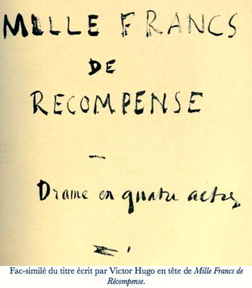

# [[{.calibre10} MILLE FRANCS DE RÉCOMPENSE]{.calibre2}]{.calibre_55} {#filepos28370862 .calibre_}

:::::: calibre_20
::::: calibre_3
::: calibre_16

------------------------------------------------------------------------

::: calibre_16

:::::
::::::

[(1866)]{.calibre_3}

[Victor Hugo]{.calibre_10}

[[THÉÂTRE
]{.bold}]{.calibre_21}

:::::: calibre_22
::::: calibre_21
[ ]{.bold}

::: calibre_16

------------------------------------------------------------------------

::: calibre_16

:::::
::::::

[
Pour toutes demandes ou suggestions]{.calibre_3}

[[{.calibre3}
]{.italic}]{.calibre_10}

[[
]{.calibre_3}]{.italic}

[[!{.calibre3}]{.italic}]{.calibre_3}

[[[[[^\[117\]^]{.calibre_21}]{.underline}]{.calibre_4}](index_split_4205.html#filepos29616182){#filepos28372992}]{.calibre_10}

## [[[]{.calibre2}[]{.calibre2}[]{.calibre2}[]{.calibre2}[]{.calibre2}[]{.calibre2}[]{.calibre2}[]{.calibre2}[]{.calibre2}[]{.calibre2}[]{.calibre2}[]{.calibre2}[]{.calibre2}[]{.calibre2}[]{.calibre2}[]{.calibre2}[]{.calibre2}[]{.calibre2}[]{.calibre2}[]{.calibre2}[]{.calibre2}[]{.calibre2}[]{.calibre2}[]{.calibre2}[Table des matières]{.calibre2}]{.bold1}]{.calibre_24} {#calibre_pb_4940 .calibre_57}

::: calibre_52

[]{.calibre_10}

> [[[[[Avertissement de l'éditeur]{.calibre9}]{.underline}]{.calibre_4}](index_split_4050.html#filepos28380387)]{.calibre_10}

> [[[[[Personnages]{.calibre9}]{.underline}]{.calibre_4}](index_split_4051.html#filepos28382332)]{.calibre_10}

> [[[[[Acte I]{.calibre9}]{.underline}]{.calibre_4}](index_split_4052.html#filepos28383930)]{.calibre_10}

> [[[[[Scène I]{.calibre16}]{.underline}]{.calibre_4}](index_split_4053.html#filepos28386668)]{.calibre_10}

> [[[[[Scène II]{.calibre16}]{.underline}]{.calibre_4}](index_split_4054.html#filepos28408297)]{.calibre_10}

> [[[[[Scène III]{.calibre16}]{.underline}]{.calibre_4}](index_split_4055.html#filepos28417148)]{.calibre_10}

> [[[[[Scène IV]{.calibre16}]{.underline}]{.calibre_4}](index_split_4056.html#filepos28424277)]{.calibre_10}

> [[[[[Scène V]{.calibre16}]{.underline}]{.calibre_4}](index_split_4057.html#filepos28473957)]{.calibre_10}

> [[[[[Scène VI]{.calibre16}]{.underline}]{.calibre_4}](index_split_4058.html#filepos28482410)]{.calibre_10}

> [[[[[Acte II]{.calibre9}]{.underline}]{.calibre_4}](index_split_4059.html#filepos28495804)]{.calibre_10}

> [[[[[Scène I]{.calibre16}]{.underline}]{.calibre_4}](index_split_4060.html#filepos28501383)]{.calibre_10}

> [[[[[Scène II]{.calibre16}]{.underline}]{.calibre_4}](index_split_4061.html#filepos28520878)]{.calibre_10}

> [[[[[Scène III]{.calibre16}]{.underline}]{.calibre_4}](index_split_4062.html#filepos28555805)]{.calibre_10}

> [[[[[Scène IV]{.calibre16}]{.underline}]{.calibre_4}](index_split_4063.html#filepos28572776)]{.calibre_10}

> [[[[[Acte III]{.calibre9}]{.underline}]{.calibre_4}](index_split_4064.html#filepos28592334)]{.calibre_10}

> [[[[[Scène I]{.calibre16}]{.underline}]{.calibre_4}](index_split_4065.html#filepos28594828)]{.calibre_10}

> [[[[[Scène II]{.calibre16}]{.underline}]{.calibre_4}](index_split_4066.html#filepos28619172)]{.calibre_10}

> [[[[[Scène III]{.calibre16}]{.underline}]{.calibre_4}](index_split_4067.html#filepos28627563)]{.calibre_10}

> [[[[[Scène IV]{.calibre16}]{.underline}]{.calibre_4}](index_split_4068.html#filepos28636036)]{.calibre_10}

> [[[[[Scène V]{.calibre16}]{.underline}]{.calibre_4}](index_split_4069.html#filepos28640807)]{.calibre_10}

> [[[[[Scène VI]{.calibre16}]{.underline}]{.calibre_4}](index_split_4070.html#filepos28653501)]{.calibre_10}

> [[[[[Acte IV]{.calibre9}]{.underline}]{.calibre_4}](index_split_4071.html#filepos28656524)]{.calibre_10}

> [[[[[Scène I]{.calibre16}]{.underline}]{.calibre_4}](index_split_4072.html#filepos28659725)]{.calibre_10}

> [[[[[Scène II]{.calibre16}]{.underline}]{.calibre_4}](index_split_4073.html#filepos28664834)]{.calibre_10}

> [[[[[Scène III]{.calibre16}]{.underline}]{.calibre_4}](index_split_4074.html#filepos28673310)]{.calibre_10}

> [[[[[Scène IV]{.calibre16}]{.underline}]{.calibre_4}](index_split_4075.html#filepos28676497)]{.calibre_10}

> [[[[[Scène V]{.calibre16}]{.underline}]{.calibre_4}](index_split_4076.html#filepos28692160)]{.calibre_10}

> [[[[[Scène VI]{.calibre16}]{.underline}]{.calibre_4}](index_split_4077.html#filepos28706468)]{.calibre_10}

## [[[]{.calibre2}[]{.calibre2}[]{.calibre2}[]{.calibre2}[]{.calibre2}[]{.calibre2}[]{.calibre2}[]{.calibre2}[]{.calibre2}[]{.calibre2}[]{.calibre2}[]{.calibre2}[]{.calibre2}[]{.calibre2}[]{.calibre2}[]{.calibre2}[]{.calibre2}[]{.calibre2}[]{.calibre2}[]{.calibre2}[]{.calibre2}[]{.calibre2}[]{.calibre2}[]{.calibre2}[]{.calibre2}[]{.calibre2}[]{.calibre2}[]{.calibre2}[]{.calibre2}[]{.calibre2}[]{.calibre2}[]{.calibre2}[]{.calibre2}[]{.calibre2}[]{.calibre2}[]{.calibre2}[]{.calibre2}[]{.calibre2}[]{.calibre2}[Avertissement]{.calibre2} de l'éditeur]{.bold1}]{.calibre_24} {#calibre_pb_4942 .calibre_57}

::: calibre_52

[ ]{.calibre4}

[[« Mon drame paraîtra le jour où la liberté reviendra »]{.italic}]{.calibre_10}

[[V.H.]{.italic}]{.calibre_10}

[ ]{.calibre4}

[Le 5 février 1866, Victor Hugo rédige les premières lignes de [Cinq cents francs de récompense]{.italic}, qu'il nommera par la suite[, Mille Francs de Récompense.]{.italic}]{.calibre4}

[C'est le seul drame moderne qu'il ait écrit, drame basé, comme les [Misérables]{.italic}, sur l'idée de rédemption, mais ici celui qui veut se racheter reste gai, bon enfant, un gavroche arrivé à maturité.]{.calibre4}

[La première publication date de 1934.]{.calibre4}

[Victor Hugo a refusé que cette pièce soit représentée de son vivant. La pièce fut montée pour la première en fois en 1961 par la Comédie de l\'Est au Théâtre municipal de Metz.]{.calibre4}

## [[[]{.calibre2}[]{.calibre2}[]{.calibre2}[]{.calibre2}[]{.calibre2}[]{.calibre2}[]{.calibre2}[]{.calibre2}[]{.calibre2}[]{.calibre2}[]{.calibre2}[]{.calibre2}[]{.calibre2}[]{.calibre2}[]{.calibre2}[]{.calibre2}[]{.calibre2}[]{.calibre2}[]{.calibre2}[]{.calibre2}[]{.calibre2}[]{.calibre2}[]{.calibre2}[]{.calibre2}[]{.calibre2}[]{.calibre2}[]{.calibre2}[]{.calibre2}[]{.calibre2}[]{.calibre2}[]{.calibre2}[]{.calibre2}[]{.calibre2}[]{.calibre2}[]{.calibre2}[]{.calibre2}[]{.calibre2}[]{.calibre2}[]{.calibre2}[]{.calibre2}[]{.calibre2}[]{.calibre2}[]{.calibre2}[]{.calibre2}[]{.calibre2}[]{.calibre2}[]{.calibre2}[]{.calibre2}[]{.calibre2}[]{.calibre2}[]{.calibre2}[]{.calibre2}[]{.calibre2}[]{.calibre2}[]{.calibre2}[]{.calibre2}[]{.calibre2}[]{.calibre2}[]{.calibre2}[]{.calibre2}[]{.calibre2}[]{.calibre2}[]{.calibre2}[]{.calibre2}[]{.calibre2}[]{.calibre2}Personnages]{.bold1}]{.calibre_24} {#calibre_pb_4944 .calibre_57}

::: calibre_52

[
GLAPIEU.
ROUSSELINE.
ÉTIENNETTE.
CYPRIENNE.
LE MAJOR GÉDOUARD.
EDGAR MARC.
LE BARON DE PUENCARRAL.
M. DE PONTRESME.
M.BARUTIN.
LE VICOMTE DE LÉAUMONT
SCABEAU[,]{.calibre_77} huissier de saisies.[
]{.calibre_77} UN HUISSIER DE TRIBUNAL.
UN HUISSIER D'APPARTEMENT,
UN INSPECTEUR DE POLICE»
UN COSTUMIER-HABILLEUR.
UN AFFICHEUR.
UN MÉDECIN.
RECORS.
GENDARMES,
MASQUES ET DOMINOS.
GENS DE LA FOULE, PASSANTS.]{.calibre4}

[]{.calibre_10}

[Paris, Hiver 182..]{.calibre_10}

## [[[]{.calibre2}[]{.calibre2}[]{.calibre2}[]{.calibre2}[]{.calibre2}[]{.calibre2}[]{.calibre2}[]{.calibre2}[]{.calibre2}[]{.calibre2}[]{.calibre2}[]{.calibre2}[]{.calibre2}[]{.calibre2}[]{.calibre2}[]{.calibre2}[]{.calibre2}[]{.calibre2}[]{.calibre2}[]{.calibre2}[]{.calibre2}[]{.calibre2}[]{.calibre2}[]{.calibre2}[]{.calibre2}[]{.calibre2}[]{.calibre2}[]{.calibre2}[]{.calibre2}[]{.calibre2}[]{.calibre2}[]{.calibre2}[]{.calibre2}[]{.calibre2}[]{.calibre2}[]{.calibre2}[]{.calibre2}[]{.calibre2}[]{.calibre2}[]{.calibre2}[]{.calibre2}[]{.calibre2}[]{.calibre2}[]{.calibre2}[]{.calibre2}[]{.calibre2}[]{.calibre2}[]{.calibre2}[]{.calibre2}[]{.calibre2}[]{.calibre2}[]{.calibre2}[]{.calibre2}[]{.calibre2}[]{.calibre2}[]{.calibre2}[]{.calibre2}[]{.calibre2}[]{.calibre2}[]{.calibre2}[]{.calibre2}[]{.calibre2}[]{.calibre2}[]{.calibre2}[]{.calibre2}[]{.calibre2}Acte I]{.bold1}]{.calibre_24} {#calibre_pb_4946 .calibre_57}

::: calibre_52

[[CHEZ LE MAJOR GÉDOUARD]{.italic}]{.calibre_28}

[[
[PERSONNAGES :]{.bold}
GLAPIEU
ROUSSELINE
EDGAR MARC
LE MAJOR GÉDOUARD
ÉTIENNETTE
CYPRIENNE
SCABEAU, huissier
DEUX RECORS
DU PUBLIC]{.italic}]{.calibre_28}

[
[Décor en trois parties. A droite et à gauche deux compartiments étroits ; au milieu une chambre assez grande avec porte à deux battants au fond, et à gauche un pan coupé où il y a une alcôve fermée par des rideaux. En regard de l'alcôve à droite un autre pan coupé plus petit où il y a une cheminée. Dans la cheminée un petit feu où chauffent des bouilloires et des tisanes. Sur la cheminée des tasses et des soucoupes. Un piano sur le devant de la scène avec deux chaises. Fauteuils autour des murs, cadres accrochés. Petits meubles de femmes en acajou]{.italic} [--- dans le compartiment de gauche le palier d'un escalier dont on voit se perdre les marches, les unes descendant, les autres montant. Une porte bâtarde fermée donne de la chambre sur ce palier. Au-dessus du palier une fenêtre de quatre carreaux --- Dans le compartiment de droite, un réduit figurant une garde-robe. Ce réduit est mansardé. Dans le plafond oblique on voit une lucarne en tabatière. Au fond un porte-manteau où sont accrochées des robes, quelques-unes de soie, mais très fanées. Ce réduit communique avec la chambre par une porte bâtarde qui est entrouverte --- A côté de cette porte, sur une crédence fixée au mur, un coffret de Boulle, d'aspect riche.]{.italic}]{.calibre4}

[[
]{.calibre_7}]{.bold}

### [[[]{.calibre2}[]{.calibre2}[]{.calibre2}[]{.calibre2}[]{.calibre2}[]{.calibre2}[]{.calibre2}[]{.calibre2}[]{.calibre2}[]{.calibre2}[]{.calibre2}[]{.calibre2}[]{.calibre2}[]{.calibre2}[]{.calibre2}[]{.calibre2}[]{.calibre2}[]{.calibre2}[]{.calibre2}[]{.calibre2}[]{.calibre2}[]{.calibre2}[]{.calibre2}[]{.calibre2}[]{.calibre2}[]{.calibre2}[]{.calibre2}[]{.calibre2}[]{.calibre2}[]{.calibre2}[]{.calibre2}[]{.calibre2}[]{.calibre2}[]{.calibre2}[]{.calibre2}[]{.calibre2}[]{.calibre2}[]{.calibre2}[]{.calibre2}[]{.calibre2}[]{.calibre2}[]{.calibre2}[]{.calibre2}[]{.calibre2}[]{.calibre2}[]{.calibre2}[]{.calibre2}[]{.calibre2}[]{.calibre2}[]{.calibre2}[]{.calibre2}[]{.calibre2}[]{.calibre2}[]{.calibre2}[]{.calibre2}[]{.calibre2}[]{.calibre2}Scène I]{.bold1}]{.calibre_39} {#scène-i .calibre_38}

[[]{.italic}]{.calibre_28}

[[CYPRIENNE, robe de toile, propre, blanche, pauvrement et gracieusement simple. [Puis GLAPIEU
Au fond, dans l'alcôve, un vieillard endormi.]{.calibre_78}]{.italic}]{.calibre_28}

[
[Au lever du rideau, pendant que Cyprienne parle, on voit sur le palier dans le compartiment de gauche un homme en haillons, barbe non rasée, cheveux non peignés, trous aux coudes, casquette fripée, souliers sans semelles, faisant dans l'escalier des mouvements d'animal pris au piège. Il semble chercher une issue, guettant, épiant, furetant. Il descend quelques marches, puis remonte et disparaît dans l'étage supérieur de l'escalier. --- Cyprienne est assise en train de coudre, elle pose son ouvrage sur le piano, se lève, va à l'alcôve et en ouvre les rideaux. On voit sur le lit un vieillard en cheveux blancs, couché et endormi. Il dort tout habillé, en robe de chambre et en pantalon à pieds.]{.italic}
[CYPRIENNE
]{.bold} Il dort. Pauvre grand-père \![
Elle le baise au front.
]{.italic} Je vais le gronder pendant qu\'il dort. Voyez-vous, père, c\'est mal. Vous me désobéissez. Voilà sept semaines que vous avez la fièvre, et le médecin dit qu\'il faut faire bien attention, tellement que cette nuit vous avez eu le délire, et vous ne nous reconnaissiez plus, ma mère et moi ; et tout le temps vous m\'avez dit Madame. Et ce matin vous avez voulu vous lever, malgré moi, et il a fallu vous recoucher, et vous vous êtes jeté tout habillé sur votre lit. Pas sage, monsieur grand-père. Vous n'êtes pas raisonnable. Ah mais ! vous êtes mon grand-papa, mais je suis votre petite maman. Dormez à présent.[
Elle le regarde dormir.
]{.italic} Moi je suis comme ma mère, elle m\'a pour fille, et moi[
Baisant au front le vieillard.
]{.italic} Voilà mon enfant. Dormez, monsieur. --- Pauvre bon père ! il ne sait rien de notre misère. Depuis deux mois qu\'il est malade, ma mère lui a tout caché ! Oh ! quand il apprendra l'affreuse situation où nous sommes ce matin ! Comment faire pour qu\'il ne s\'en doute pas ? Ce sera presque impossible. Il verra bien les huissiers. Oh ! j\'ai peur qu\'il ne soit bien malade. Ma mère et moi, qu\'est-ce que nous deviendrions ?[
Elle va à la porte du fond et écoute.
]{.italic} J\'entends ma mère parler dans le salon. Est-ce que ces gens seraient déjà arrivés ? Ils monteront de l\'autre côté, par le grand escalier. Comment cela va-t-il se passer, mon Dieu ? Viendront-ils jusque dans cette chambre ? --- C\'est que je ne suis plus chez moi ici. Ce n\'est plus ma chambre. Il a fallu y transporter mon grand-père. Et puis c'est le refuge de toutes les petites choses que ma mère voudrait sauver de la saisie.[
Regardant le coffret de Boulle]{.italic}[.]{.calibre_79}[
]{.italic} Voici la boîte à laquelle ma mère tient tant. Je ne suis plus seule ici. Ma mère va et vient. --- Pourvu qu\'il ne vienne pas ce matin, lui ?
[[
]{.calibre_80}]{.italic} [GLAPIEU]{.bold}, [reparaissant.]{.italic}
[Il redescend du haut de l'escalier avec précaution, comme quelqu'un qui tâche d\'amortir le bruit de ses pas.
]{.italic} Je suis très pensif, savez-vous ? Aucun moyen de gagner le toit par là-haut. Tout est fermé. J\'ai l'honneur d\'être dans une souricière. Le portier ne m'a pas vu passer. C\'est bon, mais après ? À peine a-t-on résolu ce problème, entrer, qu\'il faut résoudre celui-ci, sortir. Voilà la vie.[
Il ouvre la petite fenêtre et y passe sa tête, puis referme la fenêtre en faisant le moins de bruit possible.
]{.italic} Toute l\'escouade est encore là, dans la rue. Damnée police. Alguazils ! sbires ! infâmes curieux ! Ils ont l'air de chercher. Ils guettent. Peut-être ont-ils perdu ma piste. Vague espérance. Délibérons.[
Il croise les bras.
]{.italic} Croiser les bras, c\'est assembler son conseil. Que faire ? Redescendre ? Pas possible. Empoigné, comme dit monsieur le vicomte de Foucauld. Demeurer ici ? Pas possible. Les locataires montent et descendent. Qu'est-ce que je fais là ? Ma tenue manque de respectabilité. Dilemme : si je m\'en retourne par où je suis venu, je suis pris. Si je reste, je suis pris. Pour bien posée, la question est bien posée. Mais que faire ?[
Il regarde la fenêtre.
]{.italic} Comme c\'est drôle, les oiseaux ! ça se moque de tout. Voler, quel bête de mot ! il a deux sens. L\'un signifie liberté, l'autre signifie prison.
[CRIS AU-DEHORS]{.bold} [:]{.italic} [
]{.calibre_79} « A la chie-en-lit ! » [
]{.calibre_79} [Chants. Bruits de trompes]{.italic}[, ---]{.calibre_79} [On entend des trompes et du cornet à bouquin.
]{.italic} [GLAPIEU]{.bold}.
Nous sommes en carnaval. Il y a pourtant des gens qui s\'amusent ! La nature ne prend aucune part à ma détresse.[
Rêvant.
]{.italic} Les agents m\'ont reconnu, quels gueux ! Est-il possible de pourchasser un pauvre homme comme cela qui ne fait de mal à personne, uniquement parce qu\'il a accompli autrefois une sottise. C\'est de mon vieux temps, j\'étais enfant. C\'est égal, ça me suit. Ça ne pardonne pas, une sottise. On flanque un pauvre diable en surveillance dans un trou de province, surveillance, ça veut dire famine, il ne peut pas gagner sa vie, il s\'esquive, le voilà à Paris. Qu\'est-ce que tu viens faire à Paris ? --- Je viens devenir honnête homme, là. Paris est grand, Paris est bon ; je viens m\'y perdre, et m\'y retrouver. Je vais y changer de nom et y changer de métier. Voyons, veut-on de moi dans l\'honnêteté ? Je viens planter dans le sol parisien l\'oignon de la vertu, mais laissez-lui le temps de pousser, que diable ! Point. --- Ah ! c\'est toi, vaurien ! Et la police vous saute à la gorge. Et je n\'ai plus que le choix de la cave ou du toit. Dans la cave avec les taupes, sur le toit avec les moineaux. --- Oh ! les oiseaux ! les oiseaux ! quel chef-d\'oeuvre ! C\'est ça qui est toujours en rupture de ban.[
Rêvant.
]{.italic} Ah ! ils ont le chat ! --- Moi, j\'ai monsieur Delavau.[
Rêvant.
]{.italic} La première sottise, fil à la patte qui ne se casse jamais. Ô qui que vous soyez, qui ne voulez pas faire la deuxième sottise, ne faites pas la première. Je passais, j\'étais gamin, le tiroir d\'une fruitière était entr'ouvert, il bâillait, il avait l\'air de s\'ennuyer, je lui fis une farce, je lui chipai douze sous. On me happa, on me soutint que j\'avais forcé le tiroir. J'avais un peu plus de seize ans. C\'est grave. Quinze ans et onze mois, on est un polisson ; quinze ans et treize mois, on est un bandit. On me trouva des dispositions. On pensa que j'avais de l\'étoffe. Je n\'étais pas même un filou ; on me jugea digne de passer voleur. Op me mit pour trois ans dans une maison d'éducation. À Poissy. J\'appris là bien des choses utiles à la société. Du tiroir des fruitières, je m\'élevai à la caisse des banquiers. Un professeur, qui avait vu Toulon en France et Horsemonger Lane, New-Gate en Angleterre, m\'expliqua le coffre-fort et la manière de s\'en servir. [[Il]{.calibre_79}]{.italic} m\'inculqua les notions. Il m\'enseigna que les meilleurs coffres-forts se font à Londres. Et encore il y a fabricant et fabricant. Il y a le coffre-fort facile et le coffre-fort difficile. Ça a ses moeurs, le coffre-fort. Ceux de Griffith sont bons, ceux de Tann sont excellents, ceux de Milner sont inviolables. Coffre-fort de Milner, pucelle d\'Orléans. Eh bien, grâce à l'excellente méthode qui présidait à mon instruction, j\'appris à venir à bout même d\'une caisse Milner. Par exemple, pour une caisse Milner il faut sept heures de travail, tandis que pour une caisse Griffith, dix minutes suffisent. Ayez un coin. Si la rainure du coffre-fort repousse le coin, vous avez affaire à Milner. C\'est sérieux. Autrement, si le coin mord, vous n\'êtes qu\'en présence de Tann ou de Griffith ; quelques pesées en viennent à bout. Voilà quel a été mon baccalauréat, C\'est ainsi qu'on devient, grâce à la sollicitude de la société, un homme à talents. Pourtant, quoique savant, je suis un mauvais voleur, au fond je n\'ai point de vocation. Le coeur du mal, je ne l'ai pas. Je quitterais volontiers l\'état, mais la police ne veut pas. La haute surveillance me tient et me dit : Tu as embrassé une carrière. Tu ne peux pas t'en dédire. La société s\'est donné la peine de faire de toi un voleur, et n'entend pas en avoir le démenti. Reste où tu es et reste ce que tu es. --- Je me débats. De là ma fugue en ce moment.[
Rêvant.
]{.italic} --- Monsieur Delavau. Pourquoi a-t-on changé le préfet de police ? Nous avions eu tant de peine à dresser l\'autre. L\'autre n\'était que taquin, celui-ci me fait l\'effet d\'être tracassier. C\'était monsieur Anglès, c\'est monsieur Delavau. Je n\'aime pas les nouveaux visages. J\'avais pris mon parti de monsieur Anglès. Allons, maintenant qu'on a monsieur Delavau, qu'on le garde donc au moins, celui-là ! Puisqu\'on l\'a, je m'y tiens. Autant ce préfet de police-là qu\'un autre. On ne gagne rien à ces renvois-Ià. On ne fait que changer de défauts.
Eh bien, j'y insiste, vous me croirez si vous voulez, monsieur le préfet, j\'étais venu à Paris dans l\'intention de faire peau neuve et d'être l\'ornement de la société. J\'ai eu toute ma vie plutôt du malheur qu\'autre chose. Je sais bien, moi, que ma conscience ne me dit pas toutes les injures qu\'on croit. N\'importe, on me poursuit, on me traque, en province, à Paris, partout, le voilà, on me court après, je m'enfuis, je m\'échappe, je me sauve, je pends mes jambes à mon cou, et je suis si essoufflé que je n\'ai pas le temps de devenir vertueux. Chien de sort ! Ah ! c\'est comme ça ! Eh bien ! on va voir, la première bonne action que je trouve à faire, je me jette dessus, je la fais. Ça mettra le bon Dieu dans son tort. --- Mais, il faut pourtant que je me tire d'ici. Si les gens de police s\'avisent de monter les escaliers, je suis fumé. En voilà au moins pour deux ans. Coffré, bouclé, autant dire mort. Voyons, où sont les ressources ? La perche, père bon Dieu, à ce pauvre noyé ! Rendons-nous compte un peu de la maison. Ceci est le quatrième étage. Ces marches-ci [Montrant le tronçon d'escalier qui monte]{.italic}.ne mènent à rien. Pas d\'issue. Je suis dans l\'escalier de service. Il y a un autre escalier, le grand, qui mène aux appartements sur le devant, l\'escalier des maîtres. De ce côté-ci sont les petites chambres mansardées communiquant avec les appartements à plafonds qui donnent sur la rue. Par ici le toit doit être en pente, et ce serait bien le diable s\'il n\'y avait pas quelque cour, quelque ruelle, où je pourrais glisser et filer. Oui, c'est par l\'autre côté du toit que je peux m\'échapper. L'autre côté ! Mais il faut lui passer à travers le corps à cette maison. Comment faire ? Par-là peut-être.
[Il se courbe devant la porte bâtarde et regarde par le trou de la serrure.
]{.italic} Justement. J'aperçois là-bas au fond un recoin en mansarde avec une lucarne en tabatière. Ça ferait mon affaire. De là je gagne le toit, puis la cour, puis la rue, puis la liberté.[
Il regarde.
]{.italic} Il y a une femme. Elle est seule. Une jeunesse. Ça n\'est pas méchant, les jeunesses.[
Il regarde]{.italic}[.]{.calibre_79}[
]{.italic} Fichtre ! charmante ! Che bocchone ! Elle est peut-être cruelle, mais elle n\'est pas méchante. Dans tous les cas, je n\'ai point d\'autre ressource. Cognons, Psst \![
Il frappe un petit coup et observe. Cyprienne lève les yeux. Glapieu contrefait sa voix]{.italic}[.]{.calibre_79}[
]{.italic} Gustave.[
Cyprienne tourne la tête. Il gratte discrètement. Il adoucit encore sa voix.
]{.italic} Alfred.[
Cyprienne se dresse sur sa chaise et écoute. Il gratte de nouveau et fait une voix de plus en plus douce.
]{.italic} Oscar.
[CYPRIENNE
]{.bold} Est-ce vous, monsieur Edgar ?
[[
GLAPIEU]{.calibre_63}]{.bold}[,]{.calibre_63} [[à part.]{.calibre_63}]{.italic}
Edgar, parbleu ! Je disais Oscar. Je brûlais.[[
H]{.calibre_63}]{.italic}[aut et amoroso.
]{.italic} Oui, Edgar, [
Cyprienne va à la porte, l\'ouvre, et recule effrayée.
Glapieu, le doigt sur la bouche, souriant.
]{.italic} Chut ! Vous êtes jolie. Faites une bonne action.
[CYPRIENNE
]{.bold} Ah ! mon Dieu !
[GLAPIEU
]{.bold} Ça va aux jolis visages, les bonnes actions.
[CYPRIENNE
]{.bold} Mon Dieu ! mon Dieu !
[GLAPIEU
]{.bold} Mademoiselle, je commence par déclarer que je ne suis pas monsieur Edgar. Cet aveu doit me concilier votre confiance.
[CYPRIENNE
]{.bold} Qui êtes-vous ?
[GLAPIEU]{.bold}, [souriant.]{.italic}[
]{.bold} Un pas grand-chose. Mais un bon garçon.
[CYPRIENNE
]{.bold} Monsieur\...
[GLAPIEU
]{.bold} Merci, mademoiselle. C\'est déjà beaucoup de ne pas avoir crié. Une sotte aurait crié. Vous n\'êtes pas une chipie, merci.
[CYPRIENNE
]{.bold} J\'ai peur.
[
GLAPIEU]{.bold}, [souriant.]{.italic}[
]{.bold} Fausse route. Ayez pitié.
[CYPRIENNE
]{.bold} Qui êtes-vous ? que voulez-vous ?
[GLAPIEU
]{.bold} Je suis un excentrique en rupture de ban. Je vais vous Mire. Avoir pitié, je vous assure que cela ne sera pas bêle. Vous ne vous en repentirez pas. Je suis à votre i discrétion. Vous n\'avez qu\'à appeler, je suis pincé, qu'à jeter un cri, je suis pris, qu'à dire un mot, je suis flambé. Il dépend de vous de souffler sur moi, et me voilà perdu. C'est moi qui aurais le droit d'avoir peur de vous. Je n'en use pas. Je donne l\'exemple de la confiance. Ecourtez. Je suis un homme qui se sauve. Pourquoi ? Parce qu'on court après moi. Pourquoi court-on après moi ? Parce que j\'étais dans la rue. Pourquoi étais-je dans la rue ? Parce que je m\'imaginais qu'on peut être dans la rue. Qui suis-je ? Un innocent, pour le quart d'heure. Qu\'est-ce que je faisais ? Rien. Qu\'est-ce qu'on veut me faire ? Tout. Car qui n\'a pas la liberté, n\'a plus la vie.
Voilà mon histoire. Vous ne la comprenez pas. Ni moi non plus.
[CYPRIENNE
]{.bold} Monsieur, j'ai là mon grand-père malade, qui dort.
[GLAPIEU
]{.bold} Honneur et respect. Je ne suis pas l\'ennemi des grands-pères, étant l'ami des petites-filles, SI je vous fais peur, c\'est bien malgré moi, car je vous assure que je fais ce que je peux pour être aimable.
[CYPRIENNE]{.bold}[, à part.]{.italic}[
]{.bold} Il est laid. Mais il n'a pas l\'air très méchant.
[GLAPIEU
]{.bold} Mademoiselle, qu\'y a-t-il de l\'autre côté, derrière la maison ?
[CYPRIENNE
]{.bold} Il y a une église.
[GLAPIEU
]{.bold} Une église. Bon. C\'est inhabité. C'est commode pour passer.
[CYPRIENNE
]{.bold} Nous sommes rue Saint-Antoine. C\'est l'église Saint-Gervais et Saint-Protais.
[
CYPRIENNE]{.bold}[, à part.]{.italic}[
]{.bold} Protêt ! Me croit-elle poursuivi par les huissiers ? Serait-ce une allusion ? Faire des calembours dans un âge si tendre !
[Haut.
]{.italic} Mademoiselle\...
[CYPRIENNE
]{.bold} Que voulez-vous ?
[GLAPIEU
]{.bold} Une toute petite chose. Je suis un mortel qu'on ennuie et qui voudrait bien marcher un peu sur les toits. --- Laissez-moi traverser tout doucement sur la pointe du pied cette chambre et sortir par cette fenêtre[
Il montre la lucarne en tabatière.
]{.italic} Bien amicalement.
[CYPRIENNE
]{.bold} Sur le toit !
[GLAPIEU
]{.bold} Le bon Dieu vous le rendra.
[CYPRIENNE
]{.bold} Mais il pleut, c\'est l\'hiver. Quoi ! sur le toit !
[GLAPIEU
]{.bold} Oui. Comme les chats. C\'est mon genre. Chacun a son histoire naturelle.
[CYPRIENNE
]{.bold} Mais le ciel est tout noir. Il va neiger tout à l\'heure.
[GLAPIEU
]{.bold} Ce n'est pas ma faute.
[CYPRIENNE]{.bold}, à [[part.]{.calibre_63}]{.italic}[[
]{.calibre_79}]{.italic} Il n'a vraiment pas l\'air méchant.
[GLAPIEU
]{.bold} Ayez un bon mouvement. Sauvez-moi. Entrer, passer, sortir, voulez-vous ?
[
CYPRIENNE]{.bold}[,]{.calibre_63} [[à part.]{.calibre_63}]{.italic}
Et puis j\'ai tant besoin de pitié moi-même !
[À Glapieu.
]{.italic} Passez.
[GLAPIEU
]{.bold} [Il entre, salue l'alcôve, et traverse la chambre sur la pointe du pied.
]{.italic} Avouez que c\'est simple. Voyez comme c\'est gentil. Le bon papa n\'en fera pas un plus mauvais rêve. Vous sauvez un homme, mademoiselle.[
Il arrive au réduit mansardé et se retourne.
]{.italic} Ah ! si quelqu\'un vient me demander, dites que je n\'y suis pas.[
Il soulève la fenêtre de la tabatière.
]{.italic} Je me dépêche pour que vous n\'ayez pas de courant d\'air.[
Il enjambe à moitié sur le toit, et se penche dans la chambre.
]{.italic} C\'est fait. Silence. N\'ayez pas l\'air de faire attention. Les signes d\'approbation sont interdits.[
À part.
]{.italic} Cette belle petite a les yeux rouges. Hé ! hé ! nous avons donc des chagrins ! Je devine. De ces jolis petits chagrins qu\'on appelle des peines de coeur.
[Il achève d\'enjamber la lucarne]{.italic}[.]{.calibre_79} [Au moment de la refermer]{.italic}[,]{.calibre_79} [il passe sa tête par l'ouverture. Haut, à Cyprienne.
]{.italic} Comptez sur moi.
[Il referme la lucarne et disparaît.
]{.italic}
[CYPRIENNE]{.bold}, [seule]{.italic}
Je ne crois pas avoir fait mal. Mais c\'est comme un songe cet homme. Je suis toute tremblante.
[Entre Etiennette. Une robe de toile comme Cyprienne.]{.italic}]{.calibre4}

[[
]{.calibre_7}]{.bold}

### [[[]{.calibre2}[]{.calibre2}[]{.calibre2}[]{.calibre2}[]{.calibre2}[]{.calibre2}[]{.calibre2}[]{.calibre2}[]{.calibre2}[]{.calibre2}[]{.calibre2}[]{.calibre2}[]{.calibre2}[]{.calibre2}[]{.calibre2}[]{.calibre2}[]{.calibre2}[]{.calibre2}[]{.calibre2}[]{.calibre2}[]{.calibre2}[]{.calibre2}[]{.calibre2}[]{.calibre2}[]{.calibre2}[]{.calibre2}[]{.calibre2}[]{.calibre2}[]{.calibre2}[]{.calibre2}[]{.calibre2}[]{.calibre2}[]{.calibre2}[]{.calibre2}[]{.calibre2}[]{.calibre2}[]{.calibre2}[]{.calibre2}[]{.calibre2}[]{.calibre2}[]{.calibre2}[]{.calibre2}[]{.calibre2}[]{.calibre2}[]{.calibre2}[]{.calibre2}[]{.calibre2}[]{.calibre2}[]{.calibre2}[]{.calibre2}[]{.calibre2}[]{.calibre2}[]{.calibre2}[]{.calibre2}[]{.calibre2}[]{.calibre2}[]{.calibre2}Scène II]{.bold1}]{.calibre_39} {#scène-ii .calibre_38}

[[]{.italic}]{.calibre_28}

[[CYPRIENNE, ETIENNETTE.]{.italic}]{.calibre_28}

[
[ÉTIEN NETTE
]{.bold} Tu es seule ?
[CYPRIENNE
]{.bold} Oui, ma mère.
[ÉTIENNETTE
]{.bold} Mon père ne s'est pas réveillé ?
[CYPRIENNE
]{.bold} Non, ma mère.
[ÉTIENNETTE
]{.bold} Qui est-ce donc qui était ici tout à l\'heure ?
[CYPRIENNE
]{.bold} Ma mère\...
[ÉTIENNETTE
]{.bold} J'ai entendu une voix.
[CYPRIENNE
]{.bold} Ma mère\...
[ÉTIENNETTE
]{.bold} Mon enfant, il faut que je te parle.
[CYPRIENNE
]{.bold} Oui, ma mère.
[ÉTIENNETTE
]{.bold} Sérieusement.
[CYPRIENNE
]{.bold} Oui, ma petite mère.
[ÉTIENNETTE
]{.bold} Ma fille, la gêne entraîne des conditions fâcheuses. Les soins du ménage me retiennent à la maison ; je ne puis t\'accompagner sans cesse comme je le devrais ; je suis forcée de te laisser sortir seule. Hélas ! et nous sommes déjà au-delà de la gêne, nous sommes dans la pauvreté, et demain il faudra descendre la troisième marche qui entre dans la nuit, la misère. Tu connais notre position. Elle est lamentable. Ton grand-père donnait des leçons de musique. Il est vieux, il est tombé malade. Voilà tout à l\'heure deux mois qu\'il a la fièvre et le délire. Les élèves l\'ont quitté un à un. Plus de leçons, et des dettes. Ce matin, on vient saisir ici. Quel réveil pour ton grand-père ! Je lui ai caché l'extrémité où nous sommes. Il ignore tout. C\'est là notre situation. Eh bien, mon enfant bien aimée, j'ai une autre angoisse encore, et plus cruelle. Ceci est ta chambre. J'ai été imprudente, il y a là une porte sur le petit escalier. Comme on va tout vendre, il a fallu démeubler les chambres, nous avons dû transporter ton grand-père ici. Ma fille, j\'ai le coeur serré, écoute-moi. Tu vois comme le malheur est sur nous, la maladie, la ruine, les huissiers dans la maison, mon père et moi, vois-tu, nous n\'avons plus que toi, tu es notre unique joie, notre unique orgueil, notre unique reste de lumière ici-bas. Ne nous accable pas, ma fille, ne nous achève pas, ne nous ôte pas le dernier, le seul bonheur que nous ayons, le bonheur de ton innocence ! Songe à ton grand-père vénérable. Je t\'en conjure, dis-moi la vérité. Ma fille, un jeune homme vient ici de temps en temps par cet escalier, par cette porte. J'ai entendu plusieurs fois une voix. Tu aimes quelqu\'un ?
[CYPRIENNE
]{.bold} Oui, ma mère.
[ETIENNETTE
]{.bold} Ma fille ! ne te perds pas !
[CYPRIENNE
]{.bold} C\'est monsieur Edgar Marc, caissier chez un grand banquier très riche. Il est bon et doux. C\'est un noble coeur. Nous nous sommes rencontrés.
[ÉTIENNETTE
]{.bold} Juste ciel ! Et des rendez-vous dans cette chambre ! Oui, tu sors seule, et il vient ici ! Si mon père venait à le savoir ! Retire-toi à temps de cette fâcheuse aventure. Brise ce commencement funeste. Ne vois plus ce jeune homme. Ma fille ! Ah ! c\'est ma faute !
[CYPRIENNE
]{.bold} Je l\'aime, et il m\'aime
[ÉTIENNETTE
]{.bold} Ne le vois plus !
[CYPRIENNE
]{.bold} Ma mère, il m'épousera.
[ÉTIENNETTE
]{.bold} Ma fille\...
[CYPRIENNE
]{.bold} Il me l\'a promis.
[ÉTIENNETTE
]{.bold} Folie ! Ne le vois plus, te dis-je !
[CYPRIENNE
]{.bold} Ma mère, vous avez aimé mon père.
[[
]{.calibre_79}]{.italic} [ÉTIENNETTE]{.bold}[[,]{.calibre_79}]{.italic} [lui saisissant le bras]{.italic}[[.]{.calibre_79}]{.italic}[
]{.bold} Il ne m'a pas épousée !
[CYPRIENNE
]{.bold} Ciel !
[ÉTIENNETTE
]{.bold} Ah ! malheureuse enfant ! tu viens de m'arracher un secret terrible. Je connais la route où tu entres, tiens, regarde à tes pieds, cette route sombre se prolonge devant toi dans les ténèbres, regarde, tu y vois l\'empreinte d'un pas, c\'est le mien. Je m'y suis perdue. Oui, c\'est un secret poignant. Personne ne le sait. Mon père lui-même ne s\'en doute pas. On m\'appelle madame André. Jamais je n\'ai été mariée. On me croit veuve, je suis fille. Nous étions dans une petite ville de province, en Bretagne, à Chatelaudren, près de Guingamp. Mon père était absent, ma mère a été faible. J\'ai fait une rencontre, comme toi. On croit à l'avenir. On dispose de l\'éternité. Ces amours-là, l\'oubli souffle dessus. Il était pauvre et obscur. Il a été pris par la conscription. Il est parti. Il n\'est pas revenu. A-t-il été tué ? peut-être. Est-il vivant ? peut-être. Depuis ma mère est morte. Nous avons quitté la petite ville. D'autres circonstances encore. Nous sommes venus à Paris. Ah ! c'est une sombre histoire, et dont tu portes le poids. Où est-il, ton père ? L\'épaisse obscurité s\'est faite. Je l\'ai cherché. Peut-être me cherche-t-il de son côté. Je ne sais plus rien. J\'attends. Je suis dans l\'isolement et dans la nuit. Ma fille, c'est une descente funèbre. Arrête, ne va pas plus loin.
[CYPRIENNE
]{.bold} Ma mère, je l'aime.
[ÉTIENNETTE
]{.bold} Moi aussi, je l'aimais !
[CYPRIENNE
]{.bold} Il m'aime.
[ÉTIENNETTE
]{.bold} Lui aussi, il m\'aimait !
[CYPRIENNE]{.bold}
Il est honnête.
[ÉTIENNETTE
]{.bold} Lui aussi, il était sincère !
[CYPRIENNE
]{.bold} Il est trop pauvre encore pour que le mariage soit possible.
[
ÉTIENNETTE
]{.bold} C'est ce qu\'il me disait.
[CYPRIENNE
]{.bold} Mais il m\'a promis.
[ÉTIENNETTE
]{.bold} Il m'avait juré !
[CYPRIENNE
]{.bold} Ma mère !
[ÉTIENNETTE
]{.bold} Chose lugubre que le passé revienne, et se refasse l'avenir ! C\'est le tour de ma fille aujourd'hui.
[CYPRIENNE
]{.bold} Ma mère, ayez pitié de moi.
[
ÉTIENNETTE
]{.bold} Aie compassion de moi, mon enfant.
[Elles pleurent toutes deux, chacune tombée dans un fauteuil.]{.italic}
[À part.]{.italic}
Baisser les yeux dans ce qu\'il y a de plus auguste au monde, la maternité, c\'est le dernier degré de l'accablement, J'en suis là. Quelle honte de ne pouvoir dire à son enfant : Mon enfant, voilà ton père !
[Un battant de la porte du fond s'ouvre, On entrevoit au-delà un salon]{.italic}[[.]{.calibre_79}]{.italic} [Un homme vêtu de noir]{.italic}[[,]{.calibre_79}]{.italic} [le chapeau sur la tête, paraît, accompagné de deux hommes en redingote boutonnée. Étiennette se retourne et essuie rapidement ses larmes]{.italic}]{.calibre4}

[[
]{.calibre_7}]{.bold}

### [[[]{.calibre2}[]{.calibre2}[]{.calibre2}[]{.calibre2}[]{.calibre2}[]{.calibre2}[]{.calibre2}[]{.calibre2}[]{.calibre2}[]{.calibre2}[]{.calibre2}[]{.calibre2}[]{.calibre2}[]{.calibre2}[]{.calibre2}[]{.calibre2}[]{.calibre2}[]{.calibre2}[]{.calibre2}[]{.calibre2}[]{.calibre2}[]{.calibre2}[]{.calibre2}[]{.calibre2}[]{.calibre2}[]{.calibre2}[]{.calibre2}[]{.calibre2}[]{.calibre2}[]{.calibre2}[]{.calibre2}[]{.calibre2}[]{.calibre2}[]{.calibre2}[]{.calibre2}[]{.calibre2}[]{.calibre2}[]{.calibre2}[]{.calibre2}[]{.calibre2}[]{.calibre2}[]{.calibre2}[]{.calibre2}[]{.calibre2}[]{.calibre2}[]{.calibre2}[]{.calibre2}[]{.calibre2}[]{.calibre2}[]{.calibre2}[]{.calibre2}[]{.calibre2}[]{.calibre2}[]{.calibre2}[]{.calibre2}[]{.calibre2}[]{.calibre2}Scène III]{.bold1}]{.calibre_39} {#scène-iii .calibre_38}

[[]{.italic}]{.calibre_28}

[[CYPRIENNE, ÉTIENNETTE, SCABEAU et SES AIDES.]{.italic}]{.calibre_28}

[
[ÉTIENNETTE]{.bold}, [se levant.]{.italic} [
]{.bold} Qui est là ? qui est-ce donc qui entre ainsi ? Ah ! c'est l'huissier et ses recors. Ce sont les maîtres de la maison. J\'oubliais que nous ne sommes plus chez nous. Un débiteur, c\'est un esclave. Oh ! tous les abaissements à la fois !
[SCABEAU]{.bold}, [aux recors, désignant les fauteuiIs.]{.italic}
Enlevez ces meubles.
[ÉTIENNETTE]{.bold}, [à l'huissier]{.italic}
Monsieur, pardon. Mon père est là dans l\'alcôve.
[[
]{.calibre_79}]{.italic} [SCABEAU]{.bold}[[,]{.calibre_79}]{.italic} [ôtant son chapeau.]{.italic}
Bien, madame.
[
]{.calibre_80} [ÉTIENNETTE]{.bold}, [à Scabeau]{.italic}[[.]{.calibre_80}]{.italic}
C'est que le médecin est inquiet.
[SCABEAU
]{.bold} Madame, je procède régulièrement. J'instrumente ail nom de monsieur le baron de Saint-André de Puencarral, banquier, rue Saint-Marc-Feydeau.
[ÉTIENNETTE
]{.bold} Vous savez, les malades, quand ça dort !
[SCABEAU
]{.bold} Le commandement vous a été signifié. Vous n\'avez pas les fonds ?
[ÉTIENNETTE
]{.bold} Et puis, c\'est un vieillard.
[SCABEAU
]{.bold} Je serais charmé de me retirer sans exécuter la saisie. Malheureusement, il me faut l\'argent, ou la vente. Les officiers ministériels sont passifs. Mais le lit est excepté, de même que les vêtements qu\'on a sur soi\...
[ÉTIENNETTE
]{.bold} Hélas, non. Je n\'ai pas les fonds.
[SCABEAU
]{.bold} Et les outils, quand il y a métier. Nous ferons le moins de bruit possible, madame. Mais nous sommes forcés de porter tous les meubles dans le salon à côté, où la vente va avoir lieu.
Les recors prennent les fauteuils, les tables, les cadres gui sont aux murs et les passent dans le salon voisin[[.]{.calibre_79}]{.italic} Ils entrent et sortent emportant chaque fois un meuble. La chambre se dégarnit peu à peu.
[ÉTIENNETTE
]{.bold} Monsieur l\'huissier, je vais vous dire, Mon père ne sait pas qu\'il y a une saisie et qu\'on va vendre. Voilà sept semaines qu\'il est au lit, en danger, avec la fièvre. C'est un homme qui a été riche. Il n\'est pas habitué à l\'idée d\'une si grande détresse. Voyez-vous, nous sommes bien malheureuses.
[
SCABEAU]{.bold}, [aux recors.]{.italic}[
]{.bold} Faites doucement.
[Étiennette et Cyprienne regardent, consternées, les recors démeubler la chambre. Un recors s'approche de la crédence fixée au mur où est le coffret.
]{.italic} C\'est un coffret de Boulle.
[ÉTIENNETTE
]{.bold} N\'enlevez pas cette boîte !
[SCABEAU
]{.bold} Madame, cette boîte est décrite dans le procès-verbal de saisie. Elle fait partie du gage du créancier. Je dois la faire vendre.
[ÉTIENNETTE
]{.bold} La boîte, soit. Mais pas les papiers qui sont dedans.
[SCABEAU
]{.bold} Quels sont ces papiers ?
[ÉTIENNETTE
]{.bold} Des choses de famille à moi. Des lettres.
[SCABEAU
]{.bold} Sans valeur ? vous pouvez retirer ces papiers, madame.
Etiennette prend une petite clef cachée dans son corset, ouvre le coffret et en retire une liasse de papiers et de lettres nouée d'un ruban rose fané. Elle presse ce paquet sur son coeur et lève les yeux au ciel Un recors emporte le coffret vide[[.]{.calibre_79}]{.italic} Étiennette pose les papiers sur la crédence.
[ÉTIENNETTE
]{.bold} Merci bien, monsieur l\'huissier.
[SCABEAU
]{.bold} Remerciez la loi, madame. La loi excepte de la saisie les papiers de famille.
[Aux recors.
]{.italic} Enlevez le piano.
[
ÉTIENNETTE]{.bold}[[,]{.calibre_80}]{.italic} [bas à Cyprienne.]{.italic}[
]{.bold} Promets-moi que tu ne reverras plus ce jeune homme.
[CYPRIENNE
]{.bold} Ma mère !
Les recors se mettent en devoir d\'enlever le piano. Etiennette se retourne[[.]{.calibre_79}]{.italic}
[ÉTIENNETTE
]{.bold} Ah ! mon Dieu, le piano ! Ils saisissent le piano. Et mon père, quand il va se lever ! qu\'est-ce qu\'il dira ? C\'est toujours à son piano qu'il va tout de suite.
[A l\'huissier.
]{.italic} Laissez-nous le piano, monsieur l'huissier.
[SCABEAU
]{.bold} Je ne puis, madame. Un piano est une valeur.
[ÉTIENNETTE
]{.bold} Eh bien, laissez-nous-le le plus longtemps possible. Ne l\'enlevez pas encore.
[SCABEAU
]{.bold} Soit, madame. Je puis ne pas commencer par le piano. Je le ferai prendre un peu plus tard.
[
Il salue et sort avec les recors par la porte du fond.]{.italic} [---]{.calibre_79} [Cyprienne va à l'alcôve, entrouvre les rideaux et arrange l\'oreiller sous la tête du vieillard endormi.]{.italic} [---]{.calibre_79} [Étiennette sur le devant de la scène s\'approche de la crédence et dénoue le ruban de la liasse de papiers. Elle prend une des lettres qu\'elle relit en silence.]{.italic} [---]{.calibre_79} [Une larme tombe de ses yeux.]{.italic} [---]{.calibre_79} [Cependant la trappe vitrée de la lucarne en tabatière se rouvre. La tête de Glapieu passe par l\'ouverture.]{.italic}]{.calibre4}

[[
]{.calibre_7}]{.bold}

### [[[]{.calibre2}[]{.calibre2}[]{.calibre2}[]{.calibre2}[]{.calibre2}[]{.calibre2}[]{.calibre2}[]{.calibre2}[]{.calibre2}[]{.calibre2}[]{.calibre2}[]{.calibre2}[]{.calibre2}[]{.calibre2}[]{.calibre2}[]{.calibre2}[]{.calibre2}[]{.calibre2}[]{.calibre2}[]{.calibre2}[]{.calibre2}[]{.calibre2}[]{.calibre2}[]{.calibre2}[]{.calibre2}[]{.calibre2}[]{.calibre2}[]{.calibre2}[]{.calibre2}[]{.calibre2}[]{.calibre2}[]{.calibre2}[]{.calibre2}[]{.calibre2}[]{.calibre2}[]{.calibre2}[]{.calibre2}[]{.calibre2}[]{.calibre2}[]{.calibre2}[]{.calibre2}[]{.calibre2}[]{.calibre2}[]{.calibre2}[]{.calibre2}[]{.calibre2}[]{.calibre2}[]{.calibre2}[]{.calibre2}[]{.calibre2}[]{.calibre2}[]{.calibre2}[]{.calibre2}[]{.calibre2}[]{.calibre2}[]{.calibre2}[]{.calibre2}Scène IV]{.bold1}]{.calibre_39} {#scène-iv .calibre_38}

[[]{.italic}]{.calibre_28}

[[CYPRIENNE, ÉTIENNETTE, GLAPIEU ; puis ROUSSELINE ; puis l\'HUISSIER.]{.italic}]{.calibre_28}

[
[GLAPIEU]{.bold}, [la tête à]{.italic} [la lucarne.]{.italic}
Je rentre. --- Les agents sont encore dans la rue. Messieurs les gêneurs officiels ne volent pas le gouvernement ; ils font leur chasse en conscience. Pourtant il commence à neiger, et la neige les fera décamper. Je serai mieux ici que sur le toit. Quand la police sera partie, j\'ai exploré le toit, j\'ai trouvé mes aboutissants, il me sera facile de m\'échapper. L\'église est utile. Dans un quart d'heure, la rue sera nettoyée. En attendant, je puis très bien me cacher dans ce recoin.
[Il saute dans le réduit mansardé et referme doucement le châssis de la lucarne. Il regarde dans la chambre par la porte entrebâillée et aperçoit Etiennette.
]{.italic} Une madame. Deuxième femme. La mère probablement. Encore belle. D\'anciens chagrins. Trente-huit ans qui en paraissent quarante-cinq. Salut à la maman !
[Il examine la chambre]{.italic}[.]{.calibre_79}[
]{.italic} C'est drôle, il me semblait qu\'il y avait plus de meubles que cela.
[Continuant son examen.
]{.italic} C'est ce que j\'appelle des gens riches qui sont pauvres. Luxe et indigence. Il y a une comédie comme ça à l\'Odéon'. C'est déchu. Ça a eu de l\'aisance. C\'est une campagne où il y a eu des fleurs, mais vue au mois de décembre. Pauvreté, c\'est hiver. --- Il faut pourtant que je me mette derrière quelque chose. Abritons le fugitif. Comme c'est puéril de forcer un bon garçon à jouer à cache-cache avec la société !
[Il aperçoit les robes accrochées au portemanteau.
]{.italic} Voici des nippes qui feront l\'affaire. C\'est dit. Je me blottis ici. Et puis ces gens-là ont l'air malheureux. Je ne peux pas les quitter comme ça. Je serai très bien dans cette anfractuosité. Là-dessous.
[Il se blottit dans les robes. On ne voit plus que sa tête et ses pieds]{.italic}[.]{.calibre_79} [Il abaisse son regard sur les robes et les considère]{.italic}[.]{.calibre_79}[
]{.italic} Pauvre robes, vous êtes fanées.
On commence par être jupe,
On finit par être chiffon.
[Il regarde ses pieds. Le bout de ses souliers crevés et éculés s\'aperçoit.
]{.italic} Prenons garde. Je crois qu'on peut voir mes sakoski.
[Il fait tomber une robe qui lui cache les pieds.
]{.italic} C\'est bien ainsi.
[Jetant un coup d'oeil à Cyprienne
]{.italic} Toi, tu es une bonne fille. Tu épouseras ton Edgar. Je ne te dis que ça.
[ÉTIENNETTE]{.bold}[[,]{.calibre_79}]{.italic} [posant sur la crédence la lettre qu\'elle vient de relire, et l'oeil fixé sur la liasse dénouée.]{.italic}
Ma jeunesse ! Toute ma joie et toute ma douleur est là. Où est-il, lui ? Hélas, où est le passé ? Ma pauvre fille !
[La porte du fond se rouvre. Paraît Rousseline.
]{.italic}
[GLAPIEU]{.bold}, apercevant Rousseline.
Un homme chauve. Dans un endroit où il y a des femmes ! Attention.
[
Rousseline entre, le chapeau à la main, le lorgnon dans l'oeil, vêtu à la dernière mode, d\'une façon juvénile, exagération de bijoux et de breloques, crane luisant, patte d'oie aux tempes, favoris grisonnants.]{.italic} [---]{.calibre_79} [Pendant toute la scène qui suit, Glapieu, caché, épie et écoute, tantôt avançant la tête, tantôt la retirant, selon qu'il éprouve le besoin de mieux observer ou de mieux se dérober. --- Cyprienne, assise, a repris sa couture, et semble absorbée dans ses réflexions.
]{.italic} [ROUSSELINE]{.bold}[[,]{.calibre_80}]{.italic} [au fond de la chambre, regardant les murs et les meubles.]{.italic}[
]{.bold} Tiens, je n\'étais pas encore venu dans cette chambre. Quand les recors et les huissiers sont dans un logis, c\'est commode, on a ses grandes ¡entrées partout.
[Il aperçoit Cyprienne.
]{.italic} Hé ! voilà Cyprienne
[Il la lorgne]{.italic}[.
]{.calibre_79} [Quelle est jolie cette petite !
]{.calibre_63} [ÉTIENNETTE]{.bold}, [sortant de sa rêverie et apercevant Rousseline.
]{.italic} C'est vous monsieur Rousseline ?
[ROUSSELINE
]{.bold} Je vous cherchais, madame
[ÉTIENNETTE]{.bold}
Ah ! C'est la providence qui vous envoie ! [
GLAPIEU]{.bold}
Voyons ça, la providence --- [J'ai toujours été curieux de voir la figure de cette dame-là.
]{.calibre_63} [ÉTIENNETTE]{.bold}
Monsieur Rousseline, vous êtes pour nous comme un ami, mon père a confiance en vous, vous lui avez aplani beaucoup de difficultés, vous êtes son homme d'affaires. Vous voyez notre situation. Le malheur s\'est mis dans la maison. Mon père a perdu presque toutes ses leçons, il ne lui reste plus que deux ou trois élèves. Mon père a vu la misère venir. Le désespoir l\'a pris. Il est tombé malade. Voilà presque deux mois qu\'il a la fièvre et le délire. Aujourd\'hui on saisit tout ce que nous avons pour une dette de quelques mille francs, moins de quatre mille. L\'huissier est là. On va vendre nos meubles ce matin. Mon père n\'en sait rien. Heureusement il dort en ce moment. Mais s\'il se réveille, s\'il voit les huissiers, les recors, la catastrophe\... Ah mon Dieu ! cela le tuera. Monsieur Rousseline, sauvez-nous.
[ROUSSELINE
]{.bold} Madame, rendre service est ma loi. Faire le bien est \| la plus douce des jouissances. Il y a dans l\'homme un principe immuable, c\'est la conscience. Heureux celui qui, à l'heure de paraître devant le souverain juge, peut se dire : j\'ai obligé mes semblables.
[GLAPIEU
]{.bold} Toi, tu es une canaille.
[ROUSSELINE
]{.bold} Ces règles d'une saine philanthropie ont dominé toute ma vie. J\'ai traversé pourtant beaucoup d\'épreuves. Ce n\'est pas sans bien des sueurs que je suis parvenu où je suis arrivé, mais au milieu même de mes soucis et de mes labeurs, je n\'ai jamais oublié ce grand devoir d\'aider ceux qui sont dans l\'infortune, si bien que Dieu m\'a béni et que je me trouve aujourd\'hui à la tête d\'une jolie aisance, avec ce cabinet d\'affaires fondé par moi, petit hôtel à la ville, élégant cottage à la campagne, cinq ou six maisons bien louées dans Paris, bonne table, trois domestiques, cheval et cabriolet...
[
]{.calibre_80} [GLAPIEU]{.bold}[,]{.calibre_63} [[à part.]{.calibre_63}]{.italic}[
]{.bold} Pauvre chatte !
[ROUSSELINE
]{.bold} Mes affaires ont pris une extension considérable particulièrement depuis le retour des Bourbons dont le pouvoir tutélaire a raffermi l'ordre et relevé les autels.
[GLAPIEU]{.bold}, À [[part.]{.calibre_63}]{.italic}
Ça a déjà servi, ça. Ça a servi sous l\'empereur. C\'est égal, ça va tout de même pour le roi.
[
]{.calibre_80} [ROUSSELINE]{.bold}[,]{.calibre_63} [[continuant.]{.calibre_63}]{.italic}[
]{.bold} La France a retrouvé le chemin de l\'honneur et les sources de la félicité publique en suivant le panache blanc.
[GLAPIEU]{.bold}, À [[part.]{.calibre_63}]{.italic}
Encore une métaphore qui fait le trottoir depuis longtemps.
[ROUSSELINE
]{.bold} Nous devons tous notre prospérité au trône légitime qui nous délivre de l\'usurpateur et qui unit la gloire à la bonté sur la double base de la religion et des moeurs, désormais abrités au port sous l'empire de la loi.
[GLAPIEU]{.bold}, À [[part.]{.calibre_63}]{.italic}
Dire une phrase comme ça me gênerait aux entournures. Tout de même, la phrase est belle.
[ROUSSELINE
]{.bold} Oui, grâce à nos rois, ma fortune est faite, et avec cela, madame, je suis célibataire. Mon maniement d'opérations est considérable. Tel de mes clients, le baron de Puencarral, par exemple, le grand banquier d'Espagne à Paris, possède à lui seul plus de quinze millions.
[ÉTIENNETTE
]{.bold} Le baron de Puencarral, vous dites ? Mais alors vous pouvez beaucoup pour nous. C\'est précisément en son nom qu\'on poursuit mon père. Vous savez, les femmes n'entendent rien aux affaires, un nom de banquier, ça ne leur dit rien, mais, je crois bien que c'est un nom dans ce genre-là\...
[Tournant la tête.
]{.italic} Ah ! mon Dieu ! il me semble que mon père se plaint.
Elle va à l'alcôve, écarte les rideaux et regarde l\'homme endormi. Rousseline s\'approche de Cyprienne assise et cousant[[.]{.calibre_79}]{.italic}
[ROUSSELINE
]{.bold} Eh bien, mademoiselle, nous amusons-nous ? avons-nous les plaisirs de notre âge ? c\'est un peu ennuyeux, les grands-papas malades ? Prenons-nous au moins des distractions ? Allons-nous au spectacle, au bal ? Il y a dans ce moment-ci à Feydeau un opéra-comique qui [fait]{.calibre_63} fureur, [[les deux Mousquetaires]{.calibre_63}]{.italic}, Lemonnier et [Lafeuillade,]{.calibre_63} deux beaux hommes.
[Il chante.
]{.italic} Je gèle, je gèle, je gèle, Je donne au diable la saison.
C\'est charmant. Il faut voir cela. Avez-vous vu Potier dans [[Je fais mes farces ?
]{.calibre_63}]{.italic} [[CYPRIENNE]{.calibre_63}]{.bold}, levant les yeux.[[
]{.italic}]{.bold} Monsieur\...
[GLAPIEU]{.bold}, [observant Rousseline, à part.]{.italic}
Quel sourire ! il a des dents d\'ogresse. C\'est égal, la physionomie est bonasse. Voilà un homme fort. On lui donnerait Dieu, et même le diable, sans confession : C\'est le comble de l'art, cette mine-là. Avoir l\'air d'un garde national habillé en bourgeois, c\'est superbe. Il est gras. Je me suis toujours défié des citoyens potelés : Expliquez-moi ça.
[[
]{.calibre_63}]{.italic} [ROUSSELINE]{.bold}[[,]{.calibre_63}]{.italic} [examinant le travail]{.italic} de Cyprienne.[
]{.bold} Des doigts de fée. --- Il faut voir Potier, mademoiselle, et Tiercelin dans le [[Rempailleur de chaises.]{.calibre_63}]{.italic} Pourtant je préfère [[la Somnambule]{.calibre_63}]{.italic}. J\'aime les pièces sensibles. On a toujours dans l\'âme un coin mélancolique.
[
]{.calibre_63} [GLAPIEU]{.bold}[,]{.calibre_63} [[à part.]{.calibre_63}]{.italic}
Je te conseille d\'être bleuâtre !
[ROUSSELINE
]{.bold} J\'étais né pour les sentiments tendres.
[
]{.calibre_63} [GLAPIEU]{.bold}[,]{.calibre_63} [[à part.]{.calibre_63}]{.italic}
Flâneur !
[ROUSSELINE
]{.bold} On a un coeur, mademoiselle, quoiqu'on ait quarante-neuf ans.
[
]{.calibre_63} [GLAPIEU]{.bold}[,]{.calibre_63} [[à part.]{.calibre_63}]{.italic}
La boutique à quarante-neuf sous. Autant dire cinquante, va !
[ROUSSELINE
]{.bold} Mademoiselle, à votre âge, si belle, si jolie, toutes les jouissances de la terre vous appartiennent, on vous les doit, toutes les toilettes, toutes les parures, vous n'êtes pas faite pour les travaux pénibles, les coeurs sont à vous, vous n\'avez qu\'à vouloir pour régner, vous êtes à ce moment de la vie où les émotions, multipliées par ces doux instincts intérieurs qui s\'éveillent, impriment à l\'organisation de la femme sensible un troublet délicieux\... --- Mademoiselle, il faut aimer.
[
]{.calibre_63} [GLAPIEU]{.bold}[,]{.calibre_63} [[à part.]{.calibre_63}]{.italic}
On croit entendre une flûte dans les bois.
[ROUSSELINE
]{.bold} Un homme bien posé dans la société, ayant une jolie aisance, libre et sans engagement, sachant s\'occuper, ayant l'expérience de la vie, a souvent, mieux qu'un tout jeune homme, ce qu\'il faut pour faire le bonheur d'une [jeune]{.calibre_63} personne bien élevée qui a besoin de dis[crétion]{.calibre_63} dans ses relations et dont la réputation veut des ménagements.
[
]{.calibre_63} [GLAPIEU]{.bold}[,]{.calibre_63} [[à part.]{.calibre_63}]{.italic}
Une dent est en train de me pousser contre ce gueux-là. Une dent canine.
[ROUSSELINE
]{.bold} Vous êtes belle. Le bonheur est fait pour vous. Mademoiselle, j\'ose dire que c\'est mon coeur qui parle.
[
]{.calibre_63} [GLAPIEU]{.bold}[,]{.calibre_63} [[à part.]{.calibre_63}]{.italic}
Écoutons le langage de ce viscère.
[ROUSSELINE
]{.bold} Belle Cyprienne\...
[CYPRIENNE
]{.bold} Monsieur\...
[
]{.calibre_63} [GLAPIEU]{.bold}[,]{.calibre_63} [[à part.]{.calibre_63}]{.italic}
Tu es trop gros. Ça t\'ôte de la poésie.
[ROUSSELINE
]{.bold} Belle Cyprienne, vous méritez le paradis. Vous êtes créée pour connaître tous les enchantements de l\'existence. J\'ai vu hier à l\'Opéra une femme, moins belle que vous, en robe de velours avec une bordure d\'hermine d\'au [moins]{.calibre_63} vingt-cinq [centimètres, et]{.calibre_63} une parure d\'émeraudes qui scintillait à son front. Que vous seriez éblouissante ainsi !
[
]{.calibre_63} [GLAPIEU]{.bold}[,]{.calibre_63} [[à part.]{.calibre_63}]{.italic}
Eve. Et Rousseline dans le pommier.
[[
]{.calibre_63}]{.italic} [ÉTIENNETTE]{.bold}[,]{.calibre_63} [laissant retomber les rideaux.]{.italic}[
]{.bold} Non. Il dort. Il dort d\'un bon sommeil. O mon bien-aimé père. Sa santé, c\'est ma vie.
[Elle revient vers Rousseline.
]{.italic} Vous disiez, cher monsieur Rousseline, que ce grand banquier si riche, le baron de Puencarral\...
[ROUSSELINE
]{.bold} Est un de mes clients.
[ETIENNETTE
]{.bold} Eh bien, c\'est justement lui, à ce qu\'il paraît, qui est le créancier de mon père. C\'est en son nom, si je ne me trompe pas, que la saisie est faite.
[[ROUSSELINE]{.calibre_63}]{.bold} [
]{.calibre_63} Voulez-vous que je parle à l'huissier ?
[ÉTIENNETTE
]{.bold} Oh ! merci. Je savais bien que vous nous sauveriez.
Elle va à la porte du fond et l'entrouvre.
[Monsieur l'huissier !]{.calibre_63}[
]{.italic} Scabeau paraît.
[SCABEAU
]{.bold} Ah ! c'est monsieur Rousseline.
[Il salue.
]{.italic}
[ROUSSELINE
]{.bold} Monsieur Scabeau, j'aurais un mot à vous dire.
[
Scabeau approche. Etiennette et Cyprienne se retirent au fond du théâtre. Rousseline et Scabeau s'avancent sur le devant. Glapieu tend avidement l\'oreille, et les écoute.]{.italic}
[GLAPIEU]{.bold}[,]{.calibre_63} [[à part.]{.calibre_63}]{.italic}
C\'est ça l\'huissier ? Comme avec un habit noir et une cravate blanche on a tout de suite l\'air d'un honnête homme !
[
]{.calibre_63} [ROUSSELINE]{.bold}[,]{.calibre_63} [[à Scabeau.]{.calibre_63}]{.italic}
Parlez bas.
[Glapieu avance la tête.]{.italic}
[[SCABEAU]{.calibre_63}]{.bold}[[,]{.calibre_63}]{.italic} [bas.]{.italic}
Monsieur Rousseline, d'après vos ordres j'ai sous nain racheté toutes les créances.
[
]{.calibre_63} [ROUSSELINE]{.bold}
Toutes ?
[
[SCABEAU]{.bold}]{.calibre_63}
Toutes. Vous êtes à cette heure créancier unique.
[ROUSSELINE]{.bold}
Et secret ?
[SCABEAU]{.bold}
Et secret.
[
GLAPIEU]{.bold}[,]{.calibre_63} [[à part.]{.calibre_63}]{.italic}
L'huissier est son second. Moi j\'ai toujours travaillé seul. Je n\'ai pas de commis.
[SCABEAU]{.bold}
J\'opère en réalité pour vous, et en apparence pour monsieur le baron de Puencarral, banquier. Dois-je continuer de la sorte ?
[ROUSSELINE]{.bold}
Quelle question ! sans doute. Mon nom ne doit pas paraître.
[SCABEAU]{.bold}
J\'entrevois.
[
ROUSSELINE]{.bold}
Entrevoir ne suffît pas, il faut comprendre. Mon cher, cartes sur table. C\'est moi qui vous ai prêté les fonds pour acheter votre étude. Pourquoi ? parce que j'ai besoin d'un huissier à moi. Je ne fais et ne ferai jamais rien d\'illégal ; mais les affaires ont des complications. Je désire être compris. Toute affaire a un dessus et un dessous. Ici, le dessus, c\'est le baron de Puencarral, banquier archi-millionnaire, qui ne perd pas son temps à s\'occuper du côté fastidieux des opérations d'argent, rentrées de capitaux, créances en souffrance, échéances, protêts, jugements, arrêts, saisies, ventes, [[et caetera]{.calibre_63}]{.italic}, et qui se repose en pleine confiance de tout ce détail sur son homme d\'affaires, attendu que dans ces immenses maisons-là, où chaque commis a une espèce de petit royaume à part, le maître se contente de s\'enrichir, et plane. Le dessous, c'est l\'homme d\'affaires, c\'est moi, Est-ce entendu ? Vous voyez que j\'ai fait ma fortune, soyez intelligent, et je me charge de la vôtre.
[SCABEAU]{.bold}
Ça ne tombe pas dans l'oreille d\'un sourd.
[
]{.calibre_63} [GLAPIEU]{.bold}[,]{.calibre_63} [[à part.]{.calibre_63}]{.italic}
Ça ne tombe pas dans l\'oreille de deux sourds.
[ROUSSELINE]{.bold}
Du reste, rien d'illicite. Notre probité demeure intacte. La stricte observation des lois est le devoir du bon citoyen.
[
]{.calibre_63} [GLAPIEU]{.bold}[,]{.calibre_63} [[à part.]{.calibre_63}]{.italic}
[Comme]{.calibre_63} cela fera bien au Père-Lachaise, l'épitaphe de cet homme-là !
[ROUSSELINE]{.bold}
Avec moi vous ne craignez rien. Je suis scrupuleux. Se mouvoir dans la légalité, c\'est à la fois l'habileté et l'honnêteté. Nous ne sommes pas des voleurs rôdant au coin d\'un bois.
[
]{.calibre_63} [GLAPIEU]{.bold}[,]{.calibre_63} [[à part.]{.calibre_63}]{.italic}
Ô lisière du code !
[ROUSSELINE]{.bold}
Les malhonnêtes et les maladroits font des friponneries. Nous, nous faisons des affaires.
[
]{.calibre_63} [GLAPIEU]{.bold}[,]{.calibre_63} [[à part.]{.calibre_63}]{.italic}
Dictionnaire des synonymes.
[[
]{.calibre_63}]{.italic} [SCABEAU]{.bold}[[,]{.calibre_63}]{.italic} [s\'inclinant.]{.italic}
Pour l\'instant, et en ce qui concerne les gens d'ici, quelles sont vos instructions ? Dois-je donner suite à la saisie-exécution ? C\'est annoncé pour aujourd\'hui.
[
ROUSSELINE]{.bold}
Toutes les formalités légales sont remplies ?
[SCABEAU]{.bold}
Il n\'y a plus qu\'à exécuter. Le public commence à arriver. La vente se fera dans le salon qui communique avec cette chambre.
[ROUSSELINE]{.bold}
Ici, à côté ?
[SCABEAU]{.bold}
Oui, monsieur. J\'attends vos ordres. Dois-je passer outre à la vente immédiatement ?
[ROUSSELINE]{.bold}
Si d\'ici à une heure, je ne vous fais rien dire, vendez.
[Scabeau salue et sort par la porte du fond.
]{.italic}
[ÉTIENNETTE]{.bold}, [revenant]{.italic}.
Eh bien ?
[ROUSSELINE]{.bold}
Je n\'ai rien pu obtenir.
[ÉTIENNETTE]{.bold}
La vente va se faire ?
[ROUSSELINE]{.bold}
Tout à l\'heure.
[ÉTIENNETTE]{.bold}
Mais alors nous sommes dans un gouffre !
[ROUSSELINE]{.bold}
Vous trouvez ?
[ÉTIENNETTE]{.bold}
Mon pauvre père ! Quel réveil ! Qu'est-ce qu\'il va ¿ire ! Malade comme il l\'est. Cela lui donnera le coup ¿e la mort. Ainsi la vente se fera !
[ROUSSELINE]{.bold}
À moins que\...
[ÉTIENNETTE]{.bold}
À moins que ?
[ROUSSELINE]{.bold}
Écoutez.
[
Il jette un coup d\'oeil autour de lui. Sur un signe de sa mère, Cyprienne entre dans l'alcôve et disparait derrière les rideaux refermés]{.italic}[.]{.calibre_63} [Rousseline tire sa tabatière d'or de sa poche, et s'assied :]{.italic}
[
ROUSSELINE]{.bold}[,]{.calibre_63} [le pouce et l'index dans sa tabatière entrouverte.]{.italic}
C\'est une belle chose que l\'enthousiasme. Il y a trente-cinq ans, --- deux ans environ après votre naissance, madame, --- un grand événement éclate, la révolution française, L'ennemi est aux frontières, la France crie : aux armes ! C\'est à qui s\'enrôlera, une armée de volontaires s\'improvise. Un homme, jeune, riche, bien né, de bonne bourgeoisie, lettré, un peu peintre, un peu musicien, marié, ayant un enfant, saisit cette occasion d'être un héros. Il part. Sa femme qu\'il aimait, son enfant qu\'il idolâtrait, une petite fille âgée de deux ans, cela ne l\'arrête point. Ne doit-on pas sacrifier la famille à la patrie ? Le voilà aux armées. Il se bat ; il bat les prussiens, les autrichiens, les russes ; il est soldat, puis officier ; en quelques mois, il est major. Un beau jour, il est fait, général ? non, prisonnier. Par Souvaroff. En Italie. Pour les prisonniers de guerre, les anglais ont les pontons, les russes ont les mines. Le major républicain prisonnier est envoyé en Sibérie. Il y reste dix-neuf ans. Jusqu'à la paix. La paix faite avec l\'Europe le prisonnier est rendu, il revient, il trouve la république détruite, sa fortune anéantie, son grade supprimé, sa femme morte, et sa fille, de petite devenue grande, point mariée, avec un enfant.
[ÉTIENNETTE]{.bold}
Monsieur !
[ROUSSELINE]{.bold}
Je continue. Ces tronçons d\'une famille brisée se rejoignent. Le père, devenu de son côté un vieillard, embrasse, pleure, bénit. Que voulez-vous que fasse un père ? Sa fille lui dit qu\'elle est veuve, qu\'elle se nomme la veuve André, madame André, qu\'elle a été mariée, que lui, le père, passant pour mort, le consentement de sa mère a suffi ; il la croit, s\'informe peu, par crainte peut-être de savoir la vérité, et le voilà avec deux filles. Ces deux filles, il se met tout de suite à les adorer. Que devenir pourtant ? il est ruiné. Il sort des camps, il sort des cachots, il est fait, lui, aux privations ; la pauvreté, à la rigueur, il la supporterait pour lui-même, mais il n'en veut pas pour ses enfants. On est démagogue, mais on a de ces contradictions-là. Et puis, leur sexe ! La misère des femmes, c\'est lugubre. Reconstruire sa fortune est impossible, mais il a des talents, c\'est une ressource, il se fait maître de musique. Maître de musique ? sous quel nom ? Sous son vrai nom ? sous le nom du major Gédouard ? Point. Sous le nom du professeur Zucchimo. Pourquoi ? C\'est que le major Gédouard, ancien volontaire montagnard, vieux sans-culotte, comme on dit, fort compromis, un peu proscrit même, est un nom qui sonne mal aujourd\'hui. Le [major]{.calibre_63} a un dossier politique fort chargé. Se cacher est sage ; nécessaire même. On parle un peu l\'italien, on se fait passer pour italien, Etre italien, d'ailleurs, c\'est être aux trois quarts musicien ; et cela attire les élèves. [Gédouard]{.calibre_63} renonce à Gédouard et le voilà Zucchimo.
[ÉTIENNETTE]{.bold}
Mais, monsieur, d\'où savez-vous ? qui vous a dit ?
[ROUSSELIN]{.bold}E
L\'histoire de Gédouard ? c'est Zucchimo. L\'histoire de Zucchimo ? c\'est Gédouard.
[ÉTIENNETTE]{.bold}
Mon père !
[ROUSSELINE]{.bold}
Sous ses deux espèces. Major français et maestro italien. Le plus honnête homme de la terre, et se cachant comme un malfaiteur. Je suis son homme d'affaires, madame, donc son homme de confiance. Dans ses embarras de toutes sortes, il s'est adressé à moi et il a dû tout me dire. Un cabinet d\'affaires est un confessionnal.
[ÉTIENNETTE]{.bold}
Mais ce que mon père ignore, comment le savez-vous ?
[ROUSSELINE]{.bold}
Ce qui vous concerne ?
[
]{.calibre_63} [ÉTIENNETTE]{.bold}[,]{.calibre_63} [[hésitante]{.calibre_63}]{.italic}[.]{.calibre_63}
Oui.
[ROUSSELINE]{.bold}
Je l\'ai deviné.
[Etiennette baisse les yeux. Rousseline]{.italic} [continue]{.italic}[.]{.calibre_63}
Il y a dans cette maison, avec toute la probité du monde, deux faux noms. Professeur Zucchimo, c\'est un masque ; veuve André, c'est un voile. Je reprends.
[Regardant Étiennette qui semble absorbée]{.italic} [dans une profonde rêverie.]{.italic}
Vous semblez ne plus m'écouter, madame. \|
[GLAPIEU]{.bold}, [dont on voit la tête attentive passer entre les plis des jupes du porte-manteau
A part.]{.italic}
Ça ne fait rien. Je t'écoute, moi. Va bon train.
[ÉTIENNETTE]{.bold}[, humble.
]{.italic} Je ne perds aucune de vos paroles, monsieur Rousseline.
[ROUSSELINE]{.bold}, secouant une prise de tabac.
S'appeler Zucchimo, s'annoncer comme maître de musique, cela n'avance à rien, si l'on ne sait pas la manière de s'en servir. Il n'y a d'expédient que d'expédient réussi. Il ne suffit pas de vouloir faire, il faut savoir faire. Donner des leçons, c'est une question de devanture de boutique. Il importe d'avoir des élèves qui paient. Si vous donnez des leçons dans un grenier, vous aurez les meurt-de-faim ; si vous donnez des leçons dans un salon, vous aurez les gens du monde. La même leçon donnée par le même homme, s'il arrive à pied, vaut trente sous, s'il arrive en voiture, vaut un louis. Si vous voulez devenir riche, n'ayez pas l'air pauvre. Paraître mène à être. Un beau dessus de panier est nécessaire. La poudre qu'il faut jeter aux yeux des hommes, c'est de la poudre d'or. Le major le comprit. Il loua et meubla, à un quatrième [[étage,]{.calibre_63}]{.italic} il est vrai, mais dans une très belle maison, un [appartement]{.calibre_63} de bonne mine, antichambre, salon, [et caetera]{.italic}, ayant sur le derrière une chambre [un]{.calibre_63} peu man[sardée,]{.calibre_63} mais point faite pour [le]{.calibre_63} public. Les leçons vin[rent,]{.calibre_63} puis décrurent, puis tarirent. Le major est d\'une mauvaise santé. Il sort des mines. On n\'a pas été impu[nément]{.calibre_63} dix-huit ans sous terre. Les dépenses grossirent, les recettes diminuèrent, les dettes frappèrent à la porte. Le major tomba malade. J\'abrège. Aujourd\'hui tout est fini. Ce matin, environ quatre mille francs à payer. Sinon, dans une heure, vente des meubles.
[
ÉTIENNETTE]{.bold}
Situation [extrême, [en]{.italic}]{.calibre_63} effet.
[ROUSSELINE]{.bold}
Ce n\'est pas tout.
[ÉTIENNETTE]{.bold}
Ce n\'est pas tout ?
[ROUSSELINE]{.bold}
Non.
[ÉTIENNETTE]{.bold}
Qu\'y a-t-il donc encore ?
[ROUSSELINE]{.bold}
Aujourd\'hui saisie pour quatre mille francs. Après-demain\...
[ÉTIENNETTE]{.bold}
Après-demain ?
[ROUSSELINE]{.bold}
Echéance d\'une traite de vingt-cinq mille francs signée Zucchimo.
[ÉTIENNETTE]{.bold}
Vingt-cinq mille francs !
[ROUSSELINE]{.bold}
Vingt-cinq mille francs.
[ÉTIENNETTE]{.bold}
Mais c\'est un coup de foudre ! Vingt-cinq mille francs ! Ah mon Dieu !
[ROUSSELINE]{.bold}
On n'a pas, depuis plusieurs années déjà, tout ce mobilier, et un gros loyer, et une vie convenable, et de la représentation, pour rien. Votre père a emprunté, par mon entremise, vingt-cinq mille francs.
[ÉTIENNETTE]{.bold}
Soit. Je n\'ai rien à répondre. C\'est le naufrage.
[ROUSSELINE]{.bold}
Votre père a voulu pour vous l\'aisance,
[ÉTIENNETTE]{.bold}
La misère eût mieux valu.
[ROUSSELINE]{.bold}
Oh ! que voilà qui n'est pas mon avis ! J'approuve votre père. Les femmes sont faites pour être heureuses. Être heureux, c\'est être riche. Une robe de toile, de gros souliers, et un joli visage de dix-huit ans, ça jure. Soyez belles, mesdames, c\'est votre devoir. Ravauder des bas le soir à la chandelle, cela éraillé les yeux. Avoir aux doigts des piqûres d\'aiguille, c\'est laid. Qui dit femme, dit soie, velours, dentelles, bijoux, voiture au bois, loge au spectacle. Être une femme, c\'est avoir tout cela. On ne recommence pas la jeunesse quand on l'a manquée.
On n\'a pas deux fois dix-huit ans. Il faut qu\'une jolie fille soit défrayée, qu\'elle ne sente pas ce poids de la vie, qu\'on s\'en charge pour elle, qu'elle ne songe qu\'à être jeune, qu\'à être gaie, qu\'à être charmante, qu\'à être belle, et que quelqu\'un fasse le budget de cette beauté-là. Si c\'est le père, tant mieux ; si ce n'est pas le père, il faut que ce soit un autre. Une seule chose importe c\'est que la femme chante, rie et plaise. Telle est ma morale. La vertu finit où la bêtise commence.
[ÉTIENNETTE]{.bold}[[,]{.calibre_63}]{.italic} [absorbée et sans entendre Rousseline.]{.italic}
Vingt-cinq mille francs ! où prendre vingt-cinq mille francs ?
[ROUSSELINE]{.bold}
Je suis un homme consciencieux, je ne veux rien vous laisser ignorer. D\'ailleurs votre père n\'aura pas toujours cent vingt pulsations et le délire, à son premier moment de lucidité il vous dirait la chose. Votre père n'est pas insolvable. Les vingt-cinq mille francs peuvent être payés.
[ÉTIENNETTE]{.bold}
Ah ! merci ! de quel poids vous me soulagez !
[ROUSSELINE]{.bold}
Votre père, à son retour en France, a trouvé sa ruine complète, moins une vieille créance de trente mille francs, non périmée. Il m\'a chargé de ses intérêts. Sur ces trente mille francs éventuels, je lui ai fait prêter vingt-cinq mille francs. De là la traite signée Zucchimo. Puis j\'ai fait rentrer les trente mille francs dus à votre père ; le major Gédouard m\'avait donné procuration avec pleins pouvoirs ; les trente mille francs ont été payés entre mes mains et déposés par moi dans la caisse du banquier Puencarral pour qui, vous le savez, je fais des affaires\...
[
[GLAPIEU]{.bold},]{.calibre_63} [[à part]{.calibre_63}]{.italic}[.]{.calibre_63}
Voilà une série d\'aveux candides. Je palpite. Si ce n'est pas un filou, je suis volé.
[
]{.calibre_63} [ROUSSELINE]{.bold}[,]{.calibre_63} [[continuant]{.calibre_63}]{.italic}
Ainsi les trente mille francs sont là en caisse, tout prêts. La traite Zucchimo peut être soldée.
[ÉTIENNETTE]{.bold}
Oh ! je disais bien que vous êtes la providence ! Et même la saisie d\'aujourd'hui peut être empêchée !
[ROUSSELINE]{.bold}
Sans doute. D\'autant plus qu'il est en effet réel qu'elle est faite précisément par ordre du banquier Puencarral ; mais ce n\'est qu\'un détail. Occupons-nous de la traite Zucchimo. Elle échoit dans deux jours\...
[ÉTIENNETTE]{.bold}
Bien. Mon père a l\'argent.
[ROUSSELINE]{.bold}
Votre père, pas tout à fait. L\'argent, c\'est moi qui l\'ai,
[ÉTIENNETTE]{.bold}
C\'est la même chose.
[ROUSSELINE]{.bold}
Certainement. Mais laissez que je vous explique. Comme vous êtes vive !
[ÉTIENNETTE]{.bold}
Cela me paraît si simple
[ROUSSELINE]{.bold}
Je ne dis pas non. Je dis seulement que cela dépend de moi.
[ÉTIENNETTE]{.bold}
Je ne vous comprends pas.
[
[GLAPIEU]{.bold},]{.calibre_63} [[à part]{.calibre_63}]{.italic}[.]{.calibre_63}
Sainte innocence ! je comprends, moi.
[
ROUSSELINE]{.bold}
Si l\'argent est retiré à temps de la caisse Puencarral, la traite est payée. Si l\'argent n'en sort point, la traite est protestée. Cela dépend de moi, vous dis-je. Et, écoutez-moi bien, le major Gédouard, insolvable, a signé une traite de vingt-cinq mille francs du nom de Zucchimo, et alors, fausse signature, manoeuvres frauduleuses, article du code, procès en escroquerie.
[ÉTIENNETTE]{.bold}
En escroquerie ? contre qui ?
[ROUSSELINE]{.bold}
Contre le major Gédouard.
[ÉTIENNETTE]{.bold}, [[pâle]{.calibre_63}]{.italic}[.]{.calibre_63}
Vous voulez rire, monsieur. Contre mon père ! Escroquerie ! contre ces cheveux blancs-là !
[ROUSSELINE]{.bold}
Et condamnation certaine.
[ÉTIENNETTE]{.bold}
Escroquerie \!
[ROUSSELINE]{.bold}
il y a des escrocs qui ont des cheveux blancs.
[
[GLAPIEU]{.bold},]{.calibre_63} [[à part]{.calibre_63}]{.italic}[.]{.calibre_63}
Et il y en a qui n\'ont pas de cheveux du tout.
[[
]{.calibre_63}]{.italic} [ÉTIENNETTE]{.bold}[[,]{.calibre_63}]{.italic} [[se]{.calibre_63}]{.italic} [tordant les mains.]{.italic}
Oh ! c\'est pour rire, n\'est-ce pas ? Vous avez l\'argent, mon père a l\'argent. Vous n\'êtes pas capable ! nous ne [vous]{.calibre_63} avons rien fait. Juste ciel ! Il est impossible que la traite ne soit pas payée. La traite sera payée.
[ROUSSELINE]{.bold}
Si je veux.
[
[GLAPIEU]{.bold},]{.calibre_63} [[à part]{.calibre_63}]{.italic}[.]{.calibre_63}
J\'admire.
[ÉTIENNETTE]{.bold}
Je ne comprends pas.
[ROUSSELINE]{.bold}
Vous allez comprendre. Vous êtes dans mes mains. Votre père est dans mes mains. Si je veux, pour vous la ruine, pour lui le déshonneur.
S'approchant d\'elle.
J\'aime votre fille.
[[
]{.calibre_63}]{.italic} [ÉTIENNETTE]{.bold}[[,]{.calibre_63}]{.italic} [le regardant fixement.]{.italic}
Vous êtes un misérable !
[Elle se tourne vers l'alcôve, joint les mains et tombe à genoux.]{.italic}
Ô mon père, au fond de quel précipice nous sommes ! ne te réveille pas.
[
Pendant qu'elle est tournée vers l'alcôve]{.italic}[,]{.calibre_63} [le regard de Rousseline tombe sur la liasse de papiers posée sur la crédence. Etiennette, agenouillée devant le lit de son père, ne le voit pas]{.italic}[.]{.calibre_63} [Il se penche vivement et fouille les papiers d'un coup d'oeil.]{.italic}
[
]{.calibre_63} [ROUSSELINE]{.bold}[,]{.calibre_63} [[à part.]{.calibre_63}]{.italic}
Qu\'est-ce que c\'est que ces papiers ? des lettres. Je connais cette écriture !
[Il lit rapidement]{.italic}[.]{.calibre_63}
« Mon Etiennette\...» signé Cyprien André[.]{.calibre_63} La fille s\'appelle Cyprienne. C\'est le père. André. Oui. N'importe qui s\'appelle André, mais Cyprien André, c\'est une autre affaire. Et d'ailleurs, c'est bien là sa signature. Veuve André, j'aurais dû me douter de quelque chose.
[Haut à Étiennette qui pendant qu'il parle se retourne et se relève.]{.italic}
Madame, je ne puis m\'expliquer ce cri d'indignation parce que j\'ai l\'honneur de vous demander en mariage mademoiselle votre fille.
[
]{.calibre_63} [ÉTIENNETTE]{.bold}
En mariage !
[ROUSSELINE]{.bold}
En légitime mariage, madame,
[[
GLAPIEU]{.calibre_63}]{.bold}[,]{.calibre_63} [[à part]{.calibre_63}]{.italic}[.]{.calibre_63}
Tiens, tiens, tiens. Changement de décor. Il a fait quelque découverte. Il a lu dans ces papiers-là.
[Il étend la main derrière Rousseline, sans être vu de Rousseline ni d'Étiennette, saisit la lettre que Rousseline vient d\'examiner]{.italic}[,]{.calibre_63} [et la met dans sa poche. Cyprienne vient de sortir de l\'alcôve. Elle est au fond de la chambre, et écoute.]{.italic}
[[
]{.calibre_63}]{.italic} [ROUSSELINE]{.bold}[[,]{.calibre_63}]{.italic} [avec dignité.]{.italic}
Madame, je me nomme Rousseline de Bicollière, je suis éligible, membre de la fabrique de Notre-Dame de Nazareth et l'un des principaux agents d\'affaires de Paris. Mon cabinet ne rapporte pas moins de quarante mille francs par an. Je sollicite de vous, madame, et de monsieur votre père, la main de mademoiselle Cyprienne, votre fille.
[
]{.calibre_63} [ÉTIENNETTE]{.bold}[,]{.calibre_63} [[stupéfaite.]{.calibre_63}]{.italic}
C\'est en effet un mariage qui s\'offre. J\'avais donc mal compris. Je suis comme étourdie. Tous ces coups répétés ! Je ne puis plus mettre deux idées ensemble. Il y a quelque chose qui m\'échappe. Les paroles dites n'avaient évidemment pas le sens que j\'ai cru entrevoir. Il a dit : j'aime votre fille, c'est tout simple, puisqu\'il veut l\'épouser. Il me semble bien qu\'il nous a mis le marché à la main, c\'est un tort, mais s\'il est amoureux. L\'amour excuse, Pourquoi pas ce mariage ? cela arrangerait tout. Mon père serait sauvé.
[Rousseline épie le visage d'Etiennette. Glapieu guette.]{.italic} [---]{.calibre_63} [A Cyprienne debout près de l\'alcôve.]{.italic}
Approche, ma fille, il s\'agit de toi.
[Cyprienne fait un pas. Rousseline la salue profondément.]{.italic}
[ROUSSELINE]{.bold}
Mademoiselle, j\'ai déposé une supplique aux pieds de madame votre mère. Je vous demande respectueusement à vous-même le bonheur de ma vie et l\'honneur d'être votre mari.
[[
CYPRIENNE]{.calibre_63}]{.bold}[[,]{.calibre_63}]{.italic} [courant à sa mère]{.italic}[.]{.calibre_63}
Ma mère, sauvez-moi !
[ROUSSELINE]{.bold}
Mademoiselle\...
[ÉTIENNETTE]{.bold}
Ma fille, monsieur te demande en mariage.
[CYPRIENNE]{.bold}
Jamais !
[GLAPIEU]{.bold}, À [[part.]{.calibre_63}]{.italic}
Bien, mon loulou !
[Il fait le geste d'applaudir.]{.italic}
[ÉTIENNETTE]{.bold}
Réfléchis, ma fille.
[CYPRIENNE]{.bold}
Ma mère, j'ai horreur de cet homme.
[
ROUSSELINE]{.bold}[[,]{.calibre_63}]{.italic} [à Étiennette.]{.italic}
Je me retire, madame.
[À part.]{.italic}
Oh ! ce que je veux se fera. Je mettrai cette famille dans un étau.
[Il salue Etiennette et Cyprienne, va à la porte du fond, et l\'ouvre. On aperçoit par l'ouverture la tête de l'huissier.]{.italic}
[[
L'HUISSIER]{.calibre_63}]{.bold}[[,]{.calibre_63}]{.italic} [se penchant à l\'oreille de Rousseline.]{.italic}
Quels sont vos ordres ?
[[
]{.calibre_63}]{.italic} [ROUSSELINE]{.bold}[[,]{.calibre_63}]{.italic} [à l'oreille de l\'huissier.]{.italic}
Saisissez. Vendez.
[Il sort par la porte du fond. L\'huissier reste dans l'entrebâillement de la porte]{.italic}[.]{.calibre_63}
[
]{.calibre_63} [ÉTIENNETTE]{.bold}[,]{.calibre_63} [[à part.]{.calibre_63}]{.italic}
Il sort ulcéré. Que va-t-il faire ? Oh ! je ferme les yeux pour ne pas voir ce qui va crouler sur nous.
[[L'HUISSIER]{.calibre_63}]{.bold}[[,]{.calibre_63}]{.italic} [à Etiennette.]{.italic}
Madame, la vente va commencer. Votre présence serait utile.
[ÉTIENNETTE]{.bold}
Qu'as-tu fait, ma fille ? Je vous rejoins, monsieur.
[Elle sort]{.italic}[.]{.calibre_63} [L\'huissier la suit. La porte du fond se referme.]{.italic}
[[
]{.calibre_63}]{.italic} [GLAPIEU]{.bold}[[,]{.calibre_63}]{.italic} [sortant de sa cachette]{.italic}[.]{.calibre_63}
Ah ça, les agents doivent être partis, la voie publique doit être désencombrée, la rue doit être redevenue convenable : il s'agit de filer. Portons nos pas hors de ces lieux. Avec ça qu'il y a ici une saisie, que les recors vont venir décrocher ces nippes, et qu\'ils pourraient bien me pincer dessous. Les mouchards, c\'est Charybde, les recors, c\'est Scylla. Ce sont les deux griffes de l'ordre social. Évanouissons-nous.
[Il reste un instant pensif.]{.italic}
Récapitulons : deux femmes, un vieux bonhomme, un coquin, trente mille francs déposés dans la caisse du banquier Puencarral, Eh bien, mes braves gens, je vais m\'occuper de vous.
[
Il soulève la trappe de la lucarne et disparaît par le toit. Pendant que Glapieu sort par la lucarne à droite, un jeune homme monte à gauche par le petit escalier. Petite redingote noire. Chapeau rond. C\'est Edgar Marc]{.italic}[.]{.calibre_63} [Il monte les marches en courant, et frappe]{.italic} [doucement à la porte bâtarde.]{.italic}]{.calibre4}

[[
]{.calibre_7}]{.bold}

### [[[]{.calibre2}[]{.calibre2}[]{.calibre2}[]{.calibre2}[]{.calibre2}[]{.calibre2}[]{.calibre2}[]{.calibre2}[]{.calibre2}[]{.calibre2}[]{.calibre2}[]{.calibre2}[]{.calibre2}[]{.calibre2}[]{.calibre2}[]{.calibre2}[]{.calibre2}[]{.calibre2}[]{.calibre2}[]{.calibre2}[]{.calibre2}[]{.calibre2}[]{.calibre2}[]{.calibre2}[]{.calibre2}[]{.calibre2}[]{.calibre2}[]{.calibre2}[]{.calibre2}[]{.calibre2}[]{.calibre2}[]{.calibre2}[]{.calibre2}[]{.calibre2}[]{.calibre2}[]{.calibre2}[]{.calibre2}[]{.calibre2}[]{.calibre2}[]{.calibre2}[]{.calibre2}[]{.calibre2}[]{.calibre2}[]{.calibre2}[]{.calibre2}[]{.calibre2}[]{.calibre2}[]{.calibre2}[]{.calibre2}[]{.calibre2}[]{.calibre2}[]{.calibre2}[]{.calibre2}[]{.calibre2}[]{.calibre2}[]{.calibre2}[]{.calibre2}Scène V]{.bold1}]{.calibre_39} {#scène-v .calibre_38}

[[]{.italic}]{.calibre_28}

[[CYPRIENNE, EDGAR MARC.]{.italic}]{.calibre_28}

[[
]{.italic} [CYPRIENNE]{.bold}, [ouvrant]{.italic}
Edgar ! Oh ! n\'entrez pas.
[EDGAR MARC
]{.bold} Bonne nouvelle. Bonne nouvelle. Je ne viens que j pour un moment. Je me suis détourné de mon chemin pour venir vous l'annoncer. Je vais être augmenté. J\'aurai cent louis d\'appointements l\'an prochain. Nous nous marierons. Ce matin, le banquier, mon patron, monsieur de Puencarral\... Mais d\'abord il faut que je pose le portefeuille sur la table.
[
Il met le portefeuille sur le piano.
]{.italic} Regardez-le. --- A mon âge, c\'est rare, ces marques de confiance-là. --- Monsieur de Puencarral m'a dit\... --- je vous adore.
[CYPRIENNE]{.bold}
Monsieur vous a dit ça ?
[EDGAR MARC
]{.bold} Non, c'est moi qui vous le dis. Oh ! je suis heureux. Tout va bien. Tout à l\'heure, monsieur de Puencarral m\'a dit : Je suis satisfait de vous, il y a des fonctions de confiance dans une maison comme la mienne. C'est à ces fonctions-là que je vous destine. Vous êtes laborieux et sûr. Dès aujourd\'hui je vous charge d'un paiement. Vous irez à la banque payer ce bordereau, et vous le rapporterez acquitté. L'an prochain vos appointements seront doublés. Et il m'a remis un bordereau et ce portefeuille. Cyprienne, avec cent louis par an, et du courage, on peut se marier, et j'avancerai encore. Vous serez ma femme. Je suis bien vite venu vous dire cela. Oh ! je vous aime.
[CYPRIENNE
]{.bold} Edgar\...
[EDGAR MARC
]{.bold} Dites-moi, je viens de voir en bas des gens\... --- Etes-vous contente ? Vous n'avez pas l\'air contente.
[CYPRIENNE
]{.bold} Si, Edgar, Mais..,
[EDGAR MARC
]{.bold} En montant le petit escalier, j'ai vu, dans le vestibule, des brocanteurs, des habitués de vente, est-ce qu'il y a une saisie dans la maison ?
[CYPRIENNE
]{.bold} Je ne sais pas.
[EDGAR MARC
]{.bold} C'est probablement dans le voisinage. Il y a là de pauvres gens qui souffrent. Une saisie, en hiver, c'est terrible. Et, à côté, nous qui sommes si joyeux ! comme c\'est triste que tout le monde ne puisse pas être heureux à la fois !
[CYPRIENNE
]{.bold} Mon Edgar, maintenant il faut vous en aller.
[EDGAR MARC
]{.bold} Vous me chassez !
[CYPRIENNE
]{.bold} Dieu ! si ma mère rentrait ! si mon grand-père se réveillait ! Edgar, mon grand-père est là, dans cette alcôve, couché, malade. Il dort. Il ne vous connaît pas, il ne vous a jamais vu, il ne sait pas qu\'un jeune homme vient ici, s\'il ouvrait les yeux, s\'il vous voyait ! je vous en conjure, je vous remercie, c\'est bien d\'être venu, j\'ai peur, allez-vous-en. Mon Dieu, si mon grand-père\...
[EDGAR MARC
]{.bold} Votre grand-père ! nous le rendrons heureux. Vous n\'aurez pas à regretter de m\'avoir confié son secret. Ah ! cet homme vaillant, ce pauvre proscrit !\...
[CYPRIENNE
]{.bold} Edgar, silence là-dessus ! je n'aurais pas dû vous le dire !
[EDGAR MARC
]{.bold} Ne craignez rien. Un secret que je garde est bien gardé. Jusqu'au jour où vous serez ma femme, jusqu\'au jour où nous pourrons tous lever la tête, pas un mot de moi ne trahira que je vous vois, que je vous connais, que je viens chez vous. La moindre indiscrétion sur le professeur Zucchimo pourrait, je le sais, compromettre, perdre peut-être, le major Gédouard. Nous [vivons]{.calibre_63} en des temps de réaction, De meilleurs jours [viendront.]{.calibre_63} Cyprienne, je subirais mille tortures plutôt que de faire la lumière sur ce qui doit rester dans l'ombre ! soyez tranquille.
[
CYPRIENNE
]{.bold} Je le sais. J'ai foi en vous. Oh ! je vous en conjure, allez-vous-en.
[Elle lui presse l'épaule et lui montre la porte avec un sourire triste et suppliant.]{.italic}
[EDGAR MARC
]{.bold} Eh bien oui, je m\'en vais. Vous avez raison. D'ailleurs j\'ai ce paiement à faire. C\'est égal, dans six mois nous serons mariés. Oh ! mon coeur déborde. C\'est le paradis. Oui, je sens bien que vous me renvoyez doucement. Comme c\'est difficile de vous quitter ! Ah ! mon portefeuille !
[
Il reprend son portefeuille]{.italic}[[.]{.calibre_79}]{.italic}
Je vais courir, dans vingt minutes je serai à la banque. Adieu. À bientôt. A tout de suite. À toujours. Je pars. --- Ah ! encore un mot pourtant, j\'oubliais une chose bien importante. --- M\'aimes-tu ?
[Ils se prennent les mains et restent un moment silencieux[,]{.calibre_63} se regardant fixement, [enivrés,]{.calibre_63}]{.italic}
[CYPRIENNE
]{.bold} Je vous aime,
[EDGAR MARC
]{.bold} On ne dit pas je vous aime, on dit je t'aime.
[CYPRIENNE
]{.bold} Non. C\'est justement cela qu'il ne faut pas. S'aimer c'est bien, se tutoyer, c'est mal. Edgar, je vous défends de me tutoyer.
[EDGAR MARC
]{.bold} Cyprienne, ne pas tutoyer, c'est ne pas aimer.
[
CYPRIENNE
]{.bold} Si vous me dites tu, je vous dirai monsieur.
[EDGAR MARC
]{.bold} Soit. Je vous obéirai. Vous savez que, « je vous aime », cela ne se dit qu'à plusieurs femmes.
[CYPRIENNE
]{.bold} Vilain !
[EDGAR MARC
]{.bold} Tutoie-moi, toi.
[CYPRIENNE
]{.bold} Jamais.
[EDGAR MARC
]{.bold} Alors vous ne m'aimez pas.
[
CYPRIENNE
]{.bold} Regardez au fond de mes yeux. Edgar, après la mort, dans le ciel, je ne vous aimerai pas davantage ; seulement je vous aimerai dans plus de lumière. Edgar, mon sourire, c'est vous. Ma tristesse, c\'est vous. Quelle chose étrange que de penser toujours à quelqu'un ! Le matin je me lève, je me dis : le verrai-je aujourd'hui ? Je me dis : viendra-t-il ? Je tremble quand vous venez, j'ai peur, mais c'est ma joie. Quand vous êtes parti, à peine la porte est-elle refermée, je me rappelle tous les mots que vous avez dits, le gilet que vous aviez, vos gants, votre chapeau posé sur la chaise, le rayon de soleil qu\'il faisait, je passe ma journée à cela, je n\'ai pas autre chose dans l\'esprit, je me fais des reproches, oui, vous serez mon mari, vous êtes déjà mon âme. Oh ! quel profond oubli que l\'amour ! --- Ciel ! mon grand-père !
[
L'homme en cheveux blancs apparaît dans les rideaux entrouverts, il chancelle comme un malade qui vient de se réveiller. Il avance lentement avec une sorte d\'oscillation et comme dans l\'ébriété de la fièvre. Il regarde Edgar et Cyprienne avec un sourire égaré]{.italic}[[.]{.calibre_79}]{.italic}]{.calibre4}

[[[
]{.calibre_81}]{.italic}]{.bold}

### [[[]{.calibre2}[]{.calibre2}[]{.calibre2}[]{.calibre2}[]{.calibre2}[]{.calibre2}[]{.calibre2}[]{.calibre2}[]{.calibre2}[]{.calibre2}[]{.calibre2}[]{.calibre2}[]{.calibre2}[]{.calibre2}[]{.calibre2}[]{.calibre2}[]{.calibre2}[]{.calibre2}[]{.calibre2}[]{.calibre2}[]{.calibre2}[]{.calibre2}[]{.calibre2}[]{.calibre2}[]{.calibre2}[]{.calibre2}[]{.calibre2}[]{.calibre2}[]{.calibre2}[]{.calibre2}[]{.calibre2}[]{.calibre2}[]{.calibre2}[]{.calibre2}[]{.calibre2}[]{.calibre2}[]{.calibre2}[]{.calibre2}[]{.calibre2}[]{.calibre2}[]{.calibre2}[]{.calibre2}[]{.calibre2}[]{.calibre2}Scène VI]{.bold1}]{.calibre_39} {#scène-vi .calibre_38}

[[]{.italic}]{.calibre_28}

[[CYPRIENNE, EDGAR MARC, LE MAJOR GÉDOUARD ; PUIS ÉTIENNETTE, SCABEAU, LES RECORS.]{.italic}]{.calibre_28}

[
[LE MAJOR GÉDOUARD]{.bold}[,]{.calibre_63} [[à Edgar.]{.calibre_63}]{.italic}[
]{.bold} Ah ! c\'est vous, monsieur. Bonjour. Vous venez pour votre leçon ?
[[
]{.calibre_80}]{.italic} [[CYPRIENNE,]{.calibre_63}]{.bold} [bas à Edgar.]{.italic}[[
]{.calibre_63}]{.bold} Il a la fièvre et le délire. Il vous prend pour un de ses élèves.
[LE MAJOR GÉDOUARD
]{.bold} J'ai été malade, mais je vais mieux. Je suis bien. C\'est drôle, je ne sais plus votre nom. Je vous reconnais pourtant. Je vais vous donner votre leçon. Asseyez-vous, monsieur.
[[CYPRIENNE,]{.calibre_63}]{.bold} [à Edgar.]{.italic}[[
]{.calibre_63}]{.bold} Faites ce qu'il vous dit.[
Regardant le major Gédouard.
]{.italic} Grand Dieu ! mon pauvre père[[.
]{.calibre_79}]{.italic} [[CYPRIENNE]{.calibre_63}]{.bold} Tout à l'heure, je ne sais pas si je dormais, vous savez, quand on vient d'être malade, on est faible, on a des rêves, j'entendais des musiques dans l'air, cela passait, cela flottait, c'était dans le bleu, c'était dans l'obscur, là-haut, j'écoutais. Eh bien, monsieur, vous me croirez si vous voulez, c'était de la musique connue, c'était ce beau motif de [l'Orfeo]{.italic} de Monterverde, ah ! ce n'est pas de la musique d'à présent, cela date de 1604, on rirait de l'orchestre de ce temps-là, dix dessus de viole, [viole da brazzo]{.italic}, et trois basses de viole, [viole da gamba]{.italic}, plus deux orgues de bois...
[[
]{.calibre_79}]{.italic} [[CYPRIENNE]{.calibre_63}]{.bold}
J'ai peur que sa fièvre n\'augmente. Pourvu qu'il ne se rende pas plus malade !
[[CYPRIENNE]{.calibre_63}]{.bold} [[
]{.calibre_79}]{.italic} [Duoi organi di legno,]{.italic} ce qui est la même chose qu\'un bourdon. Monteverde se contentait de cela. Et avant Monteverde, qu'est-ce qu'on avait ? En Allemagne la posaune, en France la saquebute. C\'est aujourd\'hui le trombone. L\'Italie se contentait du flautino, qui est le flageolet à la triple octave aiguë du tuyau d\'orgue avec quatre pieds. Ah ! l\'art a marché, monsieur, --- Je vous demande pardon, votre nom va me revenir tout à l\'heure. Vous savez, quand on est vieux, la mémoire, ça tremblote, ce n\'est plus qu\'une veilleuse dans le cerveau, ça s'éteint, puis ça se rallume. Par exemple, je ~[z]{.calibre18}~ me rappelle très bien votre visage.
[[
]{.calibre_63}]{.bold} [[VOIX]{.calibre_63}]{.bold} [au dehors, venant du salon]{.italic} [qui est au fond.]{.italic}
Attention, messieurs. --- Vingt-sept francs. --- Vingt-sept cinquante. Trente francs. --- \...
[[
]{.calibre_79}]{.italic} [EDGAR]{.bold}[, bas à Cyprienne.]{.italic}
Qu'est-ce que c'est que cela ?
[
CYPRIENNE]{.bold}, bas
Rien.
[LE MAJOR GÉDOUARD
]{.bold} Le progrès, monsieur, c'est la loi. Tout va vers le mieux, vers plus de lumière, vers plus d'harmonie, vers plus de liberté. Après le chant ambrosien, vient le chant grégorien. Ambroise, saint Ambroise, cela m'est égal qu\'il soit saint, trouve les quatre échelles, Grégoire, un pape, cela ne me fait rien qu'il soit pape, trouve l\'antiphonaire. De là le chant authentique et le chant plagal. Quatre tons pour chaque chant.
[[
]{.calibre_79}]{.italic} [[VOIX]{.calibre_63}]{.bold} [au dehors]{.italic}[[.]{.calibre_79}]{.italic}
--- Cinquante-cinq. --- Soixante. --- Soixante-dix.
Voyez messieurs, pour soixante-dix francs la glace avec son cadre.
[EDGAR]{.bold}[, bas à Cyprienne.]{.italic}
Mais c'est un encan ! c'est une saisie ! Est-ce que la saisie est ici ?
[
CYPRIENNE]{.bold}, [bas ;]{.italic}
Non.
[LE MAJOR GÉDOUARD
]{.bold} Suivez, monsieur. Voyez l'enchaînement Dans le chant grégorien, le premier ton est authentique et le deuxième ton est piagal. Guy d\'Arezzo, un moine, peu m'importe qu\'il soit moine, a fixé l\'octave Ut, ré, mi, fa sol, la, si, ut. Et vous en savez l'origine. Le chant de Jean Baptiste : [[Ut]{.calibre_63}]{.italic} [queant]{.italic} [Iaxis]{.italic} [[Re]{.calibre_63}]{.italic} [sonare]{.italic}\... Jean-Baptiste, encore un saint. C'est tout de même un peu ennuyeux, trop de saints, trop de papes, trop de moines. [Ut queant laxis.]{.italic} On a remplacé ut par do. Sottise. Où est l'étymologie ? Monsieur, dans le chant, ce qu'il faut savoir trouver, démêler, accentuer, c'est la syllabe de valeur. Le chant doit être parlé en-dessous. Le chanteur est un orateur. C'est de cette façon que la musique est grande. Voyez la [[Marseillaise.]{.calibre_63}]{.italic} Quelle accentuation de l'héroïsme ! Quel cri vers la liberté \![
Il s'assied au piano et chante en s'accompagnant]{.italic}
Allons, enfants de la patrie,
Le jour de gloire est arrivé !
[LA VOIX DE SCABEAU]{.bold}, [au-dehors]{.italic}
Plus rien ne va. Rien ne va plus.[
On entend le frappement d\'un marteau]{.italic}[[.]{.calibre_79}]{.italic}
Adjugé.-
[LE MAJOR GÉDOUARD]{.bold}[, s'interrompant.]{.italic}[
]{.bold} On fait du bruit dans la pièce à côté, faites donc taire.
[LA VOIX DE SCABEAU
]{.bold} Nous allons passer au deuxième lot. Il y a divers instruments de musique. Un piano.
[LE MAJOR GÉDOUARD
]{.bold} Qu\'est-ce que c\'est que cet homme-là qui parle ? Il y a là un homme. Je ne peux pas recevoir, je donne ma leçon, qu\'il revienne. --- Monsieur, à de certaines heures, la musique, c\'est la puissance. Cette [Marseillaise]{.italic}[[,]{.calibre_79}]{.italic} voyez-vous, c\'est un projectile. Il s\'agit de jeter bas le vieux monde. La [Marseillaise]{.italic} part, tonne, et frappe. Il s\'agit de délivrer, de sauver, de régénérer, d\'écraser toutes les bastilles, d\'abolir toutes les exploitations, de délier l\'esclave, de racheter le pauvre, d\'anéantir tous les despotismes, le despotisme de l'or comme le despotisme du dogme ; il s'agit de payer la vieille dette de toutes les fatalités et de toutes les misères ; il s'agit de remuer le fond de l\'homme ; il s\'agit de faire ouvrir ses ailes toutes grandes à l\'âme du peuple. Écoutez :
Amour sacré de la patrie,
Conduis, soutiens nos bras vengeurs.
Liberté, Liberté chérie,
Combats avec tes défenseurs.
Voyez-vous ces horizons qui resplendissent ? Voyez-vous l\'immense porte entrebâillée de l\'avenir ? Plus de tyrannie, plus d\'ignorance, plus d\'indigence. Plus de prostitution pour la femme. Plus de servitude pour l\'homme. Le genre humain était couvert de chaînes ce chant les dissout. Plus de pourpres en haut, mais plus de haillons en bas. Fraternité. Où sont les pauvres ? Dans les bras des riches. Refoulement des despotes dans les ténèbres. L\'antique fatalité est morte. Délivrance ! Délivrance !
Aux armes, citoyens ! Formez vos bataillons !
Marchons !\...
[Il s'interrompt. Derrière lui, la porte du salon vient de s'ouvrir à deux battants. Les deux recors ont paru, et viennent de saisir, chacun par une extrémité, le piano qu\'ils se disposent à emporter. Au fond, Scabeau. Dans l'entrebâillement de la porte Étiennette consternée. Derrière Étiennette, dans la pénombre, des visages de curieux]{.italic}[.
]{.calibre_79} [
]{.italic} [LE MAJOR GÉDOUARD]{.bold} [répète]{.italic}
Marchons !\... --- [
Les deux recors soulèvent le piano]{.italic}[.]{.calibre_79}[
]{.italic} Qu\'est-ce que cela veut dire ? Qui sont ces hommes ? Qui êtes-vous ?
[UN DES RECORS
]{.bold} Monsieur, c'est pour la vente.
[LE MAJOR GÉDOUARD
]{.bold} La vente !
[L'AUTRE RECORS
]{.bold} C\'est pour la saisie.
[LE MAJOR GÉDOUARD
]{.bold} La saisie !
[SCABEAU]{.bold}, [avançant]{.italic}
Monsieur\...
[LE MAJOR GÉDOUARD
]{.bold} Qu\'est-ce que c\'est que cela ?
[SCABEAU
]{.bold} Il y a dette exigible, saisie-arrêt, jugement exécutoire. Je suis forcé de faire vendre. Je suis l\'huissier.
[
]{.calibre_76} [LE MAJOR GÉDOUARD]{.bold}[[,]{.calibre9}]{.italic} [atterré et d\'une voix qu\'on entend à peine.]{.italic}[
]{.bold} L'huissier. Je comprends. On saisit, on exécute, on vend. Ah ! je me réveille. C\'est la misère !
[ÉTIENNETTE]{.bold}, [à Scabeau]{.italic}
Monsieur, vous tuez mon père.
[LE MAJOR GÉDOUARD
]{.bold} La misère ! Oh ! je meurs trop tard.
[
ÉTIENNETTE]{.bold}, [à Scabeau]{.italic}
Grâce, monsieur !
[SCABEAU
]{.bold} Il me faut l\'argent, madame.
[
LE MAJOR GEDOUARD]{.bold}[, d'une voix de plus en plus éteinte.]{.italic}[
]{.bold} Qu\'est-ce qu\'elles vont devenir ? Me voilà brisé. Je ne puis plus rien faire. L'indigence, la maladie, la vieillesse, deux femmes. Et seuls au monde ! Pas un ami \![
Se dressant, terrible.]{.italic}
Ah ça, qu\'est-ce que c\'est que tous ces gens-là ? Qui êtes-vous ? Sortez de chez moi.
[SCABEAU,]{.bold} [souriant et saluant.]{.italic}
Il me faut l\'argent.
[EDGAR MARC]{.bold}[, pâle.]{.italic}
Payez-vous.
[Il tire de sa poche son portefeuille et le remet à Scabeau]{.italic}[[.]{.calibre_79}]{.italic} [L'huissier ouvre le portefeuille, et le vide. Le portefeuille contient]{.italic} [quatre billets de banque de mille francs que l\'huissier déplie. Il présente à Edgar Marc un papier.
]{.italic} [SCABEAU]{.bold}[, à Edgar Marc]{.italic}
Voici mon compte.
[EDGAR MARC]{.bold}, [sans regarder le papier.]{.italic}
Y a-t-il assez ?
[
SCABEAU
]{.bold} Oui. Il vous revient sept napoléons.[
Il serre dans sa poche les quatre billets de mille francs, ouvre sa bourse et pose un à un sept napoléons sur le piano. Edgar met les pièces d'or dans son gousset. Il reprend le portefeuille vide.]{.italic}
[
SCABEAU,]{.bold} [salue le major Gédouard.]{.italic}[
]{.bold} Monsieur, nous sommes satisfaits. Nous nous retirons.
[CYPRIENNE]{.bold}, bas [à Etiennette.]{.italic}
Ma mère, c\'est Edgar.
[
Bas, à Edgar Marc.]{.italic}
Je t'aime !
]{.calibre4}

[[La toile tombe.]{.calibre_5} [[---]{.calibre_79}]{.italic} [Fin du premier acte]{.calibre_5}[[.]{.calibre_79}]{.italic}]{.calibre4}

## [[[]{.calibre2}[]{.calibre2}[]{.calibre2}[]{.calibre2}[]{.calibre2}[]{.calibre2}[]{.calibre2}[]{.calibre2}[]{.calibre2}[]{.calibre2}[]{.calibre2}[]{.calibre2}[]{.calibre2}[]{.calibre2}[]{.calibre2}[]{.calibre2}[]{.calibre2}[]{.calibre2}[]{.calibre2}[]{.calibre2}[]{.calibre2}[]{.calibre2}[]{.calibre2}[]{.calibre2}[]{.calibre2}[]{.calibre2}[]{.calibre2}[]{.calibre2}[]{.calibre2}[]{.calibre2}[]{.calibre2}[]{.calibre2}[]{.calibre2}[]{.calibre2}[]{.calibre2}[]{.calibre2}[]{.calibre2}[]{.calibre2}[]{.calibre2}[]{.calibre2}[]{.calibre2}[]{.calibre2}[]{.calibre2}[]{.calibre2}[]{.calibre2}[]{.calibre2}[]{.calibre2}[]{.calibre2}[]{.calibre2}[]{.calibre2}[]{.calibre2}[]{.calibre2}[]{.calibre2}[]{.calibre2}[]{.calibre2}[]{.calibre2}[]{.calibre2}[]{.calibre2}[]{.calibre2}[]{.calibre2}[]{.calibre2}[]{.calibre2}[]{.calibre2}[]{.calibre2}[]{.calibre2}[]{.calibre2}Acte II[]{.calibre2}]{.bold1}]{.calibre_24} {#calibre_pb_4954 .calibre_57}

::: calibre_52

[[QUAI DES ORMES]{.italic}]{.calibre_28}

[[]{.italic}]{.calibre_28}

[[[PERSONNAGES :
]{.bold}
GLAPIEU
EDGAR MARC.
CYPRIENNE
M. DE PONTRESME.
M. GARUTIN.
LE VICOMTE DE LÉAUMONT.
UN INSPECTEUR DE POLICE.
UN AFFICHEUR.
UN FRIPIER-COSTUMIER.
MASQUES, DOMINOS.]{.italic}]{.calibre_28}

[
[Une petite place voisine de la Seine sur l'ancien quai des Ormes. A droite et à]{.italic} [gauche maisons. Au-delà des maisons, le quai bordé d'un parapet. Au-delà du parapet, obscurité]{.italic}[[.]{.calibre_79}]{.italic} [La rivière coule là. Il neige. Le pavé de la place, les toits, le plat bord du parapet sont blancs dans les ténèbres. Bruit de danses et de musique.]{.italic} [[---]{.calibre_79}]{.italic} [Le théâtre est divisé en deux compartiments. Le compartiment de gauche, très peu spacieux, est l'intérieur d'une boutique de fripier-costumier. Une table, des chaises tout autour, miroirs çà et là, costumes de toutes sortes pendus au mur à des clous, y compris des habits de ville. Au fond de la boutique, une petite porte correspondant avec le logis du marchand-loueur de costumes et avec les dépendances du magasin. Quinquet au plafond. Le compartiment est fermé à droite sur la place par une devanture vitrée surmontée d\'un auvent sur lequel la neige tombe et s'épaissit. Au-dessous de l'auvent, une enseigne de forme ancienne où on lit :]{.italic}]{.calibre4}

[GANTRIVIER LOUE DES COSTUMES.]{.calibre_10}

[[Le reste du décor est la place. A droite une façade ; rez-de-chaussée et premier étage, percés de fenêtres longues, hautes, très éclairées. Cette façade se perd à droite derrière le manteau d'Arlequin en pan coupé. Ce pan coupé offre deux fenêtres par lesquelles on voit la salle d'en bas et la salle d'en haut pleines de lumière. Le rez-de-chaussée communique avec la place par une porte avec perron de deux marches au-dessus de laquelle est accroché à une potence de fer fixée à l'angle même du pan coupé un grand réverbère colorié, en verres transparents. On lit sur un compartiment blanc de cette verrerie lumineuse :]{.italic}]{.calibre4}

[BAL DES NEUF MUSES DIT
L\'ANCIEN TRIPOT SAUVAGE.]{.calibre_10}

[[Le quai et le parapet, parallèles au spectateur, achèvent la place. Les passants débouchent du quai dans la place tantôt par la droite, de derrière l'angle du Bal des Neuf Muses, tantôt par la gauche, de derrière l\'angle du magasin de costumes]{.italic}[[,]{.calibre_79}]{.italic} [Au fond, rien, la nuit.]{.italic} [[---]{.calibre_79}]{.italic} [Sur les vitres du premier étage du Bal des Neuf Muses, passent et repassent des ombres dansantes. Par la fenêtre du rez-de-chaussée on voit dans la salle basse des pontes des deux sexes, quelques-uns en costumes de carnaval, assis autour d'une grande table de jeu.]{.italic} [[---]{.calibre_79}]{.italic} [La place et le quai sont solitaires. Pourtant U y passe de temps en temps, soit un groupe de masques, soit un agent de police en observation. Masques, hommes et femmes, au Bal des Neuf Muses. Les uns entrent, les autres sortent.]{.italic} [[---]{.calibre_79}]{.italic} [Au lever du rideau, un jeune homme, M. de Pontresme, est dans la boutique du fripier, occupé à se costumer en chevalier abricot, style pendule, le costumier l'aide. Un autre jeune homme à moustaches, est attablé à un petit luncheon dans un coin de la boutique et boit et mange. Il est déguisé en nourrice cauchoise avec une grosse gorge et un grand bonnet.]{.italic} [[---]{.calibre_79}]{.italic} [Dehors Glapieu est adossé au parapet. Il neige sur lui. Il s'avance à pas lents en regardant à droite et à gauche.]{.italic}]{.calibre4}

[[
]{.calibre_7}]{.bold}

### [[[]{.calibre2}[]{.calibre2}[]{.calibre2}[]{.calibre2}[]{.calibre2}[]{.calibre2}[]{.calibre2}[]{.calibre2}[]{.calibre2}[]{.calibre2}[]{.calibre2}[]{.calibre2}[]{.calibre2}[]{.calibre2}[]{.calibre2}[]{.calibre2}[]{.calibre2}[]{.calibre2}[]{.calibre2}[]{.calibre2}[]{.calibre2}[]{.calibre2}[]{.calibre2}[]{.calibre2}[]{.calibre2}[]{.calibre2}[]{.calibre2}[]{.calibre2}[]{.calibre2}[]{.calibre2}[]{.calibre2}[]{.calibre2}[]{.calibre2}[]{.calibre2}[]{.calibre2}[]{.calibre2}[]{.calibre2}[]{.calibre2}[]{.calibre2}[]{.calibre2}[]{.calibre2}[]{.calibre2}[]{.calibre2}[]{.calibre2}[]{.calibre2}[]{.calibre2}[]{.calibre2}[]{.calibre2}[]{.calibre2}[]{.calibre2}[]{.calibre2}[]{.calibre2}[]{.calibre2}[]{.calibre2}[]{.calibre2}[]{.calibre2}[]{.calibre2}Scène I]{.bold1}]{.calibre_39} {#scène-i .calibre_38}

[]{.calibre4}

[[GLAPIEU puis UN INSPECTEUR DE POLICE
et un AFFICHEUR ; puis EDGAR MARC.
Par instants, MASQUES et PASSANTS divers
LE VICOMTE DE LÉAUMONT ; M. DE PONTRESME
dans le magasin.]{.italic}]{.calibre_28}

[
[UN MASQUE]{.bold}[,]{.calibre_63} [[chantant.]{.calibre_63}]{.italic}
Rogome ! rogome !
Fous et sages, costumez-vous.
Costumez-vous, sages et fous.
Masque à dix francs, masque à deux sous.
Dieu fit le monde, je l\'absous.
Rogome ! rogome !
Pendant que les morts font leur somme,
Païens, chrétiens, amusons-nous.
Vénus riante, Ève aux yeux doux
Nous tendent chacune leur pomme.
Rogome ! Rogome !
Au bal ! honnêtes gens ! filous !
Décrochez les nippes des clous.
Femmes en fête, hommes jaloux,
Mettez des nez, mettez des loups.
Rogome ! Rogome !
C\'est Mardi-gras que je me nomme.
Déguisez tout, et montrez tout.
La femme se double d'un loup.
Un pied de nez complète un homme.
Rogome ! rogome !
Dieu fit le monde, je l'absous.
Masque à dix francs, masque à deux sous.
Buvons, dansons, nous sommes soûls.
Le diable rit, gare dessous.
Rogome ! rogome !
[
Va-et-vient des masques]{.italic}[[.]{.calibre_79}]{.italic} [Passent trois femmes avec des loups. Elles entrouvrent leurs pelisses sous lesquelles elles sont très décolletées]{.italic}[[.
]{.calibre_79}]{.italic}
[LE MASQUE]{.bold}[[,]{.calibre_79}]{.italic} [interrompant sa chanson]{.italic}[.]{.calibre_79}
Oh ! les blanches créatures !
[UNE DES FEMMES
]{.bold} C\'est ce qui te[~[[}]{.calibre_63}]{.calibre18}~]{.italic} trompe, masque pas beau. Nous sommes trois soeurs ? créoles des Antilles. Nous sommes mieux que des blanches, nous sommes des mulâtresses.[
GLAPIEU]{.bold}[, à part]{.italic}[
]{.bold} Denrées coloniales.
[Les femmes entrent dans le bal. Le masque les suit. Glapieu reste seul dans la place. \\ La neige tombe. Il continue de s'avancer en considérant la devanture du fripier et la façade du Bal qui se font vis-à-vis.
]{.italic}
[VOIX DU MASQUE]{.bold}, [chantant dans l\'intérieur]{.italic} [du Bal]{.italic}
Costumez-vous, sages et fous.
Rogome, rogome !
[GLAPIEU
]{.bold} Brrr ! --- Heureusement que tantôt il ne neigeait pas avec cette générosité-là, j\'aurais eu bien plus de peine ; à descendre du toit. Pour l\'instant, messieurs, mesdames, me voilà hors d\'affaire.
[Il lit les enseignes :]{.italic}]{.calibre4}

[[BAL DES NEUF MUSES --- GANTRIVIER LOUE DES COSTUMES]{.italic}]{.calibre_28}

[On s\'habille ici pour entrer là, Déguisements, travestissements, dominos. On appelle cela se masquer. C\'est tout le contraire. Tous ces gens-Là viennent ici s'appliquer sur la face le vrai visage sincère qui ne trompe pas et qui dit : [je suis en carton]{.italic}. Demain, ils montreront leur figure, c'est-à-dire, ils remettront leur masque^[.]{.calibre18}^ Quel temps !
[Il relit l'enseigne :]{.italic}]{.calibre4}

[[BAL DES NEUF MUSES, DIT L'ANCIEN TRIPOT SAUVAGE.]{.italic}]{.calibre_28}

[J\'aimais mieux le premier nom. Tripot Sauvage. Au moins, cela dit quelque chose. --- Jeu où l'on se ruine, femmes apprivoisées. --- Brrr ! Carnaval, soit, mais sépulcralement glacé. Huit degrés au-dessous de zéro. Saint Cotteret où es-tu ? Quel mois de janvier ! et la Seine qui est là ! --- êtes-vous comme moi ? rien que d\'y penser, ça vous mord. Une rivière dans le paysage, ça s\'ajoute au froid. Ça vous glisse sur le squelette. Il semble qu\'on sente passer le long de soi la couleuvre de l\'hiver. Suis-je bête de ne pas être amoureux ! Ça me réchaufferait. J\'aurais dû me précautionner d\'une flamme. On ne peut pas penser à tout. --- Brrr ! avec cela que je n'ai pas mangé de la journée \![
Regardant par une fenêtre du rez-de-chaussée du Bal des Neuf Muses.
]{.italic} Oui, on joue dans cette salle basse. Vrai jeu, gros jeu, ma foi. Des piles d'or, des billets. Ah ! j\'aperçois au fond le buste du grand Napoléon. Cela me console. On est fidèle au malheur dans ce bastringue. Ce buste est un velours sur mon âme.[
Contemplant la façade du Bal des Neuf Muses.
]{.italic} Salut, bastringue, tu n'es pas comme ses maréchaux, qui l'ont trahi ! --- Allons ! il neige ferme ! Je crois que j\'aurais faim si je n\'avais pas froid. Et quel vent ! Sssss ! à travers le ciel, à travers la nuit, à travers le genre humain, Sssss ! le diable siffle la pièce du bon Dieu. Dans cette église que j\'ai traversée aujourd'hui, j\'ai entendu le prédicateur dire que Dieu est très en colère. Pauvre bon Dieu ! que de mal on en dit partout ! s'il n'avait pas moi pour le défendre ! Je le plains, ce vieillard \![
Il avance de quelques pas.]{.italic}
J\'ai bien fait ce matin de me passer la curiosité de regarder dans les honnêtes gens. C'est instructif. J'ai fait la connaissance d'un Rousseline qui est un homme sérieux. Ah ! la magnifique canaille ! --- Et toute cette pauvre famille ! Mais qu'est-ce qu'on pourrait donc faire pour elle ? --- Le vent redouble. Je gèle. --- Leur argent est là dans la caisse de ce banquier. Mais ce Rousseline, quel talent ! il les tient sous ses deux mains ; la dextre sur l'argent, la sinistre sur la fille.[
Il avance de quelques pas encore.]{.italic}
Et comme il vous a exécuté cette volte-face du côté du mariage ! Il a eu une échappée sur quelque chose d'extraordinaire, évidemment. Les papiers lui ont fait une révélation. J\'ai pincé la lettre qu\'il lisait, je l'ai lue ; je n'ai rien vu d'étonnant, moi. Cela tient à ce que je suis un imbécile. Des Kiss, comme disent les anglais. Des : mon ange ! du parfait amour. Mon Étiennette ! c\'est signé Cyprien André. C\'est égal, je garde la lettre.[
Il désigne sa poche de côté.]{.italic}
C\'est un savant, ce Rousseline. Il mériterait d'être de l'académie des sciences du bagne. Quel mécanicien ! C'est une vraie machine pneumatique qu\'il a construite là. D\'un côté, il exploite ce faux nom Zucchimo qui pèse sur le bonhomme, de l\'autre, il a sa signature à lui Rousseline sans laquelle on ne peut pas retirer les trente mille francs de la caisse Puencarral : bascule ; soupape ; cloche hermétique ; cette famille est là-dessous. Il l'étouffe lentement, il la fait agoniser comme bon lui semble. Rendez-vous, misérables ! il ôte et remet de l\'air à volonté. J\'épouserai votre fille, sinon la cour d'assises ; ou je serai votre gendre, ou vous serez un faussaire. Après-demain l\'échéance, vingt-cinq mille francs à payer. Et il les a, l\'infortuné vieux ! Le taquinant, c\'est qu\'il les a ! Mais allez donc les pêcher dans le coffre-fort Huret et Fichet de monsieur le banquier Puencarral ! Ah ! quel Rousseline ! lui escroc, faire condamner comme escroc ce grand-père, renverser les situations, substituer ce [pater familias]{.italic} à sa place dans le cabanon légitimement dû à lui Rousseline, c\'est beau, voilà un [ôte-moi de là que je t'y mette,]{.italic} réussi ! Brrr ! --- Blanchir une âme comme celle-là, c\'est ça qui mangerait un savon énorme ! Rousseline mon ami, vous êtes d\'un beau noir.[
Il se remet à considérer les deux étages éclairés]{.italic}[[.]{.calibre_79}]{.italic}
Une supposition que j\'irais trouver ce digne homme de banquier et que je lui dirais : Monsieur, écoutez cette histoire, Rousseline, Zucchimo, votre caisse, trente mille francs, j\'ai vu et entendu, on me ficherait à la porte. Et puis, qui êtes-vous ? et puis mon costume par trop négligé, il faudrait dire mon nom. Dire comment j\'étais là. Grabuge. Pas possible. Brrr ! --- C\'est égal, cher Rousseline, vous n\'aurez point la jolie petite Cyprienne. --- Je m\'y oppose. Edgar est inscrit le premier. Il passe avant vous à l\'ancienneté. Et au choix.[
Regardant les fenêtres du Bal des Neuf]{.italic} [Muses.]{.italic}
Salles chauffées. On joue au rez-de-chaussée. On danse au premier. Qu\'est-ce que je ferais si j\'étais là ? Jouerais-je ? Non. Je n\'ai point de capitaux. Danserais-je ? Non. Je n\'ai point de rêves d\'azur. Je me chaufferais. Le paradis, ce doit être cela, un homme qui a eu froid toute sa vie et qui trouve là-haut un bon feu, et qui étale dans la chaleur son onglée, et qui ouvre largement ses dix doigts devant cet admirable fagot flambant qu'on appelle l\'enfer. De là la joie des élus quand on ajoute des damnés. C\'est du combustible.[
Secouant ses vêtements couverts de flocons.
]{.italic} Quelle diablesse de neige ! si j'entrais demander un coin au foyer domestique des Neuf Muses ?
[UN MASQUE]{.bold}, [montrant à Glapieu la porte du Bal.]{.italic}
Entrez, monsieur le bourgeois.
[GLAPIEU
]{.bold} Mon ami, je n'ai pas de lettre d\'introduction.
[LE MASQUE]{.bold}, [répondant à un air de danse]{.italic} [de l'orchestre intérieur.]{.italic}
On y va.
[Il entre dans le Bal
]{.italic}
[GLAPIEU
]{.bold} Ce masque joyeux m'a dit monsieur le bourgeois. Faut-il qu'il fasse nuit ! --- Je ne suis recommandé que par ma mine, qui manque à son devoir, et qui me calomnie. Mon habit est un traître qui laisse entrer le vent et qui dit du mal de moi. Mettez-moi un frac de Staub, et un grand col empesé, j\'aurai l\'air d'un huissier, absolument comme tous les autres hommes.[
Rêvant.
]{.italic} Dans ce moment-ci, si j\'avais seulement les pieds sur deux chenets d\'une cheminée quelconque, je me croirais dans la béatitude éternelle. J\'en suis loin. Je ne sais pas si jamais on m\'ouvrira le paradis, il faudra mettre diablement d'huile dans la serrure. --- Froid de chien !
[
Un homme en redingote longue avec gourdin paraît et disparaît de temps en temps au fond du théâtre se promenant le long du parapet. Entre un afficheur avec son échelle, son paquet d'affiches et son pot à colle. L'homme en redingote est en ce moment arrêté à l'angle du magasin de costumes. L\'afficheur se tourne vers lui, et montre le côté de mur du fripier]{.italic}[.]{.calibre_79}[
]{.italic}
[L\'AFFICHEUR
]{.bold} Puis-je afficher là, Monsieur l'inspecteur de police ?
[GLAPIEU]{.bold}, [regardant l'inspecteur de police.]{.italic}[
]{.bold} Froid de loup !
[L'INSPECTEUR]{.bold}, [à l'afficheur]{.italic}
Non. Pas là.
[
Tous deux au fond du théâtre regardent les murailles, cherchant un endroit pour l\'affiche. On entend l'orchestre et les rires.
]{.italic} [GLAPIEU]{.bold}
Contradictions bizarres du coeur humain ! Il y a ici de la police, et j\'y viens rôder. Pourquoi ? Parce que, Parce que, Parce que. Parce que je n\'ai pas mangé. Parce qu'il y a là des gens gais, et que c\'est déjà quelque chose de les côtoyer. Parce que, d'un heureux, il peut me tomber une aubaine. D'où tombera-t-il une pomme, si ce n'est d\'un pommier ? Parce que je vais peut-être trouver là une duchesse qui m\'invitera à souper. Est-ce vraisemblable ? Non. Est-ce possible ? Non. Je viens tout de même. Ô pente de l'homme vers les Mille et une nuits ! qui sait ? ce farceur de hasard ! Il y a des minutes où il est bon enfant. Moi, dans les ténèbres, je lui tends lâchement la patte avec mon plus doux sourire. Il me mettra peut-être du bonheur dedans. Flânons.
[L\'AFFICHEUR]{.bold}, [montrant à l'inspecteur l'angle du mur du Bal des Neuf Muses.]{.italic}[
]{.bold} Monsieur l'inspecteur, si je collais mon affiche là ?[
]{.bold}
[GLAPIEU
]{.bold} Je me contenterais de peu. Je n'ai jamais visé à être pair de France
[L'INSPECTEUR]{.bold}[, à l'afficheur]{.italic}
Où ?
[L\'AFFICHEUR
]{.bold} Sous le réverbère.
[L'INSPECTEUR
]{.bold} Oui. L\'affiche sera éclairée. On pourra la lire. Et ne [[l']{.calibre_79}]{.italic}affichez pas trop haut.
[L\'afficheur pose son échelle et colle une affiche sous la lanterne]{.italic}[[.]{.calibre_79}]{.italic}
[GLAPIEU
]{.bold} La Seine d\'un côté, de l'autre la surveillance. On a envie de se jeter dans la rivière pour échapper à la police. Ça vaut encore mieux que de se jeter dans la police pour échapper à la rivière.[
L'affiche collée, l'afficheur s'en va. L'inspecteur le suit. Glapieu s'approche de l'affiche, dont les majuscules sont lisibles pour le spectateur.]{.italic}
Voyons l\'affiche, --- Moi, je suis un liseur d\'affiches. Les murs de Paris, c\'est mon cabinet de lecture. --- Une affiche collée à cette heure-ci, cela doit être pour quelque chose d'urgent.[
Il lit :]{.italic}
« Mille francs de récompense\...»[
Il se retourne vers le spectateur.]{.italic}
Mille francs \![
Il ôte sa casquette, respectueusement, puis la remet]{.italic}[[.]{.calibre_79}]{.italic}
Mille francs de récompense, c\'est toujours urgent en effet.[
Il reprend la lecture de l\'affiche]{.italic}[[.]{.calibre_79}]{.italic}
« \... à qui rapportera quatre billets de banque de mille francs perdus ce matin 19 janvier dans le trajet de l\'hôtel Puencarral à la Banque de France en passant par les rues Saint-Marc-Feydeau, Vivienne, Neuve-Croix-des-Petits-Champs et La Vrillière. Celui qui rapportera les quatre mille francs chez monsieur le baron de Puencarral, banquier, rue Saint-Marc-Feydeau, n° 7, recevra les mille francs de récompense.»[
Rêveur.]{.italic}
Puencarral, c\'est précisément le nom du banquier qui a dans sa caisse, comme appartenant à cet escroc de Rousseline, les trente mille francs qui sont au pauvre vieux.[
Entre Edgar Marc. Il vient du quai, et marche lentement vers les fenêtres éclairées du Bal des Neuf Muses. L'inspecteur de police rentre au même moment par le côté opposé, et traverse le fond du théâtre. Glapieu, sans voir Edgar Marc, l'oeil fixé sur l'inspecteur.
]{.italic} Ce gardien des lois et des moeurs me fatigue. A force de constater que la police est bien faite, on finit par éprouver un léger agacement. Et puis, quel vers alexandrin que cet homme ! Il est beau, j\'en conviens, mais quelle monotonie dans la démarche ! Aucune variété.
Les bras croisés. Un gourdin. Une fausse majesté. Décidément j\'ai un fond hostile aux gouvernements. --- Puisqu\'il s\'égare vers le Sud, je vais errer vers le Nord. Brrr ! qu\'il fait froid \![
Il se dirige, sans rencontrer Edgar Marc vers le fond du théâtre. L'inspecteur a disparu derrière le coin du bal des Neuf Muses]{.italic}[.]{.calibre_79} [Glapieu disparaît derrière l'angle du magasin de costumes]{.italic}[.]{.calibre_79}[
]{.italic}
[EDGAR MARC,]{.bold} [Son regard tombe sur l'affiche. Il y jette un coup d'oeil et recule.]{.italic}[
]{.bold} Déjà l\'affiche ! Oui, il a fallu dire que j'avais perdu cet argent. Que mon portefeuille était tombé de ma poche. Monsieur de Puencarral, qui est bon et honnête, m\'a cru, moi faussaire. Oh ! c\'est ma honte qui est placardée sur ce mur. Je lis, moi, sur cette affiche : EDGAR MARC, VOLEUR --- Qu\'est-ce que je viens faire ici ? Eh bien, je viens jouer. Il y a ici une roulette, un trente et quarante. C\'est bien. Je n'ai jamais mis le pied dans une maison de jeu. On dit que celui qui joue pour la première fois, gagne. Il me reste sept napoléons. Je vais les risquer. Si je gagne, je rembourserai les quatre mille francs. Si je perds\...[
Jetant un regard vers le parapet]{.italic}[[.]{.calibre_79}]{.italic}
J\'ai choisi ce tripot, parce qu'il est bien situé.[
Il entre dans le Bal des Neuf Muses.]{.italic}]{.calibre4}

[[
]{.calibre_7}]{.bold}

### [[[]{.calibre2}[]{.calibre2}[]{.calibre2}[]{.calibre2}[]{.calibre2}[]{.calibre2}[]{.calibre2}[]{.calibre2}[]{.calibre2}[]{.calibre2}[]{.calibre2}[]{.calibre2}[]{.calibre2}[]{.calibre2}[]{.calibre2}[]{.calibre2}[]{.calibre2}[]{.calibre2}[]{.calibre2}[]{.calibre2}[]{.calibre2}[]{.calibre2}[]{.calibre2}[]{.calibre2}[]{.calibre2}[]{.calibre2}[]{.calibre2}[]{.calibre2}[]{.calibre2}[]{.calibre2}[]{.calibre2}[]{.calibre2}[]{.calibre2}[]{.calibre2}[]{.calibre2}[]{.calibre2}[]{.calibre2}[]{.calibre2}[]{.calibre2}[]{.calibre2}[]{.calibre2}[]{.calibre2}[]{.calibre2}[]{.calibre2}[]{.calibre2}[]{.calibre2}[]{.calibre2}[]{.calibre2}[]{.calibre2}[]{.calibre2}[]{.calibre2}[]{.calibre2}[]{.calibre2}[]{.calibre2}[]{.calibre2}[]{.calibre2}[]{.calibre2}Scène II]{.bold1}]{.calibre_39} {#scène-ii .calibre_38}

[]{.calibre4}

[[M. DE PONTRESME, LE VICOMTE DE LÉAUMONT,
PUIS M. BARUTIN ; LE COSTUMIER-HABILLEUR.]{.italic}]{.calibre_28}

[[
M. de Pontresme se costume. Le vicomte de Léaumont mange. Son poupon à grosse face de carton rouge est posé sur la table.]{.italic}]{.calibre_28}

[[
]{.calibre_79} [LE VICOMTE DE LÉAUMONT]{.bold}[, la bouche pleine.]{.italic}
Je ne te cache pas que je mange.
[M. DE PONTRESME
]{.bold} Mange et bois.
[LE VICOMTE DE LÉAUMONT
]{.bold} C'est la prose de la vie. L\'amour en est\...
[M. DE PONTRESME
]{.bold} Ah bien, dis donc, calme-toi. Ne fais pas de mots.
[LE VICOMTE DE LÉAUMONT]{.bold}[, la bouche pleine.]{.italic}
Plein de beautés et de défauts,
Le vieil Homère a mon estime.
Il est, comme tous ses héros,
Babillard outré, mais sublime.
Ce sont des vers de Voltaire. Quel poète que Voltaire ! Comme il vous dit son fait à Homère ! --- Ma foi, oui, je soupe. J\'ai quêté toute la journée pour saint François Régis. J'ai mené en laisse ma cousine\...
[M. DE PONTRESME
]{.bold} La jolie ?
[LE VICOMTE DE LÉAUMONT
]{.bold} Parbleu. Ma cousine de Gourvières. Une quête à cause du carême qui approche. De maison en maison. Nous avons monté au moins vingt escaliers. Les femmes, ça monte les escaliers avec une facilité ! Ça ne se fatigue pas. Et il faut la voir entrer, bonjour, monsieur, bonjour, madame, les jolis enfants que vous avez là ! Elle a l'air d'être l'amie intime de l\'univers. --- Veux-tu un sandwich ?
[M. DE PONTRESME
]{.bold} Monsieur le vicomte de Léaumont, je te remercie.
[LE VICOMTE DE LÉAUMONT
]{.bold} Tu refuses ?
[M. DE PONTRESME
]{.bold} J\'accepte.
[Il prend un sandwich et mange.]{.italic} [[---]{.calibre_79}]{.italic} [L'habilleur pose un deuxième verre sur la table]{.italic}[[.
]{.calibre_79}]{.italic}
[L\'HABILLEUR
]{.bold} Verserai-je à monsieur un verre de champagne ?
[Il verse.
]{.italic} [M. DE PONTRESME]{.bold}[, après avoir bu.]{.italic}[
]{.bold} Mon ami, si vous tenez à être un fripier du monde, il faut dire vin de Champagne. Un verre de champagne, c'est du style d'antichambre et cela n\'est pas digne d'un costumier tel que vous.
[LE VICOMTE DE LÉAUMONT
]{.bold} Vingt maisons au moins. Monter à des quatrièmes ! Je suis éreinté. C\'est une bonne action fatigante. Je viens à ce bal me reposer.
[M. DE PONTRESME]{.bold}[, mangeant un deuxième sandwich.]{.italic}[
]{.bold} Ça s'appelait autrefois le Tripot Sauvage.
[LE VICOMTE DE LÉAUMONT
]{.bold} On dit que Louis XV y est venu.
[M. DE PONTRESME]{.bold}
Dans les temps.
[LE VICOMTE DE LÉAUMONT
]{.bold} Avant la révolution les rois s\'amusaient. Chienne de révolution.
[M. DE PONTRESME
]{.bold} Quel est le saint pour qui tu as quêté ?
[LE VICOMTE DE LÉAUMONT
]{.bold} Saint François Régis.
[M. DE PONTRESME
]{.bold} Qu\'est-ce qu'il a fait, ce saint-là ?
[LE VICOMTE DE LÉAUMONT
]{.bold} Je ne sais pas.
[M. DE PONTRESME
]{.bold} Il a donc besoin d'argent ?
[LE VICOMTE DE LÉAUMONT
]{.bold} Les saints ont toujours besoin d'argent. On passe son temps à quêter pour le paradis. Hein ? ai-je un costume ? comment me trouves-tu ?
[M. DE PONTRESME
]{.bold} Très belle. Tu me troubles avec ta gorge,[
]{.bold}
[LE VICOMTE DE LÉAUMONT
]{.bold} Je l\'espère. Vois-tu, j\'ai remarqué une chose. On est bien plus dévot aux saints qu\'à Dieu. Les Saints, les Saintes, les bonnes Vierges, les madones, les bambino, le saint-sang, le, Sacré-Coeur, voilà les dévotions vives. Pour Dieu proprement dit, on est froid
[M. DE PONTRESME
]{.bold} Dieu est de toutes les religions ; cela lui nuit dans l\'esprit des prêtres.
[LE VICOMTE DE LÉAUMONT]{.bold}[, admirant Pontresme.]{.italic}[
]{.bold} Cette pelure de chevalier te va à merveille.
[M. DE PONTRESME
]{.bold} C\'est le costume de Tancrède. Je m\'appelle Tancrède.
[LE VICOMTE DE LÉAUMONT
]{.bold} Illustres chevaliers, l\'honneur de la Sicile, --- Quel dommage que Voltaire n\'ait pas eu de religion !
[M. DE PONTRESME
]{.bold} Ô Léaumont, vicomte de mon coeur ! Je vais être heureux ! Bastringue et tripot. Les deux formes de l\'idéal. Je vais me désosser à faire des « cavalier seul». Je vais perdre de l\'argent.
[LE VICOMTE DE LÉAUMONT
]{.bold} Pourquoi ça, perdre ?
[M. DE PONTRESME
]{.bold} C\'est bien plus élégant que de gagner. Tu ne trouves pas ? Quel mérite y a-t-il à gagner ? on est en pleine lumière, en public, [coram plebe]{.italic}, le favori bête d\'une drôlesse masquée qui s'appelle la chance. Savoir gagner, le premier venu en est capable. Savoir perdre, c\'est si rare que Napoléon lui-même ne l'a pas su. Eh bien moi, je sais perdre.
[LE VICOMTE DE LÉAUMONT
]{.bold} As-tu beaucoup travaillé pour cela ?
[M. DE PONTRESME
]{.bold} Beaucoup. J\'ai étudié à fond le trente et quarante. On joue ici une roulette allemande toute nouvelle qui est très meurtrière. Jouer aux jeux de hasard, quelle haute occupation ! tiens, vois comme je suis consommé dans cet art rêveur. J\'ai toujours sur moi mes deux tableaux. Regarde.[
Il tire deux cartes de sa poche]{.italic}[[.]{.calibre_79}]{.italic}
Tableau du trente et quarante. Vois le grand carré [couleur]{.italic} flanqué des deux petits carrés, et cette espèce de fer de lance qui tient toute la table, mi-parti, [noir, rouge]{.italic}, et dans les deux coins en haut, [rouge, noir]{.italic}, et en bas, dans ce triangle, l\'inverse. Et puis, paysanne, contemple-moi à présent, avec tes gros yeux dignes de Florian, la Roulette.
[LE VICOMTE DE LÉAUMONT
]{.bold} Tu te donnes toute cette peine-là pour perdre ?
[M. DE PONTRESME
]{.bold} Oui.
[LE VICOMTE DE LÉAUMONT
]{.bold} Moi, je t\'avoue mon faible. Je joue pour gagner.
[
M. DE PONTRESME
]{.bold} C\'est une faute. Tu n\'auras jamais de femmes.
[LE VICOMTE DE LÉAUMONT
]{.bold} Bah ! plus on a d'argent\...
[M. DE PONTRESME
]{.bold} Fi ! --- Mais regarde-moi ça, la Roulette. Deuxième tableau, toujours les deux couleurs de Belzébuth ; noir, rouge, et la triple colonne des chiffres au milieu, ayant, à sa droite et à sa gauche, rangés par quatre, les huit compartiments de la destinée : primo[[,]{.calibre_79}]{.italic} manque, impair,
passe, noir. Secundo, manque, impair, passe, rouge. Et en bas, sous chaque colonne : douze un, douze deux, douze trois. Et cela se répète de l\'autre côté ! Qu\'en dis-tu, nourrice ? --- Ah ! ça, maintenant, c\'est bon, me voilà en chevalier, mais il faut que je choisisse un casque un peu farce. --- Garçon ! des casques.[
Un garçon costumier apporte des casques de formes diverses et excessives sur une table, têtes d'animaux, panaches extravagants, etc.
]{.italic} Ah ! d\'abord serrons mes deux tableaux, Ils vont me servir tout à l\'heure. Où donc est la poche de ma cuirasse ?[
Il cherche et finit par retrouver dans son costume la poche d'où il a tiré les deux cartes. Il les y remet. Il essaie un des casques.
]{.italic} Que dis-tu de cette gueule de veau ?
[LE VICOMTE DE LÉAUMONT
]{.bold} Elle est bien.
[M. DE PONTRESME]{.bold}[
]{.italic} Dessous, à visage découvert, j\'ai l\'air noble.[
]{.bold}
[Entre M.Barutin. Il arrive par le quai]{.italic}[,]{.calibre_79} [se]{.italic} [dirige vers le fripier et ouvre la porte qui est au centre de la devanture vitrée. Il est en habit de ville.
]{.italic}
[M.DE PONTRESME
]{.bold} Tiens, te voilà, Barutin ?
[M.BARUTIN
]{.bold} Barutin lui-même.
[M DE PONTRESME
]{.bold} Tu viens au Bal des Neuf Muses ?
[M.BARUTIN
]{.bold} Au tripot sauvage. J'y viens.
[LE VICOMTE DE LÉAUMONT]{.bold}
Moi j'y vais.
[Il se dispose à sortir de la boutique.]{.italic}
[M. BARUTIN
]{.bold} Ah, bonsoir, monsieur de Léaumont.
[LE VICOMTE DE LÉAUMONT]{.bold}[, lui serrant la main
]{.italic} Bonsoir --- En danse !
[Il va pour sortir.
]{.italic} [M DE PONTRESME]{.bold}[, lui montrant le poupon resté sur la table.
]{.italic} Tu oublies ton enfant.[
]{.bold} [
]{.italic} [LE VICOMTE DE LÉAUMONT
]{.bold} C'est vrai. Cela faisait un petit orphelin.
[Au poupon.
]{.italic} Remerciez monsieur.
[Il sort, traverse la place et entre au Bal des Neuf Muses.]{.italic}
[M. DE PONTRESME
]{.bold} En quoi te déguises-tu, Barutin ?
[M. BARUTIN
]{.bold} En anthropophage polygame du fleuve Zambèze, lyrique Orientale. Ou bien en turc. S\'il y a ici une veste avec un soleil dans le dos.
[Le garçon costumier apporte et déploie un costume de turc.
]{.italic}
[M. DE PONTRESME]{.bold}[, montrant la veste.]{.italic}[
]{.bold} Voici le soleil demandé.
[M. BARUTIN
]{.bold} Alors en turc.
[
Il ôte son habit et passe par-dessus son pantalon le pantalon turc en calicot blanc dont l'habilleur serre la coulisse sur les bottes.
]{.italic} C\'est bien usé, les turcs. Au fait, les sauvages aussi. Je suis convaincu qu'il viendra un jour où l'on se déguisera en homard, en salade, en trognon de chou, en botte d\'asperges. Les femmes auront des moulins sur la tête. Je crois au progrès, moi. --- À propos !
[M. DE PONTRESME
]{.bold} Quoi ?
[M. BARUTIN
]{.bold} J\'arrive du [Moniteur]{.italic}.
[M. DE PONTRESME
]{.bold} Qui ça, le [Moniteur]{.italic} ? [[
]{.calibre_79}]{.italic} [M. BARUTIN,]{.bold} [tout en s\'habillant en turc.]{.italic}[
]{.bold} Eh bien, le [Moniteur]{.italic}[[,]{.calibre_79}]{.italic} rue des Poitevins, veuve Agasse.
[M. DE PONTRESME
]{.bold} Après ?
[M. BARUTIN
]{.bold} L\'imprimerie du [Moniteur]{.italic}[[.]{.calibre_79}]{.italic} C\'est un endroit.
[M. DE PONTRESME
]{.bold} Qu\'est-ce que tu vas y faire ?
[M. BARUTIN
]{.bold} J\'y suis allé ce soir.
[M. DE PONTRESME
]{.bold} Pourquoi ?
[M. BARUTIN
]{.bold} Pour corriger mon épreuve.
[M. DE PONTRESME
]{.bold} Ton épreuve ?
[M. BARUTIN]{.bold}, [tout en continuant de se costumer.]{.italic}[
]{.bold} Mon épreuve de mon discours.
[M. DE PONTRESME
]{.bold} Ton discours ? [[\\]{.calibre_79}]{.italic}
[M. BARUTIN
]{.bold} Oui. J'ai parlé aujourd\'hui.
[M. DE PONTRESME
]{.bold} Où ça ?
[M. BARUTIN
]{.bold} Où veux-tu qu\'on parle ? A la Chambre.
[M. DE PONTRESME
]{.bold} Ah ! C'est vrai, au fait. Pensais plus. Tu es député.
[M. BARUTIN]{.bold}, [mettant la veste avec soleil.]{.italic}[
]{.bold} Oui, je suis député, cela ne te regarde pas, je n\'ai que quarante et un ans, je peux bien aller au bal\...
[M.DE PONTRESME
]{.bold} Masqué et sauvage. Soit.
[M. BARUTIN
]{.bold} Je suis député, je danse, voilà tout. D\'ailleurs je ne m\'occupe pas de politique.
[M. DE PONTRESME
]{.bold} De quoi as-tu parlé alors ?
[M. BARUTIN
]{.bold} J\'ai parlé finances. Il n\'y a que ça qui pose un homme.
[Il met le turban.]{.italic}
[
M. DE PONTRESME
]{.bold} Et puis ?[
M. BARUTIN
]{.bold} Et puis je te fais mon compliment.[
M. DE PONTRESME
]{.bold} De quoi ? de ton discours ?[
M. BARUTIN
]{.bold}Non. De ta nomination.]{.calibre4}

[
[M. DE PONTRESME
]{.bold}Charade. Quelle nomination ?
[M. BARUTIN
]{.bold} Tu ne sais donc rien ?
[M. DE PONTRESME
]{.bold} Que diable veux-tu que je sache ? Je t'ai dit que je savais perdre. Je ne sais que ça. Ah ! tiens, ce n\'est pas à toi que je l\'ai dit, c'est à Léaumont.
[M. BARUTIN
]{.bold} Comment ! tu ne sais pas ?
[M. DE PONTRESME
]{.bold} Non.
[M. BARUTIN
]{.bold} On m\'a remis l'épreuve du [Moniteur]{.italic} où était mon discours. Tout en corrigeant mes mouvements oratoires, j'ai jeté un regard languissant sur le reste de la feuille, laquelle paraît demain matin. J\'ai vu la partie officielle.
[
M. DE PONTRESME
]{.bold} Eh bien ?
[M.BARUTIN
]{.bold} Eh bien, tu es nommé.
[M. DE PONTRESME
]{.bold} Nommé qui ? nommé quoi ? nommé où ?
[M. BARUTIN
]{.bold} Nommé qui ? MonsieurTancrède de Pontresme, avocat. Nommé quoi ? Substitut du procureur du roi. Nommé où ? À Paris.
[M. DE PONTRESME
]{.bold} Justes dieux !
[M. BARUTIN
]{.bold} Qu\'as-tu ?
[M. DE PONTRESME
]{.bold} Aïe ! aïe ! aïe !
[M. BARUTIN
]{.bold} Tu t\'es pincé le doigt dans le tiroir ?
[M. DE PONTRESME
]{.bold} Moi sous-procureur ! Moi en robe noire ! Moi en bon[net]{.calibre_79} carré ! Au secours, Barutin !
[M. BARUTIN
]{.bold} Je me suis dit est-il heureux, ce Pontresme ! Il a un pied magnifique à l\'étrier. D\'emblée magistrat !
[M. DE PONTRESME
]{.bold} Je suis un jeune homme mort,
[M. BARUTIN
]{.bold} Pauvre petit !
[M. DE PONTRESME
]{.bold} Moi robin ! Pas possible.
[M. BARUTIN
]{.bold} Tu le verras demain au [Moniteur]{.italic}.
[M. DE PONTRESME
]{.bold} C'est un tour que me joue mon oncle. Soyez donc neveu du chancelier ! Mon chancelier d\'oncle m\'a dit souvent : tu te dissipes trop ; je te forcerai bien à te ranger. Il m'incruste dans la magistrature. Et en traître. En voilà une tuile !
[M. BARUTIN
]{.bold} [Partie officielle :]{.italic} Louis, par la grâce et caetera, sur le rapport de notre garde des sceaux et caetera, avons nommé et nommons substitut de notre procureur au tribunal de première instance du département de la Seine le sieur Tancrède de Pontresme, avocat à notre cour royale de Paris. Fait en notre palais des Tuileries le 18 janvier et caetera. Signé Louis. Pour le roi, le garde des sceaux et caetera.
[M. DE PONTRESME
]{.bold} Tancrède de Pontresme ! oh ! c'est bien moi. Où fuir ?
[M. BARUTIN
]{.bold} Au bal masqué.
[M. DE PONTRESME
]{.bold} Parbleu, cette nuit. Mais demain ?
[M. BARUTIN
]{.bold} Demain, le [Moniteur]{.italic}.
[M. DE PONTRESME
]{.bold} Chute d'un aérolithe.
^[
]{.calibre18}^ [M. BARUTIN
]{.bold} Demain, la justice.et le code.
[M. DE PONTRESME
]{.bold} Mercredi des cendres.
[M. BARUTIN
]{.bold} Demain la salle des Pas Perdus, les dossiers, les paperasses, la chicane
[M. DE PONTRESME
]{.bold} Suis-je bête de m'appeler Tancrède à présent,
[M. BARUTIN
]{.bold} Demain entrée dans la peau de l\'homme d\'ordre et d'autorité.
[M. DE PONTRESME
]{.bold} Je flanque à mon oncle ma malédiction.
[M. BARUTIN
]{.bold} Je n'y vois pas d\'inconvénient.
[M. DE PONTRESME
]{.bold} Barutin ?
[M. BARUTIN
]{.bold} Pontresme ?
[M. DE PONTRESME
]{.bold} Je ne suis pas forcé d'accepter. Je réfléchirai beaucoup avant de faire cette folie-là. Je suis riche, je suis jeune\...
[M. BARUTIN
]{.bold} Et beau.
[M. DE PONTRESME
]{.bold} Cela ne sert plus à rien, quand on est magistrat. Autant dire enterré, quoi ! Mais c\'est que cela ne me va pas du tout de manger cinquante mille livres de rente à être grave !
[M. BARUTIN
]{.bold} Debout sous un plafond de fleur de lys, la vindicte publique à la bouche, la balance de Thémis à la main
[M. DE PONTRESME
]{.bold} Plains-moi.
[M. BARUTIN
]{.bold} Avec de grandes manches qu\'on démène et qu\'on ramène, de la main droite sous le bras gauche, de la main gauche sous le bras droit.
[M. DE PONTRESME
]{.bold} Mais plains-moi donc !
[M. BARUTIN
]{.bold} Je te plains.
[M. DE PONTRESME
]{.bold} Il faut être absolument en démence, quand on peut jouir de la vie, pour se mettre à juger les hommes ! écouter bavarder monsieur Bellart quand on pourrait prendre la taille d'une jolie fille, est-ce assez insensé ! Mais où donc est la raison humaine ? Ils s'entortillent dans beaucoup de calicot rouge, et les voilà tout fiers. Ils appellent cela la pourpre judiciaire. Je suis indigné. Au lieu de rire, de boire, de chanter, d'être amoureux comme les oiseaux ! on est monsieur le conseiller, monsieur le procureur ! Vanités puériles ! Mon oncle a cette manie Ià. Juger, jugeoter, jugeailler ! Ah ! je hais les toques, et les toqués !
[M. BARUTIN
]{.bold} C'est un mot que tu fais là dans ta douleur.
[M. DE PONTRESME
]{.bold} Pleure sur ma jeunesse.
[M. BARUTIN
]{.bold} Je pleure à verse.
[M. DE PONTRESME
]{.bold} Je n'accepterai pas !
[M. BARUTIN
]{.bold} Si.
[M. DE PONTRESME
]{.bold} Crois-tu ?
[M. BARUTIN
]{.bold} Pontresme, va, au fond c'est agréable de tripoter un peu le glaive de la loi.
[M. DE PONTRESME
]{.bold} Tu crois que j'accepterai ?
[M. BARUTIN
]{.bold} Parbleu !
[M. DE PONTRESME
]{.bold} Ce serait pourtant là une occasion de montrer l'indépendance de l'homme du monde. Je pourrais écrire au garde des sceaux une lettre\...
[M. BARUTIN
]{.bold} Bah ! ne cherche pas de réponse sublime. On a aussitôt fait de dire une faribole que de dire [qu'il mourût]{.italic}. Accepte.
[M. DE PONTRESME
]{.bold} Sais-tu que c\'est risqué ce que tu profères là ? appeler faribole l'acceptation des fonctions judiciaires, c'est grave. On pourrait te chicaner sur ce manque de respect.
[M. BARUTIN
]{.bold} Tiens, tu as de la vocation.
[M. DE PONTRESME
]{.bold} Non, fichtre non, je n\'en ai pas. Mais\...
[M. BARUTIN
]{.bold} Mais tu acceptes.
[M. DE PONTRESME
]{.bold} C\'est toi qui le dis. --- Eh bien, puisque je n'ai plus que cette nuit, qu\'elle soit bonne ! que mon agonie soit une bacchanale ! que le viveur d\'aujourd\'hui scandalise à jamais le magistrat de demain ! A tous les diables tous les oncles ! Ah ! les grands-parents, les perruques, les toges, les rabats, tous les vieux yeux ronds fixes de la famille, Argan juge, Orgon président, Géronte chancelier ! faisons-les frémir. Amusons-nous.[
]{.bold}
[M. BARUTIN
]{.bold} J\'en suis, par la [mortbleu !]{.italic}
[M. DE PONTRESME
]{.bold} Que dis-tu de mon casque à mufle, homme consulaire ?
[M. BARUTIN
]{.bold} Superbe,
[
Rentre Glapieu sur la place.
]{.italic}
[M. DE PONTRESME
]{.bold} Allons rejoindre Léaumont.
[GLAPIEU]{.bold}, pensif.
J\'ai fait ma petite reconnaissance. Le poste de police est là à deux pas. Cela saute aux yeux tout de suite. Une lanterne rouge, une porte bâtarde treillissée de fer, et un joli mur blanc avec des inscriptions en grosses lettres : Pompe à incendie. Secours pour les noyés et les asphyxiés. Liberté. Ordre public.[
Il secoue ses haillons et en fait tomber la neige.]{.italic}
Bon Dieu, un peu moins de neige, sans vous commander. De la modération, bon Dieu, de la modération, s\'il vous plaît. --- C\'est là vraiment un hiver de trop bonne qualité. C\'est conditionné, ce froid-là.[
Il jette un coup d'oeil sur l'affiche.]{.italic}
Monsieur le baron de Puencarral.[
Il rêve.]{.italic} [---]{.calibre_79} [M. de Pontresme et M. Barutin se disposent à sortir de la boutique. M. de Pontresme entrouvre la porte et aperçoit l'affiche sous le réverbère au coin de mur en face. Il s\'arrête.
]{.italic} [M. DE PONTRESME]{.bold}[, regardant l'affiche.]{.italic} [
]{.bold} Une affiche de spectacle ? non. De bal ? non. D\'assaut d\'armes ? non. De concert ? non. Qu\'est-ce que c\'est que ça ? Un banquier qui a ensemencé les pavés billets de banque. Je ne gémis pas là-dessus.[
Examinant l'affiche.
]{.italic} Je vois d'ici le nom en grosses lettres. Baron de Puencarral.
[M. BARUTIN
]{.bold} En voilà un qui est riche !
[M. DE PONTRESME
]{.bold} Avec son nom espagnol, c'est un français. A millions, mon cher
[M. BARUTIN
]{.bold} Entrons-nous ?
[M. DE PONTRESME
]{.bold} Attends que je boucle mon glaive.
[M. BARUTIN
]{.bold} Le connais-tu, ce baron de Puencarral ?
[M. DE PONTRESME
]{.bold} Non.
[M.BARUTIN
]{.bold} Je le connais, moi. C\'est un millionnaire triste. Il y a une variété comme ça.
[M. DE PONTRESME
]{.bold} Mélancolie de millionnaire. Comme je crois à ces grimaces-là !
[M. BARUTIN
]{.bold} Cela existe pourtant. Il suffit d\'un chagrin d'amour. On peut tout dorer, excepté le coeur. Ce Puencarral, --- ah ! tu ne le connais pas, --- est très particulier. C'est un millionnaire au désespoir, et de plus, un capitaliste naïf. C\'est un poète, ce financier. Il est toujours dans les nuages. Il a confiance dans le premier venu. C\'est sa manière. Et le bizarre, c\'est que cela lui réussit. Être crédule est son moyen de succès comme pour d\'autres être sceptique. On le fraude, on le fait tomber dans des chausse-trapes, il s'en tire plus riche qu\'auparavant. Il a de la chance, une hausse survient, on ne sait quoi, et la tricherie qu\'on lui a faite tourne à son profit. Il s\'est enrichi à être dupe comme tel autre à être fripon. Il faudra que je te présente chez lui.
[M. DE PONTRESME
]{.bold} Ce que tu prends pour l'exception est la règle. Un millionnaire doit toujours être trompé sur toute chose. C\'est moral. C\'est sa faute, pourquoi est-il millionnaire ?
[M. BARUTIN
]{.bold} Tu l\'es bien, toi !
[M. DE PONTRESME
]{.bold} Aussi tout le monde me met dedans. Sois tranquille, je ne me marierai pas.
[M. BARUTIN
]{.bold} Tu es un sage.
[
M. DE PONTRESME
]{.bold} Sagesse non, logique oui. Je raisonne un homme, un ; caractère, une existence. Ce Puencarral est un mélancolique, par conséquent un peu la marionnette de tout le monde. Les gens tristes sont distraits. On en profite pour jouer d'eux. Et cet homme triste est un homme heureux. Tout lui réussit. Encore deux choses qui vont bien ensemble. Il gagne des millions sans avoir l'air d'y toucher.
[M. BARUTIN
]{.bold} Ni d\'en vouloir. Et cet homme heureux est un homme
sévère.
[M. DE PONTRESME
]{.bold} Encore deux choses qui vont volontiers ensemble. Bonheur et sévérité.
[M. BARUTIN
]{.bold} Puencarral donne de belles fêtes à travers sa mélancolie. Par exemple, il a une manie. On ne joue pas chez lui. Il déteste le jeu. De sa vie, il n'a touché une carte. S'il surprenait un de ses employés jouant dix sous à la roulette aux macarons, il le chasserait. Ce n\'est pas lui qui entrerait comme nous ([Montrant le bal des Neuf Muses]{.italic}[[.)]{.calibre_79}]{.italic} dans un tripot.
[M. DE PONTRESME
]{.bold} Il va à la Bourse pourtant.[
]{.italic}
[M. BARUTIN
]{.bold} Ce Puencarral s\'appelle quelque chose comme Aubry, Landry, André, un nom très commun ; le premier nom venu. Tu sais de ces noms comme Dumont et Durand. Tout le monde s\'appelle comme cela. Il a prêté de l\'argent au roi d\'Espagne qui l\'a fait baron de Puencarral.
[M. DE PONTRESME
]{.bold} Carral ! ça sonne.
[M. BARUTIN
]{.bold} Au total, c\'est un honnête homme. Il s'est enrichi très loyalement dans les grandes affaires. Il a fait des spéculations heureuses et considérables. Il n\'y a pas d\'eau trouble dans sa pêche. Il est sorti de rien du tout. Avec zéro pour enjeu, il a gagné le quine. Ce n\'est pas très rare ces fortunes-là. Laffitte a commencé par ramasser une épingle.
[M. DE PONTRESME
]{.bold} Ah ça, est-ce que nous allons parler finances ? c'est dans ton discours ce que tu viens de dire là. Au diable les banquiers ! au diable les chanceliers ! soyons les fous ! soyons les sages ! faisons feu de tous nos éclats de rire ! amusons-nous !
[M. BARUTIN]{.bold}, [préoccupé, et se prenant la joue par un favori,]{.italic}[
]{.bold} Tancrède ?
[M. DE PONTRESME
]{.bold} Amusons-nous ! amusons-nous ! au nom du ciel, amusons-nous !
[M. BARUTIN
]{.bold} Tancrède !
[M. DE PONTRESME
]{.bold} Ah oui, au fait, tu as raison. Tancrède. Ça me revient. Comment vais-je me tirer de mon nom de Tancrède à présent ? Mon nom jure avec mon état. Tancrède ! un robin ! Parbleu, mon parrain et mon oncle auraient bien dû se mettre d\'accord. L'un me fait paladin, l\'autre me fait procureur.
[M. BARUTIN
]{.bold} Je vais te dire. Songe au [Moniteur]{.italic} de demain. Tu es un fonctionnaire très sérieux. Il y aurait des inconvénients à ce que tu fusses reconnu au Tripot Sauvage. Il peut y avoir là des hommes de police.
[M. DE PONTRESME
]{.bold} Je vais m'informer.
[Avisant Glapieu.]{.italic}
Fanandel, y a-t-il de la rousse dans cette piaule ?
[GLAPIEU
]{.bold} Monsieur, je ne suis pas un homme du monde, je ne parle pas argot.
[Il s'éloigne,
]{.italic} [M. BARUTIN]{.bold}[, à M de Pontresme.]{.italic}[
]{.bold} Réfléchis. Tu peux être appelé demain, par l'austère devoir, à tonner au nom de la morale outragée, contre la fille à laquelle tu auras fait cette nuit vis-à-vis. Il ne faut pas qu'elle te reconnaisse et qu'elle te dise : tiens ! c\'est toi !
[M. DE PONTRESME
]{.bold} Tableau, au fait. Je tonne. Et elle me dit : De quoi ? de quoi ?
[M. BARUTIN
]{.bold} Et juge de ce que diraient les journaux jacobins, comme [le Constitutionnel]{.italic}.
[M. DE PONTRESME
]{.bold} Premier Paris. Bastringue et magistrature.
[M. BARUTIN
]{.bold} Pense à ta parenté. Quel esclandre pour la simarre ! Tancrède !\...
[
M. DE PONTRESME
]{.bold} Hein ?
[M. BARUTIN
]{.bold} Je t'en prie.
[M. DE PONTRESME
]{.bold} Hé bien hein ?
[M. BARUTIN
]{.bold} Fais une concession à ton oncle monsieur le Chancelier.
[M. DE PONTRESME
]{.bold} Laquelle ?
[M. BARUTIN
]{.bold} Mets un faux nez.
[M. DE PONTRESME
]{.bold} Un faux nez ?
[M. BARUTIN
]{.bold} Cela sauvegarde la dignité du magistrat.
[M. DE PONTRESME
]{.bold} Oui, mais cela modifie le profil.
[M. BARUTIN
]{.bold} Au moins on ne te reconnaîtra pas.
[M. DE PONTRESME
]{.bold} Voilà les sacrifices qui commencent. Ce nez fera concurrence à mon casque et gâtera l\'effet. Première concession. Où cela s'arrêtera-t-il ?
[M. BARUTIN
]{.bold} Il faut accorder quelque chose à la famille, à l'ordre, à la société. il faut songer au respect dû aux corps constitués dont on fait partie. Il faut tout le premier en donner l'exemple. Mets un faux nez. C'est comme député que je te demande cela.
[M. DE PONTRESME
]{.bold} La Chambre des députés le veut. Soit. Au fait, cela me va. Déguisé, je suis irresponsable. Je pourrai me plonger dans les pyrrhiques jusque par-dessus la tête de mon oncle le chancelier. Je pourrai être terrible ! C'est dit. Ce nez me botte.[
Appelant.]{.italic}
Esclave \![
Entre le costumier.]{.italic}
Un nez.[
Le costumier apporte des faux-nez. M. de Pontresme ôte son casque, et en essaie plusieurs devant le miroir.]{.italic}
Magistrat ! substitut du procureur ! homme du parquet ! Je suis un gens du roi ! Suis-je assez malheureux !
[M. BARUTIN]{.bold}[, riant.]{.italic} [
]{.bold} Ô to to to to toï !
[M. DE PONTRESME
]{.bold} Je voudrais t\'y voir toi, vieux député ! --- Que dis-tu de ce nez ?
[[
]{.calibre_79}]{.italic} [M. BARUTIN
]{.bold} Médiocre. Je prendrais un nez à lunettes.
[M. DE PONTRESME
]{.bold} Point. J\'aurais l\'air du grimacier de Tivoli. Je prends un nez à moustaches.[
Il ajuste un nez à grosses moustaches.
]{.italic} Parfait. C\'est le nez de Tancrède. --- Sur ce, échevelons-nous !
[
L'habilleur donne la dernière main aux]{.italic} [deux costumes de]{.italic} [de Pontresme et de]{.italic} [M. Barutin.]{.italic} [[---]{.calibre_79}]{.italic} [Une femme voilée paraît au fond du théâtre. Elle s\'arrête près du parapet. Elle semble hésitante et inquiète et regarde comme si elle cherchait.
]{.italic}
[GLAPIEU]{.bold}, [rêveur.]{.italic}
Monsieur de Puencarral, rue Saint-Marc-Feydeau, numéro sept. Remettons-nous un peu en marche. Pas de stationnement. Le stationnement est malsain. L'hiver le déconseille et la police le défend.[
Il fait un pas vers le quai et aperçoit la]{.italic} [femme voilée.]{.italic}
Une Madelonnette. Je le suppose du moins. Pauvre fille ! errante elle aussi. Elle espère un passant. Elle s\'offre aux ténèbres. Elle a faim comme moi, elle a froid comme moi. Maintenant, mes beaux masques, faites sa conquête. Ce dénuement-là, cette détresse-Ià, ce désespoir-là, v\'là le plaisir, messieurs, v'là le plaisir \![
Pendant que la femme voilée avance]{.italic}[[,]{.calibre_79}]{.italic} [Glapieu s'enfonce. Il sort. La femme écarte son voile. C\'est Cyprienne.]{.italic}]{.calibre4}

[[
]{.calibre_7}]{.bold}

### [[[]{.calibre2}[]{.calibre2}[]{.calibre2}[]{.calibre2}[]{.calibre2}[]{.calibre2}[]{.calibre2}[]{.calibre2}[]{.calibre2}[]{.calibre2}[]{.calibre2}[]{.calibre2}[]{.calibre2}[]{.calibre2}[]{.calibre2}[]{.calibre2}[]{.calibre2}[]{.calibre2}[]{.calibre2}[]{.calibre2}[]{.calibre2}[]{.calibre2}[]{.calibre2}[]{.calibre2}[]{.calibre2}[]{.calibre2}[]{.calibre2}[]{.calibre2}[]{.calibre2}[]{.calibre2}[]{.calibre2}[]{.calibre2}[]{.calibre2}[]{.calibre2}[]{.calibre2}[]{.calibre2}[]{.calibre2}[]{.calibre2}[]{.calibre2}[]{.calibre2}[]{.calibre2}[]{.calibre2}[]{.calibre2}[]{.calibre2}[]{.calibre2}[]{.calibre2}[]{.calibre2}[]{.calibre2}[]{.calibre2}[]{.calibre2}[]{.calibre2}[]{.calibre2}[]{.calibre2}[]{.calibre2}[]{.calibre2}[]{.calibre2}[]{.calibre2}Scène III]{.bold1}]{.calibre_39} {#scène-iii .calibre_38}

[]{.calibre4}

[[M.DE PONTRESME, M. BARUTIN, CYPRIENNE,
MASQUES.]{.italic}]{.calibre_28}

[
[CYPRIENNE
]{.bold} Il n\'a fait qu\'entrouvrir ma porte, il m\'a dit\... Qu\'est-ce donc qu'il m'a dit ? je roule ses paroles dans mon esprit pour tâcher d\'en bien fixer le sens. --- Il m'a dit\... oui, ce sont bien ces paroles-là : --- Silence et secret absolu. L\'huissier ne me connaît pas. Qu'on ne sache pas que je suis venu ce matin chez vous. J'ai dit que j\'avais perdu cet argent. --- Puis, moi muette, pétrifiée il s'est enfui. Il avait l'air effrayant. Il a descendu rapidement l\'escalier. Je me suis jeté ce voile sur la tête, et j'ai couru pour le rejoindre. Impossible. Il allait plus vite que moi. Je l\'ai aperçu un instant au coin d'une rue. Puis je l\'ai perdu de vue dans la nuit. Et c'est fini, je ne sais plus où il est. Où est-il allé ? Je crois bien que c'est de ce côté-ci qu'il s\'est dirigé. Edgar ! Ah mon Dieu \![
Elle approche du tripot et regarde par les fenêtres du rez-de-chaussée]{.italic}[.]{.calibre_79} [Elle joint les mains, effarée.
]{.italic} Le voilà \![
Elle regarde avec un mélange d'avidité et de crainte.
]{.italic} Oui, c'est lui. Je ne me trompe pas. Il a son habit bleu à boutons dorés. Il se tourne. Il est éclairé de face. C'est bien lui. Si j'entrais lui parler ? Oh ! je n'ose pas. Mon Dieu, j'ai peur. Qu'est-ce qu\'il fait là ? Qu\'est-ce que c\'est que cet endroit-ci ? une table, une lampe, des hommes et des femmes assis et debout, au fond toutes sortes de fantômes qui passent ! --- comme il est pâle ! Qu'est-ce que cette maison ? Edgar ! Il remue de l'or. Il en a plein les mains. Oh ! je sens quelque chose d\'horrible autour de moi. --- Edgar ! où est-il ?
[Entrent deux masques.
]{.italic} [PREMIER MASQUE]{.bold}[, montrant Cyprienne]{.italic}[.]{.calibre_79}[
]{.italic} Une jolie tournure. Prends-tu feu ?
[DEUXIÈME MASQUE
]{.bold} Avec un voile. Non.
[PREMIER MASQUE
]{.bold} Eh bien moi oui.
[DEUXIÈME MASQUE
]{.bold} Deviens éperdu, si bon te semble.
[PREMIER MASQUE
]{.bold} J\'y vas.
[[
]{.calibre_79}]{.italic} [Il laisse l'autre entrer dans le bal et s'approche de Cyprienne. Cyprienne, absorbée,
regarde dans l'intérieur du tripot par les fenêtres basses.
]{.italic}
[CYPRIENNE]{.bold}, [hésitante.]{.italic}
Entrer ? Oui. Non. Ce lieu m\'attire et me repousse. Non. D\'ailleurs je crois sentir que ce n'est pas permis d'être ici. Rien que d\'y passer, c'est mal faire. Pourquoi est-il, lui dans un endroit pareil ? On est joyeux. C\'est terrible. Il me semble qu\'on entend ici le rire de la mauvaise conscience. J\'ai peur. Je n\'ose rester, je n'ose m\'en aller. Edgar \![
Elle regarde]{.italic}[.]{.calibre_79}[
]{.italic} Toujours de l\'or dans les mains ! On dirait qu\'il a la fièvre. S'il savait que je le vois ! Oh ! il ne me le pardonnerait pas. Cachons-nous. Il y a là, sous mes yeux, un secret redoutable, et Edgar m\'en voudrait peut-être de l\'avoir pénétré. Nous ne sommes pas, lui et moi, où nous devrions être. Je ne dois pas savoir qu'il est là, et il ne doit pas savoir que je suis ici. Mais il faut que je lui parle pourtant. Qui lui prendra la main dans un lieu terrible, si ce n'est moi ? Oh ! qu\'allons-nous devenir ? Je ne vois plus rien distinctement que ceci : Je l'aime !
[Le masque aborde Cyprienne.
]{.italic}
[LE MASQUE]{.bold}, [à Cyprienne qui se retourne, effrayée.]{.italic}
Par deux portes, on peut m\'en croire,
Les songes viennent à Paris.
Aux amants par celle d\'ivoire,
Par celle de corne aux maris.
Belle enfant, cette porte est d\'ivoire. Entrons, faisons un songe.[
Il lui prend le bras]{.italic}[.
]{.calibre_79} [CYPRIENNE]{.bold}, [le repoussant.]{.italic}[
]{.calibre_79} Ah !
[LE MASQUE]{.bold}
Un songe à deux. Levons un peu ce voile-là.
[Il essaie de lui ôter son voile.
]{.italic}
[CYPRIENNE
]{.bold} Monsieur !
[LE MASQUE
]{.bold} Je paie le songe. Venez. Il y aura, au beau milieu du songe, un perdreau truffé.
[[
]{.calibre_79}]{.italic} [CYPRIENNE
]{.bold} Laissez-moi, monsieur.[
Elle recule, le masque avance.
]{.italic}
[LE MASQUE
]{.bold} Mademoiselle, je ne veux pas vous offenser, j\'ai l\'honneur de vous prier d\'avoir l\'indulgence de me permettre de vous prendre la taille.
[Il saisit à bras-le-corps Cyprienne. Elle s\'échappe et se réfugie dans l'angle du fripier sur le devant du théâtre.]{.italic} [---]{.calibre_79} [Le masque la suit.
]{.italic}
[CYPRIENNE]{.bold}, [terrifiée.]{.italic}[
]{.calibre_79} Où suis-je ?
[
LE MASQUE]{.bold}, [cherchant à l\'embrasser.
]{.italic} Dans les bras d'un rêve, ma belle.
[
]{.italic} [CYPRIENNE]{.bold}, [se débattant.]{.italic}[
]{.calibre_79} Et Edgar qui est là ! au secours, Edgar ! oh ! c'est l'enfer.
[LE MASQUE
]{.bold} Enfer. Cela s'appelle ainsi en effet. On dit les enfers de Londres, les enfers de Paris. Aimables enfers.
Pretty Miss
Give a kiss !
[
Il la ressaisit dans ses bras.
]{.italic} [CYPRIENNE]{.bold} [
]{.calibre_79} Au secours ! y a-t-il ici un honnête homme ?
[M. DE PONTRESME]{.bold}, [quittant M. Barutin.]{.italic}
Pardon, quelqu'un m'appelle ?
[D'autres masques surviennent. On entend des rires.
]{.italic}
[M. BARUTIN]{.bold}, [jetant un oeil sur Cyprienne dans les bras du masque.]{.italic}
C\'est une\... --- créature.
[M. DE PONTRESME
]{.bold} C'est une femme.
[M. BARUTIN
]{.bold} Allons donc !
[M. DE PONTRESME
]{.bold} Je vole à sa défense. Le sexe, mon cher !
[M. BARUTIN
]{.bold} Y penses-tu ? dans ta position ! toi magistrat !
[M. DE PONTRESME
]{.bold} Puisque je suis déguisé en chevalier. D'ailleurs c'est mon vrai costume. C\'est demain, avec une robe, que je serai déguisé. --- Monsieur, lâchez madame\...
[LES MASQUES]{.bold}, [apostrophant M]{.italic}[.]{.calibre_79} [de Pontresme.]{.italic}
Qu\'est-ce que c'est que ce tapageur-là ?
[[
]{.calibre_80}]{.italic} [M. BARUTIN]{.bold}[, à M. de Pontresme.]{.italic}[
]{.bold} Ils sont plusieurs. Tu vas te faire rosser. Tu es un contre quatre. Je t\'en prie. Ne te compromets pas.
[M. DE PONTRESME
]{.bold} A quoi me sert mon faux nez si je ne peux pas faire une action d'éclat ? Monsieur, respectez madame.
[
M. BARUTIN
]{.bold} Lâchez suffisait.
[M. DE PONTRESME
]{.bold} Sinon ayez l'extrême bonté de dégainer. --- L'épée à la main !
[Il tire son épée
]{.italic}
[M. BARUTIN
]{.bold} Mais c'est en bois. C\'est une latte.
[M. DE PONTRESME
]{.bold} Qu\'est-ce que cela fait ? qui s'attaque à une femme a peur d\'un homme. Qui est lâche, est poltron. Ces gens-là prendront une latte pour une épée.
[M. BARUTIN
]{.bold} De même que tu prends une fille pour une femme.
[LE MASQUE]{.bold}, [quittant Cyprienne.]{.italic}
C\'est donc ton amant, ce troubadour ? --- Monsieur ; je la lâche, mais je ne la respecte pas.
[Il entre dans le bal. Les masques entourent M. de Pontresme et l'applaudissent avec des rires.
]{.italic}
[VOIX]{.bold}, [parmi les masques.]{.italic}
Il est bête, mais il est brave.
[M. DE PONTRESME]{.bold}[, à M. Barutin.]{.italic}[
]{.bold} Tu vois, ils me rendent justice.
[Les masques se dispersent. Les uns sortent par le quai. Les autres rentrent au tripot.
]{.italic}
[M. DE PONTRESME]{.bold}[, à Cyprienne qui a ramené son voile sur son visage.
]{.italic} Madame, un voile m'est sacré. Voulez-vous que je vous reconduise chez vous ?[
Silence de Cyprienne]{.italic}[.]{.calibre_79}[
]{.italic} Non ? Eh bien, entrez ici. Vous y serez en sûreté. Ne craignez rien. --- Barutin, voilà comme je comprends la chevalerie.
[CYPRIENNE
]{.bold} Merci, monsieur.[
A part.
]{.italic} Ah ! quelle imprudence j\'ai faite de sortir à cette heure et de venir jusqu\'ici ! Pourtant Edgar est là. Ah ! il faut que je lui parle. Entrer est impossible. Peut-être va-t-il sortir.[
A M. de Pontresme.
]{.italic} Monsieur, j'attends quelqu\'un. Puis-je attendre ici un moment ?
[M. DE PONTRESME]{.bold}
Mais c'est de droit. •
[CYPRIENNE
]{.bold} Merci bien, monsieur. --- Oh ! je tremble.
[
M. DE PONTRESME]{.bold}, [à l'habilleur.]{.italic}
Fripier, une chaise, --- Madame, veuillez vous asseoir.[
Cyprienne s'assied dans le coin de la boutique. M, de Pontresme prend à part M.Barutin.
]{.italic} Je l'ai un peu entrevue.
[M. BARUTIN
]{.bold} Est-ce une idylle que tu entames ? Fais ton début près de ta conquête. Je te laisse, moi j\'entre jouer.
[M. DE PONTRESME
]{.bold} Ma foi, je te cache pas que c'est une jolie fille.[
M. Barutin entre au Bal des Neuf Muses, On l'aperçoit un moment après à travers une fenêtre près de la table de jeu.]{.italic} [M. De Pontresme se tourne vers Cyprienne, toujours assise, immobile et voilée]{.italic}[.]{.calibre_79}[
A part.
]{.italic} Il y a deux sortes de sourires ; le sourire de la bonne compagnie, qui avorte souvent, et le sourire de la mauvaise, qui réussit presque toujours. Faisons l'essai du premier. On est toujours à temps pour se replier sur le •second.[
Haut, à Cyprienne]{.italic}[.]{.calibre9}[
]{.italic} Madame\... --- ou mademoiselle\...[
Cyprienne accablée ne semble pas l'entendre.]{.italic} [A part]{.italic}[.]{.calibre9}[
]{.italic} Étant donnée une belle inconnue, il y aurait une phrase à faire sur la grâce mêlée à la majesté. La grâce fait qu'on dit : Mademoiselle, la majesté fait qu\'on dit : Madame\...
[VOIX DE M. BARUTIN]{.bold}[, de l'intérieur du tripot.]{.italic}[
]{.bold} Tancrède !
[M, DE PONTRESME]{.bold}, [se détournant]{.italic}.
Quoi ?
[
M. BARUTIN]{.bold}, [qu'on entrevoit au rez-de-chaussée.]{.italic}[
]{.bold} Je fais un coup superbe.
[M. DE PONTRESME
]{.bold} Combien joues-tu ?
[
M. BARUTIN]{.bold}, [qu'on entrevoit au rez-de-chaussée.]{.italic}[
]{.bold} Vingt louis.
[
]{.calibre9} [M. DE PONTRESME
]{.bold} Part à deux. J\'en fais dix.
[M. BARUTIN
]{.bold} Va pour dix.
[
M. DE PONTRESME]{.bold}, [redoublant son sourire et s\'approchant de Cyprienne.]{.italic}[
]{.bold} Mademoiselle\...
[CYPRIENNE]{.bold}[, reculant sa chaise.]{.italic}[
]{.bold} Monsieur ! Vous m\'avez rendu service !
[M. DE PONTRESME]{.bold}, [à part et déconcerté.]{.italic}[
]{.bold} Une fière leçon de dignité qu'elle me donne là !
[
]{.calibre9} [VOIX DE M. BARUTIN
]{.bold} Tancrède !
[
]{.calibre9} [M. DE PONTRESME]{.bold}
Quoi ?
[M. BARUTIN
]{.bold} Sois dans la jubilation.
[[
]{.calibre39}]{.italic} [M. DE PONTRESME
]{.bold} Je perds ?
[M. BARUTIN
]{.bold} Tu gagnes.
[M. DE PONTRESME
]{.bold} Pas de chance
[M. BARUTIN]{.bold}, [sortant du tripot une poignée de billets de banque à la main.]{.italic}[
]{.bold} Vingt et une fois la mise.
[M. DE PONTRESME
]{.bold} Diable !
[M. BARUTIN]{.bold}
Je t\'apporte moi-même ta somme. Elle en vaut la peine.
[M. DE PONTRESME
]{.bold} Combien ?
[M. BARUTIN]{.bold}
Vingt et une fois dix louis. Quatre mille deux cents francs.[
Posant les billets de banque sur la table, l'un après l'autre.]{.italic}
Quatre billets de mille. Plus dix napoléons.
[M. DE PONTRESME
]{.bold} Quel diantre de coup as-tu fait là ? C\'est une persécution de gagner de la sorte. Qu\'est-ce que je vais faire de tout ce mauvais argent du hasard ? Ah bah ! je vais me mettre à jouer, j\'ai plus de bonheur que toi, Barutin, je reperdrai cela.
[M. BARUTIN
]{.bold} Alors, viens.
[M. DE PONTRESME
]{.bold} Pas encore
[M. BARUTIN]{.bold}[, à demi-voix]{.italic}[
]{.bold} Ah ! la charmante inconnue. Effet de voile. Elle est probablement laide. Viens donc.
[M. DE PONTRESME
]{.bold} Tout à l\'heure.
[M. BARUTIN
]{.bold} En ce cas, veux-tu que je joue pour toi ?
[M. DE PONTRESME
]{.bold} Non, tu as trop de guignon. Tu gagnerais encore. Je suis dans une mauvaise veine ce soir, la fatalité y met de l\'acharnement. Je ne sais pas ce que j\'ai, je suis nommé magistrat, je gagne au jeu. Qu\'est-ce que cela veut dire ? tiens, Barutin, j\'ai là une fille ravissante, je lui fais énergiquement la cour, gageons que j'échoue.
[M. BARUTIN
]{.bold} Toi échouer ! impossible. Surtout avec ton faux nez.
[M. DE PONTRESME
]{.bold} Je l\'ôterai. Je ne veux rien devoir à l'art.
[M. BARUTIN
]{.bold} Je retourne à ma chance.[
Il rentre au tripot. M. de Pontresme revient à Cyprienne.
]{.italic}
[M. DE PONTRESME
]{.bold} Mademoiselle, ce n'est pas pour insinuer que je vous donne l'exemple, mais je retire mon voile.
Il porte la main à son faux nez et le soulève. [[---]{.calibre_79}]{.italic} Cyprienne se tait et demeure immobile. Je dis donc que je le retire.[
Se ravisant.
]{.italic} Au fait non. Restons nocturne. Autant ne point courir le risque d'être reconnu plus tard par l'objet momentané de mes amours. Maintenons l'appendice. Gardons l'anonyme.[
Il replace et consolide son faux nez]{.italic}[.[
]{.italic}]{.calibre_79}
[Depuis quelques instants Glapieu est rentré. Il a fait quelques pas du côté de l'affiche, l'a regardée en passant, puis s'est arrêté derrière l'angle du Bal des Neuf Muses, caché par l'obscurité. Il tourne le dos au quai et au tripot.]{.italic}]{.calibre4}

[[
]{.calibre_7}]{.bold}

### [[[]{.calibre2}[]{.calibre2}[]{.calibre2}[]{.calibre2}[]{.calibre2}[]{.calibre2}[]{.calibre2}[]{.calibre2}[]{.calibre2}[]{.calibre2}[]{.calibre2}[]{.calibre2}[]{.calibre2}[]{.calibre2}[]{.calibre2}[]{.calibre2}[]{.calibre2}[]{.calibre2}[]{.calibre2}[]{.calibre2}[]{.calibre2}[]{.calibre2}[]{.calibre2}[]{.calibre2}[]{.calibre2}[]{.calibre2}[]{.calibre2}[]{.calibre2}[]{.calibre2}[]{.calibre2}[]{.calibre2}[]{.calibre2}[]{.calibre2}[]{.calibre2}[]{.calibre2}[]{.calibre2}[]{.calibre2}[]{.calibre2}[]{.calibre2}[]{.calibre2}[]{.calibre2}[]{.calibre2}[]{.calibre2}[]{.calibre2}[]{.calibre2}[]{.calibre2}[]{.calibre2}[]{.calibre2}[]{.calibre2}[]{.calibre2}[]{.calibre2}[]{.calibre2}[]{.calibre2}[]{.calibre2}[]{.calibre2}[]{.calibre2}[]{.calibre2}Scène IV]{.bold1}]{.calibre_39} {#scène-iv .calibre_38}

[]{.calibre4}

[[LES MÊMES, GLAPIEU ; puis EDGAR MARC.]{.italic}]{.calibre_28}

[
[GLAPIEU
]{.bold} Comme si j'y pouvais quelque chose ! --- Suis-je fou de toujours penser à cette pauvre petite et à ce vieux grand-père ! Je me répète bêtement : l\'argent du bonhomme est chez ce banquier. Quelle brute que moi-même ! Je songe à cette caisse Puencarral qui est pleine au lieu de songer à ma poche qui est vide ! --- Ah ! Rousseline triomphera ! Pour les principes, je devrais le désirer, car c\'est un voleur qui réussit. Mais je ne suis pas rigide, moi. D'ailleurs suis-je un voleur ? ai-je droit à ce titre ? la justice me l'a décerné. Eh bien vrai, là, la main sur la conscience, je ne le méritais pas. --- Je hais ce Rousseline ! --- Oui, vous verrez ça qu'il triomphera. Il n'y a pas d\'autre dieu que le diable, et Rousseline est son prophète. --- Quelle épaisseur de neige ! ça tombe, ça tombe, tous les pas de tout à l\'heure sont effacés.
[La porte du tripot s'ouvre. Edgar Marc en sort. Il ne peut voir Glapieu ni en être vu~[,]{.calibre18}~ Glapieu étant derrière le coin du mur.
]{.italic}
[EDGAR MARC
]{.bold} J'ai perdu.[
Il entrouvre son habit, et en tire son portefeuille qu'il jette au milieu du théâtre sur la neige. Puis il se dirige à grands pas vers le quai. Il monte sur le parapet. Il lève les bras au ciel.
]{.italic} Adieu, amour !
[
Il se retourne et se jette la tête la première derrière le parapet où il disparaît.
]{.italic}
[CYPRIENNE]{.bold}, [tressaillant, se dresse debout et laisse tomber son voile.]{.italic}
Il me semble que je viens d'entendre une voix !
[M. DE PONTRESME
]{.bold} Bigre ! elle est jolie \![
Regardant par les vitres.
]{.italic} Il n\'y a personne dehors, mademoiselle.
[CYPRIENNE]{.bold}, [se rasseyant accablée, et cachant son visage dans ses mains.]{.italic}
Oh ! je fais un sombre rêve.
[Au cri poussé par Edgar Marc, Glapieu a levé la tête ; il fait quelques pas vers le fond du théâtre. Arrivé à la porte du tripot, il regarde dans l'obscurité, puis il regarde à]{.italic} [terre. Il aperçoit des pas tout frais empreints]{.italic} [sur la neige, il les suit, et arrive au point du quai où ces pas finissent. Il se penche en dehors du parapet, avance le cou dans les ténèbres, puis se retourne. On entend l\'orchestre et le bruit des danses dans le tripot.
]{.italic}
[GLAPIEU
]{.bold} Un joueur ruiné.
[
Il regarde encore dans l\'ombre, puis se retourne]{.italic}[.]{.calibre_79} [Les pas vont de la porte du tripot au parapet de la rivière.
]{.italic} Faites votre affaire, filets de Saint-Cloud ! --- Brrr ! quel froid \![
Il avise]{.italic} [à]{.calibre_79} [terre le portefeuille.
]{.italic} Voilà son portefeuille.[
Il le ramasse, l'ouvre et le secoue, le portefeuille est vide.
]{.italic} Je le prends. Le portefeuille vide d'un joueur noyé, c\'est la même chose que de la corde de pendu. Cela doit porter bonheur.[
Il met le portefeuille dans sa poche et revient sur le devant du théâtre.
]{.italic} Il y aura spectacle demain à la morgue. Joie des gamins.
[Sortent précipitamment du tripot des joueurs et des masques]{.italic}[.]{.calibre_79} [Hommes et femmes. Ils courent au parapet et regardent. Parmi eux M. Barutin, effaré.
]{.italic} [
M. BARUTIN
]{.bold} Tancrède !
[M. DE PONTRESME
]{.bold} Eh bien ?
[M. BARUTIN
]{.bold} As-tu vu l\'homme ?
[M. DE PONTRESME
]{.bold} Quel homme ?
[M. DE PONTRESME
]{.bold} L'homme qui vient de se jeter à l\'eau ?
[M. DE PONTRESME
]{.bold} Un homme vient de se jeter à l\'eau ?
[M. BARUTIN
]{.bold} Un ponte, qui a perdu.
[
CYPRIENNE]{.bold}, [se dressant sur sa chaise.]{.italic}
Ciel !
[M. BARUTIN
]{.bold} Tout jeune. Habit bleu, boutons de cuivre. Beaucoup de cheveux. Un beau garçon.
[CYPRIENNE]{.bold}, se tordant les bras.
C'est lui !
[M. DE PONTRESME
]{.bold} Un homme qui se noie ! Je me jette à l'eau.
[M. BARUTIN
]{.bold} Es-tu fou ! tu viens de souper.
[
CYPRIENNE]{.bold}, [avec égarement]{.italic}[.]{.calibre_79}
Sauvez-le ! sauvez-le ! --- Ah ! je me meurs.[
Elle tombe presque évanouie sur la chaise.
]{.italic}
[M. DE PONTRESME
]{.bold} Soyez tranquille, mademoiselle. J\'y vais.[
Il ôte une manche de sa tunique.
]{.italic} [
LE COSTUMIER
]{.bold} Monsieur, vous êtes en sueur.
[UN MASQUE
]{.bold} Tu vas mouiller ton faux nez.
[M. DE PONTRESME
]{.bold} Je me jette à l\'eau, vous dis-je !
[M. BARUTIN]{.bold}, [le rhabillant de force.]{.italic}
Pas de bêtises. C\'est assez d\'un.
[M. DE PONTRESME
]{.bold} Mais on ne peut pourtant pas laisser se noyer un homme comme ça. Le temps se perd. Voyons, y a-t-il un brave homme-là ?
[GLAPIEU]{.bold}, [au fond du théâtre]{.italic}[.]{.calibre_79}
Brrr ! Qu\'il fait froid !
[M. DE PONTRESME]{.bold}, [avisant l\'argent qui est sur la table.]{.italic}[
]{.bold} Ah ! cet argent ! --- Mes amis, pour celui qui se jettera à l\'eau et qui en tirera l'homme, quatre mille francs !
[GLAPIEU]{.bold}, [dont l'oeil s'allume]{.italic}[.]{.calibre_79}
Où ça, les quatre mille francs ?
[M. DE PONTRESME]{.bold}
Les voici. --- Plus dix louis.
[GLAPIEU]{.bold}, [à M. de Pontresme]{.italic}
Vous me plaisez, vous. --- Les dix louis pour avoir des habits secs. --- Ça va.[
Il ôte sa veste.
]{.italic} Gardez-moi ma pelure.[
M. de Pontresme reçoit la veste.
]{.italic} Je me jette.
[M. DE PONTRESME]{.bold}, [à Glapieu.]{.italic}
Vous savez nager ?
[GLAPIEU
]{.bold} Pour quatre mille francs on sait toujours nager. Gare que je pique ma tête. --- Brrr !
[Il prend son élan, court et saute par-dessus le parapet.]{.italic} [---]{.calibre_79} [La foule des dominos et des masques court au fond du théâtre, et le regarde. Voix confuses]{.italic}[.]{.calibre_79} [Musiques et danses dans le tripot.
]{.italic} [UNE VOIX]{.bold}[, dans la foule.
]{.italic} Il disparaît.
[AUTRE VOIX
]{.bold} Il reparaît.
[AUTRE VOIX
]{.bold} Il nage !
[AUTRE VOIX
]{.bold} Il fait sa coupe.
[AUTRE VOIX
]{.bold} On ne le voit plus
[AUTRE VOIX
]{.bold} C\'est si noir, cette rivière !
[AUTRE VOIX
]{.bold} il faudra un grand feu pour le noyé.
[
AUTRE VOIX
]{.bold} Courons au poste. Il est tout près.
[
AUTRE VOIX
]{.bold} Il faut voir si la boîte de sauvetage est en état.
[
AUTRE VOIX
]{.bold} Toujours. C\'est prévu, les asphyxiés.
[
AUTRE VOIX
]{.bold} Il faut aller chercher la civière.
[
AUTRE VOIX
]{.bold} Vite !
[
AUTRE VOIX
]{.bold} Et un médecin.
[UN PIERROT]{.bold}, [se démasquant.]{.italic}
Un médecin. Présent.
[M. DE PONTRESME
]{.bold} Vous êtes pierrot ?
[LE PIERROT
]{.bold} Et médecin.
[M. BARUTIN
]{.bold} À point nommé. Il y a toujours partout un médecin. Observation que j\'ai faite.
[M. DE PONTRESME]{.bold}[, s'approchant de Cyprienne.]{.italic}[
]{.bold} La pauvre enfant s'est presque évanouie. Elle commence à revenir à elle. C\'est que c\'est là une fière émotion ! Qui sait même si ce noyé ne l'intéresse pas ?
[[
]{.calibre_79}]{.italic} [M. BARUTIN]{.bold}, [penché au bord du parapet au fond du théâtre.]{.italic}[
]{.bold} Tancrède !
[M. DE PONTRESME
]{.bold} Quoi ?
[M. BARUTIN
]{.bold} Tancrède ! il me semble que je vois une espèce de silhouette à vau-l'eau dans la rivière, comme d\'un homme qui porte un autre homme.
[M. DE PONTRESME
]{.bold} Ce n\'est pas quatre mille, c\'est cent mille francs que je donnerais !
[M. BARUTIN
]{.bold} Ça approche.
[VOIX]{.bold} [dans la foule]{.italic}
Il revient !
[AUTRES VOIX
]{.bold} Il l'a !
[TOUTE LA FOULE
]{.bold} Bravo !
[
Un groupe ruisselant s'ébauche dans la lueur crépusculaire de la neige et surgit au-dessus du parapet. C\'est Glapieu, portant dans ses bras Edgar Marc sans connaissance. Il dépose Edgar Marc sur le parapet et se dresse debout à côté]{.italic}[.
]{.calibre_79}
[GLAPIEU
]{.bold} Le voilà.
[M. BARUTIN
]{.bold} Mort ?
[GLAPIEU
]{.bold} Pour qui me prenez-vous ? mort ! par exemple ! Je ne rapporte les gens que vivants. Je ne suis pas un médecin, moi !
[[
]{.calibre_79}]{.italic} [VOIX]{.bold} [dans la foule.]{.italic}
Un médecin ! au fait, où est le médecin ?
[M. BARUTIN
]{.bold} Hé, le pierrot qui est médecin !
[LE PIERROT
]{.bold} Moi ? me voici, rangez-vous.
[Il va à Edgar Marc]{.italic}[.]{.calibre_79} [On s\'écarte.
]{.italic} [[
]{.calibre_79}]{.italic} [VOIX]{.bold} [dans la foule.]{.italic}
Il paraît que c\'est un médecin fameux.
[AUTRE VOIX
]{.bold} On dit que c\'est Dupuytren.
[Une escouade de police apporte une civière. On y place Edgar Marc]{.italic}[.]{.calibre_79}[
]{.italic} [
]{.calibre_79} [AUTRE VOIX
]{.bold} Le noyé ne remue pas.
[AUTRE VOIX
]{.bold} Il a les yeux fermés.
[GLAPIEU
]{.bold} Il est assoupi par l\'eau. Mais j\'ai tâté le coeur. Le coeur bat.
[LE MÉDECIN]{.bold}, [tâtant le pouls d'Edgar.]{.italic}
L'homme est vivant. Il faut vite le porter au poste. On le ranimera. Surtout pas d'encombrement. La foule ôte l\'air. Écartez-vous tous. L'homme n'est pas mort. Je réponds de l'homme.
[Cyprienne, ranimée, écoute avidement.
]{.italic}
[CYPRIENNE
]{.bold} Dieu soit béni ! la sombre aventure !
La civière, portée par les gens de police, sort et se dirige vers le poste[[.]{.calibre_79}]{.italic} Toute la foule sort à sa suite. Cyprienne court mêlée à ce tumulte, et disparaît derrière la civière. Il ne reste sur le théâtre que Glapieu et M. de Pontresme, M. de Pontresme prend l'argent sur la table et le présente à Glapieu qui entre dans la boutique, tout trempé[[.]{.calibre_79}]{.italic}
[[
]{.calibre_79}]{.italic} [M. DE PONTRESME
]{.bold} Voici vos quatre mille francs.
[GLAPIEU
]{.bold} Ah ! c'est vrai, à propos.
[M. DE PONTRESME
]{.bold} Plus les dix napoléons.
[GLAPIEU
]{.bold} Plus les dix napoléons.
[M. DE PONTRESME
]{.bold} Maintenant, je vous remercie.
[GLAPIEU
]{.bold} Voyez-vous, monsieur, vous avez soupé, nous autres nous n\'avons pas mangé ; voilà notre avantage sur vous. Nous pouvons sauver un homme.
[M. DE PONTRESME
]{.bold} Je vous quitte, mon ami. Je vais voir comment va ce pauvre jeune homme. Dépêchez-vous de vous sécher et de vous rhabiller. Vous devez geler.
[GLAPIEU
]{.bold} Si c\'est un devoir, je le remplis. Je gèle.
[M. DE PONTRESME
]{.bold} Vous êtes un brave garçon. J\'espère vous revoir.
[M. de Pontresme sort du côté où est sortie la civière]{.italic}[.]{.calibre_79}[
]{.italic} [
]{.calibre_79} [GLAPIEU]{.bold}[, à part.]{.italic}[
]{.bold} Je ne fais aucun souhait, C\'est selon,
[L'INSPECTEUR DE POLICE]{.bold}, [au fond du théâtre.]{.italic}
Hé l\'homme qui a sauvé l\'homme ! Vous viendrez au poste chercher votre prime.[
On ne répond pas. L'inspecteur cherche des yeux. Glapieu se rencogne dans la boutique.]{.italic}
Où a-t-il donc passé ? Est-ce qu\'il n\'est plus là ?
[GLAPIEU]{.bold}[, à part.]{.italic}[
]{.bold} Non. Il n\'est plus là. Plus souvent que j'irai me jeter dans la gueule du poste \![
L\'inspecteur sort. Glapieu ploie les quatre billets de banque.
]{.italic} Avant tout, mettons en sûreté ce papier-monnaie.[
Il prend le portefeuille dans la poche de sa veste.
]{.italic} Ai-je bien fait de ramasser ce portefeuille ! c\'est lui qui a pompé l\'argent. Un portefeuille, ça abhorre le vide. Il a tout de suite soutiré à l\'espace quatre billets de mille.[
Il met tes billets dans le portefeuille.
]{.italic} Entrez là, mes amours. Et maintenant ne faisons pas de bruit. Chut, argent du bon Dieu \![
Il remet le portefeuille dans sa veste qu'il jette sur son épaule sans l'endosser.
]{.italic} Sur ce, habillons-nous à sec et à neuf. Brrr ! j\'ai froid, froid, froid. Il y a ici tout ce qu\'il faut.
[Rentre Cyprienne.
]{.italic}
[CYPRIENNE
]{.bold} Je n\'ai pu arriver jusqu\'à lui. On ne laisse entrer personne. On a renvoyé tout le monde. Mais il est vivant. Je l\'ai vu à travers la vitre. Il a ouvert les yeux. Le médecin lui parle. Oh ! lui mort, j\'étais morte \![
Elle entre dans la boutique]{.italic}[.]{.calibre_79} [Elle aperçoit Glapieu.
]{.italic} Ah ! voilà l'homme qui l'a sauvé ! Il est tout ruisselant. Monsieur, monsieur, laissez-moi vous baiser les mains à genoux !
[GLAPIEU
]{.bold} Me baiser les mains. Non ! pas de ces innovations-là. Tiens, c\'est vous !
[CYPRIENNE]{.bold}, [reconnaissant Glapieu]{.italic}[.]{.calibre_79}
C\'est l'homme de ce matin !
[GLAPIEU
]{.bold} Tout mouillé. Oui, Glapieu. Votre ami. Mais comment êtes-vous ici ?
[CYPRIENNE
]{.bold} Quoi ! c'est vous qui avez sauvé Edgar !
[GLAPIEU
]{.bold} Sans doute. Je vous avais promis quelque chose comme ça. Ah ! c\'est Edgar ! Eh bien, je n\'ai pas vu sa figure. Je n'ai songé qu'à tâter le coeur. Vous savez qu\'il est archi-vivant.
[CYPRIENNE
]{.bold} Je le sais. Oh ! ma reconnaissance\...
[GLAPIEU
]{.bold} Eh bien, voulez-vous me la prouver, votre reconnaissance, ne me reconnaissez pas. Pardonnez-moi cet affreux jeu de mots, j'ai si froid ! Maintenant écoutez. Vous avez tort d'être ici, votre Edgar est vivant, rentrez chez vous. Heureusement vous êtes à deux pas de votre maison. Quant à moi, écoutez bien, vous ne m'avez jamais vu. C'est nécessaire pour ce qui me reste à faire. Je n\'ai pas fini, je commence. Votre Edgar est sauvé, c\'est bon, c\'est en passant, c\'est sans le savoir, tant mieux ; mais tout n\'est pas arrangé ; mais il reste votre grand-père, mais il reste vous. Donc vous ne me connaissez point. Je ne sais pas dans quoi je vais entrer. Il y a de l\'inconnu. J'ai besoin d'être seul dans les aventures possibles. Je suis un homme que vous n'avez jamais vu. C\'est dit. C\'est entendu. Rentrez chez vous. Plus un mot.
[CYPRIENNE
]{.bold} Je ne comprends pas, mais je vous obéis.
[GLAPIEU
]{.bold} Allez-vous-en vite chez vous.
[CYPRIENNE
]{.bold} Vous avez sauvé Edgar. Quand vous voudrez, demandez-moi ma vie, vous l'aurez,
[
]{.calibre_79} [GLAPIEU
]{.bold} Gardez-la pour lui.
[CYPRIENNE
]{.bold} Ô Dieu, bénissez cet homme.
[
]{.calibre_80} [GLAPIEU
]{.bold} J'ai un froid ! Hé le marchand d\'habits galons !
[CYPRIENNE
]{.bold} Vous êtes notre bon ange.
[GLAPIEU]{.bold}
Votre bon diable, tout au plus. Je sers dans les irréguliers.[
Il lui fait signe de s\'en aller. Cyprienne sort]{.italic}[,]{.calibre_79} [Le fripier paraît.
]{.italic} Vite, bon feu, et habillez-moi. Un costume d\'honnête homme.]{.calibre4}

[ ]{.calibre4}

[[La toile tombe.]{.calibre_5} [[---]{.calibre_79}]{.italic} [Fin du deuxième acte]{.calibre_5}[[.]{.calibre_79}]{.italic}]{.calibre4}

## [[[]{.calibre2}[]{.calibre2}[]{.calibre2}[]{.calibre2}[]{.calibre2}[]{.calibre2}[]{.calibre2}[]{.calibre2}[]{.calibre2}[]{.calibre2}[]{.calibre2}[]{.calibre2}[]{.calibre2}[]{.calibre2}[]{.calibre2}[]{.calibre2}[]{.calibre2}[]{.calibre2}[]{.calibre2}[]{.calibre2}[]{.calibre2}[]{.calibre2}[]{.calibre2}[]{.calibre2}[]{.calibre2}[]{.calibre2}[]{.calibre2}[]{.calibre2}[]{.calibre2}[]{.calibre2}[]{.calibre2}[]{.calibre2}[]{.calibre2}[]{.calibre2}[]{.calibre2}[]{.calibre2}[]{.calibre2}[]{.calibre2}[]{.calibre2}[]{.calibre2}[]{.calibre2}[]{.calibre2}[]{.calibre2}[]{.calibre2}[]{.calibre2}[]{.calibre2}[]{.calibre2}[]{.calibre2}[]{.calibre2}[]{.calibre2}[]{.calibre2}[]{.calibre2}[]{.calibre2}[]{.calibre2}[]{.calibre2}[]{.calibre2}[]{.calibre2}[]{.calibre2}[]{.calibre2}[]{.calibre2}[]{.calibre2}[]{.calibre2}[]{.calibre2}[]{.calibre2}[]{.calibre2}[]{.calibre2}Acte III]{.bold1}]{.calibre_24} {#calibre_pb_4960 .calibre_57}

::: calibre_52

[[CHEZ LE BARON DE PUENCARRAL]{.italic}]{.calibre_28}

[[
[PERSONNAGES :
]{.bold}
GLAPIEU.
ROUSSELJNE.
EDGAR MARC.
LE BARON DE PUENCARRAL.
UN HUISSIER DE CHAMBRE.
GENS DE SERVICE.]{.italic}]{.calibre_28}

[
[Une grande pièce d'un style riche et sévère, sorte de vaste cabinet]{.italic}[[. À]{.calibre_79}]{.italic} [droite un grand coffre-fort en fer.]{.italic} [[À]{.calibre_79}]{.italic} [côté du coffre, dans un enfoncement, un lit de fer est dressé. En avant du coffre, un bureau à écrire debout. Sur le bureau un flambeau à trois branches allumé. Sous le bureau un panier à rebuts.]{.italic} [[À]{.calibre_79}]{.italic} [gauche une porte bâtarde. Au-delà de la porte une cheminée avec grand feu. Sur la cheminée une pendule de Ravrio. Au-delà de la cheminée une crédence sur laquelle sont des registres, dont un est ouvert]{.italic}[[.]{.calibre_79}]{.italic} [Dans l'angle à gauche sur un pan coupé, une porte à deux battants. Au fond]{.italic}[[,]{.calibre_79}]{.italic} [une porte-fenêtre donnant sur un balcon. A travers les vitres, on distingue un grand jardin, et des branches d'arbres chargées de givre. Il est nuit]{.italic}[[.]{.calibre_79}]{.italic}]{.calibre4}

[[[
]{.calibre_81}]{.italic}]{.bold}

### [[[]{.calibre2}[]{.calibre2}[]{.calibre2}[]{.calibre2}[]{.calibre2}[]{.calibre2}[]{.calibre2}[]{.calibre2}[]{.calibre2}[]{.calibre2}[]{.calibre2}[]{.calibre2}[]{.calibre2}[]{.calibre2}[]{.calibre2}[]{.calibre2}[]{.calibre2}[]{.calibre2}[]{.calibre2}[]{.calibre2}[]{.calibre2}[]{.calibre2}[]{.calibre2}[]{.calibre2}[]{.calibre2}[]{.calibre2}[]{.calibre2}[]{.calibre2}[]{.calibre2}[]{.calibre2}[]{.calibre2}[]{.calibre2}[]{.calibre2}[]{.calibre2}[]{.calibre2}[]{.calibre2}[]{.calibre2}[]{.calibre2}[]{.calibre2}[]{.calibre2}[]{.calibre2}[]{.calibre2}[]{.calibre2}[]{.calibre2}[]{.calibre2}[]{.calibre2}[]{.calibre2}[]{.calibre2}[]{.calibre2}[]{.calibre2}[]{.calibre2}[]{.calibre2}[]{.calibre2}[]{.calibre2}[]{.calibre2}[]{.calibre2}[]{.calibre2}Scène I]{.bold1}]{.calibre_39} {#scène-i .calibre_38}

[]{.calibre4}

[[LE BARON DE PUENCARRAL ; puis ROUSSELINE,
UN HUISSIER DE CHAMBRE.]{.italic}]{.calibre_28}

[
[Le baron de Puencarral entre, vêtu de noir, le chapeau sur la tête. Un crêpe à son chapeau. Cheveux gris, avec l\'air encore jeune. Un huissier le précède, la chaîne d'argent au cou, un flambeau à trois branches à la main]{.italic}[[.]{.calibre_79}]{.italic}
[LE BARON DE PUENCARRAL]{.bold}, [ôtant ses gants.]{.italic}
Quelle heure est-il ?
[L'HUISSIER]{.bold}, [regardant la pendule.]{.italic}
Huit heures et demie.
[LE BARON DE PUENCARRAL]{.bold}, posant son chapeau sur le bureau [[à]{.calibre_80}]{.italic} écrire debout.
Quelqu'un est-il venu ?
[L\'HUISSIER
]{.bold} Monsieur Rousseline est là...
[Désignant la porte bâtarde.
]{.italic} ...qui attend que monsieur soit rentré.
[L'huissier pose le flambeau sur la cheminée et y prend un plateau d'argent chargé de lettres qu\'il présente au baron de Puencarral. Le baron de Puencarral y jette un coup d\'oeil. Une lettre à large enveloppe et à grand cachet rouge attire son attention.
]{.italic}
[LE BARON DE PUENCARRAL
]{.bold} Qu\'est-ce que c'est que cette lettre ?
[Il examine le cachet
]{.italic} Préfecture de police.[
S\'interrompant.
]{.italic} Que peut me vouloir la préfecture de police ?[
Il décachète la lettre]{.italic}[.]{.calibre_79} [Il lit :
]{.italic} « Cabinet du préfet. Police secrète. Accidents et suicides. »[
Il lit la lettre en silence]{.italic}[. ---]{.calibre_79} [Haut à l\'huissier.
]{.italic} Je dois avoir encore du monde ici dans les bureaux ? Les employés du service du soir ne doivent pas être partis ?
[L'HUISSIER
]{.bold} Ils sont là, monsieur. Ils ne partent qu\'à dix heures.
[LE BARON DE PUENCARRAL
]{.bold} Monsieur Edgar Marc n'est-il pas de semaine dans le bureau du soir ?
[L\'HUISSIER
]{.bold} Oui, monsieur.
[LE BARON DE PUENCARRAL
]{.bold} Qu\'on voie s\'il est venu au bureau. S'il y est, qu\'on me l'envoie sur-le-champ. S'il n'y est pas, qu'on aille où il demeure s\'informer de lui.[
L\'huissier vide sur le bureau le plateau chargé de lettres, puis se dirige vers la porte.
]{.italic} Monsieur Rousseline peut entrer.
[
Le baron de Puencarral décachète les lettres posées par l\'huissier sur le bureau, annote les unes]{.italic}[,]{.calibre_79} [jette les autres au panier. L\'huissier va à la porte bâtarde, l'ouvre et introduit Rousseline, qui entre en faisant silencieusement à l\'huissier un signe d'habitué de la maison. L'huissier sort. Le baron de Puencarral tourne le dos et ne voit pas entrer Rousseline. Il continue de décacheter et de lire les lettres]{.italic}[.]{.calibre_79} [Il est debout près de la caisse. Rousseline est debout sur le devant du théâtre. Il se tient, pensif, à quelque distance du baron de Puencarral, rêveur.
]{.italic}
[ROUSSELINE
]{.bold} L\'étrange chose que l\'homme, et comme c\'est peu connu ! Un jour que j\'étais en garde national à cheval, une femme m\'a regardé et a ri, je l'aurais dévorée. On croit que je suis tout intérêt, je suis tout amour-propre. Les idées reçues, les banalités courantes, les opinions toutes faites, y a-t-il rien qui ressemble moins à la réalité ? Moi, par exemple, me devine-t-on, me comprend-on, me voit-on tel que je suis ?[
Il hausse les épaules.
]{.italic} Tas d\'imbéciles que vous êtes ! --- C\'est vrai, on a coutume de dire des hommes d\'argent et d\'affaires : ce sont des gens impassibles, froids, uniquement occupés de bourse, de hausse et de baisse, de spéculations et de calculs, absorbés dans le chiffre, qu\'aucune passion humaine n\'émeut, qui n\'ont rien là.[
Il touche sa poitrine.
]{.italic} Moi, tout m'émeut ; et j'ai là quelque chose ; un gouffre. J\'aime l\'argent ? non, j\'aime moi. Je veux plaire ; je veux plaire aux femmes ; de gré ou de force, j'entends plaire ; malheur si je ne plais pas ! un affront me creuse à jamais. Être chauve, être laid, m\'indigne. Contre qui ? je n\'en sais rien. Oh ! punir qui vous dédaigne, châtier qui vous trouve ridicule et vieux, quelle profonde joie ! J'ai en moi un soulèvement bouillonnant de lave et de colère. Je souris, ne vous y fiez pas. Je suis bon payeur. La passion, c\'est la moelle de mes os. Quand je rends le mal pour le mal, ce n\'est pas de la rancune, c\'est de la vengeance. Si j\'en voulais au soleil, et si cette prunelle-là dépendait des miennes, je me ferais crever les yeux pour aveugler le monde ! Personne ne hait comme moi. Comme on se trompe quand on dit que, nous autres, nous n\'avons pas de coeur ! --- Je n'ai pas d'âme, moi ! je la sens grincer. Les trente mille francs de ce vieil imbécile sont là dans cette caisse. Ils n\'en sortiront que si je veux. Ce coffre-fort est mon complice. Il est solide et muet. Et je suis de fer comme lui. Moi aussi j\'ai ma serrure. Huret et Fichet ouvriraient celle-ci. Satan n\'ouvrirait pas la mienne.[
Rêvant.
]{.italic} J'ai été souffleté dans cette famille. Si je veux, oui, la lettre de change de vingt-cinq mille francs protestée, oui, la fausse signature, oui, le procès en escroquerie, tout cela pend sur ces misérables.
[LE BARON DE PUENCARRAL]{.bold}[, se retournant.]{.italic} [
]{.bold} Ah ! vous voilà, Rousseline. J'ai justement à vous parler.
[ROUSSELINE]{.bold}, [profondément absorbé, à part]{.italic}[.]{.calibre_79}[
]{.bold} Par exemple, je suis sûr d'une chose : c'est que tout le monde est comme moi. On ne se laisse pas insulter impunément. J\'ai posé un dilemme, cela sera. Il me faut l\'un ou l'autre dénouement. C\'est drôle, je trouve cette fille laide, à présent. Il ne tient qu'à moi de faire de la vieille brute de père un faussaire et un repris de justice. Ou j\'épouserai cette sotte petite créature, ou je me vengerai. --- Me venger serait bon.
[LE BARON DE PUENCARRAL]{.bold}, [s'approchant de Rousseline et lui mettant la main sur l\'épaule.]{.italic}
A quoi pensez-vous donc ?
[ROUSSELINE]{.bold}, [réveillé de sa rêverie et souriant.]{.italic}
A rien.[
Il salue profondément.
]{.italic} Mon respect à monsieur le baron.
[LE BARON DE PUENCARRAL
]{.bold} J\'ai beaucoup à vous parler.
[ROUSSELINE]{.bold}, [à part]{.italic}[.]{.calibre_79}[
]{.bold} Me venger serait bon.
[LE BARON DE PUENCARRAL
]{.bold} Rousseline, j'ai des mesures à prendre. Mais d'abord, je vous dis cela tout de suite, parce que je l'oublierais, --- est-ce que vous ne pensez pas que ce coffre-fort est là peu en sûreté ? On saute un mur de jardin, on escalade ce balcon, on casse un carreau, on ouvre la fenêtre, et l\'on est dans cette chambre. J\'ai fait construire cet hôtel, il est tout neuf, je n'y suis installé que depuis huit jours, et déjà les défauts se révèlent. Les architectes bâtissent pour l'architecture. Ensuite, logez-vous dedans, si vous pouvez. On pourrait jouer ici une pièce : la caisse mal gardée. Mettre des barreaux aux fenêtres, non. Je ne veux pas habiter une prison. D\'ailleurs aucune grille de fer ne vaut un dogue. Un homme-dogue, voilà ce qu\'il me faudrait. La probité faite chien de garde. Il coucherait là. Le coffre-fort serait défendu. Trouvez-moi donc cet homme-là. Je chercherai de mon côté, cherchez du vôtre. Maintenant, Rousseline, causons. J\'ai confiance en vous. Vous êtes peut-être de tous les hommes que j\'emploie le seul auquel je me fierais à l\'heure qu\'il est. Vous avez de la religion, de l\'honnêteté et de l\'esprit. Je m\'ouvre à vous. Les choses ne vont pas dans ma maison comme je le voudrais. Il y a des réformes à faire. Jusqu\'à ce jour, j\'ai eu la confiance de l\'indifférence. J'ai réussi dans les affaires, c\'est vrai. Que voulez-vous ? je dédaigne un peu mon succès. C\'est probablement parce que je n\'ai pas fait à la richesse l\'honneur de la souhaiter qu'elle s'est jetée à ma tête. Riche, je le suis trop. Je suis garçon. Je n\'ai pas de famille. Je continue machinalement ce remuement d\'affaires qui remplace pour moi la vie. C\'est un engrenage, je m\'y laisse aller, car au fond cela m\'est égal. Quel besoin ai-je d'augmenter ma fortune ? Je laisserai à qui héritera de moi au moins quinze millions.
[ROUSSELINE]{.bold}, [à part.]{.italic}
Epouser serait mieux.
[LE BARON DE PUENCARRAL
]{.bold} Pourtant cette existence d\'affaires a ses exigences, et puisque je la traîne, il faut que ce soit avec dignité, et que mon entourage ne soit pas autour de moi vice, fraude et corruption. Etre confiant, oui ; être dupe, non. Rousseline, vous êtes probe et rigide ; désormais, en vérité, je ne croirai plus personne, si ce n'est vous. Il importe qu'on se souvienne que je suis un homme sévère.
[ROUSSELINE]{.bold}, [à part.]{.italic}
Encore un dont je tiens les fils \![
S'inclinant profondément.
]{.italic} Monsieur le baron \![
A part.
]{.italic} Tu te crois sévère ; tu ne l\'es pas. Tu es triste. Cet homme est bon et dur. Une variété de la bêtise. La dureté sur la bonté, c\'est là le résultat de la tristesse. C\'est dans cette tristesse qu\'il faut jeter la sonde.
[LE BARON DE PUENCARRAL
]{.bold} Ce que les affaires ont d'efficace pour guérir les hommes mélancoliques, c'est qu\'elles les occupent de petites choses. Les petits soucis importunent et apaisent les grandes douleurs. C\'est un tiraillement utile. Rousseline, les subalternes chez moi ont besoin d'être surveillés. Ou ils ont des vices, ou ils ont du zèle. Deux choses que je hais. Tenez, par exemple, il me revient qu\'on fait en mon nom beaucoup de saisies, que les huissiers travaillent de tous côtés pour ma maison, et qu\'on exécute une foule de petits débiteurs. C\'est là une outrance odieuse. Mettez-y un terme. Je vous en charge. Vous me ferez un rapport sur ces saisies ; vous me direz les noms et les détails. Je m\'en repose sur votre tact et sur votre science des affaires. Je compte sur vous pour être renseigné et conseillé. Il faut être sévère aux vicieux, mais pitoyable aux malheureux. Brutaliser ceux qui souffrent, est-il rien de plus révoltant ! Et cela en mon nom ! Je sais qu\'une banque ne fait pas de sentiment ; mais qu\'on laisse en paix les misérables !
[ROUSSELINE
]{.bold} Je suis heureux que monsieur le baron vienne au-devant de ma pensée, je voulais justement appeler son attention sur cet abus. Quant à moi, --- puisque monsieur le baron m\'en parle, --- je fais ce que je peux, je ne suis rien, mais voici ce que je fais. Je saisis les occasions quand elles se présentent. Monsieur le baron, il existe quelque part, dans un trou de Paris, un vieux maître de musique appelé Zucchimo, --- ce sont là les infiniment petits, que monsieur le baron ne peut pas connaître. --- Ce bonhomme n'a pas le sou, et il a des dettes. Vous savez, ces organisations musicales ! Il a une femme, une fille, c\'est une détresse profonde. Une traite signée de lui a passé par la caisse de monsieur le baron, et a été protestée, et il y a eu saisie.
[LE BARON DE PUENCARRAL
]{.bold} En mon nom ?
[ROUSSELINE
]{.bold} Je crois que oui.
[LE BARON DE PUENCARRAL
]{.bold} Et les meubles à l\'encan ! et cette famille dépossédée, chassée peut-être de son logis, perdue !
[ROUSSELINE
]{.bold} Pas précisément. Il s'est trouvé là un jeune homme que l\'huissier ne connaît pas, un élève du vieux musicien, à ce qu\'il paraît, quelque étranger riche, qui a payé.
[LE BARON DE PUENCARRAL
]{.bold} Voilà un digne jeune homme ! Et la famille est sauvée !
[ROUSSELINE
]{.bold} Pas précisément. Payer, ce n'était rien. Le coup était porté. La vue de l'huissier et des recors avait bouleversé le vieillard. Ébranlement au cerveau, délire, il est tombé malade. J\'ai su la chose. Je me suis dit : il y a une faute commise, ni par monsieur le baron, ni par moi, mais elle est commise, il faut la racheter. Qui sait si, sans m'en douter, je ne suis pas pour quelque chose dans le malentendu qui a déterminé l\'huissier à cette exécution ? Une plaie est faite, il faut la guérir. En outre, la misère est là. Monsieur le baron, je ne suis pas marié, j'ai quarante mille francs de revenu, j\'ai demandé au pauvre musicien Zucchimo sa fille en mariage. Je vais l'épouser. C\'est là ma réparation.
[LE BARON DE PUENCARRAL
]{.bold} Vous avez fait cela, Rousseline ! Donnez-moi vos mains que je les presse dans les miennes. Rousseline, vous êtes mon ami ! Rousseline, vous valez mieux que moi.
[ROUSSELINE]{.bold}[, s'inclinant.]{.italic} [
]{.bold} Monsieur le baron !\...
[LE BARON DE PUENCARRAL
]{.bold} Les fautes que vous n\'avez point faites, vous les réparez ; moi, les fautes que j\'ai faites, je ne les répare pas.
[ROUSSELINE
]{.bold} Monsieur le baron !
[LE BARON DE PUENCARRAL]{.bold}, [montrant]{.italic} [à]{.calibre_79} [Rousseline son chapeau]{.italic}[.]{.calibre_79}[
]{.bold} Regardez ce crêpe.
[
ROUSSELINE
]{.bold} Je l\'ai toujours vu au chapeau de monsieur le baron.
[LE BARON DE PUENCARRAL
]{.bold} Et vous l\'y verrez toujours. A moins que Dieu\...
Ce crêpe, je le porte depuis bien des années. Ce crêpe, c\'est le deuil d\'une faute. Une faute non réparée, c\'est un spectre dans notre âme. --- Rousseline, vous êtes un vrai grand coeur. Ah ! vous épousez cette pauvre fille ! Vous méritez la confiance sans bornes. Vous riche, vous épousez cette indigence ! Vous, notable de Paris, vous donnez une patrie à cette famille étrangère, exilée peut-être ! Oui, vous valez mieux que moi. Oui, vous êtes devant mes yeux comme un reproche, vous êtes mon remords, qui m\'apparaît. Merci. Ce que vous faites aujourd'hui, sans que ce soit votre devoir, moi dont c\'était le devoir, que ne l'ai-je fait il y a vingt ans. Écoutez-moi. Vous êtes le seul à qui j\'aurai jamais dit ce que vous allez entendre. Rousseline, j'ai un passé. Un passé charmant et sombre. La prospérité, la réussite, les millions, ne dissipent pas ces profonds nuages de l'âme. La richesse est une aventure comme une autre ; une distraction. Rien de plus. La joie est finie à jamais quand la tristesse vient de la jeunesse. Rousseline, Cyprien André pèse sur le baron de Puencarral. Vous le savez, je m\'appelle Cyprien André. Mon titre n\'est que le vêtement de mon nom ; manteau d\'or sur de la nuit. J'ai été longtemps obscur sous ce nom, Cyprien André. Obscur, et heureux. Ma fortune s'est faite depuis. André est devenu M. de Saint-André. Faire sa fortune n'est rien, faire son devoir est tout. Ai-je fait mon devoir ? Non. Et j\'en souffre. Et j'ai les cheveux gris avant l\'âge. C'est juste. J'étais jeune, j'étais pauvre, j\'ai aimé une fille, plus jeune encore. Plus pauvre encore. Je lui ai promis le mariage. Elle m'a cru, je me suis cru moi-même. Je suis un coupable de bonne foi. Pourquoi ai-je attendu ? parce que nous étions deux pauvres. Ce fut là son malheur, ce fut-là mon tort. C'était une orpheline. Orpheline d'un soldat pris par les russes, mort. Vous savez, la vieille histoire du grenier, de la mansarde, du rendez-vous furtif, toutes ces joies d'oiseaux, responsabilité plus tard. Le père mort s'appelait le major Gédouard. Cela se passait dans une petite ville bien loin de Paris. A Chatelaudren. En Bretagne. Etiennette, --- elle se nommait Étiennette, --- a eu confiance en moi, nous ne pensions pas qu'il y avait la guerre, la guerre c'est la chose que l'amour ignore, l'empereur, la coalition, la conscription, est-ce que nous nous occupions de cela ? Nous attendions toujours pour nous épouser un peu moins de misère. On s\'aime cependant. Un jour elle est devenue pour moi sainte et sacrée, un jour, ô mon ami ! elle m\'a fait ce don auguste, un enfant, et tout à coup, comme je regardais cette aurore, la loi militaire m'a saisi, je n\'étais plus amant, ni père, ni homme, j\'étais esclave, j\'étais soldat ; il a fallu partir. Il a fallu laisser derrière moi cette femme, cette mère, et cette enfant, cette petite fille dont j\'avais vu le sourire. Oh ! ce sourire est resté sur moi. C'est une lumière sur ma vie. Cette lumière rend tout le reste sombre. Les événements sont arrivés, je suis revenu de la guerre. A mon retour, hélas, en notre siècle cette histoire est dans presque toutes les familles, chacun raconte la même aventure, à mon retour j\'ai trouvé les ténèbres et le deuil. Un souffle de tempête avait passé. Qu\'il est terrible, ce vent de l\'ombre ! Étiennette avait disparu. Et l\'enfant. Et tout. Rousseline, je vous dis là le secret de ma vie.
[ROUSSELINE
]{.bold} Votre confiance m\'honore, monsieur le baron. Qui eût jamais pu soupçonner rien de pareil ? Mon étonnement est au comble. Vous me faites marcher de surprise en surprise.
[
]{.calibre_79} [LE BARON DE PUENCARRAL
]{.bold} Ma vie était brisée. Que faire ? Je me suis jeté dans les affaires. Cela étourdit. C'est une ivrognerie comme une autre. Une fortune immense m\'est venue. Pourquoi ? Quelle ironie ! J\'ai cherché Étiennette. J'ai remué ciel et terre pour la retrouver. En vain. J\'ai réussi en tout, excepté à cela. Ce qu\'on ne désire pas vous vient, ce qu\'on désire vous fuit. J\'ai accumulé les millions, en me disant : c'est l\'indemnité que je leur dois. Quand je les retrouverai, ce sera pour elles. Ce sera pour Étiennette, ce sera pour Cyprienne, Ma fille s\'appelle Cyprienne. Mais je ne les ai pas retrouvées. Ma joie est morte. Voilà pourquoi il y a un crêpe à mon chapeau.
[ROUSSELINE
]{.bold} Ce crêpe, la fatalité l'a mis, le bonheur peut l\'ôter. L\'oubli peut venir. Un baron quinze fois millionnaire n'est point laissé sans consolation. Les plus hautes alliances, et les plus magnifiques, s'offrent à vous. En vous mariant\...
[LE BARON DE PUENCARRAL
]{.bold} Jamais. Je suis l\'époux de celle qui est dans la nuit, dans la tombe peut-être. L\'enfant qu\'elle a de moi nous a mariés.
[ROUSSELINE
]{.bold} J\'admire.
[LE BARON DE PUENCARRAL
]{.bold} Pourquoi vous ai-je dit tout cela, Rousseline ? Sans but ? Non. D\'abord, vous m\'avez ouvert le coeur avec votre généreuse action, et mon secret en est sorti. Et puis une idée m'est venue. Vous n'êtes pas seulement un homme honnête, vous êtes un homme habile. Vous savez maintenant ma poignante histoire. Vous comprenez mon deuil. Le deuil d\'une conscience. Eh bien, aidez-moi à en sortir. Retenez tous ces noms, Chatelaudren, en Bretagne, le major Gédouard, Etiennette, Cyprienne. Recommencez les recherches. N\'épargnez rien. Fouillez toutes les obscurités et toutes les profondeurs. Vous faites avec ces Zucchimo une bonne action, aidez-moi à en faire une de mon côté. Ces millions que j\'ai sont à mon enfant. Aidez-moi à la retrouver. Vous si inventif, si sagace, si bien renseigné, cherchez, j'ai bien fait de vous parler, oh ! que je répare le mal que j\'ai fait ! que je les revoie, ces doux êtres ! Rousseline, vous me retrouverez ma femme, n\'est-ce pas ? Vous me retrouverez mon enfant. Oh ! cherchez, questionnez, creusez, trouvez ! Rendez-moi ma fille !
[ROUSSELINE]{.bold}[, à part.]{.italic}[
]{.bold} Quand je l\'aurai épousée.[
La porte du fond s'ouvre.
Haut.
]{.italic} Quelqu\'un vient. Je me retire, monsieur le baron. Vos volontés sont une religion pour moi. Comptez sur tous mes efforts.
[Il se dirige vers la porte latérale. A part :]{.italic}[
]{.calibre_79} Brusquons le dénouement. Pas un instant à perdre. Et puis, épouser, c\'est encore me venger. Elle est probablement amoureuse, cette sotte ! Cette famille est sur le chevalet. Il faudra bien qu\'elle se rende. La traite de vingt-cinq mille francs échoit après-demain. Serrons cet écrou.
[
Il sort par la porte latérale. Edgar Marc paraît à la porte du fond.]{.italic}]{.calibre4}

[[
]{.calibre_7}]{.bold}

### [[[]{.calibre2}[]{.calibre2}[]{.calibre2}[]{.calibre2}[]{.calibre2}[]{.calibre2}[]{.calibre2}[]{.calibre2}[]{.calibre2}[]{.calibre2}[]{.calibre2}[]{.calibre2}[]{.calibre2}[]{.calibre2}[]{.calibre2}[]{.calibre2}[]{.calibre2}[]{.calibre2}[]{.calibre2}[]{.calibre2}[]{.calibre2}[]{.calibre2}[]{.calibre2}[]{.calibre2}[]{.calibre2}[]{.calibre2}[]{.calibre2}[]{.calibre2}[]{.calibre2}[]{.calibre2}[]{.calibre2}[]{.calibre2}[]{.calibre2}[]{.calibre2}[]{.calibre2}[]{.calibre2}[]{.calibre2}[]{.calibre2}[]{.calibre2}[]{.calibre2}[]{.calibre2}[]{.calibre2}[]{.calibre2}[]{.calibre2}[]{.calibre2}[]{.calibre2}[]{.calibre2}[]{.calibre2}[]{.calibre2}[]{.calibre2}[]{.calibre2}[]{.calibre2}[]{.calibre2}[]{.calibre2}[]{.calibre2}[]{.calibre2}[S]{.calibre2}cène II]{.bold1}]{.calibre_39} {#scène-ii .calibre_38}

[]{.calibre4}

[[LE BARON DE PUENCARRAL, EDGAR MARC.]{.italic}]{.calibre_28}

[
[EDGAR MARC
]{.bold} Vous m\'avez demandé, monsieur ?
[LE BARON DE PUENCARRAL]{.bold}[, sévèrement.]{.italic} [
]{.bold} Eh bien, comment êtes-vous ce matin, comment vous trouvez-vous ?
[EDGAR MARC
]{.bold} Bien, monsieur.
[LE BARON DE PUENCARRAL
]{.bold} Je vais vous parler, monsieur. Par les années je pourrais être votre père. Songez-y en m\'écoutant.
[EDGAR MARC
]{.bold} Je m\'incline, monsieur.
[LE BARON DE PUENCARRAL
]{.bold} Monsieur, si j'avais votre âge, ou si vous aviez le mien, je vous appellerais en duel. J\'aimerais mieux vous mettre une balle dans la tête ou recevoir de vous en pleine poitrine un coup d'épée que de vous dire ce que j\'ai à vous dire.
[EDGAR MARC
]{.bold} Monsieur\...
[LE BARON DE PUENCARRAL
]{.bold} Vous avez manqué à l'honneur.
[EDGAR MARC
]{.bold} Monsieur !\... En effet, si ce n\'était la distance d\'âge qui nous sépare \![
À part.
]{.italic} Oh ! ce qu\'il dit est vrai ! [i]{.calibre_79}
[LE BARON DE PUENCARRAL
]{.bold} On vous paiera une année de vos appointements. Je ne mets personne sur le pavé. Vous sortirez de ma maison dès demain.
[EDGAR MARC
]{.bold} Dès aujourd\'hui, monsieur, sur-le-champ.
[
LE BARON DE PUENCARRAL
]{.bold} Pas avant que je vous aie dit ce que vous devez entendre. Ah ! dès le premier jour, avoir trahi ma confiance ! Je venais d'augmenter votre traitement. Je me chargeais de votre avenir. Vous m'intéressiez, monsieur, je vous croyais honnête. Hier, quand vous m\'avez fait ce récit de portefeuille égaré, d\'argent perdu dans la rue, je vous ai cru, je vous ai plaint, je vous ai presque consolé\...
[EDGAR MARC
]{.bold} En effet, monsieur. Et j\'ai été ému de votre bonté.
[LE BARON DE PUENCARRAL
]{.bold} Mon portefeuille a glissé de ma poche, disiez-vous, en arrivant à la banque je ne l\'ai plus retrouvé, il sera tombé dans la rue. Eh bien, monsieur, après tout, quoique avec des cheveux gris, au besoin je suis votre homme, et puisque vous méritez ce mot, je dois le prononcer, vous mentiez.
[EDGAR MARC
]{.bold} Monsieur !\...[
À part.]{.italic}
Oh ! pourquoi m\'a-t-on retiré de cette tombe où je m\'étais jeté !
[LE BARON DE PUENCARRAL
]{.bold} La vérité était laide. Il valait mieux pourtant me la laisser voir. Pourquoi ne m\'avoir pas dit la vérité ?
[EDGAR MARC]{.bold}[, à part]{.italic}.
Saurait-il ? soupçonnerait-il ? Oh ! cette famille m\'est confiée par la providence. Il y a là un secret qui n\'est pas le mien. Un changement de nom, une affaire de politique, un vieillard que des recherches de justice pourraient perdre, presque un proscrit ! Je dois me taire. Je leur dois ce dernier service, le silence. Je dois garder tout sur moi. Non, pas d\'aveu. Ô Cyprienne !
[LE BARON DE PUENCARRAL]{.bold}[, insistant.]{.italic}[
]{.bold} Pourquoi ne m\'avoir pas dit la vérité ?
[EDGAR MARC
]{.bold} Je vous l'ai dite, monsieur.
[LE BARON DE PUENCARRAL
]{.bold} Non.
[EDGAR MARC
]{.bold} Monsieur\...
[LE BARON DE PUENCARRAL
]{.bold} Croyez-vous donc, monsieur, que je n'ai pas été jeune ? Les entraînements, je les comprends. J\'ai eu des passions, moi, comme un autre. Comme vous. Seulement ce n\'étaient pas des passions basses.
[EDGAR MARC
]{.bold} Passions basses !
[LE BARON DE PUENCARRAL
]{.bold} Écoutez, Il y a un oeil ouvert sur la voie publique. Ce qui s\'y passe est toujours vu.[
Il montre la lettre à cachet rouge]{.italic}[.]{.calibre_79}[
]{.italic} Les rapports de police existent. Hier, quai de l\'École, dans un lieu fâcheusement famé, dit le Bal des Neuf Muses, le Tripot Sauvage, que sais-je, vers neuf heures du soir, un jeune homme est entré. C\'est une roulette, ce mauvais lieu, un trente et quarante, un enfer. Ce
Jeune-homme a joué. Il a perdu. Il s'est jeté à l\'eau. On l'en a retiré. Il est en ce moment devant moi.
[EDGAR MARC
]{.bold} Monsieur, c\'est vrai.
[LE BARON DE PUENCARRAL
]{.bold} Eh bien, dites donc tout alors. Je puis tout pardonner à la sincérité. Ah ! un vice à votre âge ! Et quel vice, le jeu ! Les passions sont des filles. Des filles publiques, soit. Un vice est un vieillard. Allons, jeune homme, un bon mouvement. Jouer, c\'est difficile à pardonner, mentir, c\'est impossible à absoudre. Votre volonté de suicide, que je blâme, est néanmoins une preuve peut-être d'un reste de battement de coeur honnête chez vous. Monsieur Edgar Marc, dites la vérité et je vous pardonne. Je fais plus, je vous rends ma confiance, et je vous garde chez moi. La candeur de l'aveu blanchit la faute. Avouez. La mort vue de si près conseille la probité. Allons, avouez. Ces quatre mille francs, vous ne les avez pas perdus dans la rue, vous les avez perdus au jeu.
[EDGAR MARC
]{.bold} Non, monsieur.
[LE BARON DE PUENCARRAL
]{.bold} Vous vous obstinez ?
[EDGAR MARC
]{.bold} Je n\'ai joué et perdu que quelques louis.
[LE BARON DE PUENCARRAL
]{.bold} Un aveu ! je vous en conjure. Dites la vérité.
[EDGAR MARC
]{.bold} Je n\'ai pas perdu ces quatre mille francs au jeu.
[LE BARON DE PUENCARRAL
]{.bold} Regardez-moi en face. Osez-vous soutenir que vous les avez perdus dans la rue ?
[L'HUISSIER]{.bold} [de la porte, entrant.
]{.italic} Quelqu\'un demande à parler à monsieur le baron.
[LE BARON DE PUENCARRAL
]{.bold} Qui ? quel nom ?
[L\'HUISSIER
]{.bold} Un monsieur en noir. Il dit que son nom est inutile. Que c\'est un nom inconnu à monsieur le baron. Qu\'il désire parler à monsieur le baron lui-même.
[LE BARON DE PUENCARRAL
]{.bold} Je ne puis en ce moment.
[L\'HUISSIER
]{.bold} Il dit que c\'est pour une affaire extrêmement pressée.
[LE BARON DE PUENCARRAL
]{.bold} Allons, faites entrer.[
L\'huissier sort.
A Edgar.
]{.italic} Ce qui aggrave votre faute, monsieur, c\'est qu\'elle est préméditée. Préméditation avant, endurcissement après. L\'abus de confiance ici est absolument voulu, et des plus coupables. Vous vouliez aller jouer le soir, et le matin, froidement, vous me faisiez cette fable que vous aviez par mégarde laissé tomber dans la rue ces quatre mille francs.
[Entre Glapieu, en noir, cravate blanche, chemise blanche, bottes, chapeau rond à la main. Aspect correct et grotesque.]{.italic}]{.calibre4}

[[
]{.calibre_7}]{.bold}

### [[[]{.calibre2}[]{.calibre2}[]{.calibre2}[]{.calibre2}[]{.calibre2}[]{.calibre2}[]{.calibre2}[]{.calibre2}[]{.calibre2}[]{.calibre2}[]{.calibre2}[]{.calibre2}[]{.calibre2}[]{.calibre2}[]{.calibre2}[]{.calibre2}[]{.calibre2}[]{.calibre2}[]{.calibre2}[]{.calibre2}[]{.calibre2}[]{.calibre2}[]{.calibre2}[]{.calibre2}[]{.calibre2}[]{.calibre2}[]{.calibre2}[]{.calibre2}[]{.calibre2}[]{.calibre2}[]{.calibre2}[]{.calibre2}[]{.calibre2}[]{.calibre2}[]{.calibre2}[]{.calibre2}[]{.calibre2}[]{.calibre2}[]{.calibre2}[]{.calibre2}[]{.calibre2}[]{.calibre2}[]{.calibre2}[]{.calibre2}[]{.calibre2}[]{.calibre2}[]{.calibre2}[]{.calibre2}[]{.calibre2}[]{.calibre2}[]{.calibre2}[]{.calibre2}[]{.calibre2}[]{.calibre2}[]{.calibre2}[]{.calibre2}[]{.calibre2}Scène III]{.bold1}]{.calibre_39} {#scène-iii .calibre_38}

[]{.calibre4}

[[LES MÊMES, GLAPIEU.]{.italic}]{.calibre_28}

[
[GLAPIEU
]{.bold} Monsieur le baron de Puencarral, j'ai lu l'affiche, j'ai trouvé dans la rue les quatre mille francs perdus, je les rapporte,
[EDGAR MARC]{.bold}[, à part.]{.italic}[
]{.bold} Qu'est-ce que cela veut dire ?
[LE BARON DE PUENCARRAL
]{.bold} Les quatre mille francs ! vous les avez trouvés ?
[GLAPIEU
]{.bold} Dans la rue.
[LE BARON DE PUENCARRAL
]{.bold} Dans la rue !
[GLAPIEU]{.bold}, [tirant de sa poche une liasse de billets de banque.]{.italic}
Les voici.
[EDGAR MARC]{.bold}[, à part.]{.italic}[
]{.bold} Qu\'est-ce que c'est que ce rêve ?
[GLAPIEU]{.bold}, déployant les billets et les posant sur la table l'un après l'autre.[
]{.bold} Un. Deux. Trois. Quatre.
[LE BARON DE PUENCARRAL
]{.bold} Dans la rue !
[GLAPIEU
]{.bold} Rue de la Vrillière. Dans un recoin. Je présume que le jeune homme se sera arrêté là un moment. Elle n\'est pas longue la rue de la Vrillière. On passe plutôt par la place des Victoires. J\'ai vu quelque chose sur le pavé. J\'ai dit : qu\'est-ce que c'est que ça ? C'est à côté du grand mur de la Banque. Il y avait là autrefois un bouquiniste. J\'ai ramassé ce qui était parterre.
[EDGAR MARC
]{.bold} Mais ces billets n\'étaient pas épars. Ils devaient être dans un portefeuille.
[GLAPIEU
]{.bold} Portefeuille, oui. Ah ! Vous tenez au portefeuille.[
À part.
]{.italic} Comme on pourrait être pincé pourtant ! J\'en ai un. Tous les portefeuilles se ressemblent. Autant celui-là qu\'un autre.[
Il tire de sa poche et met sur le bureau le portefeuille.
]{.italic} Voilà.
[Edgar Marc saisit le portefeuille et l\'examine]{.italic}[.
]{.calibre_79}
[EDGAR MARC
]{.bold} Mon portefeuille !
[
Il regarde Glapieu avec une stupeur croissante.
]{.italic}
[LE BARON DE PUENCARRAL
]{.bold} Monsieur, je vous félicite de votre probité.[
Il prend un des billets et le tend à Glapieu.
]{.italic} Je vous remets la récompense promise.
[GLAPIEU
]{.bold} Je n'accepte pas, monsieur le baron.
[EDGAR MARC]{.bold}, [de plus en plus stupéfait,]{.italic} [à part.
]{.italic} L'étrange coup de foudre. Qu'y a-t-il là-dessous ?
[LE BARON DE PUENCARRAL
]{.bold} Vous n'acceptez pas ?
[GLAPIEU
]{.bold} Pourquoi ça, une récompense ?
[LE BARON DE PUENCARRAL
]{.bold} Puisqu\'elle est promise ! Puisque vous l\'avez gagnée !
[GLAPIEU
]{.bold} Monsieur le baron, trouver dans la rue cent sous, deux louis, quatre mille francs, et les rapporter à leur propriétaire, c'est une action toute simple. En pareil cas qui se laisse récompenser, se laisse un peu offenser. On ne mérite pas mille francs parce qu\'on n\'est point un voleur.
[LE BARON DE PUENCARRAL
]{.bold} Ou je n'ai jamais vu un honnête homme, ou en voilà un.
[GLAPIEU
]{.bold} C\'est un hasard que ces billets n'aient point été ramassés par un autre. Cela tient à ce que la rue est peu passante. Au fait, il fallait bien toujours qu\'il y eût quelqu\'un qui les trouvât le premier.
[LE BARON DE PUENCARRAL
]{.bold} Est-ce que vous êtes riche, monsieur ?
[GLAPIEU
]{.bold} Oui, monsieur le baron. J\'ai mes deux bras.
[LE BARON DE PUENCARRAL
]{.bold} Vous n\'avez que vos deux bras ?
[GLAPIEU
]{.bold} C\'est déjà beaucoup. Il y a des manchots.
[LE BARON DE PUENCARRAL
]{.bold} Ainsi vous êtes pauvre ?
[GLAPIEU
]{.bold} Je n\'ai point dit cela, monsieur le baron.
[LE BARON DE PUENCARRAL
]{.bold} Tenez, faites-moi un plaisir, prenez les quatre mille francs. Ils sont à vous bien plus qu\'à moi. C\'est moi qui vous volerais en les recevant. Prenez-les. Remportez-les.
[GLAPIEU]{.bold}, [avec un sourire de refus.]{.italic}[
]{.bold} Je me retire, monsieur le baron.[
Il fait un pas pour sortir]{.italic}[[.]{.calibre_79}]{.italic}
[LE BARON DE PUENCARRAL
]{.bold} Attendez un moment. Je désire vous parler en particulier.
[GLAPIEU]{.bold}, [revenant, à part.]{.italic}[
]{.bold} Ça prend. L\'hameçon remue.
[LE BARON DE PUENCARRAL
]{.bold} Monsieur Marc ?
[EDGAR MARC
]{.bold} Monsieur ?
[LE BARON DE PUENCARRAL
]{.bold} J\'ai eu tort.[
Il tend la main à Edgar Marc. Edgar Marc recule.
]{.italic}
[EDGAR MARC
]{.bold} Monsieur\...
[LE BARON DE PUENCARRAL
]{.bold} Je me suis trompé. Vous m'aviez dit la vérité. Je vous prie de me pardonner.[
Silence d'Edgar Marc.
]{.italic} Donnez-moi la main.
[EDGAR MARC
]{.bold} Monsieur\...
[LE BARON DE PUENCARRAL
]{.bold} Je vous ai offensé. J\'en ai regret. Je comprends à présent votre aventure d'hier soir et votre désespoir. Vous vouliez regagner cet argent. Recevez mes excuses. Faites-moi l'honneur de rester dans ma maison.
[EDGAR MARC
]{.bold} J\'en dois sortir, monsieur, et j\'en sors.
Vous me tenez rigueur. C\'est vous à présent qui avez tort. Je vous disais tout à l'heure : regardez mes cheveux gris pour respecter. Je vous dis maintenant : regardez-les pour pardonner. Restez, vous dis-je.
[EDGAR MARC
]{.bold} Mon devoir est de quitter votre maison. Adieu, monsieur.
[LE BARON DE PUENCARRAL
]{.bold} Vous ne me rendez pas justice.
[EDGAR MARC
]{.bold} Je me la fais.
[A part, en regardant Glapieu.
]{.italic} Je ne puis parler, mais je puis veiller. J\'aurai l'oeil sur cet homme.
[Il sort.
]{.italic} [LE BARON DE PUENCARRAL]{.bold}[, regardant la porte se fermer sur Edgar Marc.]{.italic} [À]{.calibre_79} [part.]{.italic}[
]{.bold} A son âge, j\'aurais eu sa susceptibilité. Laissons passer le premier moment. Je le ramènerai.[
Rêvant.
]{.italic} Il est fils d\'une pauvre veuve qui habite la province.[
Il prend sur la table les quatre billets de mille francs, et les met sous enveloppe avec un mot qu\'il signe. Il sonne. L'huissier paraît.
]{.italic} L'adresse de madame veuve Marc ?
[L'HUISSIER]{.bold}, consultant le registre placé sur la crédence.
Madame veuve Marc. À Lassay, près Domfront
[LE BARON DE PUENCARRAL
]{.bold} Madame veuve Marc. À Lassay. Près Domfront.[
À l\'huissier.
]{.italic} Orne ?
[L\'HUISSIER
]{.bold} Orne.
[Le baron de Puencarral allume une cire à une bougie et cachète la lettre, puis la tend à l'huissier.
]{.italic} [LE BARON DE PUENCARRAL
]{.bold} Vous ferez porter cette lettre à la poste. Vous la ferez enregistrer. Elle contient de l'argent.
L'huissier prend la lettre et sort.]{.calibre4}

[[
]{.calibre_7}]{.bold}

### [[[]{.calibre2}[]{.calibre2}[]{.calibre2}[]{.calibre2}[]{.calibre2}[]{.calibre2}[]{.calibre2}[]{.calibre2}[]{.calibre2}[]{.calibre2}[]{.calibre2}[]{.calibre2}[]{.calibre2}[]{.calibre2}[]{.calibre2}[]{.calibre2}[]{.calibre2}[]{.calibre2}[]{.calibre2}[]{.calibre2}[]{.calibre2}[]{.calibre2}[]{.calibre2}[]{.calibre2}[]{.calibre2}[]{.calibre2}[]{.calibre2}[]{.calibre2}[]{.calibre2}[]{.calibre2}[]{.calibre2}[]{.calibre2}[]{.calibre2}[]{.calibre2}[]{.calibre2}[]{.calibre2}[]{.calibre2}[]{.calibre2}[]{.calibre2}[]{.calibre2}[]{.calibre2}[]{.calibre2}[]{.calibre2}[]{.calibre2}[]{.calibre2}[]{.calibre2}[]{.calibre2}[]{.calibre2}[]{.calibre2}[]{.calibre2}[]{.calibre2}[]{.calibre2}[]{.calibre2}[]{.calibre2}[]{.calibre2}[]{.calibre2}[]{.calibre2}Scène IV]{.bold1}]{.calibre_39} {#scène-iv .calibre_38}

[]{.calibre4}

[[LE BARON DE PUENCARRAL, GLAPIEU,]{.italic}]{.calibre_28}

[
[LE BARON DE PUENCARRAL]{.bold}[, il se tourne vers Glapieu.]{.italic}[
]{.bold} Mon ami, j\'étais en quête de quelqu'un de confiance. Vous arrivez à propos.
[GLAPIEU]{.bold}, [saluant.]{.italic}
Monsieur le baron...
[LE BARON DE PUENCARRAL
]{.bold} Il y a ici une chose à garder. Et j\'ai besoin d\'un homme sûr qui la garde. L\'homme qui la gardera couchera auprès. La chose à garder, la voici.
Il montre le coffre-fort.
[GLAPIEU]{.bold}, [à part.]{.italic}
Hé, viens-y donc \![
Haut.
]{.italic} Et l'homme qui la gardera ?\...
[LE BARON DE PUENCARRAL
]{.bold} C\'est vous.
[GLAPIEU
]{.bold} Je ferai remarquer à monsieur le baron qu'il ne me connaît pas\...
[LE BARON DE PUENCARRAL
]{.bold} Je vous sais par coeur.
[GLAPIEU
]{.bold} Que je ne lui suis point recommandé\...
[LE BARON DE PUENCARRAL
]{.bold} Vous m\'êtes recommandé par votre probité.
[GLAPIEU
]{.bold} Qu'il ne m\'a pas même demandé mon nom.
[LE BARON DE PUENCARRAL
]{.bold} Je n\'en ai pas besoin. Votre nom, j\'ai mieux, j\'ai votre regard. On n\'a pas l\'oeil honnête que vous avez sans être un brave garçon.
[GLAPIEU]{.bold}, [à part.]{.italic}
Eh bien, vrai, il s\'y connaît.
[LE BARON DE PUENCARRAL
]{.bold} Je vous estime.[
Glapieu salue.
]{.italic} Je vous tiens. Je vous prends. Je vous garde. Dès ce soir. Vous êtes à moi. Vous entrez immédiatement en fonction. Vous passerez la nuit dans cette chambre.
[GLAPIEU
]{.bold} Je dois insister pour faire observer à monsieur le baron que je n'ai ni famille, ni répondants, ni papiers. Je suis étranger à Paris. Je suis même étranger à tout. J\'arrive de province, aujourd'hui même, pour chercher à me placer. Il n\'y a que mon travail qui me connaisse et je ne connais que lui. Je me nomme Glapieu. Je suis enfant trouvé.
[LE BARON DE PUENCARRAL
]{.bold} C\'est cela, je vous trouve. Vous n\'êtes pas honnête, vous êtes l\'honnêteté. Je cherchais un homme. La providence a mis le doigt dessus. Vous êtes à moi, entendez-vous. Deux mille francs par an. Défrayé de tout.
Vous couchez ici. Voilà votre lit. C\'est dit !
[GLAPIEU
]{.bold} Il ne me reste qu\'à m\'incliner.
[Le baron de Puencarral sonne. L\'huissier paraît.
]{.italic}
[LE BARON DE PUENCARRAL]{.bold}, [à l'huissier.]{.italic}
Vous ferez savoir demain dans les bureaux que l\'homme que voici est de la maison.[
A Glapieu.
]{.italic} Vous m'avez dit que vous vous nommez ?
[GLAPIEU
]{.bold} Glapieu.
[LE BARON DE PUENCARRAL]{.bold}, [à l'huissier.]{.italic}
Glapieu. Il est chargé de garder la caisse. Il couche dans cette chambre.[
Il regarde la pendule.
]{.italic} Comme le temps passe ! il est plus de onze heures. Je rentre dans mon appartement.[
A l\'huissier.
]{.italic} Éclairez-moi.[
L'huissier prend le flambeau à trois branches.]{.italic} [A Glapieu, en lui montrant le cordon de la sonnette.
]{.italic} Si vous avez besoin de quelque chose, vous sonnerez. Demandez tout ce qui vous est nécessaire.
[GLAPIEU
]{.bold} Je n\'ai besoin de rien, monsieur le baron.
[LE BARON DE PUENCARRAL
]{.bold} Vous pouvez, si vous voulez, envoyer quelqu'un d\'ici prévenir chez vous que vous ne rentrerez pas ce soir.
[Il sort, précédé de l'huissier. Glapieu reste seul.]{.italic}]{.calibre4}

[[
]{.calibre_7}]{.bold}

### [[[]{.calibre2}[]{.calibre2}[]{.calibre2}[]{.calibre2}[]{.calibre2}[]{.calibre2}[]{.calibre2}[]{.calibre2}[]{.calibre2}[]{.calibre2}[]{.calibre2}[]{.calibre2}[]{.calibre2}[]{.calibre2}[]{.calibre2}[]{.calibre2}[]{.calibre2}[]{.calibre2}[]{.calibre2}[]{.calibre2}[]{.calibre2}[]{.calibre2}[]{.calibre2}[]{.calibre2}[]{.calibre2}[]{.calibre2}[]{.calibre2}[]{.calibre2}[]{.calibre2}[]{.calibre2}[]{.calibre2}[]{.calibre2}[]{.calibre2}[]{.calibre2}[]{.calibre2}[]{.calibre2}[]{.calibre2}[]{.calibre2}[]{.calibre2}[]{.calibre2}[]{.calibre2}[]{.calibre2}[]{.calibre2}[]{.calibre2}[]{.calibre2}[]{.calibre2}[]{.calibre2}[]{.calibre2}[]{.calibre2}[]{.calibre2}[]{.calibre2}[]{.calibre2}[]{.calibre2}[]{.calibre2}[]{.calibre2}[]{.calibre2}[]{.calibre2}Scène V]{.bold1}]{.calibre_39} {#scène-v .calibre_38}

[]{.calibre4}

[[GLAPIEU]{.italic}]{.calibre_28}

[
[GLAPIEU]{.bold}, [Seul.]{.italic}
[Il croise les bras et regarde fixement le coffre-fort.
]{.italic} A nous deux \![
Sa tête tombe sur sa poitrine.
]{.italic} Envoyer prévenir chez moi que je ne rentrerai pas. Chez moi. Sous la première arche du pont d\'Iéna. Le propriétaire est le vent, la portière est la nuit. C\'est la chambre qui n'a pas de murs, où l'on peut se mettre à la fenêtre qui n'a pas de carreaux, pour voir passer les poissons, et les joueurs allant à Saint-Cloud. A vau-l\'eau. C\'est tout le jeu. Commencement et fin.
[Il s'approche de la cheminée et aperçoit le poker. Il le saisit vivement.
]{.italic} Voici qui sera excellent. On trouve toujours tout ce qu\'il faut chez ces gens riches.[
Il l'examine.
]{.italic} La pointe est en biseau, c\'est à la fois un coin et un levier. Cela a l'air fait exprès.[
Il regarde par la fenêtre du fond.
]{.italic} Suis-je seul ? Non. Tant qu\'il y aura dans l\'hôtel des fenêtres éclairées, je ne serai pas seul. Mais cela ne va pas tarder.[
Il revient et pose le poker sur le bureau. Rêvant et riant.
]{.italic} Je m\'étais dit : on a toujours besoin d\'un honnête homme chez un banquier. Quelqu'un de sûr, quelqu\'un qui trouve à terre quatre mille francs et qui les rapporte, c'est si rare ! un toutou de probité, quoi ! J\'arriverai en innocent, les mains pleines. Je refuserai la récompense. Ce serait bien le diantre si je ne parvenais pas à me caser dans la chose. N\'importe comment. Comme homme de peine. Comme bouche-trou. Le premier emploi venu. Mais je conviens que ce bon garçon de hasard me gâte. Il me donne d'emblée la vraie place. Il me flanque au coeur de la citadelle.[
Au coffre-fort.
]{.italic} Je suis chargé de te garder, mon gros.[
Rêvant.
]{.italic} Je lui ai promis qu\'elle épouserait son Edgar. Pour cela, il s\'agit d'abord de sauver le grand-père. Détraquons la combinaison de l\'homme chauve.[
Il va à la fenêtre.
]{.italic} Par exemple, rien ne sera plus facile que de m'en aller, Ce n\'est qu\'un étage aussi facile à dégringoler qu\'à escalader. Je saute dans le jardin, et j'enjambe le mur. Courez après ! Evanouissement. Eh bien, on croira que je suis un coquin ; on se trompera. Jugement des hommes.[
Il regarde.
]{.italic} Ce banquier m\'a dit : je vous estime. Eh bien, moi aussi, de mon côté, je l'estime. J\'ai du guignon avec lui.[
Il s'étend sur le lit.
]{.italic} Défaisons un peu le lit.[
Il se dresse sur son séant et regarde aux fenêtres]{.italic}[.]{.calibre_79}[
]{.italic} Il y a encore des lumières. Nécessité d'attendre. Je commence à bouillir un peu. Que les femmes sont longues à mettre leurs papillotes \![
Il descend du lit et se regarde dans la glace.
]{.italic} Effet de costume. Je ne suis plus moi. Je suis un agent de change, un notaire, un membre de l\'académie des inscriptions. J\'ai l\'air de quelqu'un, bien-pensant. Moi, je me trouve assez laid comme cela. Je m\'aime mieux avec ma casquette et ma mine de faubourien.[
Se mirant.
]{.italic} Mais c\'est que c'est drôle, je fais illusion. Je ressemble vaguement à monsieur Thibord du Chalard, député. --- Il me semble que j\'entends marcher dans le jardin.[
Il va à la fenêtre, regarde et écoute]{.italic}[.]{.calibre_79}[
]{.italic} Non. Personne.[
Il écoute encore]{.italic}[.]{.calibre_79}[
]{.italic} C'est le givre qui fait craquer les branches.[
Il regarde.
]{.italic} Joli effet de neige. Toujours une mansarde éclairée là-haut. C\'est quelque femme de chambre. Allons, ma colombe, dépêchons-nous. Nous faisons notre prière, donc ?[
Il revient à la cheminée et s'en approche.
]{.italic} Chauffons-nous aujourd\'hui pour le froid que j\'aurai demain. Demain il faudra encore recommencer la promenade du haillon qui grelotte. A un homme qui ne se chauffe jamais qu'en passant devant le réchaud des marchands de marrons, cela fait un drôle d\'effet, une vraie cheminée.[
Il examine le poker.
]{.italic} C\'est une chose bizarre que l\'acharnement de nos commencements à nous poursuivre. Je veux faire une bonne action. Soit. Il faut que je la fasse avec effraction. Dans la jaunisse tout est jaune ; dans la chute, tout est faute. Une fois qu'on est dans ce que les gens du monde appellent la pègre, il n\'est pas possible d\'être honnête autrement qu\'en se servant du moyen déshonnête. Pour aller de la rive coquine à la rive vertueuse, pas d\'autre passerelle que le pont du diable.[
Rêvant.
]{.italic} Si j\'avais le temps, je me mettrais à penser un peu.[
Il s'accoude au bureau.
]{.italic} Eh bien, vrai, là, c\'est un brave homme que ce banquier, et j\'ai regret\... --- Regret de quoi ? Ah çà, restons dans la simplicité limpide de notre action. Vais-je compliquer ma pitié pour les pauvres avec de la pitié pour un millionnaire ? Cela finirait par faire un embarras de charrettes dans ma conscience. Droit au but, mon garçon ! Sauve la petite ! --- Sauve le vieux ! --- C\'est l\'affaire du bon Dieu d\'être miséricordieux pour les millionnaires. --- Sus au coffre \![
Il scrute et examine le coffre-fort.
]{.italic} C\'est anglais, c'est bon. J'estime que c\'est un Tann. Ça n\'est toujours pas un Milner, heureusement.
Quelques pesées feront l\'affaire. C\'est l\'instant de déployer nos connaissances spéciales. Il s\'agit de montrer qu\'on a profité de son éducation. Le gouvernement qui m\'a mis paternellement au collège de perfectionnement de Poissy et à l\'école d'application de Melun n\'a pas perdu son temps et son argent, espérons-le.[
Il va à la fenêtre.
]{.italic} Bon. La dernière chandelle est soufflée. Tous les Pater-noster et tous les Ave-Maria sont dits. Le dernier bonnet de nuit est rabattu sur la dernière paire d'yeux. Descendez sur toutes ces caboches, ô songes ! que personne ne se réveille ! Il y a ici un honnête homme qui va forcer un coffre-fort. Veillez sur lui, bonnes ténèbres,[
On entend sonner minuit. Glapieu compte à haute voix les derniers coups.
]{.italic} Dix, onze, douze. --- Minuit. Minuit ! c\'est l\'heure des bonnes actions incorrectes. [All right !]{.italic} [
Se tournant vers le coffre-fort.]{.italic}[[
]{.calibre_79}]{.italic} Je te parle anglais. C\'est une attention. Box de Londres, tu dois comprendre.[
Il saisit le poker.
]{.italic} Écoute, je t\'attaque. Mais d\'abord je vais te dire ton fait. Tu ne t\'appelles pas Puencarral, tu t\'appelles Rousseline. Le voleur, ce n\'est pas moi, c\'est toi. Pourquoi lui gardes-tu son argent, à ce pauvre vieux ? Allons, caisse Rousseline ! en garde. Défends-toi.[
Il introduit l\'extrémité du poker entre les deux battants de la porte du coffre. Haut, faisant effort.]{.italic}
La rainure cède. --- Le coin pénètre. --- Han ! Encore une pesée. --- La porte va sauter. --- La porte saute. Madame se meurt, Madame est morte.[
Les deux battants de fer du coffre ¿ouvrent. Il force une trappe qui recouvre les tiroirs.
]{.italic} Le reste n\'est rien.[
La trappe s\'abat, et laisse à découvert l'échiquier de la caisse, toutes sortes de tiroirs de toutes grandeurs.
]{.italic} C\'est fait.[
Glapieu se précipite et ouvre les tiroirs.
]{.italic} Ici les valeurs. Ici l'or. Ici l\'argent. Ici les lingots. Ici les billets de banque.[
Il regarde dans l'ombre]{.italic}[.]{.calibre_79}[
]{.italic} Bon Dieu, vous êtes là. Vous êtes témoin que je ne vais prendre que trente mille francs.[
Montrant le coffre-fort]{.italic}[.]{.calibre_79}[
]{.italic} Je force ce voleur à rendre l\'argent volé. Rien de plus.[
Il fouille dans un tiroir.
]{.italic} Les billets de mille sont par paquets de dix. C\'est bien simple. Trois paquets. Trente. Voilà[
Il prend trois paquets de billets dans le tiroir.
]{.italic} Demain matin, tu auras tes trente mille francs, mon brave grand-père. Culbuté, Rousseline. Et elle fera sa petite noce avec son petit Edgar, ma petite amie \![
Il met les trois paquets sur le bureau.
]{.italic} Maintenant, bien gentiment, refermons.[
Il s'avance vers le coffre-fort et ses yeux tombent sur tous les tiroirs ouverts.
]{.italic} Fichtre ! c\'est tout de même difficile. Je sens des démangeaisons dans les paumes, dans les doigts, dans les ongles. Combien y a-t-il de millions là ? Ne me chatouillez donc pas comme ça, tiroirs du diable ! Je n\'ai rien de commun avec saint Antoine, sinon que je suis du faubourg, mais, sapristi, en voilà une de tentation ! --- Je voudrais bien y voir la plus chère des honnêtes femmes de Paris ! Oui, madame, vous.[
Il fait un pas vers le coffre-fort.
]{.italic} Quel numismate j\'aurais fait[
Un second pas.
]{.italic} La médaille était ma vocation.[
Il regarde dans un tiroir entrouvert]{.italic}[.]{.calibre_79}[
]{.italic} J\'aime ces modules variés.[
Il ouvre le tiroir tout à fait.
]{.italic} Des napoléons, des louis, des roupies, des philippes, des roubles, des guinées. Toute la constellation des monnaies \![
Il prend une grande pièce d'or et la contemple.
]{.italic} Un quadruple ! une once d\'Espagne ! Ça vaut quatre-vingt et tant de francs î Et en voilà des tas ! --- A bas les pattes, citoyen \![
Il laisse retomber la pièce d'or dans le tiroir, et recule]{.italic}[,]{.calibre_79} [comme égaré.
]{.italic} Oh ! j\'ai des éblouissements. Il y a des fouillis d'étoiles dans ces tiroirs. Toute la nuit est là avec ses astres, avec ses pièges, avec son bien qui est le mal, avec ses millions de mauvaises pensées. C\'est la caverne aux escarboucles. Ce tourbillon d\'or me monte à la tête. Cela rend ivre, cela rend fou. Au secours \![
Il repousse violemment les tiroirs et les referme.
]{.italic} Cabre-toi, ma conscience ! Le diable veut te faire prendre le galop, jette-le les quatre fers en l'air \![
Il fait retomber la trappe du coffre sur laquelle il rejette les deux battants.
]{.italic} Victoire \![
Il pose le poker sur le bureau.
]{.italic} Maintenant, allons-nous-en. Serviteur, monsieur le baron !
[Depuis quelques instants une forme noire, montant du jardin, s'est dressée sur le balcon derrière les vitres de la fenêtre fermée. Un homme observe Glapieu. C'est Edgar Marc. Il casse un carreau.]{.italic}]{.calibre4}

[[
]{.calibre_7}]{.bold}

### [[[]{.calibre2}[]{.calibre2}[]{.calibre2}[]{.calibre2}[]{.calibre2}[]{.calibre2}[]{.calibre2}[]{.calibre2}[]{.calibre2}[]{.calibre2}[]{.calibre2}[]{.calibre2}[]{.calibre2}[]{.calibre2}[]{.calibre2}[]{.calibre2}[]{.calibre2}[]{.calibre2}[]{.calibre2}[]{.calibre2}[]{.calibre2}[]{.calibre2}[]{.calibre2}[]{.calibre2}[]{.calibre2}[]{.calibre2}[]{.calibre2}[]{.calibre2}[]{.calibre2}[]{.calibre2}[]{.calibre2}[]{.calibre2}[]{.calibre2}[]{.calibre2}[]{.calibre2}[]{.calibre2}[]{.calibre2}[]{.calibre2}[]{.calibre2}[]{.calibre2}[]{.calibre2}[]{.calibre2}[]{.calibre2}[]{.calibre2}[]{.calibre2}[]{.calibre2}[]{.calibre2}[]{.calibre2}[]{.calibre2}[]{.calibre2}[]{.calibre2}[]{.calibre2}[]{.calibre2}[]{.calibre2}[]{.calibre2}[]{.calibre2}[]{.calibre2}Scène VI]{.bold1}]{.calibre_39} {#scène-vi .calibre_38}

[]{.calibre4}

[[GLAPIEU, EDGAR MARC ; puis VALETS et flambeaux]{.italic}]{.calibre_28}

[
[EDGAR MARC]{.bold}, [à travers la vitre brisée.]{.italic}
Je m\'en doutais. --- C\'est un filou.
[Le carreau cassé tombe avec bruit. Edgar Marc passe son bras par la cassure, ouvre l\'espagnolette]{.italic}[,]{.calibre_79} [pousse la porte-fenêtre, et entre]{.italic}[.]{.calibre_79} [Au bruit du carreau cassé, Glapieu a retourné la tête.
]{.italic}
[GLAPIEU
]{.bold} On casse un carreau ! Un homme ! Il ouvre la fenêtre. Il entre. Un voleur ! Quel bonheur que je me sois trouvé là !
[Edgar Marc se jette sur lui et l\'empoigne au collet.
]{.italic}
[EDGAR MARC
]{.bold} Au voleur !
[GLAPIEU
]{.bold} Au voleur ! --- Par exemple, en voilà un effronté ! Au voleur \![
Ils luttent à bras-le-corps. Le bureau heurté tombe avec les paquets de billets de banque. La lumière s'éteint.
]{.italic} Sans moi la caisse était dévalisée.
[EDGAR MARC]{.bold}[, le colletant.]{.italic}[
]{.bold} Ah ! brigand !
[GLAPIEU
]{.bold} Vous en êtes un autre, monsieur !
[EDGAR MARC
]{.bold} Ah ! gueux !
[GLAPIEU
]{.bold} Vous-même, s. v. p.
[EDGAR MARC]{.bold}, [le secouant.]{.italic}
Au voleur !
[GLAPIEU]{.bold}[, lui serrant le cou.]{.italic}[
]{.bold} Au voleur \![
Entrent, effarés, des valets avec flambeaux.
]{.italic} Je me suis réveillé à temps. Empoignez-moi cet homme. C\'est un voleur.]{.calibre4}

[ ]{.calibre4}

[[La toile tombe.]{.calibre_5} [[---]{.calibre_79}]{.italic} [Fin du troisième acte]{.calibre_5}[[.]{.calibre_79}]{.italic}]{.calibre4}

## [[[]{.calibre2}[]{.calibre2}[]{.calibre2}[]{.calibre2}[]{.calibre2}[]{.calibre2}[]{.calibre2}[]{.calibre2}[]{.calibre2}[]{.calibre2}[]{.calibre2}[]{.calibre2}[]{.calibre2}[]{.calibre2}[]{.calibre2}[]{.calibre2}[]{.calibre2}[]{.calibre2}[]{.calibre2}[]{.calibre2}[]{.calibre2}[]{.calibre2}[]{.calibre2}[]{.calibre2}[]{.calibre2}[]{.calibre2}[]{.calibre2}[]{.calibre2}[]{.calibre2}[]{.calibre2}[]{.calibre2}[]{.calibre2}[]{.calibre2}[]{.calibre2}[]{.calibre2}[]{.calibre2}[]{.calibre2}[]{.calibre2}[]{.calibre2}[]{.calibre2}[]{.calibre2}[]{.calibre2}[]{.calibre2}[]{.calibre2}[]{.calibre2}[]{.calibre2}[]{.calibre2}[]{.calibre2}[]{.calibre2}[]{.calibre2}[]{.calibre2}[]{.calibre2}[]{.calibre2}[]{.calibre2}[]{.calibre2}[]{.calibre2}[]{.calibre2}[]{.calibre2}[]{.calibre2}[]{.calibre2}[]{.calibre2}[]{.calibre2}[]{.calibre2}[]{.calibre2}[]{.calibre2}[]{.calibre2}Acte IV]{.bold1}]{.calibre_24} {#calibre_pb_4968 .calibre_57}

::: calibre_52

[[AU PALAIS DE JUSTICE]{.italic}]{.calibre_28}

[[
[PERSONNAGES :
]{.bold}
GLAPIEU.
ROUSSELJNE.
EDGAR MARC.
LE BARON DE PUENCARRAL.
M. DE PONTRESME.
SCABEAU.
ÉTIENNETTE.
CYPRIENNE.
UN HUISSIER-AUDIENCIER.
GENDARMES.]{.italic}]{.calibre_28}

[
[Une vaste salle voûtée du Palais de Justice.
Près de la voûte, au fond, dans un tympan ogive, une grande Thémis en ronde-bosse, avec balance, glaive et bandeau.]{.italic} [[---]{.calibre_79}]{.italic} [Des deux côtés de la Thémis deux pans coupés, un à droite, assez large, vitré du haut en bas, avec rideaux de serge et porte à deux battants, au centre ; par le vitrage on aperçoit une des galeries du palais. Un à gauche, plus étroit, avec une porte bâtarde au-dessus de laquelle on lit : Cabinet de M. le Substitut du procureur du Roi.]{.italic} [Du même côté, en retraite, une table avec tapis de serge et un fauteuil de cuir, à bras, élevés d'une marche au-dessus du plancher. Sur la table, écritoires, plumes, buvards, registres, un livre à tranches peintes de cinq couleurs, qui est le code. Dans un recoin en arrière de la table sur le devant du théâtre, deux ou trois chaises de paille. Devant la table une sellette de bois, bancs de chêne autour de la salle. Au mur, vis-à-vis la table, une grosse horloge-applique. Çà et là, casiers et dossiers. Un poêle allumé]{.italic}[[. ---]{.calibre_79}]{.italic} [Au lever du rideau, deux femmes sont assises l\'une près de l'autre sur deux chaises dans le recoin de la table. C'est Étiennette avec Cyprienne]{.italic}[[.]{.calibre_79}]{.italic} [Un huissier, la chaîne au cou, va et vient, sortant et rentrant par instants.]{.italic}]{.calibre4}

[[[\[watermark:9782368410165\]]{.calibre_31}]{.italic}
]{.calibre4}

[[
]{.italic}]{.calibre4}

[[
]{.calibre_7}]{.bold}

### [[[]{.calibre2}[]{.calibre2}[]{.calibre2}[]{.calibre2}[]{.calibre2}[]{.calibre2}[]{.calibre2}[]{.calibre2}[]{.calibre2}[]{.calibre2}[]{.calibre2}[]{.calibre2}[]{.calibre2}[]{.calibre2}[]{.calibre2}[]{.calibre2}[]{.calibre2}[]{.calibre2}[]{.calibre2}[]{.calibre2}[]{.calibre2}[]{.calibre2}[]{.calibre2}[]{.calibre2}[]{.calibre2}[]{.calibre2}[]{.calibre2}[]{.calibre2}[]{.calibre2}[]{.calibre2}[]{.calibre2}[]{.calibre2}[]{.calibre2}[]{.calibre2}[]{.calibre2}[]{.calibre2}[]{.calibre2}[]{.calibre2}[]{.calibre2}[]{.calibre2}[]{.calibre2}[]{.calibre2}[]{.calibre2}[]{.calibre2}[]{.calibre2}[]{.calibre2}[]{.calibre2}[]{.calibre2}[]{.calibre2}[]{.calibre2}[]{.calibre2}[]{.calibre2}[]{.calibre2}[]{.calibre2}[]{.calibre2}[]{.calibre2}[]{.calibre2}Scène I]{.bold1}]{.calibre_39} {#scène-i .calibre_38}

[]{.calibre4}

[[ÉTIENNETTE, CYPRIENNE, L\'HUISSIER DU TRIBUNAL.]{.italic}]{.calibre_28}

[
[ÉTIENNETTE
]{.bold} Monsieur l\'huissier, nous vous remercions de nous avoir permis de nous asseoir.
[L\'HUISSIER
]{.bold} Tant que monsieur le substitut du procureur du roi n'est pas entré, vous pouvez attendre ici, mesdames. C\'est ici la salle des confrontations. Vous pouvez rester jusqu\'au moment où l\'on appellera le premier témoin. Comme c\'est moi qui fais l\'appel, je vous avertirai quand vous devrez sortir. Vous êtes citées sans doute. Vous venez probablement pour l'affaire d'aujourd'hui.
[ÉTIENNETTE
]{.bold} L'affaire d'aujourd'hui ? Nous ne savons pas ce que c'est.
[
L\'HUISSIER
]{.bold} Vous n'êtes pas des témoins cités ?
[
ÉTIENNETTE
]{.bold} Non. Nous venons, ma fille et moi, pour parler à monsieur Rousseline. Nous sommes allées chez lui. Il était absent. On nous a dit que nous le trouverions au Palais de Justice.
[
L\'HUISSIER
]{.bold} On est sûr en effet de le rencontrer ici presque tous les jours.
[
ÉTIENNETTE
]{.bold} Ainsi il est certain que monsieur Rousseline viendra ?
[
L\'HUISSIER
]{.bold} Certain, madame.
[ÉTIENNETTE
]{.bold} Tout à l'heure ?
[L\'HUISSIER
]{.bold} Tout à l'heure.
[[
]{.calibre_79}]{.italic} [ÉTIENNETTE]{.bold}[, à Cyprienne.]{.italic}[
]{.bold} Attendons, ma fille. Vous permettez, monsieur l'huissier ?
[
L\'HUISSIER]{.bold}, [avec un signe de consentement,]{.italic}[
]{.bold} Monsieur Rousseline est un agent d'affaires très occupé. Il vient au palais très fréquemment. Il demeure à côté ; rue de la Barillerie. Mais ce matin il ne peut manquer. Il est assigné.
[ÉTIENNETTE
]{.bold} Ma fille, mettons-nous tout à fait dans le coin. Il ne faut pas tenir de place. Est-ce que tu ne trouves pas qu\'on tremble ici ?
[L\'HUISSIER
]{.bold} Il y a pourtant bon feu au poêle[
Il remet une bûche
]{.italic} [[
]{.calibre_79}]{.italic} [ÉTIENNETTE]{.bold}[, à Cyprienne.]{.italic}[
]{.bold} Le mieux pour des femmes, c\'est qu'on ne les voie pas.
[
Elles se rapprochent et se rencognent.
]{.italic}
[L\'HUISSIER
]{.bold} Monsieur Rousseline ne peut tarder. Il est appelé comme témoin dans l\'information de l\'affaire dont l\'instruction commence ce matin.
[ÉTIENNETTE
]{.bold} Quelle affaire ?
[L\'HUISSIER
]{.bold} Un vol qualifié.
[
]{.calibre_79} [ÉTIENNETTE]{.bold}[, à Cyprienne.]{.italic}[
]{.bold} Qu\'est-ce que c\'est que cela, un vol qualifié ? Serre un peu ta chaise contre la mienne.
[
L\'HUISSIER]{.bold}[, montrant la porte bâtarde.]{.italic}[
]{.bold} Monsieur le substitut du procureur de roi est là dans son cabinet pour les formalités préliminaires. Si vous êtes curieuses de voir l\'accusé, il va passer ici tout à l\'heure.
[
]{.calibre_79} [ÉTIENNETTE]{.bold}[, à Cyprienne.]{.italic}[
]{.bold} Je trouve que cette petite robe à pois te va très bien. Mon Dieu, tout est dans l\'idée. Une robe de toile, c'est aussi joli qu'autre chose.
[Cyprienne prend dans ses mains les mains de sa mère. Toutes deux]{.italic}[,]{.calibre_79} [pressées l'une contre l'autre, sont en quelque sorte blotties et comme dérobées derrière la table. Elles baissent les yeux. On ne les voit pas. Elles ne regardent pas. L'huissier, affairé, met tes papiers en ordre sur la table. Entre, par la porte vitrée, Glapieu, vêtu de noir, son chapeau rond à la main. Il regarde l\'horloge. L'huissier ne fait pas attention à lui.]{.italic}]{.calibre4}

[[
]{.calibre_7}]{.bold}

### [[[]{.calibre2}[]{.calibre2}[]{.calibre2}[]{.calibre2}[]{.calibre2}[]{.calibre2}[]{.calibre2}[]{.calibre2}[]{.calibre2}[]{.calibre2}[]{.calibre2}[]{.calibre2}[]{.calibre2}[]{.calibre2}[]{.calibre2}[]{.calibre2}[]{.calibre2}[]{.calibre2}[]{.calibre2}[]{.calibre2}[]{.calibre2}[]{.calibre2}[]{.calibre2}[]{.calibre2}[]{.calibre2}[]{.calibre2}[]{.calibre2}[]{.calibre2}[]{.calibre2}[]{.calibre2}[]{.calibre2}[]{.calibre2}[]{.calibre2}[]{.calibre2}[]{.calibre2}[]{.calibre2}[]{.calibre2}[]{.calibre2}[]{.calibre2}[]{.calibre2}[]{.calibre2}[]{.calibre2}[]{.calibre2}[]{.calibre2}[]{.calibre2}[]{.calibre2}[]{.calibre2}[]{.calibre2}[]{.calibre2}[]{.calibre2}[]{.calibre2}[]{.calibre2}[]{.calibre2}[]{.calibre2}[]{.calibre2}[]{.calibre2}[]{.calibre2}S[[c]{.calibre_58}]{.calibre2}ène II]{.bold1}]{.calibre_39} {#scène-ii .calibre_38}

[]{.calibre4}

[[LES MÊMES, GLAPIEU.]{.italic}]{.calibre_28}

[
[GLAPIEU
]{.bold} Encore une demi-heure de pas perdus. Dix heures vingt-cinq. L\'assignation est pour onze heures.[
Regardant les voûtes et la statue de Thémis.
]{.italic} Je n'aime point flâner dans cet endroit majestueux. [[---]{.calibre_79}]{.italic} À quoi cela leur sert-il de vous faire venir comme cela d\'avance ?[
Regardant l\'assignation qu'il tient à la main, et lisant :
]{.italic} « Le sieur Marc»\... Voilà un nom qui ne me dit rien. Mais celui-ci me dit quelque chose :[
Il lit :
]{.italic} « Sur la plainte de monsieur le baron André de Saint-André de Puencarral, banquier\...». André. Je prends note. Moi je disais Puencarral tout court. Bah ! qui est-ce qui ne s'appelle pas André ? --- Donc le voleur se nomme Marc. Il me semble que c'était le nom du petit jeune homme qui était là le soir quand je suis arrivé chez le baron. Eh bien, je ne sais pas si je le reconnaîtrais. On ne songe jamais à regarder en temps utile les visages des personnes. Ce serait donc lui qui serait revenu dans la nuit. Domestique chassé qui vient voler son maître. --- En voilà un maladroit ! il casse un carreau d\'un coup de poing. Patatras ! Ça ne sait rien faire, ces petits jeunes gens. --- Hein pourtant ? Si je n'avais pas été là pour garder la caisse ! --- Pas comme un frère garde sa soeur, mais comme un mari garde sa femme. J\'avais, c'est vrai, un peu attenté à la pudeur de la caisse, mais pour le bon motif. Je vais vous dire une chose, ça n\'était pas légal, mais c\'était légitime. Nuance. Le code a sa manière de voir, c\'est très superficiel la loi ; mais c'est le fond qui est la question. Je sens bien que Dieu n\'est pas fâché contre moi, --- Donc me voilà passé honnête homme. Ah çà, je voudrais bien savoir si quelqu\'un ici en a l\'étoffe plus que moi. J\'ai de l\'attitude. Je m'embourgeoise. La justice me demande des renseignements. Prenez la peine de vous asseoir, monsieur, et veuillez éclairer la vindicte. Par exemple, non, je n'ai pas de scrupules, c'est un vrai voleur celui-là.[
Regardant autour de lui.
]{.italic} Eh bien, je m\'y fais à ce local des lois. Je m'y promène avec une certaine aisance. Je me sens un peu chez moi. Au fait, je vais aider au fonctionnement de l\'ordre public. Je suis partie essentielle du rouage. C\'est flatteur.[
Rêvant.
]{.italic} Cet argent rapporté à cette banque me fait un bon incognito. Rapporter l\'argent. Ça a l\'air bien cette action-là ; celle que je faisais était bien mieux. Ce petit imbécile nocturne, ce garnement raté, m\'a fait manquer la chose. Il me le paiera. L\'argent du vieux bonhomme est resté sur le carreau. Rousseline va triompher maintenant. Il peut crisper ses ongles sur cette malheureuse famille. Que va devenir le grand-père ? Que va devenir Cyprienne ? Madame Rousseline ! Ah ! pauvre enfant !
Enfin, j\'ai fait ce que j\'ai pu. Bonne Providence, pourquoi m\'avez-vous refusé votre collaboration ? --- Pensons à moi et tenons-nous bien. La situation est bonne, mais tendue pourtant. Le moindre faux pas, et je roule. L\'homme a eu évidemment l\'intention de forcer la caisse ; donc c\'est lui qui l\'a forcée. Ne sortons pas de là. En pareil cas, l\'intention c'est le fait. La caisse brisée, c\'est le bagne pour lui, ou pour moi. --- Pour lui, parbleu ! --- Moi, je suis en sûreté. Quatre billets de mille réintégrés en leur domicile, la récompense refusée avec un chaste sourire, comme cela vous pose, comme cela vous drape, comme cela vous assoit carrément au beau milieu de l\'estime publique ! Comme cela déroute les furets de monsieur Delavau, comme cela dépayse l\'impolitesse des conjectures, comme cela vous modifie une piste, comme cela vernit les antécédents un peu éculés qu\'on pourrait avoir ! Je me déclare tranquille. Néanmoins boutonnons-nous. Effraction, la nuit, maison habitée, je serais dans de fichus draps si l\'on parvenait à découvrir mon action vertueuse. Heureusement j\'ai mon éditeur responsable, monsieur Marc. Laissons-le se débattre là-dessous. Dame ! que venait-il faire ? --- Autre bon détail : le parquet s\'est un peu trompé sur mon nom dans l\'assignation qu\'il m\'a envoyée ce matin comme témoin à confronter.[
Il regarde son papier timbré.
]{.italic} Ils ont écrit Galbieu. Va pour Galbieu. Je ne suis pas puriste quant à mon orthographe natale et personnelle. Je ne tiens pas éperdument à mes syllabes. Galbieu me plaît. Ces légères inadvertances de l\'autorité protectrice et caetera n\'ont rien de désagréable. On respire plus à l\'aise sous ce nom créé par la riche imagination du greffe, Galbieu.
Galbieu, c\'est vierge et pur. Greffier, mon petit chéri, estropie mon nom tant que tu voudras. Tu l\'améliores. Galbieu ! quel tendre incarnat ! Ce nom charmant a les joues roses de l\'enfance. Il n\'a rien fait, ce nom-là.[
Rêvant.
]{.italic} Il est évident que ce Marc est un voleur. Donc c\'est le voleur. Toutefois il y a une supposition qui m\'ennuie. Si c\'était tout simplement un être amené là par le soupçon, se défiant de moi le nouveau venu, décidé à m\'épier, brisant la fenêtre pour m\'arrêter. Non. Impossible. Il avait été congédié le soir, il venait la nuit voler. Chassons ce nuage.[
Il considère la statue.
]{.italic} Cette statue me fait l\'effet de me regarder par-dessous son bandeau. Ah çà, dis donc, toi, ne va pas me reconnaître. Fais semblant de ne pas me voir, entends-tu, Justice ? Elle n\'est pas si aveugle qu'elle en a l\'air. Je la soupçonne de tricher, cette dame. C\'est Dieu qui lui a dit : ne regarde pas ; mais c\'est le diable qui lui a bandé les yeux.[
Regardant par la porte ouverte sur la galerie extérieure.
]{.italic} Ah ! voici Rousseline avec son compère, l\'huissier de la saisie. Deux têtes dans un bonnet --- qui mériterait d\'être vert. --- Ils viennent de ce côté. J'ai cet avantage sur eux que je les connais et qu\'ils ne me connaissent pas. Ils paraissent absorbés dans un doux entretien. Tâchons d\'en cueillir quelques syllabes.
[Entrent Rousseline et l'huissier Scabeau. Ils s'arrêtent et causent au fond du théâtre]{.italic}[,]{.calibre_79} [sans voir Étiennette et Cyprienne, toujours abritées derrière l'estrade du bureau. Glapieu, auquel ils ne prennent pas garde, les écoute.]{.italic}]{.calibre4}

[[
]{.calibre_7}]{.bold}

### [[[]{.calibre2}[]{.calibre2}[]{.calibre2}[]{.calibre2}[]{.calibre2}[]{.calibre2}[]{.calibre2}[]{.calibre2}[]{.calibre2}[]{.calibre2}[]{.calibre2}[]{.calibre2}[]{.calibre2}[]{.calibre2}[]{.calibre2}[]{.calibre2}[]{.calibre2}[]{.calibre2}[]{.calibre2}[]{.calibre2}[]{.calibre2}[]{.calibre2}[]{.calibre2}[]{.calibre2}[]{.calibre2}[]{.calibre2}[]{.calibre2}[]{.calibre2}[]{.calibre2}[]{.calibre2}[]{.calibre2}[]{.calibre2}[]{.calibre2}[]{.calibre2}[]{.calibre2}[]{.calibre2}[]{.calibre2}[]{.calibre2}[]{.calibre2}[]{.calibre2}[]{.calibre2}[]{.calibre2}[]{.calibre2}[]{.calibre2}[]{.calibre2}[]{.calibre2}[]{.calibre2}[]{.calibre2}[]{.calibre2}[]{.calibre2}[]{.calibre2}[]{.calibre2}[]{.calibre2}[]{.calibre2}[]{.calibre2}[]{.calibre2}[]{.calibre2}Scène III]{.bold1}]{.calibre_39} {#scène-iii .calibre_38}

[]{.calibre4}

[[LES MÊMES, ROUSSELINE, SCABEAU.]{.italic}]{.calibre_28}

[
[SCABEAU
]{.bold} Monsieur Rousseline, je viens d\'entrevoir au greffe cet accusé Marc, c\'est singulier, mais il me semble bien que c\'est ce jeune homme-là, le même, qui, avant-hier, au moment où commençait la saisie faite, au nom du baron de Puencarral, chez Zucchimo, a arrêté la vente, et qui m'a payé.
[ROUSSELINE
]{.bold} Vous m\'aviez dit que c\'était un élève de Zucchimo, quelque étranger riche.
[SCABEAU
]{.bold} C\'était ma conjecture.
[ROUSSELINE
]{.bold} Un homme qui en est à forcer une caisse la nuit ne donne pas quatre mille francs de la sorte. Vous devez vous tromper.
[SCABEAU
]{.bold} Remarquez, monsieur Rousseline, que ce Marc était commis chez le banquier, et chargé d\'un paiement peut-être. On voit de ces détournements-là. Je suis à peu près sûr d'avoir reconnu ce jeune homme.
[ROUSSELINE
]{.bold} Vous faites probablement erreur. Dans tous les cas je songerai à ce détail, et je verrai le parti qu\'on en pourrait tirer. Quant à présent, ne créons pas d\'incident. J\'ai un but ; je dois y marcher droit ; je vais au plus pressé. Élaguons l'inutile. Êtes-vous assigné ?
[SCABEAU
]{.bold} Non, monsieur Rousseline.
[ROUSSELINE
]{.bold} Eh bien, ne paraissez dans l\'affaire que si l\'on vous appelle.
[SCABEAU
]{.bold} Soit. J\'attendrai.
[ROUSSELINE
]{.bold} Voyons venir.
Ils se serrent la main. Scabeau sort.
[GLAPIEU]{.bold}, [à part.]{.italic}
Avant-hier, chez le bon vieux Zucchimo, exécuté à la requête du baron de Puencarral, un individu a empêché la saisie et payé l\'huissier, et cet individu, ce serait l\'accusé Marc, employé chez le banquier, chargé d'un paiement ce jour-là, et chassé hier soir, ce même Marc, mon voleur de cette nuit. Qu'est-ce que cela peut vouloir dire ? N\'importe. Ajoutons cette note au dossier.
[Il sort en flânant.]{.italic}]{.calibre4}

[[
]{.calibre_7}]{.bold}

### [[[]{.calibre2}[]{.calibre2}[]{.calibre2}[]{.calibre2}[]{.calibre2}[]{.calibre2}[]{.calibre2}[]{.calibre2}[]{.calibre2}[]{.calibre2}[]{.calibre2}[]{.calibre2}[]{.calibre2}[]{.calibre2}[]{.calibre2}[]{.calibre2}[]{.calibre2}[]{.calibre2}[]{.calibre2}[]{.calibre2}[]{.calibre2}[]{.calibre2}[]{.calibre2}[]{.calibre2}[]{.calibre2}[]{.calibre2}[]{.calibre2}[]{.calibre2}[]{.calibre2}[]{.calibre2}[]{.calibre2}[]{.calibre2}[]{.calibre2}[]{.calibre2}[]{.calibre2}[]{.calibre2}[]{.calibre2}[]{.calibre2}[]{.calibre2}[]{.calibre2}[]{.calibre2}[]{.calibre2}[]{.calibre2}[]{.calibre2}[]{.calibre2}[]{.calibre2}[]{.calibre2}[]{.calibre2}[]{.calibre2}[]{.calibre2}[]{.calibre2}[]{.calibre2}[]{.calibre2}[]{.calibre2}[]{.calibre2}[]{.calibre2}[]{.calibre2}Scène IV]{.bold1}]{.calibre_39} {#scène-iv .calibre_38}

[]{.calibre4}

[[ÉTIENNETTE, CYPRIENNE, ROUSSELINE.]{.italic}]{.calibre_28}

[
[ÉTIENNETTE
]{.bold} Ah ! voici monsieur Rousseline.[
Elle se lève. Cyprienne reste assise
]{.italic}
[ROUSSELINE
]{.bold} Vous ici, mesdames.
[ÉTIENNETTE
]{.bold} Nous sortons de chez vous, monsieur. On nous a dit que nous vous trouverions au Palais de Justice.
[ROUSSELINE]{.bold}[, à part.]{.italic}[
]{.bold} Revanche. Elles viennent me relancer jusqu\'ici. Les voilà qui courent après moi maintenant. Elles arriveront où je veux. C\'est bien. Je les tiens.
[ÉTIENNETTE
]{.bold} Monsieur Rousseline, nous venons à vous. Mon père est toujours malade. Tout retombe sur nous. Vous savez notre détresse. Monsieur Rousseline, la traite de vingt-cinq mille francs a été présentée ce matin.
[ROUSSELINE
]{.bold} Signée du faux nom Zucchimo. C\'est grave.
[ÉTIENNETTE
]{.bold} Mais non. Puisque, c\'est vous-même qui l'avez dit, mon père a l\'argent. Vous n'avez qu'une signature à donner.
[ROUSSELINE
]{.bold} Rien de plus facile, madame. Vous venez me trouver, cela prouve que vous m\'acceptez. Vous ne me feriez pas une demande si vous ne m\'accordiez pas la mienne. Tout peut s\'arranger en quelques minutes. Mademoiselle votre fille m'agrée ? je suis votre gendre, n'est-ce pas ?
[ÉTIENNETTE
]{.bold} Monsieur\...
[ROUSSELINE]{.bold}[
]{.bold} Dites oui, je dirai oui.
[CYPRIENNE]{.bold}, [bas à Étiennette.]{.italic}
Non, ma mère !
[ÉTIENNETTE
]{.bold} Monsieur, ce n\'est pas de ma fille qu'il est question. Je ne dispose point de ses sentiments d\'ailleurs. Il s\'agit d\'une somme qui est à mon père et dont vous avez le fidéi-commis. Je m\'adresse à votre probité.[
]{.bold}
[ROUSSELINE
]{.bold} Pardon, madame, je désire ne pas être insulté.
[ÉTIENN]{.bold}[ETTE]{.bold}[
]{.bold} Mais, monsieur, ce que je dis est tout simple. Vous ne voudriez pas détenir une somme qui est à mon père. C'est une question de conscience.
[ROUSSELINE
]{.bold} Encore, madame. Parlez-moi, je vous prie, avec respect.
[ÉTIENNETTE
]{.bold} Je ne comprends pas, monsieur. Il n\'y a rien d\'offensant dans une chose si naturelle. Cet argent n\'est pas à vous, il est à mon père\...
[ROUSSELINE]{.bold}[, interrompant.]{.italic}[
]{.bold} Allons ! vous continuez !
[ÉTIENNETTE
]{.bold} Vous ne le niez point. Il est à mon père. Nous avons besoin de cet argent. Notre situation est extrême. Je fais appel à votre honneur
[ROUSSELINE
]{.bold} Ah ! c'est trop fort ! mon honneur mis en doute ! Sachez, madame, que ma réputation est au-dessus des atteintes d\'une personne étrangère comme vous l\'êtes aux affaires. Il est vraiment dur pour un galant homme de s\'entendre dire des choses qui pourraient, si je n'étais pas connu comme je le suis, faire croire de ma part à un manque de délicatesse !
[ÉTIENNETTE
]{.bold} Mais, monsieur\...
[ROUSSELINE
]{.bold} Qu\'un homme tel que moi, qui a fait sa fortune, qui est riche, qui a des maisons dans Paris, qui a voiture, qui est un notable de sa paroisse, qui n'est plus un enfant, soit exposé à ce qu\'on lui parle comme vous faites, cela n'est pas tolérable. La considération due aux situations est une des bases de la société. Je manquerais à mes devoirs si je permettais qu\'on outrageât en ma personne les positions acquises. Me parler de la sorte, à moi ! Il faut convenir qu\'on voit des choses bien extraordinaires.
[ÉTIENNETTE
]{.bold} Mais, monsieur, vous le dites vous-même, mon père est dans un grand péril si la traite n'est point payée. Son argent est là pour y faire face. Je viens tout simplement vous prier de nous rendre ce qui est à nous.
[ROUSSELINE
]{.bold} N\'y eût-il que cette insistance, cela suffirait pour m\'indigner. Cette insistance indique un défaut de confiance. Savez-vous ce que je suis, madame ? Je suis votre bienfaiteur. Vous êtes dans l'abîme. Je vous tends la main. Je consens à épouser votre fille. Oui, c\'est vrai, votre père est dans une situation terrible, et c'est au moment où moi, homme considéré et considérable, je viens à vous, je descends jusqu'à vous, vous offrant mon alliance, ma protection, ma fortune, vous couvrant de mon honorabilité, c'est à ce moment-là que je recueille pour remerciement la défiance et pour récompense l'ingratitude ! c\'est odieux, madame.
[ÉTIENNETTE
]{.bold} Monsieur, je n\'ai pas voulu vous offenser. C\'est sans intention. Je vous prie de me pardonner, monsieur.
[ROUSSELINE
]{.bold} Oui, votre père est perdu.
[ÉTIENNETTE
]{.bold} Mais, monsieur, son argent, l\'argent qui est à lui, suffit pour le sauver. Rendez-nous-le,
[ROUSSELINE
]{.bold} C\'est l\'orgueil qui vous dérange l\'esprit à toutes. Quelles idées avez-vous donc ? Allez-vous me faire responsable à présent ?
[ÉTIENNETTE
]{.bold} Monsieur, puisque c\'est la justice et puisque tout dépend d\'une signature de vous\...
[[
]{.calibre_79}]{.italic} [ROUSSELINE
]{.bold} Quand donc les 'femmes seront-elles raisonnables ? Elles n'ont aucune idée des proportions. On ne se doute pas de ce qu'il a fallu de travaux et de talents pour arriver où je suis. Je suis en passe d\'être député, madame.
[ÉTIENNETTE
]{.bold} Je n'ai rien dit pour vous fâcher, monsieur Rousseline, et dans tous les cas je répète que je vous en demande pardon, seulement, l\'argent étant à mon père, vous ne voudrez certainement pas\...
[ROUSSELINE
]{.bold} Madame, je suis officier de la garde nationale. Il dépend de moi, quand je voudrai, d\'avoir la croix. Mais on la donne à tant de gens que je n'y tiens pas. Il est inexplicable qu\'on ne puisse pas parvenir à vous faire comprendre la réalité. Je n\'ai pas de dettes, moi, madame. Inexplicable, c\'est le mot. Vous m'excédez avec votre argent qui est à vous, qui est à moi, que je détiens, qui est à votre père, que je n\'ai qu'une signature à donner, je ne sais pas ce que vous voulez me dire. Vous revenez toujours à la même chose. Comme une cloche. C\'est fatigant ces conversations-là. Je n\'ai pas de temps à perdre, madame. Vous vous exagérez la beauté de votre fille. Où voulez-vous en venir ? Restons dans le vrai.
[ÉTIENNETTE
]{.bold} Nous sommes dans vos mains, monsieur, A votre discrétion. Nous nous adressons à votre prob\... à votre générosité. C\'est que je ne parviens pas à me faire comprendre. Et puis vous parlez plus vite que moi. Vous ne voudrez pas nous laisser dans l'embarras.
[ROUSSELINE
]{.bold} Non, pas un sou de dettes. Entendez-vous, madame ? Accoutumez-vous donc à voir les situations comme elles sont. Il m\'est désagréable d\'entendre des choses à côté. Vous me devez des remercîments. Dans l'embarras ! c\'est moi qui vous en fais sortir. Remarquez-le, madame, je ne tire pas avantage de certains détails. Je suis dans une situation régulière, moi, madame. Avec moi, votre fille sera épousée. Toutes les femmes ne peuvent pas en dire autant.
[
ÉTIENNETTE
]{.bold} Monsieur\...
[ROUSSELINE
]{.bold} Votre manière d'agir envers moi qui vous veux du bien, est incroyable. Le premier passant venu vous dirait que vous êtes folle. Est-ce que c\'est ma faute si toutes sortes d\'extravagances ont été faites dans votre famille ? Je vous donne la solution. Prenez-la. Ne vous égarez ni à droite, ni à gauche. Faites ce queje vous dis. Pourquoi votre père s\'appelle-t-il Zucchimo ? Je n\'approuve pas ces changements de nom. Ce sont des infractions aux lois. Tôt ou tard, vous le voyez, cela a des inconvénients. Restons dans le code. Soyons d\'honnêtes gens. Zucchimo ! cela sent l\'aventurier ! Je m\'appelle Rousseline moi, je porte mon nom, mon vrai nom, le nom de mon père, madame, et si j\'ai ajouté le nom de Bicollière, qui est une campagne à moi, c\'est avec l\'autorisation de monsieur le garde des sceaux. Je n'aime pas qu\'on manque de bon sens. On ne sait jamais ce qu\'il y a dans la tête des femmes. Je vous dis qu\'un gendre comme moi est pour vous un quine. Vous le gagnez. Estimez-vous heureuse. Prenez garde que je ne m\'en dédise. Arrivons au but, et finissons-en. Je suis net. Il n\'y a rien en dehors de ceci : --- Si j\'épouse votre fille, vous êtes sauvés. Si je ne l\'épouse pas, vous êtes perdus. --- M\'acceptez-vous pour gendre ? oui ou non. Répondez.
[ÉTIENNETTE
]{.bold} Oh ! quelle angoisse ! ou sacrifier mon père, ou sacrifier ma fille.
[ROUSSELINE
]{.bold} Oui, ou non.
[Cyprienne se lève et va à Rousseline]{.italic}[.]{.calibre_79}[
]{.italic}
[CYPRIENNE
]{.bold} Monsieur, qu'un homme tel que vous, riche, veuille épouser une fille comme moi, qui n'a rien et qui n\'est rien, je ne me l\'explique pas. Quel peut être votre motif ?
[ROUSSELINE
]{.bold} Mademoiselle, je vous aime.
[CYPRIENNE
]{.bold} Je vous en dispense, monsieur. Moi, je ne vous aime pas. Maintenant, je m'adresse, aussi moi, à votre honneur, et à un côté plus délicat encore. Je n\'entends rien aux choses d\'argent, mais celles de l\'âme et du coeur, je les comprends. Je n'ai qu\'un mot à dire pour que vous renonciez à moi, et je le dis. J\'aime quelqu'un.
[ROUSSELINE
]{.bold} Vous aimez quelqu\'un ?
[À part.
]{.italic} Parbleu !
[CYPRIENNE
]{.bold} J\'aime monsieur Marc, employé dans une maison de banque.
[ROUSSELINE
]{.bold} Marc ?
[CYPRIENNE
]{.bold} Je l'aime. Il m\'aime. Il m\'a promis le mariage, et c'est lui que j\'épouserai.
[ROUSSELINE
]{.bold} Au bagne, alors ?
[CYPRIENNE
]{.bold} Monsieur ! que voulez-vous dire ?
[ROUSSELINE
]{.bold} Tournez la tête.
[Passe au fond du théâtre Edgar Marc entre deux gendarmes. Il vient de la galerie extérieure. Il baisse les yeux et ne voit personne. Il entre par la petite porte sur laquelle est écrit :]{.italic} Cabinet de M. le Substitut du procureur du Roi[, et disparaît. L'huissier qui se promène au fond de la salle referme la porte sur lui.
]{.italic}
[CYPRIENNE
]{.bold} Edgar ! des gendarmes ! Qu\'est-ce que c\'est que ceci ?
[ROUSSELINE
]{.bold} Demandez-le à l\'huissier.
[CYPRIENNE]{.bold}[, courant à l'huissier.]{.italic}[
]{.bold} Monsieur ! ce jeune homme\...
[L\'HUISSIER
]{.bold} C\'est l\'accusé Marc. C\'est un commis de la banque Puencarral. Il a été, arrêté cette nuit au moment où il venait de briser le coffre-fort du banquier. Vol la nuit. Maison habitée. Escalade. Effraction. Quinze ans de travaux forcés. Il les aura.
[CYPRIENNE]{.bold}, [se tordant les mains]{.italic}[.]{.calibre_79}
Dieu ! ce n'est pas possible !
[L'HUISSIER
]{.bold} Cela est
[CYPRIENNE
]{.bold} Dieu ! mon Dieu !
[ROUSSELINE]{.bold}[, bas, et prenant le bras de Cyprienne.]{.italic}[
]{.bold} Voulez-vous sauver cet homme ?
[CYPRIENNE
]{.bold} Monsieur\...
[ROUSSELINE
]{.bold} Voulez-vous le sauver ?
[CYPRIENNE
]{.bold} Monsieur\...
[ROUSSELINE
]{.bold} Épousez-moi.
[CYPRIENNE
]{.bold} Monsieur\...
[ROUSSELINE
]{.bold} Si vous m'épousez, si vous me donnez parole, là, sur-le-champ, tout de suite, je connais le baron de Puencarral, je fais retirer la plainte. J\'étouffe l\'affaire. Marc est mis en liberté. Dites oui.
[CYPRIENNE]{.bold}[, bas.]{.italic}
Oui. --- Oh ! je voudrais mourir ! Qu\'est-ce que cette vision ?
[ROUSSELINE]{.bold}, [à Etiennette.]{.italic}[
]{.bold} Je suis votre gendre, madame.
[ÉTIENNETTE
]{.bold} Puisque ma fille consent\... --- Tu consens, ma fille ?
[CYPRIENNE
]{.bold} Oui, ma mère.
[ROUSSELINE
]{.bold} Je me charge de tout. Surtout ne contredites aucune de mes paroles. Vous êtes tous sauvés.[
Il regarde dans la galerie.
]{.italic} Voici précisément le baron de Puencarral. Il vient, comme moi, pour cette affaire. Je vais lui parler. Je vais lui annoncer notre mariage. C'est au nom de notre mariage que je vais lui demander cette grâce. Il me l'accordera. J\'en réponds. Surtout dites comme moi. Un mot qui indiquerait un désaccord perdrait tout. Vous comprenez ?[
]{.italic}
[CYPRIENNE
]{.bold} Oui.
[Entre par la porte de la galerie le baron de Puencarral. Il présente à l'huissier son assignation. Pendant que l\'huissier l'examine, Glapieu entre derrière le baron de Puencarral, et s'arrête, regardant et écoutant.
]{.italic}
[L\'HUISSIER
]{.bold} Votre assignation est pour l\'affaire Marc ? C\'est ici, monsieur le baron.]{.calibre4}

[[
]{.calibre_7}]{.bold}

### [[[]{.calibre2}[]{.calibre2}[]{.calibre2}[]{.calibre2}[]{.calibre2}[]{.calibre2}[]{.calibre2}[]{.calibre2}[]{.calibre2}[]{.calibre2}[]{.calibre2}[]{.calibre2}[]{.calibre2}[]{.calibre2}[]{.calibre2}[]{.calibre2}[]{.calibre2}[]{.calibre2}[]{.calibre2}[]{.calibre2}[]{.calibre2}[]{.calibre2}[]{.calibre2}[]{.calibre2}[]{.calibre2}[]{.calibre2}[]{.calibre2}[]{.calibre2}[]{.calibre2}[]{.calibre2}[]{.calibre2}[]{.calibre2}[]{.calibre2}[]{.calibre2}[]{.calibre2}[]{.calibre2}[]{.calibre2}[]{.calibre2}[]{.calibre2}[]{.calibre2}[]{.calibre2}[]{.calibre2}[]{.calibre2}[]{.calibre2}[]{.calibre2}[]{.calibre2}[]{.calibre2}[]{.calibre2}[]{.calibre2}[]{.calibre2}[]{.calibre2}[]{.calibre2}[]{.calibre2}[]{.calibre2}[]{.calibre2}[]{.calibre2}[]{.calibre2}Scène V]{.bold1}]{.calibre_39} {#scène-v .calibre_38}

[]{.calibre4}

[[LES MÊMES, LE BARON DE PUENCARRAL, GLAPIEU.]{.italic}]{.calibre_28}

[[
GLAPIEU]{.bold}, [à part.]{.italic}
Cette saisie de l\'autre matin chez ces pauvres gens se faisait au nom du gros banquier, et c\'est ce Marc, mon adversaire de cette nuit, commis chez ce banquier, qui a payé l\'huissier et empêché l\'exécution. Cela me trotte dans la tête. Tant pis. Tirons-nous de là. Songeons à nous. Il est tout de même à peu près sûr de son affaire, ce garçon-là. Je ne voudrais pas être à sa place.
[LE BARON DE PUENCARRAL]{.bold}, [apercevant Glapieu.]{.italic}
Ah ! voilà ce brave Galbieu.
[
]{.calibre_79} [GLAPIEU]{.bold}[, à part.]{.italic}[
]{.calibre_79} C\'est de lui que me vient ma nouvelle orthographe.[
Haut.
]{.italic} Moi-même, monsieur le baron.
[LE BARON DE PUENCARRAL
]{.bold} Vous êtes, comme moi, appelé pour déposer dans l'instruction de l'affaire de cette nuit ? Pénible affaire.
[ROUSSELINE]{.bold}, [saluant.]{.italic}
Nous sommes témoins. Monsieur le baron est de plus plaignant.
[LE BARON DE PUENCARRAL
]{.bold} Ah ! bonjour, Rousseline. Vous aussi ?
[ROUSSELINE
]{.bold} Oui, monsieur le baron.
[LE BARON DE PUENCARRAL]{.bold}, à l'huissier.
Ce substitut ne va pas tarder, n\'est-ce pas ?
[L'HUISSIER
]{.bold} Pour l'affaire Marc ? Vol qualifié. Oui, monsieur. Monsieur le substitut prendra séance à son bureau tout à l'heure. C\'est un nouveau magistrat. Un jeune homme. Il vérifie en ce moment l\'écrou de l\'accusé.
[GLAPIEU]{.bold}, [apercevant Cyprienne et Etiennette, à part.]{.italic}
La petite ici ! avec sa mère ! Sont-elles aussi témoins ? Comment se fait-il qu'elles soient ici ?
[ROUSSELINE]{.bold}[, au baron de Puencarral, montrant Cyprienne]{.italic}[.]{.calibre_79}[
]{.bold} Monsieur le baron, j'ai l'honneur de vous présenter mon épouse.
[GLAPIEU]{.bold}, [toujours au fond du théâtre.]{.italic}
Hein ?
[LE BARON DE PUENCARRAL
]{.bold} Mademoiselle ?\...[
À part, regardant Cyprienne]{.italic}[.]{.calibre_79}[
]{.italic} Ma fille aurait cet âge.
[ROUSSELINE
]{.bold} Mademoiselle Zucchimo.
[LE BARON DE PUENCARRAL
]{.bold} Elle est jeune pour vous. Mais vous faites une si bonne action qu\'elle vous aimera. Vous aurez la beauté de votre bonté.[
A Cyprienne.
]{.italic} Je vous félicite, mademoiselle. Vous épousez un honnête et digne homme.
[GLAPIEU]{.bold}, [à part.]{.italic}
Ô candeur des millionnaires ! Mais comment ! la petite accepte ! Ça ne se peut pas. Comme elle est pâle !
[ROUSSELINE[,]{.italic}]{.bold} [au baron de Puencarral, désignant Étiennette.]{.italic}[
]{.bold} Madame est ma belle-mère,
[ÉTIENNETTE]{.bold}[, saluant, tremblante, les yeux baissés.]{.italic} [À part.]{.italic}
C'est cet homme si riche ! je n'ose le regarder. Comme on a le coeur serré quand on est pauvre !
[ROUSSELINE]{.bold}, [bas, à Cyprienne et à Étiennette.]{.italic}[
]{.bold} Je ferai tout ce qui est convenu, soyez tranquilles.
[Pendant que Rousseline parle bas aux deux femmes, Glapieu s\'approche vivement en arrière du baron de Puencarral, et lui remet un papier. La lettre, prise par lui chez Cyprienne au premier acte
]{.italic}
[GLAPIEU]{.bold}, [au baron de Puencarral]{.italic}[.]{.calibre_79}
Vous vous appelez André, si par hasard vous vous appelez aussi Cyprien, voici qui pourra vous intéresser.
[Le baron de Puencarral prend machinalement le papier. Son attention est absorbée par Étiennette sur laquelle ses yeux sont fixés]{.italic}
[LE BARON DE PUENCARRAL]{.bold}, [à part.]{.italic}
C\'est singulier. Cette femme\... --- Qu'est-ce que j\'ai donc ?
[ROUSSELINE]{.bold}[, en aparté, au baron de PuencarraL]{.italic}
En sortant d'ici, je vais à la mairie faire publier les bans. Je considère le mariage comme conclu. Vous ne pouvez-vous figurer la misère de ce pauvre professeur Zucchimo. Mais j\'ai le coeur épanoui en songeant que toute cette famille va être heureuse.
[GLAPIEU]{.bold}, [à part.]{.italic}
Rhumpf !
[LE BARON DE PUENCARRAL]{.bold}, [sans regarder le papier qu'il tient.]{.italic} [À Étiennette]{.italic}[.]{.calibre_79}
Madame est la femme du professeur Zucchimo ?
[ÉTIENNETTE]{.bold}, [les yeux toujours baissés.]{.italic}
Non, monsieur. Je suis sa fille.
[LE BARON DE PUENCARRAL]{.bold}, [à part.]{.italic}
Ce son de voix\... --- Vous êtes veuve, madame ?
[ÉTIENNETTE]{.bold}, [de plus en plus tremblante.]{.italic}
Non, monsieur. Je ne suis pas veuve. Monsieur, je ne veux pas mentir. Tout est sérieux quand il s'agit de mariage, et je dois la vérité sur ma situation. Monsieur, il y a des accablements. Les femmes ne sont pas toujours heureuses. Pourtant je ne me plains pas de lui. Il m\'aimait. Nous étions jeunes. Je suis sûre qu\'il m\'aurait épousée. Le malheur est que nous avons été séparés. La conscription, voyez-vous. Mais il m'aimait. Rien n\'est de sa faute. Je suis à plaindre, monsieur. Les personnes comme vous, placées si haut, ne peuvent avoir l\'idée des choses qui se passent. Et puis on change de nom, on se cache, quand il y a de la honte sur les femmes, les familles se dérobent comme elles peuvent. Vous ne comprenez rien à ce que je dis. Je dois le dire pourtant. Il est impossible de dissimuler quoi que ce soit quand on marie sa fille. Lui, je ne l'accuse pas. Je le bénis, car il m\'a aimée. Non, monsieur, je ne suis pas veuve, quoiqu\'on m'appelle la veuve André.
[LE BARON DE PUENCARRAL
]{.bold} Veuve André \![
Ses yeux tombent sur le papier qu'il tient à la main.
]{.italic} Mon écriture !
[Il lit la lettre avidement et regarde Étiennette.]{.italic}
[ETIENNETTE]{.bold}, [apercevant la lettre.]{.italic}
Monsieur, comment cette lettre est-elle dans vos mains ? Vous avez là un papier qui est à moi.
[LE BARON DE PUENCARRAL
]{.bold} À toi, Étiennette !
[ÉTIENNETTE]{.bold}
Monsieur !
[LE BARON DE PUENCARRAL
]{.bold} Étiennette !
[ÉTIENNETTE
]{.bold} Cyprien !
[LE BARON DE PUENCARRAL
]{.bold} Elle ! Ah ! tout mon coeur, le voilà retrouvé !
[ETIENNETTE
]{.bold} C'est vous !\... --- C\'est donc toi !
[LE BARON DE PUENCARRAL
]{.bold} Quinze millions ! Oui, quinze millions ! Je les ai, tu les as. Oh ! comme tu as souffert ! Je te les apporte. Je te les donne. Voilà pourquoi je les ai, c'est parce que tu es là. L\'énigme de ma richesse s'explique. C'est ta fortune que je faisais. Oh ! tu vas être heureuse. Vingt ans ! ne pas s\'être vus pendant vingt ans ! Tu remarques que j\'ai des cheveux gris. Figure-toi que tu es riche, que tu as un hôtel, qu\'il ne peut plus rien arriver, que tu as tout ce que tu voudras. Comme tu es belle ! tu es toujours aussi belle. André. Ton André ! C\'est parce que je suis baron que tu n\'as pas pu deviner. Moi qui ai tant cherché ! Je ne vivais pas, le monde m\'enviait, comme c\'est étrange, j\'étais le désespoir avec une surface de prospérité, des joies, je n'en avais point, je ne pouvais pas sourire, j\'avais en moi la nuit de ta destinée, qui eût vu ma pensée eût vu une tombe, et tout à coup, au moment où on s\'y attend le moins, la main de Dieu s'ouvre et vous rend votre âme. Des privations ! tu as eu des privations ! Vois-tu, ma bien-aimée, nous allons ne plus nous quitter. Tu es la baronne de Puencarral. C\'est une chose singulière que de se dire que tout ce que les hommes peuvent imaginer n\'est rien puisqu\'il y a des événements comme ceux-ci. Vingt ans ! Mais nous allons recommencer. Nous ne sommes pas vieux. Je suis éperdu. Dire que j\'allais aller à la Bourse comme à l\'ordinaire. Etiennette, c\'est toi ! Je t'adore. Et ta pauvre mère, elle est morte. Vois-tu, je suis sûr qu\'elle est ici en ce moment. Nous passerons les étés à la campagne. Nous voilà redevenus Étiennette et Cyprien. Je voudrais tout dire à la fois. Mon coeur déborde. Tu verras comme je t'obéirai. Donne-moi tes mains.
[ÉTIENNETTE
]{.bold} Ma fille, voilà ton père !
[LE BARON DE PUENCARRAL]{.bold}, [les étreignant dans ses bras toutes deux.]{.italic}
Mon enfant \![
Les yeux au ciel.
]{.italic} Oh ! Dieu est bon.
[ROUSSELINE]{.bold}, [à part.]{.italic}
Diable ! quel incident \![
L\'oeil sur Glapieu.
]{.italic} Qu\'est-ce que c'est que cet individu ? Cela va trop vite. La situation prend le galop. Tout peut se briser. Il n'y a qu'un moyen, prendre les devants. Brusquons de notre côté la conclusion.[
Haut, au baron de Puencarral.
]{.italic} Monsieur le baron, il m\'est impossible de retenir mes larmes\...
[GLAPIEU]{.bold}, [à part.]{.italic}
Crocodile !
[ROUSSELINE
]{.bold} Monsieur le baron, à travers ma profonde surprise, en présence d'un si grand événement, et si imprévu, dans l'éblouissement de l\'honneur immense et inespéré qui en rejaillit jusque sur moi, monsieur le baron, au milieu de toute cette joie, dont j'ai ma part, permettez-moi, mon illustre beau-père, de me souvenir du malheur\...[
Bas à Cyprienne.
]{.italic} J'exécute ma promesse, vous voyez.[
Haut, au baron de Puencarral.
]{.italic} Monsieur le baron, il y a ici, dans cette redoutable maison de la justice, un infortuné, égaré sans doute, plutôt que coupable, et dont le sort est entre vos mains.[
Entre M. de Pontresme, en robe noire, le galon d'or à]{.italic} [la toque]{.italic}[. ---]{.calibre_79} [Derrière lui le greffier portant un dossier, et deux appariteurs]{.italic}[.]{.calibre_79}[
]{.italic} Voici précisément monsieur le substitut du procureur du roi qui entre.[
M. de Pontresme se dirige vers le bureau exhaussé, sans regarder personne, et s'assied sur le fauteuil. Le greffier pose devant lui le dossier, puis s\'assied à]{.italic} [la table basse près du bureau. Les appariteurs se placent à droite et à gauche. L\'huissier reste au fond près de la porte. M. de Pontresme prend le code, l\'ouvre et le feuillette avec attention.
]{.italic} Monsieur le baron, permettez que j'oublie un moment mon propre bonheur pour songer à la détresse d'autrui, vous voyez devant vous un suppliant, je vous implore pour le malheureux Marc, c\'est sur une plainte adressée au parquet en votre nom qu\'il est écroué, daignez retirer votre plainte, faites mettre ce jeune homme en liberté, qu\'un si beau jour\...
[LE BARON DE PUENCARRAL
]{.bold} Une plainte, moi ! Est-ce que j\'ai porté plainte ? C\'est à mon insu, alors. Non, non, pas de plainte. Bonheur liberté pour tous. C'est aujourd\'hui le jour de ma propre délivrance.
[ROUSSELINE
]{.bold} Monsieur le substitut du procureur du roi, la plainte est retirée, il n\'y a plus de grief, l\'écrou doit être levé, monsieur le baron de Puencarral vous demande de faire immédiatement élargir l\'inculpé Marc.
[M. de PONTRESME]{.bold}, [l'oeil sur le code.]{.italic}
La plainte retirée fait disparaître la partie civile, mais non l\'action publique. Il n\'y a plus grief, mais il y a toujours crime. La justice est saisie et doit suivre son cours.
[ROUSSELINE
]{.bold} Monsieur le substitut\...
[M. de PONTRESME]{.bold}, [à l'huissier.]{.italic}
Faites entrer l\'inculpé Marc.
[L\'huissier ouvre la porte bâtarde. Entre Edgar Marc entre deux gendarmes.
]{.italic}
[L'HUISSIER
]{.bold} Silence.]{.calibre4}

[[
]{.calibre_7}]{.bold}

### [[[]{.calibre2}[]{.calibre2}[]{.calibre2}[]{.calibre2}[]{.calibre2}[]{.calibre2}[]{.calibre2}[]{.calibre2}[]{.calibre2}[]{.calibre2}[]{.calibre2}[]{.calibre2}[]{.calibre2}[]{.calibre2}[]{.calibre2}[]{.calibre2}[]{.calibre2}[]{.calibre2}[]{.calibre2}[]{.calibre2}[]{.calibre2}[]{.calibre2}[]{.calibre2}[]{.calibre2}[]{.calibre2}[]{.calibre2}[]{.calibre2}[]{.calibre2}[]{.calibre2}[]{.calibre2}[]{.calibre2}[]{.calibre2}[]{.calibre2}[]{.calibre2}[]{.calibre2}[]{.calibre2}[]{.calibre2}[]{.calibre2}[]{.calibre2}[]{.calibre2}[]{.calibre2}[]{.calibre2}[]{.calibre2}[]{.calibre2}[]{.calibre2}[]{.calibre2}[]{.calibre2}[]{.calibre2}[]{.calibre2}[]{.calibre2}[]{.calibre2}[]{.calibre2}[]{.calibre2}[]{.calibre2}[]{.calibre2}[]{.calibre2}[]{.calibre2}Scène VI]{.bold1}]{.calibre_39} {#scène-vi .calibre_38}

[]{.calibre4}

[[LES MÊMES, EDGAR MARC.]{.italic}]{.calibre_28}

[
[Edgar Marc s'arrête au fond du théâtre entre les gendarmes, les yeux baissés, les bras croisés.]{.italic}]{.calibre4}

[
[M. DE PONTRESME
]{.bold} Inculpé Marc, vous êtes ici pour subir la confrontation préalable avec les témoins du fait de cette nuit. Vous avez été arrêté en flagrant délit de vol avec effraction\...
[EDGAR MARC
]{.bold} Mensonge ! infamie !
[M. DE PONTRESME
]{.bold} N\'interrompez pas. Vous aurez à vous expliquer non seulement sur ce fait, mais sur vos antécédents. Vous êtes signalé comme joueur. Une assez forte somme, destinée à un paiement à la banque, paraît avoir été détournée par vous, qui dites l'avoir perdue. Quant au flagrant délit du coffre-fort brisé, il ne saurait y avoir doute pour la justice. La justice, pour cette effraction, n\'a que le choix entre deux hommes, vous, joueur et dépositaire infidèle\...
[EDGAR MARC
]{.bold} Monsieur !
[L\'HUISSIER
]{.bold} Silence,
[M. DE PONTRESME
]{.bold} Et un autre, le gardien même de la caisse, l'honnête Galbieu, recommandé à la confiance de son maître et des magistrats par un acte rare de probité et de délicatesse accompli le jour même, un homme dont le soupçon n\'oserait approcher\...
[GLAPIEU]{.bold}, [à part.]{.italic}
Touchante timidité du soupçon ! --- Mais au fait, ce Marc était là pour voler, moi pas. Donc c\'est lui le voleur. Qu'il s\'en tire !
[M. DE PONTRESME]{.bold}, [continuant.]{.italic}[
]{.bold} Au milieu de la nuit, un balcon est escaladé, une vitre est brisée, une fenêtre s\'ouvre, le coffre-fort est forcé au moyen d'une pesée faite avec le poker de la cheminée, le gardien, réveillé au bruit, se jette sur le délinquant\...
[EDGAR MARC
]{.bold} Le délinquant, c\'est lui !
[M. DE PONTRESME
]{.bold} Vous entrez là dans un système chimérique. Dans votre intérêt même, prenez garde. Le balcon est escaladé, par qui ? Pas par le gardien, évidemment. La vitre est brisée. Par qui ? Pas par le gardien. La fenêtre est ouverte. Par qui ? Pas par le gardien. Maintenant le coffre-fort est brisé. Par qui ? Par le gardien ! Impossible. Cherchez une autre explication.
[GLAPIEU]{.bold}, [à part.]{.italic}
Il aura de la peine à s'en tirer.
[EDGAR MARC
]{.bold} Cela est pourtant. Je me défiais de cet homme\...
[M. DE PONTRESME
]{.bold} Pourquoi ? Parce qu'il avait fait un acte de probité ?
[EDGAR MARC
]{.bold} Justement. Ah, mon Dieu !
[M. DE PONTRESME
]{.bold} Vous répondez au hasard. Réfléchissez. Ne vous pressez pas de répliquer.
[EDGAR MARC
]{.bold} Je voulais surveiller l'homme\...
[M. DE PONTRESME
]{.bold} Pourquoi ? parce que sa délicatesse vous était prouvée. Et pour cela vous escaladez la maison, vous brisez une vitre, vous enfoncez une fenêtre !
[GLAPIEU]{.bold}, [à part.]{.italic}
Il aura ses quinze ans.
[M. DE PONTRESME
]{.bold} La cour d'assises appréciera.
[EDGAR MARC
]{.bold} Oh ! je ne me laisserai pas déshonorer ainsi. Oh ! les infâmes apparences ! Je prends le ciel à témoin. Ce n\'est pas moi le coupable !
[M. DE PONTRESME
]{.bold} C\'est vous.
[EDGAR MARC
]{.bold} Ô abîme ! Être innocent, et être perdu \![
Il aperçoit Cyprienne. Cri de désespoir.
]{.italic} Cyprienne !
[CYPRIENNE
]{.bold} Edgar !
[
Elle court à lui. Rousseline la retient.
]{.italic}
[GLAPIEU
]{.bold} Edgar ! C'est Edgar ! Il s'appelle Edgar ? C'est lui qui est Edgar ?
[CYPRIENNE
]{.bold} Mon Edgar !
[GLAPIEU
]{.bold} Pardon. Une minute. Une toute petite minute. Ceci change la question. C'est Edgar.[
Il avance au milieu du théâtre, et regarde tout le monde en face.
]{.italic} Y a-t-il quelqu'un ici qui connaisse le Tripot Sauvage ?
[M. DE PONTRESME
]{.bold} Quel est cet homme ? êtes-vous témoin ? êtes-vous cité ? qui êtes-vous ?[
À part.
]{.italic} Il me semble que je connais ce visage.
[GLAPIEU
]{.bold} Je suis Glapieu. Et non Galbieu. Le caissier de cette nuit. C'est moi qui ai rapporté les quatre billets de banque.
[M. DE PONTRESME
]{.bold} Que vous avez trouvés dans la rue.
[GLAPIEU
]{.bold} Je ne les ai point trouvés dans la rue.
[M. DE PONTRESME
]{.bold} Où donc les avez-vous trouvés ?
[GLAPIEU
]{.bold} Dans la rivière.
[M. DE PONTRESME
]{.bold} Dans la rivière !
[GLAPIEU
]{.bold} C'est bien simple. On est en carnaval. Il y a un bal. Un bal masqué. Il y a une roulette, masquée aussi. Valses, contredanses, trente et quarante, faites votre jeu, balancez vos dames. Tous les gens du monde, et pas du monde, sont là. Bonne musique. Il y en a qui soupent, il y en a qui chantent, il y en a qui jouent, il y en a qui gagnent, il y en a qui perdent, il y en a qui dansent, il y en a qui se jettent à l'eau. C'est le temps où l'on s'amuse, quoi ! Un bon garçon, pas content du jeu, enjambe le quai, v'lan. Voilà un homme qui se noie ! Un autre bon garçon, un vagabond en haillons, sans pain, dit : ça va ! se planque à la Seine et rapporte l'homme. Et c'est comme cela qu'on trouve quatre mille francs dans la rivière. Toutes réflexions faites, j'avoue que ce n'est pas vraisemblable.
[M. DE PONTRESME]{.bold}[, à part.]{.italic} [
]{.bold} Mais c'est vrai.
[
GLAPIEU
]{.bold} L'homme qui s'est jeté à l'eau,[
Montrant Edgar Marc.
]{.italic} c'est lui. L'homme qui l'a tiré de l'eau, c'est moi. Le troisième, celui qui a donné l'argent...
[M. DE PONTRESME]{.bold}
Eh bien ?
[GLAPIEU
]{.bold} Je m'en tiens à ce que j'ai dit. C'était un bon garçon.
[
M. DE PONTRESME]{.bold}
Mais cet argent, trouvé par vous dans la rivière, comme vous dites, vous avez déclaré l'avoir trouvé dans la rue. Il y a là des obscurités. Vous avez menti, à votre préjudice. Vous avez fait cette imposture, pourquoi ? Pour vous dépouiller. Et pour vous dépouiller au profit de qui ? Vous pauvre, au profit d'un riche. Cet argent, qui est à vous, que vous avez gagné, et bien gagné, certes, vous qui ne mangez pas tous les jours, vous vêtu de guenilles, vous rôdeur misérable de la rue, vous sans pain, sans toit, sans asile, sans argent, vous le donnez à un homme quinze fois millionnaire !
[
GLAPIEU
]{.bold} Vous savez, on a comme ça des idées.
[
M. DE PONTRESME]{.bold}
Expliquez-vous ? Dites tout. Quelle était votre intention ?
[
GLAPIEU
]{.bold} Je voulais entrer dans la maison.
[M. DE PONTRESME
]{.bold} Pourquoi faire ?
[GLAPIEU
]{.bold} Pour faire ce qui a été fait.
[M. DE PONTRESME
]{.bold} Que voulez-vous dire ? Cette nuit, le coffre-fort a été brisé par cet homme.
[GLAPIEU
]{.bold} Par lui ? non.
[M. DE PONTRESME
]{.bold} Par qui, donc ?
[GLAPIEU
]{.bold} Par moi.
[M. DE PONTRESME
]{.bold} Par vous !
[GLAPIEU
]{.bold} Par moi.
[M. DE PONTRESME
]{.bold} Pour voler ?
[GLAPIEU
]{.bold} Non. Pour empêcher un vol. --- Mais pardon, ceci ne regarde plus que moi. Si quelqu\'un m\'intéresse ici, ce n'est pas moi. Je suis un récidiviste. Glapieu. Consultez mon dossier. J\'ai un dossier. Pas de longueurs. Allons au but. Je vous dirais : J\'ai forcé la caisse Puencarral où il y a des millions, afin d\'y prendre une très petite somme, et pas pour moi, pour un vieux bonhomme, pour un vieux bonhomme qui ne me connaît pas, et que je n'ai jamais vu, c\'était une restitution, une réintégration de propriété dans la poche du propriétaire, j'étais désintéressé dans l\'effraction, et je ne voulais pas prendre un centime au-delà de l\'argent dû, je vous dirais ces folies, vous hausseriez les épaules. Mon serment ? vous ne le recevriez pas. Ma conscience ? vous en ririez. Je suis Glapieu le récidiviste, vous dis-je. Un récidiviste ne peut être qu\'un récidiviste. Je passe condamnation. J\'ai voulu bien faire. Mais qu\'est-ce que cela vous fait ? C\'est très difficile à exécuter une bonne action. J\'ai fait plus de dégât qu\'autre chose. Une bonne action manquée, ça se punit. Donc je me déclare. Il est heureusement encore temps de raccommoder ce qui est cassé. C\'est moi le voleur, le vrai voleur. Je connais mon affaire. La nuit, maison habitée. Vingt ans de Toulon. N\'en parlons plus. Cela ne s\'éclaircira jamais. La vérité finit toujours par être inconnue.
[M. DE PONTRESME
]{.bold} Nous ne comprenons pas. Nous ne devinons pas. Où voulez-vous en venir ?
[GLAPIEU
]{.bold} Mariez-moi ces enfants-là \![
Il montre Edgar Marc et Cyprienne.
]{.italic} Ah ! vous ne comprenez pas ? Eh bien, je comprends, moi. Ah ! vous ne devinez pas ? Eh bien, je devine, moi. --- Monsieur le banquier, je vais vous dire ce qu\'a fait ce garçon, --- donnez-moi la main, mon ami.[
Il saisit et secoue la main d'Edgar.
]{.italic} Voici ce qu\'il a fait. Votre famille, à vous, était dans la misère, votre femme, votre fille, étaient sans pain à côté de vos quinze millions, votre femme, vous dis-je, votre fille, étaient dans les griffes\... --- pardon, soyons parlementaire, dans les pattes de monsieur. Il les tenait. Il les tenaillait. Il convoitait votre fille pour maîtresse. J'y étais. J\'ai vu.
[LE BARON DE PUENCARRAL
]{.bold} Rousseline !
[GLAPIEU
]{.bold} Fiez-vous à moi. Un monstre.
[ÉTIENNETTE
]{.bold} Oui,
[CYPRIENNE
]{.bold} Oui !
[GLAPIEU
]{.bold} J'ai vu cet intérieur. C\'était une chambre de torture. Oui, j'assistais à l'agonie. Les huissiers. Une saisie. Un vieillard mourant, une mère outragée, madame, une jeune fille marchandée, mademoiselle. J\'abrège. C\'était terrible. Ce jeune homme, Edgar, s\'est trouvé là, envoyé à la Banque par vous, qui ignoriez ce qui se passait, envoyé au milieu de cette détresse par la providence qui savait ce qu'elle faisait. Dans le moment même où, vous, aveugle, persécutiez les vôtres, ce jeune homme, avec la clairvoyance de l'amour, les sauvait. Il avait dans sa main une miette de vos millions. Une miette suffit. --- Oh ! la miette de l\'oiseau ! La miette du bon Dieu ! que n\'ai-je toujours eu cette miette ! --- Avec ces quelques liards à vous, il a sauvé votre femme et votre enfant. Il a payé l'huissier. Votre huissier. C'est à cela qu\'il a employé vos quatre mille francs. Allons, tous ! dans les bras les uns des autres \![
Montrant Étiennette.
]{.italic} Voilà votre femme.[
Montrant Cyprienne.
]{.italic} Et voici la sienne.
[CYPRIENNE
]{.bold} Je l'aime, mon père !
[LE BARON DE PUENCARRAL]{.bold}[, à Edgar Marc.]{.italic}[
]{.bold} Tu es mon fils !
[
Ils tombent dans les bras les uns des autres.
]{.italic} [GLAPIEU]{.bold}[, à Cyprienne.
]{.italic} Il était écrit : Tu épouseras ton Edgar Marc.
[CYPRIENNE
]{.bold} Edgar !
[EDGAR MARC
]{.bold} Cyprienne !
[GLAPIEU]{.bold}, [à part.]{.italic}
Ceci arrange tout. Le bon vieux père est sauvé ; plus en grand. Tout le monde est content. Moi aussi.
[CYPRIENNE]{.bold}, [se tournant vers Glapieu.]{.italic}[
]{.bold} Ah ! vous êtes le bon Dieu !
[GLAPIEU]{.bold}, [souriant.]{.italic}
C\'est trop d\'avancement. Non.
[CYPRIENNE]{.bold}
Restez avec nous.
[GLAPIEU]{.bold}
Impossible. Moi, je suis en dehors. Mademoiselle, vous allez voir le bon Dieu sortir entre deux gendarmes.[
Aux gendarmes.
]{.italic} Mes amis, tout ceci n'est pas de votre faute. Emmenez-moi.
[LE BARON DE PUENCARRAL,]{.bold} [à M. de Pontresme.]{.italic}[
]{.bold} Monsieur le substitut, il n\'y a pas de plainte portée. Je m\'intéresse profondément à cet homme. Je demande sa mise en liberté\...
[GLAPIEU]{.bold}, [au baron de Puencarral avec un geste de refus et un sourire de remerciement.]{.italic}
Contentez-vous d\'être heureux. Vous avez assez de vos affaires. Etre heureux, cela occupe beaucoup. Ne songez plus à moi.
[LE BARON DE PUENCARRAL]{.bold}[, à M. de Pontresme]{.italic}[.]{.calibre_79}
J\'insiste, monsieur le substitut\...
[M. DE PONTRESME
]{.bold} Il faut que la justice suive son cours.[
Les gendarmes se placent à droite et à gauche de Glapieu.
]{.italic} Les déclarations de cet homme changent la face de l\'affaire. Mais soyez tranquille, monsieur le baron. On sera indulgent. On fera ce qu\'on pourra.[
A Glapieu.
]{.italic} On vous sauvera peut-être du bagne. On aura égard à beaucoup de choses\...
[GLAPIEU
]{.bold} Je n\'y tiens pas. J\'aime le bord de la mer.[
Bas à M.de Pontresme.
]{.italic} Je vous ai reconnu. Mais pas tout haut. C\'était vous le faux nez. Mais vous avez été un bon garçon dans ce boui-boui du Tripot Sauvage. Je n\'ai pas voulu vous compromettre. Je vous ai ménagé.[
Se tournant vers le groupe de Puencarral, d'Edgar Marc, d'Étiennette et de Cyprienne.
]{.italic} Adieu la compagnie[
À Cyprienne.
]{.italic} Vous, qui avez été bonne, soyez heureuse. Je vous bénis. Adieu.[
A Rousseline.
]{.italic} Au revoir]{.calibre4}

[]{.calibre_10}

[La toile tombe.]{.calibre_10}

[[]{.bold}]{.calibre_12}

[[
]{.bold}]{.calibre_12}

[[
]{.bold}]{.calibre_12}

[[{.calibre3}]{.bold}]{.calibre_12}
