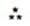
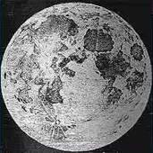
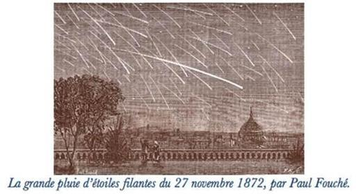

# [[{.calibre10} ]{.calibre2} POST-SCRIPTUM DE MA VIE]{.calibre_55} {#filepos31364245 .calibre_}

:::::: calibre_20
::::: calibre_3
::: calibre_16

------------------------------------------------------------------------

::: calibre_16

:::::
::::::

[Victor Hugo]{.calibre_3}

[[PHILOSOPHIE
]{.bold}]{.calibre_21}

:::::: calibre_22
::::: calibre_21
[ ]{.bold}

::: calibre_16

------------------------------------------------------------------------

::: calibre_16

:::::
::::::

[
Pour toutes demandes ou suggestions]{.calibre_3}

## [[[]{.calibre2}[]{.calibre2}[]{.calibre2}[]{.calibre2}[]{.calibre2}[Table des matières]{.calibre2}]{.bold1}]{.calibre_24} {#calibre_pb_5367 .calibre_57}

::: calibre_52

[]{.calibre_10}

[[[[[Présentation de l'éditeur]{.calibre9}]{.underline}]{.calibre_4}](index_split_4393.html#filepos31373529)]{.calibre_10}

> [[[[[L'Esprit]{.calibre9}]{.underline}]{.calibre_4}](index_split_4394.html#filepos31375763)]{.calibre_10}

> [[[[[Tas de Pierres -- I]{.calibre16}]{.underline}]{.calibre_4}](index_split_4395.html#filepos31376263)]{.calibre_10}

> [[[[[Utilité du Beau]{.calibre16}]{.underline}]{.calibre_4}](index_split_4396.html#filepos31392495)]{.calibre_10}

> [[[[[Tas de Pierres -- II]{.calibre16}]{.underline}]{.calibre_4}](index_split_4397.html#filepos31420306)]{.calibre_10}

> [[[[[Le Goût]{.calibre16}]{.underline}]{.calibre_4}](index_split_4398.html#filepos31438257)]{.calibre_10}

> [[[[[Tas de Pierres -- III]{.calibre16}]{.underline}]{.calibre_4}](index_split_4399.html#filepos31474877)]{.calibre_10}

> [[[[[Les Grands Hommes]{.calibre16}]{.underline}]{.calibre_4}](index_split_4400.html#filepos31494629)]{.calibre_10}

> [[[[[I. Le jubilé de Shakespeare]{.calibre9}]{.underline}]{.calibre_4}](index_split_4400.html#filepos31494629)]{.calibre_10}

> [[[[[II. La Fontaine]{.calibre9}]{.underline}]{.calibre_4}](index_split_4401.html#filepos31513332)]{.calibre_10}

> [[[[[III. Voltaire]{.calibre9}]{.underline}]{.calibre_4}](index_split_4402.html#filepos31515748)]{.calibre_10}

> [[[[[IV. Beaumarchais]{.calibre9}]{.underline}]{.calibre_4}](index_split_4403.html#filepos31517454)]{.calibre_10}

> [[[[[V. Du génie]{.calibre9}]{.underline}]{.calibre_4}](index_split_4404.html#filepos31521997)]{.calibre_10}

> [[[[[Tas de Pierres -- IV]{.calibre16}]{.underline}]{.calibre_4}](index_split_4405.html#filepos31535802)]{.calibre_10}

> [[[[[[Promontorium somnii]{.calibre16}]{.underline}]{.italic}]{.calibre_4}](index_split_4406.html#filepos31559306)]{.calibre_10}

> [[[[[I]{.calibre9}]{.underline}]{.calibre_4}](index_split_4406.html#filepos31559306)]{.calibre_10}

> [[[[[II]{.calibre9}]{.underline}]{.calibre_4}](index_split_4407.html#filepos31600133)]{.calibre_10}

> [[[[[III]{.calibre9}]{.underline}]{.calibre_4}](index_split_4408.html#filepos31626412)]{.calibre_10}

> [[[[[Tas de Pierres -- V]{.calibre16}]{.underline}]{.calibre_4}](index_split_4409.html#filepos31660288)]{.calibre_10}

> [[[[[L'Âme]{.calibre9}]{.underline}]{.calibre_4}](index_split_4410.html#filepos31683474)]{.calibre_10}

> [[[[[Tas de Pierres -- VI]{.calibre16}]{.underline}]{.calibre_4}](index_split_4411.html#filepos31683772)]{.calibre_10}

> [[[[[De la Vie et de la Mort]{.calibre16}]{.underline}]{.calibre_4}](index_split_4412.html#filepos31711518)]{.calibre_10}

> [[[[[Rêveries sur Dieu]{.calibre16}]{.underline}]{.calibre_4}](index_split_4413.html#filepos31746762)]{.calibre_10}

> [[[[[Un athée]{.calibre16}]{.underline}]{.calibre_4}](index_split_4414.html#filepos31770901)]{.calibre_10}

> [[[[[Choses de l'infini]{.calibre16}]{.underline}]{.calibre_4}](index_split_4415.html#filepos31790057)]{.calibre_10}

> [[[[[II]{.calibre9}]{.underline}]{.calibre_4}](index_split_4417.html#filepos31804690)]{.calibre_10}

> [[[[[III]{.calibre9}]{.underline}]{.calibre_4}](index_split_4418.html#filepos31823527)]{.calibre_10}

> [[[[[Contemplation suprême]{.calibre9}]{.underline}]{.calibre_4}](index_split_4419.html#filepos31833565)]{.calibre_10}

> [[[[[I]{.calibre16}]{.underline}]{.calibre_4}](index_split_4419.html#filepos31833565)]{.calibre_10}

> [[[[[II]{.calibre16}]{.underline}]{.calibre_4}](index_split_4419.html#filepos31833565)]{.calibre_10}

> [[[[[III]{.calibre16}]{.underline}]{.calibre_4}](index_split_4419.html#filepos31833565)]{.calibre_10}

[!{.calibre3}
]{.calibre_7}

## [[[]{.calibre2}[]{.calibre2}[]{.calibre2}[]{.calibre2}[]{.calibre2}[Présentation de l'éditeur]{.calibre2}]{.bold1}]{.calibre_24} {#calibre_pb_5370 .calibre_57}

::: calibre_52

[ ]{.calibre4}

[Les derniers manuscrits de prose de Victor Hugo se composent de gros cahiers de grand format et de nombreuses feuilles volantes.]{.calibre4}

[Les cahiers portent ce titre mélancolique : POST-SCRIPTUM DE MA VIE. Ils datent de l'exil, et des années où la santé de Victor Hugo subissait une crise assez grave. Il y a deux parts à faire de ces pages, la part littéraire et la part philosophique : dans la première, les idées sur l'art, la poésie et les poètes ; dans la seconde, les hautes méditations sur l'âme et la destinée, sur la création et Dieu.]{.calibre4}

[Les feuilles volantes portent ce titre modeste : TAS DE PIERRES. Ces pierres, ce sont des pensées ; des pensées mêlées et variées sur toutes sortes de matières : morale, histoire, politique, les sentiments, l'amour, les femmes, etc. A ce tas de pensées l'auteur avait déjà puisé pour beaucoup de ses livres, mais il en restait un bon nombre, et des meilleures. Pour ménager l'attention du lecteur, on les a espacées, selon les sujets, entre les morceaux plus développés.]{.calibre4}

[L'ensemble donne ainsi une sorte de testament de la pensée du poète, la somme de son expérience et de sa sagesse, le dernier mot de sa critique littéraire et de sa philosophie religieuse.]{.calibre4}

[La première édition de [Post Scriptum de Ma vie]{.italic} date de 1901 (Edition Calmann Lévy)]{.calibre4}

## [[[]{.calibre2}[]{.calibre2}[]{.calibre2}[]{.calibre2}[]{.calibre2}[]{.calibre2}[]{.calibre2}[]{.calibre2}[]{.calibre2}[]{.calibre2}[]{.calibre2}[]{.calibre2}[]{.calibre2}[]{.calibre2}[]{.calibre2}[]{.calibre2}[]{.calibre2}[]{.calibre2}[]{.calibre2}[]{.calibre2}[]{.calibre2}[]{.calibre2}[]{.calibre2}[]{.calibre2}[]{.calibre2}[]{.calibre2}[]{.calibre2}[]{.calibre2}[]{.calibre2}[]{.calibre2}[L'Esprit]{.calibre2}]{.bold1}]{.calibre_24} {#calibre_pb_5372 .calibre_57}

::: calibre_52

[[
]{.calibre_7}]{.bold}

### [[[]{.calibre2}[]{.calibre2}[]{.calibre2}[]{.calibre2}[]{.calibre2}[Tas de Pierres -- I]{.calibre2}]{.bold1}]{.calibre_39} {#tas-de-pierres-i .calibre_38}

[[]{.italic}]{.calibre_3}

[[!{.calibre3}]{.italic}]{.calibre_3}

[ ]{.calibre4}

[Ô écrivains, mes contemporains, vous nés avec le siècle, et vous plus jeunes, avenir vivant de la France, je vous salue et je vous aime.]{.calibre4}

[ ]{.calibre4}

[Les écrivains et les poètes de ce siècle ont cet avantage étonnant qu'ils ne procèdent d'aucune école antique, d'aucune seconde main, d'aucun modèle.]{.calibre4}

[Ils n'ont pas d'ancêtres, et ils ne relèvent pas plus de Dante que d'Homère, pas plus de Shakespeare que d'Eschyle. Les poètes du dix-neuvième siècle, les écrivains du dix-neuvième siècle, sont les fils de la Révolution française.]{.calibre4}

[Ce volcan a deux cratères, 89 et 93. De là deux courants de lave. Ce double courant, on le retrouve aussi dans les idées.]{.calibre4}

[Tout l'art contemporain résulte directement et sans intermédiaire de cette genèse formidable. Aucun poète antérieur au dix-neuvième siècle, si grand qu'il soit, n'est le générateur du dix-neuvième siècle.]{.calibre4}

[Nous n'avons pas un homme dans nos racines, mais nous avons l'humanité.]{.calibre4}

[Si vous voulez absolument rattacher la littérature de ce siècle à des hommes antérieurs à notre époque, cherchez ces hommes, non dans la littérature, mais dans l'histoire, et allez droit à Danton, par exemple. Mais ce mouvement vient de plus haut que les hommes. Il vient des idées. Il est la Révolution même.]{.calibre4}

[]{.calibre_7}

[{.calibre3}]{.calibre_7}

[]{.calibre4}

[J'aime tous les hommes qui pensent, même ceux qui pensent autrement que moi. Penser, c'est déjà être utile, c'est toujours et en tout cas faire effort vers Dieu.]{.calibre4}

[Les dissentiments des penseurs sont peut-être utiles. Qui sait ? au fond, tous vont au même but, mais par des voies différentes. Il est peut-être bon que les routes soient diverses pour que le genre humain ait plus d'éclaireurs. A force de battre le buisson des idées, les philosophies, même les plus lointains et les plus perdus, finissent par faire lever des vérités.]{.calibre4}

[J'écrivais cela un jour à un rêveur, rêveur autrement que moi, qui voulait m'entraîner dans sa croyance, et j'ajoutais : --- Je vous suivrai du regard dans votre route, mais sans quitter la mienne.]{.calibre4}

[]{.calibre_7}

[{.calibre3}]{.calibre_7}

[ ]{.calibre4}

[J'appartiens à Dieu comme esprit et à l'humanité comme force. Pourtant l'excès de généralisation mène à s'abstraire en poésie, et à se dénationaliser en politique.]{.calibre4}

[On finit par ne plus adhérer à sa vie et par ne plus tenir à sa patrie.]{.calibre4}

[Double écueil ! que je tâche d'éviter. Je cherche l'idéal, mais en touchant toujours du bout du pied le réel. Je ne veux ni perdre terre comme poète, ni perdre France comme citoyen.]{.calibre4}

[]{.calibre_7}

[{.calibre3}]{.calibre_7}

[ ]{.calibre4}

[[L'art existe de plein droit, aussi naturellement que la nature.]{.calibre_63}]{.calibre4}

[[L'art, c'est la création propre à l'homme. L'art est le produit nécessaire et fatal d'une intelligence limitée, comme la nature est le produit nécessaire et fatal d'une intelligence infinie. L'art est à l'homme ce que la nature est à Dieu.]{.calibre_63}]{.calibre4}

[]{.calibre_7}

[{.calibre3}]{.calibre_7}

[ ]{.calibre4}

[La poésie contient la philosophie comme l'âme contient la raison.]{.calibre4}

[]{.calibre_7}

[{.calibre3}]{.calibre_7}

[La logique est la géométrie de l'intelligence. Il faut de la logique dans la pensée. Mais on ne fait pas plus de la pensée avec la logique qu'on ne fait un paysage avec la géométrie.]{.calibre4}

[]{.calibre_7}

[{.calibre3}]{.calibre_7}

[ ]{.calibre4}

[L'intelligence est l'épouse, l'imagination est la maîtresse, la mémoire est la servante.]{.calibre4}

[]{.calibre_7}

[{.calibre3}]{.calibre_7}

[]{.calibre4}

[Quand l'homme de guerre a fini sa besogne de héros, il rentre dans sa maison et pend son épée au clou. Il n'en va pas de même pour les penseurs. Les idées ne s'accrochent pas au clou comme les épées. Quand le philosophe, quand le poète, se repose, ses idées continuent de combattre. Elles s'en vont en liberté, comme des folles sublimes, tout briser dans les mauvaises âmes et remuer le monde.]{.calibre4}

[]{.calibre_7}

[{.calibre3}]{.calibre_7}

[]{.calibre4}

[L'intelligence et le coeur sont deux régions sympathiques et parallèles ; l'une ne s'élargit pas sans que l'autre s'agrandisse ; l'une ne se hausse pas sans que l'autre s'élève.]{.calibre4}

[Dans le domaine de l'art, il n'y a pas de lumière sans chaleur.]{.calibre4}

[]{.calibre_7}

[{.calibre3}]{.calibre_7}

[]{.calibre4}

[L'art a pour résultat, lors même qu'il ne l'a pas pour objet apparent, l'amélioration de l'homme.]{.calibre4}

[Un bien immense et réel, quoiqu'il échappe souvent aux esprits superficiels, unit le beau, d'un côté au vrai, de l'autre à l'honnête.]{.calibre4}

[Les chefs-d'oeuvre, parfois même sans que la volonté de leurs auteurs y ait part (ô infirmité du génie !), dégagent continuellement, mystérieusement, divinement, et répandent, pour ainsi dire, dans l'air autour d'eux, une moralité pénétrante et saine.]{.calibre4}

[Celui qui passe auprès d'eux et qui respire leur atmosphère s'en imprègne à son insu. Il n'a voulu que devenir plus intelligent, il devient meilleur.]{.calibre4}

[]{.calibre_7}

[{.calibre3}]{.calibre_7}

[]{.calibre4}

[La civilisation s'exhale de l'art comme le parfum de la fleur.]{.calibre4}

[]{.calibre_7}

[{.calibre3}]{.calibre_7}

[]{.calibre4}

[Voulez-vous vous rendre compte de la puissance civilisatrice de l'art, de l'art pur, même sans mélange d'intention humaine et sociale ? Cherchez dans les bagnes un homme qui sache ce que c'est que Mozart, Virgile et Raphaël, qui cite Horace de mémoire, qui s'émeuve de l'[Orphée]{.italic} et du [Freyschütz]{.italic} qui contemple un clocher de cathédrale ou une statue de Jean Goujon, cherchez cet homme dans tous les bagnes de tous les pays civilisés, vous ne le trouverez pas. Être sensible à l'art, c'est être incapable de crime.]{.calibre4}

[]{.calibre_7}

[{.calibre3}]{.calibre_7}

[]{.calibre4}

[Les lettrés, les érudits, les savants, montent à des échelles ; les poètes et les artistes sont des oiseaux.]{.calibre4}

[]{.calibre_7}

[{.calibre3}]{.calibre_7}

[]{.calibre4}

[Voulez-vous voir d'un seul coup d'oeil, dans une sorte d'abrégé clair, frappant, profond et vrai, qui donne la solution en même temps que le problème, la figure de beaucoup de questions, et entre autres de la question littéraire de ce siècle ? regardez un chêne au printemps : tronc séculaire, vieilles racines, vieilles branches ; feuilles vertes, fraîches et nouvelles. La tradition et la nouveauté, la tradition produisant la nouveauté, la nouveauté surgissant de la tradition. Tout est là.]{.calibre4}

[]{.calibre_7}

[{.calibre3}]{.calibre_7}

[]{.calibre4}

[L'homme, même le plus vulgaire et le plus [positif]{.italic} comme on dit de nos jours, a besoin de rêverie. Ne fût-ce qu'un instant. Ne fût-ce qu'un éclair. Il lui on faut. Mais toutes les âmes n'ont pas le don merveilleux de rêver spontanément. Ce qui fait que la musique plaît tant au commun des hommes, c'est que c'est de la rêverie toute faite. Les esprits d'élite aiment la musique, mais ils aiment encore mieux faire leur rêverie eux-mêmes.]{.calibre4}

[]{.calibre_7}

[{.calibre3}]{.calibre_7}

[]{.calibre4}

[Plus la pensée tombe de haut, plus elle est sujette à s'évaporer en rêverie.]{.calibre4}

[]{.calibre_7}

[{.calibre3}]{.calibre_7}

[]{.calibre4}

[Une voix crie au poète : Sois le poète de l'avenir, sois l'homme de la génération qui vient après la nôtre, étudie les lois et les abus et préoccupe-toi de la société. Une autre voix lui dit : Sois le poète du présent pour toutes les générations futures, sois l'homme perpétuel, contemple les arbres et les étoiles et préoccupe-toi de la nature.]{.calibre4}

[Laquelle écouter ? --- Toutes les deux.]{.calibre4}

[Sois le poète de la nature, tu seras le poète des hommes.]{.calibre4}

[]{.calibre_7}

[{.calibre3}]{.calibre_7}

[]{.calibre4}

[Fixez votre regard sur l'oeuvre des poètes complets, voici ce que vous trouvez : dans le détail, dans la forme, une précision sévère, et dans le fond, une grandeur étrange et presque illimitée et qu'on ne peut contempler sans y découvrir à chaque instant de nouveaux horizons pleins du rayonnement mystérieux de l'infini. Cela est la vraie poésie, qui se compose du beau et de l'idéal et qui les combine. Fusion d'éléments presque contraires que le génie seul peut accomplir ! Le beau veut des contours ; l'idéal veut de l'infini.]{.calibre4}

[[
]{.calibre_7}]{.bold}

### [[[]{.calibre2}[]{.calibre2}[]{.calibre2}[]{.calibre2}[]{.calibre2}[Utilité du Beau]{.calibre2}]{.bold1}]{.calibre_39} {#utilité-du-beau .calibre_38}

[{.calibre3}]{.calibre_10}

[[Beauté voilée de Constantinople]{.italic} d'Arthur Bridgman[[[[^\[57\]^]{.calibre_12}]{.underline}]{.calibre_4}](index_split_4440.html#filepos32188072){#filepos31393144}]{.calibre_3}

[ ]{.calibre4}

[Un homme a, par don de nature ou par développement d'éducation, le sentiment du Beau. Supposez-le en présence d'un chef-d'oeuvre, même d'un de ces chefs-d'oeuvre qui semblent inutiles, c'est-à-dire qui sont créés sans souci direct de l'humain, du juste et de l'honnête, dégagés de toute préoccupation de conscience et faits sans autre but que le Beau ; c'est une statue, c'est un tableau, c'est une symphonie, c'est un édifice, c'est un poème. En apparence, cela ne sert à rien, à quoi bon une Vénus ? à quoi bon une flèche d'église ? à quoi bon une ode sur le printemps ou l'aurore, etc., avec ses rimes ? Mettez cet homme devant cette oeuvre. Que se passe-t-il en lui ? le Beau est là. L'homme regarde, l'homme écoute ; peu à peu, il fait plus que regarder, il voit ; il fait plus qu'écouter, il entend. Le mystère de l'art commence à opérer ; toute oeuvre d'art est une bouche de chaleur vitale ; l'homme se sent dilaté. La lueur de l'absolu, si prodigieusement lointaine, rayonne à travers cette chose, lueur sacrée et presque formidable à force d'être pure. L'homme s'absorbe de plus en plus dans cette oeuvre ; il la trouve belle ; il la sent s'introduire en lui. Le Beau est vrai de droit. L'homme, soumis à l'action du chef-d'oeuvre, palpite, et son coeur ressemble à l'oiseau qui, sous la fascination, augmente son battement d'ailes.]{.calibre4}

[Qui dit belle oeuvre dit oeuvre profonde ; il a le vertige de cette merveille entr'ouverte. Les doubles-fonds du Beau sont innombrables. Sans que cet homme, soumis à l'épreuve de l'admiration, s'en rende bien clairement compte peut-être, cette religion qui sort de toute perfection, la quantité de révélation qui est dans le Beau, l'éternel affirmé par l'immortel, la constatation ravissante du triomphe de l'homme dans l'art, le magnifique spectacle, en face de la création divine, d'une création humaine, émulation inouïe avec la nature, l'audace qu'a cette chose d'être un chef-d'oeuvre à côté du soleil, l'ineffable fusion de tous les éléments de l'art, la ligne, le son, la couleur, l'idée, en une sorte de rythme sacré, d'accord avec le mystère musical du ciel, tous ces phénomènes le pressent obscurément et accomplissent, à son insu même, on ne sait quelle perturbation en lui. Perturbation féconde. Une inexprimable pénétration du Beau lui entre par tous les pores.]{.calibre4}

[Il creuse et sonde de plus en plus l'oeuvre étudiée ; il se déclare que c'est une victoire pour une intelligence de comprendre cela, et que tous peut-être n'en sont pas capables ni dignes ; il y a de l'exception dans l'admiration, une espèce de fierté améliorante le gagne ; il se sent élu, il lui semble que ce poème l'a choisi. Il est possédé du chef-d'oeuvre. Par degrés, lentement, à mesure qu'il contemple ou à mesure qu'il lit, d'échelon en échelon, montant toujours, il assiste, stupéfait, à sa croissance intérieure ; il voit, il comprend, il accepte, il songe, il pense, il s'attendrit, il veut ; les sept marches de l'initiation ; les sept noces de la lyre auguste qui est nous-mêmes. Il ferme les yeux pour mieux voir, il médite ce qu'il a contemplé, il s'absorbe dans l'intuition, et tout à coup, net, clair, incontestable, triomphant, sans trouble, sans brume, sans nuage, au fond de son cerveau, chambre noire, l'éblouissant spectre solaire de l'idéal apparaît ; et voilà cet homme qui a un autre coeur.]{.calibre4}

[Quelque chose en lui se redresse et quelque chose se penche ; la contemplation est devenue éblouissement, la méditation est devenue pitié. Il semble que cet esprit ait renouvelé sa provision d'infini. Il se sent meilleur. Il déborde de miséricorde et de mansuétude. S'il était juge, il absoudrait ; s'il était prêtre, il éteindrait l'enfer. Le chef-d'oeuvre, inconscient, a donné à cet homme toutes sortes de conseils sérieux et doux. Une mystérieuse impulsion dans le sens du bien lui est venue de ce bloc de pierre, de cette mélodie qui ressemble à une vocalise de fauvette, de cette strophe où il n'y a que des fleurs et de la rosée. La bonté a jailli de la beauté. Il y a de ces étranges effets de source qui tiennent à la communication des profondeurs entre elles.]{.calibre4}

[Lady Montagu, après avoir vu au Trippenhaus d'Amsterdam l'Amalthée de Jordaëns, s'écriait : [Je]{.italic} [voudrais]{.italic} [avoir]{.italic} [là]{.italic} [un]{.italic} [pauvre]{.italic} [pour]{.italic} [lui]{.italic} [vider]{.italic} [ma]{.italic} [bourse dans]{.italic} [les]{.italic} [mains]{.italic} !]{.calibre4}

[Être grand et inutile, cela ne se peut. L'art, dans les questions de progrès et de civilisation, voudrait garder la neutralité qu'il ne pourrait. L'humanité ne peut être en travail sans être aidée par sa force principale, la pensée. L'art contient l'idée de liberté, [arts]{.italic} [libéraux]{.italic} ; les lettres contiennent l'idée d'humanité, [humaniores]{.italic} [litterae]{.italic}. L'amélioration humaine et terrestre est une résultante de l'art, inconscient parfois, plus souvent conscient. Les moeurs s'adoucissent, les coeurs se rapprochent, les bras embrassent, les énergies s'entre secourent, la compassion germe, la sympathie éclate, la fraternité se révèle, parce qu'on lit, parce qu'on pense, parce qu'on admire. Le beau entre dans nos yeux rayon et sort larme. Aimer est au sommet de tout.]{.calibre4}

[L'art émeut. De là sa puissance civilisatrice. Les émus sont les bons ; les émus sont les grands. Tout martyr a été ému ; c'est par l'émotion qu'il est devenu impassible. Les grandes fermetés viennent des pleurs. Le héros songe à la patrie ; et ses yeux se mouillent. Caton commence par l'attendrissement.]{.calibre4}

[Insistons sur cette vérité ignorée et surprenante : l'art, à la seule condition d'être fidèle à sa loi, le beau, civilise les hommes par sa puissance propre, même sans intention, même contre son intention.]{.calibre4}

[Certes, si jamais un esprit, au milieu des misères terrestres, en face des catastrophes et des attentats, en présence de toutes ces choses que nous nommons droit, honneur, vérité, dévouement, devoir, a représenté la volonté absolue d'indifférence, c'est Horace. Cette vaste rage de Juvénal contre le mal, cette écume du lion juste, cherchez-la dans Horace ; vous trouverez le sourire. Horace, c'est le neutre ; il veut l'être du moins. Un esprit qui se veut eunuque, quel froid terrible ! S'il a une foi, elle est contraire au progrès. C'est l'indifférence implacable. La satiété, voilà le fond de sa sérénité. Horace fait sa digestion. Il a le contentement accablé du repu. L'intestin-colon lui monte au cerveau. Ce qui fut convoitise devient sécrétion en bas et idée en haut, c'est là tout le travail de sa machine. Il a bien soupe chez Mécène, ne lui en demandez pas plus ; ou il vient de faire une partie de paume avec Virgile, chassieux comme lui. On s'est fort diverti. Quant aux temps présents ou passés, quant au [fas]{.italic} et au [nefas]{.italic}, quant au bien et au mal, quant au faux et au vrai, il n'en a cure. Sa philosophie se borne à l'acceptation bienveillante du fait, quel qu'il soit ; l'iniquité qui donne de bons dîners, est son amie ; il est le commensal né du crime réussi. Prendre l'horreur publique au sérieux, fi donc ! Cela nuancerait d'une teinte foncée son style qui veut rester transparent ; son hexamètre, si libre devant la prosodie, est esclave devant César ; cette danse s'achève à plat ventre. Ses épîtres ont cette surface de sagesse qu'a eue La Fontaine plus tard : « Le sage dit selon le temps : Vive le roi ! vive la ligue ! » Ses satires n'exercent sur les lois et les moeurs aucune surveillance ; l'affreux spectacle permanent des Esquilies obtient de lui en passant un vers insouciant ; ses odes mentionnent les dieux, font écho presque machinalement à l'ode sacerdotale grecque, et mettent en équilibre Jupiter et César ; et quant à l'amour, le [puer]{.italic} auquel elles s'adressent volontiers est frère du Bathylle d'Anacréon et du Corydon de Virgile. Ajoutez, à chaque instant, l'obscénité toute crue. Voilà le poète. Qu'est-ce que l'homme ? un poltron qui a jeté son boucher dans la bataille, un sophiste des appétits, n'ayant qu'un but, la jouissance, un douteur ne croyant qu'à la possession de l'heure, un enfant du peuple en domesticité chez le Tyran, un badin du lendemain de la république morte, un romain qui a derrière lui Rome tuée par Octave et qui ne retourne même pas la tête pour regarder le cadavre sacré de sa mère. C'est là Horace.]{.calibre4}

[Eh bien, lisez-le. Ce sceptique vous consolidera, ce lâche vous enflammera, ce corrompu vous assainira ; et de la lecture de cet homme qui n'est pas bon, vous sortirez meilleur.]{.calibre4}

[Pourquoi ? c'est qu'Horace, c'est beau.]{.calibre4}

[Et qu'à travers le mal, qui est à la surface, le beau, qui est au fond, agit.]{.calibre4}

[[Forma]{.italic}, la beauté. Le beau, c'est la forme. Preuve étrange et inattendue que la forme, c'est le fond. Confondre forme avec surface est absurde. La forme est essentielle et absolue ; elle vient des entrailles mêmes de l'idée. Elle est le Beau ; et tout ce qui est beau manifeste le vrai.]{.calibre4}

[Insistons sur ces évidences très difficiles à admettre.]{.calibre4}

[L'émotion de lire Horace est exquise. C'est une jouissance toute littéraire, et singulièrement profonde. On s'absorbe dans ce rare langage ; chaque détail a une saveur à part. Une forte quantité de bon sens est malheureusement conciliable avec l'abaissement moral ; tout ce bon sens-là est dans Horace. Entre les quatre murs du fait accompli, comme il raisonne juste ! Mais c'est ici qu'on apprend à distinguer justesse de justice. Du reste il n'est pas bon, nous venons de le dire ; mais il n'est pas méchant. Être méchant, c'est un effort ; Horace ne fait pas d'effort.]{.calibre4}

[Son style se place entre le lecteur et lui, d'abord comme un voile, puis comme une clarté, puis comme une forme d'autre chose qui n'est plus Horace, qui est le Beau. Une certaine disparition d'Horace se fait. Le côté méprisable se développe sous le côté aimable. La turpitude atténuée devient bagatelle : [Nescio]{.italic} [quid]{.italic} [méditons]{.italic} [nugarum]{.italic}. Cette philosophie lâche dans ce style souple est douce à voir flotter comme la ceinture défaite de Vénus ; nul moyen de faire la grosse voix contre cet enchantement. Ce vers Phryné montre sa gorge, et il n'y a plus là de juges ; il y a des hommes vaincus. Cette victoire du style sur le lecteur est-elle malsaine ? Loin de là. L'extase littéraire est essentiellement honnête. Il est impossible de la mal prendre et de s'en mal trouver. Une certaine chasteté se dégage de toute poésie vraie. Peu à peu le bon sens d'Horace perd la mauvaise odeur de son origine, ce style pur le filtre, et l'on ne sent plus que l'ascendant de cette raison. Horace est limpide et net. Le lecteur est tout à la joie de voir si clair dans un esprit, à travers une épaisseur de deux mille ans. Horace est un composé de raison qui peut être divine et de sensualité qui peut être bestiale ; ce composé, espèce d'être mixte fort humain, discute dans l'épître, rit dans la satire, chante dans l'ode, se condense dans ce vers, y produit on ne sait quelle lumière, et s'y transfigure en sagesse.]{.calibre4}

[C'est de la sagesse d'oiseau. Boire, manger, dormir, gazouiller à l'aube, faire le nid et l'amour. Cette sagesse, qui, avant d'être celle d'Horace, était celle de Salomon, devient bonne dans cette poésie, tant cette poésie est saine. Dans cette poésie il y a du parfum, il y a du baiser, il y a du rayon.]{.calibre4}

[[Toutes les révoltes contre la pédanterie sont là : prosodie disloquée, césure dédaignée, mots coupés en deux ; mais dans cette licence que de science ! Tel hémistiche est une joie, et l'on se récrie. Le contact de ce vers fin et fort est toute éducation pour la pensée ; c'est une volupté de manier ces hexamètres avec les doigts de lumière de l'esprit ; on devient délicat à toucher ce divin style ; et le plus barbare en sort civilisé. Louis XVIII, philosophe relatif, disait : [C'est]{.italic} [Horace]{.italic} [qui]{.italic} [m'a]{.italic} [rendu]{.italic} [libéral]{.italic}.]{.calibre_63}]{.calibre4}

[On médite ces ressources infinies de légèreté et de force. Le vers, familier, se tourne, se dresse, saute, va, vient, se fouille du bec, et n'a qu'un souci : être beau. Quoi de plus charmant qu'un moineau-franc tout à l'arrangement de ses plumes ! Horace arrive à cette toute-puissance qu'a la gentillesse des enfants ; il s'impose indolemment et insolemment ; il a la pleine liberté de la grâce ; le despotisme de l'élégance est en lui.]{.calibre4}

[C'est le railleur, qui, à volonté, est le lyrique ; et quand il lui plaît d'être lyrique, il devient, cette aventure-là lui arrive, presque grand. Telle de ses odes est un triomphe. Les odes d'Horace font vaguement songer à des vases d'albâtre. Telle strophe semble portée par deux bras blancs au-dessus d'une tête lumineuse. C'est ainsi que de certains versets de la Bible semblent revenir de la fontaine.]{.calibre4}

[Tel est Horace. D'autres ont des dons plus augustes, le flamboiement terrible, la foudre aux serres, la vertu fière et planante, l'offensive aux méchants, les colères du sublime, tous les glaives qu'on peut tirer de ce fourreau, l'indignation, les grands espaces, les grands essors, une réverbération de Cocyte ou d'Apocalypse ; Horace, règne par le charme serein. Il a ce qu'on pourrait nommer la blancheur du style.]{.calibre4}

[Chose merveilleuse, et ce sont là les étonnements croissants de l'art contemplé, oui, l'on peut affirmer que les idées dans Horace, ce qu'on nomme le fond, ce n'est que la surface, et que le vrai fond c'est la forme, cette forme éternelle qui, dans le mystère insondable du Beau, se rattache à l'absolu.]{.calibre4}

[Voulez-vous un autre exemple ? Prenez Virgile.]{.calibre4}

[Qu'y a-t-il de plus misérable comme idée que ceci : Octave-Auguste admis parmi les astres et les étoiles se rangeant pour lui faire place. Jamais la flatterie fut-elle plus abjecte ? C'est l'idée, c'est le fond, n'est-ce pas ? Et c'est plat, et honteux. Voici la forme :]{.calibre4}

[
[Tuque adeo, quem mox quse sint habitura deorum
Concilia, incertum est ; urbesne invisere, Caesar,
Terrarumque velis curam et te maximus orbis
Auctorem frugum tempestatumque potentem
Accipiat, cingens materna tempora myrto ;
An deus immensi venias maris ; ac tua nautae
Numina sola colant, tibi serviat ultima Thule,
Teque sibi generum Tethys emat omnibus undis ;
Anne novum tardis sidus te mensibus addas,
Qua locus Erigonen inter Chelasque sequentes
Panditur : ipse tibi jam brachia contrahit ardens
Scorpius, et coeli j'usta plus parte relinquit :
Quidquid eris, (nam te nec sperent Tartara regem,
Nec tibi regnandi veniat tam dira cupido,
Quamvis Elysios miretur Graecia campos,
Nec repetita sequi curet Proserpina matrem),
Da facilem cursum, atque audacibus annue coeptis,
Ignarosque vias mecum miseratus agrestes,
Ingredere, et votis jam nunc assuesce vocari.]{.italic}[[[[[[^\[58\]^]{.italic}]{.bold}]{.calibre_21}]{.underline}]{.calibre_4}](index_split_4440.html#filepos32188455){#filepos31412586}]{.calibre4}

[ ]{.calibre4}

[Je lis ces vers, je subis cette forme, et quel est son premier effet ? j'oublie Auguste, j'oublie même Virgile ; le lâche tyran et le chanteur lâche s'effacent, comme Horace tout à l'heure, le poète s'éclipse dans sa poésie ; j'entre en vision ; le prodigieux ciel s'ouvre au-dessus de moi, j'y plonge, j'y plane, je m'y précipite, je vois la région incorruptible et inaccessible, l'immanence splendide, les mystérieux astres, cette voie lactée, ce zodiaque amenant chaque mois au zénith un archipel de soleils, ce scorpion qui contracte ses bras énormes, la profondeur, l'azur ; et, par l'idée, par ce que vous nommez le fond, j'étais dans le petit, et par le style, par ce que vous nommez la forme, me voilà dans l'immense.]{.calibre4}

[Que dites-vous de vos distinctions, forme et fond ?]{.calibre4}

[Il y a deux hommes dans cet homme, un courtisan et un poète ; le poète esclave du courtisan, hélas ! comme l'âme de la bête dans la machine humaine. Le courtisan a eu une idée vile, il l'a confiée au poète, l'aigle avec un ver de terre dans le bec n'en vole pas moins au soleil, et de l'idée basse le poète a fait une page sublime. Ô sainteté involontaire de l'art ! splendeur propre à l'esprit de l'homme ! Beauté du beau !]{.calibre4}

[Tous les développements qu'on donne à une vérité convergent, et c'est pourquoi nous sommes ramenés ici à une observation déjà faite à propos d'Horace : il y a dans cette page superbe une surface et un fond ; la surface, c'est ce que vous appelez l'idée première, c'est la louange courtisane à Auguste ; le fond, c'est la forme. Par la vertu du grand style, la surface, la flatterie au maître, immonde écorce du sublime, se brise et s'ouvre, et par la déchirure, le fond étoile de l'art, l'éternel beau, apparaît.]{.calibre4}

[Idéal et Beauté sont identiques ; idéal correspond à idée et beauté à forme ; donc idée et fond sont congénères.]{.calibre4}

[Nous voici arrivés, la logique le voulant, à une vérité presque dangereuse : l'art civilise par sa puissance propre. L'oeuvre, participant de l'influence générale du beau, a une action indépendante au besoin de la volonté de l'ouvrier, et, même à travers le vice de l'artiste, la vertu de l'art rayonne. La Fontaine, immoral, civilise ; Horace, impur, civilise ; Aristophane, inique et cynique, civilise.]{.calibre4}

[En réalité, si l'on veut s'élever, pour regarder l'art, à cette hauteur qui résume tout et où les distinctions comme les collines s'effacent, en réalité, il n'y a ni fond ni forme. Il y a, et c'est là tout, le puissant jaillissement de la pensée apportant l'expression avec elle, le jet du bloc complet, bronze par la fournaise, statue par le moule, l'éruption immédiate et souveraine de l'idée armée du style. L'expression sort comme l'idée, d'autorité ; non moins essentielle que l'idée, elle fait avec elle sa rencontre mystérieuse dans les profondeurs, l'idée s'incarne, l'expression s'idéalise, et elles arrivent toutes deux si pénétrées l'une de l'autre que leur accouplement est devenu adhérence. L'idée, c'est le style ; le style, c'est l'idée. Essayez d'arracher le mot, c'est la pensée que vous emportez. L'expression sur la pensée est ce qu'il faut qu'elle soit, vêtement de lumière à ce corps d'esprit. Le génie, dans cette gésine sacrée qui est l'inspiration, pense le mot en même temps que l'idée. De là ces profonds sens inhérents au mot ; de là ce qu'on appelle le mot de génie.]{.calibre4}

[C'est une erreur de croire qu'une idée peut être rendue de plusieurs façons différentes. Tout en maintenant, bien entendu, au poète souverain, le droit magnifique de développement, cette haute faculté, qui tient à l'habitation des sommets, de mettre en lumière autour de la pensée centrale toutes les idées circonvoisines, tout en maintenant cette faculté et ce droit, qui sont l'essence même de la poésie, nous affirmons ceci : une idée n'a qu'une expression. C'est cette expression-là que le génie trouve. Comment la trouve-t-il ? d'en haut. Par le souffle. Parfois sans savoir comment, mais toujours avec certitude. Instinct d'aigle.]{.calibre4}

[Pour lui, créateur, l'idée avec l'expression, le fond avec la forme, c'est l'unité. L'idée sans le mot, serait une abstraction ; le mot sans l'idée, serait un bruit ; leur jonction est leur vie. Le poète ne peut les concevoir distincts. L'Alphée idée et l'Aréthuse expression, l'Arve jaune et le Rhône bleu coulant côte à côte des lieues entières sans se confondre, non, certes, rien de pareil. Il n'y a point, dans le miracle de l'idée faite style, deux phénomènes, quelque chose comme un embrassement de jumeaux, si étroit qu'il soit. Non. C'est la fusion où la fonte n'a pas laissé de veine, c'est le mélange à sa plus haute puissance, c'est l'amalgame à ne plus reconnaître l'un de l'autre, c'est l'intimité élevée à l'identité.]{.calibre4}

[Ceux qui tentent de défaire brin à brin cette torsion, divine, les vivisecteurs de la critique, n'ont même pas la satisfaction que donne la table de dissection à l'anatomiste, voir des entrailles ici, de la cervelle là, des éclaboussures de sang, une tête dans un panier ; d'un côté le fond, de l'autre la forme. Point. Ils arrivent tout de suite, s'ils sont de bonne foi et s'ils ont le grand sens critique, à l'indivisible, à l'indissoluble, au congénial, à l'absolu. Ils disent : fond et forme sont le même fait de vie.]{.calibre4}

[Le beau est un.]{.calibre4}

[Le beau est âme.]{.calibre4}

[[
]{.calibre_7}]{.bold}

### [[[]{.calibre2}[]{.calibre2}[]{.calibre2}[]{.calibre2}[]{.calibre2}[Tas de Pierres -- II]{.calibre2}]{.bold1}]{.calibre_39} {#tas-de-pierres-ii .calibre_38}

[[]{.italic}]{.calibre_3}

[[!{.calibre3}]{.italic}]{.calibre_3}

[ ]{.calibre4}

[La douleur est diverse comme l'homme. On souffre comme on peut.]{.calibre4}

[]{.calibre_7}

[{.calibre3}]{.calibre_7}

[ ]{.calibre4}

[On croit des autres ce qu'on ferait soi-même.]{.calibre4}

[]{.calibre_7}

[{.calibre3}]{.calibre_7}

[ ]{.calibre4}

[Le bonheur n'avertit de rien.]{.calibre4}

[]{.calibre_7}

[{.calibre3}]{.calibre_7}

[ ]{.calibre4}

[Le boeuf souffre, le char se plaint.]{.calibre4}

[]{.calibre_7}

[{.calibre3}]{.calibre_7}

[ ]{.calibre4}

[L'orgueil est lion, l'égoïsme est tigre, la vanité est chatte.]{.calibre4}

[]{.calibre_7}

[{.calibre3}]{.calibre_7}

[]{.calibre4}

[La vraie force est celle qui a pour devise : Rien de force.]{.calibre4}

[]{.calibre_7}

[{.calibre3}]{.calibre_7}

[ ]{.calibre4}

[Qui n'est pas capable d'être pauvre n'est pas capable d'être libre.]{.calibre4}

[]{.calibre_7}

[{.calibre3}]{.calibre_7}

[ ]{.calibre4}

[Le mal. Défiez-vous de ceux qui s'en réjouissent encore plus peut-être que de ceux qui le font.]{.calibre4}

[]{.calibre_7}

[{.calibre3}]{.calibre_7}

[ ]{.calibre4}

[On dit de moi que je suis un homme bizarre et que j'ai le goût du singulier. C'est vrai, toutes les fois que je songe à ces mots : liberté, grandeur, dignité, honneur, je préfère le singulier au pluriel.]{.calibre4}

[]{.calibre4}

[Dans certains cas, il y a de la grandeur à se laisser tromper et de la honte à se défier. Jaloux, notez ceci : celui qui trompe a en remords tout ce que celui qui est trompé a en confiance.]{.calibre4}

[]{.calibre_7}

[{.calibre3}]{.calibre_7}

[]{.calibre4}

[Je ne sais s'il ne faut pas aimer encore mieux les énormités que les petitesses.]{.calibre4}

[]{.calibre_7}

[{.calibre3}]{.calibre_7}

[ ]{.calibre4}

[Beaucoup d'amis sont comme le cadran solaire : ils ne marquent que les heures où le soleil vous luit.]{.calibre4}

[]{.calibre_7}

[{.calibre3}]{.calibre_7}

[ ]{.calibre4}

[L'éléphant n'est guère plus puissant contre la fourmi que la fourmi contre l'éléphant.]{.calibre4}

[]{.calibre_7}

[{.calibre3}]{.calibre_7}

[ ]{.calibre4}

[--- Tu vois ce mur-là ?]{.calibre4}

[--- Oui, mon général.]{.calibre4}

[--- De quelle couleur est-il ?]{.calibre4}

[--- Blanc, mon général.]{.calibre4}

[--- Je te dis qu'il est noir. De quelle couleur est-il ?]{.calibre4}

[--- Noir, mon général.]{.calibre4}

[--- Tu es un bon soldat.]{.calibre4}

[]{.calibre_7}

[{.calibre3}]{.calibre_7}

[ ]{.calibre4}

[Delalouche disait à Charles Nodier : --- En 1830, je crois avoir tué un Suisse. --- Bien, lui dit Nodier, mais croyez-vous que le Suisse croie avoir été tué ?]{.calibre4}

[]{.calibre_7}

[{.calibre3}]{.calibre_7}

[]{.calibre4}

[Eh mon Dieu ! la beauté est diverse. Selon la nature et selon l'art. Si c'est une femme, que la chair soit du marbre, si c'est une statue, que le marbre soit de la chair.]{.calibre4}

[]{.calibre_7}

[{.calibre3}]{.calibre_7}

[ ]{.calibre4}

[Les méchants envient et haïssent ; c'est leur manière d'admirer.]{.calibre4}

[]{.calibre_7}

[{.calibre3}]{.calibre_7}

[ ]{.calibre4}

[L'envie a l'éblouissement douloureux.]{.calibre4}

[]{.calibre_7}

[{.calibre3}]{.calibre_7}

[ ]{.calibre4}

[Il y a des gens qui font des crimes pour faire des affaires. Ils ont l'art étrange et hideux d'extraire d'un tas de combinaisons atroces la fortune, la bonne vie bourgeoise, tout le plat bien-être d'un Prudhomme enrichi. Chose odieuse et bizarre ! prendre des charbons dans l'enfer pour se faire cuire une soupe aux choux !]{.calibre4}

[]{.calibre_7}

[{.calibre3}]{.calibre_7}

[]{.calibre4}

[Le savant sait qu'il ignore.]{.calibre4}

[]{.calibre_7}

[{.calibre3}]{.calibre_7}

[]{.calibre4}

[En poussant l'aiguille du cadran vous ne ferez pas avancer l'heure.]{.calibre4}

[]{.calibre_7}

[{.calibre3}]{.calibre_7}

[ ]{.calibre4}

[Se laisser calomnier est une des forces de l'honnête homme.]{.calibre4}

[]{.calibre_7}

[{.calibre3}]{.calibre_7}

[ ]{.calibre4}

[L'homme de valeur qui reste modeste, c'est l'or argenté.]{.calibre4}

[]{.calibre_7}

[{.calibre3}]{.calibre_7}

[ ]{.calibre4}

[L'oisiveté est le plus lourd des accablements.]{.calibre4}

[]{.calibre_7}

[{.calibre3}]{.calibre_7}

[ ]{.calibre4}

[Plein d'ennui, c'est-à-dire vide.]{.calibre4}

[On dit quelquefois : Il s'est tué, ennuyé qu'il était de vivre. Il faudrait dire plutôt : Il s'est tué, ennuyé qu'il était de ne pas vivre.]{.calibre4}

[]{.calibre_7}

[{.calibre3}]{.calibre_7}

[]{.calibre4}

[Ne rien faire est le bonheur des enfants et le malheur des vieillards.]{.calibre4}

[]{.calibre_7}

[{.calibre3}]{.calibre_7}

[]{.calibre4}

[L'honnête homme cherche à se rendre utile, l'intrigant à se rendre nécessaire.]{.calibre4}

[]{.calibre_7}

[{.calibre3}]{.calibre_7}

[ ]{.calibre4}

[Avant de s'agrandir au dehors, il faut s'affermir au dedans.]{.calibre4}

[]{.calibre_7}

[{.calibre3}]{.calibre_7}

[ ]{.calibre4}

[Pour être parfaitement heureux il ne suffit pas d'avoir le bonheur, il faut encore le mériter.]{.calibre4}

[]{.calibre_7}

[{.calibre3}]{.calibre_7}

[]{.calibre4}

[Croire, croître.]{.calibre4}

[]{.calibre_7}

[{.calibre3}]{.calibre_7}

[ ]{.calibre4}

[On peut avoir des raisons de se plaindre et n'avoir pas raison de se plaindre.]{.calibre4}

[]{.calibre_7}

[{.calibre3}]{.calibre_7}

[ ]{.calibre4}

[La sottise dit, la vérité fait.]{.calibre4}

[]{.calibre_7}

[{.calibre3}]{.calibre_7}

[ ]{.calibre4}

[L'esprit d'une bête, c'est de ne pas être un sot.]{.calibre4}

[]{.calibre_7}

[{.calibre3}]{.calibre_7}

[]{.calibre4}

[La vertu a un voile, le vice a un masque.]{.calibre4}

[]{.calibre_7}

[{.calibre3}]{.calibre_7}

[ ]{.calibre4}

[Ne vous donnez pas pour but d'être quelque chose, mais d'être quelqu'un.]{.calibre4}

[]{.calibre_7}

[{.calibre3}]{.calibre_7}

[ ]{.calibre4}

[On voit les qualités de loin et les défauts de près.]{.calibre4}

[]{.calibre_7}

[{.calibre3}]{.calibre_7}

[ ]{.calibre4}

[Après avoir entendu les paroles, ne creusez pas trop les consciences. Vous trouveriez souvent au fond de la sévérité l'envie, au fond de l'indulgence la corruption.]{.calibre4}

[]{.calibre_7}

[{.calibre3}]{.calibre_7}

[ ]{.calibre4}

[Il y a du prévu dans la vertu, non dans l'héroïsme. La vertu a une espèce de prosodie ; l'héroïsme est tout de création immédiate et spontanée.]{.calibre4}

[[
]{.calibre_7}]{.bold}

### [[[]{.calibre2}[]{.calibre2}[]{.calibre2}[]{.calibre2}[]{.calibre2}[Le Goût]{.calibre2}]{.bold1}]{.calibre_39} {#le-goût .calibre_38}

[ ]{.calibre4}

[Nous n'avons, certes, nulle intention de nier ni de chagriner le goût relatif qui joue un rôle utile dans les rhétoriques et les prosodies ; mais, sans vouloir ôter son pain à M. Quicherat, on peut songer à Eschyle et à Isaïe. Qu'il nous soit donc permis de le dire, il y a un goût supérieur et absolu qui ne se rédige pas en formules, et qui est tout à la fois la loi latente et la loi patente de l'art. Ce goût-là, le vrai, l'unique, est peu connu de ceux qui font profession de l'enseigner.]{.calibre4}

[Ce goût-là, c'est le grand arcane. C'est ce goût supérieur qui, à l'inexprimable stupeur de Vitruve, augmente ou diminue, selon on ne sait quelle progression mystérieuse, dans la colonnade du Parthénon, le diamètre des colonnes et l'espacement des entre-colonnements ; grosse faute partout ailleurs, beauté là. C'est ce goût supérieur qui, peu soucieux d'être « sobre », consacre, à chaque instant, dans [l'Iliade]{.italic}, six, huit, dix vers à la description minutieuse d'une blessure. C'est lui qui, effronté, fait mettre Messaline toute nue par Juvénal. C'est lui qui, sentant que la nef va s'écrouler, faisant de nécessité vertu et tirant une beauté d'une infirmité, ajoute aux cathédrales ces sublimes arcs-boutants, si stupidement critiqués, lesquels semblent les arches obliques d'un pont de la terre au ciel. C'est lui qui conseille à Rubens d'ajouter, contrairement à toute vraisemblance, convenons-en, au débarquement de Marie de Médicis à Marseille, ces tritons soufflant dans des buccins et ces naïades ruisselantes qui mouillent le tableau. C'est lui qui, dans la [Pêche]{.italic} [miraculeuse]{.italic} du Vatican, où Jésus n'est qu'au second plan, met sur le premier plan des oies, montrant leur croupion, signées Raphaël. C'est lui qui, au milieu du [Printemps]{.italic} de Jordaens, où se dresse debout une Eve qui est aussi une Hébé, assoit le satyre à terre, dirige étrangement ce regard sauvage, et révèle par l'éclair de l'oeil d'un faune le mystère ineffable qui est dans la chair. C'est lui qui, dans le plafond magnifique de Jules Romain, [la Descente]{.italic} [des]{.italic} [chevaux]{.italic} [du]{.italic} [Soleil]{.italic}, fait voir Apollon par-dessous, montrant l'humanité de la divinité. C'est lui qui, ayant à mettre Noé en bas-relief, sculpte audacieusement le détail biblique en-plein portail de Bourges. C'est lui qui contourne de certains torses de Michel-Ange selon une ligne impossible, arrivant à la sublimité par le tourment. C'est lui qui fait faire à Priape aux Esquilies ce que raconte Horace, et qui, dans le désert, fait manger à Ézéchiel ce que raconte l'Écriture.]{.calibre4}

[Le calembour quand il est d'Eschyle, la grimace quand elle est de Goya, la bosse quand Ésope la porte, le pou quand Murillo l'écrase, la puce quand elle pique Voltaire, la mâchoire d'âne quand Samson l'empoigne, l'hystérie quand le Cantique des Cantiques l'empourpre et l'étalé, Goton au lavoir quand il plaît à Rembrandt de la nommer Suzanne au bain, l'oeil crevé quand c'est celui d'Oedipe, l'oeil arraché quand c'est celui de Glocester, la femme qui aboie quand c'est Hécube, le ronflement quand il vient des Euménides, le soufflet quand le Cid le venge, le crachat quand Jésus le reçoit, les grossièretés quand Homère les dit, les sauvageries quand Shakespeare les fait, l'argot quand Villon le parle, la guenille quand Irus la traîne, les coups de bâton quand Scapin les donne, la charogne quand le vautour et Salvator Rosa la rongent, le ventre quand Agrippine le découvre, le lupanar quand Régnier nous y mène, l'entremetteuse quand Plaute l'emploie, la seringue quand elle poursuit Pourceaugnac, les latrines quand Tacite y noie Vitellius et quand Rabelais en barbouille la théocratie, font partie de ce goût suprême. La carogne de Molière, la catin de Beaumarchais et la putain de Shakespeare en sont.]{.calibre4}

[De certaines familiarités, des tutoiements altiers, des insolences, si vous voulez, qui ne peuvent venir que de la grandeur, ne se rencontrent que dans les oeuvres souveraines, et en sont le signe. Une fiente d'aigle révèle un sommet.]{.calibre4}

[[Les rhétoriques ignorent assez habituellement la valeur des mots qu'elles prononcent. [Sel]{.italic} [attique]{.italic}. [Goût]{.italic} [classique]{.italic}. Cherchez le sel attique dans Aristophane ; cherchez le goût classique dans Homère. Homère ne se fait pas attendre ; dès le premier chant de [l'Iliade]{.italic} les gros mots pleuvent. [Oeil]{.italic} [de]{.italic} [chien]{.italic} ! [Coeur]{.italic} [de]{.italic} [cerf]{.italic} ! C'est Achille qui parle à Agamemnon. Quant à Aristophane, ouvrez seulement [Lysistrata]{.italic}. Est-ce donc que le goût manque à Aristophane ? Est-ce donc que le goût manque à Homère ? Le goût y est partout au contraire, mais le grand goût, le goût incorruptible, manifestation du beau. Il est dans ce qui choque, il est dans ce qui irrite, invulnérable même dans la mêlée des mots orduriers et obscènes, comme un dieu qu'il est. Lisez Plaute. Lisez Horace. Être le beau, là est toute la question. Selon que la beauté, cette lumière, est absente ou présente, les mêmes mots font Vadé ignoble et Aristophane splendide.]{.calibre_63}]{.calibre4}

[Cependant, constatons-le, ou si l'on veut, avouons-le, devant ce grand goût, aisément admis du lecteur, le spectateur et l'auditeur se hérissent volontiers. Être « académique », être « parlementaire », cela plaît aux hommes réunis et enfermés. Démosthène et Aristophane étaient souvent hués ; on leur faisait la « guerre aux mots ». De leur vivant, Shakespeare, Molière et Beaumarchais étaient siffles pour leurs reliefs et leurs saillies. [Mauvais]{.italic} [goût]{.italic} ! disait-on. Ceci est une loi de tous les auditoires, sénats ou théâtres. Une chose semble refusée aux hommes assemblés, c'est l'imagination, immense don solitaire.]{.calibre4}

[Certains critiques --- sont-ce des critiques ? --- prennent des sens qui leur manquent pour des perfections que n'a pas autrui. Quand Beyle, dit Stendhal, le même qui préférait les mémoires du maréchal Gouvion-Saint-Cyr à Homère et qui tous les matins lisait une page du Code pour s'enseigner les secrets du style, quand Beyle raille Chateaubriand pour cette belle expression, d'un vague si précis : « la cime indéterminée des forêts », l'honnête Beyle n'a pas conscience que le sentiment de la nature lui fait défaut, et ressemble à un sourd qui, voyant chanter la Malibran, s'écrierait : Qu'est-ce que cette grimace ?]{.calibre4}

[Ce goût supérieur, que nous venons, non de définir, mais de caractériser, c'est la règle du génie, inaccessible à tout ce qui n'est pas lui, hauteur qui embrasse tout et reste vierge, Yungfrau.]{.calibre4}

[Il y a le goût d'en bas et le goût d'en haut. Le goût selon l'abbé de Bernis, et le goût selon Pindare. L'admirable, c'est que, de professeur de rhétorique en professeur de rhétorique, on est venu à qualifier le goût selon Bernis [bon]{.italic} [goût]{.italic}, et le goût selon Pindare [mauvais]{.italic} [goût]{.italic}.]{.calibre4}

[Ce grand goût, le goût d'en haut, n'est autre chose que l'acception de chaque phénomène matériel ou moral pris en soi avec ce droit d'ajouter qui fait partie de la souveraineté intellectuelle ; c'est on ne sait quel mélange de démesuré et de proportionné qui reste exact même dans les plus prodigieux grossissements ; c'est la volonté sévère du vrai qui conserve à l'infusoire toute sa petitesse et au condor toute son envergure ; c'est l'absolu qui exige de chaque chose qu'elle ait sa réalité avant de l'introduire dans l'idéal, toute fécondation étant à ce prix.]{.calibre4}

[Tout ce que nous venons d'énumérer (et bien d'autres détails que nous pourrions rappeler) vous déplaît dans les grandes oeuvres de l'esprit humain. Eh bien, ce qui vous choque, essayez de le retrancher, et vous verrez. Le trou se fera. Où vous croirez avoir ôté le défaut, apparaîtra la lacune, c'est-à-dire le défaut vrai. Vous aurez changé l'Achille d'Homère pour Achille de Racine. Où était la vie, il y aura l'absence. Au lieu du chef-d'oeuvre, vous aurez l'eunuque. Mystère donc que ce goût réfractaire aux règles et aux méthodes, et respectez-le. Il n'a point de définition possible. Il a tous les droits, ayant toutes les puissances.]{.calibre4}

[C'est lui qui, après avoir fait les dieux, sentant qu'il faut une satisfaction de plus à l'infini, fait les monstres. C'est ce souverain goût, omnipotent comme le génie même dont il est le sens, qui partage l'orient en deux, donnant à la moitié caucasienne pour point de départ l'Idéal et à la moitié tibétaine pour point de départ le Chimérique. De là deux poésies immenses. Ici Apollon, là le Dragon. Le groupe du Pythien, ce symbole de la création même, jette dans l'esprit humain deux ombres, chacune à l'image de l'une de ses deux figures, et, de cette ombre double qui se bifurque, naissent dans l'art deux mondes. Ces deux.mondes appartiennent au goût suprême, et marquent ses deux pôles. À l'une des extrémités de ce goût, il y a la Grèce, à l'autre la Chine.]{.calibre4}

[Ayons présente à l'esprit cette vaste variété une de l'art, rendons-nous compte des tempéraments mêlés aux génies, des climats mêlés aux tempéraments, et des siècles mêlés aux climats, et en présence des grandes oeuvres, réfléchissons, et ne voyons pas étourdiment un défaut là où il y a souvent une marque inattendue de puissance. Je conviens que de certaines beautés font ombre et étonnent ; mais est-ce que le nuage n'est pas beau quelquefois ? Quand il étudie un génie, le penseur, à l'arrivée d'un détail flottant, étrange et épars, ne s'effare pas plus que d'un passage de fumée sur le ciel.]{.calibre4}

[ ]{.calibre4}

[Quand donc comprendra-t-on que les poètes sont des entités, que leurs facultés, combinées selon un logarithme spécial pour chaque esprit, sont des concordances, qu'au fond de tous ces êtres on sent le même être, l'Inconnu, qu'il y a dans ces hommes de l'élément, que ce qu'ils font ils ont à le faire, [bien]{.italic} [rugi]{.italic}, [lion]{.italic} ! qu'ils sont nécessaires et climatériques, qu'il vente, pleut et tonne dans leur oeuvre comme dans la nature, et qu'à certains moments la terre tremble dans leur génie ?]{.calibre4}

[ ]{.calibre4}

[Certaines oeuvres sont ce qu'on pourrait appeler les excès du beau. Elles font plus qu'éclairer ; elles foudroient. Etant données les paresses et les lâchetés de l'esprit humain, cette foudre est bonne.]{.calibre4}

[En ce sens, la littérature antique proteste contre la « littérature classique » et, pour pratiquer le grand art libre, les anciens sont d'accord avec les nouveaux.]{.calibre4}

[Un jour Béranger, ce français coupé de gaulois, ne sachant ni le latin ni le grec, le plus littéraire des illettrés, vit un Homère sur la table de Jouffroy. C'était au plus fort du mouvement de 1830, mouvement compliqué de résistance. Béranger, rencontrant Homère, fut curieux de faire cette connaissance. Un chansonnier, qui voit passer un colosse, n'est pas fâché de lui taper sur l'épaule. --- Lisez-moi donc un peu de ça, dit Béranger à Jouffroy. Jouffroy contait qu'alors il ouvrit [l'Iliade]{.italic} au hasard, et se mit à lire à voix haute, traduisant littéralement du grec en français. Béranger écoutait. Tout à coup, il interrompit Jouffroy et s'écria : --- Mais il n'y a pas ça ! --- Si fait, répondit Jouffroy. Je traduis à la lettre. --- Jouffroy était précisément tombé sur ces insultes d'Achille à Agamemnon que nous citions tout à l'heure. Quand le passage fut fini, Béranger, avec son sourire à deux tranchants dont la moquerie restait indécise, dit : Homère est romantique !]{.calibre4}

[Béranger croyait faire une niche ; une niche à tout le monde, et particulièrement à Homère. Il disait une vérité. [Romantique]{.italic}, traduisez [primitif]{.italic}.]{.calibre4}

[Ce que Béranger disait d'Homère, on peut le dire d'Ézéchiel, on peut le dire de Plaute, on peut le dire de Tertullien, on peut le dire du [Romancero]{.italic}, on peut le dire des [Niebelungen]{.italic}.]{.calibre4}

[Ajoutons ceci : un génie primitif, ce n'est pas nécessairement un esprit de ce que nous appelons à tort les [temps]{.italic} [primitifs]{.italic}. C'est un esprit qui, en quelque siècle que ce soit et à quelque civilisation qu'il appartienne, jaillit directement de la nature et de l'humanité. Quiconque boit à la grande source est primitif ; quiconque vous y fait boire est primitif. Quiconque a l'âme et la donne est primitif. Beaumarchais est primitif autant qu'Aristophane ; Diderot est primitif autant qu'Hésiode. Figaro et le Neveu de Rameau sortent tout de suite et sans transition du vaste fond humain. Il n'y a là aucun reflet ; ce sont des créations immédiates ; c'est de la vie prise dans la vie.]{.calibre4}

[ ]{.calibre4}

[Cet aspect de la nature qu'on nomme société inspire tout aussi bien les créations primitives que cet autre aspect de la nature appelé barbarie. Don Quichotte est aussi primitif qu'Ajax. L'un défie les dieux, l'autre les moulins ; tous deux sont hommes. Nature, humanité, voilà les eaux vives. L'époque n'y fait rien. On peut être un esprit primitif à une époque secondaire comme le seizième siècle, témoin Rabelais, et à une époque tertiaire comme le dix-septième, témoin Molière.]{.calibre4}

[[Primitif]{.italic} [a]{.italic} la même portée [qu'original]{.italic}, avec une nuance de plus. Le poète primitif, en communication intime avec l'homme et la nature, ne relève de personne. À quoi bon copier des livres, à quoi bon copier des poètes, à quoi bon copier des choses faites, quand on est riche de l'énorme richesse du possible, quand tout l'imaginable vous est livré, quand on a devant soi et à soi tout le sombre chaos des types, et qu'on se sent dans la poitrine la voix qui peut crier [Fiat]{.italic} [Lux]{.italic}.]{.calibre4}

[ ]{.calibre4}

[Le poète primitif a des devanciers, mais pas de guides. Ne vous laissez pas prendre aux illusions d'optique, Virgile n'est point le guide de Dante ; c'est Dante qui entraîne Virgile ; et où le mène-t-il ? chez Satan. C'est à peine si Virgile tout seul est capable d'aller chez Pluton.]{.calibre4}

[Le poète original est distinct du poète primitif, en ce qu'il peut avoir, lui, des guides et des modèles. Le poète original imite quelquefois ; le goëte primitif jamais. La Fontaine est original, Cervantes est primitif. À l'originalité, de certaines qualités de style suffisent ; c'est l'idée-mère qui fait l'écrivain primitif. Hamilton est original, Apulée est primitif. Tous les esprits primitifs sont originaux ; les esprits originaux ne sont pas tous primitifs. Selon l'occasion, le même poète peut être tantôt original, tantôt primitif. Molière, primitif dans le [Misanthrope]{.italic}, n'est qu'original dans [Amphitryon]{.italic}.]{.calibre4}

[L'originalité a d'ailleurs, elle aussi, tous les droits ; même le droit à une certaine politesse, même le droit à une certaine fausseté. Marivaux existe.]{.calibre4}

[Il ne s'agit que de s'entendre, et nous n'excluons, certes, aucun possible. La draperie est un goût, le chiffon en est un autre.]{.calibre4}

[Ce dernier goût, le chiffon, peut-il faire partie de l'art ? Non, dans les vaudevilles de Scribe. Oui, dans les figurines de Clodion. Où la langue manque, Boileau a raison, tout manque. Or, la langue de l'art, que Scribe ignore, Clodion la sait. Le bonnet de Mimi Rosette peut avoir du style. Quand Coustou chiffonne une faille sur la tête d'un sphinx qui est une marquise, ce taffetas de marbre fait partie de la chimère et vaut la tunique aux mille plis de la Cythérée Anadyomène. En-vérité, il n'y a point de règles. Rien étant donné, pétrissez-y l'art, et voici une ode d'Horace ou d'Anacreon.]{.calibre4}

[Une manière d'écrire qu'on a tout seul, un certain pli magistralement imprimé à tout le style, un air de fête de la muse, une façon à soi de toucher et de manier une idée, il n'en faut pas plus pour faire des artistes souverains ; témoin Horace.]{.calibre4}

[Cependant, insistons-y, le poète qui voit dans l'art plus que l'art, le poète qui dans la poésie voit l'homme, le poète qui civilise à bon escient, le poète, maître parce qu'il est serviteur, c'est celui-là que nous saluons. Qu'un Goethe est petit à côté d'un Dante ! En toute chose, nous préférons celui qui peut s'écrier : j'ai voulu !]{.calibre4}

[ ]{.calibre4}

[Ceci soit dit sans méconnaître, certes, la toute-puissance virtuelle et intrinsèque de la beauté, même indifférente.]{.calibre4}

[Si d'aussi chétifs détails valaient la peine d'être notés, ce serait peut-être ici le lieu de rappeler, chemin faisant, les aberrations et les puérilités malsaines d'une école de critique contemporaine, morte aujourd'hui, et dont il ne reste plus un seul représentant, le propre du faux étant de ne se point recruter. Ce fut la mode dans cette école, qui a fleuri un moment, d'attaquer ce que, dans un argot bizarre, elle nommait « la forme ». La forme, [forma]{.italic}, la beauté. Quel étrange mot d'ordre ! Plus tard, ce fut l'attaque à la grandeur. « Faire grand » devint un défaut. Quand le beau est un tort, c'est le signe des époques bourgeoises ; quand le grand est un crime, c'est le signe des règnes petits.]{.calibre4}

[La logomachie était curieuse. Cette école avait rendu ce décret : « Le style exclut la pensée. L'image tue l'idée. Le beau est stérile. L'organe de la conception et de la fécondation lui manque. Vénus ne peut faire d'enfants. »]{.calibre4}

[Or, c'est le contraire qui est vrai. La beauté, étant l'harmonie, est par cela même la fécondité. La forme et le fond sont aussi indivisibles que la chair et le sang. Le sang, c'est de la chair coulante ; la forme, c'est le fond fluide entrant dans tous les mots et les empourprant. Pas de fond, pas de forme. La forme est la résultante. S'il n'y a point de fond, de quoi la forme est-elle la forme ?]{.calibre4}

[[Nous objectera-t-on que nous avons dit tout à l'heure : [Rien]{.italic} étant donné, etc\... ; mais [Rien]{.italic} n'avait là qu'un sens relatif, et une bagatelle d'Horace, c'est quelquefois le fond même de la vie humaine.]{.calibre_63}]{.calibre4}

[Le beau est l'épanouissement du vrai ([la]{.italic} [splendeur]{.italic}, a dit Platon). Fouillez les étymologies, arrivez à la racine des vocables, [image]{.italic} et [idée]{.italic} sont le même mot. Il y a entre ce que vous nommez forme et ce que vous nommez fond identité absolue, l'une étant l'extérieur de l'autre, la forme étant le fond, rendu visible.]{.calibre4}

[Si cette école du passé avait raison, si l'image excluait l'idée, Homère, Eschyle, Dante, Shakespeare, qui ne parlent que par images, seraient vides. La Bible qui, comme Bossuet le constate, est toute figures, serait creuse. Ces chefs-d'oeuvre de l'esprit humain seraient « de la forme ». De pensée point. Voilà où mène un faux point de départ.]{.calibre4}

[ ]{.calibre4}

[De loi en loi, de déduction en déduction, nous arrivons à ceci : carte blanche, coudées franches, câbles coupés, portes toutes grandes ouvertes, allez. Qu'est-ce que l'Océan ? C'est une permission.]{.calibre4}

[Permission redoutable, sans nul doute. Permission de se noyer, mais permission de découvrir un monde.]{.calibre4}

[Aucun rumb de vent, aucune puissance, aucune souveraineté, aucune latitude, aucune aventure, aucune réussite, ne sont refusés au génie. La mer donne permission à la nage, à la rame, à la voile, à la vapeur, à l'aube, à l'hélice. L'atmosphère donne permission aux ailes et aux aéroscaphes, aux condors et aux hippogriffes. Le génie, c'est l'omni-faculté.]{.calibre4}

[En poésie, il procède par une continuité prodigieuse d'Iliades, sans qu'on puisse imaginer où s'arrêtera cette série d'Homères dont Rabelais et Shakespeare font partie. En architecture, tantôt il lui plaît de sublimer la cabane, et il fait le temple ; tantôt il lui plaît d'humaniser la montagne, et, s'il la veut simple, il fait la pyramide, et, s'il la veut touffue, il fait la cathédrale ; aussi riche avec la ligne droite qu'avec les mille angles brisés de la forêt, également maître de la symétrie à laquelle il ajoute l'immensité, et du chaos auquel il impose l'équilibre.]{.calibre4}

[Quant au mystère, il en dispose. À un certain moment sacré de l'année, prolongez vers le zénith la ligne de Chéops, et vous arriverez, stupéfait, à l'étoile du Dragon ; regardez les flèches de Chartres, d'Angers, de Strasbourg, les portails d'Amiens et de Reims, la nef de Cologne, et vous sentirez l'abîme. Sa science est prodigieuse. Les initiés seuls, et les forts, savent quelle algèbre il y a sous la musique ; il sait tout, et ce qu'il ne sait pas, il le devine, et ce qu'il ne devine pas, il l'invente, et ce qu'il n'invente pas, il le crée ; et il invente vrai, et il crée viable. Il possède à fond la mathématique de l'art ; il est à l'aise dans des confusions d'astres et de ciels ; le nombre n'a rien à lui enseigner ; il en extrait, avec la même facilité, le binôme pour le calcul et le rythme pour l'imagination ; il a, dans sa boîte d'outils, employant le fer où les autres n'ont que le plomb, et l'acier où les autres n'ont que le fer, et le diamant où les autres n'ont que l'acier, et l'étoile où les autres n'ont que le diamant, il a la grande correction, la grande régularité, la grande syntaxe, la grande méthode, et nul comme lui n'a la manière de s'en servir. Et il complique toute cette sagesse d'on ne sait quelle folie divine, et c'est là le génie.]{.calibre4}

[C'est une chose profonde que la critique, et défendue aux médiocres. Le grand critique est un grand philosophe ; les enthousiasmes de l'art étudié ne sont donnés qu'aux intelligences supérieures ; savoir admirer est une haute puissance.]{.calibre4}

[Quiconque a le fécond souci des questions littéraires, si inépuisables, puisqu'elles touchent au logos même, quiconque creuse la métaphysique de l'art, quiconque vit en familiarité avec les phénomènes de l'esprit, est invinciblement amené à se faire cette question surprenante qui entrouvre le plus profond arcane de la poésie :]{.calibre4}

[Pourquoi les « parfaits » ne sont-ils pas les grands ?]{.calibre4}

[Pourquoi Virgile est-il inférieur à Homère ? Pourquoi Anacréon est-il inférieur à Pindare ? Pourquoi Ménandre est-il inférieur à Aristophane ? Pourquoi Sophocle est-il inférieur à Eschyle ? Pourquoi Lysippe est-il inférieur à Phidias ? Pourquoi David est-il inférieur à Isaïe ? Pourquoi Thucydide est-il inférieur à Hérodote ? Pourquoi Cicéron est-il inférieur à Démosthène ? Pourquoi Tite-Live est-il inférieur à Tacite ? Pourquoi Horace est-il inférieur à Juvénal ? Pourquoi Térence est-il inférieur à Plaute ? Pourquoi Pétrarque est-il inférieur à Dante ? Pourquoi Vignole est-il inférieur à Piranèse ? Pourquoi Van Dyck est-il inférieur à Rembrandt ? Pourquoi Boileau est-il inférieur à Régnier ? Pourquoi Racine est-il inférieur à Corneille ? Pourquoi Raphaël est-il inférieur à Michel-Ange ?]{.calibre4}

[Ceci, nous le répétons, est une question profonde.]{.calibre4}

[Pourquoi tout le côté du dix-neuvième siècle qu'admirent les rhétoriques n'est-il que néant devant Molière ? Pourquoi toute l'école puriste anglaise, Pope, Dryden, Addison, etc., acharnée sur Shakespeare, ne fait-elle que l'effet d'une mêlée de vermines dans la crinière du lion ?]{.calibre4}

[Pourquoi ?]{.calibre4}

[C'est qu'il n'y a point de parfaits. La perfection est affirmée, mais non prouvée. La perfection n'est pas humaine.]{.calibre4}

[Il y a des grands.]{.calibre4}

[L'homme peut être grand.]{.calibre4}

[Si les grands ont l'excès, les parfaits ont le défaut. [Deest]{.italic} [aliquid]{.italic}.]{.calibre4}

[Or le défaut supprime la perfection, et l'excès ne supprime pas la grandeur. Loin de là, il la constate. Le ciel est trop.]{.calibre4}

[ ]{.calibre4}

[Racine, Boileau, Pope, Raphaël, Pétrarque, Térence, Tite-Live, Cicéron, Thucydide, Anacréon, Horace, Virgile, représentent ce qu'on est convenu d'appeler le goût.]{.calibre4}

[Quant à ceux-ci : Shakespeare, Molière, Corneille, Michel-Ange, Dante, Tacite, Plaute, Aristophane, Démosthène, Pindare, Isaïe, Eschyle, Homère, si pour résumer tous ces noms, on cherche un mot, on n'en trouve qu'un : Génie.]{.calibre4}

[Du reste, disons-le en passant, être employés à la formation d'un goût scholastique purement local, se prétendant catholique, c'est-à-dire universel, avec autant de raison que le dogme romain, être choisis, épluchés, expurgés et dépouillés pour la composition d'une règle d'école, d'un procédé classique promulgué une fois pour toutes, d'un code mathématique de la poésie, d'un cahier d'expression, d'une formule d'inspiration ayant la mine bourrue d'une pénalité, c'est là, certes, une injure que ne méritaient pas d'illustres esprits tels qu'Anacréon, Virgile, Horace, Térence, Cicéron et Pétrarque, très originaux en définitive.]{.calibre4}

[ ]{.calibre4}

[L'antagonisme supposé du goût et du génie est une des niaiseries de l'école. Pas d'invention plus grotesque que cette prise aux cheveux de la muse par la muse. Uranie et Galliope en viennent aux coiffes. Non, rien de tel dans l'art. Tout y harmonie, même la dissonance.]{.calibre4}

[Le goût, comme le génie, est essentiellement divin. Le génie, c'est la conquête ; le goût, c'est le choix. La griffe toute-puissante commence par tout prendre, puis l'oeil flamboyant fait le triage. Ce triage dans la proie, c'est le goût. Chaque génie le fait à sa guise. Les épiques mêmes diffèrent entre eux d'humeur. Le triage d'Homère n'est pas le triage de Rabelais. Quelquefois, ce que l'un rejette, l'autre le garde. Ils savent tous les deux ce qu'ils font, mais ils ne peuvent jurer de rien ni l'un ni l'autre, l'idéal, qui est l'infini, est au-dessus d'eux, et il pourra fort bien arriver un jour, si l'éclair héroïque et la foudre cynique se mêlent, qu'un mot de Rabelais devienne un mot d'Homère, et alors ce sera Cambronne qui le prononcera.]{.calibre4}

[L'art a, comme la flamme, une puissance de sublimation. Jetez dans l'art, comme dans la flamme, les poisons, les ordures, les rouilles, les oxydes, l'arsenic, le vert-de-gris, faites passer ces incandescences à travers le prisme ou à travers la poésie, vous aurez des spectres splendides, et le laid deviendra le grand, et le mal deviendra le beau.]{.calibre4}

[Chose surprenante et ravissante à affirmer, le mal entrera dans le beau et s'y transfigurera. Car le beau n'est autre chose que la sainte lumière du bon.]{.calibre4}

[Dans le goût, comme dans le génie, il y a de l'infini. Le goût, ce pourquoi mystérieux, cette raison de chaque mot employé, cette préférence obscure et souveraine qui, au fond du cerveau, rend des lois propres à chaque esprit, cette seconde conscience donnée aux seuls poètes, et aussi lumineuse que l'autre, cette intuition impérieuse de la limite invisible, fait partie, comme l'inspiration même, de la redoutable puissance inconnue. Tous les souffles viennent de la bouche unique.]{.calibre4}

[Le génie et le goût ont une unité qui est l'absolu, et une rencontre qui est la beauté.]{.calibre4}

[[
]{.calibre_7}]{.bold}

### [[[]{.calibre2}[]{.calibre2}[]{.calibre2}[]{.calibre2}[]{.calibre2}[Tas de Pierres -- III]{.calibre2}]{.bold1}]{.calibre_39} {#tas-de-pierres-iii .calibre_38}

[[]{.italic}]{.calibre_3}

[[!{.calibre3}]{.italic}]{.calibre_3}

[ ]{.calibre4}

[Désormais, ceux de nos poètes qui auront le pressentiment de l'avenir réservé à notre langue, à notre civilisation, à notre initiative, ne consulteront plus seulement le génie français, mais le génie européen.]{.calibre4}

[]{.calibre_7}

[{.calibre3}]{.calibre_7}

[ ]{.calibre4}

[Le style, c'est le fond du sujet sans cesse appelé à la surface.]{.calibre4}

[]{.calibre_7}

[{.calibre3}]{.calibre_7}

[ ]{.calibre4}

[La nature procède par contrastes.]{.calibre4}

[C'est par les oppositions qu'elle fait saillir les objets. C'est par leurs contraires qu'elle fait sentir les choses, le jour par la nuit, le chaud par le froid, etc. ; toute clarté fait ombre. De là le relief, le contour, la proportion, le rapport, la réalité. La création, la vie, le destin, ne sont pour l'homme qu'un immense clair-obscur.]{.calibre4}

[]{.calibre_7}

[{.calibre3}]{.calibre_7}

[]{.calibre4}

[Le poète, ce philosophe du concret et ce peintre de l'abstrait, le poète, ce penseur suprême, doit faire comme la nature. Procéder par contrastes. Soit qu'il peigne l'âme humaine, soit qu'il peigne le monde extérieur, il doit opposer partout l'ombre à la lumière, le vrai invisible au réel visible, l'esprit à la matière, la matière à l'esprit ; rendre le tout, qui aussi bien par le choc brusque des différences que par la rencontre harmonieuse des nuances. Cette confrontation perpétuelle des choses avec leurs contraires, pour la poésie comme pour la création, c'est la vie.]{.calibre4}

[]{.calibre_7}

[{.calibre3}]{.calibre_7}

[ ]{.calibre4}

[Quand nous disons : c'est de la poésie, vous dites : ce n'est que de la couleur. Pauvres gens ! le soleil aussi n'est qu'un coloriste.]{.calibre4}

[]{.calibre_7}

[{.calibre3}]{.calibre_7}

[ ]{.calibre4}

[Il y a un rapport intime entre les langues et les climats. Le soleil produit les voyelles comme il produit les fleurs ; le nord se hérisse de consonnes comme de glaces et de rochers. L'équilibre des consonnes et des voyelles s'établit dans les langues intermédiaires, lesquelles naissent des climats tempérés.]{.calibre4}

[C'est là une des causes de la domination de l'idiome français. Un idiome du Nord, l'allemand, par exemple, ne pourrait devenir la Langue universelle ; il contient trop de consonnes que ne pourraient mâcher les molles bouches du Midi. Un idiome méridional, l'italien, je suppose, ne pourrait non plus s'adapter à toutes les nations ; ses nombreuses voyelles, à peine soutenues dans l'intérieur des mots, s'évanouiraient dans les rudes prononciations du Nord. Le français, au contraire, appuyé sur les consonnes sans en être hérissé, adouci par les voyelles sans en être affadi, est composé de telle sorte que toutes les langues humaines peuvent l'admettre. Aussi ai-je pu dire, et puis-je répéter ici, que ce n'est pas seulement la France qui parle français, c'est la civilisation.]{.calibre4}

[ ]{.calibre4}

[En examinant la langue au point de vue musical, et en réfléchissant à ces mystérieuses raisons des choses que contiennent les étymologies des mots, on arrive à ceci que chaque mot, pris en lui-même, est comme un petit orchestre dans lequel la voyelle est la voix, [vox]{.italic}, et la consonne l'instrument, l'accompagnement, [sonat cum]{.italic}.]{.calibre4}

[Détail frappant et qui montre de quelle façon vive une vérité une fois trouvée fait sortir de l'ombre toutes les autres, la musique instrumentale est propre aux pays à consonnes, c'est-à-dire au Nord, et la musique vocale aux pays à voyelles, c'est-à-dire au Midi. L'Allemagne, terre de l'harmonie, a des symphonistes ; l'Italie, terre de la mélodie, a des chanteurs. Ainsi, le Nord, la consonne, l'instrument, l'harmonie ; quatre faits qui s'engendrent logiquement et nécessairement l'un l'autre, et auxquels répondent quatre autres faits parallèles : le Midi, la voyelle, le chant, la mélodie.]{.calibre4}

[Que sort-il de la mer, de la forêt, de l'ouragan ? une harmonie. Et de l'oiseau ? une mélodie.]{.calibre4}

[]{.calibre_7}

[{.calibre3}]{.calibre_7}

[]{.calibre4}

[On n'est jamais trop concis. La concision est de la moelle. Il y a dans Tacite de l'obscurité sacrée.]{.calibre4}

[]{.calibre_7}

[{.calibre3}]{.calibre_7}

[ ]{.calibre4}

[Concision dans le style, précision dans la pensée, décision dans la vie.]{.calibre4}

[]{.calibre_7}

[{.calibre3}]{.calibre_7}

[ ]{.calibre4}

[Accepter dans l'occasion le mot cru, rejeter le mot sale. Eviter ces deux écueils : le mot impropre, le mot malpropre.]{.calibre4}

[]{.calibre_7}

[{.calibre3}]{.calibre_7}

[ ]{.calibre4}

[[Ruisselant de pierreries]{.italic}, cette métaphore que j'ai mise dans les [Orientales]{.italic} a été immédiatement adoptée. Aujourd'hui elle fait partie du style courant et banal, à tel point que je suis tenté de l'effacer des [Orientales.]{.italic} Je me rappelle Teffet qu'elle fit sur les peintres. Louis Boulanger, à qui je lus [Lazzara]{.italic}, en fit sur-le-champ un tableau.]{.calibre4}

[Cette vulgarisation immédiate est propre à toutes les métaphores énergiques. Toutes les images vraies et vives deviennent populaires en entrant dans la circulation universelle. Ainsi : courir [ventre à terres,]{.italic} être [enflammé]{.italic} de colère, rire à [ventre déboutonné]{.italic}, [tirer à boulet rouge]{.italic} (médire), [être à couteaux tirés]{.italic}, [pendre ses jambes à son cou]{.italic}, etc. ; autant d'admirables métaphores autrefois ; autant de lieux communs aujourd'hui.]{.calibre4}

[]{.calibre_7}

[{.calibre3}]{.calibre_7}

[]{.calibre4}

[[16 avril 1863.]{.italic}]{.calibre_26}

::: calibre_27

[Je n'ai lu qu'aujourd'hui le travail de Lamartine sur les [Misérables]{.italic}. Cela pourrait s'appeler : [Essai de morsure par un cygne.]{.italic}]{.calibre4}

[]{.calibre_7}

[{.calibre3}]{.calibre_7}

[]{.calibre4}

[La prose et le vers ne sont que des matières dont se sert le poète, fondeur et ciseleur, pour faire les figures de ses idées. Le vers, c'est le marbre ; la prose, c'est l'airain.]{.calibre4}

[Matières admirables, cire pour l'artiste créateur, granit pour la postérité ; aussi précieuses d'ailleurs l'une que l'autre devant la pensée ; le métal de Corinthe vaut la pierre de Carrare. Tacite vaut Virgile.]{.calibre4}

[Cependant le vers a plus de chance de durée que la prose, parce qu'il se vulgarise plus difficilement et qu'il ne se dissout jamais en monnaie. On ne peut faire des sous avec une figure de marbre ; on en peut faire avec une statue de bronze.]{.calibre4}

[Il y a des sujets qui peuvent être indifféremment traités en prose ou en vers, taillés dans le bloc ou coulés dans la fournaise. Ce sont ceux où se mélangent dans une proportion quelconque L'humain et le divin, l'idéal et le réel. Il y a d'autres idées qui exigent impérieusement le marbre blanc, transparent et rêveur du vers. La beauté pure veut le vers. Une Vénus en bronze serait une négresse.]{.calibre4}

[La poésie dramatique admet la prose ; la poésie lyrique l'exclut.]{.calibre4}

[]{.calibre_7}

[{.calibre3}]{.calibre_7}

[]{.calibre4}

[Le théâtre est le point frontière de la civilisation et de l'art ; c'est le lieu d'intersection de la société des hommes avec ses vices, ses préjugés, ses aveuglements, ses tendances, ses instincts, son autorité, ses lois et ses moeurs, et de la pensée humaine avec ses libertés, ses fantaisies, ses aspirations, son magnétisme, ses entraînements et ses enseignements.]{.calibre4}

[Au théâtre, le poète et la multitude se regardent ; quelquefois ils se louchent, quelquefois ils s'affrontent, quelquefois ils se mêlent : mélange fécond. D'un côté une foule, de l'autre un esprit. Ce quelque chose de la foule qui entre dans un esprit, ce quelque chose d'un esprit qui entre dans la foule, c'est l'art dramatique tout entier.]{.calibre4}

[]{.calibre_7}

[{.calibre3}]{.calibre_7}

[ ]{.calibre4}

[Génie lyrique : être soi. Génie dramatique : être les autres.]{.calibre4}

[]{.calibre_7}

[{.calibre3}]{.calibre_7}

[]{.calibre4}

[Poètes dramatiques, mettez plutôt les hommes historiques que les faits historiques sur la scène. Vous êtes souvent forcés de faire les événements faux, vous pouvez toujours faire les hommes vrais. Ecrivez le drame, non suivant, mais selon l'histoire.]{.calibre4}

[]{.calibre_7}

[{.calibre3}]{.calibre_7}

[]{.calibre4}

[De braves gens vomissent sur Shakespeare. On vomit bien sur l'Océan. Au fait, le haut drame est comme la haute mer : il fait frissonner de joie les uns et soulève la nausée des autres ; il a l'odeur et le roulis de l'abîme ; il vous donne le mal de mer. Qu'est-ce que cela prouve contre le drame et contre l'Océan ?]{.calibre4}

[]{.calibre_7}

[{.calibre3}]{.calibre_7}

[]{.calibre4}

[Il n'y a pas de monologue dans le rôle de Tartuffe ; lago est tout en monologues. Et puis, faites des théories !]{.calibre4}

[]{.calibre_7}

[{.calibre3}]{.calibre_7}

[]{.calibre4}

[Scénario de [Bérénice]{.italic} :]{.calibre4}

[ ]{.calibre4}

[ACTE I]{.calibre_10}

[[Titus.]{.italic}]{.calibre_10}

[]{.calibre_10}

[ACTE II]{.calibre_10}

[[Reginam Berenicem.]{.italic}]{.calibre_10}

[]{.calibre_10}

[ACTE III]{.calibre_10}

[[Invitus.]{.italic}]{.calibre_10}

[]{.calibre_10}

[ACTE IV]{.calibre_10}

[[Invitam]{.italic}]{.calibre_10}

[]{.calibre_10}

[ACTE V]{.calibre_10}

[[Dimisit.]{.italic}]{.calibre_10}

[]{.calibre_7}

[{.calibre3}]{.calibre_7}

[]{.calibre4}

[Il y a toujours dans les oeuvres de l'esprit, surtout dans celles qui exigent un certain arrangement et une certaine construction, les poèmes dramatiques par exemple, des parties qui sont destinées à vieillir et qui vieillissent. Ce sont ces formes, toujours passagères et nécessairement un peu convenues, qui tiennent plus particulièrement au goût régnant, à la mode du jour, à l'esprit du temps, influences utiles qui datent une oeuvre, et auxquelles le vrai génie ne peut, ni ne doit, ni ne veut se dérober entièrement.]{.calibre4}

[On peut donc dire de toutes les productions de l'esprit humain, même des plus sublimes, qu'elles vieillissent. Seulement, quand il n'y a dans un ouvrage ni style, ni pensée, cela devient vieux ; quand il y a poésie, philosophie, beau langage, observation de l'homme, étude de la nature, inspiration et grandeur, cela devient antique.]{.calibre4}

[]{.calibre_7}

[{.calibre3}]{.calibre_7}

[]{.calibre4}

[Le théâtre n'est pas le pays du réel : il y a des arbres de carton, des palais de toile, un ciel de haillons, des diamants de verre, de l'or clinquant, du fard sur la pêche, du rouge sur la joue, un soleil qui sort de dessous terre.]{.calibre4}

[Le théâtre est le pays du vrai : il y a des coeurs humains sur la scène, des coeurs humains dans la coulisse, des coeurs humains dans la salle.]{.calibre4}

[[
]{.calibre_7}]{.bold}

### [[[]{.calibre2}[]{.calibre2}[]{.calibre2}[]{.calibre2}[]{.calibre2}[Les Grands Hommes]{.calibre2}]{.bold1}]{.calibre_39} {#les-grands-hommes .calibre_38}

[]{.calibre_7}

### [[I. Le jubilé de Shakespeare]{.bold}]{.calibre_18} {#i.-le-jubilé-de-shakespeare .calibre_48}

[Avril 1864]{.calibre_10}

[ ]{.calibre4}

[La tombe finit toujours par avoir raison. Tout récemment, une occasion s'est offerte de prononcer sur Shakespeare le verdict suprême et de liquider le passé, la date illustre de la naissance du poète de Stratford, le 23 avril, est revenue pour la trois centième fois.]{.calibre4}

[Au bout de trois cents ans, le genre humain a quelque chose à dire à un esprit longtemps insulté ; il a semblé que Shakespeare se présentait au seuil de la France, Paris s'est levé, les poètes, les artistes, les historiens ont tendu la main à ce fantôme, autour duquel les poètes apercevaient Hamlet, les artistes Prospero, et les historiens Jules César ; le sauvage ivre, l'arlequin barbare, le Gilles Shakespeare est apparu, et l'on n'a vu que de la lumière ; la moquerie de deux siècles s'est achevée en éblouissement, et la France a dit : Sois le bienvenu, génie ! La gloire a pris acte.]{.calibre4}

[On a senti dans l'ombre quelque chose comme l'adhésion de nos morts augustes ; on a cru voir Molière sourire, on a cru voir Corneille saluer ; des vieilles haines, des vieilles injustices, rien, pas une protestation, pas un murmure, enthousiasme unanime ; et, à cette heure, les appréciateurs définitifs du fond des choses, ceux qui doublent leur aversion des despotes d'amour pour les intelligences, ceux qui, voulant que justice soit faite, veulent aussi que justice soit rendue, les contemplateurs, les solitaires pensifs occupés de l'idéal, les songeurs, admirent, émus, l'apaisement qui s'est fait autour de cette majestueuse entrée.]{.calibre4}

[]{.calibre_7}

[{.calibre3}]{.calibre_7}

[ ]{.calibre4}

[Shakespeare, c'est le sauvage ivre. Oui, sauvage ! c'est l'habitant de la forêt vierge ; oui, ivre, c'est le buveur d'idéal. C'est le géant sous les branchages immenses ; c'est celui qui tient la grande coupe d'or et qui a dans les yeux la flamme de toute cette lumière qu'il boit. Shakespeare, comme Eschyle, comme Job, comme Isaïe, est un de ces omnipotents de la pensée et de la poésie, qui, adéquats, pour ainsi dire, au Tout mystérieux, ont la profondeur même de la création, et qui, comme la création, traduisent et trahissent extérieurement cette profondeur par une profusion prodigieuse de formes et d'images, jetant au dehors les ténèbres en fleurs, en feuillages et en sources vives.]{.calibre4}

[]{.calibre_7}

[{.calibre3}]{.calibre_7}

[ ]{.calibre4}

[Ces hommes ont l'originalité, c'est-à-dire l'immense don du point de départ personnel. De là leur toute-puissance.]{.calibre4}

[Virgile part d'Homère ; observez la dégradation croissante des reflets : Racine part de Virgile ; Voltaire part de Racine, Chénier (Marie-Joseph) part de Voltaire, Luce de Lancival part de Chénier, Zéro part de Luce de Lancival. De lune en lune on arrive à l'effacement. La progression décroissante est le plus dangereux des engrenages. Qui s'y engage est perdu. Nul laminoir ne produit un tel aplatissement.]{.calibre4}

[Exemple : regardez Hector à son point de départ dans Homère, et voyez-le dans Luce de Lancival, à son point d'arrivée.]{.calibre4}

[La progression décroissante a été nommée en France école classique.]{.calibre4}

[De là une littérature aux pâles couleurs.]{.calibre4}

[Vers 1804, la poésie toussait.]{.calibre4}

[Au commencement de ce siècle, sous l'empire qui a fini à Waterloo, cette littérature a dit son dernier mot. À cette époque elle est arrivée à sa perfection. Nos pères ont vu son apogée, c'est-à-dire son agonie.]{.calibre4}

[]{.calibre_7}

[{.calibre3}]{.calibre_7}

[ ]{.calibre4}

[Les esprits originaux, les poètes directs et immédiats, n'ont jamais de ces chloroses. La pâleur maladive de l'imitation leur est inconnue. Ils n'ont pas dans les veines la poésie d'autrui. Leur sang est à eux. Pour eux, produire est un mode de vivre. Ils créent parce qu'ils sont. Ils respirent, et voilà un chef-d'oeuvre.]{.calibre4}

[L'identité de leur style avec eux-mêmes est entière. Pour le vrai critique, qui est un chimiste, leur total se condense dans le moindre détail. Ce mot, c'est Eschyle ; ce mot, c'est Juvénal ; ce mot, c'est Dante. [Unsex]{.italic}... toute lady Macbeth est dans ce mot, propre à Shakespeare. Pas une idée dans le poète, comme pas une feuille dans l'arbre, qui n'ait en lui sa racine. On ne voit pas l'origine ; cela est sous terre, mais cela est. L'idée sort du cerveau exprimée, c'est-à-dire amalgamée avec le verbe, analysable, mais concrète, mélangée du siècle et du poète, simple en apparence, Composite en réalité. Sortie ainsi de la source profonde, chaque idée du poète, une avec le mot, résume dans son microcosme l'élément entier du poète. Une goutte, c'est toute l'eau. De sorte que chaque détail de style, chaque terme, chaque vocable, chaque expression, chaque locution, chaque acception, chaque extension, chaque construction, chaque tournure, souvent la ponctuation même, est métaphysique.]{.calibre4}

[]{.calibre_7}

[{.calibre3}]{.calibre_7}

[ ]{.calibre4}

[Le mot, nous l'avons dit ailleurs, est la chair de l'idée, mais cette chair vit. Si, comme la vieille école de critique qui séparait le fond de la forme, vous séparez le mot de l'idée, c'est de la mort que vous faites. Comme dans la mort, l'idée, c'est-à-dire l'âme, disparaît. Votre guerre au mot est l'attaque à l'idée. Le style indivisible caractérise l'écrivain suprême. L'écrivain comme Tacite, le poète comme Shakespeare, met son organisation, son intuition, sa passion, son acquis, sa souffrance, son illusion, sa destinée, son entité, son innéisme, dans chaque ligne de son livre, dans chaque soupir de son poème, dans chaque cri de son drame. Le parti pris impérieux de la conscience et on ne sait quoi d'absolu qui ressemble au devoir, se manifestent dans le style. Écrire c'est faire ; l'écrivain commet une action. L'idée exprimée est une responsabilité acceptée. C'est pourquoi l'écrivain est intime avec le style. Il ne livre rien au hasard. Responsabilité entraîne solidarité.]{.calibre4}

[Le détail s'ajuste à l'ensemble et est lui-même un ensemble. Tout est compréhensif. Tel mot est une larme, tel mot est une fleur, tel mot est un éclair, tel mot est une ordure. Et la larme brûle, et la fleur songe, et l'éclair rit, et l'ordure illumine. Fumier et sublimité s'accouplent ; tout un poème le prouve : Job.]{.calibre4}

[]{.calibre_7}

[{.calibre3}]{.calibre_7}

[ ]{.calibre4}

[Les chefs-d'oeuvre sont des formations mystérieuses, l'infini s'y sécrète çà et là ; telle expression qui vous étonne est, au milieu de toutes ces émotions humaines, de toutes ces palpitations réelles, de tout ce pathétique vivant, un brusque épanouissement de l'inconnu. Le style a quelque chose de préexistant. Il reste toujours de son espèce. Il jaillit de tout l'écrivain, de la racine de ses cheveux aussi bien que des profondeurs de son intelligence. Tout le génie, son côté terrestre comme son côté cosmique, son humanité comme sa divinité, le poète comme le prophète, sont dans le style. Le style est âme et sang ; il provient de ce lieu profond de l'homme où l'organisme aime ; le style est entrailles.]{.calibre4}

[Il est incontestablement fatal, et en même temps rien n'est plus libre. C'est là son prodige. Aucune entrave, aucune gêne, aucune frontière. Il est impossible de ne pas sourire quand on entend parler, par exemple, des difficultés de la rime ; pourquoi pas aussi des empêchements de la syntaxe ? Ces prétendues difficultés sont les formes nécessaires du langage, soit en vers, soit en prose, s'engendrant d'elles-mêmes, et sans combinaison préalable. Elles ont leurs analogues dans les faits extérieurs ; l'écho est la rime de la nature.]{.calibre4}

[Nous connaissons un poète qui de sa vie n'a ouvert Richelet, qui, enfant, a composé des vers, d'abord informes, puis de moins en moins inexacts, puis enfin corrects, qui a trouvé, pas à pas, tout seul, l'une après l'autre, toutes les lois, la césure, la rime féminine alternée, etc., et duquel la prosodie est sortie toute faite, instinctivement.]{.calibre4}

[]{.calibre_7}

[{.calibre3}]{.calibre_7}

[ ]{.calibre4}

[Le style a une chaîne, l'idiosyncrasie, ce cordon ombilical dont nous parlions tout à l'heure, qui le rattache à l'écrivain. A cette attache près, qui est sa source de vie, il est libre. Il traverse en pleine liberté tous les alambics de la grammaire ; il est essentiel ; son principe, qui est l'écrivain même, lui est incorporé, et il n'en perd pas un atome dans tous les appareils de filtrage d'où il sort phrase pour la prose ou vers pour la poésie.]{.calibre4}

[Dans l'intérieur même du rythme général, qu'il accepte, il a son rythme à lui, qu'il impose. De là, au point de vue absolu, cette surprenante élasticité du style, pouvant tout enserrer, depuis le subtil chaste jusqu'à l'obscène sublime, depuis Pétrarque jusqu'à Rabelais.]{.calibre4}

[Quelquefois Pétrarque et Rabelais sont dans le même homme, la gamme du style va de Roméo à Falstaff, l'univers tient dans l'intervalle, les hommes, les anges, les fées ; la fosse apparaît ayant à l'une de ses extrémités son travailleur et à l'autre son habitant, le fossoyeur et le spectre ; la nuit, cynique, montre autre chose que sa face, [buttock]{.italic} [of]{.italic} [the]{.italic} [night]{.italic} ; la sorcière se dresse, euménide canaille, caricature dessinée sur la vague muraille du rêve avec un charbon de l'enfer, et, penché sur ce monde voulu par lui, contemplant sa préméditation, le vaste poète regarde, écoute, ajoute, sanglote, ricane, aime, songe.]{.calibre4}

[]{.calibre_7}

[{.calibre3}]{.calibre_7}

[ ]{.calibre4}

[Shakespeare, comme Eschyle, a la prodigalité de l'insondable. L'insondable, c'est l'inépuisable. Plus la pensée est profonde, plus l'expression est vivante. La couleur sort de la noirceur. La vie de l'abîme est inouïe ; le feu central fait le volcan, le volcan produit la lave, la lave engendre l'oxyde, l'oxyde cherche, rencontre et féconde la racine, la racine crée la fleur ; de sorte que la rose vient de la flamme. De même l'image vient de l'idée. Le travail de l'abîme se fait dans le cerveau du génie. L'idée, abstraction dans le poète, est éblouissement et réalité dans le poème. Quelle ombre que le dedans de la terre ! quel fourmillement que la surface ! Sans cette ombre, vous n'auriez pas ce fourmillement. Cette végétation d'images et de formes a des racines dans tous les mystères. Ces fleurs prouvent la profondeur.]{.calibre4}

[]{.calibre_7}

[{.calibre3}]{.calibre_7}

[ ]{.calibre4}

[Shakespeare, comme tous les poètes de cet ordre, a la personnalité absolue. Il a une façon à lui d'imaginer, une façon à lui de créer, une façon à lui de produire. Imagination, création, production, trois phénomènes concentriques amalgamés dans le génie. Le génie est la sphère de ces rayonnements. L'imagination invente, la création organise, la production réalise. La production, c'est l'entrée de la matière dans l'idée, lui donnant corps, la rendant palpable et visible, la dotant de la forme, du son et de la couleur, lui fabriquant une bouche pour parler, des pieds pour marcher et des ailes pour s'envoler, en un mot, faisant l'idée extérieure au poète en même temps qu'elle lui reste intérieure et adhérente par l'idiosyncrasie, ce cordon ombilical qui rattache les créations au créateur.]{.calibre4}

[Chez tous les grands poètes, le phénomène de l'inspiration est le même, mais la diversité des appareils cérébraux le varie à l'infini.]{.calibre4}

[L'idée jaillit du cerveau : conception ; l'idée se fait type : gestation ; le type se fait homme : enfantement ; l'homme se fait passion et action : oeuvre.]{.calibre4}

[L'idée dans le type, le type dans l'homme, l'homme dans l'action, tel est, chez Shakespeare, comme chez Eschyle, comme chez Plaute, comme chez Cervantès, le phénomène, lequel se résume en cette concrétion : la vie dans le drame.]{.calibre4}

[Tout est voulu dans le chef-d'oeuvre. Shakespeare veut son sujet, celui-là et pas un autre, Shakespeare veut son développement, Shakespeare veut ses personnages, Shakespeare veut ses passions, Shakespeare veut sa philosophie, Shakespeare veut son action, Shakespeare veut son style, Shakespeare veut son humanité. Il la crée ressemblante à l'humanité --- et à lui. De face, c'est l'Homme ; de profil, c'est Shakespeare. Changez le nom, mettez Aristophane, mettez Molière, mettez Beaumarchais, la formule reste vraie.]{.calibre4}

[[
]{.calibre_18}]{.bold}

### [[II. La Fontaine]{.bold}]{.calibre_18} {#ii.-la-fontaine .calibre_48}

[ ]{.calibre4}

[La Fontaine vit de la vie contemplative et visionnaire jusqu'à s'oublier lui-même et se perdre dans le grand tout. On peut presque dire qu'il végète plutôt qu'il ne vit. Il est là, dans le taillis, dans la clairière, le pied dans les mousses, la tête sous les feuilles, l'esprit dans le mystère, absorbé dans l'ensemble de ce qui est, identifié à la solitude. Il rêve, il regarde, il écoute, il scrute le nid d'oiseau, il observe le brin d'herbe, il épie le trou de taupes, il entend les langages inconnus du loup, du renard, de la belette, de la fourmi, du moucheron. Il n'existe plus pour lui-même ; il n'a plus conscience de son être à part, son moi s'efface. Il était là ce matin, il sera là ce soir ; comme ce frêne, comme ce bouleau. Un nuage passe, il ne le voit pas ; une pluie tombe, il ne la sent pas. Ses pieds ont pris racine parmi les racines de la forêt ; la grande sève universelle les traverse et lui monte au cerveau, et presque à son insu y devient pensée comme elle devient gland dans le chêne et mûre dans la ronce. Il la sent monter ; il se sent vivre de cette grande vie égale et forte ; il entre en communication avec la nature ; il est en équilibre avec la création. Et que fait-il ? Il travaille. Il travaille comme la création même, du travail direct de Dieu. Il fait sa fleur et son fruit, fable et moralité, poésie et philosophie ; poésie étrange composée de tous les sens que la nature présente au rêveur, étrange philosophie qui sort des choses pour aller aux hommes.]{.calibre4}

[ ]{.calibre4}

[La Fontaine, c'est un arbre de plus dans le bois, le fablier.]{.calibre4}

[[
]{.calibre_18}]{.bold}

### [[III. Voltaire]{.bold}]{.calibre_18} {#iii.-voltaire .calibre_48}

[ ]{.calibre4}

[Voltaire n'est précisément ni un grand poète, ni un grand philosophe. C'est un grand représentant de tout.]{.calibre4}

[Voltaire a fait dans son temps la fonction de toutes les tribunes et de toutes les presses du nôtre. Il a été le journaliste, l'avocat et le député perpétuel de son époque. Sa grandeur est d'avoir été le magasin d'idées de tout un siècle.]{.calibre4}

[Toutes les fois qu'un homme est dans des conditions d'intelligence telles que tous ses contemporains viennent à lui comme à un réservoir, comme à une source, les grands et les petits, les princes et les goujats, l'un avec son amphore, l'autre avec sa cruche, l'autre avec sa marmite, chacun avec le cerveau qu'il a, cet homme est grand. Critiquez, analysez, blâmez, raillez à votre aise, indignez-vous, déclarez chose trouble, mêlée et impure ce dont il a rempli tous ces vases, toutes ces têtes, n'importe, cet homme est grand. Vous pourrez avoir raison contre lui dans le détail ; à coup sûr il a raison contre vous dans l'ensemble.]{.calibre4}

[[
]{.calibre_18}]{.bold}

### [[IV. Beaumarchais]{.bold}]{.calibre_18} {#iv.-beaumarchais .calibre_48}

[ ]{.calibre4}

[Une des choses qui me charment et m'étonnent le plus dans Beaumarchais, c'est que son esprit ait conservé tant de grâce en étalant tant d'impudeur. J'avoue, quant à moi, qu'il m'agrée plutôt par la grâce que par l'impudeur, quoique cette impudeur, mêlée aux premières hardiesses d'une révolution commençante, ressemble parfois à l'effronterie magistrale et formidable du génie. Au point de vue historique, Beaumarchais est cynique comme Mirabeau ; au point de vue littéraire, il est cynique comme Aristophane.]{.calibre4}

[Mais, je le répète, quoi qu'il y ait de puissance, et même de beauté, dans l'impudeur de Beaumarchais, je préfère sa grâce. En d'autres termes, j'admire Figaro, mais j'aime Suzanne.]{.calibre4}

[Et d'abord Suzanne, quel nom spirituel ! quel nom bien trouvé ! quel nom bien choisi ! J'ai toujours su particulièrement gré à Beaumarchais de l'invention de ce nom. Et je me sers à dessein de ce mot, [invention]{.italic}. On ne remarque pas assez que le poète de génie seul sait superposer à ses créations des noms qui leur ressemblent et qui les expriment. Un nom doit être une figure. Le poète qui ne sait pas cela ne sait rien.]{.calibre4}

[Suzanne donc, Suzanne me plaît. Voyez comme ce nom se décompose bien. Il a trois aspects : Suzanne, Suzette, Suzon.]{.calibre4}

[Suzanne, c'est la belle au cou de cygne, aux bras nus, aux dents étincelantes, peut-être fille, peut-être femme, on ne sait pas au juste, un peu soubrette, un peu maîtresse, ravissante créature encore arrêtée au seuil de la vie, tantôt hardie, tantôt timide, qui fait rougir un comte et qu'un page fait rougir. Suzette, c'est la jolie espiègle qui va, qui vient, qui rêve, qui écoute, qui attend, qui hoche sa tête comme l'oiseau, qui ouvre sa pensée comme la fleur son calice, la fiancée à la guimpe blanche, l'ingénue pleine d'esprit, l'innocente pleine de curiosité. Suzon, c'est la bonne enfant, le franc regard, la franche parole, le beau front insolent, la belle gorge découverte, qui ne craint pas un vieillard, qui ne craint pas un homme, qui ne craint pas même un adolescent, qui est si gaie qu'on devine qu'elle a souffert, qui est si indifférente qu'on devine qu'elle a aimé. Suzette n'a pas d'amant, Suzanne en a un, Suzon en a deux. Qui sait ? trois peut-être. Suzette soupire, Suzanne sourit, Suzon rit aux éclats. Suzette est charmante, Suzanne est séduisante, Suzon est appétissante. Suzette est tout près de l'ange, Suzon est tout près du diable ; Suzanne est entre les deux.]{.calibre4}

[Que cela est beau ! que cela est joli ! que cela est profond ! Dans cette femme il y a trois femmes et dans ces trois femmes il y a toute la femme.]{.calibre4}

[Suzanne est plus qu'un personnage, c'est une trilogie.]{.calibre4}

[Quand Beaumarchais le poète a besoin d'éveiller l'une des trois idées qui sont dans sa création, il emploie un de ces trois noms, et, selon qu'on l'appelle Suzette, Suzanne ou Suzon, la belle fille que les spectateurs ont sous les yeux se modifie à l'instant même comme sous la baguette d'un magicien, comme sous un rayon de lumière inattendu, et lui apparaît colorée ainsi que l'a voulu le poète.]{.calibre4}

[Voilà ce que c'est qu'un nom bien choisi.]{.calibre4}

[[
]{.calibre_18}]{.bold}

### [[V. Du génie]{.bold}]{.calibre_18} {#v.-du-génie .calibre_48}

[ ]{.calibre4}

[Vous êtes à la campagne, il pleut, il faut tuer le temps, vous prenez un livre, le premier livre venu, vous vous mettez à lire ce livre comme vous liriez le journal officiel de la préfecture ou la feuille d'affiches du chef-lieu, pensant à autre chose, distrait, un peu bâillant. Tout à coup vous vous sentez saisi, votre pensée semble ne plus être à vous, votre distraction s'est dissipée, une sorte d'absorption, presque une sujétion, lui succède, vous n'êtes plus maître de vous lever et de vous en aller. Quelqu'un vous tient. Qui donc ? ce livre.]{.calibre4}

[Un livre est quelqu'un. Ne vous y fiez pas.]{.calibre4}

[Un livre est un engrenage. Prenez garde à ces lignes noires sur du papier blanc ; ce sont des forces ; elles se combinent, se composent, se décomposent, entrent l'une dans l'autre, pivotent l'une sur l'autre, se dévident, se nouent, s'accouplent, travaillent. Telle ligne mord, telle ligne serre et presse, telle ligne entraîne, telle ligne subjugue. Les idées sont un rouage. Vous vous sentez tiré par le livre. Il ne vous lâchera qu'après avoir donné une façon à votre esprit. Quelquefois les lecteurs sortent du livre tout à fait transformés. Homère et la Bible font de ces miracles. Les plus fiers esprits, et les plus fins et les plus délicats, et les plus simples, et les plus grands, subissent ce charme. Shakespeare était grisé par Belleforest. La Fontaine allait partout criant : Avez-vous lu Baruch ? Corneille, plus grand que Lucain, est fasciné par Lucain. Dante est ébloui de Virgile, moindre que lui.]{.calibre4}

[ ]{.calibre4}

[Entre tous, les grands livres sont irrésistibles. On peut ne pas se laisser faire par eux, on peut lire le Coran sans devenir musulman, on peut lire les Védas sans devenir fakir, on peut lire [Zadig]{.italic} sans devenir voltairien, mais on ne peut point ne pas les admirer. Là est leur force. [Je]{.italic} [te]{.italic} [salue]{.italic} [et]{.italic} [je]{.italic} [te]{.italic} [combats]{.italic}, [parce]{.italic} [que]{.italic} [tu]{.italic} [es]{.italic} [roi]{.italic}, disait un grec à Xercès.]{.calibre4}

[On admire près de soi. L'admiration des médiocres caractérise les envieux. L'admiration des grands poètes est le signe des grands critiques. Pour découvrir au-delà de tous les horizons les hauteurs absolues, il faut être soi-même sur une hauteur.]{.calibre4}

[Ce que nous disons là est tellement vrai qu'il est impossible d'admirer un chef-d'oeuvre sans éprouver en même temps une certaine estime de soi. On se sait gré de comprendre cela. Il y a dans l'admiration on ne sait quoi de fortifiant qui dignifie et grandit l'intelligence. L'enthousiasme est un cordial. Comprendre c'est approcher. Ouvrir un beau livre, s'y plaire, s'y plonger, s'y perdre, y croire, quelle fête ! On a toutes les surprises de l'inattendu dans le vrai. Des révélations d'idéal se succèdent coup sur coup.]{.calibre4}

[ ]{.calibre4}

[Mais qu'est-ce donc que le beau ?]{.calibre4}

[Ne définissez pas, ne discutez pas, ne raisonnez pas, ne coupez pas un fil en quatre, ne cherchez pas midi à quatorze heures, ne soyez pas votre propre ennemi à force d'hésitation, de raideur et de scrupule. Quoi de plus bête qu'un pédant ? Allez devant vous, oubliez votre professeur de rhétorique, dites-vous que Dieu est inépuisable, dites-vous que l'art est illimité, dites-vous que la poésie ne tient dans aucun art poétique, pas plus que la mer dans aucun vase, cruche ou amphore ; soyez tout bonnement un honnête homme ayant la grandeur d'admirer, laissez-vous prendre par le poète, ne chicanez pas la coupe sur l'ivresse, buvez, acceptez, sentez, comprenez, voyez, vivez, croissez !]{.calibre4}

[ ]{.calibre4}

[L'éclair de l'immense, quelque chose qui resplendit, et qui est brusquement surhumain, voilà le génie. De certains coups d'aile suprêmes. Vous tenez le livre, vous T'avez sous les yeux, tout à coup il semble que la page se déchire du haut en bas comme le voile du temple. Par ce trou, l'infini apparaît. Une strophe suffit, un vers suffit, un mot suffit. Le sommet est atteint. Tout est dit. Lisez Ugolin, Françoise dans le tourbillon, Achille insultant Agamemnon, Prométhée enchaîné, les Sept chefs devant Thèbes, Hamlet dans le cimetière, Job sur son fumier. Fermez le livre maintenant. Songez. Vous avez vu les étoiles.]{.calibre4}

[ ]{.calibre4}

[Il y a de certains hommes mystérieux qui ne peuvent faire autrement que d'être grands. Les bons badauds qui composent la grosse foule et le petit public, et qu'il faut se garder de confondre avec le peuple, leur en veulent presque à cause de cela. Les nains blâment le colosse. Sa grandeur, c'est sa faute. Qu'est-ce qu'il a donc, celui-là, à être grand ? S'appeler Michel Cervantes, François Rabelais ou Pierre Corneille, ne pas être le premier grimaud venu, exister à part, jeter toute cette ombre et tenir toute cette place ; que tel mandarin, que tel sorbonniste, que tel doctrinaire fameux, grand personnage pourtant, ne vous vienne pas à la hanche, qu'est-ce que cela veut dire ? Cela ne se fait pas. C'est insupportable.]{.calibre4}

[Pourquoi ces hommes sont-ils grands en effet ? ils ne le savent point eux-mêmes. Celui-là le sait qui les a envoyés. Leur stature fait partie de leur fonction.]{.calibre4}

[Ils ont dans la prunelle quelque vision redoutable qu'ils emportent sous leur sourcil. Ils ont vu l'océan comme Homère, le Caucase comme Eschyle, la douleur comme Job, Babylone comme Jérémie, Rome comme Juvénal, l'enfer comme Dante, le paradis comme Milton, l'homme comme Shakespeare, Pan comme Lucrèce, Jéhovah comme Isaïe. Ils ont, ivres de rêve et d'intuition, dans leur marche presque inconsciente sur les eaux de l'abîme, traversé le rayon étrange de l'idéal, et ils en sont à jamais pénétrés. Cette lueur se dégage de leurs visages, sombres pourtant, comme tout ce qui est plein d'inconnu. Ils ont sur la face une pâle sueur de lumière. L'âme leur sort par les pores. Quelle âme ? Dieu.]{.calibre4}

[Remplis qu'ils sont de ce jour divin, par moments missionnaires de civilisation, prophètes de progrès, ils entrouvrent leur coeur, et ils répandent une vaste clarté humaine ; cette clarté est de la parole, car le Verbe, c'est le jour. --- [Ô Dieu,]{.italic} criait Jérôme dans le désert, [je vous écoute autant des yeux que des oreilles !]{.italic} --- Un enseignement, un conseil, un point d'appui moral, une espérance, voilà leur don ; puis leur flanc béant et saignant se referme, cette plaie qui s'est faite bouche et qui a parlé rapproche ses lèvres et rentre dans le silence, et ce qui s'ouvre maintenant, c'est leur aile.]{.calibre4}

[Plus de pitié, plus de larmes. Éblouissement. Ils laissent l'humanité derrière eux. Voir les autres horizons, approfondir cette aventure qu'on appelle l'espace, faire une excursion dans l'inconnu, aller à la découverte du côté de l'idéal, il leur faut cela. Ils partent. Que leur fait l'azur ? que leur importe les ténèbres ? Ils s'en vont, ils tournent aux choses terrestres leur dos formidable, ils développent brusquement leur envergure démesurée, ils deviennent on ne sait quels monstres, spectres peut-être, peut-être archanges, ils s'enfoncent dans l'infini terrible, avec un immense bruit d'aigles envolés.]{.calibre4}

[Puis tout à coup ils reparaissent. Les voici. Ils consolent et sourient. Ce sont des hommes.]{.calibre4}

[ ]{.calibre4}

[Ces apparitions et ces disparitions, ces départs et ces retours, ces occultations brusques et ces subites présences éblouissantes, le lecteur, absorbé, illuminé et aveuglé par le livre, les sent plus qu'il ne les voit. Il est au pouvoir d'un poète, possession troublante, fréquentation presque magique et démoniaque, il a vaguement conscience du va-et-vient énorme de ce génie ; il le sent tantôt loin, tantôt près de lui ; et ces alternatives, qui font successivement pour lui lecteur l'obscurité et la lumière, se marquent dans son esprit par ces mots : --- Je ne comprends plus. --- Je comprends.]{.calibre4}

[Quand Dante, quittant l'enfer, entre et monte dans le paradis, le refroidissement qu'éprouvent les lecteurs n'est pas autre chose que l'augmentation de distance entre Dante et eux. C'est la comète qui s'éloigne. La chaleur diminue. Dante est plus haut, plus avant, plus au fond, plus loin de l'homme, plus près de l'absolu.]{.calibre4}

[ ]{.calibre4}

[Schlegel un jour, considérant tous ces génies, a posé cette question qui chez lui n'est qu'un élan d'enthousiasme et qui, chez Fourier ou Saint-Simon, serait le cri d'un système : --- [Sont-ce vraiment des hommes, ces hommes-ci ?]{.italic}]{.calibre4}

[Oui, ce sont des hommes ; c'est leur misère et c'est leur gloire. Ils ont faim et soif ; ils sont sujets du sang, du climat, du tempérament, de la fièvre, de la femme, de la souffrance, du plaisir ; ils ont, comme tous les hommes, des penchants, des pentes, des entraînements, des chutes, des assouvissements, des passions, des pièges ; ils ont, comme tous les hommes, la chair avec ses maladies, et avec ses attraits, qui sont aussi des maladies. Ils ont leur bête.]{.calibre4}

[La matière pèse sur eux, et eux aussi ils gravitent. Pendant que leur esprit tourne autour de l'absolu, leur corps tourne autour du besoin, de l'appétit, de la faute. La chair a ses volontés, ses instincts, ses convoitises, ses prétentions au bien-être ; c'est une sorte de personne inférieure qui tire de son côté, fait ses affaires dans son coin, a son moi à part dans la maison, pourvoit à ses caprices ou à ses nécessités, parfois comme une voleuse, et à la grande confusion de l'esprit auquel elle dérobe ce qui est à lui. L'âme de Corneille fait [Cinna]{.italic} ; la bête de Corneille dédie [Cinna]{.italic} au financier Montauron.]{.calibre4}

[Chez de certains, sans rien leur ôter de leur grandeur, l'humanité s'affirme par l'infirmité. Le rayon archangélesque est dans le cerveau ; la nuit brutale est dans la prunelle. Homère est aveugle ; Milton est aveugle. Camoëns borgne semble une insulte. Beethoven sourd est une ironie. Esope bossu a l'air d'un Voltaire dont Dieu a fait l'esprit en laissant Fréron faire le corps. L'infirmité ou la difformité infligée à ces bien-aimés augustes de la pensée fait l'effet d'un contrepoids sinistre, d'une compensation peu avouable là-haut, d'une concession faite aux jalousies dont il semble que le créateur doit avoir honte. C'est peut-être avec on ne sait quel triomphe envieux que, du fond de ces ténèbres, la matière regarde Tyrtée et Byron planer comme génies et boiter comme hommes.]{.calibre4}

[[
]{.calibre_7}]{.bold}

### [[[]{.calibre2}[]{.calibre2}[]{.calibre2}[]{.calibre2}[]{.calibre2}[Tas de Pierres -- IV]{.calibre2}]{.bold1}]{.calibre_39} {#tas-de-pierres-iv .calibre_38}

[[]{.italic}]{.calibre_3}

[[!{.calibre3}]{.italic}]{.calibre_3}

[ ]{.calibre4}

[La Providence s'écrit souvent en toutes lettres dans la destinée des grands hommes.]{.calibre4}

[]{.calibre_7}

[{.calibre3}]{.calibre_7}

[ ]{.calibre4}

[Génie : le surhumain de l'homme.]{.calibre4}

[]{.calibre_7}

[{.calibre3}]{.calibre_7}

[]{.calibre4}

[Les grands poètes et les grands philosophes ont, comme les esprits vulgaires, leurs parties confuses, douteuses, et en apparence inexplicables. Seulement, chez les esprits médiocres, les parties vagues ne sont en effet que brume, ombre et obscurité, tandis que, chez les grands penseurs, ce sont des amas de choses resplendissantes et sublimes trop lointaines et trop entassées. C'est la différence d'une nuée à une nébuleuse.]{.calibre4}

[]{.calibre_7}

[{.calibre3}]{.calibre_7}

[]{.calibre4}

[Ronces, épines, pierres, cailloux, escarpements, fondrières, inconvénients et conditions des grandes renommées.]{.calibre4}

[Ce qui ferait la laideur d'un jardin fait la beauté d'une montagne.]{.calibre4}

[]{.calibre_7}

[{.calibre3}]{.calibre_7}

[]{.calibre4}

[Qui a le génie a tous les talents. Pour savoir faire quelque chose, il faut savoir faire tout. Les qualités sont l'envers l'une de l'autre : la grâce est l'autre côté de la force ; l'ombre est le côté opposé de la lumière.]{.calibre4}

[Pas de génie s'il n'a les deux pôles ; on n'est sphère qu'à cette condition ; on n'est astre que si l'on est sphère.]{.calibre4}

[]{.calibre_7}

[{.calibre3}]{.calibre_7}

[ ]{.calibre4}

[Un grand artiste, c'est un grand homme dans un grand enfant.]{.calibre4}

[]{.calibre_7}

[{.calibre3}]{.calibre_7}

[ ]{.calibre4}

[Les petitesses d'un grand homme paraissent plus petites par leur disproportion avec le reste.]{.calibre4}

[]{.calibre_7}

[{.calibre3}]{.calibre_7}

[]{.calibre4}

[Donner de l'ombrage. Mot qui s'applique également aux grands arbres et aux grands hommes.]{.calibre4}

[]{.calibre_7}

[{.calibre3}]{.calibre_7}

[ ]{.calibre4}

[Qui gloire a guerre a.]{.calibre4}

[]{.calibre_7}

[{.calibre3}]{.calibre_7}

[ ]{.calibre4}

[La haine, en tourmentant les grands hommes, fait la même chose que le vent qui tourmente les drapeaux, elle les déploie.]{.calibre4}

[]{.calibre_7}

[{.calibre3}]{.calibre_7}

[ ]{.calibre4}

[Conditions du génie : attaquable, inexpugnable.]{.calibre4}

[]{.calibre_7}

[{.calibre3}]{.calibre_7}

[ ]{.calibre4}

[Les hommes de génie n'ont jamais que le lendemain, mais ils l'ont toujours.]{.calibre4}

[Perdre la partie et gagner la revanche, en d'autres termes, avoir tort le premier jour et raison le second, voilà l'histoire de tous les grands apporteurs de vérité.]{.calibre4}

[]{.calibre_7}

[{.calibre3}]{.calibre_7}

[ ]{.calibre4}

[Il arrive souvent que les hommes de génie ont, en dehors des religions formulées, une religion à eux, laquelle même semble parfois la négation des autres.]{.calibre4}

[Les grands esprits, comme les mondes, paraissent se soutenir et se mouvoir dans le vide ; mais en réalité ils subissent, selon des courbes immenses, selon les données mêmes de l'infini, une loi de gravitation mystérieuse autour du centre des centres. C'est même sur ces majestueuses exceptions, soleils et génies, qu'on peut étudier à nu la grande loi d'équilibre universel qui régit aussi bien le monde moral que le monde physique.]{.calibre4}

[]{.calibre_7}

[{.calibre3}]{.calibre_7}

[]{.calibre4}

[Un puits profond réfléchissait les cieux constellés et les splendeurs de l'espace infini. Un enfant passe, se penche et jette une pierre dans le puits. Cette pierre brise le miroir et y efface les étoiles.]{.calibre4}

[Tel est le penseur. Il lui suffit du souci le plus vulgaire de la vie, ramassé à terre et jeté dans son esprit par le premier passant venu, pour le troubler dans la contemplation des choses éternelles. Mais ce trouble n'est que d'un moment, la pierre tombe au fond du puits, le souci tombe au fond de l'âme, et le mystérieux miroir se remet à refléter le ciel.]{.calibre4}

[]{.calibre_7}

[{.calibre3}]{.calibre_7}

[]{.calibre4}

[La France et le monde viennent d'avoir, sans compter le dix-neuvième siècle, trois cycles successifs de lumière, et quant à moi, je n'ai jamais accepté cette appellation de « grand siècle » donnée au moindre des trois.]{.calibre4}

[]{.calibre_7}

[{.calibre3}]{.calibre_7}

[]{.calibre_7}

[Luther, après avoir sapé à sa base la grande unité catholique, essaya vainement de fonder à son tour et de laisser après lui une unité religieuse.]{.calibre4}

[Calvin règne à Genève, Zwingle à Zurich dans les montagnes de l'Albis, le frère Martin à Marbourg, Bucer à Strasbourg, Acolampade au pied du Hauenstein de Bâle, Mélanchton à l'université de Wittenberg.]{.calibre4}

[Ce phénomène, au reste, se reproduit, presque avec les mêmes circonstances, dans l'histoire de toutes les philosophies et de toutes les religions. Il vient un moment où la pensée mère, l'auguste pièce d'or marquée à la royale face du maître, disparaît. Un tas de petites idées de cuivre ou de plomb, frappées à l'effigie d'une foule de petits hommes, se mettent à circuler parmi la multitude. On avait une philosophie, on a des systèmes ; on avait un sequin d'or, on a de la monnaie.]{.calibre4}

[Est-ce un bien ? Est-ce un mal ? Faut-il nous plaindre de ce que le faux se mêle ainsi fatalement toujours au vrai dans une certaine proportion ? Le mensonge est-il nécessaire à la vérité, pour le rendre propre aux usages humains, comme l'alliage au métal ?]{.calibre4}

[Je pose ces questions. Les résolve qui pourra.]{.calibre4}

[]{.calibre_7}

[{.calibre3}]{.calibre_7}

[]{.calibre4}

[Trois est le nombre parfait.]{.calibre4}

[L'unité est au nombre trois ce que le diamètre est au cercle. Trois est parmi les nombres ce que le cercle est parmi les figures.]{.calibre4}

[Le nombre trois est le seul qui ait un centre. Les autres nombres sont des ellipses et ont deux foyers.]{.calibre4}

[De cette perfection du nombre trois naît la curieuse loi que voici, applicable au seul nombre trois : --- Additionnez les chiffres composant un multiple quelconque du nombre trois, le total sera toujours divisible par trois.]{.calibre4}

[]{.calibre_7}

[{.calibre3}]{.calibre_7}

[]{.calibre4}

[La force des peuples barbares tient à leur jeunesse et disparaît avec elle.]{.calibre4}

[La force des peuples civilisés tient à leur intelligence, et se développe avec elle.]{.calibre4}

[Il n'y a pas d'exemple d'un peuple barbare à la fois vieux et puissant. Il se civilise ou il meurt.]{.calibre4}

[Dans le premier cas, il est la Russie ; dans le second cas, il est la Turquie.]{.calibre4}

[]{.calibre_7}

[{.calibre3}]{.calibre_7}

[]{.calibre4}

[On gâte l'Orient. Il n'y a plus de Grand-Turc.]{.calibre4}

[Le sérail est en acajou. L'idéal des pachas est de ressembler à nos caporaux. Le mufti s'écourte et devient bonasse. Abd-el-Kader, qui écrivait comme Job, écrit comme Prudhomme. La pelisse fait place au paletot. Alger va avoir une rue de Rivoli, Delhi a un Strand ; l'Afrique se francise, l'Inde s'anglaise. Vous verrez que, de proche en proche, sous prétexte de civilisation, l'Europe finira par casser la Chine.]{.calibre4}

[]{.calibre_7}

[{.calibre3}]{.calibre_7}

[ ]{.calibre4}

[Une république comme les États-Unis d'Amérique, faite d'un seul principe, accepte avec calme les luttes et les chocs de la pensée sous toutes ses formes les plus grandioses et les plus farouches. Toutes les libertés de l'esprit humain peuvent sans péril y faire leurs bonds formidables. Les taureaux sont vastes, les éléphants sont énormes, les lions sont gigantesques, mais le cirque est de granit.]{.calibre4}

[]{.calibre_7}

[{.calibre3}]{.calibre_7}

[]{.calibre4}

[[John Brown.]{.italic}]{.calibre4}

[Le despotisme qui tue un libérateur, se défend ; la liberté qui tue un libérateur, se suicide.]{.calibre4}

[]{.calibre_7}

[{.calibre3}]{.calibre_7}

[]{.calibre4}

[Ce siècle accomplit l'office de cantonnier pour les sociétés futures. Nous faisons la route, d'autres feront le voyage.]{.calibre4}

[]{.calibre_7}

[{.calibre3}]{.calibre_7}

[ ]{.calibre4}

[Nous voyons le temps passé au télescope et le temps présent au microscope. De là les énormités apparentes du temps présent.]{.calibre4}

[]{.calibre_7}

[{.calibre3}]{.calibre_7}

[]{.calibre4}

[[1850.]{.italic}]{.calibre4}

[Dans ce temps où l'on ne fait que changer d'abîme, voici toute ma politique : je m'attelle en avant dans les montées et en arrière dans les descentes.]{.calibre4}

[Cela fait dire aux esprits superficiels que je varie.]{.calibre4}

[]{.calibre_7}

[{.calibre3}]{.calibre_7}

[]{.calibre4}

[[1850.]{.italic}]{.calibre4}

[Le penseur militant ne doit pas plus s'ébahir d'être tour à tour populaire et impopulaire que le marin d'être tour à tour sec et mouillé.]{.calibre4}

[Avoir le vrai pour étoile, le droit pour boussole, faire le voyage, sauver le vaisseau, entrer au port, arriver au but, voilà l'unique question.]{.calibre4}

[]{.calibre_7}

[{.calibre3}]{.calibre_7}

[ ]{.calibre4}

[[1850.]{.italic}]{.calibre4}

[J'aime être populaire, c'est le bonheur ; mais je veux être utile, c'est le devoir.]{.calibre4}

[Inutile et populaire ou impopulaire et utile ? mon choix serait vite fait. Souffre, mais sers.]{.calibre4}

[]{.calibre_7}

[{.calibre3}]{.calibre_7}

[ ]{.calibre4}

[[1852.]{.italic}]{.calibre4}

[Je n'écris que d'une main, mais je combats des deux.]{.calibre4}

[]{.calibre_7}

[{.calibre3}]{.calibre_7}

[ ]{.calibre4}

[[1860.]{.italic}]{.calibre4}

[L'exil commence par être un pêle-mêle et finit par être un choix. Qui y reste est meilleur. L'exil tamise.]{.calibre4}

[]{.calibre_7}

[{.calibre3}]{.calibre_7}

[ ]{.calibre4}

[[Guernesey. 1861.]{.italic}]{.calibre4}

[Quand j'étais pair de France sous la monarchie ou représentant du peuple sous la république, si quelqu'un m'eût prédit qu'un jour viendrait, où, moi Victor Hugo, je serais frappé par un statut de la chambre étoilée du temps de Charles Ier et qu'un autre jour viendrait où je paierais, comme tenancier féodal, le droit de poulage à la reine d'Angleterre, j'eusse souri de ces rêves. Ces rêves sont arrivés. L'impossible n'est pas. Les petites comme les grandes destinées doivent s'attendre à tout. Prévoyez l'imprévu.]{.calibre4}

[]{.calibre_7}

[{.calibre3}]{.calibre_7}

[]{.calibre4}

[[1862.]{.italic}]{.calibre4}

[Les révolutions comme les volcans ont leurs journées de flamme et leurs années de fumée.]{.calibre4}

[Nous sommes maintenant dans la fumée.]{.calibre4}

[]{.calibre_7}

[{.calibre3}]{.calibre_7}

[ ]{.calibre4}

[[1862.]{.italic}]{.calibre4}

[Oh ! ces hommes de tous les régimes, de toutes les intrigues, de toutes les servitudes, de tous les despotismes ! Ils ont une tache, ces hommes, partout où la patrie a une cicatrice !]{.calibre4}

[]{.calibre_7}

[{.calibre3}]{.calibre_7}

[ ]{.calibre4}

[[1863.]{.italic}]{.calibre4}

[[Gaudet equis canibusque.]{.italic} Horace le disait il y a deux mille ans, de tout temps la jeunesse a aimé les chevaux. Seulement la façon a changé. Nos pères, les jeunes gens d'autrefois, aimaient les chevaux comme des chevaliers. Les jeunes gens d'aujourd'hui aiment les chevaux comme des palefreniers.]{.calibre4}

[]{.calibre_7}

[{.calibre3}]{.calibre_7}

[ ]{.calibre4}

[[1869.]{.italic}]{.calibre4}

[Le despotisme est un crime long.]{.calibre4}

[[
]{.calibre_7}]{.bold}

### [[[]{.calibre2}[]{.calibre2}[]{.calibre2}[]{.calibre2}[]{.calibre2}[[Promontorium somnii]{.italic1}]{.calibre2}]{.bold1}]{.calibre_39} {#promontorium-somnii .calibre_38}

[{.calibre3}]{.calibre_7}

[La lune, gravée par Claude Mellan[[[[^\[59\]^]{.calibre_12}]{.underline}]{.calibre_4}](index_split_4440.html#filepos32188744){#filepos31559846}]{.calibre_3}

### [[I]{.bold}]{.calibre_18} {#i .calibre_48}

[ ]{.calibre4}

[Ce promontoire du Songe ! il est dans Shakespeare. Il est dans tous les grands poètes.]{.calibre4}

[Dans le monde mystérieux de l'art, comme dans cette lune où notre regard abordait tout à l'heure, il y a la cime du rêve. À cette cime du rêve est appuyée l'échelle de Jacob. Jacob couché au pied de l'échelle, c'est le poète, ce dormeur qui a les yeux de l'âme ouverts. En haut, ce firmament, c'est l'idéal. Les formes blanches ou ténébreuses, ailées ou comme enlevées par une étoile qu'elles ont au front, qui gravissent l'échelle, ce sont les propres créations du poète qu'il voit dans la pénombre de son cerveau faisant leur ascension vers la lumière.]{.calibre4}

[Cette cime du rêve est un des sommets qui dominent l'horizon de l'art. Toute une poésie singulière et spéciale en découle. D'un côté le fantastique ; de l'autre le fantasque, qui n'est autre chose que le fantastique riant ; c'est de cette cime que s'envolent les océanides d'Eschyle, les chérubins de Jérémie, les ménades d'Horace, les larves de Dante, les andryades de Cervantes, les démons de Milton et les matassins de Molière.]{.calibre4}

[Ce promontoire du Songe quelquefois submerge de son ombre tout un génie, Apulée jadis, Hoffmann de nos jours. Il emplit une oeuvre entière, et alors cela est redoutable, c'est l'Apocalypse. Les vertiges habitent cette hauteur. Elle a un précipice, la folie. Un des versants est farouche, l'autre est radieux. Sur l'un est Jean de Pathmos, sur l'autre Rabelais. Car il y a la tragédie rêve et il y a la comédie songe.]{.calibre4}

[Melpomène, aux sourcils rapprochés, a beau pleurer et rugir sur les rois ; Thalie, grâce autant que muse, a beau bafouer le peuple ; elles ont beau, l'une et l'autre, sembler humaines et être humaines ; la clarté du surhumain apparaît dans les yeux stellaires de ces deux masques.]{.calibre4}

[De là dans la poésie une sorte de monde à part. C'est le monde qui n'est pas et qui est. Niez donc la réalité de Caliban. Contestez donc l'existence du Petit Poucet. Tâchez donc, à moins que vous ne soyez Boileau en personne, le vrai Boileau, Nicolas, fils de Gilles, tâchez donc de ne pas vous intéresser à [l'Homme]{.italic} [sans]{.italic} [Ombre]{.italic}. Dites à Titania : Tu n'es pas ! Si vous lui donnez ce soufflet, elle vous le rendra. Car c'est vous, bourgeois, qui n'êtes pas.]{.calibre4}

[Tout songeur a en lui ce monde imaginaire. Cette cime du rêve est sous le crâne de tout poète comme la montagne sous le ciel. C'est un vague royaume plein du mouvement inexprimable de la chimère. Là on vit de la vie étrange de la nuée. Il y a dans tout de l'errant et du flottant. La forme dénouée ondule mêlée à l'idée. L'âme est presque chair, le corps est presque esprit. On pousse la réalité jusqu'à dire, le cas échéant, le mot de Cambronne, et l'on s'y appelle crûment Bottom. Un fantôme crie à l'autre : « Tais-toi, fils de putain ! » On échange les répliques d'Antonio et du Bosseman dans [la]{.italic} [Tempête]{.italic}. On est impalpable au point de fondre comme Ariel dans le parfum d'une fleur.]{.calibre4}

[C'est l'impossible qui se dresse et qui dit : présent. L'être commencé homme s'achève abstraction. Tout à l'heure il avait du sang dans les veines ; maintenant il a de la lumière, maintenant il a de la nuit, maintenant il se dissipe. Saisissez-le, essayez, il a rejoint le nuage. Du réel rongé et disparaissant sort un fantôme comme du tison une fumée.]{.calibre4}

[Tel est ce monde, autant lunaire que terrestre, éclairé d'un crépuscule.]{.calibre4}

[Quant à la quantité de comédie qui peut se mêler au rêve, qui ne l'a éprouvé ? on rit endormi.]{.calibre4}

[ ]{.calibre4}

[L'assoupissement du corps est-il un réveil des facultés inconnues, et nous met-il en relation avec les êtres doués de ces facultés, lesquels ne sont point perceptibles à notre organisme quand la bête le complique, c'est-à-dire quand nous sommes debout, allant et venant en pleine vie terrestre ? Lès phénomènes du sommeil mettent-ils la partie invisible de l'homme en communication avec la partie invisible de la nature ? Dans cet état les êtres, dits intermédiaires, dialoguent-ils avec nous ? jouent-ils avec nous ? jouent-ils de nous ? Ce n'est pas ici le lieu d'aborder ces questions, plus scientifiques que ne le croit l'ignorance d'une certaine science. Nous nous bornons à dire que ceux qui observent sur eux-mêmes la surprenante vie du sommeil font beaucoup de remarques.]{.calibre4}

[Le problème de la chair au repos a de tout temps sollicité et tourmenté les métaphysiciens sérieux. L'assoupissement a des parties transparentes ; une vague étude est possible dans ce nuage, et la fouille du sommeil tente les chercheurs. C'est une sorte de pêche aux perles dans l'océan inconnu. Ce qu'on peut extraire du sommeil étudié préoccupait particulièrement un grave et sagace esprit contemporain, Jouffroy. Béranger, son ami, riait et lui disait : « Vous voulez saisir l'insaisissable ». En effet, on ne peut rien fixer, et par conséquent rien affirmer, dans ces mirages obscurs. Mais de certaines apparences persistantes finissent par se coordonner, et frappent, à travers la brume de l'assoupissement, l'attention des observateurs du sommeil. Tout demeure hypothèse, mais pourtant, sans perdre absolument leur caractère conjectural, quelques faits se condensent. Un de ces faits a on ne sait quoi de formidable ; le voici : il existe une hilarité des ténèbres. Un rire nocturne flotte. Il y a des spectres gais.]{.calibre4}

[« Le Malin est dans la nuit », disait la crédulité naïve du moyen-âge, donnant à ce mot « malin » son double sens.]{.calibre4}

[ ]{.calibre4}

[L'art s'empare de cette gaîté sépulcrale. Toute la comédie italienne est un cauchemar qui éclate de rire. Cassandre, Trivelin, Tartaglia, Pantalon, Scaramouche, sont des bêtes vaguement incorporées à des hommes ; la guitare de Sganarelle est faite du même bois que la bière du Commandeur ; l'enfer se déguise en farce ; Polichinelle, c'est le vice deux fois difforme, [peccatum]{.italic} [bigibbosum]{.italic}, comme parle le bas latin de Glaber Radulphus ; le spectre blanc coud des manches à son suaire, et devient Pierrot ; le démon écaillé, à face noire, devient Arlequin ; l'âme, c'est Colombine.]{.calibre4}

[L'homme danse volontiers la danse macabre, et, ce qui est bizarre, il la danse sans le savoir. C'est à l'heure où il est le plus gai qu'il est le plus funèbre. Un bal en carnaval, c'est une fête aux fantômes. Le domino est peu distinct du linceul. Quoi de plus lugubre que le masque, face morte promenée dans les joies ! L'homme rit sous cette mort. La ronde du sabbat semble s'être abattue à l'opéra, et l'archet de Musard pourrait être fait d'un tibia. Nul choix possible entre le masque et la larve. [Stryga]{.italic} [vel]{.italic} [masca]{.italic}. C'est peut-être Rigolboche, c'est peut-être Canidie. Des brucolaques et des lycanthropes se perdraient dans cette foule. Ces voiles blancs et noirs traverseraient un cimetière sans le troubler. Un débardeur tutoie peut-être un vampire. Qui sait si cette cohue obscène n'a pas, en venant ici, laissé derrière elle des fosses vides ? Il n'est pas bien sûr que ce sergent de ville qui passe ne mène pas un squelette au poste. Sont-ce des ivrognes ? Sont-ce des ombres ? Le mardi-gras descend de la Courtille, à moins qu'il ne revienne de Josaphat.]{.calibre4}

[Ce somnambulisme est humain. Une certaine disposition d'esprit, momentanément ou partiellement déraisonnable, n'est point un fait rare, ni chez les individus, ni chez les nations.]{.calibre4}

[Il est certain, par exemple, que tout autocrate est dans une situation cérébrale particulière. Le pouvoir absolu enivre comme le génie, mais il a cela de redoutable qu'il enivre sans contrepoids. L'homme de génie et le tyran sont l'un et l'autre pleins d'un démon ; ils sont tous deux souverains ; mais, dans l'homme de génie, la raison étant égale à la puissance, l'esprit reste en équilibre.]{.calibre4}

[Dans le tyran, l'omnipotence étant habituellement accompagnée de la toute-bêtise, et d'ailleurs purement matérielle, la cervelle misérable bascule à chaque instant. Alors vous avez de ces spectacles-ci : Louis XV enseignant le catéchisme aux petites filles du Parc-aux-Cerfs.]{.calibre4}

[Souvent l'état de rêve gagne les hommes graves, les savants, les théologiens, les remueurs d'in-folios. Je ne sais plus quel bonhomme docte, savantissime, fort farouche sur toute chose, dont parle Claude Binet, racontait ses rendez-vous d'amour avec une princesse du sang royal morte depuis cent cinquante ans. David Parens, oracle de la sapience à Heidelberg, rêve qu'un chat lui égratigne le visage, et le mentionne dans son journal du 26 décembre 1617, avec cette note : [Somnium]{.italic} [sine]{.italic} [dubio]{.italic} [ominosum]{.italic}. Et il part de là pour dire : À quoi bon fortifier Heidelberg ? Jurieu croyait avoir de la cavalerie se battant dans son ventre. Pomponace était devenu chimérique au point de ne presque plus savoir comment on s'y prend pour dormir, boire, manger et cracher ; il disait lui-même de lui-même : [insomnis]{.italic} [et]{.italic} [insanus]{.italic}. Scioppius n'était évidemment pas sain d'esprit quand, par crainte des jésuites, il prenait un faux nez à chaque livre qu'il écrivait, s'appelant successivement Vargas, Sotelo, Hay, Krigsoeder, Denius, A Fano Sancti Benedicti, Junipère d'Ancône, Grosippe et Grobinius.]{.calibre4}

[Les institutions graves ne sont pas plus exemptes d'insanités que les hommes graves. L'église damne les sauterelles. On conserve dans les pouillés de la cathédrale de Laon un mandement de l'évêque de 1120 contre les charançons. En 1516, l'official de Troyes rend cet arrêt : « Parties ouïes, faisant droit sur la requeste des habitants de Villenoxe, admonestons les chenilles de se retirer dans six jours, et, à défaut de ce faire, les déclarons maudites et excommuniées. » Le parlement de Paris, faisant pendre une truie sorcière, rêve et extravague. La Sorbonne, faisant défense et inhibition de guérir les maladies au quinquina, « écorce scélérate », est complètement folle.]{.calibre4}

[Les multitudes, ainsi que nous venons de l'indiquer, ne sont point exemptes de ces contagions. Les peuples, même libres, ont leurs tics comme les despotes ont leurs lubies. Le peuple anglais, en masse, copiant le noeud de cravate de Brummel, n'est-il pas en état de rêve tout autant que Charles-Quint montant des pendules ou Domitien décapitant des mouches ?]{.calibre4}

[Est-il un rêve plus absurde que celui d'Origène ? Celui-là, certes, ne semble pas contagieux. Il l'est. La religion des eunuques volontaires existe. Allez en Russie, vous l'y trouverez. Les origénistes s'appellent [skopzi]{.italic} ; ils sont trente mille ; et en attendant le jour où le feu czar Pierre III, leur messie, viendra mettre en branle la grosse cloche du Kremlin à Moscou, ils se mutilent stoïquement, somnambules au point de n'être plus des hommes.]{.calibre4}

[Une science tout entière peut tomber en somnambulisme. La médecine est particulièrement sujette à cet accident. Le moyen-âge a été pour elle une longue éclipse, et l'on pourrait presque dire que jusqu'au dix-huitième siècle la médecine a rêvé. Le bol d'Arménie, la thériaque, l'électuaire de Sennert contre les maladies du coeur, forgé de trente-deux substances, parmi lesquelles l'or, le corail, l'ambre, le saphir, l'émeraude et la perle, la fameuse poudre panacée faite avec des nombrils de singes du golfe persique, tous ces remèdes semblent des cauchemars. De réalité, point. On damne, de par la Bible, Harvey, le [circulator]{.italic} du sang, comme Galilée, le [circulator]{.italic} des planètes. L'hygiène était formidable. En une seule année, Bouvart, médecin de Louis XIII, faisait traverser le roi par deux cent quinze médecines et deux cent douze clystères. Les facultés guerroyaient ; le diagnostic combattait la drogue ; saint-Côme attaquait saint-Luc ; les médecins se déclaraient homériques et les apothicaires bibliques ; les premiers se disaient descendants de Machaon et de Poladire, et les seconds entendaient remonter jusqu'au prophète qui inventa pour Ézéchias le cataplasme de figues sèches ; Fleurant prenait pour ancêtre Isaïe. Le tournoi médical pour et contre l'antimoine rendait fous furieux Renaudot, Guénaut, et Guy-Patin, et Courtaud, champion de Montpellier, et Guillemeau, champion de Paris. Cependant mourait qui voulait. Les malades avaient la fièvre et les médecins le délire.]{.calibre4}

[Quelquefois une époque est maniaque. La renaissance a donné à l'Europe pendant trois siècles la folie payenne. Théagène et Chariclée et les pastorales de Longus arborent une sorte de civilisation mythologique, galante et bergère. La Fontaine écrit :]{.calibre4}

[
Depuis que la cour d'Amathonte
S'est enfuie à Bois-le-Vicomte...]{.calibre_10}

[ ]{.calibre4}

[Apollon gardeur de moutons était le type auquel le cardinal de Richelieu s'efforçait de ressembler. En France, il y avait une sorte d'Olympe gaulois. Les dieux rencontraient les druides dans les oseraies fleuries du Lignon. On poussait la bergerie jusqu'à la bergerade. On n'était plus en France, mais en Arcadie. On écrivait [le]{.italic} [Berger]{.italic} [extravagant]{.italic}. Ronsard, épris d'une femme de la cour, changeait Estrée en Astrée. Les tritons et les néréides, Rubens l'atteste, débarquaient Marie de Médicis à Marseille et Mercure assistait à son sacre dans l'église de Saint-Denis. Wolfgang Guillaume, duc de Neubourg, avait bâti un mont Ida dans son jardin, s'y accroupissait sur un aigle empaillé et faisait tirer le canon pour se croire Jupiter. Louis XIV se déguisait de bonne foi en soleil. Le maréchal de Saxe à Chambord avait un régiment de uhlans exquis et fantasque ; habits couleur limace, culottes vertes, bottes hongroises, turbans à crinières, piques à banderoles, avec une compagnie colonelle de nègres vêtus de blanc sur des chevaux blancs, et en queue une batterie de longs canons de cuivre dans des boîtes de sapin sur de petits chariots, et en tête une musique chinoise ; le comte de Saxe passait la revue de ce régiment joujou, en grand costume de maréchal-général, et suivi d'une pleine gondole de déesses à peu près nues, junons, minerves, hébés, venus, flores, etc., qui étaient des filles entretenues par lui dans son château des Pipes, près Créteil, et dans sa petite maison de la rue du Battoir. Elisabeth d'Angleterre, avant eux, avait eu son Parnasse et son Olympe. Cette pédante était digne d'être payenne. Elle habillait ses femmes en dryades et ses valets de pied en satyres ; à Hampton-Court, elle faisait danser autour d'elle les Jeux et les Ris, qui étaient ses pages. Elle ne se faisait point sacrer par Mercure, n'étant pas catholique comme Marie de Médicis, mais elle ne haïssait pas d'être conduite à sa chambre à coucher par ce dieu orné du caducée et des talonnières d'ailes. À Norwich, un beau jour, les aldermen lui servirent sur un plat d'argent un Cupidon qui offrit une flèche d'or aux cinquante ans de Sa Majesté. Leicester lui donna une fête à Kenilworth. Il y avait un étang ; occasion de mythologie. Laneham et sir Nicholas Lestrange étaient là, et le racontent. Arion sur le dos d'un dauphin et Triton ayant la figure d'une sirène, sortirent des roseaux et chantèrent à Elisabeth des vers de Leicester. Tout à coup, Arion, troublé par la reine ou enroué par l'étang, s'arrêta court, déchira son habit mythologique et cria : « Je ne suis pas Arion, je suis l'honnête Henry Goldingham. » Elisabeth, déesse, rit. Elle redevenait réelle, et femme et reine pour de bon, quand il s'agissait de couper la tête à Marie Stuart, plus belle qu'elle.]{.calibre4}

[Un écrivain tellement mystérieux qu'il est presque sinistre, positif cependant et pratique jusqu'à l'horreur, poussant l'obéissance à la réalité jusqu'à l'acceptation du crime, une sorte de pontife effrayant du fait accompli, Machiavel, qui le croirait ? est, ou semble être, lui aussi, en proie au rêve. Les lignes qu'on va lire sont de lui :]{.calibre4}

[« Je ne saurais en donner la raison, mais c'est un fait attesté par toute l'histoire ancienne et moderne que jamais il n'est arrivé de grand malheur dans une ville ou dans une province qui n'ait été prédit par quelques devins ou annoncé par des révélations, des prodiges ou autres signes célestes. Il serait fort à désirer que la cause en fût discutée par des hommes instruits dans les choses naturelles et surnaturelles, avantage que je n'ai point. Il peut se faire que notre atmosphère étant, comme l'ont cru certains philosophes, habitée par une foule d'esprits qui prévoient les choses futures par les lois mêmes de leur nature, ces intelligences, qui ont pitié des hommes, les avertissent par ces sortes de signes, afin qu'ils puissent se tenir sur leurs gardes. Quoi qu'il en soit, le fait est certain, et toujours après ces annonces on voit arriver des choses nouvelles et extraordinaires. » (Machiavel, [Discours]{.italic} [sur]{.italic} [Tite]{.italic}-[Live]{.italic}, I, 56).]{.calibre4}

[Ainsi le machiavélisme se complique de la foi aux présages. Machiavel, devin, eût rencontré sans rire Machiavel, augure.]{.calibre4}

[ ]{.calibre4}

[Cette tendance de l'homme à verser dans l'impossible et l'imaginaire est la source du [credo]{.italic} [quia]{.italic} [absurdum]{.italic}. Elle crée dans la religion l'idolâtrie et dans la poésie la chimère. L'idolâtrie est mauvaise. La chimère peut être belle.]{.calibre4}

[Tout un art complet, la musique, admirable en Italie et plus admirable encore en Allemagne, appartient au rêve. La musique est belle en Italie ; en Allemagne, elle est sublime. Cela tient à ce que l'Italie rêve la volupté et l'Allemagne l'amour. De là le sourire de Cimarosa et le sanglot immense de Gluck. L'Allemagne a cette gloire d'avoir jusqu'ici à elle seule la suprématie absolue d'un art, toutes les autres nations étant forcées au partage des autres arts. Le grand poète n'est pas grec, car s'il y a Eschyle, il y a Isaïe ; il n'est pas hébreu, car s'il y a Isaïe, il y a Juvénal ; il n'est pas latin, car s'il y a Juvénal, il y a Dante ; il n'est pas italien, car s'il y a Dante, il y a Shakespeare ; il n'est pas anglais, car s'il y a Shakespeare, il y a Cervantes ; il n'est pas espagnol, car s'il y a Cervantes, il y a Molière ; il n'est pas français, car s'il y a Molière, il y a tous ceux que nous venons d'énumérer. Le grand musicien est allemand.]{.calibre4}

[Le grand allemand moderne, ce n'est pas Goethe, ce n'est pas même Schiller, c'est Beethoven.]{.calibre4}

[ ]{.calibre4}

[Nous venons de nommer Molière.]{.calibre4}

[Si quelque chose pouvait démontrer la puissance du rêve dans l'art, ce serait de le voir envahir Molière.]{.calibre4}

[Le prophète, le jour où les montagnes se mirent à sauter comme des béliers, résista à l'effarement du prodige jusqu'à l'instant où il vit le mont Ararat lui-même entrer en danse. Eh bien, Molière aussi, de même que tous les autres poètes, entre en rêve.]{.calibre4}

[Molière est Poquelin, comme Voltaire est Arouet ; Molière est le produit du pilier des Halles, il est élève de Gassendi, il est l'essayeur d'une traduction de Lucrèce, il est sceptique, il est le critique perpétuel de son propre enthousiasme ; il est Alceste, mais il est Philinte ; Molière est le grand raisonneur qui, heureusement, n'a pas, comme Voltaire, poussé le raisonnement jusqu'au point où le raisonnement fait évanouir la comédie ; Molière est homme de génie valet de chambre tapissier... N'importe, ce désillusionné, ce philosophe qui fait le lit d'un roi, est, à ses heures, chimérique. « La lune, comme dit Othello, vient de passer trop près de la terre. » C'est fait, Molière est atteint comme un simple Shakespeare. Brusquement, tout à coup, Molière est ivre. Il est ivre de la grande ivresse sombre qui pousse la tragédie à l'abattoir et la comédie au tréteau. Abattoir sublime ; tréteau splendide. Molière, subitement éperdu, chancelle du trop plein de la coupe divine, et, comme Horace, il dit : Ohée ! [Dicit]{.italic} [Horatius]{.italic}, [Ohé]{.italic} ! Ce sage devient fou ; et voilà le fantasque qui arrive, et le grotesque, et le bouffon, et la parodie, et la caricature, et l'excentrique, et l'excessif ; Boileau, glacé d'horreur, « ne reconnaît plus » Molière ; les intermèdes font irruption, la farce fait éclater la comédie ; la bouche du mascaron Thalie s'ouvre jusqu'aux oreilles et vomit les satyres dansants, les sauvages dansants, les cyclopes dansants, les furies dansantes, les procureurs dansants, les importuns dansants, les espagnols chantants, les turcs bâtonnants, les lutins faisant des sauts périlleux, le muphti et les dervis, les matamores parlant patois, et l'ours, et Moron sur l'arbre, et Scapin avec son sac, et Jupiter dans son nuage, et Mercure dans Sosie, et Sbrigani, et Pourceaugnac, et Diafoirus, et Desfonandrès ; le bourgeois gentilhomme et le malade imaginaire donnent la réplique aux révérences ironiques, Argan se coiffe d'un pot de chambre idéal, le latin sorbonesque fait rage ; le mamamouchi baragouine, les tiares de chandelles s'allument, les seringues tourbillonnent, l'apothéose des apothicaires flamboie ; et toute cette folie, ô Molière, ajoute à ta sagesse.]{.calibre4}

[Si cela arrive à Molière, cela arrivera à tous.]{.calibre4}

[Le poète est le fils de la muse ; il en est aussi l'enfant. Mais cette enfance ressemble à celle du nazaréen au temple. Elle enseigne. Les docteurs l'écoutent ; elle a le doigt levé.]{.calibre4}

[Une signification sérieuse et forte se dégage de ces lupercales de l'art. C'est le vice accentué, c'est le ridicule barbouillé de lui-même, c'est la lie au front de l'ivrogne. Le laid devient grotesque. La grimace souligne la figure. C'est la physionomie poussée au noir. Qui n'était que poltron est lâche, qui n'était que pédant est idiot, qui n'était que bête est sot, qui n'était que vil est abject. Toute une philosophie sort de la bouffonnerie. C'est le défaut marqué par l'excès. Il semble que la farce délie Molière. Ses cris les plus hardis, c'est là qu'il les jette ; ses conseils les plus profonds, c'est là peut-être qu'il les donne. Cela n'empêche pas le duc de Saint-Aignan de s'indigner du [Bourgeois]{.italic} [gentilhomme]{.italic} et de profiter du silence du roi pour crier : « Molière baisse, Molière n'y est plus. [Balachon, Balaba]{.italic}, que veut dire cela ? Molière est en délire ! »]{.calibre4}

[Soit dit en passant, le duc de Saint-Aignan, si difficile en fait de bon sens, était le même, qui, en 1664, aux fêtes de Versailles, maréchal de camp, armé à la grecque, coiffé d'un casque à plumes incarnates avec dragon, vêtu d'une cuirasse de toile d'argent à petites écailles d'or, bas de soie pareils, représentait Guidon le sauvage.]{.calibre4}

[Oui, loin d'être un défaut, comme le croient les critiques de surface, cette quantité de rêve inhérente au poète est un don suprême. Il faut qu'il y ait dans le poète un philosophe, et autre chose. Qui n'a pas cette quantité céleste de songe n'est qu'un philosophe.]{.calibre4}

[Ce [quid]{.italic} [divinum]{.italic}, Voltaire l'a eu dans ses contes. Là seulement il est poète. Remarque frappante, dans ses contes Voltaire rêve, il pense d'autant plus. Il sort du réel et entre dans le vrai. Cette gorgée de chimère bue par sa raison la transfigure, et cette raison devient divination. Voltaire dans ses contes entrevoit presque, et entrevoit avec amour, la conclusion, disons plus, la catastrophe finale du dix-huitième siècle, catastrophe qui, historien, l'épouvanterait. Il invente, il imagine, il se laisse aller aux conjectures, il perd pied ; il s'envole. Le voilà en plein azur de suppositions et d'hypothèses. La pensée étoilée était jusque-là restée fermée. C'est l'ouverture de la déesse. [Patuit]{.italic} [dea]{.italic}.]{.calibre4}

[Dans toutes les autres oeuvres de ce grand Arouet, l'inquiétude du maître lui tire la manche, la nécessité de plaire aux puissances crée un contre-courant à la bonne volonté ; [Trajan]{.italic} [est]{.italic}-[il]{.italic} [content]{.italic} ? Cette courbette revient sans cesse. Le courtisan encombre le penseur. Le valet déconseille le titan. À Versailles, il est gentilhomme ordinaire ; à Potsdam, il a sa clef derrière le dos. De là force platitudes en présence du fait. La sphère imaginaire rend ses coudées franches à cet esprit. Candide est sincère ; Micromégas prend ses aises. Quand d'une enjambée on est dans Sinus, on est libre. Voltaire dans l'histoire est à peu près un philosophe ; dans le conte, c'est presque un apôtre.]{.calibre4}

[ ]{.calibre4}

[Poètes, voici la loi mystérieuse : Aller au-delà. Laissez les sots la traduire par [extravagare]{.italic}. Allez au-delà, extravaguez, soit, comme Homère, comme Ézéchiel, comme Pindare, comme Salomon, comme Archiloque, comme Horace, comme saint Paul, comme saint Jean, comme saint Jérôme, comme Tertullien, comme Pétrarque, comme Alighieri, comme Ossian, comme Cervantes, comme Rabelais, comme Shakespeare, comme Milton, comme Mathurin Régnier, comme Agrippa d'Aubigné, comme Molière, comme Voltaire. Extravaguez avec ces doctes, extravaguez avec ces justes, extravaguez avec ces sages. [Quos]{.italic} [vult]{.italic} Augere [Juppiter]{.italic} [dementat]{.italic}.]{.calibre4}

[Ce que les pédants nomment caprice, les imbéciles déraison, les ignorants hallucination, ce qui s'appelait jadis fureur sacrée, ce qui s'appelle aujourd'hui, selon que c'est l'un ou l'autre versant du rêve, mélancolie ou fantaisie, cet état singulier de l'esprit qui, persistant chez tous les poètes, a maintenu, comme des réalités, des abstractions symboliques, la lyre, la muse, le trépied, sans cesse invoquées ou évoquées, cette ouverture étrange aux souffles inconnus, est nécessaire à la vie profonde de l'art. L'art respire volontiers l'air irrespirable. Supprimer cela, c'est fermer la communication avec l'infini. La pensée du poète doit être de plain-pied avec l'horizon extra-humain.]{.calibre4}

[Silène, au dire d'Épicure, était un sage tellement pensif qu'il semblait éperdu. Il s'abrutissait d'infini. Il méditait si avant dans les choses qu'il allait hors de la vie et qu'on l'eût dit pris de vin. Ce vin était la rêverie terrible.]{.calibre4}

[Le poète complet se compose de ces trois visions : Humanité, Nature, Surnaturalisme. Pour l'Humanité et la Nature, la Vision est observation ; pour le Surnaturalisme, la Vision est intuition.]{.calibre4}

[Une précaution est nécessaire : s'emplir de science humaine. Soyez homme avant tout et surtout. Ne craignez pas de vous surcharger d'humanité. Lestez votre raison de réalité, et jetez-vous à la mer ensuite.]{.calibre4}

[La mer, c'est l'inspiration.]{.calibre4}

[A proprement parler, toute la haute puissance intellectuelle vient de ce souffle, l'inconnu. Souffle qui est une volonté. [Fiat]{.italic} [ubi]{.italic} [vult]{.italic}.]{.calibre4}

[Ce sont là les grandes effluves. Les, divers ordres de faits qui se rattachent à l'inspiration débordent de toutes parts la région du rêve et les créations de la poésie imaginaire. Ce majestueux phénomène psychique, l'inspiration, gouverne l'art tout entier, la tragédie comme la comédie, la chanson comme l'ode, le psaume comme la satire, l'épopée comme le drame. Mais, pour le moment, nous ne regardons qu'un détail de ce vaste ensemble.]{.calibre4}

[Donc songez, poètes ; songez, artistes ; songez, philosophes ; penseurs, soyez rêveurs. Rêverie, c'est fécondation. L'inhérence du rêve à l'homme explique tout un côté de l'histoire et crée tout un côté de l'art. Platon rêve l'Atlantide, Dante le Paradis, Milton l'Éden, Thomas Morus la Cité Utopia, Campanella la Cité du Soleil, Hall le Mundus Alter, Cervantes Barataria, Fénelon Salente.]{.calibre4}

[Seulement n'oubliez pas ceci : il faut que le songeur soit plus fort que le songe. Autrement danger. Tout rêve est une lutte. Le possible n'aborde pas le réel sans on ne sait quelle mystérieuse colère. Un cerveau peut être rongé par une chimère.]{.calibre4}

[Qui n'a vu dans les hautes herbes du printemps un drame horrible ? Le hanneton de mai, pauvre larve informe, a volé, voleté, bourdonné ; il a fait des rencontres, il s'est heurté aux murs, aux arbres, aux hommes, il a brouté à toutes les branches où il a trouvé de la verdure, il a cogné à toutes les vitres où il a vu de la lumière, il n'a pas été la vie, il a été le tâtonnement essayant de vivre. Un beau soir, il tombe, il a huit jours, il est centenaire. Il se traînait dans l'air, il se traîne à terre ; il rampe épuisé dans les touffes et dans les mousses, les cailloux l'arrêtent, un grain de sable l'empêtre, le moindre épillet de graminée lui fait obstacle. Tout à coup, au détour d'un brin d'herbe, un monstre fond sur lui. C'est une bête qui était là embusquée, un nécrophore, la jardinière, un scarabée splendide et agile, vert, pourpre, flamme et or, une pierrerie armée qui court et qui a des griffes. C'est un insecte de guerre casqué, cuirassé, éperonné, caparaçonné : le chevalier brigand de l'herbe. Rien n'est formidable comme de le voir sortir de l'ombre, brusque, inattendu, extraordinaire. Il se précipite sur ce passant. Ce vieillard n'a plus de force, ses ailes sont mortes, il ne peut échapper. Alors c'est terrible. Le scarabée féroce lui ouvre le ventre, y plonge sa tête, puis son corselet de cuivre, fouille et creuse, disparaît plus qu'à mi-corps dans ce misérable être, et le dévore sur place, vivant. La proie s'agite, se débat, s'efforce avec désespoir, s'accroche aux herbes, tire, tâche de fuir, et traîne le monstre qui la mange.]{.calibre4}

[Ainsi est l'homme pris par une démence. Il y a des songeurs qui sont ce pauvre insecte qui n'a point su voler et qui ne peut marcher ; le rêve, éblouissant et épouvantable, se jette sur eux et les vide et les dévore et les détruit.]{.calibre4}

[La rêverie est un creusement. Abandonner la surface, soit pour monter, soit pour descendre, est toujours une aventure. La descente surtout est un acte grave. Pindare plane, Lucrèce plonge. Lucrèce est le plus risqué. L'asphyxie est plus redoutable que la chute. De là plus d'inquiétude parmi les lyriques qui creusent le moi que parmi les lyriques qui sondent le ciel. Le moi, c'est là la spirale vertigineuse. Y pénétrer trop avant effare le songeur.]{.calibre4}

[Du reste toutes les régions du rêve veulent être abordées avec précaution.]{.calibre4}

[Ces empiétements sur l'ombre ne sont pas sans danger. La rêverie a ses morts, les fous. On rencontre çà et là dans ces obscurités des cadavres d'intelligences, Tasse, Pascal, Swedenborg. Ces fouilleurs de l'âme humaine sont des mineurs très exposés. Des sinistres arrivent dans ces profondeurs. Il y a des coups de feu grisou.]{.calibre4}

[[
]{.calibre_18}]{.bold}

### [[II]{.bold}]{.calibre_18} {#ii .calibre_48}

[ ]{.calibre4}

[Ce promontoire du Songe, dont nous montrons l'ombre projetée sur l'esprit humain, l'Olympe antique l'avait presque fait visible. Dans l'Olympe, la cime du rêve apparaît. La chimère propre à la pensée de l'homme n'a jamais été plastique à ce point. Le songe mythologique est presque palpable par la détermination de la forme.]{.calibre4}

[L'empreinte laissée par l'Olympe au cerveau humain est telle, qu'aujourd'hui encore, après deux mille ans d'empiétement chrétien sur les imaginations, nous avons, grâce à l'utile éducation classique grecque et latine, peu d'effort à faire pour apercevoir distinctement au fond du ciel l'éternelle montagne ayant à son sommet la fête de la toute-puissance. Là sourient en plein azur les douze passions de l'homme, déesses.]{.calibre4}

[Un excès de fréquentation de la mythologie en a fait la surface banale ; toutefois, pour peu que l'on creuse, le grand sens énigmatique se révèle. La foule s'amuse tant de la fable qu'il n'y a plus de place dans son attention pour le mythe ; mais ce mythe multiple n'en est pas moins une puissante création de la sagacité humaine, et quiconque a médité sur l'unité intime des religions prendra toujours fort au sérieux ce symbolisme payen auquel ont travaillé, selon le compte d'Hermodore dans ses [Disciplines]{.italic}, tous les mages d'Asie pendant cinq mille ans, et plus tard tous les penseurs grecs depuis Eumolpe, père de Musée, jusqu'à Posidonius, maître de Cicéron.]{.calibre4}

[Les fictions sont des couvertures de faits. L'allégorie extravague, attentivement écoutée par la logique. La mythologie, insensée et délirante en apparence, est un récipient de réalité. Histoire, géographie, géométrie, mathématique, nautique, astronomie, physique, morale, tout est dans ce réservoir, et toute cette science est visible à travers l'eau trouble des fables. Rien n'est admirable, je dirais presque, rien n'est pathétique, comme de voir de cette Source où fume et bruit le bouillonnement des rêves, sortir ces deux grands courants de raison humaine, la philosophie ionienne, la philosophie italique ; Thalès aboutissant à Théophraste, Pythagore aboutissant à Épicure.]{.calibre4}

[Le christianisme est plus humain dans un sens, et moins dans l'autre, que le paganisme. Le mérite du christianisme, c'est d'être humain du bon côté. Le paganisme ne choisit pas ; il s'approprie étroitement à l'humanité, à l'humanité toute, et telle qu'elle est. C'est là la qualité et le défaut du symbolisme payen. Grattez les dieux, vous trouvez l'homme.]{.calibre4}

[Quoi qu'il en soit, pour qui étudie curieusement la mythologie polythéiste dans les poètes et les philosophes, il y a la sensation d'une découverte ; cette chose réputée banale reprend vie et fraîcheur ; l'approfondissement la renouvelle. Le sens religieux est partout saisissant, le détail légendaire est souvent imprévu.]{.calibre4}

[Nous avons perdu la familiarité de ces dieux-là. Mais on peut se rendre compte par la pensée de ce qu'était la superposition de la théogonie payenne à la civilisation antique. Une lumière étrange tombait de l'Olympe sur l'homme, sur la bête, sur l'arbre, sur la chose, sur la vie, sur la destinée. Cette apothéose était au-dessus de toutes les têtes. Elle était ravissante et inquiétante, jetant parfois un rayon tragique.]{.calibre4}

[ ]{.calibre4}

[Soyez payen et tâchez de vivre tranquille ; impossible ; l'ubiquité divine vous harcèle. Elle accable le philosophe par l'immanence ; elle obsède le payen par l'apparition et la disparition. Elle se masque, se démasque, se remasque ; c'est une perpétuelle poursuite à faire, et rien n'est troublant comme ce va-et-vient imperturbable du surnaturel dans la nature. Pour le payen, Dieu est fourmillement. Toute sa religion est protée.]{.calibre4}

[Le payen vit haletant. Qu'est ceci ? c'est une prairie ; non, c'est une napée. Qu'est ceci ? c'est une colline ; non, c'est une oréade. Qu'est ceci ? c'est une pierre ; non, c'est le dieu Lapis qui peut vous changer en tortue ou en crapaud. Qu'est ceci ? c'est un arbre ; non, c'est Priape. Qu'est ceci ? c'est de l'eau ; non, c'est une femme. Prenez garde à l'eau. Elle est perfide comme Vénus. L'océan a la néréide et l'étang a la limniade. Si vous, naviguez, Poséidon vous guette ; méfiez-vous du Brise-Vaisseaux. Égéon est sous l'écume. Redoutez de rencontrer les sept îles Vulcaines ; vous ne sortiriez pas de leurs détroits. Vous n'auriez d'autre ressource que de vous couper la main droite pour Mulciber et la main gauche pour Tardipes, qui sont le même dieu, Vulcain. Ce boiteux vous veut manchot. Évitez aussi les îles Echinades ; c'est là que Neptune Ypéus cache les filles qu'il enlève, et il n'aime point les curieux. Vous devinerez la bonne route et, chemin faisant, le sens des présages qu'on rencontre si, par aventure, vous avez dans votre équipage un matelot telmessien, car à Telmesse tout le monde naît devin.]{.calibre4}

[Un port s'ouvre, n'y entrez point, la tempête vaut mieux ; il est gardé par le dieu Palémon qui tient une clef dans sa main droite. Attention : je crois que ce paquet d'algues à vau-l'eau est un Glaucus ; les Glaucus sont trois, et fort méchants. Faites un sacrifice à Elpis, la déesse Espérance, et aux Muses couronnées des ailes hideuses arrachées aux sirènes ; craignez les érynnides, soeurs aînées des euménides ; et le soir ne vous endormez pas dans votre hamac fait d'une voile sans avoir adoré les sept étoiles, couronne de Clotho, la parque qui file, moins mauvaise que Lachesis qui tourne et qu'Atropos qui coupe. Tremblez d'apercevoir à travers la brume marine le feu de Lyncée sur la tour de Lyrcos et le feu d'Hypermnestre sur la tour de Larissa. Ces phares sont des spectres. Ne touchez pas à cette outre ; elle contient peut-être un géant. Une outre crevée donne passage à un ouragan. Surtout ne confondez pas Téthys avec Thétis, vous seriez perdu. Ne vous brouillez pas avec l'aurore, mère des Vents. Tâchez d'être en bons termes avec Busiris, dieu des pirates et roi d'Espagne. Il est utile aussi quelquefois d'invoquer Eudemonia, la déesse de Lucullus. Si Démogorgon, le vieillard du centre de la terre, est pris d'un accès de toux, cela fera sauter les flots et vous pourrez bien naufrager. Brûlez de la rognure d'ongles en l'honneur des deux soeurs farouches Pephredo et Enyo qui vinrent au monde avec des cheveux blancs. L'une est la lame, l'autre est la houle. Je ne parle pas des syrtes, des acrocéraunes, des écueils, des dogues aboyant sous l'onde. Autant de vagues, autant de gueules. Chantez un hymne à Bonus Eventus, le mari de l'Eau, et à Rubigus, le mari de Flore. Bonus Eventus obtiendra peut-être de l'Eau qu'elle vous lâche et Rubigus obtiendra de Flore qu'elle vous reçoive. Flore c'est la terre. Si la terre est de bonne humeur, si la Nuit ne lui a pas trop durement écrasé sa torche sur la tête, si vous lui faites une libation avec une pleine jarre de ces bons vins du mont Tmolus, si vous êtes assez riche pour avoir dans votre navire une statue de Jupiter et une statue d'Esculape, toutes deux en or et en ivoire, et celle d'Esculape plus petite de moitié que celle de Jupiter, si vous êtes dévot à la Gorgone et prêt à baiser son bras de chair pour éviter sa main d'airain, si toute votre vie vous avez timidement salué, en passant, les autels dédiés aux dieux d'en haut et les fosses dédiées aux dieux d'en bas, si enfin vous n'avez jamais insulté les junons des femmes, vous avez chance de débarquer. Vous êtes à terre.]{.calibre4}

[Bon. Une question : avez-vous, en abordant le rivage, pensé aux six couples des dieux Consentes ? Non ? je vous plains. Le mouchard Ascalaphe vous aura probablement dénoncé. Cérès sera furieuse. Elle ameutera les Atlantes contre vous. Attendez-vous à des malheurs. Vous allez entendre bourdonner à vos oreilles Mellona, la déesse abeille. C'est fait. Elle vous a piqué. Furoncle. Ménédème en est mort. Bubona, la déesse bouvière, vous donnera quelque coup de corne. Le dieu Domiducas refusera de vous ramener chez vous ; le dieu Jugatinus vous fera cocu. Tirez-vous d'affaire comme vous pourrez, saluez à haute voix Ops, Idea, Berecynthia, Dindymène, Vesta Prisca et Vesta Tellus, offrez de la marjolaine et un voile de pourpre jaune à Hymenéus, battez du tambour en l'honneur des dix Dactyles ; vous pouvez être un peu rassuré maintenant. Prenez terre. Ne vous asseyez pas sur cette herbe ; elle vous ferait poisson. Vous avez une captive avec vous, alors abstenez-vous de ce temple, c'est le temple de Leucothoë ; il est fermé aux femmes esclaves ; abstenez-vous aussi de celui-ci et passez vite, c'est un temple Opertum, les hommes n'y entrent point. Détournez-vous de ce taillis, il est sacré, il y a là des Ménades, vous pourriez être mordu par leur lynx. Ayez peur de ces feuilles où il y a de la clarté, c'est le corymbe de Dionée. Tiens, votre cheval rue et vous renverse à terre, je le crois bien, et c'est tout simple, vous avez oublié que Neptune s'appelle Hippius, et vous n'avez jeté aucune touffe de poil dans la mer. Que cette leçon vous profite. Pressez la mamelle de la première nourrice que vous rencontrerez et faites-en tomber une goutte de lait en l'honneur de chaque ville où il est né un dieu. Car les dieux sont d'un pays. Priape est de Lampsaque, Saron est de Corinthe, Protée est de Tentyris en Egypte ; vous savez, pour peu que vous ayez lu Pindare, que Silène est de Malée, et, pour peu que vous ayez lu Hérodote, vous n'ignorez pas que Neptune est libyen. A propos, avant de partir pour ce voyage, avez-vous confié votre patrimoine au Jupiter Horius de Phellade et au Jupiter Terminalis du Latium ? c'est que vous pourriez bien ne plus retrouver votre champ. Mercure a si bien volé au roi Othréus la montagne Phrygos qu'on n'a jamais pu remettre la main dessus. Il y avait quatre Anticyres ; il n'y en a plus que trois ; Mercure en a dérobé une. Et la conséquence de cela, c'est qu'on ne peut plus guérir qu'une folie sur quatre. C'est Mercure qui a escamoté le grand chemin qui menait à Testudopolis, si bien qu'on ne retrouve plus cette ville. Marchez avec prudence. Que rencontrez-vous là ? un paysan qui fume sa terre et un paysan qui moud son blé. Point. Ce sont deux génies. L'un est Pilumnus, dieu du sillon, et l'autre est Picumnus, dieu de la meule. Tenez-vous sur vos gardes, la déesse Anna Perenna est debout derrière ces pâtres qui purifient leurs troupeaux avec de la fumée de soufre. Vénérez ce tas de fumier, c'est peut-être Saturne. Saturne se nomme Sterculius.]{.calibre4}

[Votre chien jappe ; vous voici devant votre maison. La porte est fermée. Avez-vous la clef ? Espérons que la gâche et le pêne n'ont pas été brouillés par la hargneuse cousine d'Apollon, Clathra, la déesse serrurière dès étrusques. La clef joue, la porte tourne : entrez. N'embrassez personne, courez d'abord au pénate. En a-t-on eu bien soin ? Il faut qu'il soit dans un coin, mais pas dans un trou. Il aime l'ombre, mais abhorre la poussière. Lui a-t-on bien pendu au cou le bulla du petit enfant ? C'est votre tuteur domestique. Soyez-lui pieux plus qu'à votre père. Il y a pour chaque homme le dieu lare dans la maison et le dieu mâne dans le sépulcre. Malheur à qui néglige ces deux amis ! ils deviennent ennemis. Craignez les Superi, redoutez les înferi. Ayez présent à l'esprit Pluton, le Riche Triste qui pousse et qui lave. [Dis]{.italic}, [Adès]{.italic}, [Orcus]{.italic}, [Februus ;]{.italic} quatre noms inquiétants. Le lieu inférieur est entr'ouvert sous tous les pas de l'homme. Là est l'horreur. Caron signifie Colère. Il y a, dans cette obscurité, l'Achéron, c'est-à-dire l'angoisse, le Cocyte, c'est-à-dire la larme, le Styx, c'est-à-dire le silence, le Léthé, c'est-à-dire l'oubli. Les olympiens sont sévères. Aristandre de Telmesse a visité l'enfer et y a vu l'âme d'Hésiode liée à un poteau de bronze et grinçant des dents, et l'âme d'Homère pendue à un arbre. Homère et Hésiode sont là pour avoir dit trop de choses des dieux. Le cinquième des sept Xénophons, l'auteur du Livre des Prodiges, a fait aussi la visite de l'enfer ; il a constaté les supplices infligés aux hommes qui n'ont pas rempli le devoir viril vis-à-vis des femmes, et ce récit a rendu ce philosophe respectable chez les Crotoniates.]{.calibre4}

[Maintenant embrassez votre femme. Informez-vous si, en votre absence, elle a bien suivi les recommandations du pénate, qui sont : --- « Ne nettoyez pas votre chaise avec de l'huile. --- N'ayez point d'image gravée sur votre anneau. --- Ne vous asseyez pas sur le boisseau --- Enfouissez les traces de la marmite dans les cendres. --- Ayez toujours vos couvertures pliées. --- Gardez-vous de lâcher de l'eau le visage tourné vers le soleil. » À cette heure, saluez votre voisin ; il faut le ménager, il a peut-être un lare plus puissant que le vôtre. Les démons attachés à chaque homme sont de force inégale ; le génie d'Antoine craignait celui d'Auguste. En parlant à ce voisin, efforcez-vous de pénétrer sa pensée, et invoquez tout bas Momus, le dieu qui tâche de faire une fenêtre au coeur de l'homme. Faites votre promenade ensuite. Ah ! les hamadryades sont à considérer. Préoccupez-vous de Lucas, dieu des branchages ; c'est une personne obscure et bizarre. Les bois sont aux buveurs et aux voleurs ; n'y allez pas sans vous recommander à la nymphe Nicéa, amie de Bacchus, et à là nymphe Yptimé, maîtresse de Mercure. Qu'Yptimé et Nicéa ne vous fassent pas oublier Calisto, celle de Jupiter ; et, quant à Echo, ne lui parlez point de Pan, vous rendriez jalouse Pythis. Ces précautions prises, vous pouvez vous promener dans un bois. Surtout, le soir, en rentrant chez vous, évitez le marais d'à côté, et n'écoutez pas les bavardages des roseaux sur le roi Midas. Cet âne est dieu.]{.calibre4}

[Cet à-peu-près donne quelque idée de la vie fort essoufflée du payen. Le polythéisme, c'est le rêve éveillé poursuivant l'homme.]{.calibre4}

[ ]{.calibre4}

[Croyait-on donc à tout cela ? Sans nul doute. Onomacrite fut chassé d'Athènes pour avoir été surpris comme il employait les incantations de Musée à tâcher de faire engloutir par la mer les îles voisines de Lemnos. Il se réfugia en Perse, et se vengea de son expulsion en déchaînant Xercès sur la Grèce. De là l'attaque de l'Asie à l'Europe.]{.calibre4}

[Ainsi c'est de la foi aux chimères qu'est venue cette vaste catastrophe où la civilisation grecque a failli sombrer, et voyez l'enchaînement, sans ce traître fou, Onomacrite, vous n'auriez pas ce héros, Léonidas.]{.calibre4}

[Ah ! ces chimères, vous n'y croyez pas ! Savez-vous qui s'étonne de votre étonnement ? c'est Horace.]{.calibre4}

[
Somnia, terrores magicos, miracula, sagas,
Nocturnos lémures, portentaque Thessala rides ?]{.calibre_10}

[ ]{.calibre4}

[Et Virgile ajoute : [Non]{.italic} [temnere]{.italic} [divos]{.italic}.]{.calibre4}

[Les grands olympiens, suppliés à propos, venaient volontiers en aide aux petits peuples ; ces forts secouraient ces faibles ; c'est grâce à Belus-Apollon que les éthiopiens battirent Cambyse, et c'est grâce à Mégalé, qui n'est autre que Junon, que les massagètes battirent Cyrus.]{.calibre4}

[Toutefois, les dieux haïssent d'être importunés. « Il est dangereux, dit Hérodote, de souhaiter beaucoup de choses. » On est pour ou contre ces dieux, mais on les affirme. Personne n'en doute. Eschyle est ennemi de Jupiter par dévotion à Saturne. Ce même Eschyle ne parle pas sans anxiété des trois Phorcydes, lesquelles n'ont qu'un seul oeil et qu'une seule dent, dont elles se servent l'une après l'autre. Le magicien Aceratos épouvante Alexandre en lui offrant de remplacer Bucéphale par Pégase, cheval qui désarçonne les bellérophons, et qui d'une ruade va aux astres, seule écurie digne de lui. Tout voyageur prudent qui traverse la Libye se botte très haut de peur des serpents, et se met son manteau sur la tête à cause des gouttes de sang qui tombent de la tête coupée de Méduse, laquelle va et vient dans ce ciel. [De]{.italic} [terra]{.italic} [anguis]{.italic}, [de]{.italic} [coelo]{.italic} [sanguis]{.italic}. Euryloque, ce philosophe si colère qu'il poursuivait son cuisinier dans la rue, une broche fumante et chargée de viandes à la main, cet Euryloque, tout disciple de Pyrrhon qu'il était, priait le dieu Orphée Thesprote de venir tirer les verrous de sa prison. Pyrrhon lui-même, au dire de Stobée et de Sextus Empiricus, croyait fort à tous ces dieux-là ; û était grand-prêtre, mais cela ne prouve rien.]{.calibre4}

[Apollodore le Calculateur raconte que Pythagore immola une hécatombe le jour où il découvrit le carré de l'hypoténuse. Démocrite, voyant son agonie coïncider avec des jours fériés, se faisait approcher un pain chaud des narines, afin de ne pas expirer pendant les fêtes de Cérès. Socrate n'osait pas mourir sans sacrifier un coq à Esculape.]{.calibre4}

[Toute cette chimère est pleine de contre-coups. Il faut prendre garde, en heurtant un de ces lieux, d'en fâcher plusieurs. Il y a des parentés dans ce cauchemar ; ces monstres vivent en famille dans ces ténèbres. Les gorgones sont tantes de Polyphème et soeurs du serpent des Hespérides. Et que de sens mystérieux à ces allégories ! Ce mot, nymphe, vient-il du grec [lymphè]{.italic}, eau, ou du phénicien [néphas]{.italic}, âme ? Le mystère est contagieux. On s'y englue, on s'y enlise. Qui l'étudie s'y amalgame. Les philosophes en viennent à participer de la vie mythologique. Hercule ordonne en songe aux rois de Sparte de croire Phérécyde. Pythagore, s'étant un jour déshabillé par hasard devant ses trois cents disciples qui gouvernaient avec lui les Italiotes, tous voient qu'il a une cuisse d'or. Une autre fois, comme il traverse le fleuve Nessus, le fleuve l'appelle à haute voix par son nom : Pythagore ! Cratès l'Ouvreur de portes met un doigt sur sa bouche chaque fois qu'il aperçoit un trou dans la terre, fût-ce le trou d'un ver, et à qui l'interroge, il dit : [Ils]{.italic} [sont]{.italic} [là !]{.italic} Pausanias, en sortant de l'antre de Trophonius, a l'air d'un homme ivre. On n'ose pas, seul dans un lieu désert, parler à voix haute de peur que quelqu'un ne vous réponde. Toute chose est effrayante à cause de la présence possible d'un dieu. L'horreur panique est telle qu'on prend la fuite dans les bois.]{.calibre4}

[ ]{.calibre4}

[On le voit, derrière la mythologie, lieu commun des rhétoriques de Demoustier et de Chompré, il y en a une autre, à peu près inédite. Elle est çà et là, dans Apulée, dans Strabon, dans Aulu-Gelle, dans Philostrate, dans Longus, dans Hésychius, dans le [Lexicon]{.italic} [Graecum]{.italic} [Iliadis]{.italic} [et]{.italic} [Odysseoe]{.italic}, d'Apollonius d'Alexandrie, dans la [Théogonie]{.italic} et le [Bouclier]{.italic} [d'Hercule]{.italic} d'Hésiode, dans Etienne de Byzance, tout mutilé qu'il est, même dans Suidas, lu d'une certaine façon, enfin dans Lactance, qui en réfutant le paganisme le raconte, l'explique et l'approfondit. Nous venons de soulever un peu ce rideau des fables.]{.calibre4}

[Toute cette fantasmagorie du polythéisme, étudiée aux origines mêmes, reprend sa figure réelle. Ces dieux si connus et si usés semblent autres. Ainsi, c'est dans Lactance seulement que la Circé vulgaire des opéras et des cantates devient cette étrange magicienne des marins, Marica, femme de Faune. Ainsi, tout le monde connaît les Téleboes, ces peuples qui occupèrent ce guerroyeur malavisé d'Amphitryon pendant que Jupiter faisait chez lui Hercule, et qui plus tard colonisèrent Caprée destinée à Tibère ; mais pour avoir quelque idée du demi-dieu Taphius, qui donna son nom à leur île Taphos, et de sa mère Hippothoë, concubine de Neptune, il faut lire le scholiaste d'Apollonius. Ainsi, la hache proverbiale de Ténédos consacrée dans le temple de Delphes et insigne bizarre d'Apollon, ne s'explique que dans Suidas par les écrevisses du ruisseau Asserina dont l'écaillé était en fer de hache. Ainsi encore, si l'on poursuit les déesses jusque dans les [Alexipharmaques]{.italic} de Nicandre, une Vénus assez inattendue se révèle. Vénus, là, se dispute avec le lys ; cette querelle entre deux blancheurs finit mal, et c'est Vénus qui, jalouse, met au beau milieu du lys ce qu'on y voit encore, et ce que Nicolas Richelet appelle « la vergogne d'un âne ». [Virgam]{.italic} [asini]{.italic}. Une vague esquisse de Titania ; et de Bottom semble apparaître ici.]{.calibre4}

[[
]{.calibre_18}]{.bold}

### [[III]{.bold}]{.calibre_18} {#iii .calibre_48}

[ ]{.calibre4}

[L'Homme a besoin du rêve.]{.calibre4}

[À la chimère antique a succédé la chimère gothique.]{.calibre4}

[Coup de sifflet du machiniste invisible. Le gigantesque décor de l'impossible change. Les bandes de ciel et de nuages ne sont plus les mêmes. On tombe d'un chimérique dans l'autre. Les têtes ailées qui étaient Cupidons sont chérubins.]{.calibre4}

[Il y a toujours à l'horizon, sur la terre et en même temps hors de la terre, un mont ; c'était l'Olympe, c'est le Golgotha. L'allongement d'une immense ombre de montagne sur un fond mystérieux, rien n'est plus sinistre. Comme ce sommet est une idée, ce n'est pas seulement une hauteur, c'est une domination.]{.calibre4}

[Les sépulcres qui sont au pied du mont et qui ont laissé sortir leurs fantômes, sont restés ouverts. Des clartés à forme humaine errent. Les apparences crépusculaires abondent. Les superstitions prennent corps. La diablerie commence. On voit, sur les premiers plans, des abbayes, des châteaux, des villes aiguës, des collines contrefaites, des rochers avec anachorètes, des rivières en serpents, des prairies, d'énormes roses. La mandragore semble un oeil éveillé. Des paons font la roue regardés par des femmes nues qui sont peut-être des âmes. Le cerf qui a le crucifix entre les cornes boit dans un lac, à l'écart. L'ange du jugement est debout sur une cime avec une trompette. Des vieilles filent devant les portes. L'oiseau bleu perche dans les arbres. Le paysage est difforme et charmant. On entend les fleurs chanter.]{.calibre4}

[Entrent en scène les psylles, les nages, les alungles, les démonocéphales, les dives, les solipèdes, les aspioles, les monocles, les vampires, les hirudes, les diacogynes, les stryges, les masques, les salamandres, les ungulèques, les serpentes, les garous, les voultes, les troglodytes, tout le peuple hagard des noctambules, les uns sautant sur un seul pied, les autres voyant d'un seul oeil, les autres, hommes à sabot de cheval, les autres, couleuvres autant que femmes ; et les phalles, invoqués des vierges stériles, et les tarasques toutes couvertes de conferves, et les drées, dents grinçantes dans une phosphorescence. La Wili, délicate, fluide et féroce, arrête le chevalier qui passe, et lui promet « une chemise blanchie avec du clair de lune ». Salomon qui a adoré Chamos, idole des Amorrhéens, est salué par Satebos, dieu cornu des Patagons. Les éwaïpoma rôdent ; ce sont des hommes qui ont la tête dans la poitrine et les yeux sous les clavicules. Au fond, dans le ciel livide, on aperçoit les comètes.]{.calibre4}

[Qu'on nous permette ce mot : [chimérisme]{.italic}. Il pourrait servir de nom commun à toutes les théogonies. Les diverses théogonies sont, sans exception, idolâtrie par un coin et philosophie par l'autre. Toute leur philosophie, qui contient leur vérité, peut se résumer par le mot Religion ; et toute leur idolâtrie, qui contient leur politique, peut se résumer par le mot Chimérisme.]{.calibre4}

[Cela dit, continuons.]{.calibre4}

[Dans le chimérisme gothique, l'homme se bestialise. La bête, dont il se rapproche, fait un pas de son côté ; elle prend quelque chose d'humain qui inquiète. Ce loup est le sire Isengrin, ce hibou est le docteur Sapiens.]{.calibre4}

[La tarentule est une rencontre lugubre. Elle abonde sur le mont Reventon. Elle est là dans son repaire caché par les folles avoines. Elle a une tourelle sur sa forteresse comme un baron, une tenture de soie à son mur comme une courtisane et une lueur dans la prunelle comme un tigre. Elle a une porte qu'elle ferme avec un verrou. Le soir, elle ouvre sa porte et attend, tapie au premier coude de sa caverne tubulaire. Malheur à qui passe ! Ceux qu'elle a piqués se cherchent, se trouvent, se prennent par la main et se mettent à danser la ronde qui ne s'arrête pas ; les pieds s'y usent ; les pieds usés, on danse sur les tibias ; les tibias s'usent, on danse sur les genoux ; les genoux s'usent, on danse sur les fémurs ; les fémurs s'usent, on danse sur le torse devenu moignon ; le torse s'use, et les danseurs finissent par n'être plus que des têtes sautelant et se tenant par les mains, avec des tronçons de côtes autour du cou imitant des pattes, et l'on dirait d'énormes tarentules ; de sorte que l'araignée les a faits araignées.]{.calibre4}

[Cette ronde de têtes use la terre, y creuse un cercle horrible et disparaît. Dans les Pyrénées, ces cercles s'appellent oules ([olla]{.italic}, marmite). Il y a l'oule de Héas. Gavarnie est une oule.]{.calibre4}

[Dieu ne gagne pas grand-chose à la fantasmagorie gothique. L'homme ne sera adulte que le jour où son cerveau pourra contenir dans sa plénitude et dans sa simplicité la notion divine. Le Dieu morcelé de l'antiquité est encore le seul que puisse comprendre le moyen-âge. Le Christ a fait à peine diversion au fétichisme. Un paganisme chrétien pullule sur l'Évangile. La défroque olympique est utilisée. Saint Michel prend à Apollon sa pique. Python est baptisé Satan. La troisième vertu théologale, la Charité, hérite des six mamelles de Cybèle. Je soupçonne l'honnête dieu Bonus Eventus de se perpétuer sournoisement sous le nom de saint Bonaventure. La providence, jadis éparpillée en lares et en pénates, s'émiette de nouveau, et la voilà encore une fois toute petite. Elle est fée du logis, follet de l'alcôve, grillon du foyer. Elle descend du tonnerre au cri-cri. Elle se fait chat de la maison, et elle guette et prend sous les pieds des hommes cette espèce de souris, les diables. Le paganisme est amoindri, mais persiste. L'agape devient churchale ; la bacchanale devient chienlit. Le dieu est tombé démon, le faune est passé lutin, le cyclope est raccourci gnôme.]{.calibre4}

[Le propre de la superstition, c'est qu'elle reprend de bouture. L'idolâtrie engendre l'idolâtrie ; un fétiche se greffe sur l'autre. Le fond commun de l'erreur humaine ne se laisse point épuiser par une première chimère. Le Jupiter Capitolin sert deux fois, une première fois comme Jupiter, une deuxième fois comme saint Pierre. Allez le voir, il est encore à cette heure dans la grande basilique de Michel-Ange ; les bonnes femmes catholiques lui ont usé son orteil d'airain avec des baisers. On lui a seulement changé sa foudre en trousseau de clefs.]{.calibre4}

[J'étais tout enfant quand ma mère, visitant Rome, me le montra. Un grenadier de l'armée d'alors, en faction, gardait la statue ; armée goguenarde et voltairienne celle-là, et qui ne gagnait point de petites batailles. Je demandai en voyant l'homme de bronze assis et barbu : « Qu'est-ce que c'est que ça ? --- C'est un saint, répondit ma mère. --- [Non]{.italic}, dit le soldat, [c'est]{.italic} [Jupin]{.italic}-[Jupiter]{.italic} [Tremblement]{.italic}, [le]{.italic} [bon]{.italic} [Dieu]{.italic} [du]{.italic} [diable]{.italic}. »]{.calibre4}

[La disparition de réalité n'est pas moindre au moyen-âge que dans l'antiquité. Le christianisme, à force de saints, est un polythéisme. Nulle copie pourtant du passé ; nulle servilité ; à peine une vague ressemblance çà et là. Dans ces logarithmes de l'imagination, un terme de plus suffit pour tout changer. C'est un nouveau monde inouï. De ces mondes inouïs, il y en a autant qu'il y a de sortes de crédulité humaine. Aucun ne dépasse la légende gothique. En haut le mirage, en bas le vertige. Tous les zigzags de la bizarrerie compliquent pêle-mêle l'horizon, la terre où il faudrait la mer, la mer où il faudrait la terre. C'est la géographie du cauchemar. L'histoire ne s'y superpose qu'en se déformant. Londres s'appelle Troynevant. Tamerlan devient Tamburlaine. Saint Magloire est le même que Saint Malo qui est le même que Saint Maclou qui est le même que Mac-Clean qui est le même que Meg-Lin qui est le même que Linus. L'Angleterre est fille d'Iule petit-fils d'Ascagne. Il y a un lord Ucalégon né dans ce palais de Troie qui, brûlant tout près, a fait hâter le pas à Énée.]{.calibre4}

[Passent, glissent, frottent et chevauchent des êtres indistincts faits de la substance du songe, un peu nuage, un peu coeur, Robin-Goodfellow, la dame blanche, la dame noire et la dame rouge, Samo, roi des vendes, Will o'the Wisp le Hobby-Horse, Adonis et Amadis, le moine-bourru, le lord de Misrule, Palmerin d'Olive, et toutes ces vierges-lys, et toutes ces femmes-tulipes, Yolande, Yseult, Yanthe, Griselidis, Viviane, et la belle Glynire pensant au duc Cavreuse, et la belle Esclarmonde pensant à Huon de Guyenne, et la belle Maguelonne pensant à Pierre de Provence, et la belle Raymonde pensant au beau Raymond, et la belle Marianne pensant à je ne sais plus qui. Au fond, il y a Gaudisse, amiral de Babylone. En face de Gaudisse est Galafre, amiral d'Anfalerne ; Ivoirin, autre amiral, va et vient. Tous Sarrasins.]{.calibre4}

[Sur la lisière de la forêt voisine, l'écureuil, menuisier de la reine Mab, cause avec le ciron, carrossier des fées. Dans le ravin chemine, traîné par trente jougs de boeufs, l'arbre de mai, tout chargé de fleurs, monstrueux panache du printemps. La fanfare du cor de Huon de Bordeaux s'entend jusque dans le royaume des génies, non moins puissante que la trompe de Triton qui mettait en fuite les géants. Sainte-Marthe a le pied sur la dragonne. Le loup Urian fait des siennes à Aix-la-Chapelle. La fée Vaucluse, vêtue d'eau claire, donne des distractions à saint Trophime bâtissant l'église d'Arles. Quatre guerrières combattent l'idole Borvo-Tomona qui a donné son nom à la maison de Bourbon. Sous un porche de houx, on entrevoit la Tête templière qui, tour à tour, comme ces sources alternativement froides et chaudes, rend des oracles et crache des blasphèmes. Le fadet crie : Ho ! ho ! Tronc-le-Nain rôde autour de la Table-ronde, où s'accoude Isaïe-le-Triste, fils de Tristan et d'Yseult. Le Vice dit : Je me nomme Ambidexter.]{.calibre4}

[Deux nuits magiques, la Midsummer et la Christmas, flamboient aux deux extrémités de l'année. Qui veut livrer bataille aux esprits n'a qu'à aller ramasser, passé minuit, à la midsummer, la graine de fougère qui rend invisible. Cette graine sort de terre à l'heure même où est né saint Jean. Toute paysanne qui va à la fontaine broyant du lupin de la Noël entre ses dents, revient avec un manteau de pierreries. Les jeunes filles errent dans les champs arrachant tous les plantains qu'elles rencontrent afin de trouver dans la racine le morceau de charbon qui, mis le soir sous l'oreiller, leur fera voir en rêve le mari futur.]{.calibre4}

[Des épées fameuses, Durandal, Joyeuse, Courtain, Excalibar, mêlent à tout cela leur cliquetis. Le duc de Guyenne fait son entrée à Babylone. Charlemagne désire les quatre grosses dents machelières de l'amiral Gaudisse. Le roi d'Hyrcanie donne un souper à quelques soudans de ses amis. Agraparde, prince et géant de Nubie, tâche d'effaroucher les anges qui apportent la maison de la Sainte-Vierge à Lorette. Pendant ce temps-là, Astolphe va dans la lune.]{.calibre4}

[La lune elle-même, telle qu'elle est, et si étrange, et si invraisemblable, et si inquiétante qu'elle a troublé bien des sages depuis Platon jusqu'à Fourier, elle ne leur suffît pas, à ces visionnaires de la vision gothique. La lune n'est pas seulement Diane, elle est Titania. Le clair de lune est féerie. Allez à jeun sous le porche d'une église, au clair de lune de la Midsummer, vous verrez les esprits de ceux qui doivent mourir dans l'année traverser le cimetière. Les disputes nocturnes des démons lunaires troublent les rêves des hommes endormis.]{.calibre4}

[Tenez-vous à avoir de longues oreilles ? frottez-vous le crâne au lever de la lune avec de la semence d'ânon, [cum]{.italic} [semine]{.italic} [aselli]{.italic}, et vous obtiendrez le succès voulu, vous aurez une tête d'âne.]{.calibre4}

[La lune, pour Chaucer, c'est « Cinthya aux pieds noirs et aux cornes blanches ». Tout le monde sait qu'on voit dans la lune un homme suivi d'un chien et portant un fagot. Qui ne voit pas cet homme sera changé en loup-garou. Pourquoi ? C'est que cet homme est Caïn. Dante ne dit pas : la lune décline ; il dit : ([Enfer]{.italic}, [chant]{.italic} [XX]{.italic}) : [Déjà]{.italic} [Caïn]{.italic} [avec]{.italic} [son]{.italic} [fardeau]{.italic} [d'épines]{.italic} [touche]{.italic} [la]{.italic} [mer]{.italic} [sous]{.italic} [Séville]{.italic}.]{.calibre4}

[Ce sont là les songes. [Promontorium]{.italic} [somnii]{.italic}.]{.calibre4}

[Songes debout. Car, insistons-y, dormir n'est pas une formalité nécessaire. [Les]{.italic} [bestions]{.italic} [qu]{.italic}'[on]{.italic} [voit]{.italic} [pendant]{.italic} [le]{.italic} [sommeil]{.italic}, pour employer l'expression d'un vieux livre, l'homme les voit volontiers hors du sommeil. Le satyre est naturel au bois payen et le farfadet au marais chrétien. Berbiguier de Terreneuve du Thym passait son temps à prendre des démons entre deux brosses qu'il appliquait l'une contre l'autre brusquement.]{.calibre4}

[Pas un échalier fermant un champ qui, à minuit, ne soit enfourché par un esprit. Le sabbat danse en rond sous les étoiles dans les vergers, et le matin les vachères se montrent des cheveux de corrigans accrochés aux branches basses de pommiers. Le vent du crépuscule ploie et courbe dans les nénuphars les femmes déhanchées et ondoyantes des étangs. Il y a des prés fées broutés des chèvres le jour et des capricornes la nuit. Les landes et les bruyères ne sont pas bien sûres de n'avoir pas vu souvent, au bruit lointain d'une cloche de matines, se lever et marcher, pour aller boire aux sources voisines, ces dolmens, ces menhirs, ces cromlechs, blocs monstrueux où s'adosse dès l'aube le pâtre pensif qui regarde en l'air, comme si ses idées cherchaient des vêtements dans les casaques décousues des nuages.]{.calibre4}

[ ]{.calibre4}

[Hélas, le moyen-âge est lugubre. Ce pauvre paysan féodal, ne lui marchandez pas son rêve. C'est à peu près tout ce qu'il possède. Son champ n'est pas à lui, son toit n'est pas à lui, sa vache n'est pas à lui, sa famille n'est pas à lui, son souffle n'est pas à lui, son âme n'est pas à lui. Le seigneur a la carcasse, le prêtre a l'âme. Le serf végète entre eux deux, une moitié dans un enfer, une moitié dans l'autre. Il a sous ses pieds nus la fatalité qui pour lui s'appelle la glèbe. Il est forcé de marcher dessus, et elle s'attache à ses talons, tantôt boue, tantôt cendre. Il est terre à demi. Il rampe, traîne, pousse, porte, geint, obéit, pleure. Il est vêtu d'une loque ; il a une corde autour des reins qui, à la moindre infraction, lui monte au cou ; son maître ne le rencontre qu'à coups de bâton ; ses enfants sont des petits, sa femme, hideuse d'infortune, est à peine une femelle ; il vit dans le dénuement, dans le silence, dans la stagnation, dans la fièvre, dans la fétidité, dans l'abjection, dans le fumier ; il est, dans son bouge, compagnon d'intelligence des poules, et d'ordure, du porc ; il est mouillé de pluie l'hiver et de sueur l'été ; il fait du pain blanc et mange du pain noir ; il doit aux seigneurs tout ce que les seigneurs peuvent vouloir, le respect, la corvée, la dîme, sa femme. Si sa femme est vieille et trop horrible, on prend sa fille. Tout arbre est gibet possible. Il a plus de joug sur la tête que le boeuf ; s'il cueille, il est maraudeur ; s'il chasse, il est braconnier ; s'il respire, il est hardi ; s'il regarde, il est insolent ; s'il parle, estrapadez-moi ce coquin ! Il a chaud, il a froid, il a faim, il a peur. Son travail est le matin travail et le soir accablement. Il rentre enfin à la nuit tombée, las, triste, humble, et il se couche. Quel est son lit ? un peu de paille. Quel est son oreiller ? une bûche. Une bonne bûche ronde, dit Harrison. [A]{.italic} [good]{.italic} [round]{.italic} [log]{.italic}. Le voilà qui dort, ce ver de terre. C'est bien le moins qu'il ait la visite de l'infini.]{.calibre4}

[ ]{.calibre4}

[Quels dômes ! Quels portiques ! Quelles colonnes ! Que d'étoiles ! Ce palais de l'impossible, les hommes voudront toujours l'habiter. Il est splendide, haut, profond, prodigieux, magnifique, colossal, fragile. Il s'écroule le plus souvent avant qu'on y aborde, quelquefois à l'instant où l'on y arrive et sur celui qui entre, quelquefois après qu'on s'y est installé, et qu'on y a vécu, bu, mangé, ri, fait l'amour, et qu'on y a passé plusieurs nuits. Ces évanouissements successifs de tous les songes ne déconcertent aucune espérance. Nous vivons de questions faites au monde imaginaire. Notre destinée entière est une réponse attendue. Tous les matins chacun fait son paquet de rêveries et part pour la Californie des songes. Allez donc lui dire : Vous rêvez ! C'est vous qui seriez le fou. Tous ont foi, personne ne doute.]{.calibre4}

[Qui que nous soyons, nous sommes les aventuriers de notre idée. Nul passant sur cette terre qui n'ait sa fantaisie, son caprice, sa passion, sa témérité, son enjeu, son risque pour gloire, vertu ou bénéfice, son ascension ou sa descente, sa loterie intérieure. Celui-là fait sa fouille obscure. Celui-ci bâtit sa bâtisse secrète. Tous suivent une piste. Jamais d'hésitation. Confiance absolue. Rien n'est comparable à l'aplomb de l'illusion. Toutes ces vaines ombres humaines, eux, vous et moi, nous tous, tout cela chemine, chaque fantôme portant son ambition en équilibre sur son front. César reconstruisant la royauté à Rome, Napoléon échafaudant le système continental, Alexandre de Russie combinant la Sainte-Alliance, ce sont des Perrettes qui ont sur la tête leur pot au lait, le trône du monde. L'histoire en ramasse les morceaux cassés, ici au pied de la statue de Pompée, là à Sainte-Hélène, là à Taganrog. Ces calculs terrestres avortent à cause de la complication inconnue. Parfois l'idée préméditée n'éclot pas, mais autre chose naît, meilleur ou pire. Ce Jules César, qui rêve les rois, produit les empereurs plus énormes que les rois. On couvre un épervier, la coque du songe se brise, un vautour sort. Parfois, sur deux espérances contraires, une est viable. Annibal rêve Rome anéantie, Caton rêve Carthage détruite ; duel sombre de deux idées dans le mystère ; le rêve romain combat le rêve punique, et le tue.]{.calibre4}

[L'homme est aux petites-maisons dans les chimères. Chacun fait sa campagne de Russie. Il y a toujours un Rostopchine inattendu. Moscou brûlera, mon pauvre garçon. N'importe. On va en avant. Bonaparte ne devine pas plus Rostopchine que César n'a deviné Casca, et l'un passe le Niémen comme l'autre a passé le Rubicon. Ayez pitié d'eux, et de vous aussi. Vous êtes eux.]{.calibre4}

[Le bras de l'homme croît et grandit dans le rêve. Une chose qu'on n'a jamais mesurée, c'est la longueur de l'espérance. Laquelle des deux mains est la plus étrange à voir s'étendre, et laquelle des deux chimères est la plus inouïe : l'empereur du haut de son trône aux Tuileries saisissant Moscou, ou Mallet du fond d'une prison saisissant l'empereur ?]{.calibre4}

[L'impraticable appelle l'inaccessible, c'est là qu'on veut aller ; la Yungfrau, c'est l'épouse qu'il nous faut ; le fer rouge, c'est là qu'on veut mordre, pour peu qu'on soit Thrasybule, Jean Huss ou Christophe Colomb. La populace des songeurs et des ambitieux se contente du fruit défendu. Mais la morsure au fer rouge, quelle acre volupté pour les grands coeurs ! [Vitam]{.italic} [impendere]{.italic} [vero]{.italic}. Il y a d'ailleurs des récompenses. On cherchait le Cathay, on trouve l'Amérique.]{.calibre4}

[Quant aux catastrophes, elles plaisent. On envie l'aérolithe. D'où tombes-tu, morceau de l'inconnu ? Qui t'a formé ? Qui t'a brûlé ? Quelle rencontre as-tu faite ? Quel est ton secret ? Où allais-tu ? Tomber déjà-haut, quel admirable sort ! Tu n'étais qu'une pierre, tu es un prodige. Être précipité du zénith, c'est la gloire. Les chutes du ciel mettent en appétit les audaces, Phaèton est un encouragement, et si Icare n'existait pas, Pilate des Rosiers l'inventerait.]{.calibre4}

[Regardez les grands voyageurs. De quel côté se dirigent-ils le plus volontiers ? Vers l'Afrique. L'Afrique, quel rêve énorme ! Les sources du Nil, le lac Nagaïn, les montagnes de la Lune, le grand désert, Darfour, Dahomey, les tigres, les lions, les serpents, les mammons, les monstres, le squelette de Carthage au premier plan, le fantôme de Tombouctou au fond. [Africa]{.italic} [portentosa]{.italic}. Ce songe les attire l'un après l'autre. Tous y meurent, et tous y vont. Aller là d'où personne n'est revenu, quelle tentation et quel enthousiasme ! Ces curiosités d'abîmes sont un des éléments du progrès. Les fiers esprits les ont toujours eues. La prudence déconseille les penseurs, mais ils se défient de la quantité de lâcheté qui est dans la prudence. Les grecs ont beau créer une Minerve aptère et faire dominer Athènes par la sagesse sans ailes, cela n'empêche pas Socrate, inattentif au bras fatal qui lui tend dans l'ombre la ciguë, de rêver le Dieu inconnu.]{.calibre4}

[ ]{.calibre4}

[Rêves, rêves, rêves. Les uns grands, les autres chétifs. L'habitation du songe est une faculté de l'homme. L'empyrée, l'élysée, l'éden, le portique ouvert là-haut sur les profonds astres du rêve, les statues de lumière debout sur les entablements d'azur, le surnaturel, le surhumain, c'est là la contemplation préférée. L'homme est chez lui dans les nuées. Il trouve tout simple d'aller et venir dans le bleu et d'avoir des constellations sous ses pieds. Il décroche tranquillement et manie l'une après l'autre toutes les pourpres de l'idéal, et se choisit des habits dans ce vestiaire. Être bas situé n'ôte rien à la hardiesse du songe. Peau d'âne veut une robe de soleil.]{.calibre4}

[Du reste, les idéals sont divers. L'idéal peut être imbécile. Il y a des êtres pour rêver un paradis de soupe au lard. Votre idéal n'est autre chose que votre proportion.]{.calibre4}

[Non, personne n'est hors du rêve. De là son immensité. Qui que nous soyons, nous avons ce plafond sur notre tête. Ce plafond est fait de tout, de chaume, de plâtras, de marbre, de fumée, de ruine, de forêt, d'étoiles. C'est à travers ce plafond, le songe, que nous voyons cette réalité, l'infini. Selon son plus ou moins de hauteur, il nous fait penser le bien ou le mal. Mais qu'on ne s'y trompe pas, point de fatalité ici ; sa pression sur nous dépend de nous, car c'est nous qui le faisons. À âme basse, ciel bas. Comme on fait son rêve, on fait sa vie. Notre conscience est l'architecte de notre songe.]{.calibre4}

[Le grand songe s'appelle devoir. Il est aussi la grande vérité.]{.calibre4}

[Les hommes, presque tous, un peu pareils au bourgeois Jourdain, de Molière, font du rêve sans le savoir. L'agent de change ne se doute guère qu'il est un escompteur de songes. Son carnet plein de chiffres est un enregistrement de fantasmagories ; prime-fin-report est grimoire tout comme l'Etteila ; le grand Albert pourrait être coulissier, et les femmes qui jouent à la bourse sont les mêmes qui tirent les cartes. Allez le soir chez elles ; leur bordereau reçu, elles font une réussite. Dépendre de la nouvelle du jour, attacher sa fortune au fil du télégraphe électrique, se faire le pantin de la hausse et de la baisse, c'est être en plein somnambulisme ; pour savoir si l'on sera opulent ou indigent demain, lire le [Moniteur]{.italic} ou consulter la dame de pique, c'est la même chose.]{.calibre4}

[Pas de vivant qui n'ait son compartiment dans le casier de l'imaginaire. Pas de cervelle qui ne puisse être étiquetée d'un songe ; celle-ci ambition, celle-ci richesse, celle-ci gloire, celle-ci jouissance, celle-ci vanité, toutes bonheur. Le bon dîner indéfini est un rêve que le porte-monnaie refuse au pauvre et l'estomac au riche. Vénus à jamais, fait mauvais ménage avec la colonne vertébrale. Les méchantes ailes de Cupidon sont des faiseuses de culs-de-jatte ; voyez Henri Heine. Toutes les mains tendues, aucun lot saisi.]{.calibre4}

[L'espérance étant conforme à l'intelligence, la forme du bonheur rêvé, varie. Pour l'usurier, c'est une bonne balance fausse ; pour le chasseur, c'est un piège à loups bien recouvert ; pour le jureur de serments, c'est un auditeur naïf. L'envieux habite en espérance l'Eldorado du mal d'autrui. Et, j'y insiste, de réalisation, peu ou point. Fussiez-vous avoué ou notaire, vous ne vous déroberez point à ceci qui est la loi : les jours de l'homme sont une série de proies lâchées pour l'ombre. Les religions, du haut de leurs chaires, s'accusent, les unes les autres, de faux paradis. Tu radotes, Brahma ! Tu as menti, Mahomet ! Tu escroques les âmes, Luther ! Foule de cerveaux, cohue de chimères.]{.calibre4}

[Le philosophe regarde en souriant ces songeurs, tous logés dans une vision, le joueur dans la martingale, l'avare dans des piles d'or sans fin, le soldat dans la croix d'honneur, la vieille fille dans un mari, le thaumaturge dans le miracle, le prêtre dans la tiare, le savant dans un creuset, l'ignorant dans la superstition.]{.calibre4}

[Et où es-tu toi-même, philosophe ? dans l'utopie.]{.calibre4}

[ ]{.calibre4}

[Puisqu'il n'est donné à qui que ce soit d'échapper au rêve, acceptons-le. Tâchons seulement d'avoir le bon. Les hommes haïssent, brutalisent, frappent, mentent ; regardez la première civilisation venue, l'antique comme la moderne, regardez quelque siècle que ce soit, le vôtre comme les autres, vous ne voyez qu'imposteurs, batailleurs, conquérants, brigands, tueurs, bourreaux, méchants, hypocrites ; tout cela somnambule. Laissez-leur leurs acharnements et leurs assouvissements dans leur nuée sanglante. Laissez aux choses violentes et aux choses aveugles leur inutile furie d'ouragan. Les passions de l'homme en tempête, quelle pitié, et pour quel but ! Des simulacres poursuivant des chimères !]{.calibre4}

[Laissez-leur leur rêve, à ces fantômes. Vous, partagez votre pain avec les petits enfants, regardez si personne ne va pieds nus autour de vous, souriez aux mères nourrices sur le seuil des chaumières, promenez-vous sans malveillance dans la nature, n'écrasez point sans savoir pourquoi la fleur de l'herbe, faites grâce aux nids d'oiseaux, penchez-vous de loin sur les peuples et de près sur les pauvres. Levez-vous pour le travail, couchez-vous dans la prière, endormez-vous du côté de l'inconnu, ayez pour oreiller l'infini, aimez, croyez, espérez, vivez, soyez comme celui qui a un arrosoir à la main, seulement que votre arrosoir soit de bonnes oeuvres et de bonnes paroles, ne vous découragez jamais, soyez mage et soyez père, et si vous avez des champs, cultivez-les, et si vous avez des fils, élevez-les, et si vous avez des ennemis, bénissez-les, avec cette douce autorité secrète que donne à l'âme la patiente attente des aurores éternelles.]{.calibre4}

[[
]{.calibre_7}]{.bold}

### [[[]{.calibre2}[]{.calibre2}[]{.calibre2}[]{.calibre2}[]{.calibre2}[Tas de Pierres -- V]{.calibre2}]{.bold1}]{.calibre_39} {#tas-de-pierres-v .calibre_38}

[[]{.italic}]{.calibre_3}

[[!{.calibre3}]{.italic}]{.calibre_3}

[ ]{.calibre4}

[Changez vos opinions, gardez vos principes ; changez vos feuilles, gardez vos racines.]{.calibre4}

[]{.calibre_7}

[{.calibre3}]{.calibre_7}

[ ]{.calibre4}

[Il y a deux façons de n'être d'aucun parti : comme les femmes et les enfants, parce qu'on n'en a examiné aucun ; comme les penseurs et les sages, parce qu'on les a examinés tous.]{.calibre4}

[]{.calibre_7}

[{.calibre3}]{.calibre_7}

[ ]{.calibre4}

[Une réaction : barque qui remonte le courant, mais qui n'empêche pas le fleuve de descendre.]{.calibre4}

[]{.calibre_7}

[{.calibre3}]{.calibre_7}

[ ]{.calibre4}

[Les vrais grands ministres sont ceux qui travaillent aux événements de leur siècle en hommes qui sauraient au besoin travailler à ses idées.]{.calibre4}

[]{.calibre_7}

[{.calibre3}]{.calibre_7}

[]{.calibre4}

[La stagnation, qui est identique à la mort et à la nuit, ne se méprend pas sur les ennemis qu'elle a. Elle dénonce, persécute et, si elle le peut, étouffe tout mouvement, car tout mouvement est vie et toute vie est lumière. Les hommes de l'ombre et de l'immobilité appelaient par haine et dérision Harvey [circulator]{.italic}, ce qui est la même chose que révolutionnaire.]{.calibre4}

[Harvey n'avait pas plus inventé la circulation du sang que Luther n'avait inventé la liberté de la conscience. Harvey est un Luther. Luther est un Harvey. Ils ont constaté la réalité, voilà tout. Les hommes sont ainsi faits, ou défaits, que quiconque parmi eux constate la loi de Dieu est un novateur et que quiconque l'applique est un révolutionnaire.]{.calibre4}

[]{.calibre_7}

[{.calibre3}]{.calibre_7}

[]{.calibre4}

[Avec l'âge et d'année en année, on dépouille le vieil homme, c'est-à-dire le jeune homme ; certains aspects se modifient, ce qu'il y a de transitoire dans les opinions s'écroule avec ce qu'il y a de passager dans les événements, et la surface de l'esprit change comme la surface du visage ; l'existence humaine est faite de dépouillements successifs et les choses de la vie, comme les ondes de l'océan, se composent et se décomposent sans cesse. Mais, au milieu de ces changements et de ces altérations inévitables, il faut que l'essentiel demeure ; il est bien que le fond de l'homme se maintienne, il sied qu'une certaine identité ne se démente jamais. Quelque chose peut flotter et quelque chose doit persister. Devenir autre en restant le même ; tout le problème est là.]{.calibre4}

[]{.calibre_7}

[{.calibre3}]{.calibre_7}

[]{.calibre4}

[]{.calibre4}

[La jeunesse a de belles vertus ; elle est sincère, fidèle, honnête, pure, croyante, dévouée, loyale, généreuse, reconnaissante. Efforcez-vous de garder en prenant de l'âge les vertus de la jeunesse, lors même que vous en aurez perdu les illusions ; devenez hommes et restez jeunes.]{.calibre4}

[C'est selon cette loi que se développent les bonnes natures et que se forment les grands coeurs. L'enthousiasme est le fond de la vraie sagesse.]{.calibre4}

[L'homme sage mûrit et ne vieillit pas.]{.calibre4}

[]{.calibre_7}

[{.calibre3}]{.calibre_7}

[]{.calibre4}

[Un abîme est là, tout près de nous.]{.calibre4}

[Nous, poètes, nous rêvons au bord. Soit. Vous, hommes d'État, vous y dormez.]{.calibre4}

[]{.calibre_7}

[{.calibre3}]{.calibre_7}

[]{.calibre4}

[La vraie formule socialiste :]{.calibre4}

[Rendre l'homme moral meilleur, l'homme intellectuel plus grand, l'homme matériel plus heureux.]{.calibre4}

[Bonté d'abord, grandeur ensuite, enfin bonheur.]{.calibre4}

[]{.calibre_7}

[{.calibre3}]{.calibre_7}

[]{.calibre4}

[La logique d'une idée vraie est tellement puissante que, dès qu'elle s'introduit dans les affaires humaines, dans la religion, dans la politique, dans la législation, elle réduit tous les événements à n'être plus que des syllogismes chargés, les uns de la démontrer, les autres de la compléter.]{.calibre4}

[]{.calibre_7}

[{.calibre3}]{.calibre_7}

[]{.calibre4}

[Le penseur, quand bon lui semble, peut se déployer orateur.]{.calibre4}

[]{.calibre_7}

[{.calibre3}]{.calibre_7}

[]{.calibre4}

[L'éloquence qui convient aux assemblées ne doit se composer que de moyennes. Une éloquence composée d'extrêmes peut remuer une foule ou un individu, ce qui, dans beaucoup de cas, est la même chose. Cette sorte d'éloquence pourra agir une fois sur une assemblée comme chose nouvelle, étrange et de haut goût, ou momentanément propre à une circonstance donnée ; mais, la seconde fois, elle fatiguera ; la troisième fois, elle paraîtra ridicule.]{.calibre4}

[Pour dominer habituellement une grande assemblée, il faut un calcul mêlé à l'inspiration ; il faut prendre, chaque fois qu'on parle, la résultante d'une des fractions de l'assemblée et constituer sa parole sur cette résultante, et alors on s'appuie, non sur sa seule force isolée, mais sur toutes les forces de cette fraction ; ou, mieux encore, ce qui est plus difficile, prendre la résultante de toute l'assemblée, parler dans la moyenne de la pensée de chacun, et alors on a pour levier toute la force de l'assemblée elle-même. On remue quelque chose dans chaque esprit. Par moments, on touche le fond de tous.]{.calibre4}

[Ce fond, on peut le toucher également, mais par occasion et non à volonté, avec la seule puissance du sentiment individuel et de la conscience convaincue, mais alors on n'est pas un orateur, on est un homme ; ce qui est plus rare d'ailleurs.]{.calibre4}

[C'est du reste une erreur\... généreuse de croire qu'on peut dominer une assemblée avec les idées du dehors. On ne remue une assemblée qu'avec ce qui est dans l'assemblée. Il est pourtant, quelquefois, beau d'essayer.]{.calibre4}

[]{.calibre_7}

[{.calibre3}]{.calibre_7}

[ ]{.calibre4}

[La Révolution, c'est le changement d'âge du genre humain. Dites-en ce que vous voudrez, du bien ou du mal, le fait vous domine. C'est la grande crise de la virilité universelle.]{.calibre4}

[]{.calibre_7}

[{.calibre3}]{.calibre_7}

[]{.calibre4}

[La Révolution est le couteau avec lequel la civilisation a coupé son lien.]{.calibre4}

[]{.calibre_7}

[{.calibre3}]{.calibre_7}

[ ]{.calibre4}

[Dans la Révolution tout le monde est victime et personne n'est coupable.]{.calibre4}

[]{.calibre_7}

[{.calibre3}]{.calibre_7}

[]{.calibre4}

[Robespierre fut l'effrayant correcteur d'épreuves de la Révolution. Il y mit son [deleatur]{.italic}. Cet immense exemplaire du progrès, revu par lui, garde encore la lueur de sa prunelle sinistre.]{.calibre4}

[]{.calibre_7}

[{.calibre3}]{.calibre_7}

[ ]{.calibre4}

[Voltaire, c'est la mine ; Mirabeau, c'est l'explosion.]{.calibre4}

[]{.calibre_7}

[{.calibre3}]{.calibre_7}

[]{.calibre4}

[Les révolutions, formidables liquidations de l'histoire ; créations génésiques de lois, de codes, de faits, de moeurs, de progrès, de prodiges ; énormes mouvements de peuples et d'idées qui mêlent tous les hommes dans une même convulsion joyeuse, qui dégagent la liberté électrique, qui font trembler les deux mondes du même tremblement, qui tirent d'un seul éclair deux coups de tonnerre, l'un en Europe, l'autre en Amérique ; qui, en renversant la monarchie en France, jettent bas la tyrannie dans l'univers ; qui éclairent, illuminent, chauffent, brûlent, foudroient, qui font sortir d'un seul gigantesque écroulement le radieux avènement du genre humain, qui font naître l'aurore du sépulcre, accouplent les extrêmes stupéfaits, agonisent et vagissent, maudissent et chantent, haïssent et adorent, résolvent tout en héroïsme, en joie et en amour, envoient expirer tous les grincements de la vieille serrure du despotisme dans l'humble cabinet de travail de Mount-Vernon, et finissent par faire de la clef de la Bastille le presse-papier de Washington.]{.calibre4}

[]{.calibre_7}

[{.calibre3}]{.calibre_7}

[]{.calibre4}

[Soit, la Révolution s'appelle la Terreur. Louis XV s'appelle l'Horreur.]{.calibre4}

[]{.calibre_7}

[{.calibre3}]{.calibre_7}

[]{.calibre4}

[Pas un nuage, le ciel est pur, le soleil rayonne, le paysage n'est que lumière ; ils pavoisent leurs barques, ils chantent, ils se laissent gaiement aller au courant de l'eau ; le fleuve, magnifique et inépuisable, s'élargit de plus en plus ; il est grand comme une mer, il est calme comme un lac, il charrie des îles de fleurs, il réfléchit le ciel où il n'y a pas une ombre. Où vont-ils ? Ils ne le savent pas ; mais tout est beau, superbe et charmant.]{.calibre4}

[Ils entendent au loin, devant eux, dans les profondeurs de l'horizon inconnu, un bruit sourd et profond.]{.calibre4}

[Où vont-ils ? Qu'importe ! Ils vont où va le fleuve. Ils savent bien qu'ils aborderont quelque part. Ils dérivent. Ils s'enivrent du chant des oiseaux, du parfum des fleurs qu'ils voient partout et qu'ils cueillent en passant, de la rapidité de l'eau, de la splendeur du ciel, de leur propre joie.]{.calibre4}

[Le bruit qui est à l'horizon se rapproche ; il y a quelques heures, les souffles du vent le couvraient parfois ; maintenant, on l'entend toujours.]{.calibre4}

[Par moments le courant se ralentit, alors ils rament afin d'aller plus vite. C'est si charmant d'aller vite ! Passer comme des ombres devant des ombres, cela leur paraît être toute la vie. Ils sont si heureux qu'ils oublient qu'il y a une nuit.]{.calibre4}

[Le bruit se rapproche de moment en moment ; il ressemble au roulement d'un chariot. Ils commencent à se dire entre eux : Quel est ce bruit ?]{.calibre4}

[Le fleuve est plein de détours. Cependant un coin du ciel devient brumeux. Quelque chose qu'on prendrait pour une fumée se dégage d'un point de l'horizon et fait une grande nuée. Cette nuée, qui semble monter de la terre, est tantôt à droite, tantôt à gauche. Est-ce elle qui change de place ou est-ce le fleuve qui a tourné ? Ils ne savent, mais ils admirent. C'est un spectacle de plus parmi tant de spectacles.]{.calibre4}

[Le bruit est maintenant comme un tonnerre. Il se déplace avec la nuée qu'ils voient. Où est la nuée, là est le bruit.]{.calibre4}

[Ils dérivent, ils chantent, ils rient ; ils ont une grande attente, mais dans cette attente il n'y a que de l'espérance. Il y a parmi eux des savants, des rêveurs, des penseurs, des hommes riches de toutes les richesses, des philosophes, des sages.]{.calibre4}

[Tout à coup, ciel ! le fleuve a tourné ; la nuée est devant eux, le bruit est devant eux. La nuée est formidable ; ce n'est plus une nuée, c'est le tourbillon de vingt trombes mêlées et tordues par l'ouragan, c'est la fumée d'un volcan qui aurait deux lieues de cratère. Le bruit est effrayant ; le tonnerre ressemble à ce bruit comme l'aboiement d'un chien ressemble au mugissement d'un lion. Le courant est rapide et furieux, la surface du fleuve se courbe comme un arc vers le dedans de la terre. Qu'y a-t-il donc là, devant eux, à quelques pas ? Un gouffre.]{.calibre4}

[Un gouffre ! ils rament en arrière, ils veulent remonter. Il est trop tard. Ce courant-là ne se remonte pas. Alors ils reconnaissent que le fleuve lui-même est vivant ; qu'ils se sont trompés ; que ce qu'ils prenaient pour un fleuve, c'était un peuple ; que ce qu'ils prenaient pour des flots, c'étaient des hommes ; qu'ils ont cru voguer sur une eau inerte, écumant à peine sous la rame, et qu'ils voguaient sur des âmes, âmes profondes, obscures, violentes, froissées, tumultueuses, pleines de haine et de colère. Il est trop tard ! il est trop tard ! Le précipice est là. Ces flots, ce fleuve, ces hommes, ces âmes, ce peuple, arbres déracinés, granits séculaires, rochers arrachés à la rive, navires dorés, chaloupes pavoisées, iles de fleurs, tout se hâte, tout penche, tout se heurte et se mêle, tout s'écroule.]{.calibre4}

[Personne n'a jamais vu, personne ne verra jamais rien qui soit plus grand et plus terrible. Toute une humanité qui s'engloutit à la fois le même jour, à la même heure, dans le même abîme ! Toute une société avec ses lois, ses moeurs, sa religion, ses croyances, ses préjugés, ses arts, son luxe, son passé, son histoire, qui rencontre une rupture du sol et qui sombre comme une barque de pêcheur ! Ce sont là de ces choses voulues par Dieu. Ce prodigieux ensemble d'hommes, de faits et d'événements, cette masse énorme venue de si loin et avec tant de calme, arrive au bord du gouffre, s'y courbe majestueusement et y disparaît. Ce n'est plus ni un fleuve ni un gouffre, ni un peuple, ni une catastrophe ; c'est le chaos. C'est l'ombre, l'horreur, le fracas, l'écume, un éternel et lamentable gémissement. Tous les dogues de l'abîme hurlent dans les ténèbres. Cependant le soleil brille, la vérité ne se décourage pas et rayonne toujours, et cette effrayante nuée, pleine de clameurs et de tempête, lui est bonne pour faire resplendir son arc-en-ciel.]{.calibre4}

[Quelque chose survit-il à cela ? Une telle calamité, un pareil écroulement, un si monstrueux naufrage, n'est-ce pas la mort d'un peuple ? n'est-ce pas la fin d'un continent ?]{.calibre4}

[Non.]{.calibre4}

[Tout a sombré, rien ne s'est perdu.]{.calibre4}

[Tout s'est englouti, rien n'a péri.]{.calibre4}

[Tout s'est abîmé, rien n'est mort.]{.calibre4}

[Tout a disparu, tout reparaît.]{.calibre4}

[Faites quelques pas, vivez quelques années, regardez : Voici le fleuve plus large, voici le peuple plus grand.]{.calibre4}

[Le bruit formidable qui avertit et qui conseille, on l'entend toujours ; mais il n'est plus devant, il est derrière. Il y a cent ans on l'entendait dans l'avenir ; aujourd'hui, on l'entend dans le passé.]{.calibre4}

[Et les générations en marche reviennent parfois sur leurs pas pour voir ce que c'est que ce bruit ; et les siècles se penchent rêveurs sur cette chute d'une société et d'une monarchie, sur cette immense cataracte de la civilisation qu'on appelle la Révolution Française.]{.calibre4}

[ ]{.calibre4}

[[17 février 1844.]{.italic}]{.calibre_26}

::: calibre_27

## [[[]{.calibre2}[]{.calibre2}[]{.calibre2}[]{.calibre2}[]{.calibre2}[L'Âme]{.calibre2}]{.bold1}]{.calibre_24} {#calibre_pb_5389 .calibre_57}

::: calibre_52

[[
]{.calibre_7}]{.bold}

### [[[]{.calibre2}[]{.calibre2}[]{.calibre2}[]{.calibre2}[]{.calibre2}[Tas de Pierres -- VI]{.calibre2}]{.bold1}]{.calibre_39} {#tas-de-pierres-vi .calibre_38}

[]{.calibre4}

[Les instincts sont les yeux mystérieux de l'âme.]{.calibre4}

[]{.calibre_7}

[{.calibre3}]{.calibre_7}

[ ]{.calibre4}

[L'âme a des illusions comme l'oiseau a des ailes ; c'est ce qui la soutient.]{.calibre4}

[]{.calibre_7}

[{.calibre3}]{.calibre_7}

[ ]{.calibre4}

[Dans la question de l'immortalité de l'âme on voit le pourquoi, on ne voit pas le comment.]{.calibre4}

[]{.calibre_7}

[{.calibre3}]{.calibre_7}

[ ]{.calibre4}

[Le penseur demande au nouveau-né : D'où viens-tu ? --- et au moribond : Où vas-tu ?]{.calibre4}

[Tout ce qu'il sait, c'est que le nouveau-né pleure et que le moribond tremble.]{.calibre4}

[]{.calibre4}

[Le monde matériel repose sur l'équilibre, le monde moral sur l'équité.]{.calibre4}

[]{.calibre_7}

[{.calibre3}]{.calibre_7}

[ ]{.calibre4}

[L'équilibre est la loi suprême et mystérieuse du grand Tout.]{.calibre4}

[Le monde matériel en est la démonstration visible.]{.calibre4}

[De toute nécessité, le monde moral en est la confirmation invisible.]{.calibre4}

[Sans quoi, ces deux mondes mêmes, ces deux mondes dont la réunion embrasse tout, ne seraient pas en équilibre.]{.calibre4}

[]{.calibre_7}

[{.calibre3}]{.calibre_7}

[]{.calibre4}

[Le squelette de l'animal n'est pas beaucoup plus signifiant que la première pierre venue ; le squelette de l'homme est effrayant.]{.calibre4}

[C'est que la réflexion horrible, ce n'est pas : ceci a vécu, mais : ceci a pensé.]{.calibre4}

[]{.calibre_7}

[{.calibre3}]{.calibre_7}

[ ]{.calibre4}

[Ce que l'animal sait, il ignore qu'il le sait. L'homme sait qu'il ignore.]{.calibre4}

[]{.calibre_7}

[{.calibre3}]{.calibre_7}

[ ]{.calibre4}

[Quand le sentiment de l'infini entre à haute dose dans un homme, il en fait un dieu ou un monstre, Jésus-Christ ou Torquemada.]{.calibre4}

[]{.calibre_7}

[{.calibre3}]{.calibre_7}

[ ]{.calibre4}

[La conscience, c'est Dieu présent dans l'homme.]{.calibre4}

[]{.calibre_7}

[{.calibre3}]{.calibre_7}

[ ]{.calibre4}

[La prière est un auguste aveu d'ignorance.]{.calibre4}

[]{.calibre_7}

[{.calibre3}]{.calibre_7}

[ ]{.calibre4}

[Ma prière :]{.calibre4}

[Dieu ! accordez-moi en lumière et en amour tout le possible de votre infini !]{.calibre4}

[]{.calibre_7}

[{.calibre3}]{.calibre_7}

[ ]{.calibre4}

[Quelle est la plus haule faculté de l'âme ?]{.calibre4}

[Est-ce que ce n'est pas le génie ?]{.calibre4}

[Non, c'est la bonté.]{.calibre4}

[]{.calibre_7}

[{.calibre3}]{.calibre_7}

[ ]{.calibre4}

[La raison du meilleur est toujours la plus forte.]{.calibre4}

[]{.calibre4}

[Quand il n'y a rien sous la mamelle gauche, il ne peut y avoir rien de complet dans la tête. Le génie, c'est un grand coeur.]{.calibre4}

[]{.calibre_7}

[{.calibre3}]{.calibre_7}

[ ]{.calibre4}

[Fils, frère, père, amant, ami. Il y a place pour toutes les affections dans le coeur comme pour toutes les étoiles dans le ciel.]{.calibre4}

[]{.calibre_7}

[{.calibre3}]{.calibre_7}

[ ]{.calibre4}

[Il y a une chose qu'il faut n'aimer ni à faire ni à donner, c'est de la peine.]{.calibre4}

[]{.calibre_7}

[{.calibre3}]{.calibre_7}

[ ]{.calibre4}

[Ne rire jamais de ceux qui souffrent ; souffrir quelquefois de ceux qui rient.]{.calibre4}

[]{.calibre_7}

[{.calibre3}]{.calibre_7}

[]{.calibre4}

[On dit : C'est un vieillard ; il s'est éteint. Et l'on trouve tout simple qu'il soit parti. Demandez à ses enfants si c'est tout simple. Ce grand âge, qui semble aux indifférents une sorte de circonstance atténuante à la mort, fait à ceux qui aiment l'effet contraire. La longueur de la possession leur paraît créer presque un droit ; et la vie n'a plus pour nous sa figure vraie quand elle perd ces êtres qui en ont toujours été à nos yeux la lumière.]{.calibre4}

[]{.calibre_7}

[{.calibre3}]{.calibre_7}

[]{.calibre4}

[Toutes les fois qu'au fond de sa conscience, on se sent le droit de pardonner, c'est qu'on en a le devoir.]{.calibre4}

[]{.calibre_7}

[{.calibre3}]{.calibre_7}

[ ]{.calibre4}

[Je sais quelque chose de plus beau peut-être que l'innocence, c'est l'indulgence.]{.calibre4}

[]{.calibre_7}

[{.calibre3}]{.calibre_7}

[]{.calibre4}

[Est-ce que je n'ai pas tout le premier besoin d'indulgence, moi qui parle ? Tenez, toutes les fautes que l'amour peut faire commettre, excepté les fautes déshonorantes, je les ai commises.]{.calibre4}

[]{.calibre_7}

[{.calibre3}]{.calibre_7}

[]{.calibre4}

[On aime de la grandeur de son coeur.]{.calibre4}

[]{.calibre_7}

[{.calibre3}]{.calibre_7}

[ ]{.calibre4}

[L'amour est un immense égoïsme qui a tous les désintéressements.]{.calibre4}

[]{.calibre_7}

[{.calibre3}]{.calibre_7}

[ ]{.calibre4}

[Ô mon ange, pourvu que tu aies tout, le reste me suffit.]{.calibre4}

[]{.calibre_7}

[{.calibre3}]{.calibre_7}

[]{.calibre4}

[Ils disent qu'aimer, c'est l'aveuglement du coeur ; moi je dis que ne pas aimer, c'en est la cécité.]{.calibre4}

[]{.calibre_7}

[{.calibre3}]{.calibre_7}

[ ]{.calibre4}

[Chose étrange, après dix-huit siècles de progrès, la liberté de l'esprit est proclamée ; la liberté du coeur ne l'est pas.]{.calibre4}

[Pourtant aimer n'est pas un moins grand droit de l'homme que penser.]{.calibre4}

[L'adultère n'est autre chose qu'une hérésie. Si la liberté de conscience a droit d'exister, c'est en amour.]{.calibre4}

[]{.calibre_7}

[{.calibre3}]{.calibre_7}

[]{.calibre4}

[A l'heure qu'il est, au point où en sont les lois et les moeurs de l'occident, le mariage porte à faux. Il a généralement pour base l'intérêt, et non l'amour.]{.calibre4}

[C'est le plus souvent un contrat, ce n'est pas un mystère ; c'est une prostitution, ce n'est pas une célébration ; c'est un esclavage, ce n'est pas un épanouissement.]{.calibre4}

[De là cette révolte de l'amour qu'on qualifie adultère.]{.calibre4}

[Aujourd'hui, quel qu'ait été le travail des idées sociales depuis toutes nos révolutions, tout cet ensemble de faits qui s'enchaînent et se commandent, mariage, adultère, prostitution, est encore vu à faux jour.]{.calibre4}

[On voit le mariage où il n'est pas, on voit l'adultère où il n'est pas, on voit la prostitution où elle n'est pas.]{.calibre4}

[Dans nombre de cas, ce qu'on appelle mariage est l'adultère et ce qu'on appelle adultère est le mariage.]{.calibre4}

[Faites le mariage vrai, faites-le sortir de la nature et du coeur, et ces deux faits, adultère et prostitution, qui sont, l'un la protestation du coeur, l'autre la protestation de la nature, s'évanouissent.]{.calibre4}

[Dans l'état actuel, l'union irrésistible de deux coeurs est persécutée par la loi ; or qu'est-ce que cette union, sinon le mariage ? tandis que la loi protège la livraison d'une femme à un homme moyennant vente légale et intérêts combinés ; or qu'est-ce que la consommation de cette vente, sinon l'adultère et la prostitution ?]{.calibre4}

[]{.calibre_7}

[{.calibre3}]{.calibre_7}

[]{.calibre4}

[Le poème de la femme traverse l'histoire de l'homme. Il a çà et là des espèces de chants sublimes. Les deux plus beaux de ces chants, c'est Marie, mère de Dieu, et Jeanne d'Arc, mère du Peuple. Deux vierges qui enfantent, l'une le Christ, l'autre la France.]{.calibre4}

[]{.calibre_7}

[{.calibre3}]{.calibre_7}

[ ]{.calibre4}

[Tous les poètes ont une femme qui a fait, à leur insu, la moitié de leurs ouvrages. Molière heureux n'eût pas écrit [le Misanthrope]{.italic}. Molière a fait Célimène, la Béjart a fait Alceste.]{.calibre4}

[]{.calibre_7}

[{.calibre3}]{.calibre_7}

[ ]{.calibre4}

[La femme nue, c'est le ciel bleu. Nuages et vêtements font obstacle à la contemplation. La beauté et l'infini veulent être regardés sans voiles.]{.calibre4}

[Au fond, c'est la même extase : l'idée de l'infini se dégage du beau comme l'idée du beau se dégage de l'infini. La beauté, ce n'est pas autre chose que l'infini contenu dans un contour.]{.calibre4}

[]{.calibre_7}

[{.calibre3}]{.calibre_7}

[ ]{.calibre4}

[Aucune grâce extérieure n'est complète si la beauté intérieure ne la vivifie. La beauté de l'âme se répand comme une lumière mystérieuse sur la beauté du corps.]{.calibre4}

[]{.calibre_7}

[{.calibre3}]{.calibre_7}

[ ]{.calibre4}

[On aime une femme comme on découvre un monde, en y pensant toujours.]{.calibre4}

[]{.calibre_7}

[{.calibre3}]{.calibre_7}

[ ]{.calibre4}

[La nature a fait un caillou et une femelle. Le lapidaire fait le diamant et l'amant fait la femme.]{.calibre4}

[]{.calibre_7}

[{.calibre3}]{.calibre_7}

[ ]{.calibre4}

[Dans notre société comme elle est faite, la femme doit tenir l'homme attaché à elle par un fil ; mais il faut que le fil soit long, qu'il se dévide presque indéfiniment entre les doigts intelligents de la femme, et que l'homme ne le sente jamais. Il le casserait. Il arrive parfois que l'homme, allant et venant un peu au hasard, mêle à son insu le fil aux événements compliqués de la vie et l'y embrouille. La femme alors vient sans bruit derrière lui, et, sans qu'il s'en aperçoive, détache délicatement le fil de la broussaille. Mystérieuse et difficile opération que les femmes seules savent faire et qui s'appelle sauver le bonheur.]{.calibre4}

[]{.calibre_7}

[{.calibre3}]{.calibre_7}

[ ]{.calibre4}

[Dans une femme complète il doit y avoir une reine et une servante.]{.calibre4}

[]{.calibre_7}

[{.calibre3}]{.calibre_7}

[ ]{.calibre4}

[Le coeur de la femme s'attache par ce qu'il donne ; le coeur de l'homme se détache par ce qu'il reçoit.]{.calibre4}

[]{.calibre4}

[La femme est ainsi faite qu'on devine déjà la jeune mère dans la petite fille et qu'on sent encore la petite fille dans la jeune mère. Le premier enfant continue la dernière poupée.]{.calibre4}

[]{.calibre_7}

[{.calibre3}]{.calibre_7}

[ ]{.calibre4}

[Sans la vanité, sans la coquetterie, sans la curiosité, sans la chute en un mot, la femme n'est pas la femme. Il y a dans sa grâce beaucoup de sa faiblesse.]{.calibre4}

[]{.calibre_7}

[{.calibre3}]{.calibre_7}

[ ]{.calibre4}

[Quand une femme vous parle, regardez ce que disent ses yeux.]{.calibre4}

[]{.calibre_7}

[{.calibre3}]{.calibre_7}

[]{.calibre4}

[On pourrait mettre sur beaucoup de femmes mariées l'inscription connue : « Il y a des pièges dans cette propriété. »]{.calibre4}

[]{.calibre_7}

[{.calibre3}]{.calibre_7}

[]{.calibre4}

[Il y a une foule de sottises que l'homme fait par paresse et une foule de folies que la femme fait par désoeuvrement.]{.calibre4}

[]{.calibre_7}

[{.calibre3}]{.calibre_7}

[ ]{.calibre4}

[Trop souvent l'histoire des faiblesses des femmes est aussi l'histoire des lâchetés des hommes.]{.calibre4}

[]{.calibre_7}

[{.calibre3}]{.calibre_7}

[ ]{.calibre4}

[Pas d'injures à ces malheureuses que vous coudoyez le soir dans la rue. Souvenez-vous que la plupart ont été livrées à la prostitution par la faim et se sont laissées tomber dans le ruisseau pour ne pas se jeter à la rivière.]{.calibre4}

[]{.calibre_7}

[{.calibre3}]{.calibre_7}

[]{.calibre4}

[Il faut savoir souvent obéir à la femme pour avoir le droit de lui commander quelquefois.]{.calibre4}

[]{.calibre_7}

[{.calibre3}]{.calibre_7}

[ ]{.calibre4}

[Pour qu'une femme soit complètement prise, il faudrait presque l'impossible, il faudrait ces trois choses : être un homme, un grand homme et un gentilhomme ; satisfaire sa dignité, contenter son orgueil, flatter sa vanité !]{.calibre4}

[]{.calibre_7}

[{.calibre3}]{.calibre_7}

[]{.calibre4}

[Il y a dans George Sand une chose rare et charmante, la bonhomie de la femme.]{.calibre4}

[]{.calibre_7}

[{.calibre3}]{.calibre_7}

[ ]{.calibre4}

[La femme a une puissance singulière qui se compose de la réalité de la force et de l'apparence de la faiblesse.]{.calibre4}

[]{.calibre_7}

[{.calibre3}]{.calibre_7}

[ ]{.calibre4}

[Ô femmes ! êtres composés de toutes nos douleurs, de toutes nos joies, de ce qu'il y a de plus tressaillant en nous ! Èves véritablement faites de nos flancs ! c'est pour nous rendre fous, heureux, désespérés, c'est pour faire sortir la flamme de nos paroles, les vers de notre coeur, la démence de nos actions, que Dieu a versé sur vos beaux profils l'ombre des cils et le feu des prunelles !]{.calibre4}

[[
]{.calibre_7}]{.bold}

### [[[]{.calibre2}[]{.calibre2}[]{.calibre2}[]{.calibre2}[]{.calibre2}[De la Vie et de la Mort]{.calibre2}]{.bold1}]{.calibre_39} {#de-la-vie-et-de-la-mort .calibre_38}

[ ]{.calibre4}

[Qu'est la mort pour l'homme ?]{.calibre4}

[Deux questions que le penseur se pose sans cesse ; car de leur solution dépendent les autres questions morales.]{.calibre4}

[ ]{.calibre4}

[]{.calibre_7}

[{.calibre3}]{.calibre_7}

[]{.calibre4}

[L'homme est une créature profondément distincte de la brute, en ceci que la brute est toujours et fatalement innocente, tandis que l'homme peut faire le mal et le bien. La brute est passive, l'homme est libre.]{.calibre4}

[Qu'est-ce qui le fait libre ? C'est l'âme.]{.calibre4}

[Donc l'âme est.]{.calibre4}

[Tous ces mots : amour, loyauté, pudeur, dévouement, foi, devoir, conscience, probité, honneur, vertu, ne sont plus des mots, ce sont les faits propres à l'âme ; ce sont les facultés qui résultent de sa liberté. Aux facultés rayonnantes répondent les facultés ténébreuses : haine, vice, lâcheté, turpitude, égoïsme, méchanceté, mensonge, cruauté, crime. Entre le mal et le bien, l'homme peut choisir ; il est libre.]{.calibre4}

[Or, qui dit libre, dit responsable.]{.calibre4}

[Responsable en cette vie ? Évidemment non ; car rien de plus démontré que la prospérité possible et fréquente des méchants et l'infortune imméritée des bons pendant leur passage sur la terre. Combien d'hommes justes n'ont eu que misère et angoisse jusqu'à leur dernier jour ! combien d'hommes criminels ont vécu jusqu'à la plus extrême vieillesse dans la jouissance paisible et sereine de tous les biens de ce monde, y compris la considération et le respect de tous.]{.calibre4}

[L'homme alors est-il responsable après la vie ? Évidemment oui, puisqu'il ne l'est pas dans la vie.]{.calibre4}

[Donc quelque chose de lui survit pour subir cette responsabilité : l'âme.]{.calibre4}

[La liberté de l'âme implique son immortalité.]{.calibre4}

[]{.calibre_7}

[{.calibre3}]{.calibre_7}

[]{.calibre4}

[J'en atteste quiconque a regardé le visage mort d'un être aimé avec cette anxiété étrange qu'est l'espérance mêlée au désespoir ; je vous atteste, vous tous qui avez traversé cette heure funèbre, la dernière de la joie, la première du deuil, n'est-ce pas qu'on sent bien qu'il y a encore là quelqu'un ? que tout n'est pas fini ? que quelque chose est possible encore ?]{.calibre4}

[On sent autour de cette tête le frémissement des ailes qui viennent de se déployer. Une palpitation confuse et inouïe flotte dans l'air autour de ce coeur qui ne bat plus. Cette bouche ouverte semble appeler ce qui vient de s'en aller, et on dirait qu'elle laisse tomber des paroles obscures dans le monde invisible.]{.calibre4}

[Cette stupeur, ce n'est pas le contact du néant, c'est la secousse que donne le choc de cette vie contre l'autre.]{.calibre4}

[]{.calibre_7}

[{.calibre3}]{.calibre_7}

[]{.calibre4}

[Je suis une âme. Je sens bien que ce que je rendrai à la tombe, ce n'est pas moi. Ce qui est moi ira ailleurs.]{.calibre4}

[Terre, tu n'es pas mon abîme !]{.calibre4}

[]{.calibre_7}

[{.calibre3}]{.calibre_7}

[]{.calibre4}

[Plus j'y songe, plus cette vérité m'apparaît : l'homme n'est autre chose qu'un captif.]{.calibre4}

[Le prisonnier escalade péniblement les murs de son cachot, grimpe de saillie en saillie, met le pied partout où une pierre manque, et monte jusqu'au soupirail. Là, il regarde, il distingue au loin la campagne, la forêt, les blés, les collines, les maisons, les villes, les êtres vivants, les routes où il a déjà marché et où il marchera sans doute encore ; il aspire l'air libre, il voit la lumière.]{.calibre4}

[De même l'homme.]{.calibre4}

[L'astronomie, la chimie, la géologie, la mesure des temps, la mesure des soleils, toutes ces découvertes, toutes ces échappées sur l'extérieur, toutes ces surprises faites à l'éternité, cette constatation de l'infini qui existe, qui est là, dehors, éblouissant l'intelligence de son rayonnement prodigieux, toutes ces choses dont il semble que nous n'ayons pas le sens, art, science, poésie, rêverie, calcul, algèbre, c'est le regard à travers les barreaux de la prison.]{.calibre4}

[Le prisonnier ne doute pas de retrouver, le jour où les portes s'ouvriront, les champs, les bois, les plaines, la terre où est sa vraie vie, la liberté. Il voit tout cela, il sait bien que cela est là.]{.calibre4}

[Comment l'homme peut-il douter de retrouver l'éternité à sa sortie !]{.calibre4}

[]{.calibre_7}

[{.calibre3}]{.calibre_7}

[]{.calibre4}

[Certains penseurs repoussent ces questions : --- Aurons-nous un corps dans l'autre vie ? mangera-t-on ? dormira-t-on ? ---Ces questions n'ont rien qui me répugne. Pourquoi n'aurait-on pas un corps, corps subtil et éthéré, dont notre corps humain ne serait qu'une ébauche grossière ? --- Mangera-t-on ? pourquoi ne vivrait-on pas, par exemple, de la vie des fleurs, qui n'ont pas d'heures pour manger, mais qui acquièrent et perdent sans cesse, double travail qui constitue la vie ? --- Dormira-t-on ? notre existence, composée d'heures de connaissance coupées par des heures de sommeil, n'est qu'une ombre informe de cette existence supérieure où la rêverie reposerait de la pensée, où l'extase reposerait de la contemplation.]{.calibre4}

[Qui empêche de se figurer cette vie céleste ?]{.calibre4}

[]{.calibre_7}

[{.calibre3}]{.calibre_7}

[]{.calibre4}

[L'âme a soif de l'absolu, mais c'est là une soif de l'âme qui ne doit pas être une soif de l'homme. L'homme dans le temps et dans l'espace, c'est-à-dire vivant de cette vie momentanée qui n'est que le fantôme de la vie, l'homme appartient au relatif. Qui dit limite, dit rapport et proportion. Contentons-nous donc du relatif, puisque nous sommes limités. Ne cherchons pas l'absolu ici-bas. Nous le trouverons ailleurs. L'absolu n'est pas de ce monde. Il est trop lourd pour cette terre ; il la ferait sortir de son orbite si jamais il venait à peser sur elle.]{.calibre4}

[]{.calibre_7}

[{.calibre3}]{.calibre_7}

[]{.calibre4}

[Il y a deux lois, la loi des globes et la loi de l'espace. La loi des globes, c'est la mort ; la limite exige la destruction. La loi de l'espace, c'est l'éternité, l'infini permet l'expansion.]{.calibre4}

[Entre les deux mondes, entre les deux lois, il y a un pont, la transformation.]{.calibre4}

[Échapper à la gravitation, c'est échapper à la limite ; échapper à la limite, c'est échapper à la mort.]{.calibre4}

[L'ambition du vivant des globes doit donc être de devenir un vivant de l'espace.]{.calibre4}

[]{.calibre_7}

[{.calibre3}]{.calibre_7}

[]{.calibre4}

[L'homme est une frontière. Etre double, il marque la limite des deux mondes. En deçà de lui est la création matérielle ; au delà de lui le mystère.]{.calibre4}

[Naître, c'est entrer dans le monde visible ; mourir, c'est entrer dans le monde invisible.]{.calibre4}

[Oh ! de ces deux mondes, lequel est l'ombre ? lequel est la lumière ?]{.calibre4}

[Chose étrange à dire, le monde lumineux, c'est le monde invisible ; le monde lumineux, c'est celui que nous ne voyons pas. Nos yeux de chair ne voient que la nuit.]{.calibre4}

[Oui, la matière, c'est la nuit.]{.calibre4}

[Fixons du moins les yeux de l'âme sur cet immense mystère qui nous attend.]{.calibre4}

[L'homme est sur le bord d'un abîme. Vous tremblez pour le somnambule qui se promène sans le savoir sur la crête d'un toit ; et vous ne tremblez pas pour l'homme qui marche, en pensant à autre chose, le long de la mort !]{.calibre4}

[Malheur à qui vit l'oeil ouvert sur le monde matériel et le dos tourné au monde inconnu !]{.calibre4}

[]{.calibre_7}

[{.calibre3}]{.calibre_7}

[]{.calibre4}

[La mort est un changement de vêtements.]{.calibre4}

[Âme ! vous étiez vêtue d'ombre, vous allez être vêtue de lumière !]{.calibre4}

[Catholiques, vous voudriez emporter votre corps dans l'autre vie ! C'est comme si vous souhaitiez aller dans une fête avec un vieil habit taché.]{.calibre4}

[]{.calibre_7}

[{.calibre3}]{.calibre_7}

[]{.calibre4}

[Une montagne des Andes résume en zones distinctes, sur sa pente de quelques lieues, tous les climats de la terre, depuis le tropique jusqu'au pôle ; de même une nation comme la France résume dans son histoire, comme sur un versant immense, échelon par échelon, couche par couche, nuance par nuance, tous les âges de la vie de l'humanité, depuis Teutatès qui est le sauvagisme jusqu'à Voltaire qui est la civilisation.]{.calibre4}

[Qu'y a-t-il au-dessus du pôle ? qu'y a-t-il au-dessus du sommet ? le ciel.]{.calibre4}

[Qu'y a-t-il au-dessus de la civilisation ? L'harmonie.]{.calibre4}

[Le bleu. La mort.]{.calibre4}

[C'est dans le tombeau que l'homme fait le dernier progrès.]{.calibre4}

[]{.calibre_7}

[{.calibre3}]{.calibre_7}

[]{.calibre4}

[A mesure que l'homme avance dans la vie, il arrive à une sorte de possession des idées et des objets qui n'est autre chose qu'une profonde habitude de vivre. Il devient à lui-même sa propre tradition ; il s'attache étroitement par la mémoire à ce qu'il a vu, à ce qu'il a fait, à ce qu'il a senti, à ce qu'il a souffert, aux temps où il était enfant, aux temps où il était jeune, aux temps où il était homme, à ses jeux, à ses amours, à ses travaux ; il se tourne avec charme vers tout ce qui compose son unité, vers les illusions, vers les affections, vers les passions, vers les joies, vers les douleurs surtout. Chaque jour qu'il a traversé est un chaînon, et pour lui, homme, vivre, c'est être toute la chaîne. Il sent qu'il y a en lui de l'indivisible. Être, c'est être la somme de tout ce qu'il a été, voilà ce qu'il comprend par-dessus tout. Prenez-le, et faites-lui une offre quelconque de vie nouvelle et de jeunesse, à la condition de ne plus connaître ce qu'il a connu et de ne plus aimer ce qu'il a aimé, il préférera mourir. Il est plus facile de renoncer à l'avenir qu'au passé.]{.calibre4}

[Être, pour la créature intelligente, c'est comparer perpétuellement ce qu'on a été avec ce qu'on est.]{.calibre4}

[De là, la puissance indomptable du moi.]{.calibre4}

[L'homme ne comprend et n'accepte l'immortalité qu'à la condition de se souvenir.]{.calibre4}

[]{.calibre_7}

[{.calibre3}]{.calibre_7}

[]{.calibre4}

[Si la vie n'est pas indéfinie, distincte et adhérente, emmaillée dans une sorte de chaîne sans fin qui traverse sans se rompre le phénomène mort, relie l'être à l'être et crée l'unité dans le multiple ; si cette persistance du moi à travers les milieux inconnus de l'existence n'est pas, il n'y a point de solidarité, et le premier des principes démocratiques s'évanouit.]{.calibre4}

[La brièveté du moi supprime tout lien, extérieur, supérieur, antérieur et ultérieur.]{.calibre4}

[Matérialisme, c'est, logiquement et fatalement, égoïsme.]{.calibre4}

[]{.calibre_7}

[{.calibre3}]{.calibre_7}

[]{.calibre4}

[Sur chaque globe il y a un être qui le déborde et qui est son point de jonction, son trait d'union, son pont avec les autres sphères. L'homme est cet être sur la terre.]{.calibre4}

[A la mort, l'homme devient sidéral.]{.calibre4}

[]{.calibre_7}

[{.calibre3}]{.calibre_7}

[]{.calibre4}

[La mort, c'est la revanche de l'âme.]{.calibre4}

[La vie, c'est la puissance qu'a le corps de maintenir l'âme sur la terre par l'alourdissement ; la mort, c'est la puissance qu'a l'âme d'enlever le corps hors de la terre par l'élimination. Dans la vie terrestre, l'âme perd ce qui rayonne ; dans la vie extra-terrestre, le corps perd ce qui pèse.]{.calibre4}

[]{.calibre_7}

[{.calibre3}]{.calibre_7}

[ ]{.calibre4}

[S'il n'y avait pas une autre vie. Dieu ne serait pas un honnête homme.]{.calibre4}

[]{.calibre_7}

[{.calibre3}]{.calibre_7}

[]{.calibre4}

[La mort, désolation du coeur, est le triomphe de l'âme.]{.calibre4}

[Notre vie rêve l'utopie, notre mort obtient l'idéal.]{.calibre4}

[La mort n'est pas injuste. Elle est une continuation.]{.calibre4}

[Habituons-nous à regarder sans épouvante ce mystérieux prolongement de l'homme dans l'éternité. Tâchons de l'apercevoir le plus loin que nous pouvons dans le sépulcre.]{.calibre4}

[Penchons-nous au bord de la vie et contemplons cette obscurité sacrée. Nous en serons meilleurs. La mort est sainte, et elle est saine. Tout ce qu'on peut en voir est de bon conseil.]{.calibre4}

[Mon regard plonge le plus possible dans cette ombre, où je vois, à une profondeur qui serait effrayante si elle n'était sublime, blanchir l'immense point du jour éternel.]{.calibre4}

[]{.calibre_7}

[{.calibre3}]{.calibre_7}

[]{.calibre4}

[Où sont les abîmes ? où sont les escarpements ? Pourquoi nous contentons-nous des aspects plats de cette terre et de cette vie ? Il doit y avoir quelque part des trous effrayants, déchirures de l'infini, avec d'énormes étoiles au fond, et des lueurs inouïes.]{.calibre4}

[]{.calibre_7}

[{.calibre3}]{.calibre_7}

[]{.calibre4}

[La contemplation nous révèle l'infini ; la méditation nous révèle l'éternité.]{.calibre4}

[La notion de l'infini nous arrive du monde extérieur ; la notion de l'éternité se dégage pour nous du monde intérieur.]{.calibre4}

[Or, infini et éternel ce sont là les deux aspects de Dieu.]{.calibre4}

[Pourvoir Dieu sous le premier aspect, nous regardons dans la création. Pour le voir sous le deuxième aspect, nous regardons dans notre âme.]{.calibre4}

[]{.calibre_7}

[{.calibre3}]{.calibre_7}

[]{.calibre4}

[Dieu est éternel. L'âme est immortelle.]{.calibre4}

[Ne confondez pas l'éternité avec l'immortalité. Expliquez-vous ce que c'est que l'immortalité.]{.calibre4}

[La création est une ascension perpétuelle, de la brute vers l'homme, de l'homme vers Dieu. Dépouiller de plus en plus la matière, revêtir de plus en plus l'esprit, telle est la loi. A chaque fois qu'on meurt, on gagne plus de vie.]{.calibre4}

[Les âmes passent d'une sphère à l'autre, deviennent de plus en plus lumière, se rapprochent sans cesse de Dieu.]{.calibre4}

[Quoi ! les âmes se rapprochent de Dieu sans cesse, toujours, par une série non interrompue de transformations, d'un mouvement perpétuel et continu ? Mais alors il viendra un jour, une heure, où à force de se rapprocher de Dieu, elles l'atteindront et se fondront en lui ; alors elles perdront leur moi, en d'autres termes, elles mourront.]{.calibre4}

[Écoutez :]{.calibre4}

[Le jour où l'asymptote rencontrera l'hyperbole, l'âme rencontrera Dieu.]{.calibre4}

[Le point de jonction est dans l'infini.]{.calibre4}

[Se rapprocher toujours, n'atteindre jamais, c'est la loi de l'asymptote, c'est la loi de l'âme.]{.calibre4}

[C'est cette ascension sans fin, c'est cette perpétuelle poursuite de Dieu, qui pour l'âme est son immortalité.]{.calibre4}

[]{.calibre_7}

[{.calibre3}]{.calibre_7}

[]{.calibre4}

[Il n'est pas un être humain marchant sous la lumière du soleil que ne trouve et n'atteigne son rayon.]{.calibre4}

[Dans l'immensité de la création infinie, il n'est pas un être humain auquel n'aboutisse un rayon de Dieu.]{.calibre4}

[Par ce rayon toute âme partielle est en communication directe avec l'âme centrale.]{.calibre4}

[De là l'efficacité de cette invocation, la prière.]{.calibre4}

[]{.calibre_7}

[{.calibre3}]{.calibre_7}

[]{.calibre4}

[Un homme dort. Il fait un rêve. Il rêve qu'il est bête fauve, lion, loup, et il lui arrive toutes les aventures des bois. A son réveil, il se retrouve. Le rêve s'est évanoui. Il est après ce qu'il était avant. Il est homme et non lion.]{.calibre4}

[Le lendemain il fait un autre rêve. Il est oiseau ou serpent. Il s'éveille et se retrouve homme.]{.calibre4}

[Ainsi de la vie. Ainsi de toutes les vies terrestres que nous pourrons être condamnés à traverser. Les vies planétaires sont des sommeils. Les vies peuvent n'avoir aucun lien entre elles, pas plus que les rêves de nos nuits.]{.calibre4}

[Le moi qui persiste après le réveil, c'est le moi antérieur et extérieur au rêve. Le moi qui persiste après la mort, c'est le moi antérieur et extérieur à la vie.]{.calibre4}

[Le dormeur qui s'éveille se retrouve homme. Le vivant qui meurt se retrouve esprit.]{.calibre4}

[]{.calibre_7}

[{.calibre3}]{.calibre_7}

[]{.calibre4}

[Une idée m'a traversé l'esprit. Serait-ce une lueur ?]{.calibre4}

[Deux hommes parlent de la vie future. L'un l'affirme, l'autre la nie. L'un dit : --- La mort n'est pas ; mon moi persistera : je sens en moi l'immortalité ; je m'appelle âme. L'autre dit : --- Il n'y a rien après la mort ; mon moi sera mangé des vers ; je mourrai tout entier ; je ne sens pas en moi de lendemain ; je m'appelle cendre. --- Au nom de quoi parlent ces deux hommes ? Au nom du sens intime. L'affirmation de l'un et la négation de l'autre n'ont d'autre source que l'intuition. Le sens intime, l'innéité même, la grande voix sacrée, qui chuchote mystérieusement à l'oreille de toute âme. Dans le cas présent, cette voix se contredit ; à l'oreille de l'un elle dit : [immortalité]{.italic} ; à l'oreille de l'autre, elle dit : [néant]{.italic} ; elle révèle à la première conscience le contraire de ce qu'elle déclare à la seconde. Serait-il possible que ces hommes disent vrai tous les deux ?]{.calibre4}

[Dante vient d'écrire deux vers. Pendant qu'il songe accoudé, le premier vers dit au second : Sais-tu, frère ? nous sommes immortels ! je sens en moi la durée éternelle ; nous venons d'éclore pour la gloire ; j'ai la conscience que je traverserai les siècles. --- Le deuxième répond : Quel rêve ! je sens que je ne traverserai pas un jour ; j'ai en moi la mort ; je ne suis pas.]{.calibre4}

[En ce moment, Dante sort de sa rêverie, prend sa plume, relit ses deux vers, et efface le second.]{.calibre4}

[Tous les deux avaient raison.]{.calibre4}

[Y aurait-il des ébauches d'âme qui se sentent ébauches, des embryons de moi destinés à la refonte, des êtres essayés, qui disparaîtront dans le néant et qui en ont conscience ?]{.calibre4}

[Y aurait-il des hommes que Dieu rature ?]{.calibre4}

[]{.calibre_7}

[{.calibre3}]{.calibre_7}

[]{.calibre4}

[Quoi ! vous affirmez carrément que ce que vous ne voyez pas n'est pas ! Ainsi, l'oeil humain, voilà la certitude ; ainsi, hors de la chambre optique qui clignote sous le crâne de l'homme, rien n'est prouvé ! La logique est la très humble servante de la prunelle ! Défense à l'intuition de concevoir ou d'admettre quoi que ce soit qui n'est pas déclaré par les sens ! A ce compte, un sourd-muet aveugle et paralytique qui ébaucherait dans ses ténèbres ce bégaiement : Rien n'existe ! aurait raison !]{.calibre4}

[De votre infirmité vous faites le vide ; vous prenez votre limite pour la limite de la création ; vous appliquez votre brièveté à l'univers !]{.calibre4}

[Mais cette création invisible, qui vous dit qu'un jour vous ne la verrez pas ?]{.calibre4}

[Si vous aviez un autre organisme, est-ce que vous n'auriez pas d'autres perceptions ? Si vous aviez seulement un sens de plus, croyez-vous qu'un nouvel aspect de la vie universelle ne vous serait pas révélé ? Les organismes inconnus des existences ultérieures vous attendent et pourront vous faire toucher l'impalpable et voir l'incompréhensible.]{.calibre4}

[Il y a une chose qui vous arrive tous les jours ; vous ne direz pas que vous n'êtes point familier avec ce fait-là. Vous avez dormi, c'est le matin, vous ouvrez les yeux, vos contrevents fermés laissent pénétrer une clarté crépusculaire dans votre alcôve, vous ne voyez rien autour de vous que vos quatre murs et l'atmosphère vide. Tout à coup un rayon du soleil levant passe aux fentes du volet, et vous apercevez un monde. Vous distinguez, dans cette blancheur subitement survenue, des myriades d'objets en suspension, allant et venant, tournoyant, montant, descendant, entrant dans la lueur, plongeant dans l'obscurité, et dont vous ne soupçonniez pas l'existence ; vous voyez l'immensité des grains de poussière ; cet air que vous croyiez vide était peuplé. Voilà de l'invisible devenu visible.]{.calibre4}

[Un jour, vous vous réveillerez dans un autre lit, vous vivrez de cette grande vie qu'on appelle la mort, vous regarderez, et vous verrez l'ombre ; et tout à coup le soleil levant de l'infini apparaîtra splendide au-dessus de l'horizon, et un rayon de lumière, de la vraie lumière, traversera de part en part à perte de vue les profondeurs ; alors vous serez stupéfait, vous verrez dans cette bande de clarté, tout à la fois, brusquement, pêle-mêle, ensemble, volant, tourbillonnant, fuyant, planant, des millions d'êtres inconnus, les uns célestes, les autres infernaux, ces invisibles que vous niez aujourd'hui, et vous sentirez des ailes s'ouvrir à vos épaules, et vous serez un de ces êtres vous-même.]{.calibre4}

[[
]{.calibre_7}]{.bold}

### [[[]{.calibre2}[]{.calibre2}[]{.calibre2}[]{.calibre2}[]{.calibre2}[Rêveries sur Dieu]{.calibre2}]{.bold1}]{.calibre_39} {#rêveries-sur-dieu .calibre_38}

[ ]{.calibre4}

[Dieu s'enferme ; mais le penseur écoute aux portes.]{.calibre4}

[]{.calibre_7}

[{.calibre3}]{.calibre_7}

[]{.calibre4}

[Quiconque a la notion du devoir, quiconque a le sentiment du droit, quiconque a la perception du juste et de l'injuste, quiconque a un but désintéressé, quiconque s'oublie en vivant et fait passer avant lui ce qui n'est pas lui, quiconque veut pour le genre humain, quiconque a dans son coeur les battements du coeur même de l'humanité, quiconque se sent frère du pauvre, du petit, du mineur, du faible, de l'infirme, du souffrant, de l'ignorant, du déshérité, de l'esclave, du serf, du nègre, du forçat, du damné, quiconque souhaite la lumière à l'aveugle et la pensée à l'opprimé, quiconque est misérable des misères d'autrui, quiconque travaille au mieux des autres et pleure de leurs larmes et saigne de leur plaie, quiconque préfère son propre sacrifice au sacrifice de son semblable, quiconque a la vision du vrai, quiconque a l'éblouissement du beau, quiconque écoute une harmonie, quiconque contemple une fleur, une blancheur, une candeur, une clarté, une femme, quiconque admire un génie, quiconque s'émeut d'une étoile, quiconque dit en soi-même : ceci est bien, ceci est mal, quiconque n'écrase pas une mouche inutilement, quiconque aime et sent de l'infini dans son amour, quiconque reconnaît qu'il y a un chemin tortueux et une ligne droite, quiconque agit en conscience, quiconque a un idéal et s'y dévoue, celui-là, quel qu'il soit, qu'il y consente ou non, croit en Dieu.]{.calibre4}

[Quiconque dit : conscience, vertu, bonté, amour, raison, lumière, justice, vérité, aperçoit, qu'il le sache ou non, un des mystérieux profils de cette face sublime : Dieu.]{.calibre4}

[Ceci ne se concevrait point : voir le rayon et nier le soleil. L'athée est identique à l'aveugle.]{.calibre4}

[--- Mais, dit l'athée, je vois le soleil et je ne vois pas Dieu.]{.calibre4}

[C'est que vous ouvrez l'oeil de chair et que vous n'ouvrez pas l'oeil d'esprit.]{.calibre4}

[Une âme peut être opérée de l'athéisme comme une prunelle de la cataracte. Il y a de puissants athées intelligents et justes ; c'est avec la notion de l'idéal qu'on peut les guérir, et, quoi qu'ils disent, au fond ils ne demandent pas mieux. L'athéisme est sans joie. Nul n'est dans la nuit volontairement.]{.calibre4}

[]{.calibre_7}

[{.calibre3}]{.calibre_7}

[]{.calibre4}

[La nature m'a déclare que Dieu existe.]{.calibre4}

[]{.calibre_7}

[{.calibre3}]{.calibre_7}

[]{.calibre4}

[Quoi ! l'homme, cet atome, ce grain de poussière, cette chose périssable, chétive, infirme et vile, l'homme aurait ce qui manquerait à cet immense et profond univers où l'infini rayonne dans tous les sens ! la créature pleine de misères serait mieux partagée que la création pleine de soleils ! nous aurions une âme et le monde n'en aurait pas !]{.calibre4}

[L'homme serait un oeil ouvert au milieu de l'univers aveugle ! le seul oeil ouvert !]{.calibre4}

[Et pour voir quoi ? le néant !]{.calibre4}

[]{.calibre_7}

[{.calibre3}]{.calibre_7}

[]{.calibre4}

[On ne peut pas dire : --- Dieu est honnête, Dieu est vertueux. Dieu est chaste. Dieu est sincère.]{.calibre4}

[Mais on peut dire : --- Dieu est juste. Dieu est bon, Dieu est grand, Dieu est vrai.]{.calibre4}

[Pourquoi ?]{.calibre4}

[Parce que : honnêteté, vertu, chasteté, sincérité, c'est le relatif.]{.calibre4}

[Et que : justice, bonté, grandeur, vérité, c'est l'absolu.]{.calibre4}

[Pourquoi ne peut-on pas dire de Dieu qu'il est vertueux ?]{.calibre4}

[Parce qu'il est parfait.]{.calibre4}

[Un être qui ne peut avoir aucune qualité relative et qui a toutes les qualités intrinsèques existe nécessairement.]{.calibre4}

[Dieu se démontre par son absolu.]{.calibre4}

[]{.calibre_7}

[{.calibre3}]{.calibre_7}

[]{.calibre4}

[La création est mue par deux espèces de moteurs, tous deux invisibles : les âmes et les forces.]{.calibre4}

[Les forces sont mathématiques, les âmes sont libres. Les forces, étant algébriques, ne peuvent avoir d'écart ; l'aberration des âmes est possible. Il y a été pourvu ; la liberté a un régulateur, la conscience.]{.calibre4}

[La conscience n'est autre chose qu'une sorte d'intuition de la géométrie mystérieuse de l'ordre moral.]{.calibre4}

[Quant à l'être qu'on nomme Dieu, et qu'on peut aussi appeler Centre, il participe des deux natures dont il est le point d'intersection.]{.calibre4}

[Il est l'Ame-Force.]{.calibre4}

[]{.calibre_7}

[{.calibre3}]{.calibre_7}

[]{.calibre4}

[L'idée de Dieu, c'est de la lumière solaire. Le judaïsme, le sabéisme, le bouddhisme, le polythéisme, le manichéisme, le mahométisme, le christianisme, sont de la lumière lunaire. Moïse, Bouddha, Zoroastre, Orphée, Confucius, Manès, Mahomet, Jésus, sont des espèces de planètes tournant autour de l'astre et réfléchissant sa lueur.]{.calibre4}

[Les religions, lunes de Dieu, éclairent l'homme dans la nuit ; de là ces fantômes, ces illusions, ces mensonges d'optique, ces terreurs, ces apparences, ces visions, qui remplissent l'horizon des peuples chez lesquels il ne fait que clair de religion.]{.calibre4}

[Le spectre qui sort de cette douteuse clarté s'appelle superstition.]{.calibre4}

[Tout rayon qui vient directement du soleil porte à son extrémité la figure du soleil, et, quelle que soit la forme de l'ouverture par laquelle il arrive jusqu'à nous, que cette ouverture soit carrée, polygone ou triangulaire, il n'accepte pas cette forme et imprime invariablement sur la surface où il s'arrête une image circulaire. Ainsi toute lumière qui vient directement de Dieu imprime à notre esprit, quelque forme qu'ait notre cerveau, l'idée exacte de Dieu, et lui en laisse l'empreinte vraie.]{.calibre4}

[En même temps, de même que les rayons de lune perdent la figure du soleil et ne nous apportent, au lieu de son image, que l'aspect quelconque de l'ouverture par laquelle ils passent, l'idée de Dieu, réfléchie par les religions et venant d'elles, perd, pour ainsi parler, la forme de Dieu et prend toutes les configurations plus ou moins misérables du cerveau humain.]{.calibre4}

[]{.calibre_7}

[{.calibre3}]{.calibre_7}

[]{.calibre4}

[En politique, au-dessus des partis, je mets la patrie ; en religion, au-dessus des dogmes, je mets]{.calibre4}

[Dieu. Si j'étais sûr que cette grave parole sera gravement écoutée et gravement comprise, je dirais que je suis de toutes les religions comme je suis de tous les partis. Ici comme signifie de même manière. Je crois au Dieu de tous les hommes, je crois à l'amour de tous les coeurs, je crois à la vérité de toutes les âmes.]{.calibre4}

[Penseurs, songez-y, voilà la foi, la grande foi, la vraie foi, la foi qui seule aujourd'hui peut civiliser les générations révolutionnaires.]{.calibre4}

[Ce rayon-là ne s'aperçoit que des hauteurs. Vous êtes faits pour atteindre aux hauteurs et pour contempler le rayon. Vous avez des ailes, puisque vous rêvez ; vous avez des yeux, puisque vous pensez.]{.calibre4}

[]{.calibre_7}

[{.calibre3}]{.calibre_7}

[]{.calibre4}

[Je crois à Dieu direct.]{.calibre4}

[La foule a les yeux faibles, c'est son affaire. Les dogmes et les pratiques sont des lunettes qui font voir l'étoile aux vues courtes. Moi, je vois Dieu à l'oeil nu. Distinctement. Je laisse le dogme, la pratique et le symbole aux intelligences myopes. La lunette est précieuse, l'oeil est plus précieux encore. La foi à travers le dogme est bonne ; la foi immédiate est meilleure.]{.calibre4}

[Je respecte la messe du dimanche à ma paroisse, j'y assiste rarement ; c'est que j'assiste sans cesse, religieux, rêveur et attentif, à cette autre messe éternelle que Dieu célèbre nuit et jour pour l'homme dans la nature, sa grande église.]{.calibre4}

[]{.calibre_7}

[{.calibre3}]{.calibre_7}

[]{.calibre4}

[Une religion est une traduction.]{.calibre4}

[Ces hommes qu'on appelle les révélateurs fixent leur regard sur quelque chose d'inconnu qui est en dehors de l'homme.]{.calibre4}

[Il y a là-haut une lumière, ils la voient. Ils dirigent un miroir de ce côté. Ce miroir est plus ou moins trouble, plus ou moins poli, plus ou moins chromatique, plus ou moins nettoyé.]{.calibre4}

[Ce miroir est la conscience même des révélateurs.]{.calibre4}

[Les événements, les despotismes, les rois, les capitaines, les maîtres, font quelquefois beaucoup de poussière dessus.]{.calibre4}

[Ce révélateur est un voyant. Cette conscience, qui vient apporter un enseignement au milieu ambiant, en sait plus long que ce milieu humain ; mais elle participe de ce milieu. Elle en a la transparence ou l'opacité, elle en a la pureté ou la rudesse, elle en a la sauvagerie ou le raffinement. Elle a, dans une certaine mesure, la même couleur et la même densité. De là, selon la surface propre à chaque milieu et à chaque miroir, une image plus ou moins nette de l'astre, parfois lueur vague, comme pour Socrate, parfois ombre, comme pour Spinoza, parfois spectre, comme pour Torquemada.]{.calibre4}

[De là, chez tant de peuples, toutes ces réverbérations farouches de Dieu, les idolâtries. De là, tout ce faux projeté par le vrai.]{.calibre4}

[Quelquefois le cerveau du révélateur est prisme autant que miroir, et il irise de superstitions et de fables le contour de Dieu. Quelquefois ce cerveau est ténèbres, et il réfléchit l'Être sur fond noir ; alors vous avez la pagode de Jaghernaut, et il y a sur la terre un lieu, une région, un point donné, où Dieu se reflète Démon. Le contre-sens du traducteur va jusque-là.]{.calibre4}

[Le strabisme d'une âme peut créer des religions terribles. Plus d'un temple louche vers Satan.]{.calibre4}

[Qui accuser ? L'objet révélé ? Non. Il s'offre. Le révélateur ? Non. Il tâche.]{.calibre4}

[Accusons l'impuissance terrestre, l'insuffisance humaine, le milieu régnant, le moment donné. Tel siècle, telle erreur. Telle société, tel mensonge. La chimère est proportionnelle à l'ignorance. De mauvaise foi, point. Nous parlons des fondateurs de religions, et non des exploiteurs. Mahomet qui a réussi, Swedenborg qui a avorté, étaient des visionnaires très convaincus. Il n'y a point d'imposteurs. Il y a des tâtonnements modelant la vérité, des essayeurs souvent sans pierre de touche, des guetteurs plus ou moins lointains, des bouches obscures parlant aux multitudes troubles, des songe-creux endoctrinant les ignorants, des crépuscules blanchissant les brouillards, des myopes conduisant les aveugles.]{.calibre4}

[En somme, toutes les religions sont mauvaises et toutes sont bonnes.]{.calibre4}

[Cassez-les toutes ; dans la mise en poussière de cet immense miroir brisé, dans ces innombrables morceaux balayés en tas, vous verrez resplendir l'étoile unique. De tous ces portraits de la Vérité, difformes jusqu'au mensonge, une fois que vous les aurez jetés à terre, l'image auguste se dégagera. De toutes les religions détruites sort l'indestructible. C'est que, nous l'avons dit, toutes les religions sont des versions. Sous toutes leurs épaisseurs, il y a le texte.]{.calibre4}

[Toutes les bibles pilées égouttent l'infini.]{.calibre4}

[L'idole mise au creuset donne Dieu. Jupiter est une traduction, Brâhma est une traduction, Vitziliputli est une traduction, Fô est une traduction, Odin est une traduction, Allah est une traduction, Elohim est une traduction.]{.calibre4}

[Un jour la Révolution, fille du dix-huitième siècle et mère du dix-neuvième, indignée, rejette tous ces noms, abat tous ces autels, extermine tous ces symboles, anéantit Dieu sous toutes ces formes, puis se recueille, cherche ce qu'il y a au fond de l'ombre, relève la tête, et dit : l'Être suprême.]{.calibre4}

[Les religions sont des à-peu-près de l'absolu. Une religion est un masque. Mais que prouve le masque ? le visage. Le masque peut être hideux autant que le visage est sublime ; il n'en est pas moins fait dessus. Les révélateurs travaillent sur l'éternité vive. Ils tâchent de l'extraire à votre usage ; ils vous en donnent toute la quantité qu'ils peuvent. Prenez-vous en à vous-même s'ils ne vous la donnent pas plus pure et plus abondante. Une religion est une traduction de Dieu mesurée à la quantité d'âme qui est en vous.]{.calibre4}

[]{.calibre_7}

[{.calibre3}]{.calibre_7}

[]{.calibre4}

[Vous n'avez pas la force d'être religieux ? Allons, soyez dévot !]{.calibre4}

[]{.calibre_7}

[{.calibre3}]{.calibre_7}

[]{.calibre4}

[Les religions font une chose utile : rapetisser Dieu jusqu'à l'homme. La philosophie réplique par une chose nécessaire : grandir l'homme jusqu'à Dieu.]{.calibre4}

[La vraie philosophie détourne des religions et pousse à la religion.]{.calibre4}

[Est-ce que la nature ne vous fournit pas assez de mystère que vous en faites de votre côté avec le dogme ?]{.calibre4}

[En fait d'incompréhensible, contentez-vous du nécessaire.]{.calibre4}

[]{.calibre_7}

[{.calibre3}]{.calibre_7}

[]{.calibre4}

[Toute lumière directe porte, je l'ai dit, à son extrémité la forme du foyer dont elle émane ; au bout du rayon solaire il y a l'image du soleil ; au bout du rayon divin il y a l'image de Dieu.]{.calibre4}

[Le rayon solaire, en traversant le prisme, se décompose en trois couleurs : le bleu, le jaune, le rouge. Le rayon divin, en traversant la chambre obscure du cerveau, se décompose en trois notions : le juste, le vrai, le beau.]{.calibre4}

[C'est ce spectre lumineux de la triple notion divine, toujours rayonnant sous le crâne humain, qu'on appelle la conscience.]{.calibre4}

[On appelle le rayon solaire la lumière blanche ; on peut donner le même nom à la conscience.]{.calibre4}

[Donc la conscience, c'est le spectre solaire intérieur. Le soleil éclaire le corps. Dieu éclaire l'esprit.]{.calibre4}

[Au fond de tout cerveau humain il y a comme une lune de Dieu.]{.calibre4}

[Être le bout du rayon dont Tidéal est l'autre bout ; chanter à voix basse à la vie présente le chant mystérieux de la vie future ; faire effort pour introduire l'esprit dans la chair, la vertu dans la parole. Dieu dans l'homme, tel est le sublime office de cette splendeur ailée, la conscience.]{.calibre4}

[ ]{.calibre4}

[Le travail de l'homme, la fonction divine de sa liberté, le but de sa vie, c'est de construire sur la terre à l'état d'oeuvres réelles, les trois notions idéales, c'est de faire chair le vrai, le beau et le juste, c'est en un mot de laisser après sa mort debout derrière lui sa conscience faite action. Le progrès humain vit de cette triple manifestation sans cesse renouvelée. Celui qui emploie sa conscience, dépense son âme et épuise sa vie pour bâtir le vrai s'appelle Voltaire ; celui qui bâtit le beau s'appelle Shakespeare ; celui qui bâtit le juste s'appelle Jésus.]{.calibre4}

[Il n'est pas un génie qui n'ait travaillé, il n'est pas un grand homme qui n'ait apporté sa conscience, son âme, sa pierre, à l'un de ces trois piliers du fronton infini qu'on nomme Vérité, Beauté, Justice. Quelques-uns ont travaillé à deux. Celui qui travaillerait aux trois, celui-là approcherait de Dieu.]{.calibre4}

[Mettre sa conscience hors de soi, la transformer lentement et jour à jour en réalités extérieures, actions ou travaux ; naître avec les idées, mourir avec les oeuvres ; en un mot bâtir l'idéal, le construire dans l'art et être le poète, le construire dans la science et être le philosophe, le construire dans la vie et être le juste, tel est le but de la destinée humaine.]{.calibre4}

[[
]{.calibre_7}]{.bold}

### [[[]{.calibre2}[]{.calibre2}[]{.calibre2}[]{.calibre2}[]{.calibre2}[Un athée]{.calibre2}]{.bold1}]{.calibre_39} {#un-athée .calibre_38}

[ ]{.calibre4}

[Au commencement de 1852, j'étais à Bruxelles. Un jour, quelqu'un poussa ma porte et entra. C'était un homme jeune, au sourire franc, à l'oeil sincère et vif, vêtu avec une certaine recherche élégante, montrant beaucoup de linge très blanc, ayant un gilet de velours à boutons ciselés, des gants paille, une fleur à la boutonnière, et un jonc à la main. A la question que je lui adressai, il me répondit : je suis prêtre.]{.calibre4}

[--- Ou plutôt, reprit-il, je l'ai été. Je ne Je suis plus. J'ai quitté le faux pour le vrai. Aujourd'hui, monsieur, je suis ce que vous êtes, un proscrit.]{.calibre4}

[Je priai ce proscrit de s'asseoir.]{.calibre4}

[--- Je me nomme Anatole Leray, me dit-il.]{.calibre4}

[Nous causâmes. Il me raconta sa vie. On l'avait élevé de telle sorte qu'un matin, à vingt-cinq ans, il s'était trouvé prêtre. Cela l'avait réveillé. Le songe d'une longue éducation mystérieuse s'était comme dissipé pour Anatole Leray le jour où il avait vu, brusquement, en pleine jeunesse, un mur, un mur infranchissable, un mur d'ombre et de granit, la prêtrise, se dresser entre la nature et lui. Sa première messe lui avait fait l'effet de sa dernière heure. En descendant de l'autel, il s'était apparu à lui-même comme un spectre. Il était resté béant, l'oeil fixé sur la terreur de la vie impossible.]{.calibre4}

[Il avait vingt-cinq ans ; il sentait toute la création dans ses veines ; il était, de par la volonté de la réalité, plein de la sève universelle ; et il était forcé de se déclarer que, pour lui désormais, cette fermentation des instincts n'était plus qu'un bouillonnement de fautes. Bref, il n'avait pas la vocation ; et il s'effrayait de le reconnaître si tard.]{.calibre4}

[Cette résistance du prêtre au sacerdoce s'accrut silencieusement en lui pendant plusieurs années ; il combattit, il se roidit, il se meurtrit le coeur à ce qu'on lui avait imposé comme devoir ; il fut sévère, fidèle et honnête envers l'autel ; enfin, après bien des souffrances, il sortit de la lutte vaincu. C'est-à-dire vainqueur. L'homme triompha du prêtre. Anatole Leray céda à la jeunesse, à la vie, à la sainte et irrésistible nature. Ce sont là les expressions même dont il se servait en expliquant le fait. Et, loyalement, aimant mieux être appelé apostat par Rome qu'hypocrite par sa conscience, il se retira de l'église.]{.calibre4}

[A qui sort de ce lieu sévère, une seule porte est ouverte, la démocratie. Sa pente naturelle l'y conduisait d'ailleurs. Avant d'être homme d'église, il était enfant du peuple. Anatole Leray était d'une pauvre famille paysanne de Bretagne. Il était donc rentré dans le peuple tout naturellement comme une goutte d'eau dans l'océan. Il s'y trouvait bien.]{.calibre4}

[Il racontait tout cela simplement, avec une sorte de naïveté éloquente et forte. Sa retombée dans le peuple l'avait mûri. Il y avait en lui un penseur politique. Il avait écrit dans plusieurs journaux. C'était un révolutionnaire tout frémissant de conviction.]{.calibre4}

[De l'exposé de sa vie, il passa au récit de ses idées. Je l'écoutais.]{.calibre4}

[A un certain moment, il lui vint quelque chose qui ressemblait à une explosion.]{.calibre4}

[Ce qu'on va lire est une reproduction de ses idées, sans doute en d'autres termes, mais, à cela près, rigoureusement exacte ; peut-être non littérale, mais, à coup sûr, fidèle.]{.calibre4}

[--- Tenez, monsieur, s'écria-t-il, que tout ceci serve au moins de leçon. Désormais la démocratie doit aviser. Il faut refaire l'homme, et recommencer le peuple dans les enfants. C'est dans l'éducation qu'il faut montrer la logique de la révolution.]{.calibre4}

[--- Je suis de cet avis, lui dis-je.]{.calibre4}

[Il s'anima.]{.calibre4}

[--- Pour moi, monsieur, l'éducation entière est dans ceci : extirper de l'esprit humain toute espèce de surnaturel.]{.calibre4}

[Je reconnus le mot.]{.calibre4}

[--- Qu'entendez-vous par là ? lui demandai-je.]{.calibre4}

[--- J'entends par là que l'homme est perdu par ces fantasmagories religieuses. Les superstitions sont l'étouffement de l'avenir. Tant que les nations respireront sur la terre un fanatisme ambiant, ne comptez pas sur la raison humaine. Monsieur, ce vieil esprit humain sombre sous voiles et se noie dans les chimères sacrées et fait eau de toutes parts. Cramponnons-nous aux réalités immédiates. Deux et deux font quatre ; pas de salut hors de là. Établissons la philosophie sur le fait. Que rien ne soit admis qui ne soit humainement vérifiable. N'acceptons que le visible et le tangible. Je veux que toute ma croyance tienne dans mes dix doigts. Guerre au merveilleux ! Que le peuple ne croie à rien qu'à lui-même. Mettons dans le berceau ce qu'on y voit, le germe ; mettons dans le tombeau ce qui y est, le néant. Chassons tous ces songes d'êtres en deçà de la terre, et de vie au-delà de la vie. Supprimons le ciel. Il n'y a pas de ciel. Nous sommes dans le ciel. Notre terre y roule. Le ciel, c'est ça. Raisonnons net et ferme. Mort aux rêves ! Qui ne veut pas du fruit coupe l'arbre. Otons tout prétexte aux religions.]{.calibre4}

[--- Quelles sont donc vos opinions religieuses, lui dis-je.]{.calibre4}

[Il me répondit :]{.calibre4}

[--- J'ai été élevé au séminaire.]{.calibre4}

[--- Eh bien ?]{.calibre4}

[--- Je suis athée.]{.calibre4}

[--- Si c'est une conséquence que vous prétendez tirer, observai-je, je ne saurais l'admettre. Pour avoir gardé des chèvres, on n'est pas Giotto ; un collège de jésuites n'a pas pour produit nécessaire Voltaire. --- Du reste, je vous écoute. Continuez.]{.calibre4}

[--- Mais, reprit-il, j'ai tout dit. Se dégager des hypothèses. Sortir de la prison des chimères et en faire évader le genre humain, ce vieux captif que toutes les religions tiennent sous clef. Voilà.]{.calibre4}

[--- Je ne veux pas plus que vous, lui dis-je, des hypothèses qui deviennent superstitions et des chimères où l'on voudrait murer la raison humaine. Il semblerait donc que nous avons, vous et moi, la même pensée. Pourtant je ne crois pas que nous soyons d'accord. Précisez.]{.calibre4}

[--- Eh bien, répondit-il, suppression complète de ce que les spiritualistes appellent l'idéal. L'idéal est du surnaturalisme. Ôtons le surnaturalisme du monde, c'est-à-dire chassons Dieu ; ôtons le surnaturalisme de l'homme, c'est-à-dire chassons l'âme. Pas d'éternel et pas d'immortel. Donnons ces vérités pour fondement à l'éducation. Tout est là. J'ai fini.]{.calibre4}

[--- Vous avez à peine commencé, repris-je. A votre sens donc, qu'est-ce que le monde ?]{.calibre4}

[--- Pure matière.]{.calibre4}

[--- Et l'homme ?]{.calibre4}

[--- Pure matière.]{.calibre4}

[--- Distinguez-vous, lui dis-je, entre la matière et la matière ?]{.calibre4}

[--- Je serais insensé. La matière est égale à la matière. C'est là la grande base de l'égalité.]{.calibre4}

[--- Mais, répliquai-je, les organismes ?]{.calibre4}

[--- Les organismes ne sont que des modes. Ces modes de la substance, fatals et aveugles en eux-mêmes, engendrent ces mirages qui font une sorte d'escalier de nuages, et que vous nommez d'abord intelligence, puis conscience, puis âme, échelons de l'échelle qui monte à Dieu. Cette échelle est appliquée à l'échafaudage de toutes les religions. Il s'agit de la jeter bas. Il faut en briser tous les échelons, l'échelon Dieu, l'échelon âme, l'échelon conscience, l'échelon intelligence. Et même l'échelon organisme. A bas l'organisme s'il devient le merveilleux, c'est-à-dire si l'on prétend conclure des diversités de l'organisme une supériorité quelconque d'une forme de la matière sur l'autre ! A bas l'aristocratie des organismes ! Des modes qui s'évanouissent ne sont autre chose que les figures de Rien. Tout redevient l'atome ; l'atome indivisible et inconscient. Un atome qui serait supérieur aux autres, serait Dieu. Qui dit matière dit égalité. La matière est adéquate à elle-même.]{.calibre4}

[Je le regardai fixement.]{.calibre4}

[--- Ainsi le moucheron qui vole, le chardon qui pousse, le caillou qui roule, sont les égaux de l'homme ?]{.calibre4}

[Il eut un moment d'hésitation, puis répondit avec une loyauté qui semblait en lui plus forte que sa volonté même :]{.calibre4}

[--- Vous êtes dur ; mais le syllogisme est vrai.]{.calibre4}

[--- Monsieur, lui dis-je, les logiciens rectilignes sont rares. Vous raisonnez droit devant vous, et avec une inflexible bonne foi. Je ne dois pas en abuser. Je renonce donc à ces duretés du syllogisme extrême. Restons dans l'homme ; suivons-y vos prémisses : point d'âme, point de Dieu, point de surnaturalisme, point d'idéal ; la matière égale à elle-même. Et je vous déclare que je vais me borner à l'un des innombrables côtés de la question.]{.calibre4}

[--- Je vous écoute, reprit-il à son tour.]{.calibre4}

[Et je lui demandai :]{.calibre4}

[--- Quel est, à votre sens, le but de l'homme sur la terre ?]{.calibre4}

[--- Le bonheur.]{.calibre4}

[--- Pour moi, lui dis-je, c'est le devoir. Mais ce n'est pas de ma pensée qu'il s'agit, c'est de la vôtre. --- Dans la balance de l'égalité de la matière, de combien le bonheur d'un homme dépasse-t-il, en poids et en valeur, le bonheur d'un autre homme ?]{.calibre4}

[--- De zéro.]{.calibre4}

[--- Avant d'aller plus loin, me concédez-vous ceci qu'en logique, à toute action il faut une raison déterminante ?]{.calibre4}

[--- Cela est incontestable.]{.calibre4}

[--- Je reprends. Donc, si une occasion se présente où le bonheur d'un homme pourra être immolé au bonheur d'un autre homme, quelle sera, dans les plateaux où se pèseront les deux bonheurs, la quantité de pesanteur excédante qui pourra déterminer le sacrifice de l'un à l'autre ?]{.calibre4}

[--- Zéro.]{.calibre4}

[--- Donc, repartis-je, en logique, et en restant dans le fait matériel, qui est, selon vous, la seule sagesse, un homme n'a jamais aucune raison pour se sacrifier à un autre homme ?]{.calibre4}

[Toute oscillation paraissait avoir cessé dans son esprit. Il me répondit avec calme :]{.calibre4}

[--- Aucune.]{.calibre4}

[--- Et par conséquent, répliquai-je, aucune pour sacrifier son bonheur au bonheur du genre humain ?]{.calibre4}

[Ici Anatole Leray eut un tressaillement.]{.calibre4}

[--- Ah ! s'écria-t-il, s'il s'agit du genre humain, c'est différent.]{.calibre4}

[--- Pourquoi ? lui dis-je. Le total d'une addition de zéros, c'est zéro.]{.calibre4}

[Il garda un moment le silence, puis me jeta avec quelque effort cette adhésion :]{.calibre4}

[--- Au fait, la vérité est la vérité. Vous êtes toujours dur ; mais votre syllogisme est juste.]{.calibre4}

[Je poursuivis :]{.calibre4}

[--- Je ne juge pas votre principe ; je déduis seulement ce qu'il contient. Et c'est par vous que je fais faire, pas à pas, cette déduction. Vous êtes bon logicien, cela me suffit. Donc l'homme est matière ; il sort du néant, il rentre dans le néant ; il a un jour et pas de lendemain. Ce jour-là seulement est à lui ; toute sa raison, tout son bon sens, toute sa philosophie, ce doit être d'en user et de le faire durer le plus possible. L'unique morale, c'est l'hygiène. Le but de la vie, c'est le bonheur. Le but de la vie, c'est de jouir. Le but de la vie, c'est de vivre. Il y a à ceci des corollaires sans nombre ; je ne veux pas les tirer en ce moment. Je me borne à vous demander si c'est bien là votre pensée.]{.calibre4}

[--- C'est bien là ma pensée.]{.calibre4}

[--- Et à ce compte, et à votre sens, un homme jeune et bien portant qui donne sa vie pour un ou plusieurs autres hommes, ses égaux, ses semblables, ses identiques, atomes et matière comme lui, qu'est-ce que cet homme ?]{.calibre4}

[--- Une dupe.]{.calibre4}

[ ]{.calibre4}

[Nous nous quittâmes froidement.]{.calibre4}

[ ]{.calibre4}

[Anatole Leray partit de Bruxelles, passa en Angleterre, puis s'embarqua pour l'Australie. La traversée dura cinq mois. Le jour où le paquebot arriva en vue de la terre, une tempête s'éleva. Le navire fit côte. Anatole Leray réussit à se sauver, et gagna un rocher hors des lames. Presque tout l'équipage put atterrir. Cependant, dans ce tumulte lugubre d'un naufrage où le pêle-mêle des épouvantes répond au chaos des vagues et où chacun ne pense qu'à soi, une embarcation où étaient trois femmes chavira. La mer était furieuse ; les trois femmes y disparurent. Aucun plongeur, même parmi les plus hardis matelots, n'osait se risquer. Ils en avaient tous assez de regarder le redoutable ruissellement de l'océan couler de leurs habits et s'égoutter à terre autour d'eux. Anatole Leray, médiocre nageur, se jeta dans cette écume. Il réussit, et ramena une femme sur le bord. Il se jeta une seconde fois, et en ramena une autre. Il était épuisé de fatigue et tout sanglant de s'être déchiré aux rochers. On lui cria : Assez ! assez --- Comment ! dit-il, il y en a encore une. --- Et il se précipita une troisième fois dans la mer.]{.calibre4}

[Il ne reparut pas.]{.calibre4}

[[
]{.calibre_7}]{.bold}

### [[[]{.calibre2}[]{.calibre2}[]{.calibre2}[]{.calibre2}[]{.calibre2}[Choses de l'infini]{.calibre2}]{.bold1}]{.calibre_39} {#choses-de-linfini .calibre_38}

[{.calibre3}]{.calibre_10}

I

[ ]{.calibre4}

[« Les âmes passent l'éternité à parcourir l'immensité. »]{.calibre4}

[Voilà ce que disaient, il y a deux mille ans, les Druides. Avaient-ils déjà une sorte de divination de la pluralité des mondes ? Ils levaient la tête, ils contemplaient les étoiles, et ils faisaient ce prodigieux rêve. De ces étoiles cependant ils ne connaissaient alors que ce que voyaient leurs yeux. Aujourd'hui nous avons un peu plus écarté le voile d'Isis, et notre imagination peut entrevoir, avec un peu moins d'obscurité et beaucoup plus d'épouvante, ce que serait, à travers les mondes, le vertigineux voyage sans fin.]{.calibre4}

[]{.calibre_7}

[{.calibre3}]{.calibre_7}

[ ]{.calibre4}

[A deux cents millions de lieues de nous, dans cette ombre, il y a un globe. Ce globe est quinze cents fois plus gros que la Terre. Quelle est la grosseur de la Terre ? Pour traîner la Terre, il faudrait dix milliards d'attelages de dix milliards de chevaux chacun. Ce globe, c'est Jupiter. Nous le voyons, il ne nous voit pas. Notre globe est trop petit. Jupiter est couvert de nuages. Notre crépuscule est son plein midi. Il a une année de douze ans, un jour de cinq heures, une nuit de cinq heures, une seule saison, son axe étant à peine incliné, et quatre satellites. Ces satellites sont toujours tous les quatre sur son horizon ; quand l'un est croissant, l'autre est pleine lune. La prodigieuse vitesse de sa rotation use rapidement la vie ; évolution trop précipitée des organismes sur eux-mêmes, répétition trop fréquente des actes vitaux, frottement fatigant du mécanisme, sommeils courts. On meurt vite dans Jupiter. À partir de Jupiter, et pour toutes les régions au-delà, les étoiles sont visibles le jour.]{.calibre4}

[Cent soixante millions de lieues plus loin, il y a un autre être énorme. Celui-là est seulement huit cents fois plus grand que la Terre. Ce vivant des ténèbres est un carcan dans un cercle de feu. Le cercle est double. Le premier cercle, le grand, a soixante et onze mille lieues de diamètre ; le deuxième cercle, le petit, n'a que soixante mille lieues. Ce monstre est un monde. Nous l'appelons Saturne. Sa vitesse de rotation est telle qu'elle a aplati ses pôles d'un dixième. Pour les habitants des anneaux de Saturne l'année dure trente années et est alternativement blanche et noire, c'est-à-dire qu'à un jour de trente ans succède une nuit de trente ans. L'être qui, sur l'anneau de Saturne, a vu un jour et une nuit serait sur la Terre un vieillard. Saturne a huit lunes. Ici, l'obscurité va s'épaississant. Le crépuscule de Jupiter est le plein midi de Saturne. Saturne, dans l'espace livide où il roule, encombre de son globe, de ses anneaux, et des huit orbites de ses huit planètes, deux mille six cents milliards de lieues carrées.]{.calibre4}

[Quatre cents millions de lieues plus loin, il y a un autre globe. Après le monde de Saturne, le monde d'Uranus. Uranus, comme Saturne, a huit lunes. Ces huit lunes, au rebours de toutes les planètes connues, se meuvent d'orient en occident. L'obscurité grandit. La lumière, vingt-deux fois moindre dans Jupiter que sur la terre, est dix-sept fois moindre dans Uranus que dans Jupiter. Uranus a quatorze mille lieues de diamètre. Notre siècle est son année.]{.calibre4}

[Cinq cents millions de lieues plus loin, il y a un autre globe, Oceanus. L'obscurité devient terrible. Oceanus a treize cents fois moins de lumière et de chaleur que la terre. Impossible de figurer cette glace et cette ombre. Doublez la grosseur de l'étoile du soir, vous aurez le soleil vu d'Oceanus. Oceanus est trente fois plus loin du soleil que nous. Or notre distance du soleil est ceci : la section d'un cheveu représente le diamètre de la Terre vue du centre du soleil. Oceanus est grand cent fois comme la Terre. Il a une seule lune. Son année dure cent soixante-quatre ans ; ses saisons durent quarante ans. Oceanus fait autour de l'étoile que nous appelons soleil un cercle de sept milliards de lieues.]{.calibre4}

[]{.calibre_7}

[{.calibre3}]{.calibre_7}

[ ]{.calibre4}

[Est-ce fini ?]{.calibre4}

[Fini ! quel est ce mot ?]{.calibre4}

[Améliorez votre télescope, et vous verrez.]{.calibre4}

[Ces effrayantes planètes obscures, échelonnées, au-delà d'Oceanus, les unes derrière les autres, dans les profondeurs impossibles, vous les rêvez ? vous les constaterez.]{.calibre4}

[D'ailleurs qu'importent les planètes ? Pourquoi y perdre le temps ? N'y a-t-il pas autre chose ? A côté de la planète, point lumineux mouvant, n'y a-t-il pas un point lumineux immobile ? C'est l'étoile. Allez-y.]{.calibre4}

[Quelle est la plus proche ?]{.calibre4}

[C'est l'étoile Alpha du Centaure.]{.calibre4}

[Allez à celle-là.]{.calibre4}

[Si l'ouragan des Indes, qui emporte des forêts et rase des villes, doublait sa vitesse, laquelle est d'une lieue par minute, il lui faudrait à raison de cent vingt lieues à l'heure, trente jours pour aller de la terre à la lune. La lumière vient de la lune en une seconde. Il faut à la lumière, qui fait quatre millions deux cent mille lieues par minute, trois ans et huit mois pour venir de l'étoile Alpha du Centaure. Il lui faut vingt-deux ans pour venir de Sinus, notre autre voisin.]{.calibre4}

[Tels sont ces précipices que nous appelons l'espace.]{.calibre4}

[]{.calibre_7}

[{.calibre3}]{.calibre_7}

[ ]{.calibre4}

[Qu'est-ce qu'une étoile ?]{.calibre4}

[C'est un lieu de précipitation. L'infini y jette sans cesse on ne sait quel combustible inconnu. La matière subtile tombe de toutes parts à ce foyer, creuset des forces.]{.calibre4}

[Autant d'étoiles, autant d'aimants. Ces attractions terribles se partagent l'abîme.]{.calibre4}

[Tout centre appelle. Une fois saisis par ces aimants, les mondes restent à jamais leurs prisonniers.]{.calibre4}

[Notre étoile, le Soleil, a pris Vénus, Mercure, la Terre, Mars, Jupiter, Saturne, Uranus, Oceanus.]{.calibre4}

[Chaque étoile est ainsi un soleil. Autour de chaque soleil il y a une création. Notre monde solaire, avec toutes ses planètes, est imperceptible dans le monde stellaire. Notre Soleil, treize cent soixante mille fois plus gros que la Terre, n'est qu'une étoile atome.]{.calibre4}

[]{.calibre_7}

[{.calibre3}]{.calibre_7}

[]{.calibre4}

[Imagine-t-on des fleuves de planètes ? Cela existe. Ces fleuves tournent autour de l'étoile dite Soleil. Le plus remarquable, c'est le grand courant d'astres situé à moitié chemin entre Mars et Jupiter. Le premier de ces astres, Cérès, fut découvert en janvier 1801 ; le dernier, Alcmène, en novembre 1864. Il y en a aujourd'hui quatre-vingt-deux. Leur nombre est probablement illimité.]{.calibre4}

[Ces ruissellements circulaires de mondes télescopiques sont de véritables anneaux, entrant peut-être les uns dans les autres et faisant dans les étendues on ne sait quelle surprenante chaîne cosmique.]{.calibre4}

[Une autre chaîne se composerait des gigantesques orbites elliptiques des comètes.]{.calibre4}

[Veut-on se figurer quelle serait cette chaîne ?]{.calibre4}

[La comète de 1680, une des préoccupations de Newton, ne revient qu'au bout de quatre-vingt-huit siècles ; elle plonge dans l'espace à trente-deux milliards de lieues.]{.calibre4}

[Cette ellipse longue de trente-deux milliards de lieues ne serait qu'un chaînon de la chaîne cométaire.]{.calibre4}

[Ces prodigieux fils relieraient dans l'espace incommensurable les créations.]{.calibre4}

[La plupart des comètes semblent être et sont probablement des nuages ignés de matière cosmique. Quelques-unes pourtant ont évidemment des noyaux solides ; ainsi, entre autres, la comète à six chevelures de 1744, observée par Chezeau ; ainsi la comète de 1680 ; Newton calcula que le globe flamboyant, noyau de cette comète, mettrait cinq cents siècles à se refroidir.]{.calibre4}

[Pas plus que la science d'hier, la science d'aujourd'hui n'a dit sur les comètes le dernier mot.]{.calibre4}

[La science dit le premier mot sur tout, le dernier mot sur rien.]{.calibre4}

[L'astronomie, cette micrographie d'en haut, est la plus magnifique des sciences parce qu'elle se complique d'une certaine quantité de divination. L'hypothèse est un de ses devoirs.]{.calibre4}

[Dans toutes les sciences, auprès de la partie éclairée, il y a le coin ténébreux. L'astronomie seule n'a pas d'ombre, ou, pour mieux dire, l'ombre qu'elle a est éblouissante. Chez elle, le prouvé est évident, le conjectural est splendide. L'astronomie a son côté clair et son côté lumineux ; par le côté clair elle trempe dans l'algèbre, par le côté lumineux dans la poésie.]{.calibre4}

[]{.calibre_7}

[{.calibre3}]{.calibre_7}

[ ]{.calibre4}

[Essayer d'entrevoir l'invisible, d'exprimer l'inexprimable ? quelle tentation ! quelle chimère !]{.calibre4}

[Autour de l'homme chétivement limité rayonnent, nous ne disons pas quatre infinis, --- l'infini ne se scinde pas, --- mais quatre aspects de l'infini : deux dans la durée, l'éternité future et l'éternité passée ; deux dans l'espace, l'infiniment grand et l'infiniment petit.]{.calibre4}

[Mais « l'éternité passée, »quel mot ! L'absurde et l'évident, l'impossible et le réel, amalgamés et indivisiblement mêlés pour composer l'inconcevable !]{.calibre4}

[ ]{.calibre4}

[Et sous quelle forme l'imaginer, ce monstrueux ensemble universel ?]{.calibre4}

[Tout ce qu'on peut dire, c'est que la forme sphérique paraît être celle des mondes et que la forme sphérique est, en effet, celle qui n'a ni commencement ni fin.]{.calibre4}

[[
]{.calibre_18}]{.bold}

### [[II]{.bold}]{.calibre_18} {#ii .calibre_48}

[ ]{.calibre4}

[Nous avons parlé d'étoiles immobiles, c'est une erreur. L'immobilité n'est pas.]{.calibre4}

[Toute cette profondeur remue. On croit y voir étinceler la fixité. On se trompe. Cette fixité bouge. Cette immuabilité change.]{.calibre4}

[Des étoiles s'enflamment ou pâlissent. Sirius, blanc aujourd'hui, était rouge autrefois.]{.calibre4}

[Arcturus, Procyon, Kéid, ont des mouvements propres, constatés. Mira avance et recule. Algol avance et recule. Une étoile du Bélier recule, une du Dragon avance, une du Cygne approche et s'éloigne, la neuvième et la dixième du Taureau s'en sont allées.]{.calibre4}

[D'autres étoiles ont apparu et disparu. Hipparque en a vu une, Adrien en a vu une, Honorais en a vu une, Albumazar, qui écrivait au neuvième siècle le livre [De]{.italic} [la]{.italic} [Révolution]{.italic} [des]{.italic} [Années]{.italic}, en a vu une ; Charles IX a eu la sienne en 1572 ; Philippe III a eu la sienne en 1604. Une étoile dans le Renard a eu plusieurs allées et venues et, après une longue hésitation, est partie. Le nord lui-même n'est pas imperturbable. Il change de flambeau. L'astre régulateur est relevé comme un soldat de garde. L'étoile polaire d'Homère n'est pas la nôtre.]{.calibre4}

[Il existe des étoiles doubles, des étoiles triples, des étoiles quadruples. Trois soleils, un vert, un jaune et un rouge ; tournant l'un sur l'autre et se poursuivant avec une vitesse de quatre-vingts millions de lieues par seconde, voilà Aldebaran.]{.calibre4}

[Comment font-ils pour subsister, ces globes animés de vitesses désagrégeantes ? Quelle est leur adhésion moléculaire ? Comment une telle force centrifuge peut-elle être vaincue ? La lumière est lente à côté de ces emportements terribles.]{.calibre4}

[Ces gigantesques mouvements d'astres s'accomplissent au fond d'un tel abîme et sont à tel point annulés pour nous par la distance qu'ils sont masqués souvent par l'épaisseur du fil de platine traversant le champ de la lunette, fil mille fois plus fin qu'un fil d'araignée.]{.calibre4}

[ ]{.calibre4}

[L'ombre apparaît comme l'unité.]{.calibre4}

[Dans cette unité qu'y a-t-il ?]{.calibre4}

[L'homme a sondé, d'abord avec la prunelle, puis avec le télescope, puis avec l'esprit.]{.calibre4}

[Cette unité, qu'est-ce ?]{.calibre4}

[C'est la noirceur, c'est la simplicité épouvantable, c'est l'immanence morte du gouffre, c'est le désert, c'est l'absence... Non. C'est la fourmilière des prodiges. C'est la Présence.]{.calibre4}

[Chacune des trois sondes de l'homme a rapporté quelque chose.]{.calibre4}

[L'oeil a vu six mille étoiles, le télescope a vu cent millions de soleils, l'esprit a vu Dieu.]{.calibre4}

[Qui, Dieu ?]{.calibre4}

[Dieu.]{.calibre4}

[Au Dieu Inconnu de saint Paul, l'Aréopage opposait le Dieu Inconnaissable.]{.calibre4}

[Le Dieu inconnaissable est le Dieu incontestable.]{.calibre4}

[]{.calibre_7}

[{.calibre3}]{.calibre_7}

[ ]{.calibre4}

[Représentez-vous des millions de soleils comme le nôtre avec toutes leurs légions de planètes, enfoncés au-dessus de nos têtes à une distance telle que ce n'est plus qu'une vague blancheur, un blêmissement indistinct, on ne sait quel inexprimable écrasement d'étoiles ; nous nommons cela la Voie Lactée.]{.calibre4}

[Nous, et tous les astres que nous voyons, et toutes les constellations du zodiaque, et tous les univers du zénith et du nadir, nous faisons partie d'un prodigieux disque d'étoiles tournant probablement sur lui-même, dont la Voie Lactée est le bord. Il y a là un épaississement de soleils qui fait une grande tache livide dans l'infini.]{.calibre4}

[Et après la planète, et après l'étoile, et après la Voie Lactée, qu'y a-t-il ?]{.calibre4}

[Il y a la nébuleuse.]{.calibre4}

[Qu'est-ce que la nébuleuse ?]{.calibre4}

[On voit çà et là dans le ciel des pâleurs, des macules presque insaisissables, quelque chose qui est de la lumière sans cesser d'être de l'ombre, d'indicibles apparences où il y a de l'aurore et où il y a du spectre. Ce sont les nébuleuses.]{.calibre4}

[Le soleil, c'est nous, les planètes, c'est nous, les constellations, c'est nous, l'étoile polaire qui est à soixante-seize millions de millions de lieues, c'est nous, la Voie Lactée, c'est nous.]{.calibre4}

[La nébuleuse, ce n'est plus nous.]{.calibre4}

[Telle étoile, dont la lumière ne nous parvient qu'en cent mille années, est notre compatriote céleste. Elle habite le même firmament que nous ; elle est mêlée à notre disque stellaire ; elle est de la maison.]{.calibre4}

[La nébuleuse, c'est l'étrangère.]{.calibre4}

[Nos comètes ne vont pas là.]{.calibre4}

[Elles seraient inquiètes à cette distance et craindraient de ne plus savoir où retrouver nos soleils.]{.calibre4}

[Notre lumière y va ; car la lumière sacrée, c'est le lien universel.]{.calibre4}

[Peut-être aussi y a-t-il, pour faire le service de ces monstrueux espaces, des relais de comètes ignorées.]{.calibre4}

[La nébuleuse est un autre disque stellaire, composé, lui aussi, de ses milliards de soleils, et faisant une Voie Lactée dans un firmament inconnu.]{.calibre4}

[Herschell a compté plus de deux mille nébuleuses.]{.calibre4}

[Notre Voie Lactée est la cabane ; les nébuleuses sont la ville.]{.calibre4}

[Au-delà du monde des planètes, il y a le monde des étoiles ; au-delà du monde des étoiles, il y a le monde des nébuleuses.]{.calibre4}

[Les lunes sont les satellites d'une planète ; les planètes sont les satellites d'une étoile ; les étoiles sont les satellites d'une nébuleuse ; les nébuleuses sont les satellites du Centre Ignoré.]{.calibre4}

[Autant la distance d'une étoile à l'autre surpasse la distance des planètes entre elles, autant la distance d'une nébuleuse à l'autre dépasse la distance des étoiles entre elles. Pour exprimer en chiffres la distance des planètes, on prend pour unité la lieue de quatre mille mètres ; pour exprimer la distance des étoiles, on prend pour unité notre rayon solaire de trente-huit millions de lieues ; pour exprimer la distance des nébuleuses, il faut prendre pour unité le rayon stellaire, c'est-à-dire au minimum mille milliards de lieues. La distance du soleil à la nébuleuse la plus voisine est à la distance de la terre au soleil dans la proportion de sept mille milliards de lieues à une lieue. Plus d'angles à calculer ; plus de parallaxe à rêver ; ici la géométrie arrive à l'épouvante.]{.calibre4}

[On sent l'accablement de la création inconnue.]{.calibre4}

[Disons-le, même à cette profondeur, le télescope a pu saisir des formes. Messier, du haut de la logette de l'hôtel de Cluny, a constaté dans la vingt-septième nébuleuse deux cercles lumineux occupant les deux foyers d'une ellipse. La nébuleuse d'Hercule figure une éponge dont chaque trou serait une étoile. La nébuleuse du Chien de chasse, espèce de chevelure de flamme, tourne en spirale autour d'un noyau éblouissant. L'éternité d'un ouragan semble pouvoir seule expliquer cette torsion effrayante.]{.calibre4}

[Qui sait où l'observation humaine s'arrêtera ? De Francoeur à nous, le télescope a monté de soixante-quinze millions d'étoiles à cent millions.]{.calibre4}

[Parce que dans la Voie Lactée proprement dite, nous n'avons encore compté que dix-huit millions de soleils, ce n'est pas une raison pour nous décourager.]{.calibre4}

[]{.calibre_7}

[{.calibre3}]{.calibre_7}

[ ]{.calibre4}

[Le jour où nos lunettes auraient reçu un suprême perfectionnement qui n'a rien d'impossible, la profondeur incommensurable étant partout peuplée d'astres à des éloignements divers, tous ces points lumineux, devant le regard du télescope, se serreraient sans interstice les uns contre les autres, boucheraient tous les trous, deviendraient surface, et le ciel de la nuit nous apparaîtrait comme un immense plafond d'or.]{.calibre4}

[]{.calibre_7}

[{.calibre3}]{.calibre_7}

[ ]{.calibre4}

[Le ciel offre cet effrayant phénomène : toujours la lumière, jamais la certitude.]{.calibre4}

[Les distances démesurées des astres font que le ciel, à parler rigoureusement, est toujours à l'état d'illusion. Le ciel que nous voyons n'est pas présent ; il est passé. L'Aujourd'hui du ciel nous est inconnu ; nous n'avons devant les yeux qu'Hier, et un Hier qui pour certains astres recule à des milliers d'années. La Chèvre que nous admirons tous les soirs était peut-être éteinte sept ans avant la bataille de Marengo ; les étoiles que le télescope de trois mètres aperçoit maintenant n'existaient peut-être plus au temps de Charlemagne, et les étoiles que le télescope de six mètres observe en ce moment étaient peut-être déjà évanouies au moment de la guerre de Troie. À l'heure où nous sommes, il n'y a peut-être plus une seule étoile dans le ciel.]{.calibre4}

[Les dernières étoiles étant situées à la distance infinie, et la distance infinie ne s'épuisant pas, leur lumière, même après que l'astre aurait disparu, nous arrivera toujours, et s'il advenait que toutes les étoiles s'éteignissent dans le ciel, nous ne le saurions jamais. Nous verrions pendant l'éternité ces profondes étoiles mortes.]{.calibre4}

[]{.calibre_7}

[{.calibre3}]{.calibre_7}

[ ]{.calibre4}

[Est-ce tout ?]{.calibre4}

[Jamais.]{.calibre4}

[Quel véhicule voulez-vous ?]{.calibre4}

[La locomotive fait quinze lieues à l'heure.]{.calibre4}

[L'ouragan fait soixante lieues à l'heure.]{.calibre4}

[Le boulet de canon fait sept cents lieues à l'heure.]{.calibre4}

[La locomotive se traîne.]{.calibre4}

[L'ouragan boite.]{.calibre4}

[Le boulet de canon est une tortue.]{.calibre4}

[Enfourchez le rayon de lumière.]{.calibre4}

[C'est là une monture quatre mille fois plus rapide que le boulet de canon, quatre millions deux cent mille fois plus rapide que l'ouragan et dix-sept millions de fois plus rapide que la locomotive.]{.calibre4}

[Elle fait, vous le savez, soixante-dix mille lieues par seconde.]{.calibre4}

[Partez.]{.calibre4}

[Allez sur le rayon de lumière en huit minutes de la terre au soleil, allez en quatre heures du soleil à Oceanus, allez en trois ans et huit mois d'Oceanus au Centaure, allez en vingt-huit ans du Centaure à l'Étoile Polaire, allez en seize mille huit cents ans de l'Étoile Polaire à la Voie Lactée, allez en cinq millions d'années de la Voie Lactée à la nébuleuse du Chien de chasse, vous n'aurez point encore fait un pas.]{.calibre4}

[Les apparitions d'univers recommenceront.]{.calibre4}

[L'insondable restera devant vous, tout entier.]{.calibre4}

[Au-delà du visible l'invisible, au-delà de l'invisible l'inconnu.]{.calibre4}

[Partout, toujours, au zénith, au nadir, en avant, en arrière, au-dessus, au-dessous, en haut, en bas, le formidable Infini noir.]{.calibre4}

[]{.calibre_7}

[{.calibre3}]{.calibre_7}

[ ]{.calibre4}

[Et tout ceci ne serait encore qu'un des deux aspects de la vision sublime.]{.calibre4}

[A côté de l'infini de l'espace, il y a l'infini de la durée.]{.calibre4}

[Songe-t-on qu'avec des existences probables de milliards et de milliards de siècles, ces myriades d'étoiles et de soleils, soumises pourtant aux lois universelles de la naissance et de la mort, ont sans doute un commencement et une fin, mais se transforment, se remplacent et se renouvellent sans cesse, sans trêve, sans terme, toujours, toujours, toujours\...]{.calibre4}

[]{.calibre_7}

[{.calibre3}]{.calibre_7}

[]{.calibre4}

[De ces prodigieuses hauteurs, oserons-nous maintenant faire un retour sur nous-mêmes ?]{.calibre4}

[Imperceptibles sur notre imperceptible globe pendant la seconde qui est notre vie, ne sommes-nous pas, en présence de cet écrasant Infini, bien infimes et bien misérables ?]{.calibre4}

[Non, puisque nous le comprenons.]{.calibre4}

[[
]{.calibre_18}]{.bold}

### [[III]{.bold}]{.calibre_18} {#iii .calibre_48}

[ ]{.calibre4}

[Oui, savant, j'entrevois l'incompréhensible ; ignorant, je le sens, ce qui est plus formidable encore. Devant cette énormité, devant ce précipice de merveilles, que voulez-vous que je fasse ? Ignorant, j'y tombe ; savant, je m'y écroule.]{.calibre4}

[Il ne faut pas s'imaginer que l'infini puisse peser sur le cerveau de l'homme sans s'y imprimer. Entre le croyant et l'athée, il n'y a pas d'autre différence que celle de l'impression en relief ta l'impression en creux. L'athée croit plus qu'il ne l'imagine. Nier est, au fond, une forme irritée de l'affirmation. La brèche prouve le mur.]{.calibre4}

[Dans tous les cas, nier n'est pas détruire. Les brèches que l'athéisme fait à l'infini ressemblent aux blessures qu'une bombe ferait à la mer. Tout se referme et continue. L'immanent persiste.]{.calibre4}

[Et c'est de l'immanent, toujours présent, toujours tangible, toujours inexplicable, toujours inconcevable, toujours incontestable, que sort l'agenouillement humain. Un frémissement vertigineux est mêlé à l'univers. De telles choses que celles que nous venons de dire ne peuvent pas exister sans dégager une sorte d'horreur sacrée, visible à l'esprit humain, et qui est comme l'ombre de la réalité redoutable. L'homme devant l'immanent sent sa petitesse, et sa brièveté, et sa nuit, et le tremblement misérable de son rayon visuel. Qu'y a-t-il donc là derrière ?]{.calibre4}

[Rien, dites-vous.]{.calibre4}

[Rien ?]{.calibre4}

[Quoi ! moi ver de terre, j'ai une intelligence, et cette immensité n'en a pas ! Oh ! pardonne-leur, Gouffre !]{.calibre4}

[Mais, qui que vous soyez, regardez donc au-dessus de vous, regardez au-dessous de vous, regardez cette chose, ce fait, cet escarpement, ce vertige, cette obsession, cette urgence, l'infini !]{.calibre4}

[Plus de mesure possible ; le même fourmillement et la même genèse partout, dans la sphère céleste et dans la bulle d'eau ; les trois milles espèces d'éphémères, pour un seul rosier, constatées par Bonnet de Genève, l'anneau de Saturne qui a soixante-sept mille cinq cents lieues de diamètre, les dix sept mille facettes de l'oeil de la mouche, les trois astres versicolores d'Aldebaran qui tournent concentriquement à raison de cent millions de lieues par minute, les fourmis qui viennent sur les jasmins traire les pucerons, le calcul des parallaxes, cette échelle sidérale, inutilement appliqué aux astres fixes, le diamètre de notre orbite, soixante-dix millions de lieues, insuffisant à créer un écart qui puisse troubler la parallèle des étoiles et servir de base à leur triangulation, le bolide et la comète, le volvoce et le vibrion, Vénus, le soir, au-dessus des solitudes de la mer, cet inconcevable bruit pareil au frôlement de la soie qui, au pôle, accompagne les aurores boréales, les nébuleuses, ces nuées de l'abîme, les moisissures, ces forêts de l'atome, les ouragans de Jupiter, les volcans de Mars, les hydres nageant dans les globules du sang, l'infiniment grand de Campanella, l'infiniment petit de Swammerdam, l'éternelle vie à jamais visible en haut et en bas\... --- ôtez-moi de là-dessous, si vous ne voulez pas que je prie !]{.calibre4}

[]{.calibre_7}

[{.calibre3}]{.calibre_7}

[ ]{.calibre4}

[Que voulez-vous que je réponde à l'affirmation mystérieuse qui sort de ces éblouissements ? que voulez-vous que je devienne, moi l'homme, cela étant sur moi ?]{.calibre4}

[La nuit est immense. Est-ce nous qui avons fait le monde ? Non. Pourquoi est-il ainsi ? Nous l'ignorons. Il y a des lumières dans cette nuit. Qu'est-ce que ces lumières font là ? Elles disent l'indicible. Elles illuminent l'invisible. Elles éclairent, car elles ressemblent à des flambeaux, elles regardent, car elles ressemblent à des prunelles. Elles sont terribles et charmantes. C'est de la lueur éparse dans l'inconnu. Nous appelons cela les astres.]{.calibre4}

[L'ensemble de ces choses est inouï de chimère et écrasant de réalité. Un fou ne le rêverait pas, un génie ne l'imaginerait pas. Tout cela est une unité. C'est l'unité. Et je sens que j'en suis.]{.calibre4}

[Comment puis-je me tirer de là ? que puis-je répondre à ces énormes levers de constellations ?]{.calibre4}

[Toute lumière a une bouche, et parle ; et ce qu'elle dit, je le vois. Et le ciel est plein de lumières. Les forces s'accouplent et se fécondent ; tout est à la fois levier et point d'appui, les désagrégations sont des germinations, les dissonances sont des harmonies, les contraires se baisent, ce qui a l'air d'un rêve est de la géométrie, les prodiges convergent, la loi sesquialtère qui régit les planètes et leurs satellites se retrouve parmi les molécules infinitésimales, le soleil se confronte avec l'infusoire et l'un fait la preuve de l'autre ; c'était hier, ce sera demain. Tout cela est absolu. Est-ce que je sais, moi ?]{.calibre4}

[Et vous voulez que sous la pression de tous ces gouffres concentriques au fond desquels je suis, bah ! je me recroqueville et me pelotonne dans mon moi ! dans quel moi ? dans mon moi matériel ! dans le moi de ma chair, dans le moi qui mange, dans le moi de mon appareil digestif, dans le moi de mes appétits suivis de fétidités, dans le moi de ma fange ! Vous voulez que je dise à tout cela qui est : Je n'en suis pas ! Vous voulez que je refuse mon adhésion à l'indivisible ! Vous voulez que je refuse ma chute à la gravitation ! Vous voulez que je ne regarde pas, que je n'interroge pas, que je ne songe pas, que je né conjecture pas ! Vous voulez que de la prodigieuse inquiétude cosmique je ne tire que ma propre pétrification ! Vous voulez que, sous le souffle des souffles, je ne remue point ! Vous voulez que mon petit tas de cendre intérieur ne tourbillonne pas quand de toutes parts, de la terre et de la mer, du zénith et du nadir, du télescope et du microscope, de la constellation et de l'acarus, l'infini fait irruption en moi ! Vous voulez que je me contente de ces deux certitudes : je suis né et je mourrai ! certitudes qui sont elles-mêmes deux gouffres.]{.calibre4}

[Non, cela ne se peut. Le pancréas n'est pas l'unique affaire. La manière dont mon chyle et ma bile et ma lymphe se comportent, cela ne peut pas être le point d'arrivée de ma philosophie. Il y a moi, mais il y a autre chose. La manifestation universelle et sidérale est là.]{.calibre4}

[De là l'effarement. De là les mains tendues vers l'énigme. De là l'oeil hagard des ascètes. Le genre humain ne peut s'empêcher d'adresser des questions à l'obscurité et d'en attendre des réponses. Quelle est la destinée ? Dans quelles proportions l'homme fait-il partie du monde ? Tout phénomène n'est-il pas fatalement consécutif ? Qu'est-ce que la vie ? Qu'y a-t-il avant ? qu'y a-t-il après ? Qu'est-ce que le monde ? De quelle nature est le prodigieux être en qui se réalise au fond de l'absolu l'identité inouïe de la nécessité et de la volonté.]{.calibre4}

[Toutes ces questions se résolvent en prosternement. Les plus forts esprits chancellent sous la pression des hypothèses.]{.calibre4}

[Simples, tâchez de penser ; penseurs, tâchez de prier.]{.calibre4}

## [[[]{.calibre2}[]{.calibre2}[]{.calibre2}[]{.calibre2}[]{.calibre2}[Contemplation suprême]{.calibre2}]{.bold1}]{.calibre_24} {#calibre_pb_5399 .calibre_57}

::: calibre_52

[]{.calibre_10}

### [[[]{.calibre2}[]{.calibre2}[]{.calibre2}[]{.calibre2}[]{.calibre2}[I]{.calibre2}]{.bold1}]{.calibre_39} {#i .calibre_38}

[ ]{.calibre4}

[Comme l'antique Jupiter d'Égine à trois yeux, le poète a un triple regard, l'observation, l'imagination, l'intuition. L'observation s'applique plus spécialement à l'humanité, l'imagination à la nature, l'intuition au surnaturalisme.]{.calibre4}

[Par l'observation, le poète est philosophe, et peut être législateur ; par l'imagination, il est mage, et créateur ; par l'intuition, il est prêtre, et peut être révélateur.]{.calibre4}

[Révélateur de faits, il est prophète ; révélateur d'idées, il est apôtre. --- Dans le premier cas, Isaïe ; dans le second cas, Saint-Paul.]{.calibre4}

[ ]{.calibre4}

[Cette triple puissance inhérente au génie, c'est-à-dire à l'intelligence humaine sublimée, l'homme, par la plus naturelle des illusions d'optique, l'a transférée à Dieu. De là la trimourti, qui a précédé le triagme, qui a précédé la triade, qui a précédé la trinité. De là l'immémorial et universel triangle mystique adoré à Delphes, à Saropta, à Teglath-Phalazar, gravé dans la grande syringe, sculpté il y a quatre mille ans au fond de l'Inde dans ces effrayants dedans de montagnes creusés en pagodes, et qu'on retrouve à Palanque après l'avoir constaté à Bénarès. Mais les fondateurs de religions ont erré, l'analogie n'est pas toujours la logique, le génie peut être trinité sans que Dieu ait à subir cette limitation. Bossuet se trompe, l'homme seul est grand. Dieu n'est pas grand, il est infini. Le grand suppose une mesure possible. Premier, second, troisième, l'illimité ne connaît pas cela. L'absolu n'est pas plus borné par le nombre que par l'étendue. Intelligence, puissance, amour ; intuition, imagination, observation ; ce n'est pas Dieu, c'est l'homme. Dieu est cela, et le reste. Dieu a une quantité infinie de facultés infinies. Vous êtes étranges de compter Dieu sur vos doigts.]{.calibre4}

[Philosophiquement et scientifiquement, on peut dire que qui croit à la Trinité ne croit pas en Dieu.]{.calibre4}

[Quelle idée pensez-vous que se fasse de Dieu, quelle notion voulez-vous que puisse avoir de Dieu l'homme, le prêtre, qui, comme le jésuite Sollier, par exemple, écrit : « Il n'y a au-dessus d'Ignace de Loyola que les papes comme saint Pierre, les impératrices comme Marie mère de Jésus, et quelques monarques comme Dieu le Père et Dieu le Fils ! ».]{.calibre4}

[ ]{.calibre4}

[Chose inouïe, c'est au dedans de soi qu'il faut regarder le dehors. Le profond miroir sombre est au fond de l'homme. Là est le clair-obscur terrible. La chose réfléchie par l'âme est plus vertigineuse que vue directement. C'est plus que l'image, c'est le simulacre, et dans le simulacre il y a du spectre. Ce reflet compliqué de l'Ombre, c'est pour le réel une augmentation. En nous penchant sur ce puits, notre esprit, nous y apercevons à une distance d'abîme, dans un cercle étroit, le monde immense. Le monde ainsi vu est surnaturel en même temps qu'humain, vrai en même temps que divin. Notre conscience semble apostée dans cette obscurité pour donner l'explication.]{.calibre4}

[C'est là ce qu'on nomme l'intuition.]{.calibre4}

[ ]{.calibre4}

[Humanité, nature, surnaturalisme. À proprement parler, ces trois ordres de faits sont trois aspects divers du même phénomène. L'humanité dont nous sommes, la nature qui nous enveloppe, le surnaturalisme qui nous enferme en attendant qu'il nous délivre, sont trois sphères concentriques ayant la même âme, Dieu.]{.calibre4}

[Ces trois sphères, car c'est là le vaste amalgame, se pénètrent et se confondent, et sont l'unité. Un prodige entre dans l'autre. Une de ces sphères n'a pas un rayon qui ne soit la tige ou le prolongement du rayon de l'autre sphère. Nous les distinguons parce que notre compréhension, étant successive, a besoin de division. Tout à la fois ne nous est pas possible. L'incommensurable synthèse cosmique nous surcharge et nous accable.]{.calibre4}

[Les plus hauts génies, les intelligences encyclopédiques aussi bien que les esprits épiques, Aristote aussi bien qu'Homère, Bacon aussi bien que Shakespeare, détaillent l'ensemble pour le faire comprendre, et ont recours aux oppositions, aux contrastes et aux antinomies. Ceci est d'ailleurs le procédé même de la nature, qui emploie la nuit à nous faire mieux sentir le jour. Hobbes disait : La dissection fait le chirurgien, l'analyse fait le philosophe ; l'antithèse est le grand organe de la synthèse ; c'est l'antithèse qui fait la lumière.]{.calibre4}

[De là notre distinction entre humanité, nature et surnaturalisme ; mais, en réalité, ce sont trois identités, et ce qui est de l'une est de l'autre. Qu'est-ce que l'humanité ? C'est la partie de la nature insérée dans notre organisme. Et qu'est-ce que le surnaturalisme ? C'est la partie de la nature qui échappe à nos organes. Le surnaturalisme, c'est la nature trop loin.]{.calibre4}

[Entre l'observation qui regarde l'homme et l'intuition qui regarde le surnaturalisme, il y a la même différence qu'entre scruter et sonder.]{.calibre4}

[Mais expliquer la nature, ce n'est point la limiter ; classification et négation, c'est deux. Il ne faut ni trop de Oui ni trop de Non. L'idolâtrie est la force centripète ; le nihilisme est la force centrifuge. L'équilibre entre ces deux forces, c'est la philosophie.]{.calibre4}

[Chose bizarre, l'idolâtrie et le nihilisme s'entendent sur un point, la limitation de la nature.]{.calibre4}

[Les religions, à l'époque peu avancée du genre humain où nous sommes, sont encore en bas âge. Qu'on ne s'y trompe pas, croire est une science en même temps qu'une soif. On croit d'instinct, puis on croit de logique. Les religions faisant partie de la civilisation, il y a pour les religions, comme pour tout le reste, l'enfance de l'art. Et ce mot est pris en bonne part. À l'heure où nous sommes, les religions ignorent. Ne leur apportez pas de lumière nouvelle ; leur Dieu est bâclé. Elles ont créé Dieu. Elles n'en veulent pas d'autre. Toute religion est l'abbé Vertot. C'est trop tard, mon Dieu est fait.]{.calibre4}

[De là, un résultat singulier. Dans les religions, ce qui fait défaut, c'est l'essence même de la foi, c'est le sentiment de l'infini. Ce qui manque aux religions, c'est la religion. L'illimité est toute la religion. La foi, c'est l'indéfini dans l'infini. Or, insistons-y, dans l'humanité telle qu'elle est encore, le caractère des religions, c'est l'absence d'infini.]{.calibre4}

[Elles parlent du ciel, mais elles en font un temple, un palais, une cité. Il s'appelle Olympe, il s'appelle Sion. Le ciel a des tours, le ciel a des dômes, le ciel a des jardins, le ciel a des escaliers, le ciel a une porte et un portier. Le trousseau de clefs est confié par Brâhma à Bhâwany, par Allah à Aboubekre, et par Jéhovah à saint Pierre. Démogorgon prend sur les volcans Acrocéraunes une poignée de boue enflammée et la jette en l'air ; cela fait les astres. Le ciel est une montagne ; le ciel est un cristal ; la terre est le centre de l'univers ; Josué arrête le soleil, Circé fait reculer la lune ; la Voie Lactée est une tâche de gouttes de lait ; les étoiles tomberont.]{.calibre4}

[Quant à cet être, l'Éternel, l'Incréé, le Parfait, le Puissant, l'Immanent, le Permanent, l'Absolu, il est vieux avec une barbe blanche, il est jeune avec un nimbe ; il est père, il est fils, il est homme, il est animal ; boeuf chez les uns, agneau chez les autres, ailleurs colombe, ailleurs éléphant. Il a une bouche, des yeux, des oreilles ; on a vu sa face. Quant aux facultés, on les lui concède infinies, mais, comme nous venons de le rappeler, on ne lui en donne que trois, reprenant dans le chiffre l'infinitude qu'on accorde dans l'étendue, et sans s'apercevoir que si l'être absolu a un nom, ce n'est pas Trinité, c'est Infinité. Cet être est irritable, il est passionné, il est jaloux, il se venge, il se fatigue, il se repose, il lui faut son dimanche, il habite un lieu, il est ici et non là. Il est le Dieu des armées ; il est le Dieu des anglais, et non des français ; il est le Dieu des français et non des autrichiens. Il a une mère ; il existe des rois qui promettent à Notre-Dame d'Embrun une tiare en vermeil de peur qu'elle ne soit en colère de la robe de brocart d'or qu'ils ont offerte à Notre-Dame de Tours. Il a une forme ; on le sculpte, on le peint, on le dore, on l'enrichit de diamants. On l'avale et on le boit. On l'entoure d'une frontière de dogmes. Chaque culte le met dans un livre ; défense à lui d'être ailleurs. Le Talmud est sa gaine, le Zend-Avesta est son étui, le Koran est son fourreau, la Bible est sa boîte. Il a des fermoirs. Les prêtres le gardent sous enveloppe. Ils ont seuls droit d'y toucher. De temps en temps, ils le prennent dans leurs mains et le font voir.]{.calibre4}

[Voilà où en est l'illimité. Toutes les religions, anciennes ou actuelles, s'efforcent de finir Dieu.]{.calibre4}

[Pourquoi ?]{.calibre4}

[C'est qu'un Dieu fini, c'est un Dieu commode. Le rayonnant en tous sens n'est point facile à manier. Mettez donc le soleil dans un ostensoir.]{.calibre4}

[Dieu, incompréhensible au savant, est inintelligible à l'ignorant. L'infini ayant un moi, voilà qui n'est pas peu de chose à imaginer. Il y a dans cette notion métaphysique excès-de pesanteur pour l'intelligence humaine. Faciliter la foi, c'est le travail des religions ; cela s'obtient aux dépens de l'idéal. Administrer Dieu, tel est le problème à résoudre. Le paganisme divise Dieu en déités, le christianisme le divise en sacrements. Les religions, c'est Dieu donné à l'homme par bouchées.]{.calibre4}

[L'Âme-Univers, faites donc comprendre cette abstraction prodigieuse à la grosse foule ignorante et ignorante utilement pour vous. Un Jupiter de marbre ou un Sabaoth de bronze, cela se voit. Or, on ne croit que ce qu'on voit. (Fausse vérité qui est à la fois le point de départ de l'idolâtrie et le point de départ de l'athéisme.) Fabriquez donc une statue quelconque ; une fois la statue faite idole, une fois le piédestal fait autel, donnez l'exemple, prosternez-vous ; il ne vous reste plus qu'un travail à exécuter et qu'un progrès à accomplir, c'est de persuader à cette honnête masse d'hommes que cette pierre ou ce cuivre, c'est l'Éternel et l'Infini. Petite affaire. Pour persuader la foule, il suffit de l'effarer ; un miracle ou deux font la besogne.]{.calibre4}

[Rien donc hors du Veda, rien hors du Toldos-Jeschu, rien hors du Coran, rien hors de la Genèse, rien hors des docteurs, rien hors des prophètes, rien hors des évangélistes ; et si Dieu déborde, on le rognera.]{.calibre4}

[C'est au nom de Moïse que Bellarmin foudroyait Galilée, et ce grand vulgarisateur du grand chercheur Copernic, Galilée, le vieillard de la vérité, le mage du ciel, était réduit à répéter à genoux, mot à mot, après l'inquisiteur, cette formule de honte : « [Corde]{.italic} [sincero]{.italic} [et]{.italic} [fide]{.italic} [non]{.italic} [ficta]{.italic}, [abjuro]{.italic}, [maledico]{.italic} [et]{.italic} [detestor]{.italic} [supradictoserrores]{.italic} [et]{.italic} [hoereses]{.italic}. » Le mensonge mettait à la science le bonnet d'âne. Galilée se courba devant l'orthodoxie ; Campanella non. L'inquisition mit Tomaso Campanella en prison pendant vingt-sept ans et l'appliqua à la question sept fois, et chaque fois la torture dura vingt-quatre heures. Quel était son attentat ? Avoir affirmé que le nombre des étoiles est infini. Ainsi les religions en viennent à ceci que, devant elles, l'infini est un crime.]{.calibre4}

[Aux yeux du nihilisme, l'infini n'est pas criminel ; il est ridicule. On a entendu tout récemment en pleine académie savante, cette parole caractéristique : « Arrêtons-nous, car nous tomberions dans les puérilités de l'infini. » Et cette autre : « Ceci n'est pas sérieux, c'est de la religion. »]{.calibre4}

[Donc voilà la science, du moins une certaine science académique et officielle, aussi myope que l'idolâtrie. La science d'état donne la réplique à la religion d'état. Elle recule, elle aussi, devant l'infini. Ces rapetissements n'ont rien qui déplaise au maître. Là où il y a des sénats, cette science en est. Faire l'univers substance et bloc, faire du grand Tout une simple agrégation de molécules sans mélange d'aucun ingrédient moral, et par conséquent aboutir à ceci que la force est le droit, ce qui entraîne cette autre conséquence que la jouissance est le devoir, raccourcir l'homme à la bête, le diminuer de toute la hauteur de l'âme retranchée, en faire une chose comme une autre, cela supprime net bien des déclamations sur la dignité humaine, la liberté humaine, l'inviolabilité humaine, l'esprit humain, etc., et rend tout ce tas de matière plus maniable. L'autorité d'en bas, la fausse, gagne tout ce que perd l'autorité d'en haut, la vraie. Plus d'infini, partant plus d'idéal ; plus d'idéal, partant plus de progrès ; plus de progrès, partant plus de mouvement. Immobilité donc. Statu quo, étang ; c'est là l'ordre.]{.calibre4}

[Il y a de la putréfaction dans cet ordre-là.]{.calibre4}

[L'homme veut être eau courante. Chose merveilleuse, la liberté, c'est la santé. Un ruissellement, un murmure, une pente, un parcours, un but, une volonté, pas de vie sans cela. Sinon une prompte pourriture. Vous serez fétides, et vous donnerez aux autres votre peste. Le despotisme est miasmatique. Se délivrer, c'est se désinfecter. Aller en avant est un assainissement. Il n'y en a pas moins des gens qui poussent le goût de la tranquillité jusqu'à admirer une civilisation à surface de marais.]{.calibre4}

[L'âme dans l'homme est une inquiétude.]{.calibre4}

[L'infini hors de l'homme est un appel.]{.calibre4}

[L'infini s'ouvre, l'âme entre. Entrer, c'est marcher ; entrer, c'est voler ; entrer, c'est planer. Qu'est cela ? C'est du désordre. Demandez à la cage ce qu'elle pense de l'aile. La cage répondra : l'aile, c'est la rébellion.]{.calibre4}

[Ôter l'âme, c'est couper l'aile. Ôter l'infini, c'est supprimer le champ. La tranquillité est rétablie.]{.calibre4}

[S'il n'y a pas dans l'homme autre chose que dans la bête, prononcez donc sans rire ces mots : Droits de l'homme et du citoyen. Ces mots : Droit du boeuf, droit de l'âne, droit de l'huître, rendront le même son.]{.calibre4}

[C'est un peu ce que souhaitent les despotes.]{.calibre4}

[La science académique, la science d'état, leur rend ce service, et le leur rend de bonne foi, nous le pensons. Elle ne trompe pas, elle se trompe. C'est bassesse de vue, non de coeur. Aussi essayons-nous de l'éclairer.]{.calibre4}

[Cette science prend la petitesse pour l'exactitude. Elle est de tempérament timide, elle a l'effroi facile, elle ne va pas volontiers à la découverte. L'infini, quel voyage à entreprendre ! Dès que le 8 se renverse, elle s'arrête court. Passe pour l'algèbre ; mais la science entière n'est pas l'algèbre. Toute question veut être sondée. Pourquoi refuser l'examen ?]{.calibre4}

[Un jour, en 1827, à l'époque où l'on parlait beaucoup de « l'homme fossile de la forêt de Fontainebleau », étant chez Cuvier au Jardin des plantes, il y eut entre lui et moi ce dialogue :]{.calibre4}

[--- Monsieur Cuvier, que pensez-vous de l'homme fossile ?]{.calibre4}

[--- Qu'il n'existe pas.]{.calibre4}

[--- Êtes-vous allé le voir ?]{.calibre4}

[--- Non.]{.calibre4}

[--- Irez-vous ?]{.calibre4}

[--- Non.]{.calibre4}

[--- Pourquoi ?]{.calibre4}

[--- Parce qu'il n'existe pas.]{.calibre4}

[--- Mais si, par hasard, il existait ?]{.calibre4}

[--- Il ne peut exister.]{.calibre4}

[Ce qu'on appelait en 1827 « l'homme fossile », n'était en effet qu'un grès bizarrement contourné en forme humaine. Cuvier semblait avoir raison. Il avait tort. L'homme fossile existe. Trente-six ans après ma conversation avec Cuvier, en 1863, dans la carrière de Moulin-Quignon, près Abbeville, à trente mètres au-dessus du niveau de la mer, sur un plateau qui domine la vallée de la Somme, de l'épaisseur d'un banc de sable noir argileux du diluvium inférieur, reposant immédiatement sur la craie blanche, à quatre mètres trente-deux centimètres de la surface du sol, tout près de la craie, on a extrait un os fossile de mâchoire humaine portant encore une dent, obliquement implantée d'avant en arrière, ce qui caractérise le prognatisme des races inférieures et ce qui fait à la Genèse le déplaisir de confirmer l'hypothèse de plusieurs Adams. L'homme fossile est aujourd'hui déposé sur le bureau de l'Académie des sciences. Il est sorti de l'ombre, quoique cela fût défendu par l'autorité compétente. Le déluge a eu la fantaisie d'être désagréable à M. Cuvier, conseiller d'état. Je plains les affirmateurs contre l'inconnu. Il leur arrive de ces aventures.]{.calibre4}

[C'est la science académique et officielle qui, pour avoir plus tôt fait, pour rejeter en bloc toute la partie de la nature qui ne tombe pas sous nos sens et qui par conséquent déconcerte l'observation, a inventé le mot [surnaturalisme]{.italic}.]{.calibre4}

[Ce mot, nous l'adoptons, il est utile pour distinguer, nous nous en sommes déjà servi et nous nous en servirons encore, mais, à proprement parler et dans la rigueur du langage, disons-le une fois pour toutes, ce mot est vide.]{.calibre4}

[Il n'y a pas de surnaturalisme. Il n'y a que la nature.]{.calibre4}

[La nature existe seule et contient tout. Tout Est. Il y a la partie de la nature que nous percevons, et il y a la partie de la nature que nous ne percevons pas. Pan a un côté visible et un côté invisible. Parce que sur ce côté invisible, vous jetterez dédaigneusement ce mot [surnaturalisme]{.italic}, cet invisible existera-t-il moins ? X reste X. L'Inconnu est à l'épreuve de votre vocabulaire. Nier n'est pas détruire. Le surnaturalisme est immanent. Ce que nous apercevons de la nature est infinitésimal. Le prodigieux être multiple se dérobe presque tout de suite au court regard terrestre ; mais pourquoi ne pas le poursuivre un peu ?]{.calibre4}

[Toutes ces choses, spiritisme, somnambulisme, catalepsie, biologie, convulsionnaires, médiums, seconde vue, tables tournantes ou parlantes, invisibles frappeurs, enterrés de l'Inde, mangeurs de feu, charmeurs de serpents, etc., si faciles à railler, veulent être examinées au point de vue de la réalité. Il y a là peut-être une certaine quantité de phénomène entrevu.]{.calibre4}

[ ]{.calibre4}

[Si vous abandonnez ces faits, prenez garde, les charlatans s'y logeront, et les imbéciles aussi. Pas de milieu : la science, ou l'ignorance. Si la science ne veut pas de ces faits, l'ignorance les prendra. Vous avez refusé d'agrandir l'esprit humain, vous augmentez la bêtise humaine. Où Laplace se récuse, Cagliostro paraît.]{.calibre4}

[De quel droit, d'ailleurs, dites-vous à un fait : Va-t'en. De quel droit chassez-vous un phénomène ? De quel droit dites-vous à l'inattendu : je ne t'examinerai pas ? De quel droit raturez-vous une des données du problème ? De quel droit mettez-vous la nature à la porte ?[Hue]{.italic} [usque]{.italic} recurret[[[[^\[60\]^]{.calibre_21}]{.underline}]{.calibre_4}](index_split_4440.html#filepos32189136){#filepos31859565}. La science peut commettre des iniquités. Fermer les yeux, c'est une mauvaise action. Le télescope a une fonction ; le microscope a des devoirs. La cornue doit être impartiale, l'alambic doit être intègre, le creuset chauffe pour tout le monde. Il faut que le chiffre soit honnête homme. Un déni d'expérimentation est un déni de justice.]{.calibre4}

[Et savez-vous ce qui arrive ? L'absurde se greffe sur le vrai ; c'est votre faute ; vous avez manqué à vos deux lois, bienveillance et surveillance ; vous créez l'empirisme. Ce qui eût été astronomie sera astrologie ; ce qui eût été chimie sera alchimie. Sur Lavoisier qui se rapetisse, Hermès grandit.]{.calibre4}

[Vous riez de Cardan quand il dit : « Une comète près de Saturne annonce la peste, près de Jupiter la mort du pape, près de Mars la guerre, près de la lune l'inondation, près de Vénus la mort du roi. » Eh bien, c'est vous qui avez fait Cardan chimérique. Sans les persécutions de ce Scaliger que David Pareus appelle [eriticus superciliosissimus]{.italic}, sans l'emprisonnement de Bologne, Cardan, qui a incontestablement créé la théorie des équations du troisième degré, Cardan qui a trouvé la loi du cube, Cardan, égal au moins à Tartaglia et dont les dix tomes in-folio sont plus gros encore de vérité que d'illusion, serait peut-être le plus grand des astronomes et des géomètres.]{.calibre4}

[Thaumaturgie, pierre philosophale, transmutation, or potable, baquet de Mesmer, toute cette fausse science ne demandait pas mieux peut-être que d'être la vraie. Vous n'avez pas voulu voir le visage de l'Inconnu ; vous verrez son masque. Magie noire et blanche, sorcellerie, chiromancie, cartomancie, nécromancie, tout cela n'est pas autre chose que de la science dévoyée, tombée en chimère par défaut de responsabilité. Ce qu'on rejette injustement hors de la pensée se réfugie dans le rêve.]{.calibre4}

[ ]{.calibre4}

[De ce qu'un fait vous semble étrange, vous concluez qu'il n'est pas. C'est hardi. Les mandarins seuls ont de ces vaillances-là. Mais toute la science commence par être étrange. La science est successive. Elle va d'une merveille à l'autre. Elle monte à l'échelle. La science d'aujourd'hui semblerait extravagante à la science d'autrefois. Ptolémée croirait Newton fou. Je me figure le micrographe de Delft, venant conter au philosophe de Stagyre les vingt-sept mille facettes de l'oeil de la mouche ; voyez-vous la mine qu'Aristote ferait à Leuwenhoëck.]{.calibre4}

[On a vite fait de dire : c'est puéril. Ce n'est pas sérieux. Ce qui est puéril, c'est de se figurer qu'en se bandant les yeux devant l'Inconnu, on supprime l'Inconnu.]{.calibre4}

[Ce qui n'est pas sérieux, c'est la science ricanant de l'infini. Le positivisme en est venu à vouloir tout voir et tout palper, comme l'idolâtrie ; nous avons déjà noté cette coïncidence singulière. On tient pour suspectes l'induction et l'intuition ; l'induction, le grand organe de la logique ; l'intuition, le grand organe de la conscience. N'admettre que le palpable et le visible, cela se qualifie observation. C'est élimination, et rien autre chose. Et, qui sait ? élimination du réel ?]{.calibre4}

[ ]{.calibre4}

[Peines perdues d'ailleurs. Vous avez beau épaissir sur la science possible l'ignorance volontaire, la force des choses, ce travail sublime du troisième dessous, pousse la connaissance humaine en avant. Le hasard, ce doigt indicateur de la providence, s'en mêle. Une pomme tombe devant Newton, une marmite bout devant Papin, une feuille de papier en flamme s'envole devant Montgolfier. Par intervalles, une découverte éclate, comme un--- coup de mine dans les profondeurs de la science, et tout un pan de préjugés et d'illusions s'écroule, et le roc vif de la vérité est brusquement mis à nu.]{.calibre4}

[Surnaturalisme ! Et l'on croit avoir tout dit. Il est curieux de se retourner et de jeter un regard en arrière. L'électricité a longtemps fait partie du surnaturalisme. Il a fallu les expériences multipliées de Clairaut pour la faire admettre et inscrire sur les registres de l'état civil de la science correcte. L'électricité a aujourd'hui pignon sur rue et rente des professeurs. Le galvanisme a fait le même stage ; il a été tout d'abord bafoué et traité [d'enfantillage]{.italic}, comme le constatent les cinq mémoires adressés par Galvani à Spallanzani ; il n'est admis que depuis peu. La pile de Volta a été fort raillée. Elle est admise à cette heure. Le magnétisme n'est encore qu'à demi entré ; une moitié est dans la science artificielle, et l'autre dans le surnaturalisme. Le bateau à vapeur était « puéril » en 1816. Le télégraphe électrique a commencé par n'être pas « sérieux ».]{.calibre4}

[Disons-le, --- car nulle faveur dans ces pages sincères, et nous ne sommes au service que de la vérité, --- un certain esprit scientifique de nos jours n'est pas moins étroit que l'esprit religieux. L'erreur fait peau neuve, mais reste l'erreur ; elle était fétichisme, elle devient idolâtrie ; elle était athéisme, elle devient nihilisme. Que de progrès encore à accomplir ! Les deux ornières, l'ornière erreur et l'ornière imposture, sont d'accord pour faire verser la vérité.]{.calibre4}

[Somme toute, qu'on le sache, science et religion sont deux mots identiques ; les savants ne s'en doutent pas, les religieux non plus. Ces deux mots expriment les deux versants du même fait, qui est l'infini. La Religion-Science, c'est l'avenir de l'âme humaine.]{.calibre4}

[Une des routes pour y arriver est l'intuition.]{.calibre4}

[Nous ne développons pas. Le temps nous manque dans ces pages rapides. Notre but actuel est littéraire, et non scientifique. Passons.]{.calibre4}

[ ]{.calibre4}

### [[[]{.calibre2}[]{.calibre2}[]{.calibre2}[]{.calibre2}[]{.calibre2}[II]{.calibre2}]{.bold1}]{.calibre_39} {#ii .calibre_38}

[ ]{.calibre4}

[Premier degré, deuxième degré, troisième degré. Observation, imagination, intuition. Humanité, nature, surnaturalisme ; ce sont là les trois horizons. L'un complète et corrige l'autre ; leur coordination est l'ensemble cosmique. Qui les voit tous les trois est au sommet. Il est l'esprit cubique. Il est le génie.]{.calibre4}

[L'observation donne Sedaine. L'observation, plus l'imagination, donne Molière. L'observation, plus l'imagination, plus l'intuition, donne Shakespeare. Pour monter sur la plate-forme d'Elseneur pour voir le fantôme, il faut l'intuition.]{.calibre4}

[Ces trois facultés s'augmentent en se combinant. L'observation de Molière est plus profonde que l'observation de Sedaine, parce que Molière a, de plus que Sedaine, l'imagination. L'observation et l'imagination de Shakespeare creusent plus avant et montent plus haut que l'observation et l'imagination de Molière, parce que Shakespeare a, de plus que Molière, l'intuition.]{.calibre4}

[Comparez Shakespeare et Molière par leurs créations analogues, comparez Shylock à Harpagon et Richard III à Tartuffe, Timon d'Athènes même à Alceste, et voyez quelle philosophie plus sagace et plus vivante ! C'est que Shakespeare vit la vie tout entière. Il est au zénith. Rien n'échappe à cet oeil culminant. Il est en haut par la prunelle et en bas par le regard. Il est tragédie en même temps que comédie. Ses larmes foudroient. Son rire saigne.]{.calibre4}

[Essayez une autre confrontation plus saisissante encore. Mettez la statue du commandeur en présence du spectre de Hamlet. Molière ne croit pas à sa statue, Shakespeare croit à son spectre. Shakespeare a l'intuition qui manque à Molière. La statue du commandeur, ce chef-d'oeuvre de la terreur espagnole, est une création bien autrement neuve et sinistre que le fantôme d'Elseneur ; elle s'évanouit dans Molière. Derrière l'effrayant soupeur de marbre, on voit le sourire de Poquelin ; le poète, ironique à son prodige, le vide et le détruit ; c'était un spectre, c'est un mannequin. Une des plus formidables inventions tragiques qui soient au théâtre, avorte, et il y a à cette table du Festin de Pierre si peu d'horreur et si peu d'enfer qu'on prendrait volontiers un tabouret entre Don Juan et la statue.]{.calibre4}

[Shakespeare, avec moins, fait beaucoup plus. Pourquoi ? parce qu'il ne ment pas ; parce qu'il est tout le premier saisi par sa création. Il est son propre prisonnier. Il frissonne de son fantôme et il vous en fait frissonner. Elle existe, elle est vraie, elle est incontestable, cette figure noire qui est là debout avec son bâton de commandement. Ce spectre est de chair et d'os ; chair de nuit et os de sépulcre. Toute la nature est convaincue, est terrible autour de lui. La lune, face pâle à demi cachée sous l'horizon, ose à peine le regarder.]{.calibre4}

[Mettez au contraire Shakespeare à côté d'Eschyle, l'approche est redoutable, même pour Shakespeare. C'est lion contre lion. Vous confrontez deux égaux. Oreste n'a pas moins de vie funèbre que Hamlet. Et si Shakespeare essaye de terrifier Eschyle avec les sorcières, Eschyle lui montre du doigt les Euménides.]{.calibre4}

[Chose admirable, pour que le génie soit complet, il faut qu'il soit de bonne foi. Virgile ne croit pas un mot de [l'Énéide]{.italic} ; sa Vénus est copiée sur Livie, son Olympe est de seconde main, il est dépaysé dans son enfer machiné par un autre que lui, il est bien plus sûr de César que de Jupiter ; Auguste, Mécène, Marcellus, voilà les vrais et solides Apollons ; il entend malice aux déifications profitables ; sa muse s'appelle Dix-mille-Sesterces. Aussi Virgile est-il par moments tout près d'avoir beaucoup d'esprit comme Ovide, lequel du reste n'en est pas moins chassé de la cour.]{.calibre4}

[Homère, lui, est naïf ; la beauté de ses poèmes, c'est la certitude. Ils en sont pleins ; ils en débordent. Homère croit aux héros, aux monstres, à la pomme, aux carquois de rayons lançant la peste, au partage des dieux à cause de Troie, à Vénus qui est pour, à Pallas qui est contre ; tout ce fabuleux Empyrée qui est en lui le fascine et le subjugue. Il en radote. Il en rabâche. Cela fait sourire Horace. [Bonus]{.italic} [Homerus]{.italic}. Homère est dupe de [l'Iliade]{.italic}. De là sa grandeur.]{.calibre4}

[Cette bonne foi sublime, l'intuition la donne. Intuition, invention. L'intuition ne domine pas moins le géomètre inventeur que le poète. L'intuition c'est la puissance. Elle fait l'homme d'airain. C'était par intuition, et non par observation, que Campanella affirmait le nombre infini des étoiles. L'église, qui hait les astres, gênants pour les dogmes, voulut l'en faire démordre. En vain. Nous l'avons rappelé, vingt-sept années de cachot, sept fois vingt-quatre heures de brodequin et de chevalet n'ébranlèrent point Campanella. L'intuition fut plus forte que la torture.]{.calibre4}

[ ]{.calibre4}

[Aux trois facultés signalées plus haut, et dont nous avons indiqué d'abord l'accouplement, puis le groupe, correspondent trois familles d'esprit : les moralistes, limités à l'homme ; les philosophes, qui combinent l'homme avec le monde sensible ; les génies, qui voient tout.]{.calibre4}

[Pour comprendre ce qui manque à Molière, il faut lire Shakespeare. Pour comprendre ce qui manque à Sedaine, à l'abbé Prévost, à Marivaux, à Le Sage, à La Bruyère, il faut lire Molière.]{.calibre4}

[En art comme en toute chose, une certaine nuance --- un abîme --- sépare l'excellence de la grandeur. À la Trippenhausen d'Amsterdam, vous voyez en entrant un vaste tableau d'un maître dont le nom m'échappe, c'est excellent. Vous applaudissez. Tournez-vous, voici la Ronde de nuit, c'est Rembrandt. Vous poussez un cri. Le grand est là. L'excellent s'évanouit. Vous ne pouvez même plus regarder l'autre peinture. Le grand dans les arts ne s'obtient qu'au prix d'une certaine aventure. L'idéal conquis est un prix d'audace. Qui ne risque rien n'a rien. Le génie est un héros.]{.calibre4}

[En avant ! c'était le mot de Jason et de Colomb. [Arcana naturae détecta]{.italic}, c'était le cri de ce profond chercheur Leuwenhoëck accusé par ses contemporains de [manquer de goût dans ses découvertes.]{.italic} Leuwenhoëck cherchait le germe dans l'ordre visible comme nous cherchons la cause dans l'ordre invisible. Il allongeait le microscope avec l'hypothèse, croyant à l'observation, croyant aussi à l'intuition. De là ses trouvailles, de là aussi ses ennemis. La supposition, c'est-à-dire l'ascension à l'étage invisible, tente les grands esprits calculateurs comme les grands esprits lyriques. Le levier de la conjecture peut seul remuer cet incommensurable monde, le possible. À la condition, il est vrai, d'avoir ce point d'appui, le fait. Kepler disait : [l'hypothèse]{.italic} [est]{.italic} [mon]{.italic} [bras]{.italic} [droit]{.italic}.]{.calibre4}

[Sans l'intuition, ni haute science, ni haute poésie. Uranie, la muse double, voit en même temps l'exact et l'idéal. Elle a une main sur Archimède et l'autre sur Homère.]{.calibre4}

[Les vues partielles n'ont qu'une exactitude de petitesse. Le microscope est grand parce qu'il cherche le germe. Le télescope est grand parce qu'il cherche le centre. Tout ce qui n'est pas cela est nomenclature, curiosité vaine, art chétif, science naine, poussière. Tendons toujours à la synthèse.]{.calibre4}

[Pour bien voir l'homme, il faut regarder la nature ; pour bien voir la nature et l'homme, il faut contempler l'infini. Rien n'est le détail, tout est l'ensemble. À qui n'interroge pas tout, rien ne se révèle.]{.calibre4}

[ ]{.calibre4}

### [[[]{.calibre2}[]{.calibre2}[]{.calibre2}[]{.calibre2}[]{.calibre2}[III]{.calibre2}]{.bold1}]{.calibre_39} {#iii .calibre_38}

[ ]{.calibre4}

[Précisons encore ; et en même temps donnons aux idées esquissées ici leur extension complète.]{.calibre4}

[L'idée de Nature résume tout. De plus ou moins de densité de cette idée démesurée résulte la philosophie entière.]{.calibre4}

[Serrez cette idée au plus près, faites-la immédiate et palpable, réduisez-la au moindre volume possible en lui conservant d'ailleurs tout ce qui la compose, aménagez-la, en un mot, à l'état concret, vous avez l'homme ; dilatez-la, vous percevez Dieu. L'humanité étant un microcosme, on conçoit l'erreur de ceux qui, comme Fichte, s'en contentent, et qui voient le monde en elle. L'homme est Dieu en petit format.]{.calibre4}

[Mais prendre pour Dieu l'homme, c'est la même méprise que prendre pour univers la terre. Vous mettez le grain de cendre si près de votre prunelle qu'il vous éclipse l'infini.]{.calibre4}

[Les choses sont les pores par où sort Dieu. L'univers le transpire. Toutes les profondeurs le font paraître à toutes les surfaces. Quiconque médite voit le créateur perler sur la création. La religion est la mystérieuse sueur de l'infini. La nature sécrète la notion de Dieu. Contempler est une révélation ; souffrir en est une autre. Dieu tombe goutte à goutte du ciel, et larme à larme de nos yeux.]{.calibre4}

[À quoi bon Tout, s'il n'était pas là comme fin ?]{.calibre4}

[Fin, c'est-à-dire but.]{.calibre4}

[On croit que fin signifie mort. Erreur. Fin signifie vie.]{.calibre4}

[L'existence terrestre n'est autre chose que la lente croissance de l'être humain vers cet épanouissement de l'âme que nous appelons la mort. C'est dans le sépulcre que la fleur de la vie s'ouvre.]{.calibre4}

[ ]{.calibre4}

[La destinée est une résultante évidente de la nature. Maintenant comment cela se fait-il ? par quelle combinaison ? par quel va-et-vient, par quelle décomposition de forces, par quel mélange d'effluves, par quelle alchimie énorme ? Comment l'événement fuse-t-il à travers l'élément ? Comment l'harmonie universelle peut-elle avoir des contrecoups, et qu'est-ce que ce contrecoup, le sort ? Une providence est visible ; elle a pour manifestation l'équilibre, que le philosophe appelle d'un plus grand nom : Équité. Une fatalité aussi est visible ; elle a pour manifestation la nécessité. Équité et Nécessité ; ce sont les deux mystérieux visages de l'inconnu.]{.calibre4}

[Mais qu'est-ce que cette chose qu'on nomme le hasard ? Le hasard n'est ? point providence, car il semble rompre l'équilibre, il n'est point fatalité, car il n'est pas empreint de nécessité. Qu'est-il donc ? Est-il l'une et l'autre ? est-il le remous de l'une et de l'autre ? Nul ne pourrait le dire.]{.calibre4}

[Ce qui est certain, c'est qu'il n'y a qu'une loi. La nature n'est pas une chose et la destinée n'en est pas une autre. Il n'y a pas une loi extérieure et une loi intérieure. Le phénomène universel se réfracte d'un milieu dans l'autre ; de là les apparences diverses ; de là les différents systèmes de faits, tous concordants dans le relatif, tous identiques dans l'absolu. L'unité d'essence entraîne l'unité de substance, l'unité de substance entraîne l'unité de loi. Voici le vrai nom de l'Être : Tout Un.]{.calibre4}

[ ]{.calibre4}

[Le labyrinthe de l'immanence universelle a un réseau double, l'abstrait, le concret ; mais ce réseau double est en perpétuelle transfusion ; l'abstraction--- se concrète, la réalité s'abstrait, le palpable devient invisible, l'invisible devient palpable, ce qu'on ne peut que penser naît de ce qu'on touche et de ce qu'on voit, ce qui végète se complique de ce qui arrive, l'incident s'enchevêtre au permanent ; il y a de la destinée dans l'arbre, il y a de la sève dans la passion ; il est probable que la lumière pense. Le monde est une pile de Volta et en même temps est un esprit ; le Nil et l'Ens s'abordent et s'accouplent ; de l'immatériel au matériel la fécondation est possible ; ce sont les deux sexes de l'infini ; il n'y a pas de frontières ; tout s'amalgame et s'aime ; flux et reflux du prodige dans le prodige ; mystère, énormité, vie.]{.calibre4}

[Ô destinée ! ô création !]{.calibre4}

[ ]{.calibre4}

[La mère pleure, l'enfant crie, la bête fauve gémit ou rugit, ce qui est gémir, l'arbre frissonne, l'herbe frémit, la nuée gronde, le mont tressaille, la forêt murmure, le vent se lamente, la source larmoie, la mer sanglote, l'oiseau chante. On naît, c'est pour souffrir ; on vit, c'est pour souffrir ; on aime, c'est pour souffrir ; on travaille, c'est pour souffrir ; on est beau, c'est pour souffrir ; on est juste, c'est pour souffrir ; on est grand, c'est pour souffrir. La volonté aboutit à un ajournement, l'utopie ; la science aboutit à un doute, l'hypothèse. On gravit ce qu'on ne franchira pas, on commence ce qu'on n'achèvera pas, on croit ce qu'on ne prouvera pas, on bâtit ce qu'on n'habitera pas ; on plante de l'ombrage pour autrui. Le progrès est une série de Chanaans toujours entrevus, jamais conquis, par qui les rêve ; ceux qui les ont niés y entrent. De jouissance point, et pour personne. La tyrannie est lourde aux tyrans ; la bonté est amère aux bons. L'ingratitude, quel fond de calice ! Aucune chose ne s'ajuste à nous ; on n'entre jamais tout à fait dans la place où l'on est ; on ne reconnaît son moule dans aucun des creux de la vie ; on a toujours du trop ou du moins ; toute patrie est un exil, tout exil est une patrie ; Ailleurs semble toujours préférable à Ici ; nos plus grandes plénitudes sont le vide.]{.calibre4}

[Une seule sérénité est possible, celle de la conscience. Il y a du nuage sur tout le reste. Obscurité majestueuse !]{.calibre4}

[Et pourquoi s'étonner et se plaindre, et que demandez-vous, mourir étant dû à l'homme !]{.calibre4}

[Qu'est-ce qu'il vous faut donc ?]{.calibre4}

[Ce qui est certain, --- et quelle espérance qu'une telle certitude ! --- ce qui est certain, c'est qu'un phénomène grandiose, la liberté, commence dans l'homme sur la terre. Pour parler le langage rigoureux de la philosophie et pour réserver les possibilités obscures, disons que c'est dans l'homme seulement que ce phénomène commence à être visible. L'homme seul sur la terre apparaît libre. Tout ce qui n'est pas l'homme, que ce soit la chose ou la bête, est fatal. Ceci est du moins l'apparence incontestable.]{.calibre4}

[Ouvrons une parenthèse :]{.calibre4}

[(La pénétration d'une autre loi, située plus avant dans les profondeurs et expliquant l'apparence fatale de la bête et de la chose, n'est donnée qu'à l'intuition. Cette loi, à laquelle du reste personnellement nous croyons, est si peu entrevue que pas un de ses linéaments n'est scientifiquement fixé. Le nom d'hypothèse est un commencement d'acceptation que la science ne consent même pas à lui donner, tant cette loi est encore engagée dans la chimère. Existe-t-elle ? question. Les plus hardis se bornent à dire : il y a quelque chose là.)]{.calibre4}

[Nous fermons la parenthèse, nous ne voulons pas que notre raisonnement perde pied un seul instant, et nous déclarons nous en tenir aux faits perceptibles à tous ; nous raisonnons sur le palpable et le visible ; nous restons dans les données de l'expérimentation philosophique universellement admise.]{.calibre4}

[Cela posé, qu'est-ce que l'homme sur la terre a de plus que les autres êtres ?]{.calibre4}

[La faculté de faire le bien ou le mal.]{.calibre4}

[À lui commence cette faculté, et, par conséquent, cette notion : le bien et le mal.]{.calibre4}

[Le bien et le mal, quelle ouverture sur l'inconnu !]{.calibre4}

[Révélation de la loi morale.]{.calibre4}

[Pouvoir faire le bien ou le mal, qu'est-ce ? C'est la liberté. Et qu'est-ce encore ? C'est la responsabilité. Liberté ici, responsabilité ailleurs, ô découverte splendide !]{.calibre4}

[La liberté, c'est l'âme.]{.calibre4}

[Liberté implique résurrection ; car résurrection, c'est responsabilité. Pour accomplir sa loi, c'est-à-dire pour devenir de liberté responsabilité, il faut absolument qu'après la vie ce phénomène, qui est l'homme même, persiste. Donc, et irrésistiblement, voilà la survivance de l'âme au corps démontrée.]{.calibre4}

[Ce sont là les ténèbres sacrées.]{.calibre4}

[La loi morale est le fil trouvé dans le labyrinthe.]{.calibre4}

[Je sens de la chaleur, j'avance, c'est le bien ; je sens du froid, je recule, c'est le mal. L'affinité de Dieu avec mon âme se manifeste par une ineffable caresse obscure quand je m'approche de lui. Je pense, je le sens près de moi ; je crée, je le sens plus près ; j'aime, je le sens plus près ; je me dévoue, je le sens plus près encore.]{.calibre4}

[Ceci n'est ni de l'observation, car je ne vois ni ne touche rien ; ni de l'imagination, car la vertu serait imaginaire alors ; c'est de l'intuition.]{.calibre4}

[Toutes les racines de la loi morale sont dans ce qu'on appelle le surnaturalisme. Nier le surnaturalisme, ce n'est pas seulement fermer les yeux à l'infini, c'est couper les vertus de l'homme par le pied. L'héroïsme est une affirmation religieuse. Quiconque se dévoue prouve l'éternité. Aucune chose finie n'a en elle l'explication du sacrifice.]{.calibre4}

[Celui qui écrit ces lignes l'a déjà dit quelque part, l'idéal sur la terre, l'infini hors de la terre, c'est là le double but qui est en même temps le but unique, car l'un mène l'homme au progrès et l'autre mène l'âme à Dieu.]{.calibre4}

[ ]{.calibre4}

[On peut, à coup sûr, être un esprit ironique et tranquille, ne croire à rien, et quitter cette vie d'une façon fière. Pétrone, homme de plaisir, fait tout ce qu'il peut pour mourir voluptueusement. Il se met dans un bain tiède, relit l'ordre de Néron, récite quelques vers d'amour, puis prend un couteau et se coupe les quatre veines ; cela fait, il regarde son sang couler, écarte la coupure d'une veine avec ses doigts, puis l'autre, les bouche, les rouvre, tantôt c'est le bras droit, tantôt c'est le bras gauche, et il dit en riant à ses amis : [Amant]{.italic} [alternacamenoe]{.italic}.]{.calibre4}

[Certes, c'est là une attitude superbe devant l'ombre ; mais c'est plutôt bien faire sa sortie que bien mourir.]{.calibre4}

[Bien mourir, c'est mourir comme Léonidas pour la patrie, comme Socrate pour la raison, comme Jésus pour la fraternité. Socrate meurt par intelligence, et Jésus par amour ; il n'est rien de plus grand et de plus doux. Heureux entre tous ceux dont la mort est belle ! L'âme, momentanément arrêtée ici-bas dans l'homme, mais consciente d'une destinée solidaire avec l'univers, leur doit ce contentement de pouvoir associer l'idée de beauté à l'idée de mort, vague preuve d'avenir qui satisfait l'âme confusément.]{.calibre4}

[ ]{.calibre4}

[Que ces méditations-là soient abstruses, qui le nie ? Mais pas de noble esprit qui n'en soit tenté. Ce qu'il y a d'abîme en nous est appelé par ce qu'il y a d'abîme hors de nous. Ces épaisseurs plaisent à l'intelligence ; selon que l'esprit qui songe est plus ou moins grand, le rayon visuel de la pensée s'y enfonce à des profondeurs diverses. L'essai de comprendre, c'est là toute la philosophie. La création est un palimpseste à travers lequel on déchiffre Dieu. Le grand obscur se dérobe, mais veut être poursuivi. L'énigme, cette Galatée formidable, fuit sous les prodigieux branchages de la vie universelle, mais elle vous regarde et désire être vue. Ce sublime désir de l'impénétrable, être pénétré, fait éclore en vous la prière.]{.calibre4}

[Peu à peu l'horizon s'élève, et la méditation devient contemplation ; puis il se trouble, et la contemplation devient vision. On ne sait quel tourbillon d'hypothétique et de réel, ce qui peut être compliquant ce qui est, notre invention du possible nous faisant à nous-même illusion, nos propres conceptions mêlées à l'obscurité, nos conjectures, nos rêves et nos aspirations prenant forme, tout cela chimérique sans doute, tout cela vrai peut-être, des apparitions d'âmes dans des éclairs, des passages rapides de linceuls, de doux visages aimés s'ébauchant dans des transparences inexprimables, de fuyants sourires dans la nuit, le prodigieux songe de l'immanence entrevue, quel vertige ! Les apocalypses viennent de là.]{.calibre4}

[Vous pouvez retrancher ceci au philosophe, mais vous ne le retrancherez pas au poète. Depuis Job jusqu'à Voltaire, tout poète a sa part de vision. Une certaine grandeur sidérale est attachée à cette folie. Dans cette démence auguste, il y a de la révélation. Etre ce visionnaire possible, et cependant rester le sage, c'est à cette faculté surhumaine qu'on reconnaît les suprêmes esprits.]{.calibre4}

[Nous ne sommes, certes, pas de ceux qui veulent absolument retrouver le poète en personne dans les types de ses drames et qui le rendent responsable de tout ce que disent ses personnages, ce qui serait --- réduire à un moi lyrique et monocorde le moi multiple et indéfini de l'auteur dramatique ; mais sans faire le poète solidaire de ses créations, ivrogne à cause de Falstaff, hypocrite à cause de Tartuffe, intrigant à cause de Figaro, fratricide à cause de Caïn, sans canoniser Corneille à cause de Polyeucte, sans idéaliser Schiller à cause de Posa et sans caricaturer Homère à cause de Thersite, tout en rejetant cette façon commode et puérile de prendre un homme en flagrant délit dans son oeuvre, nous pensons qu'on peut parfois voir, par échappées, dans de certaines figures préférées, des lueurs de l'âme même du poète. On peut à de certains moments dire : Ceci est une étincelle de Plaute. Ceci est un éclair d'Eschyle. L'auteur s'incarne un peu plus dans tel personnage que dans tous les autres. Il est évident, par exemple, que Hamlet est une prédilection pour Shakespeare de même qu'Alceste est une prédilection pour Molière ; et l'on peut affirmer que c'est Shakespeare qui parle quand Hamlet dit : --- « Horatio, il y a sur la terre et dans le ciel plus de choses que votre philosophie n'en a rêvé. »]{.calibre4}

[La vaste anxiété de ce qui peut être, telle est la perpétuelle obsession du poète. Ce qui peut être dans la nature, ce qui peut être dans la destinée ; prodigieuse nuit.]{.calibre4}

[Le soir, au crépuscule, du haut d'une falaise, à l'approche refroidissante de la marée qui monte, l'oeil égaré dans tous ces plis de l'obéissance au vent, en bas l'onde, en haut la nuée, le fouet de l'écume dans le visage, pendant que les goélands effarouchés par les ouvertures des vagues battent de l'aile, pendant que les flots accourent pleins du hurlement étouffé des naufrages, regarder l'océan, qu'est-ce auprès de ceci : regarder le possible !]{.calibre4}

[ ]{.calibre4}

[Je pense par instants avec une joie profonde qu'avant douze ou quinze ans d'ici, au plus tard, je saurai ce que c'est que cette ombre, le tombeau, et j'ai une sorte de certitude que mon espoir de clarté ne sera pas trompé.]{.calibre4}

[Ô vous que j'aime, ne vous affligez pas de ce cri que je pousse vers l'attente suprême, ne vous attristez pas de cette impatience, car j'ai la foi que c'est dans l'infini qu'est le grand rendez-vous. Je vous y retrouverai sublimes et vous m'y reverrez meilleur. Et nous nous y aimerons comme sur la terre et en même temps comme au ciel, avec le redoublement mystérieux de l'immensité.]{.calibre4}

[La vie n'est qu'une occasion de rencontre ; c'est après la vie qu'est la jonction. Les corps n'ont que l'embrassement, les âmes ont l'étreinte. Vous figurez-vous, ô mes bien-aimés, ce divin baiser de l'azur quand il n'y a plus dans le moi que de la lumière ! La manière dont s'aiment les transfigurés fait partie de ce que nous appelons ici le jour. Leur accouplement est rayon. Qui sait si tous nos échauffements célestes pour le devoir et la vertu ne nous viennent pas ineffablement de leur clarté, s'ils ne nous rendent pas ce service de nous faire bons en étant heureux, et s'ils n'ont pas pour loi sublime d'être utiles parce qu'ils sont aimés ?]{.calibre4}

[Tâchons d'être un jour parmi eux. Et ici-bas, jusqu'à ce que la grande heure sonne, vous et moi, moi surtout, qui suis si entravé d'imperfections et qui ai tant à faire pour arriver à la bonté, ne nous reposons pas, travaillons, veillons sur nous et sur les autres, dépensons-nous pour la probité, prodiguons-nous pour la justice, ruinons-nous pour la vérité, sans compter ce que nous perdons, car ce que nous perdons, nous le gagnons. Point de relâche. Faisons selon nos forces, et au-delà de nos forces. Où y a-t-il un devoir ? où y a-t-il une lutte ? où y a-t-il un exil ? où y a-t-il une douleur ? Courons-y. Aimer, c'est donner ; aimons. Soyons de profondes bonnes volontés. Songeons à cet immense bien qui nous attend, la mort.]{.calibre4}

[[]{.bold}]{.calibre_12}

[[
]{.bold}]{.calibre_12}

[[
]{.bold}]{.calibre_12}

[[{.calibre3}]{.bold}]{.calibre_12}
