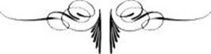

# [[{.calibre10} SUR LA LISI]{.calibre2}ÈRE D'UN BOIS]{.calibre_55} {#filepos29539755 .calibre_}

:::::: calibre_20
::::: calibre_3
::: calibre_16

------------------------------------------------------------------------

::: calibre_16

:::::
::::::

[(1873)]{.calibre_3}

[Victor Hugo]{.calibre_10}

[[THÉÂTRE EN LIBERTÉ
]{.bold}]{.calibre_21}

:::::: calibre_22
::::: calibre_21
[ ]{.bold}

::: calibre_16

------------------------------------------------------------------------

::: calibre_16

:::::
::::::

[
Pour toutes demandes ou suggestions]{.calibre_3}

[!{.calibre3}
]{.calibre4}

[[[[[^\[121\]^]{.calibre_21}]{.underline}]{.calibre_4}](index_split_4205.html#filepos29617874){#filepos29541591}]{.calibre4}

## [[[]{.calibre2}[]{.calibre2}[]{.calibre2}[]{.calibre2}[]{.calibre2}[]{.calibre2}[]{.calibre2}[]{.calibre2}[]{.calibre2}[]{.calibre2}[]{.calibre2}[]{.calibre2}[]{.calibre2}[]{.calibre2}[]{.calibre2}[]{.calibre2}[]{.calibre2}[]{.calibre2}[]{.calibre2}[]{.calibre2}[]{.calibre2}[]{.calibre2}[]{.calibre2}[Table des matières]{.calibre2}]{.bold1}]{.calibre_24} {#calibre_pb_5145 .calibre_57}

::: calibre_52

[]{.calibre_10}

[[[[[Personnages]{.calibre9}]{.underline}]{.calibre_4}](index_split_4199.html#filepos29542739)]{.calibre_10}

> [[[[[Scène]{.calibre9}]{.underline}]{.calibre_4}](index_split_4200.html#filepos29543294)]{.calibre_10}

## [[[]{.calibre2}[]{.calibre2}[]{.calibre2}[]{.calibre2}[]{.calibre2}[]{.calibre2}[]{.calibre2}[]{.calibre2}[]{.calibre2}[]{.calibre2}[]{.calibre2}[]{.calibre2}[]{.calibre2}[]{.calibre2}[]{.calibre2}[]{.calibre2}[]{.calibre2}[]{.calibre2}[]{.calibre2}[]{.calibre2}[]{.calibre2}[]{.calibre2}[Personnages]{.calibre2}]{.bold1}]{.calibre_24} {#calibre_pb_5147 .calibre_57}

::: calibre_52

[
LEO.
LÉA.
UN SATYRE.]{.calibre_10}

## [[[]{.calibre2}[]{.calibre2}[]{.calibre2}[]{.calibre2}[]{.calibre2}[]{.calibre2}[]{.calibre2}[]{.calibre2}[]{.calibre2}[]{.calibre2}[]{.calibre2}[]{.calibre2}[]{.calibre2}[]{.calibre2}[]{.calibre2}[]{.calibre2}[]{.calibre2}[]{.calibre2}[]{.calibre2}[]{.calibre2}[]{.calibre2}[]{.calibre2}[]{.calibre2}[]{.calibre2}[]{.calibre2}[]{.calibre2}[]{.calibre2}[]{.calibre2}[]{.calibre2}[]{.calibre2}[]{.calibre2}[]{.calibre2}[]{.calibre2}[]{.calibre2}[]{.calibre2}[]{.calibre2}Scène]{.bold1}]{.calibre_24} {#calibre_pb_5149 .calibre_57}

::: calibre_52

[[
LEO, LÉA, UN SATYRE.]{.italic}]{.calibre_28}

[
[LÉO]{.bold}.
Ô charme tout-puissant de la pudeur farouche !
Ma bouche ne doit pas même effleurer ta bouche ;
Ta robe est le rideau du temple, et je ne veux
D\'aucun souffle approchant trop près de tes cheveux ;
Tiens ton voile baissé, Léa Je te respecte.
Ne crains rien de moi.
[UN SATYRE]{.bold}, [dans le bois.]{.italic}
Phrase absolument suspecte.
[LÉO]{.bold}.
Cache ta beauté, viens, et, si je m\'échappais
Jusqu\'à regarder, fais le voile plus épais.
Tout ce que ton fichu couvre, je le devine ;
Mais va, je n\'oserais toucher ta chair divine,
Comme on n\'ose toucher l\'aile d\'un papillon.
Tu laisses dans mon âme un lumineux sillon ;
Tu sembles une rose ouverte dans des flammes ;
Envolons-nous ; mêlons les ailes de nos âmes ;
Soyons un couple honnête et céleste, et si pur
Qu\'on ne nous puisse plus distinguer de l\'azur.
Restons dans l\'idéal. Je t\'adore.
[LÉA]{.bold}.
Je t\'aime.
[LÉO]{.bold}.
Non. Pas même un baiser. Rêvons.
[LE SATYRE]{.bold}.
C\'est un système.
Mais cela ne va pas très loin.
[LÉO]{.bold}.
Soyons heureux,
Restons chastes ; c\'est là l\'amour profond\...
[LE SATYRE]{.bold}.
Et creux.
[LÉO]{.bold}.
Aimer, c\'est oublier la terre ; c\'est refaire
L\'éden rose au-dessus de cette sombre sphère.
Oh ! l\'amour est un ange.
[LE SATYRE]{.bold}.
Et c\'est un chenapan.
[LÉO]{.bold}.
Commençons par prier.
Levant les yeux au ciel.
Dieu ! toi qu\'on nomme\...
[LE SATYRE]{.bold}.
Pan.
[LÉA]{.bold}.
On frappe.
[LÉO]{.bold}.
C\'est l\'écho.
[LEA]{.bold}, [levant les yeux au ciel.]{.italic}
Dieu des hauteurs sacrées,
Toi qui rayonnes, toi qui bénis\...
[LE SATYRE]{.bold}.
Toi qui crées.
[LÉA]{.bold}.
Sois avec nous.
[LE SATYRE]{.bold}.
Il est toujours dans quelque coin.
Soyez tranquilles.
[LÉO]{.bold}.
Dieu ! Je te prends à témoin.
Je la respecte.
[LE SATYRE]{.bold}.
Encore ! Ah ! La pauvre petite !
[LÉO]{.bold}, [les yeux au ciel]{.italic}
Amour et pureté !
[LE SATYRE]{.bold}.
Bérénice avec Tite.
[LÉO]{.bold}.
Dieu fit ton âme ainsi que l\'abeille son miel ;
Avec toutes les fleurs. Oh ! La mer et le ciel
S\'unissent pour former Cythérée Aphrodite ;
Tout l\'univers pensif et doux la prémédite ;
Et pour faire un chef-d\'oeuvre aussi complet que toi.
Il faut à Dieu, dans l\'ombre où tremble notre foi,
L\'éternité.
[LE SATYRE]{.bold}.
Le temps de fumer un cigare.
[LÉO]{.bold}.
Restons purs. Fleurs, oiseaux, soyez nos guides.
[LE SATYRE]{.bold}.
Gare !
[LÉA]{.bold}.
Je t\'aime.
[LÉO]{.bold}.
Les oiseaux ont des chants infinis,
Des langueurs, des soupirs, de longs essors\...
[LE SATYRE]{.bold}.
Des nids.
[LÉO]{.bold}.
Sois comme l\'hirondelle.
[LE SATYRE]{.bold}.
Une bohémienne.
[LÉO]{.bold}.
Tu serais dans la chambre a côte de la mienne,
La nuit, seule en ton lit, eh bien, il suffirait
Pour m\'empêcher d\'entrer dans ton réduit discret
Que j\'eusse, ô ma Léa, présente à la pensée
Ta candeur d\'un regard trop amoureux froissée,
Ta grâce, ta beauté fraîche comme le jour\...
[LE SATYRE]{.bold}.[
]{.bold} Et que la porte fût fermée à double tour.
[LÉO]{.bold}.
La femme contient Dieu. Tout nous vient de toi, femme !
Nous t\'empruntons l'amour, nous t\'empruntons la flamme,
Nous le prenons le vrai, le juste\...
[LE SATYRE]{.bold}.
Et le menton.
[LÉO]{.bold}.
Ton nom est Rhée, Aglaure, Hebé, Pallas\...
[LE SATYRE]{.bold}.
Goton.
[LÉO]{.bold}.
Comme en avril la rose éclot dans les ravines,
Toutes les vérités célestes et divines
Fleurissent dans nos coeurs sitôt que nous aimons.
Le haut des coeurs est blanc comme le haut des monts ;
L\'amour est ici-bas la grande cime humaine.
Chaque pas fait vers Dieu vers la femme nous mène.
Rien de mauvais peut-il nous venir d\'elle ? Non
La femme, sous la forme auguste de Junon,
Dans cette vérité qu\'on appelle la fable,
Verse au zénith un flot de lueur ineffable ;
Le ciel est étoile par ses seins immortels.
Oh ! Dans le voisinage innocent des autels.
Le feu charnel s\'épure, et l\'on devient deux anges.
Sous les cloîtres croulants, pleins de clartés étranges
L\'ombre aime avoir un couple errer, tendre et charmant
Les amours ont toujours hanté pieusement
Les colonnes du temple.
[LE SATYRE]{.bold}.
Et les piliers des halles.
[LÉA]{.bold}.
Amour !
[LÉO]{.bold}.
Sublimité des choses idéales !
[LÉA]{.bold}.
Oh ! Que de profondeurs splendides nous voyons !
[LÉO]{.bold}.
La vie autour de nous se disperse en rayons.
[LÉA]{.bold}.
Quand une aube s\'achève, une aube recommence.
[LÉO]{.bold}.
Tout au-dessus de l\'homme est bleu. Le ciel immense
N\'est que flamme et lumière.
[LE SATYRE]{.bold}.
Excepté quand il pleut.
[LÉO]{.bold}.
Vivons ! Du pur amour serrons le chaste noeud.
Oh ! Quel travail charmant ! Garder ton innocence !
L\'adorer ! N\'être plus qu\'un esprit, qui t\'encense !
Sonder tes yeux profonds ! Épier tes désirs !
T'inventer une suite aimable de plaisirs !
Baiser tes pieds, subir tous tes caprices, être
Ton esclave fidèle et doux, ton chien, ton prêtre !
Vouloir ce que tu veux ! Se creuser le cerveau
Pour l\'offrir à chaque heure un délire nouveau !
T\'ouvrir des paradis inconnus ! Faire éclore
Sur ton front le sourire et dans ton coeur l\'aurore !
Ne jamais oublier un instant le devoir
De chercher ce qui peut te charmer, t\'émouvoir.
Te plaire ! et tous les jours recommencer !
[LE SATYRE]{.bold}.
Va, pioche.
[LEO]{.bold}.
Viens !
[LÉA]{.bold}.
Où ?
[LÉO]{.bold}.
Dans ce bois.
[LÉA]{.bold}.
Mais\...
[LE SATYRE]{.bold}.

[[[\[watermark:9782368410165\]]{.calibre_31}]{.italic}]{.calibre4}

[[H. H, 16 juin 1873.]{.italic}]{.calibre_26}

::: calibre_27

[]{.calibre_10}

[[
]{.bold}]{.calibre_12}

[[
]{.bold}]{.calibre_12}

[[{.calibre3}]{.bold}]{.calibre_12}
