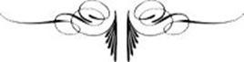

# [[{.calibre10} TORQUEMADA]{.calibre2}]{.calibre_55} {#filepos28898254 .calibre_}

:::::: calibre_20
::::: calibre_3
::: calibre_16

------------------------------------------------------------------------

::: calibre_16

:::::
::::::

[(1882)]{.calibre_3}

[Victor Hugo]{.calibre_10}

[[THÉÂTRE
]{.bold}]{.calibre_21}

:::::: calibre_22
::::: calibre_21
[ ]{.bold}

::: calibre_16

------------------------------------------------------------------------

::: calibre_16

:::::
::::::

[
Pour toutes demandes ou suggestions]{.calibre_3}

[
!{.calibre3}]{.calibre_10}

[Torquemada[[[[^\[118\]^]{.calibre_21}]{.underline}]{.calibre_4}](index_split_4205.html#filepos29616509){#filepos28900100}]{.calibre_10}

## [[[]{.calibre2}[]{.calibre2}[]{.calibre2}[]{.calibre2}[]{.calibre2}[]{.calibre2}[]{.calibre2}[]{.calibre2}[]{.calibre2}[]{.calibre2}[]{.calibre2}[]{.calibre2}[]{.calibre2}[]{.calibre2}[]{.calibre2}[]{.calibre2}[]{.calibre2}[]{.calibre2}[]{.calibre2}[]{.calibre2}[]{.calibre2}[]{.calibre2}[]{.calibre2}[Table des matières]{.calibre2}]{.bold1}]{.calibre_24} {#calibre_pb_5000 .calibre_57}

::: calibre_52

[]{.calibre_10}

> [[[[[Première Partie -- Du moine au pape]{.calibre9}]{.underline}]{.calibre_4}](index_split_4098.html#filepos28908542)]{.calibre_10}

> [[[[[Acte I]{.calibre16}]{.underline}]{.calibre_4}](index_split_4099.html#filepos28909421)]{.calibre_10}

> [[[[[L'in pace -- Prologue]{.calibre9}]{.underline}]{.calibre_4}](index_split_4100.html#filepos28910400)]{.calibre_10}

> [[[[[Scène I.]{.calibre9}]{.underline}]{.calibre_4}](index_split_4101.html#filepos28912843)]{.calibre_10}

> [[[[[Scène II.]{.calibre9}]{.underline}]{.calibre_4}](index_split_4102.html#filepos28917192)]{.calibre_10}

> [[[[[Scène III]{.calibre9}]{.underline}]{.calibre_4}](index_split_4103.html#filepos28948104)]{.calibre_10}

> [[[[[Scène IV]{.calibre9}]{.underline}]{.calibre_4}](index_split_4104.html#filepos28954486)]{.calibre_10}

> [[[[[Scène V.]{.calibre9}]{.underline}]{.calibre_4}](index_split_4105.html#filepos28957565)]{.calibre_10}

> [[[[[Scène VI.]{.calibre9}]{.underline}]{.calibre_4}](index_split_4106.html#filepos28965041)]{.calibre_10}

> [[[[[Scène VII]{.calibre9}]{.underline}]{.calibre_4}](index_split_4107.html#filepos28975181)]{.calibre_10}

> [[[[[Scène VIII]{.calibre9}]{.underline}]{.calibre_4}](index_split_4108.html#filepos28987001)]{.calibre_10}

> [[[[[Deuxième Partie -- Torquemada]{.calibre9}]{.underline}]{.calibre_4}](index_split_4109.html#filepos28993987)]{.calibre_10}

> [[[[[Acte I]{.calibre16}]{.underline}]{.calibre_4}](index_split_4110.html#filepos28995707)]{.calibre_10}

> [[[[[Scène I.]{.calibre9}]{.underline}]{.calibre_4}](index_split_4111.html#filepos28997668)]{.calibre_10}

> [[[[[Scène II.]{.calibre9}]{.underline}]{.calibre_4}](index_split_4112.html#filepos29003686)]{.calibre_10}

> [[[[[Scène III.]{.calibre9}]{.underline}]{.calibre_4}](index_split_4113.html#filepos29006213)]{.calibre_10}

> [[[[[Scène IV.]{.calibre9}]{.underline}]{.calibre_4}](index_split_4114.html#filepos29013050)]{.calibre_10}

> [[[[[Scène V.]{.calibre9}]{.underline}]{.calibre_4}](index_split_4115.html#filepos29025106)]{.calibre_10}

> [[[[[Acte II]{.calibre16}]{.underline}]{.calibre_4}](index_split_4116.html#filepos29028240)]{.calibre_10}

> [[[[[Scène I]{.calibre9}]{.underline}]{.calibre_4}](index_split_4117.html#filepos29030137)]{.calibre_10}

> [[[[[Scène II.]{.calibre9}]{.underline}]{.calibre_4}](index_split_4118.html#filepos29032798)]{.calibre_10}

> [[[[[Scène III.]{.calibre9}]{.underline}]{.calibre_4}](index_split_4119.html#filepos29047379)]{.calibre_10}

> [[[[[Acte III]{.calibre16}]{.underline}]{.calibre_4}](index_split_4120.html#filepos29051744)]{.calibre_10}

> [[[[[Scène I.]{.calibre9}]{.underline}]{.calibre_4}](index_split_4121.html#filepos29054151)]{.calibre_10}

> [[[[[Scène II.]{.calibre9}]{.underline}]{.calibre_4}](index_split_4122.html#filepos29058921)]{.calibre_10}

> [[[[[Scène III]{.calibre9}]{.underline}]{.calibre_4}](index_split_4123.html#filepos29084600)]{.calibre_10}

> [[[[[Scène IV]{.calibre9}]{.underline}]{.calibre_4}](index_split_4124.html#filepos29091174)]{.calibre_10}

> [[[[[Scène V.]{.calibre9}]{.underline}]{.calibre_4}](index_split_4125.html#filepos29095954)]{.calibre_10}

> [[[[[Acte quatrième]{.calibre16}]{.underline}]{.calibre_4}](index_split_4126.html#filepos29107262)]{.calibre_10}

> [[[[[Scène I.]{.calibre9}]{.underline}]{.calibre_4}](index_split_4127.html#filepos29109174)]{.calibre_10}

> [[[[[Scène II.]{.calibre9}]{.underline}]{.calibre_4}](index_split_4128.html#filepos29112843)]{.calibre_10}

> [[[[[Scène III]{.calibre9}]{.underline}]{.calibre_4}](index_split_4129.html#filepos29116337)]{.calibre_10}

> [[[[[Scène IV.]{.calibre9}]{.underline}]{.calibre_4}](index_split_4130.html#filepos29118401)]{.calibre_10}

> [[[[[Scène V.]{.calibre9}]{.underline}]{.calibre_4}](index_split_4131.html#filepos29127137)]{.calibre_10}

## [[[[ ]{.calibre34}]{.calibre2} []{.calibre2}[]{.calibre2}[]{.calibre2}[]{.calibre2}[]{.calibre2}[]{.calibre2}[]{.calibre2}[]{.calibre2}[]{.calibre2}[]{.calibre2}[]{.calibre2}[]{.calibre2}[]{.calibre2}[]{.calibre2}[]{.calibre2}[]{.calibre2}[]{.calibre2}[]{.calibre2}[]{.calibre2}[]{.calibre2}[]{.calibre2}[]{.calibre2}[]{.calibre2}[]{.calibre2}[]{.calibre2}[]{.calibre2}[]{.calibre2}[]{.calibre2}[]{.calibre2}[]{.calibre2}[]{.calibre2}[]{.calibre2}[]{.calibre2}[]{.calibre2}[]{.calibre2}[]{.calibre2}[]{.calibre2}[]{.calibre2}[]{.calibre2}[]{.calibre2}[]{.calibre2}[]{.calibre2}[]{.calibre2}[]{.calibre2}[]{.calibre2}[]{.calibre2}[]{.calibre2}[]{.calibre2}[]{.calibre2}[]{.calibre2}[]{.calibre2}[]{.calibre2}[]{.calibre2}[]{.calibre2}[]{.calibre2}[]{.calibre2}[]{.calibre2}[]{.calibre2}[]{.calibre2}[]{.calibre2}[]{.calibre2}[]{.calibre2}[]{.calibre2}[]{.calibre2}[]{.calibre2}[]{.calibre2}Première Partie -- Du moine au pape]{.bold1}]{.calibre_24} {#filepos28908542 .calibre_57}

::: calibre_52

[!{.calibre3}]{.calibre_10}

[[
]{.calibre_7}]{.bold}

### [[[]{.calibre2}[]{.calibre2}[]{.calibre2}[]{.calibre2}[]{.calibre2}[]{.calibre2}[]{.calibre2}[]{.calibre2}[]{.calibre2}[]{.calibre2}[]{.calibre2}[]{.calibre2}[]{.calibre2}[]{.calibre2}[]{.calibre2}[]{.calibre2}[]{.calibre2}[]{.calibre2}[]{.calibre2}[]{.calibre2}[]{.calibre2}[]{.calibre2}[]{.calibre2}[]{.calibre2}]{.bold1}]{.calibre_39} {#section .calibre_38}

### [[[]{.calibre2}[]{.calibre2}[]{.calibre2}[]{.calibre2}[]{.calibre2}[]{.calibre2}[]{.calibre2}[]{.calibre2}[]{.calibre2}[]{.calibre2}[]{.calibre2}[]{.calibre2}[]{.calibre2}[]{.calibre2}[]{.calibre2}[]{.calibre2}[]{.calibre2}[]{.calibre2}[]{.calibre2}[]{.calibre2}[]{.calibre2}[]{.calibre2}[]{.calibre2}[]{.calibre2}[]{.calibre2}[]{.calibre2}[]{.calibre2}[]{.calibre2}[]{.calibre2}[]{.calibre2}[]{.calibre2}[]{.calibre2}[]{.calibre2}[]{.calibre2}[]{.calibre2}[]{.calibre2}[]{.calibre2}[]{.calibre2}[]{.calibre2}[]{.calibre2}[]{.calibre2}[]{.calibre2}[]{.calibre2}[]{.calibre2}[]{.calibre2}[]{.calibre2}[]{.calibre2}[]{.calibre2}[]{.calibre2}[]{.calibre2}[]{.calibre2}[]{.calibre2}[]{.calibre2}[]{.calibre2}[]{.calibre2}[]{.calibre2}[]{.calibre2}Acte I]{.bold1}]{.calibre_39} {#acte-i .calibre_38}

[
]{.calibre4}

[ ]{.calibre4}

### [[L'in pace -- Prologue]{.bold}]{.calibre_18} {#lin-pace-prologue .calibre_48}

[ ]{.calibre4}

[[LE MOINE, LE ROI DON SANCHE DE SALINAS, DONA ROSE D'ORTHEZ, LE MARQUIS DE FUENTEL, GUCHO, LE PRIEUR, L'ÉVÊQUE DE LA SEU D'URGEL, MOINES, SOLDATS]{.italic}]{.calibre_10}

[
[En catalogne. Les montagnes frontières. Le monastère Laterran, couvent de l'ordre des augustins et de l\'observance de Saint-Ruf. L\'ancien cimetière du couvent. Aspect de jardin sauvage. C\'est le mois d\'avril du midi. Fleurs et soleil. Croix et tombeaux dans le gazon et sous les arbres. Sol bossué de fosses. Au fond, la muraille d\'enceinte du monastère, très élevée, mais tombant en ruine. Une grande brèche la fond en deux jusqu\'à terre, et donne sur la campagne. Près d\'un pan de mur qui revient en équerre, une croix de fer plantée sur une fosse. Une autre croix très haute, avec le triangle mystique doré, est au sommet d\'un perron de pierre et domine le cimetière. Sur le devant, au ras du sol, une ouverture carrée, encadrée de pierres plates de niveau avec l\'herbe. A côté, on voit une longue dalle qui semble destinée à boucher au besoin l\'ouverture. Dans l\'ouverture on distingue les premières marches d\'un étroit escalier de pierre qui descend et s\'enfonce dans un caveau. C\'est un sépulcre dont le couvercle a été enlevé et dont on aperçoit l\'intérieur. La dalle qui est auprès est le couvercle. Au lever du rideau, le prieur du couvent, en habit d\'augustin, est en scène. Au fond du théâtre passe en silence un moine, vieux, vêtu d\'une robe de dominicain. Le moine marche lentement, salue en fléchissant le genou toutes les croix qu\'il rencontre, et disparait. Le prieur reste seul.]{.italic}]{.calibre4}

[
]{.calibre_18}

### [[Scène I.]{.bold}]{.calibre_18} {#scène-i. .calibre_48}

[[
LE PRIEUR DU COUVENT, puis UN HOMME.]{.italic}]{.calibre_10}

[
[Le prieur, chauve avec une couronne de cheveux gris, barbe blanche, robe de bure. Il examine le mur d\'enceinte et rôde pensif parmi les tombeaux.]{.italic}]{.calibre4}

[
[LE PRIEUR]{.bold}.
Couvent mal gardé. Ronce et broussaille. Dégât
Que fait dans les lieux saints le temps, vieux renégat.[
Il considère la crevasse du mur.]{.italic}
Brèche par ou pourrait s\'échapper un novice.
On dirait que ce mur refuse le service
Et que, d\'être debout trop longtemps, il est las.
Il ressemble à nos droits qui s\'écroulent, hélas !
Ils ont aussi leur rouille, ils ont aussi leur brèche.
Le vert rameau divin dans nos mains se dessèche.
Les papes à lutter deviennent paresseux.
Ah ! chez nous aujourd\'hui les princes sont chez eux ;
Noirs, ils passent sur nous comme l\'ombre des aigles.
Plus d\'observance, plus de chartes, plus de règles.
Nous nous courbons toujours plus bas, de peur des coups ;
Nous ne sommes pas sûrs de n\'avoir pas chez nous
Des intrigues de cour et dés scélératesses.
Ils nous font élever de petites altesses,
Obscures, pêle-mêle, et filles et garçons ;
Qui sait ? bâtards peut-être, et nous obéissons.[
Il s\'arrête devant l\'ouverture du caveau.]{.italic}
S\'il s\'accomplit chez nous quelque acte de justice,
C\'est contre l\'un de nous.[
Il se met à regarder la muraille.]{.italic}[
]{.bold} Notre vieille bâtisse[
]{.bold} Comme nous penche, et Christ saigne, et nous nous sentons
De plus en plus, dans l\'ombre et la honte, à tâtons.
[
Entre par la brèche un homme enveloppé d\'un manteau, et le chapeau rabattu sur les yeux. Cet homme s\'arrête debout sur le monceau de ruines de la brèche. Le prieur l\'aperçoit.
]{.italic} Homme, va-t\'en de là.
[
L'HOMME]{.bold}.
Non.
[LE PRIEUR]{.bold}
Va-t\'en. Sache, rustre,[
]{.bold} Que c\'est un cimetière.
[L'HOMME]{.bold}.[
]{.bold} Eh bien ?[
LE PRIEUR]{.bold}.
Un cloître illustre.[
L'HOMME]{.bold}.[
]{.bold} Bah !
[LE PRIEUR]{.bold}.[
]{.bold} Nul n\'y vient, hormis, le jour, les moines seuls ;
Et les ombres des morts, la nuit, dans leurs linceuls.
Pour quiconque entre ici, pas de miséricorde.
La hache s\'il est duc, s\'il est manant la corde.
Ceux qui sont du couvent entrent seuls. Gare à toi
Déguerpis, drôle \![
Riant avec hauteur.[
]{.bold}]{.italic} A moins que tu ne sois le roi.
[
L'HOMME]{.bold}.
Je le suis.
[LE PRIEUR]{.bold}.
Vous, le roi !
[L'HOMME]{.bold}.
C\'est ainsi qu\'on me nomme.[
LE PRIEUR]{.bold}.
Qui me le prouve à moi ?
[L'HOMME]{.bold}.
Ceci.[
]{.bold} [Il fait un signe. Une troupe armée parait à la brèche. Le roi montre aux soldats le prieur.[
]{.bold}]{.italic} Pendez cet homme.
[
]{.bold} [Les soldats pénètrent par la brèche. Ils entourent le prieur. Entrent avec eux le marquis de Fuentel et Gucho. Le marquis de Fuentel, barbe grise, riche habit d\'Alcantara. Gucho, nain vêtu de noir et coiffé d\'un chapeau de sonnettes. Il tient dans ses deux mains deux marottes, l\'une en or, à figure d\'homme, l\'autre en cuivre, à figure de femme.]{.italic}]{.calibre4}

[
]{.calibre_18}

### [[Scène II.]{.bold}]{.calibre_18} {#scène-ii. .calibre_48}

[[
LE PRIEUR, LE ROI, LE MARQUIS DE FUENTEL, GUCHO, ESCORTE DU ROI.]{.italic}]{.calibre_10}

[
[LE PRIEUR]{.bold}, [tombant à genoux.]{.italic}
Grâce, Monseigneur !
[LE ROI]{.bold}.
Soit. A la condition.
Qu\'es-tu dans ce couvent ?
[LE PRIEUR]{.bold}.
Prieur.
[LE ROI]{.bold}.
Attention.
Tu vas me renseigner sur tout ce qui s\'y passe.
Le gibet, si tu mens ; si tu dis vrai, ta grâce.[
Il laisse le prieur au milieu du groupe des soldats et s\'approche du marquis de Fuentel sur le devant du théâtre.]{.italic}
Pour commencer, faisons nos prières, marquis.[
Il jette son manteau à un valet derrière lui, et apparaît en petit habit d\'Alcantara,
avec un gros rosaire au côté. Il récite en silence le rosaire pendant quelques instants. Puis il se retourne vers le marquis.]{.italic}
La reine est loin. J\'existe. Être seul, c\'est exquis.
Être veuf serait mieux. Je ris.
[GUCHO]{.bold}, [à terre, ses deux marottes dans les bras et pelotonné dans l\'encoignure d\'une tombe.]{.italic}
[A part.]{.italic}
L\'univers pleure.
[LE ROI]{.bold}, [au marquis.]{.italic}
J\'ai mes raisons, tu vas les savoir tout à l\'heure,
Pour venir regarder de très près ce couvent.
Viens.
[
Il lui fait signe de le suivre un peu à l\'écart, tout près de la tombe où s\'est rencogné Gucho.]{.italic}
[LE MARQUIS]{.bold}.
J\'écoute le roi.
[GUCHO]{.bold}, [à part.]{.italic}
Moi, j\'écoute le vent
Qui murmure au-dessus des choses que vous faites.
[LE ROI]{.bold}, [au marquis.]{.italic}
Je veux te consulter pour affaires secrètes.
[GUCHO]{.bold}, [à part.]{.italic}
Bah ! pourvu que je mange et dorme, tout est bien.
[LE MARQUIS]{.bold}, [au roi.]{.italic}
Faut-il chasser Gucho ?
[LE ROI]{.bold}.
Non. Il ne comprend rien.[
A Gucho.]{.italic}
Couchez là.[
Gucho se fait le plus petit qu\'il peut dans l\'ombre derrière le roi. Le roi s\'approche du marquis.]{.italic}
Marquis, j\'aime affreusement les femmes.
Ceci me plaît de toi que tes moeurs sont infâmes,
Ou le furent. Plus tard, vieux, tu t\'es fait dévot.
C\'est bien. Ceci me plaît encore. L\'homme ne vaut
Que par la foi, qui seule efface nos souillures.[
Il fait un signe de croix.]{.italic}
[LE MARQUIS]{.bold}.
Ce couvent, dont le roi vient scruter les allures,
Dépend de deux chefs, l\'un à Cahors, l\'autre à Gand.
[LE ROI]{.bold}.
Tu passes pour avoir été fort intrigant.
Tu l\'es toujours. On dit que des femmes, jolies,
Ont fait jadis pour toi, bonhomme, des folies.
Que tu puisses avoir été page et charmant,
Cela semble impossible ; et pourquoi pas, vraiment ?
Le matin est riant, puis la journée est noire ;
Cela se voit. Sais-tu qu\'on raconte une histoire
Sur un petit valet de cour qui serait toi ?
T\'es-tu jamais nommé Gorvona ?
[LE MARQUIS]{.bold}.
Non. Pourquoi ?
[LE ROI]{.bold}.
Pour te cacher, dit-on, par ruse et par bassesse,
Et pour une amourette avec une princesse.
[LE MARQUIS]{.bold}.
Moi, jamais !
[LE ROI]{.bold}
On m\'a fait le récit tout entier
D\'un roi stupide auquel tu fis un héritier.
Mais on n\'est pas d\'accord sur le pays. Pur conte,
Probablement.
[LE MARQUIS]{.bold}.
Voilà. Vous m\'avez créé comte.
On tâche de me nuire.
[LE ROI]{.bold}.
On a raison. Mais moi,
Que ce qu\'on dit soit faux ou soit vrai, j\'ai pour loi
D\'être au-dessus de tout ce que l\'homme imagine.
Rien ne m\'atteint. Je suis le roi. Ton origine
Mêlée à des laquais, et même à des bouffons,
Tes commencements bas, tortueux et profonds,
Me conviennent. Personne au juste ne peut dire,
Pas même toi, quel fut ton père. Je t\'admire
D\'être si bien caché, tout en étant public.
Le nid du cormoran, le trou du basilic,
Sont les points de départ possibles d\'une vie
Comme la tienne, errante, envolée, asservie.
Je t\'ai fait comte, grand de Castille, et marquis ;
Vil tas de dignités, bien gagné, mal acquis.
Agir par ruse, ou bien par force, t\'est facile ;
Tu te prendrais de bec avec tout un concile
Ou tu le chasserais, le démon en fût-il.
Tu sais être hardi tout en restant subtil.
Quoique fait pour ramper, tu braves la tempête.
Tu saurais, s\'il le faut, pour quelque coup de tête
Te risquer, et, toi vieux, mettre l\'épée au poing.
Tu conseilles le mal, mais tu ne le fais point.
N\'être innocent de rien, n\'être de rien coupable,
C\'est ta propreté, comte, et je te crois capable
De tout, même d\'aimer quelqu\'un. A ce qu\'on dit,
Tu t\'es fait de valet brigand, et de bandit
Courtisan. Moi, j\'observe en riant tes manoeuvres.
J\'ai du plaisir à voir serpenter les couleuvres.
Tes projets que, pensif, tu dévides sans bruit,
Sorte de fil flottant qui se perd dans la nuit,
Tes talents, ton esprit, ta fortune, ta fange,
Tout cela fait de toi quelque chose d\'étrange,
De sinistre et d\'ingrat dont j\'aime à me servir.
[LE MARQUIS]{.bold}.
Roi, vous avez le Tage et le Guadalquivir,
Et l\'Èbre, et votre altesse à la Castille ajoute
Naples, et le roi de France est vaincu dans la joute ;
L\'Afrique craint mon roi dont, bien souvent déjà,
L\'ombre au soleil levant sur Alger s\'allongea ;
Vous naquîtes à Sos, si près de la Navarre
Que vous avez des droits sur elle, et je déclare
Que votre berceau prit ce pays en dormant,
Vu que jamais un roi ne naît impunément ;
Vous avez mis le pied, quoique roi catholique,
Sur l\'église où fermente un fond de république ;
Le pape, grâce à vous, tremble devant le roi,
Et son clocher se tait devant votre beffroi.
Vos drapeaux, de l\'Etna jusqu\'à la rive indoue,
Flottent, et vous avez Gonzalve de Cordoue.
Du reste, vous gagnez des batailles tout seul.
Jeune, vous dominiez les rois comme un aïeul,
Et quand un prêtre va ramer dans vos galères,
Rome en balbutiant rétracte ses colères.
Ô vainqueur de Toro, roi ! devant vous je sens
Tous les mots dans ma bouche expirer impuissants
Vous êtes la grandeur, je suis la petitesse.
Je vous suis dévoué, seigneur.
[LE ROI]{.bold}.
C\'est faux.
[LE MARQUIS]{.bold}.
Altesse.
[LE ROI]{.bold}.
Épargne-moi l\'ennui du dévouement, mon cher.
Pour toi je suis obscur, pour moi tu n\'es pas clair.
Moi je fais le bon prince et toi le bon apôtre.
Au fond nous sommes pleins de fiel l\'un contre l\'autre ;
J\'exècre le valet, tu détestes le roi ;
Tu m\'assassinerais si tu pouvais, et moi
Je te ferai peut-être un jour couper la tête.
Nous sommes bons amis à cela près.[
Le marquis.]{.italic} [ouvre la bouche pour protester.]{.italic}
Arrête
Ta dépense de mots, courtisan. Tu me hais,
Je te hais. En moi l\'ombre, en toi de noirs souhaits.
Et chacun garde en soi son gouffre.[
Nouveau geste du marquis réprimé par le roi, qui continue.]{.italic}
On se pénètre.
Nous avons l\'un sur l\'autre une obscure fenêtre,
Et nous voyons nos coeurs sinistres. Ton amour,
Ton dévouement, j\'en ris, vieux traître. Jusqu\'au jour
Ou tu ne pourras plus tirer d\'or de ma poche,
Tant que ton intérêt, lien sur, nous rapproche,
Marquis, je t\'emploierai pour conseiller, sachant
Que tu me serviras mieux, étant plus méchant.
A bas ton masque ! à bas le mien ! je le préfère.
Dire vrai, cet affront qu\'on n\'ose pas me faire,
Moi, je le fais à tous, marquis. C\'est bien le moins
Que je sois franc, ayant des fourbes pour témoins.
Si le prince, que fuit la vérité farouche,
Ne l\'a pas dans l\'oreille, il l\'aura dans la bouche,
Et tu constateras dans tes vils bégaiements
Que, roi, je suis sincère et que, laquais, tu mens.
Causons à présent.
[LE MARQUIS]{.bold}.
Mais...
[LE ROI]{.bold}.
Etre roi, quelle chaîne !
Être un jeune homme, plein d\'explosions, de haine,
De tumulte, vivant, bouillant, ardent, moqueur,
Avec un tourbillon de passions au coeur,
Être un mélange obscur de sang, de feu, de poudre,
De caprices, pareil au faisceau de la foudre,
Vouloir tout essayer, tout souiller, tout saisir,
Avoir soif d\'une femme, avoir faim d\'un plaisir,
Ne pas voir une vierge, une proie, un désordre,
Un coeur, sans tressaillir du noir besoin de mordre,
Se sentir de la tête aux pieds l\'homme de chair,
Et sans cesse, en la nuit d\'un magnifique enfer,
Pâle, entendre une voix qui dit : Sois un fantôme !
N\'être pas même un roi ! misère ! être un royaume !
Sentir un amalgame horrible de cités
Et d\'états remplacer en vous vos volontés,
Vos désirs, vos instincts ; et des tours, des murailles,
Des provinces, croiser leurs noeuds dans vos entrailles
Se dire en regardant la carte me voilà
J\'ai pour talon Girone et pour tête Alcala.
Voir croître en son esprit, chaque jour moindre et pire,
Un appétit qui prend la forme d\'un empire,
Sentir couler sur soi des fleuves, voir des mers
Vous isoler dans l\'ombre avec leurs plis amers,
Subir l\'étouffement qu\'a sous l\'onde une flamme,
Et, morne, avoir le monde infiltré dans son âme !
Et ma femme, ce monstre immobile ! je suis
L\'esclave de ses jours, le forçat de ses nuits.
Seuls dans une lueur sombre, tant elle est haute,
Nous sommes tout-puissants et tristes, côte à côte.
Nous nous refroidissons en nous touchant. Dieu met
Sur on ne sait quel fauve et tragique sommet,
Au-dessus d\'Aragon, de Jaën, des Algarves,
De Burgos, de Léon, des Castilles, deux larves,
Deux masques, deux néants formidables, le roi,
La reine ; elle est la crainte et moi je suis l\'effroi.
Ah ! certes, il serait doux d\'être roi, qui le nie ?
Si le tyran n\'avait sur lui la tyrannie
Mais toujours s\'observer, feindre, être deux pâleurs,
Deux silences ; jamais de rire, pas de pleurs ;
Urraca vit en elle, en moi revit Alonze.
L\'homme de marbre auprès de la femme de bronze !
Les peuples prosternés nous adorent ; tandis
Qu\'on nous bénit en bas, nous nous sentons maudits,
L\'encens monte en tremblant vers nous, et l\'ombre mêle
L\'idole Ferdinand à l\'idole Isabelle.
Nos deux trônes jumeaux confondent leur clarté,
Nous nous apercevons vaguement de côté,
Et, quand nous nous parlons, la tombe ouvre sa porte.
Je ne suis pas bien sûr qu\'elle ne soit pas morte.
Elle est cadavre autant que despote, et je dois
La glacer quand le sceptre entrecroisé nos doigts,
Comme si Dieu liait par une bandelette
A sa main de momie une main de squelette.
Je suis vivant pourtant ! Ce fantôme pompeux,
Non, ce n\'est pas moi, non ! non ! Aussi, quand je peux,
De toutes ces grandeurs sur nous appesanties
Je m\'échappe, et je fais hors du roi des sorties,
Et j\'ai, comme un dragon qui se dresse au soleil,
L\'épanouissement monstrueux du réveil !
Fou comme la tempête et comme le cyclone,
Je m\'évade éperdu, noir prisonnier du trône !
Plus de joug, je me rue ivre à travers le mal
Et le bonheur, ayant pour but d\'être animal,
Piétinant mon manteau royal, l\'âme élargie
Jusqu\'aux vices, jusqu\'aux chansons, jusqu\'à l\'orgie,
Regardant, moi le roi, le captif, le martyr,
Mes convoitises croître et mes ongles sortir ;
La femme et sa pudeur, l\'évêque avec sa crosse,
M\'exaspèrent ; je suis furieux, gai, féroce
Et l\'homme qui bouillonne en moi, flamme et limon,
Se venge d\'être spectre en devenant démon \![
Pensif.]{.italic}
Quitte à redevenir demain ombre et fantôme.[
Au marquis.]{.italic}
Le colosse n\'est point pénétrable à l\'atome,
Et tu ne comprends pas que je m\'étale ainsi
Effrontément devant ces hommes que voici
Mais je sais moi que tous, quand je me communique,
Sont d\'autant plus tremblants que je suis plus cynique,
Et c\'est ma joie à moi, qui ris au milieu d\'eux,
De les rendre plus vils en m\'avouant hideux,
Et, rompant tout respect, tout frein, tout équilibre,
Moi qui n\'étais que roi, je sens que je suis libre
Tu ne me comprends pas. Ta crainte s\'en accroît.
C\'est bien. En revoyant demain mon regard froid,
Tu trembleras, doutant et prenant pour un songe
L\'ivresse ou maintenant devant toi je me plonge,
Fournaise où sous tes yeux brûle et bout mon passé,
Mon rang, mon sceptre, et d\'où je sortirai glacé \![
Il reprend son chapelet.]{.italic}
Maintenant finissons nos prières.
[GUCHO]{.bold}, [à part, regardant le roi en dessous.]{.italic}
Va ! prie.
[LE ROI]{.bold}.
Puis j\'interrogerai ce moine.[
Il se met à dévider son chapelet.]{.italic}
[GUCHO]{.bold}, [le regardant faire, à part.]{.italic}
Momerie
C\'est par là que ce roi finira. Fourbe et dur,
Il ne croit à rien ; mais, quel chaos d\'âme obscur
Quand il dit un pater, il devient imbécile.
Alors il cède au pape, il vénère un concile.
Tout en heurtant le prêtre, il le craint ; il se sent
Poussière sous les pieds de ce hautain passant.[
Faisant le signe de croix.]{.italic}
Ainsi soit-il ! Il est libertin, fourbe, oblique,
Menteur, cruel, obscène, athée et catholique.
Et, tant pis, il aura plus tard ce sobriquet.
[[
]{.italic}]{.bold} [Le roi remet son rosaire à sa ceinture et fait signe au prieur d\'approcher.]{.italic}
[LE ROI]{.bold}, au prieur.
Ici.
[Le prieur avance, tes deux mains en croix sur la poitrine, et les yeux baissés.]{.italic}
Si par malheur la franchise manquait
A tes réponses, gare à toi \![
Le prieur salue]{.italic}.
Dis vrai. Prends garde.[
Le prieur salue.]{.italic}
[Depuis quelques instants le vieux moine vêtu d\'une robe de dominicain a reparu au fond du théâtre. Il marche, la tête baissée, inattentif à tout, occupé seulement à saluer toutes les croix des tombeaux devant lesquelles il passe. Il semble murmurer des prières. Ce passant est remarqué par le roi, qui le montre au prieur.]{.italic}
D\'abord, quel est ce moine à figure hagarde,
Pas vêtu comme toi, qui fléchit le genou
Chaque fois qu\'il rencontre une croix ?
[LE PRIEUR]{.bold}.
C\'est un fou.
[LE ROI]{.bold}.
Comme il est pâle !
[LE PRIEUR]{.bold}.
Il veille et jeûne. Il s\'exténue.
Il parle haut. Il marche au soleil tête nue.
Il divague, il délire. Il rêve d\'aller voir
Les papes, pour leur dire à genoux leur devoir.
Nous devons quand il passe observer le silence.
Il n\'est point de notre ordre. Il est en surveillance
Dans ce cloître. On enferme ainsi dans nos couvents
Tous les prêtres qui sont inquiets, les savants,
Les songeurs qui pourraient prêcher dans la campagne
Autrement que ne veut notre église d\'Espagne.
[LE ROI]{.bold}.
Quelle folie a-t-il ?
[LE PRIEUR]{.bold}.
Des visions de feu.
L\'enfer. Satan. Il n\'est ici que depuis peu.
[LE ROI]{.bold}.
Il est vieux.
[LE PRIEUR]{.bold}.
Il n\'a pas, je crois, longtemps à vivre.
[Le moine passe et disparaît sans avoir vu personne.]{.italic}
[GUCHO]{.bold}, [à part, regardant ses marottes.]{.italic}
J\'ai deux marottes. L\'une est en or, l\'autre en cuivre.
L\'une s\'appelle Mal, l\'autre s\'appelle Bien.
Et je les aime autant l\'une que l\'autre. Rien
Est mon but.[
Il considère le gazon des fosses.]{.italic}
Là des fleurs, là des feuilles séchées.[
LE ROI]{.bold}, [au prieur.]{.italic}[
]{.bold} Les moeurs dans vos couvents se sont fort relâchées,
Moine.
[LE PRIEUR]{.bold}.
Seigneur...[
LE ROI]{.bold}.
On voit des femmes très souvent
Dans ce cloître.
[LE PRIEUR]{.bold}.
Ce cloître est voisin d\'un couvent[
]{.bold} D\'ursulines, qui sont nos ouailles ; nous sommes.
[LE ROI]{.bold}.[
]{.bold} Boucs gardant des brebis.
[LE PRIEUR]{.bold}, [saluant.]{.italic}[
]{.bold} Seigneur...[
GUCHO]{.bold}, [à part.]{.italic}[
]{.bold} Tout couvent d\'hommes[
]{.bold} Confesse le couvent de femmes d\'à côté,
Fait la faute, et l\'absout, avec paternité,
Et, régnant sur ces coeurs dans sa toute-puissance,
Leur ôte la vertu, puis leur rend l\'innocence.
Doux miracle. Secret de la confession.
[LE PRIEUR]{.bold}, [au roi.]{.italic}
Roi, les fils de Lévi, les filles de Sion.
[LE ROI]{.bold}.
Font bon ménage. Mais je sévirai. De sorte
Que Rome le saura.
[LE PRIEUR]{.bold}, [saluant.]{.italic}
Seigneur.
[GUCHO]{.bold}, [à part.]{.italic}
Lorsqu\'à la porte
De leur cloître, où Jésus a cessé de régner,
Le petit dieu payen Cupidon vient cogner,
Le pape Sixte, ayant deux enfants d\'une fille,
Ne peut pas trop gronder, s\'ils entrouvrent leur grille.
[LE ROI]{.bold}, au prieur.
Rome est prête à punir, et les temps semblent mûrs.[
Regardant fixement le prieur]{.italic}
L\'évêque de la seu d\'Urgel est dans vos murs,
J\'en ai reçu l\'avis.[
Le Prieur s\'incline.]{.italic}
Avec puissance entière
De châtier.
[LE PRIEUR]{.bold}, [avec une nouvelle révérence.]{.italic}
Seigneur, seulement en matière
De dogme, et pour détruire ou vaincre les erreurs.
Rien au-delà.
[LE MARQUIS]{.bold}, bas, au roi.
Vos yeux sont de bons éclaireurs.[
LE ROI]{.bold}, [bas au marquis]{.italic}[
]{.bold} Voir me plaît.[
]{.bold} [L\'oeil du roi s\'arrête sur l\'entrée de souterrain qui est béante à quelques pas de lui.]{.italic}
Qu\'est ceci, moine ?[[
]{.italic} LE PRIEUR]{.bold}.
C\'est une tombe.
Ouverte.
[LE ROI]{.bold}.[
]{.bold} Ouverte !
[LE PRIEUR]{.bold}.
Oui, roi.
[LE ROI]{.bold}.
Pour qui ?[
LE PRIEUR]{.bold}
Quand l\'homme tombe[
]{.bold} Dieu seul le sait.
[LE ROI]{.bold}.
Pour qui cette tombe ?[
Le prieur se tait. le roi insiste.]{.italic}
A l\'instant
Dis-le, parle, réponds !
[LE PRIEUR]{.bold}.
Je l\'ignore. Elle attend.[
]{.bold} [Après un silence.]{.italic}
Pour moi peut-être. Ou bien pour vous.
[LE MARQUIS]{.bold}, [à l\'oreille du roi.]{.italic}[
]{.bold} Quand dans un cloître[
]{.bold} On sent hors du niveau de l\'ordre un moine croître,
Soit du côté du mal, soit du côté du bien,
On le supprime.
[LE ROI]{.bold}, bas.
Au fait, le tuer, bon moyen.
[LE MARQUIS]{.bold}.
Point. L\'église a l\'horreur du sang ! Sire, on l\'enterre.
Simplement.
[LE ROI]{.bold}.
Je comprends.
[LE MARQUIS]{.bold}.
L\'endroit est solitaire.
Criez, nul n\'entendra ; résistez, nul passant.[
Montrant le trou où l\'on distingue un escalier, puis la dalle qui est auprès.]{.italic}
On pousse l\'homme ici marche à marche, il descend,
Et quand il est au fond, on lui met cette pierre
Sur la tête, et la nuit lui remplit la paupière
A jamais, et les bois, les hommes, l\'eau, le vent,
Le ciel, sont au-dessus de cette ombre. Et vivant...
[LE ROI]{.bold}.
Il est mort. Oui, c\'est simple.
[LE MARQUIS]{.bold}.
Il meurt s\'il veut. L\'église
N\'a pas versé le sang.
[
Signe d\'approbation du roi.]{.italic}
[LE ROI]{.bold}, [haut, et regardant dans le jardin du cloître.]{.italic}
Quoi que ce moine en dise,
Les femmes...
[LE PRIEUR]{.bold}.
N\'entrent pas dans nos murs.[
LE ROI]{.bold}, [au marquis.]{.italic}[
]{.bold} Comme il ment \![
]{.bold} J\'en vois une !
[
Il regarde dans les profondeurs du jardin, et continue.]{.italic}
Et près d\'elle un jeune homme charmant,
Sans barbe encore, enfant presque, oeil vif, taille mince.
[LE PRIEUR]{.bold},
Roi, c\'est une princesse.
[LE ROI]{.bold}.
Et lui ?[
LE PRIEUR]{.bold}.
Roi, c\'est un prince.[
LE ROI]{.bold}, [bas au marquis.]{.italic}
J\'ai bien fait de venir.[
LE PRIEUR]{.bold}.
La règle [Magnates]{.italic} ...[
Saluant le roi.]{.italic}
Nous sommes les sujets du vicomte d\'Orthez.
[LE ROI]{.bold}.
Et les miens.
[LE PRIEUR]{.bold}, [continuant.]{.italic}
... Nous permet, roi, d\'admettre une altesse,
[LE ROI]{.bold}.
Et même deux. Femelle et mâle.
[LE PRIEUR]{.bold}, [saluant du côté que lui désigne le doigt du roi.]{.italic}
Une comtesse !
[LE MARQUIS]{.bold}, [bas au roi.]{.italic}
Comme le roi de France, évêque du dehors,
Le vicomte d\'Orthez, de Dax et de Cahors,
Est clerc en même temps que laïque, étant prince,
Et, tout en bataillant là-bas dans sa province,
Tout en criant Soudards ! gendarmes ! en avant !
Il est cardinal-diacre, abbé de ce couvent.
[LE ROI]{.bold}, [riant.]{.italic}
Homme de guerre en France et d\'église en Espagne.
[LE MARQUIS]{.bold}, [désignant hors du théâtre les deux personnes qu\'a aperçues le roi.]{.italic}
Et si ce compagnon trouve ici sa compagne,
C\'est lui qui, pour des plans quelconques, dans les fleurs
Et dans l\'ombre, met l\'un près de l\'autre ces coeurs.
[LE ROI]{.bold}, [sérieux.]{.italic}
Quelconque ? Non. Je vois son but. Un mariage.
[
Au prieur.]{.italic}[
]{.bold} Et depuis quand sont-ils ici ?
[LE PRIEUR]{.bold}.
Dès leur bas âge.
[LE ROI]{.bold}, [au marquis.]{.italic}[
]{.bold} Ils ont grandi tous deux dans ce cloître étouffant.
[
Au prieur.]{.italic}
Leurs noms ?
[LE PRIEUR]{.bold}.
Rosa d\'Orthez est l\'infante.[
LE ROI]{.bold}.
Et l\'infant ?[
LE PRIEUR]{.bold}.[
]{.bold} Sanche de Salinas.
[Mouvement du marquis. Il regarde avidement du côté où le roi a aperçu l\'infante et l\'infant.]{.italic}
[LE ROI]{.bold}, [de plus en plus sérieux.]{.italic}
Ils ont par héritage[
]{.bold} Elle, Orthez, lui, Burgos.[
LE PRIEUR]{.bold}, [avec un signe affirmatif.]{.italic}[
]{.bold} Ses droits vont jusqu\'au Tage.[
LE MARQUIS]{.bold}, [à part.]{.italic}
Sanche de Salinas ! Burgos ! Il se pourrait ?
[LE ROI]{.bold}, [au prieur.]{.italic}
Poursuis. Oui, tout cela se construit en secret.
Ce Sanche est mon cousin. Mais je croyais la branche
Éteinte.
[LE PRIEUR]{.bold}.
On garde ici secrètement don Sanche.
On l\'a fait élever dans ce cloître, en mettant
La nièce du vicomte auprès de lui.
[LE MARQUIS]{.bold}, [à part.]{.italic}[
]{.bold} Pourtant[
]{.bold} Je les croyais tous morts. Oh ! quelle découverte !
Qu\'est-ce que j\'entrevois ? Cet enfant caché, certes,
C\'est lui. Je me sens pris aux entrailles. Voici
Du nouveau.
[LE ROI]{.bold}, [au marquis.]{.italic}
Ce couvent désert est bien choisi.
[LE PRIEUR]{.bold}.[
]{.bold} L\'infante et l\'infant sont fiancés, et vont être
Époux bientôt. Ils ont tous deux le même ancêtre.
Cet ancêtre est un saint qu\'ici nous invoquons,
Dont le fils, Loup Centulle, était duc des gascons ;
Puis Luc, roi de Bigorre, et Jean, roi de Barége,
Puis le vicomte Pierre, et Gaston cinq...
[LE ROI]{.bold}.
Abrège.
[LE PRIEUR]{.bold}.[
]{.bold} Le cardinal-vicomte, aujourd\'hui régnant, veut
Que dans ce coin secret du cloître, autant qu\'on peut,
On les tienne cachés.
[LE MARQUIS,]{.bold} [à part.]{.italic}
Sanche !
[LE ROI]{.bold}, [montrant au marquis le jeune homme qu\'il a aperçu, mais qu\'on ne voit pas.]{.italic}
Il est beau ! regarde.
[Le marquis]{.italic} [regarde, avec une sorte de contemplation et d\'effarement, du côté que lui désigne le roi.]{.italic}
[LE PRIEUR]{.bold}, [regardant aussi du même côté.]{.italic}
Il a droit de mener à sa suite une garde
De cinquante hidalgos que commande un abbé.
Quand il vient à l\'église il prend place au jubé,
Et Penacerrada, sire, est sa capitale.
Mais, comme il semble né sous quelque ombre fatale,
Personne, excepté moi, prieur de ce moutier,
Ne sait qu\'il est infant et qu\'il est héritier.
Il l\'ignore lui-même, et, pour la même cause,
Elle non plus, la nièce infante dona Rose,
Ne se sait pas princesse. On craint quelqu\'un.
[LE ROI]{.bold}.
Pardieu \![
]{.bold} Moi ! le roi ! Je pourrais me fâcher de ce jeu.
[
Au prieur, et l\'oeil toujours fixé sur le dehors.]{.italic}
Ils portent comme vous une robe de serge ?[
LE PRIEUR]{.bold}.
On les a consacrés tous les deux à la vierge.
Sans quoi nous ne pourrions les garder au couvent.
Même ils ont fait leurs voeux de novices, devant
Le chapitre.[
LE ROI]{.bold}.
Il est moine à peu près, elle est nonne
Presque.[
LE PRIEUR]{.bold}.
Oui, mais ils auront les dispenses qu\'on donne
Aux princes, et pourront s\'épouser.
[LE ROI]{.bold}, [au marquis.]{.italic}
Moi le loup,
J\'entre en la bergerie, et je puis briser tout.[
Pensif, à part.]{.italic}
Eh bien, non. Cardinal d\'Orthez, va, tu m\'arranges,
Vieux démon qui fais croître ensemble ces deux anges !
Enfants, adorez-vous avec un tendre émoi.
Ce complot contre moi, je le tourne pour moi.
Que Rose épouse Sanche ! oui, cela fait mon compte.
En mariant ta nièce à mon cousin, vicomte,
Tu veux par Salinas me dérober Burgos.
C\'est bon, je laisse faire. Et nos droits sont égaux.
Et moi, qui comme toi de mon bien suis avare,
Je compte par Orthez te prendre la Navarre.
Moi, je te tiens par elle et tu me tiens par lui.
Donc, que ce mariage ait lieu. Soit. Aujourd\'hui
On s\'épouse ; demain on s\'attaque.[
Regardant au dehors.]{.italic}
L\'infante
Est belle.[
Pensif.]{.italic}
La façon de régner triomphante,
C\'est d\'employer pour soi, d\'un air presque endormi,
Le mécanisme obscur qu\'a fait votre ennemi.
L\'intrigue retournée entre à votre service
Il voulait vous tuer, son bras dévie et glisse ;
Le coup de poignard bête à l\'endroit qui vous plait
Frappe, et votre assassin devient votre valet.[
Se tournant vers le dehors.]{.italic}
Que disent-ils ? Tâchons d\'entendre.
Il se dirige vers le fond du théâtre et disparait dans les arbres.
[GUCHO]{.bold}, [à part, regardant le roi s\'en aller.]{.italic}
Espion !
[Dès que le roi est sorti, le marquis fait impérieusement signe au prieur de venir à lui.]{.italic}]{.calibre4}

[
]{.calibre_18}

### [[Scène III]{.bold}]{.calibre_18} {#scène-iii .calibre_48}

[[
LES MÊMES moins le roi ; LE MARQUIS, LE PRIEUR.]{.italic}]{.calibre_10}

[[
Le Prieur, seuls en aparté sur le devant du théâtre.]{.italic}]{.calibre_10}

[
[LE MARQUIS]{.bold}.
Prêtre !
[LE PRIEUR]{.bold}, [s\'approchant avec soumission.]{.italic}
Humblement.
[Il fait une profonde révérence au marquis.]{.italic}
[LE MARQUIS]{.bold}.
Tu n\'as pas tout dit au roi.
[LE PRIEUR]{.bold}.
Le maître,
C\'est Dieu. Ce qu\'il apprend par la confession,
Le prêtre ne doit pas le dire.
[LE MARQUIS]{.bold}.
Fiction.
Paul deux a déclaré qu\'on peut, dans les cas graves,
Tout révéler. Malheur à toi, si tu me braves !
Le roi n\'est que mon bras dis-moi tout à moi
[LE PRIEUR]{.bold}.
Mais
Jurez-moi le secret, vous, si je me soumets.
[LE MARQUIS]{.bold}.
Je le jure. Mais, tiens, je fais mieux ; je te donne
Un chapeau d\'or valant cent marcs pour ta madone,
Et six grands chandeliers d\'argent, d\'un prix égal.
[LE PRIEUR]{.bold}.
Vous saurez tout.[
Baissant la voix.]{.italic}
Dona Sancha de Portugal,
Au temps où vous et moi, Monseigneur, étions jeunes,
Dona Sancha pour qui nous prions dans nos jeûnes,
Étant femme du roi de Burgos, lui donna
Un fils qu\'elle eut d\'un page appelé Gorvona.
Le roi se crut le père, ayant en grande estime
Sa femme, et ce bâtard fut de droit légitime.
Il hérita du trône, en eut tous les profits,
Puis se maria, puis mourut, laissant un fils,
Qui, tout enfant, passa pour mort d\'une mort prompte.
Cette mort fut un rapt du cardinal vicomte
Qui fit prendre et cacher dans ce fief béarnais
Le petit roi don Sanche.
[LE MARQUIS]{.bold}, [à part.
]{.italic} Oui, je le devinais.[
Regardant au dehors, pendant que le prieur marmotte des prières.]{.italic}
C\'est mon enfant ! le fils de mon fils ! Oh ! je n\'ose
Y croire encore. Je sens s\'éveiller quelque chose
Que je ne savais pas avoir en moi, le coeur.
Coup de foudre béni ! choc subit et vainqueur !
Moi qui haïssais, j\'aime. Ô mon fils ! Je m\'enivre
D\'être père. A présent, c\'est la peine de vivre.
O délivrance ! j\'ai rompu mon dur lien.
Je vivais pour le mal, je vivrai pour le bien.
Ma conscience noire errait comme la louve,
Je croyais avoir tout perdu. Ciel ! je retrouve
Tout ! Je suis père, aïeul ! Oh ! je puis désormais
D\'en bas sourire aux purs et radieux sommets,
Jeter furtivement un regard vers la cime
Ou, né de mon fumier, croîtra ce lys sublime,
Et dire : C\'est mon fils et revivre ! Essayons.
Je sens que cet enfant, avec tous ses rayons,
Vient d\'entrer dans ma brume, et que cette jeune âme
A pris possession de mon vieux coeur infâme,
De sorte qu\'à présent j\'ai, pour me surveiller,
De l\'innocence en moi qui va me conseiller,
Et je suis un autre homme, et je pleure, et j\'adore,
Et ma sinistre nuit voit un lever d\'aurore !
A moi cette lumière ! à moi cet ingénu !
Vous êtes donc clément, ô Dieu, sombre inconnu ?
Moi, guide de ce roi marchant sur des victimes,
Clarté de sa noirceur, courtisan de ses crimes,
Je sens une main douce alléger mes forfaits.
Oh ! je respire enfin, moi, l\'affreux portefaix,
Ma tête se relève, hélas ! de remords pleine,
Et du côté du ciel je puis reprendre haleine !
Oh ! je ne suis plus seul, je vis, j\'aime, ébloui !
Hélas, il n\'a que moi comme je n\'ai que lui.
Que de gouffres autour de lui ! pièges sans nombre !
Oui, mais je veille.[
Pensif.[
]{.bold}]{.italic} A lui la lumière, à moi l\'ombre.
Restons sous ce manteau sur ma tête étendu.
Le père deviné, l\'enfant serait perdu.[
Il revient vers le prieur.]{.italic}
[LE PRIEUR]{.bold}, [bas.]{.italic}[
]{.bold} Monseigneur m\'a promis le secret.[
LE MARQUIS]{.bold}.
Sois tranquille.[
]{.bold} Quand don Sanche doit-il sortir de cet asile ?
[LE PRIEUR]{.bold}.
L\'enfant qu\'on a cru mort est un homme aujourd\'hui.
Monseigneur le vicomte-abbé se sert de lui,
Et le déclarera comte et roi, prince, altesse,
Lorsqu\'il en aura fait le mari de sa nièce.[
Il jette un regard en arrière. Le roi reparait au fond du théâtre.]{.italic}
Le roi !
[LE MARQUIS]{.bold}.
Le roi \![
A part, se parlant a lui-même.]{.italic}
Vieillard, cache bien à ce roi
Le coeur inattendu qui vient d\'éclore en toi.[
LE PRIEUR]{.bold}, bas.
Protégez-nous. Pourvu qu\'ici rien ne le fâche !
[LE MARQUIS]{.bold}, [à part.]{.italic}
Allons, comédien, reprends ton masque lâche,
Insensible à l\'insulte, à la haine, à l\'affront,
Et remets-toi ton vil sourire sur le front.[
LE PRIEUR]{.bold}.
Monseigneur m\'a promis le plus grand secret.[
LE MARQUIS]{.bold}, [à part.]{.italic}
Certes \![
Au prieur.[
]{.bold}]{.italic} Ne crains rien.]{.calibre4}

[
]{.calibre_18}

### [[Scène IV]{.bold}]{.calibre_18} {#scène-iv .calibre_48}

[[
LES MÊMES, LE ROI.]{.italic}]{.calibre_10}

[
[LE ROI]{.bold}, [à part.]{.italic}
Épier des âmes entr\'ouvertes
M\'amuse.[
Il regarde du côté par où il vient d'entrer.]{.italic}
Les voici. Partons.
[LE MARQUIS]{.bold}.
Vous leur seigneur,[
]{.bold} Vous le roi, qu\'avez-vous décidé ?
[LE ROI]{.bold}.
Leur bonheur.[
]{.bold} Je veux les marier.
[LE MARQUIS]{.bold}.
Politique profonde.[
LE ROI]{.bold}.
L\'Espagne, pierre à pierre et pas à pas, se fonde.
Ce mariage fait mes affaires. Je veux
Aider le cardinal d\'Orthez, combler ses voeux,
Et, marquis, avant peu j\'aurai Dax et Bayonne.
[LE MARQUIS]{.bold}, [à part.]{.italic}
O mon vieux coeur farouche et ténébreux, rayonne !
Mon enfant sera roi !
[Sur un signe du roi, l\'escorte et toute la suite du roi sortent par la brèche. Le prieur s\'approche et salue le roi, les deux bras en croix sur la poitrine.]{.italic}
[LE ROI]{.bold}, [au prieur.]{.italic}[
]{.bold} Je ne suis pas venu[
]{.bold} Ici.
[LE PRIEUR]{.bold}, [s\'inclinant.]{.italic}
Roi...[
LE ROI]{.bold}.
Tu ne m\'as jamais vu.[
LE PRIEUR]{.bold}.
Pauvre et nu,
L\'humble moine...
[LE ROI]{.bold}.
J\'aurai l\'oeil sur cette abbaye.[
LE PRIEUR]{.bold}.[
]{.bold} Vous y verrez toujours votre altesse obéie.[
A part.
]{.italic} Sois maudit, roi \![
]{.italic} [LE ROI]{.bold}.
Ton chef est en France.[
LE PRIEUR]{.bold}.
Oui, seigneur.[
]{.italic} [LE ROI]{.bold}.[
]{.italic} Mais l\'évêque d\'Urgel est ici.[
]{.italic} [LE PRIEUR]{.bold}.
Cet honneur,[
]{.italic} Nous l\'avons, qu\'un évêque est chez nous en visite.[
LE ROI]{.bold}.
Il ne doit rien savoir de tout ceci.[
Don Sanche et dona Roso paraissent au fond du théâtre. Ils ne voient rien de ce qui se passe. Le roi,]{.italic} [les montre au marquis, et se dirige vers la brèche.
Au marquis.[
]{.bold}]{.italic} Viens vite \![
Au prieur.
]{.italic} Si ton intention est de vivre, tais-toi.[
Au marquis.
]{.italic} Viens.[[
]{.italic}]{.bold} [
Le roi sort. Gucho le suit.
]{.italic} [LE MARQUIS]{.bold}, [regardant don Sanche.]{.italic}
Qu\'il est beau ! mon doux enfant \![
Il sort.]{.italic}]{.calibre4}

[
]{.calibre_18}

### [[Scène V.]{.bold}]{.calibre_18} {#scène-v. .calibre_48}

[[
DON SANCHE, DONA ROSE.]{.italic}]{.calibre_10}

[
[Don Sanche et dona Rose, l\'un et l\'autre en habit de novices, lui avec le froc blanc, elle avec le voile blanc, courent et jouent dans les arbres. Elle seize ans, lui dix-sept. Ils se poursuivent, se fuient, se cherchent. Rire et gaieté. Rose tâche d\'attraper les papillons. Sanche cueille des fleurs. Il en compose un bouquet qu\'il tient à la main.]{.italic}
[DONA ROSE]{.bold}.
Par ici ! Vois,[
]{.bold} C\'est plein de papillons.
[DON SANCHE]{.bold}.
Moi, j\'aime autant les roses[
]{.bold} [Il cueille des églantines, les ajoute à son bouquet, et regarde]{.italic} [autour de lui.]{.italic}
Oh ! je suis enivré par tant de douces choses !
[DONA ROSE]{.bold} [admirant un papillon.]{.italic}
Vois ! celui-ci qui vole à la pointe des joncs !
[DON SANCHE]{.bold}.[
]{.bold} Tout est vie et parfums !
[DONA ROSE]{.bold}.
Ecoute, partageons.[
]{.bold} A toi les fleurs, à moi les papillons.
[DON SANCHE]{.bold}, [les yeux au ciel.]{.italic}
Il passe
On ne sait quoi de tendre et de bon dans l\'espace.[
Il cueille des fleurs pour son bouquet, pendant que Dona Rose court après les papillons. Il la contemple.]{.italic}
Rose !
[DONA ROSE]{.bold}, [se retournant et regardant les fleurs que Don Sanche a à la main.[
]{.bold}]{.italic} A qui ce bouquet, monsieur ?[
DON SANCHE]{.bold}.
Devine.[
DONA ROSE]{.bold}.
A moi.[
Elle retourne aux papillons, elle tâche de les saisir, ils lui échappent, elle se dépite. Elle leur parle.[
]{.bold}]{.italic} Je vous trouve jolis, et vous fuyez ! Pourquoi ?[
DON SANCHE]{.bold}.
Ils perdront leurs couleurs, Rosa, si tu les touches.[
Rêveur, et regardant les papillons voler.[
]{.bold}]{.italic} On croit voir des baisers errer, cherchant des bouches.[
DONA ROSE]{.bold}.
Ils en trouvent. Ce sont les fleurs.[
DON SANCHE]{.bold}.
Alors, Rosa,
Puisque vous êtes fleur \![
Il la saisit dans ses bras. Elle se débat, il l'embrasse.[
]{.bold}]{.italic} [DONA ROSE]{.bold}.
Monsieur, c\'est très mal, ça \![
DON SANCHE]{.bold}.
Mais puisque nous serons mariés.[[
]{.italic}]{.bold} [Dona Rose suit des yeux un papillon. Elle le guette. Il se pose sur une fleur.]{.italic}
[DONA ROSE]{.bold}.
Il s\'arrête.
Attrapons-le.[
Elle s\'approche tout doucement.
A Don Sanche.[
]{.bold}]{.italic} Viens.[
DON SANCHE]{.bold} [la suit de très près.]{.italic}
Chut \![
]{.bold} [La bouche de Don Sanche rencontre la bouche de Dona Rose, le papillon s'envole.
]{.italic} [DONA ROSE]{.bold},[
]{.bold} Ah tu n\'as pas su, bête \![
]{.bold} Prendre le papillon \![
DON SANCHE]{.bold}.
Mais j\'ai pris le baiser.[
DONA ROSE]{.bold}, [contemplant les papillons qui reviennent aux fleurs.]{.italic}
Comme aux pieds de leur dame ils viennent se poser !
Bon ! les voilà partis, les petits infidèles \![
Elle les regarde voler.]{.italic}
Pourquoi donc s\'en vont-ils si loin, si haut ? que d\'ailes
[Don Sanche survient on arrière doucement et t\'embrasse. Elle le repousse.]{.italic}
Avant le mariage, un baiser ! Non. Jamais.
Je n\'en veux pas.
[DON SANCHE]{.bold}.
Alors rends-le-moi.
[DONA ROSE]{.bold}, [souriant.]{.italic}
Non.[
DON SANCHE]{.bold}.
Si.[
DONA ROSE]{.bold}.
Mais...[
]{.bold} Je t\'aime !
[Ils s\'embrassent. Ils viennent s\'asseoir sur une tombe. Elle pose la tête sur son épaule. Tous deux, comme en extase, suivent des yeux les papillons.]{.italic}
[DON SANCHE]{.bold}.
Oh ! la nature immense et douce existe !
Vois-tu, que je t\'explique. En hiver, le ciel triste
Laisse tomber sur terre un linceul pâle et froid
Mais, quand avril revient, la fleur naît, le jour croît ;
Alors la terre heureuse au ciel qui la protège
Rend en papillons blancs tous ses flocons de neige,
Le deuil se change en fête, et tout l\'espace est bleu,
Et la joie en tremblant s\'envole et monte à Dieu.
De là ce tourbillon d\'ailes qui sort de l\'ombre.
Dieu sous le ciel sans borne ouvre les coeurs sans nombre
Et les emplit d\'extase et de rayonnement.
Et rien ne le refuse et rien ne le dément,
Car tout ce qu\'il a fait est bon !
[DONA ROSE]{.bold}.
Eh bien ! je t\'aime.
[DON SANCHE]{.bold}, [éperdument.]{.italic}
Rose !
[
Il l\'étreint dans ses bras. Un papillon passe. Dona Rose s\'arrache de l\'embrassement de Don Sanche et court après le papillon.]{.italic}[
DONA ROSE]{.bold}.
Ah qu\'il est beau ! Viens prenons-le. Viens \![
DON SANCHE]{.bold}.
Dieu sème[
]{.bold} Les grâces du printemps pour égayer tes yeux.
[
Le papillon se pose sur un buisson.]{.italic}
[DONA ROSE]{.bold}, [avançant la main pour le saisir.]{.italic}
Ne faisons pas de bruit.[
]{.bold} [
Le papillon se pose sur un buisson.[
]{.bold}]{.italic} [DONA ROSE]{.bold}, [avançant la main pour le saisir.]{.italic}[
]{.bold} Ne faisons pas de bruit.[
Le papillon s\'envole]{.italic}[
]{.bold} Comme il est ennuyeux !
Il s\'en va.[
Elle suit le papillon. Don Sanche la suit.[
]{.bold}]{.italic} Dans les lys.[
Le papillon vole plus loin.[
]{.bold}]{.italic} Bon, dans les clématites.[
DON SANCHE]{.bold}.
Nos âmes ont toujours vécu, toutes petites
L\'une à côté de l\'autre. O ma femme !
[
Le papillon vole plus loin.[
]{.bold}]{.italic} [DONA ROSE]{.bold}.[
]{.bold} Il me voit \![
Le papillon est sur l\'églantine. Elle veut le prendre, elle tend la main, puis la retire vivement.]{.italic}
Oh ! le méchant rosier qui m\'a piqué le doigt \![
DON SANCHE]{.bold}
Ces roses ! cela veut boire du sang des anges \![
]{.bold} [Le moine en habit de dominicain parait sous les arbres, parmi les tombeaux. Il ne les voit pas. Dona Rose l\'aperçoit.[
]{.bold}]{.italic} [DONA ROSE]{.bold}.
Ah ! voilà ce vieux moine aux allures étranges.
Cet homme me fait peur. Viens-nous-en.[
]{.bold} [Ils sortent du côté des massifs d\'arbres. Le moine avance lentement comme ne voyant rien hors de lui. Le jour commence à baisser.]{.italic}]{.calibre4}

[
]{.calibre_18}

### [[Scène VI.]{.bold}]{.calibre_18} {#scène-vi. .calibre_48}

[[
LE MOINE.]{.italic}]{.calibre_10}

[
[LE MOINE]{.bold}, [seul.]{.italic}
D\'un côté,
La terre, avec la faute, avec l\'humanité,
Les princes tout couverts de crimes misérables,
Les savants ignorants, les sages incurables,
La luxure, l\'orgueil, le blasphème écumant,
Sennachérib qui tue et Dalila qui ment,
Hérétiques, vaudois, juifs, mozarabes, guèbres,
Les pâles curieux de chiffres et d\'algèbres,
Tous, grands, petits, souillant le signe baptismal,
A tâtons, reniant Jésus, faisant le mal,
Tous, le pape, le roi, l\'évêque, le ministre...
Et de l\'autre côté, l\'immense feu sinistre
Ici, l\'homme, oubliant, vivant, mangeant, dormant,
Et là les profondeurs sombres du flamboiement !
L\'enfer ! Ô créature humaine abandonnée !
Ô double plateau noir de notre destinée !
Vie et mort. Rire une heure et pleurer à jamais !
L\'enfer ! Ô vision ! Des caves, des sommets ;
La braise dans les puits, sur les cimes le soufre.
Cratère aux mille dents ! bouche ouverte du gouffre !
Sous l\'infini vengeur, l\'infini châtié !
Joie est une moitié ; deuil est l\'autre moitié.
Cela brûle. On entend des cris mon fils ! ma mère !
Grâce ! et l\'on voit tomber en cendre une chimère,
L\'espérance ; des yeux, des visages s\'en vont,
Puis reviennent, hagards dans le brasier profond
Sur les crânes vivants le plomb fondu s\'égoutte.
Monde spectre. Il torture et souffre ; il a pour voûte
Le dessous monstrueux des cimetières noirs,
Piqué de points de feu comme le ciel des soirs,
Plafond hideux percé de fosses pêle-mêle,
D\'où tombe dans l\'abime une pluie éternelle
D\'âmes, roulant au fond des braises, au milieu
Du supplice, plus loin que le pardon de Dieu.
Nuit, sanglots. Un vent triste, à travers des trouées,
Tord les flammes sans cesse aux flammes renouées,
L\'ardente lave enflée emplit les porches sourds,
Et le ciel dit jamais ! Et l\'enfer dit toujours !
Et tout ce qui sur terre a, par vice ou paresse,
Mal usé du temps, fait un faux pas dans l\'ivresse,
Erré, failli, péché, quiconque chancela,
Ne fût-ce qu\'un instant, une minute, est là !
Châtiment ! Précipice ! En douter, impossible.
Qu\'avons-nous là devant nos yeux ? L\'enfer visible.
Son souffle jusqu\'à nous vient pestilentiel !
L\'âtre de Bélial fait jusqu\'en notre ciel,
Avec la fumée âcre et rouge de la cuve,
Monter sa cheminée horrible. Le Vésuve.
L\'Etna. Le Stromboli funèbre. Au nord l\'Hékla.
Mais à quoi donc penser si ce n\'est à cela ?
Nous avons devant nous, béant sous notre terre,
Crachant la flamme et l\'ombre et la mort, ce mystère.
Nous pouvons nous pencher et regarder dedans.
La nuit nous pouvons voir les damnés, les ardents,
Rouler en tourbillons comme des étincelles,
S\'enfuir, et retomber, le feu brûlant leur ailes.
Hélas ! pas de sortie et de fuite. Rentrez.
Rentrez dans vos cachots de braise pénétrés.
Redevenez les flots du noir chaos de flamme.
Au-dessus de vous rit Satan, l\'immense infâme
Ils roulent effrayants, rongés de toutes parts,
Tisons vivants, fumée et flamme, affreux, épars,
Dans l\'immobilité morne des étendues.
Tous les serpents du feu lèchent leurs mains tordues ;
L\'huile les mord, le plomb les boit, la poix les fond
Ils ont sur eux l\'énorme aveuglement sans fond,
Et l\'infini farouche, à travers tous ses cribles,
Ne laisse rien passer que ces deux mots terribles
Jamais ! Toujours ! Mon Dieu ! qui donc aura pitié ?
Moi ! Je viens sauver l\'homme. Oui, l\'homme amnistié,
J\'ai cette obsession. En moi l\'amour sublime
Crie, et je combattrai l\'abime par l\'abîme.
Dominique ébaucha, j\'achèverai. L\'enfer !
Comment faire tomber le couvercle de fer ?
Comment sur cette pente épouvantable, ô Rome,
Ô Jésus, arrêter l\'écroulement de l\'homme ?
J\'ai trouvé. C\'est d\'ailleurs indiqué par saint Paul.
Car l\'aigle, c\'est la joie altière de son vol,
Voit tout, et s\'éblouit de tout ce qu\'il découvre.
Pour que l\'enfer se ferme et que le ciel se rouvre,
Que faut-il ? Le bûcher. Cautériser l\'enfer.
Vaincre l\'éternité par l\'instant. Un éclair
De souffrance abolit les tortures sans nombre.
La terre incendiée éteindra l\'enfer sombre.
L\'enfer d\'une heure annule un bûcher éternel.
Le péché brûle avec le vil haillon charnel,
Et l\'âme sort, splendide et pure, de la flamme,
Car l\'eau lave le corps, mais le feu lave l\'âme.
Le corps est fange, et l\'âme est lumière ; et le feu
Qui suit le char céleste et se tord sur l\'essieu,
Seul blanchit l\'âme, étant de même espèce qu\'elle.
Je te sacrifierai le corps, âme immortelle
Quel père hésiterait ? Quelle mère, voyant
Entre le bûcher saint et l\'enfer effrayant
Pendre son pauvre enfant, refuserait l\'échange
Qui supprime un démon et qui refait un ange ?
Oui, c\'est là le vrai sens du mot Rédemption.
Éternelle Gomorrhe, éternelle Sion,
Nul ne fera jamais descendre un peu de joie
De celle qui rayonne à celle qui flamboie,
Mais Dieu permet du moins qu\'on sauve l\'avenir !
Plus de damnés ! la torche auguste vient bénir.
Ah ! le temps presse ! Hélas, le mal du monde empire
Une seconde fois Jésus saignant expire ;
Tout est méchant, tout est mauvais, tout est penché ;
Il pousse d\'heure en heure une branche au péché,
Arbre fatal, rameau que Dieu vers lui ramène,
Mais qu\'Ève, hélas, courba jusqu\'à la lèvre humaine !
Plus de foi. Juifs relaps, moines rompant leurs voeux,
Bégards, nonnes laissant repousser leurs cheveux,
L\'un arrache une croix, l\'autre souille une hostie.
La foi meurt sous l\'erreur comme un lys sous l\'ortie.
Le pape est à genoux. Devant qui ? Devant Dieu ?
Non. Devant l\'homme. Il craint César. Rome, avant peu ;
Soumise aux rois, sera servante de Ninive.
Un pas de plus, le monde est perdu. Mais j\'arrive.
Me voici. Je ramène avec moi les ferveurs.
Pensif, je viens souffler sur les bûchers sauveurs.
Terre, au prix de la chair je viens racheter l\'âme.
J\'apporte le salut, j\'apporte le dictame.
Gloire à Dieu joie à tous Les coeurs, ces durs rochers,
Fondront. Je couvrirai l\'univers de bûchers,
Je jetterai le cri profond de la Genèse
Lumière ! et l\'on verra resplendir la fournaise !
Je sèmerai les feux, les brandons, les clartés,
Les braises, et partout, au-dessus des cités,
Je ferai flamboyer l\'autodafé suprême,
Joyeux, vivant, céleste ! Ô genre humain, je t\'aime !
[[
]{.italic}]{.bold} [Il lève les yeux au ciel, les mains jointes, la bouche béante, en extase. Derrière lui, de la lisière de l\'espèce de hallier qui est au fond du cimetière, sort un moine les bras en croix sur la poitrine, le capuchon rabattu. Puis, d\'un autre point du taillis, un autre moine, puis un autre. Ces moines, vêtus de l\'habit des augustins, viennent se placer en silence, debout et immobiles, a quelque distance, derrière le moine dominicain, qui ne les voit pas. D\'autres moines arrivent successivement de la même façon, isolément et en silence, et viennent se ranger à côté des premiers. Tous ont les bras en croix et les capuchons baissés. On ne voit aucun visage. Au bout de quelque temps, c\'est une sorte de demi-cercle formé en arrière du dominicain. Ce demi-cercle s\'écarte, et l\'on voit déboucher de dessous les arbres, la chape sur le dos, la crosse en main et la mitre en tête, un évêque entre deux archidiacres. C\'est l\'évêque de la seu d\'Urgel. Il avance lentement, suivi du prieur, qui, seul des moines, a le capuchon levé. L\'évoque, sans dire une parole, se place au centre du demi-cercle de moines qui se referme derrière lui. Le dominicain ne s\'est aperçu de rien. Le jour continue de baisser.]{.italic}]{.calibre4}

[
]{.calibre_18}

### [[Scène VII]{.bold}]{.calibre_18} {#scène-vii .calibre_48}

[[
LE DOMINICAIN, L\'EVÊQUE DE LA SEU D\'URGEL, LE PRIEUR, MOINES.]{.italic}]{.calibre_10}

[[
L'ÉVÊQUE]{.bold}.[
]{.bold} Soyez témoins que moi, Jean, évêque, je vais
Juger cet homme ici présent, bon ou mauvais,
Et le questionner d\'abord, car la justice
Permet de châtier, mais veut qu\'on avertisse.[
Le moine s\'est retourné, Il considère gravement toute cette apparition. Il ne semble pas ému. Il regarde l\'évêque.]{.italic}
Qu\'es-tu ?
[LE MOINE]{.bold}.[
]{.bold} Frère prêcheur.
[L'ÉVÊQUE]{.bold}.
Ton nom ?
[LE MOINE]{.bold}.
Torquemada.
[
L'ÉVÊQUE]{.bold}.[
]{.bold} On dit que tout enfant le démon t\'obséda
Et que des visions funèbres te poursuivent.
Est-ce vrai ?
[LE MOINE]{.bold}.
Devant moi les réalités vivent.
[L\'ÉVÊQUE]{.bold}.[
]{.bold} Fictions.
[LE MOINE]{.bold}.
Bornez-vous à dire visions.[
]{.bold} Je vois Dieu.[
Fixant son regard sur le triangle mystique doré au sommet de la grande croix du cimetière.[
]{.bold}]{.italic} Que veux-tu, Seigneur, que nous fassions,[
]{.bold} Nous tes prêtres, devant ta lueur éternelle ?
Voir la loi formidable et simple et ne voir qu\'elle,
C\'est terrible. Mais moi, qu\'y puis-je ?
[L'ÉVÊQUE]{.bold}.
On dit, réponds,
Que, selon toi, nous tous, docteurs, nous nous trompons
En détestant l\'impie ainsi que la panthère.
[LE MOINE]{.bold}.
Vous vous trompez, seigneurs évêques.
[
L'ÉVÊQUE]{.bold}.[
]{.bold} Ver de terre \![
LE MOINE]{.bold}.
Il faut aimer l\'impie et le sauver.
[
L'ÉVÊQUE]{.bold}.[
]{.bold} On dit[
]{.bold} Qu\'un faux dogme où Didier le Lombard se perdit
Te tente, et que, d\'après ton rêve ou ton principe,
L\'enfer dans le bûcher s\'éteint et se dissipe ;
De sorte que la flamme envoie au ciel les morts,
Et que, pour sauver l\'âme, il faut brûler le corps.
[LE MOINE]{.bold}.
C\'est la vérité.
[L'ÉVÊQUE]{.bold}.[
]{.bold} Moine, une erreur te fascine.[
]{.bold} Le mal, cet arbre triste, a l\'erreur pour racine.
[LE MOINE]{.bold}.
L\'âme hait le contact du corps, vil compagnon.
Brûler, c\'est épurer.
[
L'ÉVÊQUE]{.bold}.[
]{.bold} Doctrine affreuse.[
LE MOINE]{.bold}.
Non.[
L'ÉVÊQUE]{.bold}.[
]{.bold} Fausse.[
LE MOINE]{.bold}.[
]{.bold} Vraie. Et j\'entends y conformer mes actes.[
L'ÉVÊQUE]{.bold}.[
]{.bold} Vipère !
[LE MOINE]{.bold}.[
]{.bold} J\'y crois. Oui \![
L\'ÉVÊQUE]{.bold}.
Si tu ne te rétractes,
Prends garde ! Je t\'enjoins, moi, de t\'en repentir
Et de n\'y plus croire.
[LE MOINE]{.bold}.
Humble, et ne pouvant mentir,
Je persiste.
[L\'ÉVÊQUE]{.bold}.[
]{.bold} Obstiné \![
LE MOINE]{.bold}.[
]{.bold} J\'ai pour moi le concile[
]{.bold} De Latran et le pape Innocent trois.
[L\'ÉVÊQUE]{.bold}.[
]{.bold} Docile,[
]{.bold} Tu peux prétendre à tout ; rebelle, à rien. Voyons,
Ton erreur peut jeter, fils, de mauvais rayons.
Un schisme en peut sortir. Frappe-toi la poitrine,
Dis : J\'ai tort.
[LE MOINE]{.bold}.
J\'ai raison.[
L\'ÉVÊQUE]{.bold}.[
]{.bold} Renonce à ta doctrine.
Bruno d\'Angers, voulant grandir, se repentit.
[LE MOINE]{.bold}.
Je ne veux pas grandir, je veux rester petit.
[
L\'ÉVÊQUE]{.bold}.
Orgueilleux !
[LE MOINE]{.bold}.
Non, croyant.
[L\'ÉVÊQUE]{.bold}.
Mais, que prétends-tu faire ?[
LE MOINE]{.bold}.
J\'irai, pieds nus, à Rome, avertir le Saint-Père.[
L'ÉVÊQUE]{.bold}.[
]{.bold} C\'est lui qui m\'a donné l\'ordre de te juger,
Chien \![
LE MOINE]{.bold}
L\'aboiement du chien réveille le berger.
Moi, je réveillerai le pape. Il doit m\'entendre.
[L'ÉVÊQUE]{.bold}, [aux assistants, montrant le moine.]{.italic}
Fils, cet homme est féroce.[
LE MOINE]{.bold}
Oui, parce qu\'il est tendre.[
]{.bold} Saint Paul a dit La foi brûle par charité.[
L'ÉVÊQUE]{.bold}
Tu te méprends au sens d\'un texte mal cité.
Sixte quatre, pasteur que le monde révère,
Veut l\'autel moins farouche et la foi moins sévère.
L\'indulgence est en lui comme la sainteté.
C\'est de bonté qu\'il veut armer la vérité.
L\'inquisition tend à s\'adoucir. Le pape,
Quand il lève la main bénit, plus qu\'il ne frappe.
A peine on voit encore quelques bûchers fumants.[
LE MOINE]{.bold}
Je suis épouvanté de ces relâchements.
La flamme de l\'enfer enfle et monte à mesure
Que celle des bûchers décroît.
[L'ÉVÊQUE
]{.bold} Pauvre âme obscure \![
]{.bold} Que veux-tu donc ?
[LE MOINE]{.bold}
Sauver le monde simplement.[
L'ÉVÊQUE
]{.bold} Comment ?
[LE MOINE
]{.bold} Par le feu.[
L'ÉVÊQUE
]{.bold} Crains ce remède inclément.[
LE MOINE
]{.bold} Le médecin n\'est pas le maître du remède.
[
L'ÉVÊQUE]{.bold}.
Mais, dis, qu\'espères-tu ?
[LE MOINE
]{.bold} Triompher, si Dieu m\'aide.
[
L'ÉVÊQUE]{.bold}.
Nous verrons.[
Il montre au moine l\'ouverture du caveau.]{.italic}
Entre là.
[LE MOINE]{.bold}.
Qu\'est ceci ?
[L'ÉVÊQUE]{.bold}.
Le tombeau.
[LE MOINE]{.bold}.[
]{.bold} Bien.
[Il se dirige vers le caveau.]{.italic}
[
L'ÉVÊQUE]{.bold}.[
]{.bold} Recule. Il est temps encore.[
LE MOINE]{.bold}, [marchant au caveau.]{.italic}[
]{.bold} Introïbo.[
L'ÉVÊQUE]{.bold}.[
]{.bold} Réfléchis.
[LE MOINE]{.bold}, [les yeux au ciel.]{.italic}[
]{.bold} Frappe, ô Dieu, ton prêtre et ton prophète,
Et que ta volonté redoutable soit faite.[
Il va au caveau et s\'arrête sur le bord.]{.italic}[
L'ÉVÊQUE]{.bold}.[
]{.bold} Tu dois obéissance à ton évêque. Un front
Qui se dresse au milieu du cloître est un affront.
L\'église a le devoir de rendre à la nuit l\'homme
Qui la trouble.
[LE MOINE]{.bold}, [debout au seuil du caveau.[
]{.bold}]{.italic} Amen.
[
L'ÉVÊQUE]{.bold}.[
]{.bold} Moine, obéis. Je te somme d'obéir.[
LE MOINE
]{.bold} Non.
[L'ÉVÊQUE]{.bold}.[
]{.bold} Descends un degré.[
Le Moine mot un pied dans le caveau et descend la première marche.]{.italic}
Par le nom
Du Christ, dédis-toi.
[LE MOINE
]{.bold} Non.[
L'ÉVÊQUE]{.bold}.[
]{.bold} Descends.[
Le Moine descend une deuxième marche.[
]{.bold}]{.italic} Abjure.[
LE MOINE
]{.bold} Non.
[LE MOINE
]{.bold} Non.[
L'ÉVÊQUE]{.bold}.[
]{.bold} Descends.[
Le moine descend la troisième marche.[
]{.bold}]{.italic} Je suis l'Evêque et le juge. Rétracte[[
]{.italic}]{.bold} Ta doctrine barbare et fausse.[
LE MOINE
]{.bold} Elle est exacte.[
L'ÉVÊQUE]{.bold}.[
]{.bold} Cède-moi.[
LE MOINE
]{.bold} Non.[
L'ÉVÊQUE]{.bold}.[
]{.bold} Descends.[
Le moine descend. On ne le voit plus qu\'A mi-corps. L'Evêque fait un pas vers lui et s\'approche de l\'ouverture du souterrain. Il lui montre ce qui est dedans.
]{.italic} Vois cette cruche d\'eau,[
]{.bold} Ce pain d\'orge. On va clore à jamais le rideau
Entre le jour et toi. Les étoiles, l\'aurore,
Tout va s\'évanouir.
[LE MOINE]{.bold}.
Soit.
[
L'ÉVÊQUE]{.bold}.
Descends.[
Le Moine descend. Il n\'a plus que la tête hors du sépulcre.[
]{.bold}]{.italic} Songe encore.[
]{.bold} Tu vas t\'éteindre ici sans air comme un flambeau.
La faim, la soif. Mourir, c\'est horrible.
[LE MOINE]{.bold}.
C\'est beau.[
L'ÉVÊQUE]{.bold}.[
]{.bold} Descends.[
]{.bold} [Le moine disparait dans te souterrain.]{.italic}
[LA VOIX DU MOINE]{.bold}, [dans le caveau.[
]{.bold}]{.italic} Je suis au fond.[
L'ÉVÊQUE]{.bold}.[
]{.bold} Mettez sur lui la pierre.[
LA VOIX DU MOINE]{.bold}.[
]{.bold} Faites.
[Sur un signe de l'Evêque, deux moines font glisser la dalle sur l\'entrée de l\'escalier. Au moment de la fermer tout à fait, ils s\'arrêtent, ne laissant qu\'un étroit soupirail. L'Evêque se penche sur cette ouverture.]{.italic}
[L'ÉVÊQUE]{.bold}.[
]{.bold} Par Jésus-Christ, ! par l\'anneau de saint Pierre !
Tout à l\'heure il sera trop tard, la nuit t\'attend.
Te rétractes-tu ?
[LA VOIX DU MOINE]{.bold}.
Non.[
L'ÉVÊQUE]{.bold}.[
]{.bold} Tu n\'as plus qu\'un instant.
Renonce à tes erreurs folles et téméraires.
Dédis-toi.[
LA VOIX DU MOINE]{.bold}.
Non.[
L'ÉVÊQUE]{.bold}.[
]{.bold} Va donc en paix \![
Les deux moines poussent la dalle et le sépulcre est fermé.]{.italic}
Prions, mes frères,[
]{.bold} [Toutes les mains se joignent. Les moines se forment en procession deux à doux et s\'en vont à pas lents, l'Evêque marchant le dernier. Ils disparaissent sous les arbres. On los entend chanter la prière des morts. Leurs voix vont s\'affaiblissant.[
]{.bold}]{.italic} [VOIX LOINTAINES DES MOINES]{.bold}.[
]{.bold} De profundis ad te clamavi, Domine.
[LA VOIX]{.bold}, [dans le tombeau.]{.italic}
Ayez pitié, Seigneur, du monde infortuné \![
VOIX DES MOINES]{.bold}.[
]{.bold} Libera nos.
[LA VOIX]{.bold}, [dans le tombeau.]{.italic}[
]{.bold} Mon Dieu, délivrez-moi \![
]{.bold} [Entrent don Sanche et dona Rose.]{.italic}]{.calibre4}

[
]{.calibre_18}

### [[Scène VIII]{.bold}]{.calibre_18} {#scène-viii .calibre_48}

[[
LE MOINE dans le caveau, DON SANCHE, DONA ROSE]{.italic}]{.calibre_10}

[.
[Don Sanche et dona Rose sortent du taillis. Ils s\'arrêtent sur la lisière du bois. Ils se regardent et regardent la solitude autour d\'eux. Moment de silence. Il fait presque nuit.]{.italic}
[DON SANCHE]{.bold}.
Nos âmes,
Parce que tout enfants, vois-tu, nous nous aimâmes,
Se mêlent, et ma main te cherche, et je ne puis
Dire si je t\'entraîne ou bien si je te suis.
Un mystère est sur nous, Rose. Parfois j\'y rêve.
Ici, dans ce couvent, ensemble on nous élève.
Qui sommes-nous, sais-tu ? Pourquoi nous enfermer ?
Mais cela m\'est égal, on me laisse t\'aimer.
Je suis le chevalier et vous êtes la dame.
Je ne sais pas pourquoi je parle de mon âme ;
Mon âme, c\'est ton souffle, haleine et feu des cieux ;
Elle sort de ta bouche et brille dans tes yeux.
Je n\'ai plus d\'âme quand tu n\'es plus là. Ton voile
Me gêne. Un baiser.
[DONA ROSE]{.bold}.
Non.[
Elle le lui laisse prendre, puis elle s\'appuie sur son bras et lui montre le ciel.]{.italic}
Vois là-bas cette étoile.
[
Tous deux dans l\'extase contemplent la nuit.]{.italic}[
LA VOIX]{.bold}, [dans le tombeau.]{.italic}[
]{.bold} Dieu grâce pour la terre !
[VOIX LOINTAINES DES MOINES]{.bold}.
Ite, pax sepulcris.
[LA VOIX]{.bold}, [dans le tombeau.]{.italic}[
]{.bold} Grâce \![
DONA ROSE]{.bold}.
Entends-tu des chants ?
[DON SANCHE]{.bold}.
Non. Mais j\'entends des cris.[
VOIX DES MOINES]{.bold}.[
]{.bold} [Elles vont décroissant de plus en plus et s\'affaiblissant dans l\'éloignement.]{.italic}
Onus grave super caput.[
DONA ROSE]{.bold}.
Tu vois qu\'on chante.
La nuit avec des chants dans l\'ombre est plus touchante.
Un chant, c\'est de la joie offerte au ciel sacré.
Tout aime sur la terre. Aimons !
[VOIX DES MOINES]{.bold}.
Miserere \![
LA VOIX]{.bold}, [dans le tombeau.]{.italic}
Miserere \![
DON SANCHE]{.bold}.
Mais non. C\'est un cri. L\'on appelle.[
]{.bold} J\'avais raison. D\'où vient ce cri ?
[DONA ROSE]{.bold}.
De la chapelle.
C\'est l\'hymne du soir.
[DON SANCHE]{.bold}.
Non.
[DONA ROSE]{.bold}
La nuit, dans la vapeur.
Tout fait illusion.
[LA VOIX]{.bold}, [dans le tombeau.]{.italic}
Jésus \![
DON SANCHE]{.bold}, [distinguant la pierre qui ferme le caveau.]{.italic}
C\'est là !
[DONA ROSE]{.bold}.
J\'ai peur.[
DON SANCHE]{.bold}.[
]{.bold} Quelqu\'un est là-dessous !
[DONA ROSE]{.bold}.
Un mort parle \![
LA VOIX]{.bold}[, dans le tombeau.]{.italic}[
]{.bold} O Dieu ! Père !
[DON SANCHE]{.bold}.[
]{.bold} Un homme est enterré vivant sous cette pierre !
[DONA ROSE]{.bold}.
N\'approche pas. Un spectre, un visage d\'effroi,
Un mort, te dis-je, va se lever !
[DON SANCHE]{.bold}, [presque violemment.]{.italic}
Aide-moi \![
Il s\'agenouille et essaie de déranger la pierre. Elle s\'agenouille près de lui et tâche aussi de la soulever. Il se tourne vers elle en souriant.
]{.italic} Si c\'est un condamné, qu\'il ait par toi sa grâce[
Il se penche sur la pierre et crie]{.italic}[
]{.bold} Est-ce ici qu\'on se plaint ?
[LA VOIX]{.bold}, [dans le tombeau.]{.italic}
Est-ce quelqu\'un qui passe ?[
]{.bold} Au secours !
[DON SANCHE]{.bold}.
Attendez.[
Tous deux font effort sur la dalle du sépulcre.[
]{.bold}]{.italic} Rien ne fait dévier
Ni bouger cette dalle. Ou trouver un levier ?[
Il aperçoit à quelques pas la croix de fer qui est sur une tombe près du mur.]{.italic}
Ah ! cette croix \![
Il se lève et va à la croix.[
]{.bold}]{.italic} [DONA ROSE]{.bold}, [l\'arrêtant.]{.italic}
Prends garde !
[DON SANCHE]{.bold}, [regardant le caveau.]{.italic}
Oh pauvre homme \![
DONA ROSE]{.bold}.
Ma crainte,
C\'est de te voir toucher cette croix, chose sainte.[
DON SANCHE
]{.bold} Elle sera plus sainte après l\'avoir sauvé.
Je l\'arrache, et Jésus m\'approuve.[
Il déracine la croix de fer.[
]{.bold}]{.italic} [DONA ROSE]{.bold}, [se signant devant la croix.]{.italic}[
]{.bold} O crux, ave !
[DON SANCHE]{.bold}, [examinant la croix qu\'il tient des deux mains.]{.italic}
Bonne barre de fer. Maintenant, une pierre.[
Il roule un bloc de roc près du tombeau, et en fait le point d\'appui du levier. Il introduit la pointe de la hampe de la croix sous la dalle, et tous doux font effort sur la barre.]{.italic}
Ah ! la mort n\'aime pas qu\'on rouvre sa paupière.
C\'est difficile.[
Tous deux s\'interrompent et reprennent haleine.]{.italic}
Un cloître est un étrange lieu.
Il s\'y passe parfois des choses sombres.
[DONA ROSE]{.bold}.
Dieu
Je tremble.
[DON SANCHE]{.bold}, [pesant sur le levier.]{.italic}
Cette dalle est bien lourde.
[DONA ROSE]{.bold}.
Elle cède !
Le bloc s\'écarte.
[La dalle commence à remuer.]{.italic}
[DON SANCHE]{.bold}.
Encore un effort. Un peu d\'aide.
[[
]{.italic}]{.bold} [Rose appuie sur la barre. Sanche pousse la pierre. Le caveau se rouvre.]{.italic}
[DONA ROSE]{.bold}, [battant des mains.]{.italic}
Bien !
[DON SANCHE]{.bold}, [regardant dans le trou noir.]{.italic}
Ah l\'affreux caveau, plein d\'un hideux brouillard !
[
]{.bold} [Le moine sort lentement de la fosse. Il fixe tour à tour son regard sur Don Sanche et Dona Rose.
]{.italic} [DONA ROSE]{.bold}.
Un homme vivant ! oui, ce moine, ce vieillard !
Ah ! quel bonheur d\'avoir été là pour l\'entendre !
[LE MOINE.]{.bold}
Vous me sauvez. Je jure, enfants, de vous le rendre.]{.calibre4}

## [[[]{.calibre2}[]{.calibre2}[]{.calibre2}[]{.calibre2}[]{.calibre2}[]{.calibre2}[]{.calibre2}[]{.calibre2}[]{.calibre2}[]{.calibre2}[]{.calibre2}[]{.calibre2}[]{.calibre2}[]{.calibre2}[]{.calibre2}[]{.calibre2}[]{.calibre2}[]{.calibre2}[]{.calibre2}[]{.calibre2}[]{.calibre2}[]{.calibre2}[]{.calibre2}[]{.calibre2}[]{.calibre2}[]{.calibre2}[]{.calibre2}[]{.calibre2}[]{.calibre2}[]{.calibre2}[]{.calibre2}[]{.calibre2}[]{.calibre2}[]{.calibre2}[]{.calibre2}[]{.calibre2}[]{.calibre2}[]{.calibre2}[]{.calibre2}[]{.calibre2}[]{.calibre2}[]{.calibre2}[]{.calibre2}[]{.calibre2}[]{.calibre2}[]{.calibre2}[]{.calibre2}[]{.calibre2}[]{.calibre2}[]{.calibre2}[]{.calibre2}[]{.calibre2}[]{.calibre2}[]{.calibre2}[]{.calibre2}[]{.calibre2}[]{.calibre2}[]{.calibre2}[]{.calibre2}[]{.calibre2}[]{.calibre2}[]{.calibre2}[]{.calibre2}[]{.calibre2}[]{.calibre2}[]{.calibre2}Deuxième Partie -- Torquemada[]{.calibre2}[]{.calibre2}[]{.calibre2}[]{.calibre2}[]{.calibre2}[]{.calibre2}[]{.calibre2}[]{.calibre2}[]{.calibre2}[]{.calibre2}[]{.calibre2}[]{.calibre2}[]{.calibre2}[]{.calibre2}[]{.calibre2}[]{.calibre2}[]{.calibre2}[]{.calibre2}[]{.calibre2}[]{.calibre2}[]{.calibre2}[]{.calibre2}[]{.calibre2}[]{.calibre2}[]{.calibre2}[]{.calibre2}[]{.calibre2}[]{.calibre2}[]{.calibre2}[]{.calibre2}[]{.calibre2}[]{.calibre2}[]{.calibre2}[]{.calibre2}[]{.calibre2}[]{.calibre2}[]{.calibre2}[]{.calibre2}[]{.calibre2}[]{.calibre2}[]{.calibre2}[]{.calibre2}[]{.calibre2}[]{.calibre2}[]{.calibre2}[]{.calibre2}[]{.calibre2}[]{.calibre2}[]{.calibre2}[]{.calibre2}[]{.calibre2}[]{.calibre2}[]{.calibre2}[]{.calibre2}[]{.calibre2}[]{.calibre2}[]{.calibre2}[]{.calibre2}[]{.calibre2}[]{.calibre2}[]{.calibre2}[]{.calibre2}]{.bold1}]{.calibre_24} {#calibre_pb_5014 .calibre_57}

::: calibre_52

[!{.calibre3}]{.calibre_10}

[
]{.calibre4}

[ ]{.calibre4}

### [[[]{.calibre2}[]{.calibre2}[]{.calibre2}[]{.calibre2}[]{.calibre2}[]{.calibre2}[]{.calibre2}[]{.calibre2}[]{.calibre2}[]{.calibre2}[]{.calibre2}[]{.calibre2}[]{.calibre2}[]{.calibre2}[]{.calibre2}[]{.calibre2}[]{.calibre2}[]{.calibre2}[Acte I]{.calibre2}]{.bold1}]{.calibre_39} {#acte-i .calibre_38}

[[]{.italic}]{.calibre_28}

[[LE ROI, SANCHE, ROSE, LE MARQUIS DE FUENTEL, TORQUEMADA, GUCHO, LE DUC D'ALAVA, L'ÉVÊQUE D'URGEL, UN CHAPELAIN DU ROI]{.italic}]{.calibre_10}

[[]{.italic}]{.calibre_28}

[[Le patio royal, dit Condes-reyes, au palais-cloÎtre de la Llana, à Burgos.]{.italic}]{.calibre_28}

[[Cour carrée entourée d\'une galerie à arcades trilobées. Le devant du théâtre est occupé par un des côtés de cette galerie. La cour a deux grandes portes publiques ouvertes qui se font vis-à-vis, et donnent sur la ville au dehors. La galerie qui est au premier plan aboutit à gauche à une porte à deux battants, fermée, exhaussée sur un perron de trois marches. A droite elle communique avec un avant-porche qui est une sorte de réduit. Près de cet avant-porche, on voit sur une estrade une haut., chaise de fer, blasonnée et couronnée d\'un pinacle que surmonte une épée, la pointe en l\'air.]{.italic}]{.calibre4}

[[Sous l\'avant-porche, on distingue deux prêtres immobiles qui semblent préposés à la garde d\'un coffre posé à terre.]{.italic}]{.calibre4}

[
]{.calibre_18}

### [[Scène I.]{.bold}]{.calibre_18} {#scène-i. .calibre_48}

[[
DON SANCHE, LE MARQUIS DE FUENTEL, puis GUCHO.]{.italic}]{.calibre_10}

[[
Don Sanche est habillé de drap d'or. Il a l\'épée au côté.]{.italic}]{.calibre_28}

[
[DON SANCHE]{.bold}.[
]{.bold} Mais c\'est un rêve
[LE MARQUIS]{.bold}.
Non, c\'est réel.
[DON SANCHE]{.bold}.
Je suis prince \![
LE MARQUIS]{.bold}.
Comte roi de Burgos.
[DON SANCHE]{.bold}.
Moi !
[LE MARQUIS]{.bold}.
Dans cette province[
]{.bold} Vous êtes le premier après notre seigneur
Le roi don Ferdinand.[
Il baise la main de Don Sanche.[
]{.bold}]{.italic} Vous avez tout, bonheur
Et grandeur.
[DON SANCHE]{.bold}.
Oui ! je vais épouser dona Rose !
[LE MARQUIS]{.bold}.[
]{.bold} Dans une heure. On lui met sa couronne, on dispose
La chapelle, et pour vous on commence à prier.
C\'est l'Evêque d\'Urgel qui va vous marier.
C\'est moi qui règle tout pour la cérémonie.
Le roi m\'en a chargé.
[DON SANCHE]{.bold}.
Vous, notre bon génie !
[LE MARQUIS]{.bold}.[
]{.bold} Dona Rose, pendant qu\'on allume l\'autel,
Vous attend dans ce cloître, et moi, Gil de Fuentel,
J\'en vais ouvrir la porte et vous livrer passage,
Afin que votre altesse aille, selon l\'usage,
Chercher sa fiancée et la ramène ici
Pour faire hommage au maître et lui dire merci.
Le roi veut vous parler avant qu\'on vous marie.
Tel est l\'ordre. Il sera dans cette galerie.
[DON SANCHE]{.bold}.[
]{.bold} J\'aimerais mieux aller droit à l\'église.[
LE MARQUIS]{.bold}.
Il faut.[
]{.bold} Obéir, Monseigneur. Le roi dira ce mot
Je consens. Et d\'ailleurs, c\'est la coutume ancienne,
Votre couronne étant vassale de la sienne.
[DON SANCHE]{.bold}.[
]{.bold} Soit.
[LE MARQUIS]{.bold}.
Il faut vous astreindre aux usages légaux.
[DON SANCHE]{.bold}.[
]{.bold} Ainsi, mon père ?\...[
LE MARQUIS]{.bold}.
C\'est Jorge, infant de Burgos.[
DON SANCHE]{.bold}.[
]{.bold} Et mon grand-père, c\'est...
[LE MARQUIS]{.bold}, [à part]{.italic}[
]{.bold} C\'est moi \![
DON SANCHE]{.bold}.[
]{.bold} ...C\'est le roi père[
]{.bold} De l\'infant.
[LE MARQUIS]{.bold}.[
]{.bold} Vous aurez un règne long, prospère...[
]{.bold} Laissez-vous diriger par moi.[
DON SANCHE]{.bold}, [Les yeux fermés.]{.italic}
Je ne sais pas pourquoi, je crois que vous m\'aimez.
Je ne vous connais pas depuis longtemps. Vous vîntes
Un jour avec un ordre-oh ! j\'eus d\'abord des craintes,
Nous chercher, Rose et moi, dans notre vieux couvent,
Pour nous conduire auprès du maître. En arrivant
J\'eus peur, il nous semblait être presque une proie.
Enfin on nous marie, et je suis plein de joie,
Et je sens près de vous mon coeur en sûreté.
[LE MARQUIS]{.bold}.
Comptez sur moi. Je veux votre félicité,
Et je confie à Dieu votre tête bénie.
Si vous étiez malade en un lit d\'agonie,
Et si, comme jadis pour Jean, comte de Retz,
Il vous fallait du sang à boire, j\'ouvrirais
Mes veines pour vous voir, au gré de mon envie,
Pendant que je mourrais, renaître de ma vie !
Ô mon prince, mon roi, mon seigneur \![
A part.]{.italic}
Mon enfant !
[Entre Gucho. Gucho entend les dernières paroles du marquis.]{.italic}
[GUCHO]{.bold}, [à part, observant le marquis.]{.italic}
Comme il a l\'air bon ! Comme il a l\'air triomphant !
Ah bah ! je ne veux rien savoir de ce mystère.
Moi, je suis hors de l\'homme. Et je pourrais sur terre
Empêcher tout le mal, produire tout le bien,
En remuant un doigt, que je n\'en ferais rien.
Je rampe, je regarde, et je suis inutile.
Telle est ma fonction.
[Entre une compagnie de soldats de la garde africaine du roi de Castille, ayant à leur tête leur capitaine, le duc d\'Alava.]{.italic}
[LE MARQUIS]{.bold}, [à Don Sanche.]{.italic}
C\'est sous ce péristyle
Que le roi tout à l\'heure attendra Monseigneur.[
Il monte les marches du perron et ouvre à deux battants la porte qui donne dans l\'intérieur du palais-cloitre. Il fait signe à Don Sanche de le suivre.]{.italic}
Prince, entrez.
[Il aperçoit les soldats et les montre à Don Sanche.
]{.italic} Cette garde est pour vous faire honneur.[
Il continue de parler à Don Sanche qui monte les marches du perron.]{.italic}
Dès que vous entendrez les clairons, votre altesse
Viendra, menant au roi madame la comtesse,
Et vous mettrez tous deux en terre le genou.[
Il jette un regard hors de la galerie.]{.italic}
Ah ! voici le roi.
[Don Sanche entre sous la porte du perron, et après lui le marquis de Fuentel. La porte se referme sur eux.
Entre le roi suivi de son chapelain.]{.italic}]{.calibre4}

[
]{.calibre_18}

### [[Scène II.]{.bold}]{.calibre_18} {#scène-ii. .calibre_48}

[[
LE ROI, GUCHO, LE DUC D\'ALAVA, UN CHAPELAIN DU ROI]{.italic}]{.calibre_10}

[[
LE.ROI,]{.bold} [au duc d\'Alava.]{.italic}
Duc, ici.[
Le duc s\'approche du roi.[
]{.bold}]{.italic} Quand de mon cou[
]{.bold} J\'ôterai ce collier pour le mettre au sien...[
LE DUC]{.bold}.[
]{.bold} Sire,
J\'écoute.
[LE ROI]{.bold}, [regardant la compagnie des gardes.]{.italic}
Ils sont là. Bien.[
Au duc.]{.italic}
Quand vous m\'entendrez dire :[
]{.bold} Je te fais chevalier. A partir d\'aujourd\'hui
Règne, et que Dieu te garde ! alors, derrière lui,
Duc, vous tirerez tous ensemble vos épées,
Et vous le tuerez.[
LE DUC]{.bold}.
Sire, il suffit.[
GUCHO]{.bold}, [à part.
Serrant ses deux marottes sur son coeur.]{.italic}
Mes poupées
Sont plus en sûreté que les hommes.
[Le chapelain se penche à l\'oreille du roi, et lui désigne du doigt le coffre que gardent les deux prêtres debout sous l\'avant-porche.]{.italic}[
LE CHAPELAIN]{.bold}, [bas au roi.]{.italic}
Voici
Les vêtements de bure. Ils sont tout prêts. Ainsi
Que votre altesse en a donné l\'ordre.[
LE ROI]{.bold}.
Je doute
Qu\'ils servent. C\'est égal.[
Montrant l\'avant-porche.]{.italic}
Attendez sous la voûte.[
Le chapelain rejoint les deux prêtres sous l\'avant-porche. Le roi se tourne vers le capitaine des gardes.]{.italic}[
]{.bold} Toi, duc, sois là.[
A part.]{.italic}
Je veux, à tout événement,
Avoir sous la main l\'un et l\'autre dénouement.
[
]{.bold} [La porte du perron se rouvre, donne passage au marquis de Fuentel, puis se referme. Le marquis descend lentement les degrés. Le roi a remarqué la chaise de fer et s\'est mis à la regarder.]{.italic}]{.calibre4}

[
]{.calibre_18}

### [[Scène III.]{.bold}]{.calibre_18} {#scène-iii. .calibre_48}

[[
LES MÊMES, LE MARQUIS.]{.italic}]{.calibre_10}

[
[LE MARQUIS]{.bold}, [à part.]{.italic}
Dans une heure il sera marié, prince et comte !
Chaque instant qui s\'écoule est un degré qu\'il monte
Du fond de la nuit vers la lumière. A présent
Encore un pas, il est auguste, heureux, puissant !
Oh ! l\'enfant innocent luit sur l\'aïeul infâme !
Et je pleure, ébloui de ce que ma vieille âme,
Sombre, rapetissée et vile, ô Dieu clément,
Peut encore contenir d\'épanouissement \![
Il essuie ses yeux.]{.italic}
[LE ROI]{.bold}, [se retournant.]{.italic}
Ah ! te voilà, marquis.
[LE MARQUIS]{.bold}, [s\'inclinant.]{.italic}
Seigneur...
[LE ROI]{.bold}.
Je suis bien aise
De causer avec toi.[
Il lui montre le vieux siège de fer.]{.italic}
Qu\'est-ce que cette chaise ?
Et pourquoi cette épée au-dessus ?
[LE MARQUIS]{.bold}.
Roi, ceci
Est le trône ou jadis votre aïeul don Garci
S\'asseyait, et le glaive est au plus haut du dôme
Comme attribut du roi.
[LE ROI]{.bold}.
Certes, dans ce royaume,
Je suis celui de qui vient la vie et la mort.
[GUCHO]{.bold}, [au roi.]{.italic}
Vous êtes deux.
[
]{.bold} [Depuis quelques instants un cortège vient de déboucher par la porte de droite dans la cour carrée, se dirigeant vers la porte de gaucho. Ce sont deux files de pénitents, l\'une noire, l\'autre blanche. Elles marchent parallèlement, à pas lents, cagoules rabattues. Les pénitents blancs ont la cagoule noire, les pénitents noirs ont la cagoule blanche. Les cagoules ont des trous pour les yeux. En tête des deux files, un pénitent noir à cagoule noire porte une haute bannière noire, sur laquelle on voit une tête de mort au-dessus de deux os on croix. La tête de mort est blanche ainsi que les deux os en croix. Le cortège traverse le fond du théâtre à pas lents et en silence. Gucho montre au roi la bannière.]{.italic}[
LE ROI]{.bold}, [à Gucho.]{.italic}
C\'est vrai ! Ce moine abject !
[GUCHO]{.bold}.
D\'accord.
Abject, mais grand. Devant Torquemada, tout tremble.[
]{.bold} Même vous.
[LE MARQUIS]{.bold}.
Quand on voit cette bannière, il semble
Qu\'on sent la chair fumante et l\'odeur du bûcher.
[LE ROI]{.bold}.
Ou ces hommes vont-ils, marquis ?
[GUCHO]{.bold}.
Ils vont chercher
Ceux qui seront brûlés sur la place publique.
Vous êtes un bourgeois quelconque ; on vous implique
Dans quelque imbroglio lugubre, à votre insu ;
Ou bien, chez vous, sans trop vous en être aperçu,
Vous avez dit un jour quelque sotte parole ;
A peine dit par vous, le mot fatal s\'envole,
Court vers le Saint-Office, et va tomber sans bruit
Eu cette sombre oreille ouverte dans la nuit.
Alors on voit sortir d\'un cloître aux tristes dômes
Cette bannière avec ces deux rangs de fantômes,
Et la procession se met en mouvement.
Elle avance au milieu du peuple lentement.
Elle passe à travers tout ce qu\'elle rencontre.
Rien ne l\'arrête. On fuit sitôt qu\'elle se montre.
Ce sont les familiers de l\'inquisition.
On se prosterne. On sait que cette vision
Est une main qui va chez lui saisir un homme.
Elle traverse ainsi toute la ville,[
Montrant la bannière et les deux files d\'hommes à cagoules qui passent au fond de la cour d\'honneur]{.italic}
Comme en ce moment, toujours devant elle marchant.
Qu\'il fasse jour ou nuit, sans un cri, sans un chant,
Elle va droit au but, muette et redoutable.
Vous, vous êtes chez vous tranquille, assis à table,
Riant, jasant, cueillant des fleurs dans le jardin,
Embrassant vos enfants, et vous voyez soudain
Cette tête de mort venir à vous dans l\'ombre.
Oh ! que de gens brûlés ! on n\'en sait plus le nombre.
Quiconque voit marcher cet étendard vers lui
Est perdu.
[
La procession et la bannière disparaissent par la grande porte de la cour opposée à celle où elles sont entrées.]{.italic}
[LE MARQUIS]{.bold}, [bas au roi]{.italic}
Le roi donne au clergé trop d\'appui.
Quoi ! Torquemada fait un conciliabule
A Rome, parle au pape, et rapporte une bulle,
Cela suffit, le roi s\'éclipse ! et son pouvoir
Éblouissant, joyeux et doré, devient noir !
Ce moine usurpe. Il a mis, en quelques années,
Son front vil au niveau des têtes couronnées.[
Le roi distrait ne semble pas prêter d\'attention aux paroles du marquis. Bas à Gucho.]{.italic}
Le roi n\'écoute pas.
[GUCHO]{.bold}, [bas au marquis.]{.italic}
C\'est qu\'il a dans l\'esprit
Autre chose.
[
]{.bold} [Le roi relève la tête, refoule d\'un regard tous les assistants qui reculent au fond de la galerie, et fait signe au marquis de venir lui. Il l'amène sur le devant du théâtre, de façon à ce que personne ne puisse entendre ce qu'il va lui dire. Gucho les observe.]{.italic}
[LE ROI]{.bold}, [au marquis.]{.italic}
Toujours j\'ai suivi, bien m\'en prit,
Tes avis qu\'entre tous j\'écoute et je préfère.
Je veux te consulter, marquis, sur une affaire
Qu\'il faudrait qu\'ici même, en hâte, on dépêchât.
[
Le roi aperçoit Gucho, qui est resté derrière l\'estrade du trône de fer. Il le chasse du geste. Gucho s\'éloigne.]{.italic}
[GUCHO]{.bold}, [à part, regardant le roi et le marquis.]{.italic}
Que va-t-il se passer ? jeune tigre et vieux chat.]{.calibre4}

[
]{.calibre_18}

### [[Scène IV.]{.bold}]{.calibre_18} {#scène-iv. .calibre_48}

[[
LE ROI, LE MARQUIS.]{.italic}]{.calibre_10}

[
[Seuls sur la devant du théâtre. Les assistants au fond, hors de la portée de la voix.]{.italic}]{.calibre4}

[
[LE ROI]{.bold}.
Je suivrai tes conseils. J\'en connais la justesse.
[LE MARQUIS]{.bold}, [à part.]{.italic}
Je sais ce que cela veut dire. Votre altesse
Fera précisément ce que je lui dirai
De ne pas faire.
[LE ROI]{.bold}.
Tout marche-t-il à ton gré
En politique ? Toi, si profond en intrigue,
Que vois-tu de solide en Europe ?
[LE MARQUIS]{.bold}.
Une digue.
Cette digue, c\'est vous. Vous seul, vous restez droit.
Tout s\'abaisse devant la France qui s\'accroît ;
Seigneur, par un seul point vous êtes vulnérable,
La Navarre ; frontière ouverte. L\'admirable,
C\'est que, bien avant nous, vous avez vu le mal
Et trouvé le remède, et pris au cardinal,
A ce vieux roitelet d\'Orthez, l\'infant don Sanche,
Et de votre côté la balance enfin penche.
La puissance est en vous, Sanche a le droit en lui.
Vous êtes le colosse, il est le point d\'appui.
Vous l\'avez, comme l\'aigle a l\'aiglon dans sa serre.
Le seul homme ici-bas qui vous soit nécessaire,
C\'est lui. Tant qu\'il vivra, la France est en échec.
[LE ROI]{.bold}.
Nécessaire ! lui seul m\'est nécessaire ?
[LE MARQUIS]{.bold}.
Avec
L\'infante dona Rose..
[LE ROI]{.bold}.
Et tu dis qu\'il m\'importe[
]{.bold} Que Sanche vive ?
[LE MARQUIS]{.bold}.
Certes !
[LE ROI]{.bold}.
Eh bien, quand cette porte[
]{.bold} Va s\'ouvrir tout à l\'heure, on va le tuer là.[
Mouvement de stupeur terrifiée du marquis.]{.italic}
Rose me plaît. Jamais front plus fier ne mêla
La pudeur au sourire, et jamais une fille
N\'accoupla mieux la voix qui charme à l\'oeil qui brille ;
Elle regarde avec un doux air inhumain ;
Elle a de petits pieds qui tiendraient dans ma main ;
Elle tremble aisément, sa beauté s\'en augmente.
Or, puisque, moi le roi, je la trouve charmante,
Sanche est de trop.
[LE MARQUIS]{.bold}.
C\'est juste.[
LE ROI]{.bold}.
Ah ! la raison d\'état[
]{.bold} Voudrait qu\'à ses penchants le maître résistât,
Je le sais. Quel parti fallait-il que je prisse ?
Cela n\'est pas venu tout d\'un coup ce caprice.
On hésite longtemps pendant qu\'un feu grandit.
Crois-tu que je n\'ai pas lutté ? Je me suis dit,
Car j\'ai dû faire en moi cet ennuyeux triage
Diable ! elle est bien jolie ! oui, mais ce mariage
Est utile, il me faut la Navarre, sans quoi
Je n\'ai pas de frontière. Amour, tenez-vous coi !
Mais quels yeux ! quelle peau de satin ! quelle grâce !
Halte-là, roi ! Veux-tu pour un jupon qui passe
Perdre en un jour le fruit de dix ans de combats ?
Regarde par-dessus les montagnes là-bas,
Le roi d\'Espagne fait rire le roi de France.
Allons, marions Sanche et Rose. La Durance
Et l\'Adour sont à nous, nos frontières se font,
Soyons un politique admirable et profond,
Qu\'ils s\'épousent ! c\'est dit. Non ! quel joug que le nôtre !
Au moment de la voir passer aux bras d\'un autre,
Je n\'y tiens plus. A bas mon rival ! Je la prends.
Suis-je un esclave ayant mes sceptres pour tyrans ?
Dois-je me mutiler le coeur fibre par fibre,
Parce que sur la Seine ou le Rhin ou le Tibre
Un tas d\'espions rois me regardent, guettant
L\'heure où l\'ambition distraite se détend ?
Etre un grand roi, c\'est lourd. Le coeur prend sa revanche.
Je suis fâche d\'avoir à tuer ce don Sanche,
Et de le tuer là, chez lui, dans son foyer ;
Mais on n\'est pas sur terre enfin pour s\'ennuyer.
Est-ce ma faute à moi si cette fille est belle ?
[LE MARQUIS]{.bold}.
Ce n\'est pas votre faute en effet.
[LE ROI]{.bold}.
Isabelle me fatigue.]{.calibre4}

[Il me faut une autre femme. Enfin,
J\'ai bien le droit d\'aimer, moi
[LE MARQUIS]{.bold}.
Le lion a faim.
[LE ROI]{.bold}.
Ecoute. J\'aime, donc je hais. Je me retrace
Leur enfance en commun, ce cloître, elle, sa grâce,
Lui, son audace, l\'herbe et le champ de genêt,
Et l\'ombre, et les baisers que l\'insolent prenait !
Ce don Sanche ! oh ! j\'en suis jaloux ! je m\'en délivre !
Je me plais à compter dans mon coeur, de rage ivre,
Les sombres battements de la haine, et j\'en veux
Sentir l\'âpre frisson jusque dans mes cheveux !
Haïr est bon. Tenir son ennemi qu\'on broie
Et qu\'on foule aux pieds, ah ! j\'en écume de joie.
Je suis l\'abîme, heureux d\'engloutir l\'alcyon
Je sens un tremblement d\'extermination.
Bien fou qui tenterait de me donner le change !
Pas d\'obstacle. J\'ai là don Sanche, et je me venge !
Je me venge de quoi ? De ce qu\'il est aimé.
De ce qu\'il est beau. Moi, l\'homme obscur et fermé,
J\'ai dans l\'âme un orage et cent courants contraires.
Le meurtre est mon ami ; les Caïns sont mes frères ;
Et tandis que j\'ai l\'air grave, glacé, dormant,
Je sens ma volonté m\'emplir affreusement.
Comme le volcan, froid sous la neige farouche,
Sent sa lave aux flots noirs lui monter à la bouche.
Qui voudrait m\'adoucir me ferait rugir mieux,
L\'essai d\'apaisement me rendrait furieux.
Marquis, je briserais Dieu lui-même ! Il existe,
Pour supprimer l\'enfant, deux moyens.
[LE MARQUIS]{.bold}.[
]{.bold} Deux \![
LE ROI]{.bold}.[
]{.bold} L\'un triste,[
]{.bold} Le cloître ; l\'autre alerte et rapide, la mort.
Le cloître ? Oui. Le tombeau cependant est plus fort.
Il n\'entend rien. Son gouffre est sûr. Sa porte est lourde.
Le cloître est un muet, la tombe est une sourde.
Le sépulcre a cela de bon qu\'on n\'en sort pas.
Un cercle abject, tracé par un hideux compas,
C\'est le cloître. A jamais on y tourne. Don Sanche
Verrait sa tête blonde ainsi devenir blanche,
Et, pâle, vieillirait, captif des noirs parvis.
J\'ai le choix. J\'aime mieux qu\'il meure. Ton avis ?
[LE MARQUIS]{.bold}.
Vous avez raison.
[LE ROI]{.bold}.
Hein ?[
LE MARQUIS]{.bold}.
Faites-le mourir, sire.[
LE ROI]{.bold}[, à part.]{.italic}[
]{.bold} Qu\'est-ce qu\'on était donc venu tout bas me dire,
Que Sanche était son fils ? Ce n\'est pas vrai !
[LE MARQUIS]{.bold}.
Je vois comme vous.
[LE ROI]{.bold}, [à part.]{.italic}
Comme on ment dans l\'oreille des rois \![
LE MARQUIS]{.bold}, [l\'observant.]{.italic}
Je vous approuve.
[LE ROI]{.bold}.
Donc ton avis est qu\'il meure ?
[LE MARQUIS]{.bold}.
Oui.
[LE ROI]{.bold}, [à part.]{.italic}
Hé c\'est louche. Il vient d\'affirmer tout à l\'heure
Que ce don Sanche m\'est nécessaire, et qu\'il faut
Qu\'il vive pour le bien de mon état. Sitôt
Que Sanche est mort, mon droit sur la Navarre expire.
J\'ai d\'un côté la France et de l\'autre l\'empire.[
Regardant de travers le marquis.]{.italic}
Où veut-il m\'entraîner ? Ce traître a des projets.[
Haut.]{.italic}
Dévorer Sanche est doux, mais si je le rongeais ?
C\'est l\'avoir sous la dent que l\'avoir dans un cloître.
Si je le conservais pour le voir là, décroître,
Languir, agoniser, lâche, morne, hébété ?
La lenteur en vengeance est une volupté.
Qu\'en penses-tu ?
[LE MARQUIS]{.bold}.
Pourquoi choisir la ligne courbe ?
Sire, allez droit au but. Frappez, tuez.
[LE ROI]{.bold}, [à part.]{.italic}
Le fourbe !
Il était jusqu\'ici, dans tous ses entretiens,
Pour don Sanche. Il l\'oublie, oui, mais je m\'en souviens.[
Observant le marquis qui l\'observe.]{.italic}
Double face, où j\'épie une lueur soudaine !
Qu\'a-t-il à me pousser dans le sens de ma haine ?
Diable comme il a vite été de mon avis[
Haut, au marquis.]{.italic}
Le sang.
[LE MARQUIS]{.bold}.
Les rois sanglants sont les rois bien servis.
Tuez.
[LE ROI]{.bold}, [à part.]{.italic}
Il est vendu sous main au roi de France !
Gueux[
Haut.]{.italic}
Mais tu me disais Sanche est votre espérance.
Il vous est nécessaire, et, tant qu\'il vit, la paix
Est sûre du côté des monts.
[LE MARQUIS]{.bold}.
Je me trompais.
Vous êtes grand, et nul ne vous est nécessaire.
Pas même Dieu. Tuez.
[LE ROI]{.bold}.
Je te sens très sincère.
Mais réfléchis. Le peuple, un tas de mendiants,
Prend mal la politique et ses expédients
La foule, apitoyée aisément, se chagrine
Pour quelques coups d\'estoc trouant une poitrine.
On plaint le mort, surtout s\'il était beau garçon.
On me pleure au cercueil, on m\'oublie en prison.
Mon cher, défions-nous des choses trop hardies.
Sanche est jeune. On n\'a pas le goût des tragédies.
Beaucoup de bonnes gens, vois-tu, me sauraient gré
Qu\'il fût dans un couvent tout doucement muré.
C\'est si bon la douceur ! Qu\'en un cloitre on le tienne,
Peut-il fuir ? Non.
[LE MARQUIS]{.bold}.
La tombe est meilleure gardienne.
[LE ROI]{.bold}.[
]{.bold} Mais un meurtre...
[LE MARQUIS]{.bold}, [montrant le palais.
]{.italic} Ces murs y sont habitués.
[LE ROI]{.bold}, [à part.[
]{.bold}]{.italic} Traître \![
Haut.]{.italic}
Marquis, quel est ton dernier mot ?[
LE MARQUIS]{.bold}.
Tuez.[
Bruit de trompettes.]{.italic}
Les clairons ! Les voici.
[La porte du palais-cloître s\'ouvre à deux battants. Paraissent au haut du perron don Sanche et dona Rose, se tenant par la main. Dona Rose en robe de dentelle d\'argent avec la couronne de perles sur sa tête, don Sanche avec le chapeau de comte, surmonté de l\'aigrette alumbrado (éclair), mélange de plumes et de pierreries. A la droite du couple marche l\'évêque d\'Urgel, mitre en tête. Derrière eux, dames, seigneurs, prêtres en chapes brodées.]{.italic}]{.calibre4}

[
]{.calibre_18}

### [[Scène V.]{.bold}]{.calibre_18} {#scène-v. .calibre_48}

[[
LES MEMES, DON SANCHE, DONA ROSE, L\'EVÊQUE D\'URGEL.]{.italic}]{.calibre_10}

[
[L'ÉVÊQUE]{.bold}.
Ferdinand de Castille,
Roi, cet homme, don Sanche, épouse cette fille,
Dona Rose, et tous deux descendent des rois goths,
Elle dame d\'Orthez, lui comte de Burgos ;
Je vais les marier, s\'il vous plaît, ô mon maître.
Et Sanche, à vos genoux amené par le prêtre,
Vous présentant sa femme et vous offrant sa foi,
Vient, car il est le comte et vous êtes le roi.
[
]{.bold} [Don Sanche et dona Rose descendent le perron et mettent le genou en terre devant le roi. Le duc d\'Alava fait un pas. Le marquis de Fuentel observe haletant.]{.italic}
[DON SANCHE]{.bold}.
Je dépose à vos pieds, sire, mes seigneuries.
[LE ROI]{.bold}, [regardant fixement l'Evêque.]{.italic}
Quelle est cette démence, évêque ! tu maries,
Prêtre, une nonne avec un moine ?
[L'ÉVÊQUE]{.bold}.
Seigneur roi !
[LE ROI]{.bold}.
Ignores-tu qu\'ils ont fait des voeux ? Sans effroi
Oses-tu consommer ce sacrilège infâme ?
[L'ÉVÊQUE]{.bold}.
Sire !
[LE ROI]{.bold}.
Un froc à cet homme ! un voile à cette femme \![
Le chapelain et les prêtres sortent de l\'avant-porche. L\'un des prêtres tient à la main un voile noir, l\'autre une robe de bure. Un prêtre jette le froc sur don Sanche, l\'autre jette le voile sur dona Roso. Le visage de don Sanche disparaît sous le capuchon, et le visage de dona Rose sous le voile. Les soldats les entourent. On arrache à don Sanche son épée. Le roi fait un geste furieux.]{.italic}
Emmenez-les tous deux. Chacun dans un couvent \![
DON SANCHE]{.bold}, [se débattant sous le capuchon.]{.italic}
Roi !
[LE ROI]{.bold}, [aux prêtres.]{.italic}[
]{.bold} Vous me répondez de cet homme.
[LE MARQUIS]{.bold}, [respirant.]{.italic}
Vivant !
[Les prêtres et les soldats emmènent dona Rose d\'un côté et don Sanche de l\'autre.]{.italic}
[LE ROI]{.bold}, [bas au marquis.]{.italic}
Je saurai la reprendre. On voit parfois, en somme,
Une femme sortir d\'un cloître.
[LE MARQUIS]{.bold}, [à part.]{.italic}
Et même un homme !]{.calibre4}

[[
]{.calibre_7}]{.bold}

### [[[]{.calibre2}[]{.calibre2}[]{.calibre2}[]{.calibre2}[]{.calibre2}[]{.calibre2}[]{.calibre2}[]{.calibre2}[]{.calibre2}[]{.calibre2}[]{.calibre2}[]{.calibre2}[]{.calibre2}[]{.calibre2}[]{.calibre2}[]{.calibre2}[]{.calibre2}[]{.calibre2}[]{.calibre2}[]{.calibre2}[]{.calibre2}[]{.calibre2}[]{.calibre2}[]{.calibre2}[]{.calibre2}[]{.calibre2}[]{.calibre2}[]{.calibre2}[]{.calibre2}[]{.calibre2}[]{.calibre2}[]{.calibre2}[]{.calibre2}[]{.calibre2}[]{.calibre2}[]{.calibre2}[]{.calibre2}[]{.calibre2}[]{.calibre2}[]{.calibre2}[]{.calibre2}[]{.calibre2}[]{.calibre2}[]{.calibre2}[]{.calibre2}[]{.calibre2}[]{.calibre2}[]{.calibre2}[]{.calibre2}[]{.calibre2}[]{.calibre2}[]{.calibre2}[]{.calibre2}[]{.calibre2}[]{.calibre2}[]{.calibre2}[]{.calibre2}[]{.calibre2}[]{.calibre2}[]{.calibre2}[]{.calibre2}[]{.calibre2}[]{.calibre2}[]{.calibre2}[]{.calibre2}[]{.calibre2}[]{.calibre2}[]{.calibre2}[]{.calibre2}[]{.calibre2}[]{.calibre2}Acte II]{.bold1}]{.calibre_39} {#acte-ii .calibre_38}

[[]{.italic}]{.calibre_10}

[[FRANCOIS DE PAULE, TORQUEMADA, BORGIA]{.italic}]{.calibre_10}

[[[
]{.calibre4}]{.bold} En Italie.]{.calibre4}

[[Le haut d\'une montagne. Une grotte d\'ermite. Au fond, l\'entrée, ouverte sur l\'espace.]{.italic}]{.calibre4}

[[A terre, dans un coin, une natte de paille. Dans le coin opposé, un petit autel sur lequel est posée une tête de mort. Dans un creux de rocher, une cruche d\'eau, un pain noir, un plat de bois où l\'on voit des pommes et des châtaignes. Des pierres pour sièges, une plus grosse pour table.]{.italic}]{.calibre4}

[[Horizon de forêts, d\'escarpements brûlés et ravinés, de précipices. Au loin, un torrent. Dans la brume, le clocher d\'un monastère.]{.italic}]{.calibre4}

[
]{.calibre_18}

### [[Scène I]{.bold}]{.calibre_18} {#scène-i .calibre_48}

[
[FRANÇOIS DE PAULE]{.bold}, [seul]{.italic}.
[Il prie agenouillé. Il s\'interrompt et se lève. Il écoute. On entend un bruit de trompes et de cors et des aboiements confus.]{.italic}
Qu\'entends-je là ? Je dois me tromper. C\'est la cloche.[
Il écoute.]{.italic}
Non, c\'est le cor. Le cor sonnant de roche en roche
[Il écoute.]{.italic}
Parfois le torrent semble une foule de voix
Que le vent entrecoupe et mêle au bruit des bois.[
Il écoute.]{.italic}
Non. On chasse.[
Il regarde au dehors.]{.italic}
Oh ! devant la meute, la fanfare,
Le hallali, le bois mystérieux s\'effare,
Et pour la bête, alors, l\'homme, c\'est le démon.[
Il écoute. La rumeur de la chasse est de plus en plus distincte.]{.italic}
Scandale affreux ! Depuis Dorothée et Simon,
Dans ce désert béni, fief sacré du Saint-Père,
L\'ermite avec le loup partage le repaire ;
Sous la fraternité des branchages épais
On s\'aime, et la nature et l\'homme ont fait la paix.
Personne, prince ou roi, la tiare romaine
Ayant cette montagne auguste pour domaine,
N\'a le droit d\'amener dans cette âpre forêt
Les chiens, les cors, les cris.
Les aboiements s\'éloignent. Le bruit de la chasse va et vient, cesse, puis recommence.
Le pape seul pourrait.
Et ne peut, car il n\'est le chasseur que des âmes.
Non, les violateurs même les plus infâmes
Ne viendraient point verser le sang dans ce saint lieu,
Et troubler les oiseaux du ciel, qui sont à Dieu.
Quelqu\'un l\'ose pourtant, quel est ce téméraire ?
[
]{.bold} [Un moine, vieux, un bâton à la main, les pieds couverts de poussière, se présente à l\'entrée de la grotte. Il a le rochet de pèlerin par-dessus l\'habit de dominicain. C\'est Torquemada. Il s\'arrête sur le seuil. Il a la barbe grise. François de Paule à la barbe blanche.]{.italic}]{.calibre4}

[
]{.calibre_18}

### [[Scène II.]{.bold}]{.calibre_18} {#scène-ii. .calibre_48}

[[
FRANÇOIS DE PAULE, TORQUEMADA.]{.italic}]{.calibre_10}

[
[TORQUEMADA]{.bold}.[
]{.bold} Salut à toi, vieillard et père !
[FRANÇOIS DE PAULE]{.bold}.[
]{.bold} Salut, frère.[
TORQUEMADA]{.bold}.[
]{.bold} Permets-tu qu\'un instant je me repose ici ?
[FRANÇOIS DE PAULE]{.bold}.
Mon frère, entrez.
[TORQUEMADA]{.bold}.
Je suis brûlé, je suis transi,
La fièvre et le soleil me dévorent, je marche,
J\'entre, indigne passant, chez toi, saint patriarche.
Je suis très las. Je dis Lamma sabacthani !
Salut ! Sois béni, prêtre.
[FRANÇOIS DE PAULE]{.bold}.
Homme, soyez béni.[
TORQUEMADA]{.bold}.[
]{.bold} Je suis prêtre aussi, moi.
[FRANÇOIS DE PAULE]{.bold}.[
]{.bold} Puisse Dieu vous conduire \![
]{.bold} C\'est bien. Vous avez droit de dire ou ne pas dire
Où vous allez et d\'où vous venez, car les pas
Viennent tous de l\'aurore et vont tous au trépas.
Ce que vous êtes, frère inconnu, nous le sommes.
Fils, le même infini pèse sur tous les hommes,
Et le même voyage est fait par tout mortel.
Nos pieds sont au tombeau, nos genoux à l\'autel.
[TORQUEMADA]{.bold}.
Je viens de l\'Univers et je vais à la Ville.
Je vais à Rome.
[FRANÇOIS DE PAULE]{.bold}.
A Rome ?
[TORQUEMADA]{.bold}.
Oui, moi, tête humble et vile,
J\'ai quelque chose à faire, et les temps sont venus.
Je me suis mis en route au hasard, seul, pieds nus,
J\'ai marché dans le sable et marché dans la neige.
Ma supplique est déjà parvenue au Saint-Siège,
Car je connais le pape Alexandre six.
[FRANÇOIS DE PAULE]{.bold}.
Quoi !
Le nouveau pape ?
[TORQUEMADA]{.bold}.
Il est espagnol comme moi.
Nous nous sommes connus à Valence. Il s\'appelle
Borgia. Mais toi, prêtre en cette âpre chapelle,
Qu\'es-tu, vieillard que Dieu dans ce désert guida ?
Ton nom ?
[FRANÇOIS DE PAULE]{.bold}.
François de Paule. Et vous ?
[TORQUEMADA]{.bold}.
Torquemada.[
]{.bold} [Il recule avec respect devant l\'ermite.[
]{.bold}]{.italic} François de Paule ! un saint \![
FRANÇOIS DE PAULE]{.bold}.[[
]{.italic}]{.bold} Non.[
TORQUEMADA]{.bold}.
Tu rends des oracles \![
FRANÇOIS DE PAULE]{.bold}.
Non.[
TORQUEMADA]{.bold}.[
]{.bold} Mais tu fais, dit-on, mon père, des miracles ?[
FRANÇOIS DE PAULE]{.bold}.
J\'en vois. Tous les matins l\'aube argente les eaux,
L\'énorme soleil vient pour les petits oiseaux,
La table universelle aux affamés servie
Se dresse dans les champs et les bois, et la vie
Emplit l\'ombre, et la fleur s\'ouvre, et le grand ciel bleu
Luit ; mais ce n\'est pas moi qui fais cela, c\'est Dieu.
[TORQUEMADA]{.bold}.
Père, Jésus nous met l\'un en face de l\'autre.
Moi qui suis le voyant, je parle à toi l\'apôtre,
Écoute. N\'as-tu pas quelquefois réfléchi
Au pape, homme à tiare et sépulcre blanchi,
Et ne t\'es-tu pas dit qu\'un inconnu peut-être,
En présence du faux pontife, est le vrai prêtre,
Et que, tout en restant, par devoir, prosterné
Devant l\'altier vicaire au hasard couronné,
Cet inconnu pensif porte en lui l\'âme même
De l\'église, dont l\'autre a le vain diadème !
Eh bien, que dirais-tu si ce chef de la foi,
Et si cet inconnu suprême, c\'était moi ?
[FRANÇOIS DE PAULE]{.bold}.
Le pape, homme de Dieu, règne. Il n\'est pas deux Romes.
[TORQUEMADA]{.bold}.
Nul n\'est homme de Dieu s\'il n\'est l\'homme des hommes.
Je suis cet homme-là. L\'enfer et sa noirceur
Attendent l\'univers. Je suis le guérisseur
Aux mains sanglantes. Calme, il sauve, et semble horrible.
Je me jette, effrayant, dans la pitié terrible,
Vraie, efficace ; et j\'ai pour abîme l\'amour.
[FRANÇOIS DE PAULE]{.bold}.
Je ne vous comprends pas. Prions.[
]{.bold} [Il s\'agenouille devant l\'autel.
]{.italic} [TORQUEMADA]{.bold}.
Jadis, un jour,
J\'étais jeune, et j\'avais depuis peu cette robe,
J\'ai vu dans Sainte-Croix de Ségovie un globe
Qui figure le monde avec tous les états ;
Les fleuves, les forêts ; toute la terre ; un tas
D\'empires ; les pays, les frontières, les villes ;
La neige avec ses monts, la mer avec ses îles ;
Toutes les profondeurs où remue à grand bruit
Le vaste genre humain fourmillant dans la nuit.
Tu sais, père, il n\'est pas d\'empereur qui ne tienne
Un globe dans sa main, idolâtre ou chrétienne ;
Moi, j\'ai sous mon regard eu cette vision,
L\'univers ; chaque zone et chaque nation ;
Europe, Afrique ; et l\'Inde où l\'on voit l\'aube naître
Et j\'ai dit Il s\'agit de devenir le maître.
Et j\'ai dit Il s\'agit de dominer cela
Pour Jésus, qui souvent en songe m\'appela.
Il faut prendre la terre et la rendre au ciel. Père,
Oui, la sphère terrestre, avec ses cris, sa guerre,
Ses royaumes, ses chocs, son fracas, son effroi,
C\'est mon globe, entends-tu.
[FRANÇOIS DE PAULE]{.bold}, [se levant, et posant un doigt sur la tête de mort.]{.italic}
Voici ma sphère à moi.
Ce reste du destin qui naufrage et qui sombre,
La méditation de cette énigme, l\'ombre
Que fait l\'éternité sur ce néant pensif,
Ce crâne hors du gouffre humain, comme un récif,
Ces dents qui gardent, comme en leur aube première,
Le rire, après que l\'oeil a perdu la lumière,
Ce masque affreux que tous nous avons sous nos fronts,
Cette larve qui sait ce que nous ignorons,
Ce débris renseigné sur la fin inconnue,
Oui, sous ce froid regard sentir mon âme nue,
Penser, songer, vieillir, vivre de moins en moins,
Avec ces deux trous noirs et fixes pour témoins,
Prier, et contempler ce rien, cette poussière,
Ce silence, attentifs dans l\'ombre à ma prière,
Voilà tout ce que j\'ai ; c\'est assez.
[TORQUEMADA]{.bold}, [à part.]{.italic}
Un éclair
Traverse mon esprit en l\'écoutant. Dans l\'air,
Autrefois Constantin, qui de régner fut digne,
A vu le labarum.[
Montrant la tête de mort.]{.italic}
Et moi je vois ce signe !
Et je vaincrai par lui, comme Constantin. Oui.
Ce saint ermite montre à mon oeil ébloui
L\'autre forme du vrai, l\'autre clarté chrétienne.
Oui, je garde ma sphère et je lui prends la sienne !
De sorte que l\'écueil indiquera le port,
Et que la vie aura pour bannière la mort[
A François de Paule.]{.italic}
Écoute. Dominique a mal compris la flamme.
Elle est sublime, à moins qu\'elle ne soit infâme,
Dominique voulait punir, je veux sauver.
Les bûchers sont éteints, je viens les relever.
Comprends-tu maintenant ?
[FRANÇOIS DE PAULE]{.bold}.
Oui.
[TORQUEMADA]{.bold}.
Je veux sur la terre
Allumer l\'incendie énorme et salutaire.
Père, rien de meilleur jamais ne se rêva.
Et j\'entends dans ma nuit Jésus qui me dit : Va !
Va ! le but t\'absoudra pourvu que tu l\'atteignes !
Je vais !
[François de Paule pose sur la grosse pierre qui est sur la table le pain, le plat de bois et la cruche d\'eau.]{.italic}
[FRANÇOIS DE PAULE]{.bold}.
Voici de l\'eau, du pain et des châtaignes.
Buvez à votre soif, mangez à votre faim.
Et quant à vos projets, dont j\'entrevois la fin,
Avant que le premier de vos bûchers flamboie,
Je prierai Dieu pour vous, afin qu\'il vous foudroie ;
Car mieux vaudrait, pour vous et pour le genre humain,
Votre mort, qu\'un tel pas, fils, dans un tel chemin !
[TORQUEMADA]{.bold}, [à part.]{.italic}
Triste affaiblissement d\'un esprit solitaire !
Ce pauvre saint n\'a pas compris.
[FRANÇOIS DE PAULE]{.bold}.
L\'homme est sur terre
Pour tout aimer. Il est le frère, il est l\'ami.
Il doit savoir pourquoi, s\'il tue une fourmi.
Dieu de l\'esprit humain a fait une aile ouverte
Sur la création, et, sous la branche verte,
Dans l\'herbe, dans la mer, dans l\'onde et dans le vent,
L\'homme ne doit proscrire aucun être vivant.
Au peuple un travail libre, à l\'oiseau le bocage,
A tous la paix. Jamais de chaîne. Point de cage.
Si l\'homme est un bourreau, Dieu n\'est plus qu\'un tyran.
L\'évangile a la croix, le glaive est au Coran.
Résolvons tout le mal, tout le deuil, toute l\'ombre,
En bénédiction sur cette terre sombre.
Qui frappe peut errer. Ne frappons jamais. Fils,
Hélas, les échafauds sont d\'effrayants défis.
Laissons la mort à Dieu. Se servir de la tombe
Quelle audace ! L\'enfant, la femme, la colombe,
La fleur, le fruit, tout est sacré, tout est béni,
Et je sens remuer en moi cet infini
Quand, jour et nuit, rêveur, du haut de cette cime,
Je répands la prière immense dans l\'abîme.
Quant au pape, il est pape, il faut le vénérer.
Fils, toujours pardonner et toujours espérer,
Ne rien frapper, ne point prononcer de sentence,
Si l\'on voit une faute en faire pénitence,
Prier, croire, adorer, c\'est la loi. C\'est ma loi.
Qui l\'observe est sauvé.
[TORQUEMADA]{.bold}.
Tu ne sauves que toi !
Mais les autres, vieillard ? Ah ! l\'éternelle chute
Des âmes, nuit et jour, père, à toute minute,
Dans l\'enfer, puits fatal, noir gouffre épanoui !
Dans l\'horreur, dans la flamme ! Ah ! tu te sauves, oui
Mais qu\'est-ce que tu fais de tes frères les hommes ?
Tu vis calme, mangeant tes noix, mangeant tes pommes,
Comme Anselme ou Pacôme au désert libyen,
Et cela doit suffire au monde ! et tout est bien !
Et rien n\'est terrible ! Ombre, enfer, âmes maudites,
Qu\'est-ce que cela fait, pourvu que tu médites,
Avec ton lit de paille et ta cruche d\'eau, seul !
Mais c\'est vivre en enfant et non pas en aïeul
Tu n\'as donc pas en toi, comme le Dieu qui crée,
Une paternité formidable et sacrée
Et la famille humaine, est-ce que ce n\'est rien ?
Mais on a soin d\'un boeuf ! mais on guérit un chien
Et l\'homme est en danger Tu n\'as donc pas d\'entrailles
Tu vis sous le ciel comme entre quatre murailles.
Tu ne te sens donc pas lié par mille noeuds
A l\'homme épouvantable, impie et vénéneux,
Traînant partout, au fond des antres, sur les cimes,
Eu tous lieux, son malheur d\'où dégouttent ses crimes
Aucun de tous ces maux épars ne te rejoint !
Quoi voyant les vivants passer, tu ne sens point
Que tu tiens par ton ombre à tous ces noirs fantômes
Ah tu croises tes mains Ah tu chantes des psaumes
Ah tu vas et tu viens de l\'autel à la croix,
De cet amas de pierre à ce morceau de bois
Mais c\'est l\'isolement ! Or, quand tout penche, croule
Et périt, le devoir, vieillard, c\'est une foule !
Le devoir innombrable, implacable, inclément,
Est dans la conscience un noir fourmillement !
Le devoir vous arrache au cloître, aux solitudes,
Et vous crie au secours ! pensez aux multitudes !
Pensez au genre humain ! ne dormez plus ! allez !
Ces petits enfants, ciel ! être à jamais brûlés !
Toutes ces femmes, tous ces vieillards, tous ces hommes,
Tous ces esprits, tomber aux hurlantes Sodomes
Courez ! sauvez à coups de fourche ces maudits,
Et faites-les rentrer de force au paradis !
Vieillard, voilà pourquoi nous sommes sur la terre.
Ta loi, c\'est la clarté ; ma loi, c\'est le mystère.
Tu n\'es que l\'espérance, et je suis le salut.
J\'aide Dieu.
[Depuis quelques instants un homme est apparu sur le seuil de la porte. Il est vieux aussi, et barbe grise. Il tient un épieu à la main, et il a au cou une croix à trois branches. Il est vêtu d\'un habit de chasse tout en brocart d\'or, et coiffé d\'un haut bonnet d\'or à trois cercles de perles. Il a un cor à la ceinture. Il a entendu les dernières paroles de François de Paule et écouté celles de Torquemada. Il éclate de rire. François de Paule et Torquemada se retournent.]{.italic}]{.calibre4}

[
]{.calibre_18}

### [[Scène III.]{.bold}]{.calibre_18} {#scène-iii. .calibre_48}

[[
LES MÊMES, LE CHASSEUR.]{.italic}]{.calibre_10}

[
[LE CHASSEUR]{.bold}.
Par ma foi, tous mes joueurs de luth
Ne m\'amuseraient pas, fils, plus que vous ne faites.
Je viens de vous entendre avec plaisir. Vous êtes
Deux idiots. J\'étais en bas, et je chassais.
J\'ai planté là les chiens, les pièges, les lacets,
Et j\'ai dit Allons donc là-haut voir ce bonhomme.
J\'arrive. Ah ! vous m\'avez diverti ! Mais, en somme,
Vivre, ce serait fort ennuyeux, si c\'était
Ce que vous dites.[
Il avance, croise les bras, et les regarde en face.]{.italic}
Dieu s\'il existe, il se tait,
Certes, en faisant l\'homme, a fait un sot chef-d\'oeuvre.
Mais la progression du ver à la couleuvre,
Du serpent au dragon, du dragon à Satan,
C\'est beau.[
Il fait un pas vers Torquemada.]{.italic}
Torquemada, je te connais. Va-t\'en.
Retourne en ton pays. J\'ai reçu ta demande.
Je te l\'accorde. Va, fils. Ton idée est grande.
J\'en ris. Rentre en Espagne et fais ce que tu veux.
Je donne tous les biens des juifs à mes neveux.
Fils, vous vous demandiez pourquoi l\'homme est sur terre.
Moi, je vais en deux mots le dire. A quoi bon taire
La vérité ? Jouir, c\'est vivre. Amis, je vois
Hors de ce monde rien, et dans ce monde moi.
Chacun voit un mot luire à travers tous les prismes.[
A François de Paule.]{.italic}
Toi, c\'est prier ; moi, c\'est jouir.
[TORQUEMADA]{.bold}, [regardant alternativement François de Paule et le chasseur.]{.italic}
Deux égoïsmes.
[LE CHASSEUR]{.bold}.
Le hasard a pétri la cendre avec l\'instant ;
Cet amalgame est l\'homme. Or, moi-même n\'étant
Comme vous que matière, ah ! je serais stupide
D\'être hésitant et lourd quand la joie est rapide,
De ne point mordre en hâte au plaisir dans la nuit,
Et de ne pas goûter de tout, puisque tout fuit !
Avant tout, être heureux. Je prends à mon service
Ce qu\'on appelle crime et ce qu\'on nomme vice.
L\'inceste, préjugé. Le meurtre, expédient.
J\'honore le scrupule en le congédiant.
Est-ce que vous croyez que, si ma fille est belle,
Je me gênerai, moi, pour être amoureux d\'elle ?
Ah çà ! mais je serais un imbécile. Il faut
Que j\'existe. Allez donc demander au gerfaut,
A l\'aigle, à l\'épervier, si cette chair qu\'il broie
Est permise, et s\'il sait de quel nid sort sa proie.
Parce que vous portez un habit noir ou blanc,
Vous vous croyez forcé d\'être inepte et tremblant,
Et vous baissez les yeux devant cette offre immense
Du bonheur, que vous fait l\'univers en démence.
Ayons donc de l\'esprit. Profitons du temps. Rien
Étant le résultat de la mort, vivons bien
La salle de bal croule et devient catacombe.
L\'âme du sage arrive en dansant dans la tombe.
Servez-moi mon festin. S\'il exige aujourd\'hui
Un assaisonnement de poison pour autrui,
Soit. Qu\'importe la mort des autres ! J\'ai la vie.
Je suis une faim, vaste, ardente, inassouvie,
Et le monde est pour moi le fruit à dévorer.
Mort, je veux t\'oublier. Dieu, je veux t\'ignorer.
Vivant, je suis en hâte heureux ; mort, je m\'échappe
[FRANÇOIS DE PAULE]{.bold}, [à Torquemada.]{.italic}
Qu\'est-ce que ce bandit ?
[TORQUEMADA]{.bold}.
Mon père, c\'est le pape.]{.calibre4}

[
]{.calibre4}

[ ]{.calibre4}

### [[[]{.calibre2}[]{.calibre2}[]{.calibre2}[]{.calibre2}[]{.calibre2}[]{.calibre2}[]{.calibre2}[]{.calibre2}[]{.calibre2}[]{.calibre2}[]{.calibre2}[]{.calibre2}[]{.calibre2}[]{.calibre2}[]{.calibre2}[]{.calibre2}[]{.calibre2}[]{.calibre2}[Acte III]{.calibre2}]{.bold1}]{.calibre_39} {#acte-iii .calibre_38}

[[]{.italic}]{.calibre_28}

[[LE ROI, LA REINE, MOÏSE BEN-HABIB, grand rabin ; LE MARQUIS FUENTEL, GUCHO, LE DUC D'ALAVA, UN HUISSIER, LES JUIFS.]{.italic}]{.calibre_10}

[ ]{.calibre4}

[[Une salle de l\'ancien palais maure, à Séville. Ce palais avait vue sur la Tablada où était le Quemadero.]{.italic}]{.calibre4}

[Cette salle est la salle del consejo (du conseil). Le fond de la salle est de plain-pied avec une galerie à colonnettes arabes qui donne sur le dehors et que ferme un vaste rideau. A gauche, une longue table, aux deux extrémités de laquelle sont placés deux hauts fauteuils à couronnes royales, égaux et se faisant vis-à-vis. Du même côté, dans la tapisserie, une porte masquée, basse, étroite, communiquant à des escaliers dérobés. Du côté opposé, a droite, sur un pan coupé de muraille qui va rejoindre la galerie du fond, une grande porte a deux battants, au-dessus d\'un degré de trois marches.]{.calibre4}

[La table est couverte d\'un tapis aux armes d\'Aragon et de Castille.]{.calibre4}

[Au milieu de la table, sur un grand plat d\'argent, sont posées et rangées trente piles d\'écus d\'or, hautes et épaisses, faisant au centre du plat une sorte de bloc d\'or massif, long et carré.
Sur la table, une écritoire de vermeil, parchemins, vélins, cires, cachets. Plumes dorées et peintes dans les trous de l\'encrier.]{.calibre4}

[Près de la table une crédence avec tiroirs.]{.calibre4}

[
]{.calibre_18}

### [[Scène I.]{.bold}]{.calibre_18} {#scène-i. .calibre_48}

[[
LE MARQUIS DE FUENTEL, MOISE-BEN-HABIB, grand rabbin.]{.italic}]{.calibre_10}

[[
Tous deux entrent par la porte dérobée.]{.italic}]{.calibre_28}

[
[LE GRAND RABBIN]{.bold}.
De l\'argent, de l\'argent, beaucoup d\'argent.
[
]{.bold} [Le grand rabbin lui montre le plat chargé d\'écus au milieu de la table. Le marquis examine le tas d\'or.]{.italic}
[LE MARQUIS]{.bold}.[
]{.bold} Fort bien.
[LE GRAND RABBIN]{.bold}..[
]{.bold} Trente piles de mille écus d\'or.
[LE MARQUIS]{.bold}.[
]{.bold} Bon moyen.[
LE GRAND RABBIN]{.bold}..[
]{.bold} Isabelle est avare.[
LE MARQUIS]{.bold}.[
]{.bold} Et Ferdinand prodigue.[
]{.bold} La vérité se loge au fond d\'un puits, l\'intrigue
Dans une mine d\'or. On obtient des puissants
Permission de vivre à force de présents.
Pour échapper au maître, au juge qui vous triche,
Au prince, au prêtre, il faut qu\'un pauvre homme soit riche.
Les rois sont mendiants. Il faut les supplier
Les mains pleines.[
Au rabbin.]{.italic}
Reprends le petit escalier.[
]{.bold} Va-t\'en, juif. Car le roi me suit de près.
[LE GRAND RABBIN]{.bold}..[
]{.bold} J\'implore
Vos bontés, Monseigneur, puisqu\'il est temps encore.
Sauvez le peuple juif.
[LE MARQUIS]{.bold}.[
]{.bold} Le péril est urgent \![
Le congédiant.[
]{.bold}]{.italic} Va.
[LE GRAND RABBIN]{.bold}.
Je compte sur vous.
[LE MARQUIS]{.bold}.[
]{.bold} Compte sur ton argent.[
LE GRAND RABBIN]{.bold}..[
]{.bold} Nous sera-t-il permis de venir tout à l\'heure,
Toute la pauvre foule au désespoir qui pleure,
Nous jeter aux genoux de la reine et du roi ?
[LE MARQUIS]{.bold}.
Oui. Soit. Mais pour l\'instant, va-t\'en.
[LE GRAND RABBIN]{.bold}..
O jour d\'effroi \![
]{.bold} Si le roi ne nous aide, on va, dans cette ville,
Brûler cent vieillards juifs, ici même, à Séville ;
Et le reste du peuple, hélas ! sera chassé.
[LE MARQUIS]{.bold}, [pensif.]{.italic}[
]{.bold} Oui, pour l\'autodafé, dès longtemps annoncé,
Tout est prêt.
[LE GRAND RABBIN]{.bold}..
Est-il vrai que ce soir le roi parte ?[
LE MARQUIS]{.bold}.[
]{.bold} Oui. Pour un jour. Demain il reviendra. La charte
De l\'ancien roi Tulgas, notre plus vieille loi,
Veut que, le lendemain d\'un supplice, le roi
Passe un jour en prière au cloître avec la reine,
Au bourg de Triana.
[LE GRAND RABBIN]{.bold}..
L\'on n\'aurait pas la peine
De prier pour les morts, si l\'on ne tuait pas.
Tâchez de nous sauver, Monseigneur.
[LE MARQUIS]{.bold}.
Parle bas,
Et va-t\'en.
[Le grand rabbin salue jusqu\'à terre et sort par la porte de tapisserie qui se referme sur lui.]{.italic}
[LE MARQUIS]{.bold}, [regardant la porte par où il est sorti.]{.italic}
[A part.]{.italic}
Ce n\'est point ta peau de juif, ni celle
De ton peuple, qui fait mon angoisse et mon zèle,
Et qui va me pousser à tout risquer. Hélas,
Quand de l\'autodafé j\'entends l\'horrible glas,
Je frissonne. Don Sanche est dans un monastère,
Refusant d\'être moine, obstiné, réfractaire.
On peut à chaque instant le jeter au bûcher.
Je tremble. Ah ! cloître affreux ! il faut l\'en arracher !
Comment ?
[
]{.bold} [La grande porte du fond s\'ouvre. Entre le roi. Gucho le suit. Les doux battants de la porte retombent dès que le roi est entré. Le roi est en grand habit d\'Alcantara, avec la croix de sinople brodée en émeraudes sur le manteau. Il est coiffé du chapeau de velours vert, sans plume, cerclé de la couronne royale. Gucho vient s\'accroupir derrière un des fauteuils.]{.italic}]{.calibre4}

[
]{.calibre_18}

### [[Scène II.]{.bold}]{.calibre_18} {#scène-ii. .calibre_48}

[[
LE MARQUIS, LE ROI, GUCHO.]{.italic}]{.calibre_10}

[
[Le roi semble ne rien voir. Il est absorbé dans une préoccupation profonde.]{.italic}]{.calibre4}

[
[LE ROI]{.bold}, [à part.]{.italic}
Ne rien brusquer vaut mieux. Je le préfère.
[LE MARQUIS]{.bold}, [avec une révérence, au roi.
]{.italic} Catastrophe aujourd\'hui. Si le roi laisse faire.[
Le roi lève la tête. Le marquis lui désigne le dehors du palais caché par le grand rideau de la galerie du fond.]{.italic}
Là, grand autodafé. Force gens brûlés vifs.
En même temps, édit d\'expulsion des juifs.
Tout un peuple qu\'un moine ôte au roi de Castille.
[LE ROI]{.bold}.
Une horde qu\'on chasse, un bûcher qui pétille,
C\'est là ta catastrophe ?[
Il aperçoit sur la table le plat chargé d\'or.]{.italic}
Ah ! de l\'argent encore ?[
Au marquis.]{.italic}
De qui ?
[LE MARQUIS]{.bold}.
Des juifs.
[LE ROI]{.bold}.
Combien ?
[LE MARQUIS]{.bold}.[
]{.bold} Trente mille écus d\'or,[
]{.bold} Qu\'ils vous offrent, seigneur, au nom de trente villes.
[LE ROI]{.bold}.
Bien. Que demandent-ils ?
[LE MARQUIS]{.bold}.
Qu'on les laisse tranquilles.[
LE ROI]{.bold}.
C\'est beaucoup. Je ne puis laisser tranquillement
Des hommes être juifs.
[LE MARQUIS]{.bold}.
Que votre coeur clément[
]{.bold} Daigne accepter cet or qu\'un peuple non rebelle
Met aux pieds de Fernand comme aux pieds d\'Isabelle.
Ils demandent au roi leur seigneur d\'empêcher
Qu\'aujourd\'hui cent d\'entre eux meurent sur le bûcher.
[LE ROI]{.bold}.[
]{.bold} C\'est beaucoup.[
LE MARQUIS]{.bold}.
Cent ?[
LE ROI]{.bold}.
Non pas. C\'est beaucoup que j\'empêche[
]{.bold} Un autodafé. J\'ai ma femme qui me prêche ;
Le pape aussi. Tous deux sont là, très exigeants.
Il faut bien leur laisser brûler un peu les gens.
Sans quoi je n\'aurai pas la paix. Quelle nouvelle ?
Que dit-on ?
[LE MARQUIS]{.bold}.
Rien. On brute à Cordoue, à Tudèle,[
]{.bold} A Saragosse.[
LE ROI]{.bold}.
Et puis ?[
LE MARQUIS]{.bold}.
Le comte Requesens,
Un jour qu\'il était ivre, a juré par les saints.
Roi, l\'inquisition l\'a, malgré sa couronne,
Fait jeter au bûcher dans sa ville, à Girone,
Et, comme aucun valet ne l\'avait dénoncé,
La torture et la torche enflammée ont passé
Sur la maison du comte accusé de blasphème,
Et l\'on a tout brûlé, jusqu\'à son bouffon même.
[
]{.bold} [Gucho bondit comme éveillé en sursaut.]{.italic}
[GUCHO]{.bold}, [à part.]{.italic}[
]{.bold} Je me fais familier de l\'inquisition,
Sur-le-champ ! Peste et fièvre ! et j\'entre en fonction
Diable ! être brûlé vif, ce n\'est pas mon affaire.
[LE ROI]{.bold}, [regardant le tas d\'or.]{.italic}
Produit d\'une saignée aux juifs. Peuple aurifère.
[GUCHO]{.bold}, [à part.]{.italic}
Voir les autres rôtir me suffit.
[LE MARQUIS]{.bold}, [au roi.[
]{.bold}]{.italic} Les hébreux.
[LE ROI]{.bold}.[
]{.bold} Dis les juifs !
[LE MARQUIS]{.bold}.
Les juifs, sire, industrieux, nombreux,
Demandent, prosternés, que le roi les tolère
En Espagne, et les voie à ses pieds sans colère,
Et révoque l\'édit qui les exile.
[LE ROI]{.bold}.
Alors,
Que veulent-ils ?
[LE MARQUIS]{.bold}.
Mourir où leurs pères sont morts,
Rester dans leur pays, sire, et je vous présente
Leur rançon. Prenez-la.
[LE ROI]{.bold}.
Que la reine consente,
Et je consentirai. Qu\'on la fasse venir.
[Sur un signe du roi, Gucho va à la porte du fond et l\'ouvre. Un officier du palais parait dans l\'entrebâillement, Gucho lui parle bas. L\'officier incline la tête et s\'en va. La porte se referme. Gucho revient s\'accroupir à côté du fauteuil.]{.italic}
[LE MARQUIS]{.bold}.
Roi, les juifs passeront leur vie à vous bénir.
[LE ROI]{.bold}.
Je veux de leur argent et non de leurs prières.
Leur bénédiction m\'insulte.
[LE MARQUIS]{.bold}.
Roi, vos pères
Trouvaient bon de régner sur eux. Les juifs chassés,
C\'est un peuple de moins dans le royaume.
[LE ROI]{.bold}, [impérieusement.]{.italic}[
]{.bold} Assez \![
]{.bold} Il s\'agit bien d\'un peuple ! il s\'agit d\'une fille.
Depuis qu\'entre elle et moi j\'ai fermé cette grille,
Je ne dors plus, j\'en rêve, il me la faut. Ah çà,
Je suis plus que jamais amoureux de Rosa.
Que viens-tu me parler politique Je penche
Tout entier du côté de l\'amour. Et don Sanche ?
Est-il moine enfin ?
[LE MARQUIS]{.bold}.
Non.
[LE ROI]{.bold}.
Les échafauds sont prêts,[
]{.bold} S\'il refuse. Il mourra. Je les ai mis exprès
Tous deux dans deux couvents de la ville où j\'habite,
Pour les avoir toujours sous la main. La petite
Au cloître Asuncion, et lui sous les verrous
Du couvent Saint-Antoine, où don Jayme le Roux,
Mon aïeul, enferma jadis son fils rebelle.
Don Sanche sera prêtre, et moi j\'aurai la belle.
Je vais reprendre Rose.
[LE MARQUIS]{.bold}.
Et le nouvel édit
Sur les couvents ?
[LE ROI]{.bold}, [étonné.]{.italic}
L\'édit ?\...
[LE MARQUIS]{.bold}.
Est déclaré bandit,[
]{.bold} Traître et pervers à Dieu, parricide, anathème,
Quiconque ose en un cloître entrer, fût-ce vous-même,
Pour y mettre la main sur qui que ce soit.
[LE ROI]{.bold}.
Hein ?[
Regardant fixement le marquis.[
]{.bold}]{.italic} J\'entre et suis roi partout. Le moment est prochain
Où je vais ressaisir l\'infante. Je diffère,
Mais j\'achève. A moi Rose !
[LE MARQUIS]{.bold}.
Ah ! vous aurez affaire.
[LE ROI]{.bold}.[
]{.bold} Affaire à qui ?
[LE MARQUIS]{.bold}.
Mais...[
LE ROI]{.bold}.
Dis. Parle.[
LE MARQUIS]{.bold}.
A Torquemada.[
LE ROI]{.bold}.[
]{.bold} Moi, le roi !
[LE MARQUIS]{.bold}.
Lui, le grand inquisiteur \![
LE ROI]{.bold}.
Oui-dà !
[LE MARQUIS]{.bold}.[
]{.bold} Seigneur, l\'église en lui s\'incarne. S\'il se fâche...
[LE ROI]{.bold}.
Eh bien ?
[LE MARQUIS]{.bold}.[
]{.bold} L\'église prend facilement, et lâche
Malaisément. Il est l\'inquisiteur. Il est
Chargé de maintenir les couvents au complet.
Pas une nonne, pas un moine, que la fraude
Ou la force, lui puisse arracher Sire, il rôde
Montrant les dents, autour des cloîtres, mordant tout,
Fauve, et tous ces agneaux sont gardés par un loup.
Le roi n\'attaque pas le prêtre s\'il est sage.
Sire, Torquemada vous barre le passage.
Il fait échec au roi, bien que vous en ayez.
[LE ROI]{.bold}.
Ce n\'est rien. C\'est un homme à corrompre.
[LE MARQUIS]{.bold}.
Essayez.[
LE ROI]{.bold}.
S\'il me plaît de dompter ce moine...
[LE MARQUIS]{.bold}.
Essayez, sire.[
LE ROI]{.bold}.
Je puis prodiguer tout ce qu\'un homme désire,
Et toujours devant moi le plus fier s\'inclina.
Et d\'abord, pour venir à bout d\'un prêtre, on a...
Les femmes.
[LE MARQUIS]{.bold}.
Il est vieux.
[LE ROI]{.bold}.
Les dignités, la mitre,
La pourpre, un diocèse, une grandesse, un titre,
Les honneurs.
[LE MARQUIS]{.bold}.
Sire, il veut rester moine.[
LE ROI]{.bold}.[
]{.bold} L\'argent.[
LE MARQUIS]{.bold}.[
]{.bold} Sire, il veut rester pauvre.
[LE ROI]{.bold}, [pensif.]{.italic}[
]{.bold} Oui, vieux, humble, indigent,[
]{.bold} Cet homme est fort.
[Le roi croise les bras et songe.]{.italic}
Avoir cette pauvreté sombre[
]{.bold} Toute-puissante, égale à moi, jetant de l\'ombre
Sur mon trône, à côté de moi ! Ce compagnon
Toujours auprès du roi !
[LE MARQUIS]{.bold}.[
]{.bold} Même plus haut.[
LE ROI]{.bold}.
Non ! non \![
LE MARQUIS]{.bold}.[
]{.bold} Les femmes, les honneurs, l\'argent, n\'ont pas de prise.
Pour vous débarrasser de cette robe grise,
Aucun de ces moyens n\'est bon.
[LE ROI]{.bold}.
J\'en trouverais[
]{.bold} D\'autres, moi. Comprends-tu ? hein ?
[LE MARQUIS]{.bold}.
Non. Lesquels ?[
LE ROI]{.bold}.
Les vrais.
Comprends-tu ?[
LE MARQUIS]{.bold}.
Non.[
LE ROI]{.bold}.
On a, pourquoi pas ce système ?[
]{.bold} Poignardé le vieux prêtre Arbuez sur l\'autel même.
[LE MARQUIS]{.bold}.
Cela réussit mal. On a fait saint Arbuez.
Voilà tout. Vous régnez et vous distribuez
Comme il vous plaît les biens, les rangs, les coups de hache.
Mais au poing qui l\'étreint l\'église en feu s\'attache.
En la persécutant vous la constituez.
Les prêtres ont cela que si vous les tuez
Ils sont plus vivants. Rien ne les fait disparaître.
D\'un tas de prêtres morts naît ce spectre, le prêtre.
Leur sang est éternel et leurs os sont féconds.
Nous les brisons vivants, morts nous les invoquons.
Ah, roi ! vous opprimez l\'église. Elle s\'en tire
Par des palmes, des chants, des pleurs, et du martyre.
Massacrez ces cafards du cloître ivres de fiel,
Frappez. Bien. Maintenant levez les yeux au ciel,
Le voilà plein de saints, de votre façon, sire !
Joignez les mains, tombez à genoux. Moi, j\'admire
L\'église. Esclave ou reine, elle a le dernier mot.
Elle fourmille en bas, elle fourmille en haut.
Vous l\'écrasez vermine, elle renaît pléiade.
[LE ROI]{.bold}, [abattu.]{.italic}
Elle est la maladie, et je suis le malade.
Tu dis vrai. Braver Rome ! on s\'en est repenti.
Il faut se résigner.
[LE MARQUIS]{.bold}, [à part.]{.italic}
Comme il prend son parti !
Le danger avec lui c\'est que, pour en extraire
Une action, il faut conseiller le contraire,
Et, pour qu\'il aille au sud, le pousser vers le nord.
Cette fois il me croit. Diable ! ma ruse a tort.
Le chemin tortueux, que je croyais utile,
Ne vaut rien. Allons droit au but. Changeons de style.[
Haut.]{.italic}
Ah ! vous avez laissé grandir le tonsuré,
Le moine, et maintenant il est démesuré.
[LE ROI]{.bold}, [pensif.]{.italic}
Ce Torquemada...
[LE MARQUIS]{.bold}.
Tient l\'Espagne. Il est pontife.
Partout où vous posiez votre ongle, il met sa griffe.
Il vous remplace. Altesse, ah ! ce n\'est plus le temps
Où, quand bon vous semblait, choisissant vos instants,
Vous pouviez dans un cloître entrer avec menace
Et faire lâcher prise à l\'église tenace.
Vous pouviez faire pendre un abbé. Maintenant
Ne vous y frottez point. Ah ! ce moine est gênant !
Vos potences ! toucher aux prêtres ! qu\'on y vienne !
Votre justice a tout à craindre de la sienne ;
Et certes il rirait de vous voir approcher
Le bois de vos gibets du feu de son bûcher.
Duel inégal. Seigneur, la terre est à ce moine.
Ainsi qu\'on met le feu dans de la folle avoine,
Sa torche court et change en cendres les vivants.
Les palais consternés ont un air de couvents.
Partout le clergé pousse et croît comme la ronce.
Tout cède au vil sourcil d\'un moine qui se fronce.
Sauve qui peut. Les fiers rampent, et les hardis
Tremblent. Qu\'est-ce qu\'on fait de Tortose à Cadix
Et d\'un bout du royaume à l\'autre ? On se dénonce.
Le prince de Viane et le marquis Alphonse,
Vos cousins, sont aux fers, et cette âpre main-là,
Sire, a pris au collet l\'infant de Tudela.
Jadis, sous don Ramire ou dona Léonore,
Toute ville espagnole était gaie et sonore,
Les grelots gazouillaient sur le peuple dansant.
Aujourd\'hui tout se tait. Plus de rire innocent.
Plus de luxe. Un banquet est suspect. Terreur, crainte,
Deuil, et l\'immense Espagne est une fête éteinte.
Roi, toutes vos forêts passent en échafauds,
Et le bois va manquer. Crimes vrais, crimes faux,
Se confondent, et tout est bon pour le supplice.
Pour avoir vu quelqu\'un passer, on est complice.
Le fils livre son père et le père. son fils.
Qui fait sans le vouloir tomber un crucifix
Est brûlé vif. Un mot, un geste, est hérésie.
Ce moine horrible a pris Jésus en frénésie.
Tout est forfait. Songer, jurer par Salomon,
Avoir l\'air de parler à voix basse au démon,
Se rayer l\'ongle, aller pieds nus les jours de jeûne,
Épouser une femme ou trop vieille ou trop jeune,
Tourner le front d\'un mort vers le mur, ne pas fuir
Ceux qui serrent leurs reins d\'une corde de cuir,
Mettre un jour de sabbat une nappe à sa table,
A Noël chasser l\'âne ou le boeuf de l\'étable,
Nommer Dieu plus souvent que Jésus, se cacher ;
Tout cela fait monter des hommes au bûcher.
Suivre en disant des vers un cercueil qu\'on emporte,
Pleurer assis dans l\'ombre et derrière une porte,
Regarder, dans un lieu désert, et loin du bruit,
Se lever la première étoile de la nuit,
Autant de crimes. Roi, le bûcher luit, dévore,
Monte, et, de plus en plus, de cette rouge aurore,
Sire, au-dessus de vous le ciel va s\'empourprant.
Ce sang de vos sujets, c\'est à vous qu\'on le prend.
Vous n\'aurez bientôt plus de soldats pour la guerre.
Tout à l\'heure, mais quoi ! le roi n\'y songe guère,
D\'un mot le roi pourrait tout empêcher, mais non
Le Saint-Office a mis l\'Espagne au cabanon,
Et le peuple en est presque à ne plus vous connaître.
Il montre la galerie du fond et le rideau qui la ferme.[
Gucho écoute attentivement.]{.italic}
Aujourd\'hui même, ô roi, là, sous votre fenêtre,
Le bûcher va. flamber, monceau de feu, massif
De braise, où, sous les yeux du confesseur lascif,
Des femmes se tordront d\'âpres flammes vêtues.
Aux quatre coins seront droites quatre statues,
Quatre prophètes noirs dressés aux quatre vents,
Bâtis de pierre creuse et pleins d\'hommes vivants.
On entendra rugir ces colosses farouches
On verra frissonner le feu hors de leurs bouches
Et rien ne restera debout que ces géants ;
Et vos peuples hagards, terrifiés, béants,
Verront toute l\'Espagne et vous et vos royaumes
Fuir en fumée autour de ces quatre fantômes.
Car toute clarté vient du vil quemadero.
Roi, vous disparaissez dans l\'ombre du bourreau.
[Le roi s\'assied sur un pliant, comme accablé.]{.italic}
[LE ROI]{.bold}.
Tout cela c\'est le bien de l\'église.
[LE MARQUIS]{.bold}.
Et la perte
Du trône. La Castille est de charniers couverte,
Et l\'épouvante éparse au loin pousse des cris.[
Se rapprochant du roi.]{.italic}
Ah ! vous vous débattez en vain. Vous êtes pris.
Au-dessus de l\'Espagne est tendue une toile
Sombre, à travers laquelle on voit Dieu, vague étoile,
Réseau noir que Satan sur la terre riva
Et tira fil à fil du flanc de Jéhovah,
Piège où l\'esprit humain misérable se brise,
Espèce de rosace immense d\'une église
Infinie, où l\'enfer luit sur le maître-autel ;
Là frissonnent l\'horreur, la nuit, l\'effroi mortel ;
Et le monde regarde avec des yeux funèbres
Cette chose qu\'il a sur lui dans les ténèbres ;
Il songe au vieux Baal qui jadis l\'étouffait ;
Grandir est un abus, penser est un forfait ;
On est hardi de vivre, et c\'est un péril d\'être.
Au centre de la toile obscure on voit le prêtre,
Cette araignée, avec cette mouche le roi.[
Le roi baisse la tête. Le marquis l\'observe et continue.]{.italic}
Certes, c\'est un sujet de surprise et d\'effroi
Que ce vil écheveau, voeux, cloître, dogme, règle,
Ait pu faire une toile énorme à prendre un aigle.
Mais c\'est fait. L\'aigle est pris. L\'aigle, à l\'heure qu\'il est,
N\'a plus qu\'un tremblement d\'aile dans le filet.
Devant vous le missel, l\'évangile, la Bible,
Se dressent, et vouloir ne vous est pas possible ;
Aimer, vous n\'osez point ; régner, vous n\'osez plus.
Les vieux rois, durs autant que les monts, chevelus
Ainsi que les forêts, étaient d\'humeur plus fière.
Ah ! plus que le passé, le présent est poussière.
Un roi se laisse prendre une femme, et, clément,
Rampe, sans essayer même un rugissement.
Il n\'est plus rien de grand sur la terre qu\'un prêtre.
Lui, ce moine oh ! comment l\'enfant ose-t-il naître ? ---
Ce moine règne ; il a sous ses sandales vous !
Le roi ! Sur l\'âme humaine il pousse les verrous ;
Il est plus que l'Evêque, il est plus que l\'abbesse,
Pour le diacre et la nonne il vient, la loi se baisse,
Le sceptre ploie ainsi qu\'un jonc, l\'épée a peur.
De ses yeux fixes sort une immense stupeur ;
Il a pour but l\'empire, il a l\'homme pour cible,
Et, penché, couvrant tout de son ombre terrible,
Il guette l\'univers, sombre espion de Dieu.[
Regardant le roi en face.]{.italic}
L\'histoire un jour dira Ce fut l\'âge de feu.
Ce siècle fut un temps d\'ombre et de vasselage.
Qu\'a-t-il fait ? de la cendre. Au glaive de Pélage
La fourche à remuer la braise succéda.
Et comment se nommait le roi ? Torquemada.
[LE ROI]{.bold}, [se levant.]{.italic}
Par la gorge, marquis, tu mens ! Le roi se nomme
Ferdinand, et ni moine, et ni pape de Rome,
Ne feront qu\'il en soit autrement, et que moi,
Le tigre et le lion, je ne sois pas le roi !
Et je le prouverai par des têtes coupées.
Tu vas m\'aller chercher des gens armés d\'épées,
Puis marcher droit au cloître Asuncion, saisir
L\'infante, et tout fouler aux pieds, c\'est mon plaisir f
Et j\'entends que tout plie et se courbe et s\'efface
Comme si l\'on voyait subitement ma face\'
Et voici l\'ordre écrit.
[Il s\'approche de la table, prend une plume et une feuille de parchemin, et écrit rapidement.]{.italic}
« Cédez, de par la loi.
Ce que fait le marquis, c\'est ce que veut le roi. »
[Il signe et remet le parchemin au marquis.]{.italic}
Et, si quelqu\'un, résiste, alors frappe, foudroie,
Brûle, écrase, extermine, et passe, et qu\'on ne voie,
Au lieu maudit ou fut ce couvent, tout à coup,
Pas un être vivant et pas un mur debout !
[Gucho redouble d\'attention.]{.italic}
[LE MARQUIS]{.bold}.[
]{.bold} Si quelque moine ?\...[
LE ROI]{.bold}.
A mort !
[LE MARQUIS]{.bold}.
Quelque reître ?[
LE ROI]{.bold}.
A la chaîne \![
]{.bold} Prends cent coupe-jarrets de ma garde africaine.
C\'est assez pour forcer un cloître.
[LE MARQUIS]{.bold} [A part.]{.italic}[
]{.bold} Et même deux.[
Haut.]{.italic}
Quoique venant du roi, ce coup est hasardeux.
[LE ROI]{.bold}.
Va !
[LE MARQUIS]{.bold}.[
]{.bold} Quand j\'aurai l\'infante, il faut la cacher.
[LE ROI]{.bold}.[
]{.bold} Certes.
[LE MARQUIS]{.bold}.[
]{.bold} Où ?[
LE ROI]{.bold}.[
]{.bold} Dans mon parc secret, place obscure et déserte.
Tu sais ? je pars ce soir.
[LE MARQUIS]{.bold}.
Je le sais. Pour un jour.
[LE ROI]{.bold}.
Je vais à Triana. Je veux à mon retour
Trouver l\'infante...[
LE MARQUIS]{.bold}.[
]{.bold} Au parc secret.
[LE ROI]{.bold}.
Là, je suis maître.[
LE MARQUIS]{.bold}.
Mais la clef ?
[
]{.bold} [Le roi va à la crédence, et en ouvre un tiroir.
]{.italic} [LE ROI]{.bold}.
J\'en ai deux, car moi seul j\'y pénètre,
[Il tire du meuble deux clefs, et en remet une au marquis.]{.italic}
Et je t\'en confie une.
[Il remet l\'autre clef dans le tiroir qu\'il repousse. Gucho, derrière le dos tourné du roi, se glisse en rampant sous le meuble, rouvre le tiroir, et prend la clef que le roi vient d\'y mettre.]{.italic}
[GUCHO]{.bold}, [à part.]{.italic}
Et l\'autre, je la prends.[
Il referme te tiroir et fourre la clef dans sa poche.]{.italic}
[LE ROI]{.bold}.
Ah ! les moines sont forts ! Ah ! les prêtres sont grands !
Ah ! Torquemada règne ! On verra.
[LA VOIX D\'UN HUISSIER]{.bold}, [du dehors, annonçant.]{.italic}
Son altesse
La reine notre dame.
[Entre la reine, tout en jais noir, la tiare royale sur la tête. Elle fait une profonde révérence au roi qui lui fait un profond salut, sans ôter son chapeau. La reine va à l\'un des fauteuils qui sont à l\'extrémité de la table, et s\'y assied, puis demeure immobile, et comme ne voyant et n\'entendant rien. Le roi et la reine ont l\'un et l\'autre le rosaire à la ceinture.]{.italic}
[LE ROI]{.bold}, [bas au marquis.]{.italic}
En hâte. La vitesse
Est la condition du succès. Marquis, va,
Fais ce que je t\'ai dit.[
Entre le duc d\'Alava. Il se dirige vers le roi.]{.italic}
Qu\'est-ce, duc d\'Alava ?
[LE DUC D\'ALAVA]{.bold}, [saluant tour à tour le roi et la reine.
]{.italic} Les députés des juifs bannis de votre empire
Demandent la faveur de se prosterner, sire
Et madame, aux pieds de vos altesses.
[LE ROI]{.bold}.[
]{.bold} Soit.
Qu\'ils entrent.[
Le duc sort. Bas au marquis.]{.italic}
Cours, reprends l\'infante. Va tout droit
Au cloître Asuncion.
[LE MARQUIS]{.bold}, [à part.]{.italic}
Ensuite, à Saint-Antoine.
[LE ROI]{.bold}.[
]{.bold} Va !
[LE MARQUIS]{.bold}.[
]{.bold} Mais...
[LE ROI]{.bold}.
Quoi ?
[LE MARQUIS]{.bold}.
Si le grand inquisiteur ?\...[
LE ROI]{.bold}.[
]{.bold} Ce moine \![
]{.bold} Il est le ver de terre et je suis le dragon.[
]{.bold} [Il fait au marquis un signe de tête impérieux. Le marquis salue, et sort par la porte de tapisserie. Le roi va s\'asseoir sur le fauteuil resté vide, vis-à-vis de la reine. Entrée des juifs.]{.italic}]{.calibre4}

[
]{.calibre_18}

### [[Scène III]{.bold}]{.calibre_18} {#scène-iii .calibre_48}

[[
LE ROI, LA REINE, LES JUIFS.]{.italic}]{.calibre_10}

[[
]{.bold} [Par la porte du fond, grande ouverte, arrive une foule effarée et déguenillée entre deux rangs de hallebardes et de piques. Ce sont les députés des juifs, hommes, femmes, enfants, tous couverts de cendre et vêtus de haillons, pieds nus, la corde au cou, quelques-uns mutilés et rendus infirmes par la torture, se traînant sur des béquilles ou sur des moignons ; d\'autres, à qui l\'on a crevé les yeux, marchent conduits par des enfants. En tête est le grand rabbin Moïse-ben-Habib. Tous ont la rondelle jaune sur leurs habits déchirés. A quelque distance de la table, le rabbin s\'arrête et tombe à genoux. Tous derrière lui se prosternent. Les vieillards frappent le pavé du front. Ni le roi ni la reine ne les regardent. Ils ont l\'oeil vague et fixe au-dessus de toutes ces têtes.
]{.italic} [MOISE-BEN-HABIB]{.bold}, [grand rabbin, à genoux]{.italic}.
Altesse de Castille, altesse d\'Aragon,
Roi, reine ! ô notre maître, et vous, notre maîtresse,
Nous, vos tremblants sujets, nous sommes en détresse,
Et, pieds nus, corde au cou, nous prions Dieu d\'abord,
Et vous ensuite, étant dans l\'ombre de la mort,
Ayant plusieurs de nous qu\'on va livrer aux flammes,
Et tout le reste étant chassé, vieillards et femmes,
Et, sous l\'oeil qui voit tout du fond du firmament,
Rois, nous vous apportons notre gémissement.
Altesses, vos décrets sur nous se précipitent,
Nous pleurons, et les os de nos pères palpitent ;
Le sépulcre pensif tremble à cause de vous.
Ayez pitié. Nos coeurs sont fidèles et doux ;
Nous vivons enfermés dans nos maisons étroites,
Humbles, seuls ; nos lois sont très simples et très droites,
Tellement qu\'un enfant les mettrait en écrit.
Jamais le juif ne chante et jamais il ne rit.
Nous payons le tribut, n\'importe quelles sommes.
On nous remue à terre avec le pied ; nous sommes
Comme le vêtement d\'un homme assassiné.
Gloire à Dieu ! Mais faut-il qu\'avec le nouveau-né,
Avec l\'enfant qui tette, avec l\'enfant qu\'on sèvre,
Nu, poussant devant lui son chien, son boeuf, sa chèvre,
Israël fuie et coure épars dans tous les sens
Qu\'on ne soit plus un peuple et qu\'on soit des passants
Rois, ne nous faites pas chasser à coups de piques,
Et Dieu vous ouvrira des portes magnifiques.
Ayez pitié de nous. Nous sommes accablés.
Nous ne verrons donc plus nos arbres et nos blés
Les mères n\'auront plus de lait dans leurs mamelles !
Les bêtes dans les bois sont avec leurs femelles,
Les nids dorment heureux sous les branches blottis,
On laisse en paix la biche allaiter ses petits,
Permettez-nous de vivre aussi, nous, dans nos caves.
Sous nos pauvres toits, presque au bagne et presque esclaves,
Mais auprès des cercueils de nos pères ; daignez
Nous souffrir sous vos pieds de nos larmes baignés
Oh ! la dispersion sur les routes lointaines,
Quel deuil ! Permettez-nous de boire à nos fontaines
Et de vivre en nos champs, et vous prospérerez.
Hélas ! nous nous tordons les bras, désespérés !
Épargnez-nous l\'exil, ô rois, et l\'agonie
De la solitude âpre, éternelle, infinie !
Laissez-nous la patrie et laissez-nous le ciel
Le pain sur qui l\'on pleure en mangeant est du fiel.
Ne soyez pas le vent si nous sommes la cendre.[
Montrant l\'or sur la table]{.italic}.
Voici notre rançon. Hélas daignez la prendre.
Ô rois, protégez-nous. Voyez nos désespoirs.
Soyez sur nous, mais non comme des anges noirs ;
Soyez des anges bons et doux, car l\'aile sombre
Et l\'aile blanche, ô rois, ne font pas la même ombre.
Révoquez votre arrêt. Rois, nous vous supplions
Par vos aïeux sacrés, grands comme les lions,
Par les tombeaux des rois, par les tombeaux des reines,
Profonds et pénétrés de lumières sereines,
Et nous mettons nos coeurs, ô maîtres des humains,
Nos prières, nos deuils dans les petites mains
De votre infante Jeanne, innocente et pareille
A la fraise des bois ou se pose l\'abeille.
Roi, reine, ayez pitié !
[Moment de silence. Immobilité absolue de Ferdinand et d\'Isabelle. Ni le roi ni la reine ne tournent les yeux. Le duc d\'Alava, qui se tient devant la table l\'épée nue, touche du plat de l\'épée l'épaule du grand rabbin. Le grand rabbin se lève, et lui et tous les juifs sortent tête basse, à reculons. Les gardes font La haie et les refoulent. La porte reste ouverte après qu\'ils sont sortis. Le roi fait signe au duc d\'Alava, qui s\'approche.]{.italic}
[LE ROI]{.bold}, [au duc d\'Alava.]{.italic}
Sur l\'édit, sur l\'arrêt,
La reine et moi voulons nous parler en secret.
Duc, si quelqu\'un vient, fût-ce un prince, qu\'on l\'arrête !
A quiconque ose entrer je fais trancher la tête.
Ferme la porte, va.. Garde le corridor.
[Le duc baisse l\'épée, s\'incline, redresse son épée et sort. Les deux battants de la porte se referment. Le roi et la reine restent seuls. Pendant cette scène, Gucho a disparu sous le tapis de la table où il s\'est caché.]{.italic}]{.calibre4}

[
]{.calibre_18}

### [[Scène IV]{.bold}]{.calibre_18} {#scène-iv .calibre_48}

[[
LE ROI, LA REINE, GUCHO sous la table.]{.italic}]{.calibre_10}

[[[
]{.italic}]{.bold} [Le roi et la reine se regardent fixement et sans dire un mot. Immobilité et silence. Enfin la reine baisse la paupière et considère l\'argent qui est sur la table.]{.italic}
[LA REINE]{.bold}.
Trente mille marcs d\'or.
[LE ROI]{.bold}.
Trente mille marcs d\'or.
[LA REINE]{.bold}.
Mais ce sont des maudits qui regardent les astres.
[LE ROI]{.bold}.
Trente mille marcs d\'or font six cent mille piastres,
Qui font vingt millions de sequins.
[LA REINE]{.bold}.
De sequins ?
[LE ROI]{.bold}.
De sequins, qui, changés en besans africains,
Reine, feraient de quoi charger une galère
[LA REINE]{.bold}.
Oui, mais un juif se fait invisible, et s\'éclaire
En allumant les doigts du bras d\'un enfant mort.
[LE ROI]{.bold}.
Sans doute.
[LA REINE]{.bold}.
On chargerait un vaisseau ?
[LE ROI]{.bold}.
Jusqu\'au bord.
[LA REINE]{.bold}.
De besans ?
[LE ROI]{.bold}.
De besans. Et l\'on aurait le double
De ce poids en douros d\'argent.
[LA REINE]{.bold}.
J\'ai l\'esprit trouble.
Monsieur, si nous disions un pater ?
[Elle prend son rosaire. Moment de silence. Le roi touche aux piles d\'or et les remue.]{.italic}
[LE ROI]{.bold}, [à]{.italic} [demi-voix.]{.italic}
Je ferais
La guerre à Boabdil avec cet or, sans frais.
[LA REINE]{.bold}, [tout en dévidant son chapelet.]{.italic}
Monsieur, si de nous deux je mourais la première,
Jurez-moi de ne point vous remarier.
[LE ROI]{.bold}, [à demi-voix.]{.italic}
Guerre
A Boabdil, avec cet or...
[LA REINE]{.bold}.
Le jurez-vous ?
[LE ROI]{.bold}.
Quoi ? Sans doute.
[
Pensif.]{.italic}
Cet or paierait tous les frais, tous.
J\'aurais Grenade, perle à notre diadème.
[La reine, sa prière achevée, pose son rosaire sur la table.]{.italic}
[LA REINE]{.bold}.
Monsieur, prenons l\'argent, et chassons tout de même
Les juifs, que je ne puis accepter pour sujets.[
Le Roi lève la tête. La reine insiste.]{.italic}
Chassons les juifs, gardons leur argent.
[LE ROI]{.bold}.
J\'y songeais.
Oui, mais cela pourrait en décourager d\'autres.
[LA REINE]{.bold}, [regardant l\'argent.]{.italic}
Trente mille écus d\'or ! dans vos mains.
[LE ROI]{.bold}.
Dans les vôtres.
[LA REINE]{.bold}.
Pourrait-on demander davantage ?
[LE ROI]{.bold}.
Plus tard.[
Il manie les piles d'or.[
]{.bold}]{.italic} Je reprendrais Grenade au vil croissant bâtard.
On garderait les juifs, mais en chassant les mores
[LA REINE]{.bold}, [hésitant.]{.italic}
Oui.
[LE ROI]{.bold}.
Compensation.[
LA REINE]{.bold}.
Choix entre deux Gomorrhes.[
LE ROI]{.bold}.
Acceptons-nous l\'argent ?
[LA REINE]{.bold}.
Oui.[
LE ROI]{.bold}.
[Il prend une plume, et se met à écrire sur un vélin quelques lignes en consultant la reine du regard.]{.italic}[
]{.bold} Bien. Mise à néant[
]{.bold} De l'édit qui bannit ce troupeau mécréant,
Les juifs, et qui du peuple espagnol les sépare
Défense d\'allumer le bûcher qu\'on prépare ;
Ordre de délivrer tous les juifs prisonniers.
[
Le roi signe, pousse le vélin vers la reine, et lui passe la plume.]{.italic}
[LA REINE]{.bold}, [prenant la plume.]{.italic}
C\'est dit.
[Au moment où la reine va signer, la grande porte s\'ouvre à grand bruit et à deux battants. Le roi et la reine se tournent stupéfaits. Gucho avance la tête. Parait sur le seuil, au haut des marches, Torquemada, en froc de dominicain, un crucifix de fer à la main.]{.italic}]{.calibre4}

[
]{.calibre_18}

### [[Scène V.]{.bold}]{.calibre_18} {#scène-v. .calibre_48}

[[
LE ROI, LA REINE, TORQUEMADA.]{.italic}]{.calibre_10}

[[]{.italic}]{.calibre_28}

[[Torquemada ne regarde ni le roi ni la reine. Il a l\'oeil fixé sur le crucifix.]{.italic}]{.calibre4}

[
[TORQUEMADA]{.bold}.[
]{.bold} Judas vous a vendu trente deniers.[
]{.bold} Cette reine et ce roi sont en train de vous vendre
Trente mille écus d\'or.
[LA REINE]{.bold}.
Ciel !
[TORQUEMADA]{.bold}, [jetant le crucifix sur les piles d\'écus.]{.italic}[
]{.bold} Juifs, venez le prendre \![
LA REINE]{.bold}.[
]{.bold} Mon père !
[TORQUEMADA]{.bold}.
Triomphez, juifs ! comme il est écrit !
Cette reine et ce roi vous livrent Jésus-Christ.
[LA REINE]{.bold}.[
]{.bold} Mon père !
[TORQUEMADA]{.bold}[, les regardant tous deux en face.]{.italic}
Sois maudit, roi ! Sois maudite, reine \![
LA REINE]{.bold}.[
]{.bold} Grâce \![
TORQUEMADA]{.bold}, [étendant le bras sur eux.]{.italic}
A genoux \![
La Reine tombe à genoux. Le roi hésite, frémissant.]{.italic}[
]{.bold} Tous deux \![
]{.bold} [Le roi tombe à genoux. Montrant Isabelle.[
]{.bold}]{.italic} Ici la souveraine,[
Montrant Ferdinand.[
]{.bold}]{.italic} Et là le souverain. Un tas d\'or au milieu.
Ah ! vous êtes la reine et le roi \![
Il ressaisit le crucifix et l\'élève au-dessus de sa tête.]{.italic}[
]{.bold} Voici Dieu.
Je vous prends en flagrant délit. Baisez la terre.
[
La reine se prosterne.]{.italic}
[LA REINE]{.bold}.[
]{.bold} Grâce !
[TORQUEMADA]{.bold}.
Horreur \![
LA REINE]{.bold}.
Donnez-nous l\'absolution, père \![
TORQUEMADA]{.bold}.[
]{.bold} Excès d\'audace ! Ainsi, c\'est ton règne, Antéchrist !
Les juifs rapatriés, l\'autodafé proscrit !
On n\'allumera point le bûcher secourable !
Ces rois ne veulent pas. Ainsi ce misérable,
Le sceptre, ose toucher à la croix ! Ce bandit,
Le prince, ose être sourd à ce que Jésus dit !
Il est temps qu\'on vous parle et qu\'on vous avertisse.
Le Saint-Office a droit sur vous. De sa justice
Le pape est seul exempt, les rois ne le sont pas.
Pendant votre sommeil, pendant votre repas,
A toute heure apportant les sévères tristesses,
Notre bannière a droit d\'entrer chez vous, altesses !
Toujours les rois, faux dieux, ont donné de l\'emploi
Au tonnerre, et le ciel les hait. La vaine loi,
Ô princes, c\'est la vôtre, et nous avons la vraie.
Nous sommes le froment et vous êtes l\'ivraie.
Un jour viendra la faux des immenses moissons !
Rois, nous vous subissons, mais nous vous dénonçons.
Nous jetons chaque jour vos noms dans le mystère
Où vous attend la peine obscure et solitaire !
Des crânes des rois morts les lieux noirs sont pavés.
Ah vous vous croyez forts parce que vous avez
Vos camps pleins de soldats et vos ports pleins de voiles.
Dieu médite, l\'oeil fixe, au milieu des étoiles.
Tremblez.
[LA REINE]{.bold}.
Grâce !
[LE ROI]{.bold}, [se levant.]{.italic}
Seigneur inquisiteur, le roi
Et la reine, contrits et confessant la foi,
Entendent réparer le mal qu\'ils allaient faire.
Les juifs seront bannis, et nous permettons, père,
A vous, au Saint-Office, à votre saint clergé,
D\'allumer le bûcher sur l\'heure.
[TORQUEMADA]{.bold}.
Est-ce que j\'ai
Attendu ?
[
Il descend les trois marches, va à la galerie du fond et tire violemment le rideau.]{.italic}
Regardez.
[[
]{.italic}]{.bold} [La nuit commence à tomber. La galerie du fond, large claire-voie toute grande ouverte, laisse voir, dans le crépuscule, la place de la Tablada couverte de foule. Au centre de la place est le quemadero, colossale bâtisse toute hérissée de flammes, pleine de-bûchers et de poteaux et de suppliciés en sanbenitos qu\'on entrevoit dans la fumée. Des tonneaux de poix et de bitume allumés, accrochés au haut des poteaux, se vident flamboyants sur la tête des condamnés. Des femmes que la flamme a faites nues flambent adossées à des pieux de fer. On entend des cris. Aux quatre angles du quemadero, les quatre gigantesques statues, dites les quatre évangélistes, apparaissent toutes rouges dans la braise. Elles ont des trous et des crevasses par où l\'on voit passer des têtes hurlantes et s\'agiter des bras qui semblent des tisons vivants. Énorme aspect de supplice et d\'incendie. Le roi et la reine regardent terrifiés. Gucho, sous la table, dresse le cou et tache de voir. Torquemada en contemplation repaît ses yeux du quemadero.
]{.italic} [TORQUEMADA]{.bold}.
O fête, ô gloire, ô joie !
La clémence terrible et superbe flamboie
Délivrance à jamais ! Damnés, soyez absous !
Le bûcher sur la terre éteint l\'enfer dessous.
Sois béni, toi par qui l\'âme au bonheur remonte,
Bûcher, gloire du feu dont l\'enfer est la honte,
Issue aboutissant au radieux chemin,
Porte du paradis rouverte au genre humain,
Miséricorde ardente aux caresses sans nombre,
Mystérieux rachat des esclaves de l\'ombre,
Autodafé ! pardon, bonté, lumière, feu,
Vie éblouissement de la face de Dieu
Oh ! quel départ splendide et que d\'âmes sauvées !
Juifs, mécréants, pécheurs, ô mes chères couvées,
Un court tourment vous paie un bonheur infini
L\'homme n\'est plus maudit, l\'homme n\'est plus banni.
Le salut s\'ouvre au fond des cieux. L\'amour s\'éveille,
Et voici son triomphe, et voici sa merveille !
Quelle extase ! entrer droit au ciel ! ne pas languir \![
Cris dans le brasier.]{.italic}
Entendez-vous Satan hurler de les voir fuir ?
Que l\'éternel forçat pleure en l\'éternel bouge
J\'ai poussé de mes poings l\'énorme porte rouge.
Oh ! comme il a grincé lorsque je refermais
Sur lui les deux battants hideux, Toujours, Jamais !
Sinistre, il est resté derrière le mur sombre..[
Il regarde le ciel.]{.italic}
Oh ! j\'ai pansé la plaie effrayante de l\'ombre.
Le paradis souffrait ; le ciel avait au flanc
Cet ulcère, l\'enfer brûlant, l\'enfer sanglant ;
J\'ai posé sur l\'enfer la flamme bienfaitrice,
Et j\'en vois, dans l\'immense azur, la cicatrice.
C\'était ton coup de lance au côté, Jésus-Christ !
Hosanna ! la blessure éternelle guérit.
Plus d\'enfer. C\'est fini. Les douleurs sont taries.[
Il regarde le quemadero.]{.italic}
Rubis de la fournaise ô braises pierreries
Flambez, tisons ! brûlez, charbons ! feu souverain,
Pétille luis, bûcher prodigieux écrin
D\'étincelles qui vont devenir des étoiles
Les âmes, hors des corps comme hors de leurs voiles,
S\'en vont, et le bonheur sort du bain de tourments
Splendeur ! magnificence ardente ! flamboiements !
Satan, mon ennemi, qu\'en dis-tu ?[
En extase.]{.italic}
Feu ! lavage
De toutes les noirceurs par la flamme sauvage
Transfiguration suprême ! acte de foi !
Nous sommes deux sous l\'oeil de Dieu, Satan et moi.
Deux porte-fourches. Lui, moi. Deux maîtres des flammes.
Lui perdant les humains, moi secourant les âmes
Tous deux bourreaux, faisant par le même moyen
Lui l\'enfer, moi le ciel, lui le mal, moi le bien ;
Il est dans le cloaque et je suis dans le temple.
Et le noir tremblement de l\'ombre nous contemple.[
Il se retourne vers les suppliciés.]{.italic}
Ah ! sans moi, vous étiez perdus, mes bien aimés !
La piscine de feu vous épure enflammés.
Ah vous me maudissez pour un instant qui passe,
Enfants mais tout à l\'heure, oui, vous me rendrez grâce
Quand vous verrez à quoi vous avez échappé ;
Car, ainsi que Michel archange, j\'ai frappé ;
Car les blancs séraphins, penchés au puits de soufre,
Raillent le monstrueux avortement du gouffre ;
Car votre hurlement de haine arrive au jour,
Bégaie, et, stupéfait, s\'achève en chant d\'amour
Oh ! comme j\'ai souffert de vous voir dans les chambres
De torture, criant, pleurant, tordant vos membres,
Maniés par l\'étau d\'airain, par le fer chaud
Vous voilà délivrés ! partez ! Fuyez là-haut !
Entrez au paradis !
[Il se penche et semble regarder sous terre.]{.italic}
Non, tu n\'auras plus d\'âmes \![
Il se redresse.]{.italic}
Dieu nous donne l\'appui que nous lui demandâmes
Et l\'homme est hors du gouffre. Allez, allez, allez !
A travers l\'ombre ardente et les grands feux ailés,
L\'évanouissement de la fumée emporte
Là-haut l\'esprit vivant sauvé de la chair morte
Tout le vieux crime humain de l\'homme est arraché ;
L\'un avait son erreur, l\'autre avait son péché,
Faute ou vice, chaque âme avait son monstre en elle
Qui rongeait sa lumière et qui mordait son aile
L\'ange expirait en proie au démon. Maintenant
Tout brûle, et le partage auguste et rayonnant
Se fait devant Jésus dans la clarté des tombes.
Dragons, tombez en cendre ; envolez-vous, colombes !
Vous que l\'enfer tenait, liberté ! liberté !
Montez de l\'ombre au jour. Changez d\'éternité !]{.calibre4}

[[
]{.calibre_7}]{.bold}

### [[[]{.calibre2}[]{.calibre2}[]{.calibre2}[]{.calibre2}[]{.calibre2}[]{.calibre2}[]{.calibre2}[]{.calibre2}[]{.calibre2}[]{.calibre2}[]{.calibre2}[]{.calibre2}[]{.calibre2}[]{.calibre2}[]{.calibre2}[]{.calibre2}[]{.calibre2}[]{.calibre2}[]{.calibre2}[]{.calibre2}[]{.calibre2}[]{.calibre2}[]{.calibre2}[]{.calibre2}[]{.calibre2}[]{.calibre2}[]{.calibre2}[]{.calibre2}[]{.calibre2}[]{.calibre2}[]{.calibre2}[]{.calibre2}[]{.calibre2}[]{.calibre2}[]{.calibre2}[]{.calibre2}[]{.calibre2}[]{.calibre2}[]{.calibre2}[]{.calibre2}[]{.calibre2}[]{.calibre2}[]{.calibre2}[]{.calibre2}[]{.calibre2}[]{.calibre2}[]{.calibre2}[]{.calibre2}[]{.calibre2}[]{.calibre2}[]{.calibre2}[]{.calibre2}[]{.calibre2}[]{.calibre2}[]{.calibre2}[]{.calibre2}[]{.calibre2}Acte quatrième]{.bold1}]{.calibre_39} {#acte-quatrième .calibre_38}

[[]{.italic}]{.calibre_28}

[[SANCHE, ROSE, LE MARQUIS DE FUENTEL, TORQUEMADA, GUCHO, PÉNITENTS BLANCS ET NOIRS]{.italic}]{.calibre_10}

[[
Une terrasse du parc secret dit « Huerto del rey » à Séville.]{.italic}]{.calibre_28}

[
Il est nuit.
[La terrasse est large. Elle communique à droite et a. gauche avec des allées d\'arbres. Au fond, elle se coupe brusquement à un escalier dont on ne voit pas les marches, et par lequel on monte des profondeurs du jardin à cette terrasse. Cet escalier occupe toute la longueur de la terrasse. Ceux qui arrivent par cet escalier apparaissent d\'abord par le haut du corps, puis on les voit grandissant jusqu\'à ce qu\'ils soient de plain-pied avec la terrasse. Sur la terrasse il y a un banc de marbre. Le bas du jardin se perd dans l\'obscurité derrière la coupure de la terrasse. Tout au fond, paysage de montagnes. Solitude. La lune se lève pendant l\'acte.]{.italic}]{.calibre4}

[
]{.calibre_18}

### [[Scène I.]{.bold}]{.calibre_18} {#scène-i. .calibre_48}

[[
TORQUEMADA, GUCHO.]{.italic}]{.calibre_10}

[
[Ils entrent par l\'allée de droite, Gucho conduisant Torquemada. Gucho serre d'un bras contre sa poitrine ses deux marottes, et de l\'autre présente une clef à Torquemada.]{.italic}]{.calibre4}

[
[GUCHO]{.bold}.
Daignez vous souvenir, Monseigneur, que c\'est moi
Qui vous livre la clef du parc secret du roi,
Moi Gucho, le bouffon dudit roi notre sire.
Quel crime y fera-t-on ? Je ne saurais le dire.
Je ne m\'y connais pas. Je trouve qu\'il est mieux
Que vous soyez ici pour tout voir par vos yeux.[
]{.bold} Il s\'agit des saints droits du cloître, et d\'une fille
Que le roi veut forcer, bien que par sa famille
Elle soit fiancée à son jeune cousin ;
C\'est tout ce que je sais de ce méchant dessein.
Je suis le fou du roi. C\'est moi qui le fais rire.
[Torquemada prend la clef des mains de Gucho. Gucho, à part.]{.italic}
Dénoncer, c\'est mal ; mais être rôti, c\'est pire.
Mon choix est fait. Bonsoir. Je ne suis point coiffé
Du bonheur de briller dans un autodafé.
Brillons comme un esprit, non comme une chandelle.
Question. A cette heure à qui suis-je fidèle ?
A moi. Cela suffit. Niais qui m\'avez cru
Un héros, un vaillant hardi, cassant, bourru,
Un martyr souhaitant la mort, vous vous trompâtes.
Que va-t-il arriver ? Je m\'en lave les pattes.
D\'ailleurs, si je brûlais, le roi resterait froid.
Ce vieux bonhomme-ci n\'a qu\'à lever le doigt,
Et l\'on verra tomber son altesse à plat ventre.
Donc dénonçons. Tant pis. Ne songeons qu\'à moi, diantre
Je retire du jeu mon épingle. Et m\'en vais.
[TORQUEMADA]{.bold}, [considérant la clef. A part.]{.italic}
A peine absous, ce roi recommence. Mauvais
Et lâche.
[Gucho est allé au fond de la terrasse. Il jette un regard dans la profondeur obscure du jardin.]{.italic}
[GUCHO]{.bold}, [à part.]{.italic}
J\'aperçois un groupe sous un arbre,
Je crois qu\'ils vont monter par l\'escalier de marbre.
Ils sont trois ! Pourquoi trois ? Laissons là ce pourquoi,
Sauvons-nous, et que tout croule derrière moi !
[TORQUEMADA]{.bold}, [à part, regardant le jardin.]{.italic}
Donc c\'est le parc secret. La cachette des vices.
[
Il sort a pas lents dans l\'allée d\'arbres A gauche.]{.italic}
[GUCHO]{.bold}, [à part, regardant dans l\'escalier.]{.italic}
Voilà qu\'on vient. Partons.
[Il sort du côté par où il est entré. On voit monter et arriver par l\'escalier le marquis de Fuentel d\'abord, puis don Sanche et dona Rose en habits de novices comme au premier acte. Le marquis les introduit le doigt sur la bouche, en regardant autour de lui avec précaution.]{.italic}]{.calibre4}

[
]{.calibre_18}

### [[Scène II.]{.bold}]{.calibre_18} {#scène-ii. .calibre_48}

[[
LE MARQUIS DE FUENTEL, DON SANCHE, DONA ROSE]{.italic}]{.calibre_10}

[
[LE MARQUIS]{.bold}.
Vos robes de novices,
S\'il faisait jour, seraient un péril. Mais le lieu
Est désert, il fait nuit, nul ne nous voit. Mon Dieu
Vous voilà délivrés. Personne ne se doute
Que vous êtes ici, j\'ai pris une autre route
Que la route ordinaire et nul ne m\'a suivi,
J\'ai renvoyé les gens dont je m\'étais servi,
Mais rien n\'est fait encore, et je tremble. Il faut vite
Des habits, des chevaux, partir, prendre la fuite.
Nous n\'avons que jusqu\'à demain pour y songer.
[Regardant les allées solitaires du parc.]{.italic}
Oh j\'ai bien refermé la porte. Nul danger.
Le roi seul peut entrer. Mais il est absent.[
A don Sanche.]{.italic}
Prince,
Madame, fiez-vous à moi. Pour que j\'en vinsse
A vous tirer de là, tout ce qu\'il a fallu
De peine est effrayant, mais je suis résolu,
Et devant le péril je sens ma force croître.
J\'ai dévoué ma vie à vous deux. Hors du cloître,
C\'est le premier pas ; hors d\'Espagne est le second.
Hélas ! je ne suis point d\'un esprit infécond,
Mais comment ferons-nous pour passer la frontière ?
Torquemada se dresse et tient l\'Espagne entière,
Et de l\'abaissement du roi fait sa hauteur.
J\'ai forcé deux couvents. Le grand inquisiteur
Va me poursuivre. Ici rien ne nous trouble encore.
Mais il nous faut un autre asile avant l\'aurore.
Le roi peut survenir. Ah ! que faire ? Ou trouver
Quelqu\'un qui vous abrite et veuille vous sauver ?
Il faudrait pour cela quelque moine. Les prêtres
Sont tout-puissants. Je vais chercher. Mais ils sont traîtres.
Parfois un prêtre vend ceux qui l\'ont acheté.
Oh ! que je vous voudrais en France en sûreté !
J\'ai de plus un souci que je ne puis vous taire,
C\'est que ce parc secret, bien que fort solitaire,
Est voisin des palais du Saint-Office, au point
Que sa muraille au mur des prisons se rejoint.
Je vous quitte un instant. Fuir ou mourir ensemble ?
Oui --- Je vais vous chercher un refuge. Ah je tremble.
C\'est égal, vous voilà vivants. Soyez bénis.
[DON SANCHE]{.bold}.[
]{.bold} Ah ! nous vous devons tout !
[LE MARQUIS]{.bold}.
O mes pauvres bannis,[
]{.bold} Il faut trouver moyen d\'échapper aux poursuites.
Attendez-moi.
[DON SANCHE]{.bold}.
Comment vous remercier, dites ?[
LE MARQUIS]{.bold}.[
]{.bold} En étant heureux.
[
]{.bold} [Il sort du côté par où est sorti Gucho.]{.italic}]{.calibre4}

[
]{.calibre_18}

### [[Scène III]{.bold}]{.calibre_18} {#scène-iii .calibre_48}

[[
DON SANCHE, DONA ROSE.]{.italic}]{.calibre_10}

[
[DON SANCHE]{.bold}.
Ah ! je frémis. Te revoir[
]{.bold} C\'est le ciel. Mais trembler pour toi, quel désespoir !
[DONA ROSE]{.bold}.
Dieu nous réunit, Dieu nous sauvera.[
Elle le regarde avec ivresse.]{.italic}[
]{.bold} Je t\'aime !
[
]{.bold} [Ils se jettent éperdument dans les bras l\'un de l\'autre.
]{.italic} [DON SANCHE]{.bold}, [regardant la nuit au-dessus de sa tête.]{.italic}
Oh de cette hauteur étoilée et suprême,
Est-ce qu\'il ne va pas descendre un immortel
Qui vienne te couvrir de son ombre ? Le ciel
N\'a-t-il plus d\'ange, et l\'ange, hélas, n\'a-t-il plus d\'aile ?
[DONA ROSE]{.bold}.
Nous avons un ami, ce pauvre homme fidèle.
[DON SANCHE]{.bold}.
Hélas ! il est lui-même effrayé. Le danger
Est partout.
[
Parait Torquemada. Il est dans l\'obscurité des arbres. Il a entendu ces dernières paroles. Il écoute et regarde. Il considère dans la pénombre don Sanche et dona Rose avec une sorte de surprise croissante. Ni l\'un ni l\'autre ne le voient. Don Sanche prend la main de dona Rose, et lève les yeux au ciel.]{.italic}
Oh ! qui donc viendra te protéger ?
[TORQUEMADA]{.bold}.
Moi.
[Tous deux se retournent, stupéfaits.]{.italic}]{.calibre4}

[
]{.calibre_18}

### [[Scène IV.]{.bold}]{.calibre_18} {#scène-iv. .calibre_48}

[[
DON SANCHE, DONA ROSE, TORQUEMADA]{.italic}]{.calibre_10}

[
[TORQUEMADA]{.bold}.
Je vous reconnais.
[DONA ROSE]{.bold}.
Ce vieillard !
[TORQUEMADA]{.bold}.
Je suis l\'homme
Condamné par Gomorrhe et frappé par Sodome,
Que vous avez aidé, vous, enfants inconnus.
J\'étais dans le sépulcre et vous êtes venus.
Vous m\'avez délivré. Vous êtes la colombe
Et l\'aigle qui m\'avez retiré de la tombe.
Vous êtes ceux à qui je dois de voir le jour.
Ah ! vous m\'avez sauvé, maintenant c\'est mon tour !
[DONA ROSE]{.bold}.
C\'est ce vieillard !
[TORQUEMADA]{.bold}.
Je vois à vos robes de serge
Que vous êtes tous deux consacrés à la vierge.
Je vous retrouve tels que je vous vis d\'abord.
Je n\'étais plus vivant et je n\'étais pas mort ;
Vous m\'êtes arrivés d\'en haut comme deux anges ;
Vous m\'avez sauvé. Dieu, par des routes étranges,
Me ramène aujourd\'hui, moi, dans votre chemin.
Vous appelez à l\'aide et je vous tends la main.
Dieu, pour les surveiller, penche saint Dominique
Sur Pierre deux, et moi sur Fernand, prince inique.
Je passe, et vous entends. Vous semblez en péril.
Etes-vous prisonniers ? Quel secours vous faut-il ?
Dieu, pour faire un devoir quelconque, me procure
L\'entrée en ce palais suspect, caverne obscure,
Je vous y trouve en peine, et ne m\'étonne pas
Puisque Dieu nous conduit vous et moi pas à pas.
J étais dans le tombeau, vous vîntes. Toi captive,
Toi captif, vous tremblez dans ce lieu noir. J\'arrive.
Sans moi vous péririez. Sans vous j\'étais perdu.
Vous fûtes imprévus, je suis inattendu.
Comment donc êtes-vous ici ? Comment y suis-je ?
Vous fûtes le miracle et je suis le prodige.
Dieu sait ce qu\'il fait.
[DON SANCHE]{.bold}, [à Dona Rose]{.italic}.[
]{.bold} Oui, c\'est lui \![
TORQUEMADA]{.bold}.
Ne craignez plus.[
]{.bold} Je suis là. J\'entrevois quelque piège. Reclus
Et moine, je connais les hommes. Je vous aime,
Et je vous défendrai contre le roi lui-même.
[DON SANCHE]{.bold}.[
]{.bold} Vous êtes donc auprès du roi même ?
[TORQUEMADA]{.bold}.
Au-dessus.[
DON SANCHE]{.bold}.[
]{.bold} Qui donc êtes-vous ?[
TORQUEMADA]{.bold}.[
]{.bold} Rien par moi. Tout par Jésus.[
DON SANCHE]{.bold}.[
]{.bold} Comment vous nommez-vous ?
[TORQUEMADA]{.bold}.[
]{.bold} Mon nom est Délivrance.[
]{.bold} Je suis celui qui voit l\'affreuse transparence
De la terre et l\'enfer dessous ; et mes regards
Poursuivent les démons consternés et hagards,
Et j\'aperçois en bas le gouffre qu\'il faut craindre,
Le feu sombre, et je tiens l\'urne qui doit l\'éteindre.
Mais vous, dites-moi donc les noms que vous portez.
[DON SANCHE]{.bold}.[
]{.bold} Sanche, infant de Burgos.
[DONA ROSE]{.bold}.
Rose, infante d\'Orthez.
[DON SANCHE]{.bold}.[
]{.bold} Nous sommes fiancés.
[TORQUEMADA]{.bold}.[
]{.bold} Vous n\'avez fait, je pense,[
]{.bold} Que des voeux qu\'on délie avec une dispense.
Mais comment se fait-il que vous soyez ici ?
[DON SANCHE]{.bold}.[
]{.bold} Le roi m\'a mis de force au couvent. Elle aussi.
Nous nous sommes enfuis.
[TORQUEMADA]{.bold}.[
]{.bold} Vous paierez une amende.[
]{.bold} Le roi paiera plus cher, sa faute étant plus grande.
Que le cloître de Dieu soit la prison du roi,
C\'est un crime, et nul n\'entre au couvent malgré soi.
Vous êtes libres. Rose, espère ! Sanche, espère !
Que voulez-vous encore ?
[DON SANCHE]{.bold}.[
]{.bold} Nous marier, mon père.
[TORQUEMADA]{.bold}.[
]{.bold} Soit. Je vous marierai moi-même.
[DONA ROSE]{.bold}.
O Monseigneur !
[[
]{.italic}]{.bold} [Elle veut se jeter à ses pieds. Torquemada, d\'un geste, l\'en empêche.]{.italic}
[TORQUEMADA]{.bold}.
Aux morts le paradis, aux vivants le bonheur
Voilà ce que j\'apporte, et je tiens, humble et calme,
D\'une main une torche et de l\'autre une palme.
Soyez heureux !
[DON SANCHE]{.bold}.
O joie ! oh ! je ne sais pourquoi,
Quand je suis près de vous, je ne crains plus le roi.
Si je craignais quelqu\'un, ce serait vous ! Vous êtes
Comme une providence étrange sur nos têtes.
Je vous sens formidable et suprême.
[TORQUEMADA]{.bold}.
Rosa,
Comme Rachel qui vit Jacob et l\'épousa,
Vous épouserez Sanche, et la grâce divine
Déjouera les projets. du roi, que je devine.
Oui, je vous sauverai tous les deux. Comptez-y.
[DONA ROSE]{.bold}.
Oh ! qui que vous soyez, prêtre, évêque, merci !
Père, soyez béni. Ce fut une heure auguste
Que celle ou Dieu permit, ô vieillard saint et juste,
Que nous entendissions vos cris dans le tombeau !
[DON SANCHE]{.bold}.
Je m\'en souviens, j\'y suis encore, il faisait beau,
On était en avril, moi je cueillais des roses,
Elle courait après les papillons, les choses
Que nous disions tout bas se mêlaient au soleil
Le soir vint, tout à coup j\'entends un cri, pareil
A l\'appel d\'un mourant, et je vois une pierre,
Et j\'écoute...
[DONA ROSE]{.bold}.
Et tu dis Un homme est sous la terre !
Sauvons-le ! Mais la pierre était trop lourde, hélas !
[DON SANCHE]{.bold}.
Rose ; une croix de fer était tout près...
[DONA ROSE]{.bold}.
Tu l\'as
Arrachée.
[
Mouvement d\'épouvante de Torquemada.]{.italic}
[DON SANCHE]{.bold}.
Oui, j\'ai pris la croix, bon levier, certes,
Et grâce à cette croix la tombe s\'est ouverte.
Et vous êtes sorti du sépulcre, vivant.
[TORQUEMADA]{.bold}[, à part.]{.italic}
O ciel, ils sont damnés !
[DON SANCHE]{.bold}.
A nous deux, moi levant
La pierre, elle pesant sur la barre et penchée,
Nous ouvrîmes la fosse.
[TORQUEMADA]{.bold}, [à part.]{.italic}
Une croix arrachée !
Sacrilège majeur ! Le feu, l\'éternel feu
Sous eux s\'entrouvre ! ils sont hors du salut. Grand Dieu !
Les voilà hors de l\'ombre immense du calvaire !
Malheureux ! ce n\'est plus au roi qu\'ils ont affaire,
C\'est à Dieu.[
A Don Sanche et à Dona Rose.]{.italic}
Ce levier de fer, êtes-vous sûrs
Que c\'était une croix ?
[DON SANCHE]{.bold}.
Certes ; au pied des vieux murs,
Elle était là debout dans de l\'herbe séchée,
Je l\'ai prise en mes poings.
[TORQUEMADA]{.bold}, [à part.]{.italic}
Une croix arrachée !
Une croix ! C\'est égal. Sauvons-les. Autrement.
[
Il leur fait de la main un signe d\'adieu.]{.italic}
A tout à l\'heure.
[DON SANCHE]{.bold}.
Ici, dans ce sombre moment,
Nous n\'avons pas d\'amis, nous n\'avons pas d\'asiles
Notre salut, c\'est vous, seigneur.
[TORQUEMADA]{.bold}.
Soyez tranquilles.
Oui, je vous sauverai.
[Il sort par le fond, et on le voit lentement s\'enfoncer et disparaître dans la descente de l\'escalier.]{.italic}]{.calibre4}

[
]{.calibre_18}

### [[Scène V.]{.bold}]{.calibre_18} {#scène-v. .calibre_48}

[[
DON SANCHE, DONA ROSE]{.italic}]{.calibre_10}

[
[DONA ROSE]{.bold}.
Rendons grâce à genoux.
Secours d\'en haut ! Dieu fait des miracles pour nous.
Comme on espère vite ! est-il pas vrai, don Sanche ?
Et comme on se reprend n\'importe à quelle branche !
L\'homme sauvé par nous est dans cette maison
Et nous sauve ! Oui, j\'ai foi, j\'espère. Ai-je raison ?
Trouves-tu ?
[DON SANCHE]{.bold}.
Certes ! espère, ange ! Il nous doit la vie,
Il nous la rend. Espère ! Ah ! j\'ai l\'âme ravie,
Je suis comme ivre.[
Il l\'attire à lui.]{.italic}
Viens ! viens ! respirons enfin !
Oh ! cette ombre que fait l\'aile du séraphin,
Je la sens sur nos fronts après tant de désastres.
Une main est ouverte entre nous et les astres.
[DONA ROSE]{.bold}.
Oui, c\'est la main de Dieu qui nous protège.
[DON SANCHE]{.bold}.
Oh ! dis,
Entends-tu s\'approcher des voix du paradis ?[
Lui montrant le parc et les massifs d\'arbres.]{.italic}
Toute cette nature est comme un bruit de lyre.
[DONA ROSE]{.bold}.
Ah ! quand on se revoit, tout ce qu\'on veut se dire
Vous arrive à la fois aux lèvres, le passé,
Le présent, ce qu\'on a souffert, voulu, pensé,
Tant de nuits sans sommeil, Dieu, sa miséricorde,
Les hommes, si méchants. Enfin l\'âme déborde,
On dit : Je t\'aime ! alors on voit qu\'on a tout dit.
Ami, j\'ai bien pleuré ! Quand l\'espoir se perdit,
Quand je me vis au fond de ce cloître emmenée,
Oh ! quand je vis le fil de notre destinée
Se rompre, et nos deux coeurs l\'un de l\'autre arrachés,
Et les projets du roi vaguement ébauchés,
Horreur ! je me sentis tendre, invincible, forte,
Fière, et j\'ai souhaité bien des fois être morte.
[
]{.bold} [Un vague clair de lune commence à se mêler aux perspectives obscures de l\'horizon.]{.italic}
[DON SANCHE]{.bold}.
Et moi, si tu savais ! ... Mais, Rose, oublions tout.
Le coeur seul est vivant, l\'amour seul est debout.
Tout le reste s\'écroule et meurt. Nous allons être,
Oui ! mariés, sauvés ! Moi, je crois en ce prêtre.
Il nous rend ce qu\'il a reçu de nous. Aimons
Vivons ! Vois se lever la lune sur les monts,
Vois ces eaux, vois ces bois qu\'emplit une âme immense
Toute cette beauté, Rose, est de la clémence.
Toute cette douceur éparse en ce beau lieu
Nous ordonne de croire et nous répond de Dieu.
Ne crains plus rien, belle âme innocente apaisée !
La douleur, c\'est le lys ; l\'espoir, c\'est la rosée.
La douleur s\'ouvre, et Dieu d\'en haut pleure attendri,
Et c\'est là l\'espérance. Oui, nos deuils, notre cri,
L\'ont ému. Des gardiens inconnus nous préservent.
Je vois autour de nous des ombres qui nous servent.
Que te dire ? Je t\'aime ! Ah ! nous sommes vainqueurs,
Et tout le bleu profond du ciel entre en nos coeurs.
Espérons !
[DONA ROSE]{.bold}.
Oui, je sens que quelqu\'un nous délivre.
Oui, j\'espère. Espérer, c\'est naître.
[DON SANCHE]{.bold}.
Aimer, c\'est vivre.
[DONA ROSE]{.bold}.
Qu\'avais-je dans l\'esprit ? Ah ! voilà ! je voudrais
Te dire que je t\'aime !
[DON SANCHE]{.bold}.
Approche alors.[
Elle approche.]{.italic}
Tout près.
[[
]{.italic}]{.bold} [Elle approche. Tous deux tombent sur le banc, dona Rose dans les bras de don Sanche.
]{.italic} [DONA ROSE]{.bold}, [le contemplant.]{.italic}
O don Sanche ! ô mon roi quel beau front que le vôtre !
[DON SANCHE]{.bold}.
Rose, nous allons être à jamais l\'un à l\'autre.
Rose, comme c\'est vrai ! Dieu vient quand vous priez.
Oh ! comprends-tu ce mot céleste, mariés !
Beauté, pudeur, ton corps sacré, ta chair bénie,
Oh ! les rêves du cloître ! oh ! l\'ardente insomnie
Être l\'époux ! saisir l\'ange éperdu qui fuit !
Te voir à chaque instant, te parler jour et nuit,
Tous les mots du bonheur, t\'entendre me les dire
Tremblante, et les venir baiser sur ton sourire !
Avoir le paradis pour joug et pour devoir !
Et, qui sait ? bientôt, Rose, oh ! ne rougis pas ! voir
Entre ses petits doigts adorés un doux être
Presser ton sein charmant, moi l\'amant, lui le maître !
L\'entendre bégayer de ses lèvres de miel :
Mère !
[DONA ROSE]{.bold}, [avec adoration.]{.italic}
Il te dira : Père, ô mon bien-aimé !
[[
]{.italic}]{.bold} [Pendant leur extase, au fond, en arrière et au-dessous de la coupure de l\'escalier, apparaît le haut d\'une bannière noire. La bannière monte lentement. On la voit tout entière. Au centre il y a une tête de mort et deux os en croix, blancs sur le fond noir. Cela grandit et approche. Don Sanche et dona Rose se retournent pétrifiés. La bannière continue de monter. On voit apparaître la cagoule du porte-bannières et à droite et à gauche les cagoules de deux files de pénitents blancs et noirs.]{.italic}
[DON SANCHE]{.bold}.
Ciel !]{.calibre4}

[[]{.bold}]{.calibre_12}

[[
]{.bold}]{.calibre_12}

[[
]{.bold}]{.calibre_12}

[[{.calibre3}]{.bold}]{.calibre_12}
